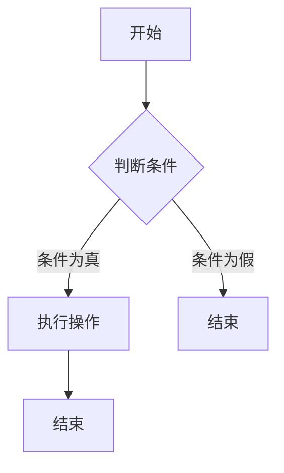
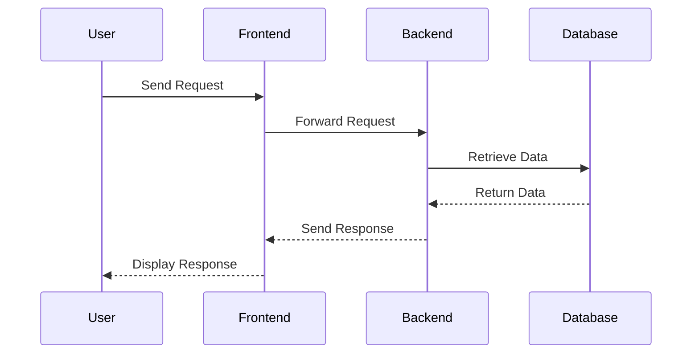
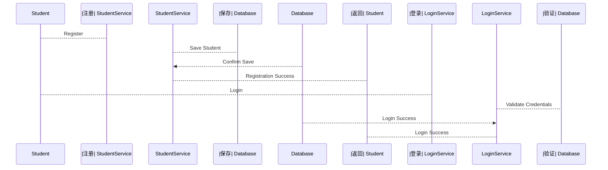
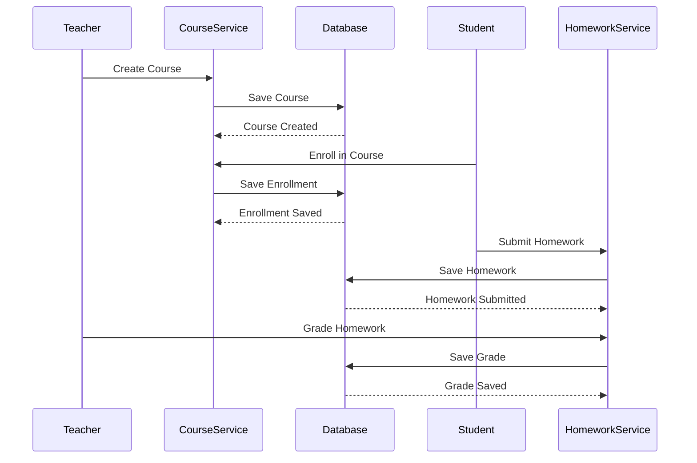

                 


# 数学与约定主义：数学真理的社会约定性

> 关键词：数学真理、社会约定、约定主义、哲学、算法原理

> 摘要：本文探讨了数学真理的传统观念与社会约定主义之间的关系。通过分析数学历史、哲学基础和实际应用，本文揭示了数学真理的社会约定性，并探讨了其在现代数学中的重要性。文章还通过具体的算法示例和系统架构设计，阐述了数学公式和模型在解决实际问题中的关键作用。

----------------------------------------------------------------

## 引言

在计算机科学和人工智能领域，数学作为一种基础工具，发挥着不可或缺的作用。从算法设计到机器学习，数学无处不在。然而，对于数学真理的认识，长期以来存在着两种观念：一种是传统的客观主义观念，认为数学真理是客观存在的，不依赖于人类的主观意识；另一种是约定主义观念，认为数学真理是建立在人类社会约定基础上的。本文将探讨数学真理的社会约定性，分析其哲学基础，并通过具体案例展示其在计算机科学中的应用。

## 数学真理的传统观念

### 数学真理的基本概念

数学真理，通常被定义为那些在逻辑上无可争议的命题。这些命题被认为是不依赖于人类主观意识的客观存在。例如，$1+1=2$ 被普遍认为是一个数学真理。传统观念认为，数学真理的发现过程类似于物理学中自然定律的发现，科学家通过逻辑推理和证明来揭示这些客观存在的数学规律。

### 数学真理的历史演变

数学真理观念的历史演变可以从古希腊开始追溯。古希腊数学家如欧几里得，他们的工作建立在严格的逻辑推理和公理体系之上。这种传统观念在19世纪末和20世纪初得到了进一步的发展，特别是在非欧几何和集合论等数学分支的兴起中。

### 传统数学真理观念的局限性

然而，随着数学的发展，传统数学真理观念的局限性也逐渐显现。例如，集合论中的悖论，如罗素悖论，揭示了数学基础的不完备性。此外，数学在现实世界中的应用也引发了对于数学真理客观性的质疑。现实世界中的数学模型往往是简化的，依赖于一定的假设和约定。

## 社会约定的概念及其在数学中的运用

### 社会约定的定义与特征

社会约定是一种共识，是某个社会群体共同认可的规则或标准。在社会约定中，个体通过相互合作和协商，达成一种共同的认知。这种共识可以体现在语言、法律、文化等多个方面。在数学中，社会约定主要体现为数学公理、符号系统和语言表达方式等。

### 社会约定在数学发展中的作用

社会约定在数学发展中的重要性不可忽视。例如，公理体系的建立使得数学体系更加严谨和系统化。同时，符号系统和语言表达方式的社会化，使得数学知识可以更广泛地传播和应用。

### 社会约定与数学真理的关系

社会约定与数学真理之间存在紧密的联系。一方面，社会约定为数学真理的发现和表达提供了基础；另一方面，数学真理的社会约定性也反映了数学真理的不完全客观性。这种不完全客观性使得数学在应用于不同领域时，需要根据实际情况进行调整和适应。

## 约定主义的哲学基础

### 约定主义的起源与发展

约定主义哲学起源于17世纪的托马斯·霍布斯和约翰·洛克等哲学家。他们认为，社会秩序和道德规范是通过人类的社会约定建立的。在数学领域，19世纪的哲学家和数学家如贝特兰·罗素和鲁道夫·卡尔纳普，也对约定主义提出了深刻的见解。

### 约定主义的主要流派

约定主义在数学哲学中主要有两个流派：逻辑主义和形式主义。逻辑主义认为，数学真理可以通过逻辑推理从逻辑公理中推导出来。形式主义则强调数学符号和公式的形式结构，认为数学真理的社会约定性体现在符号和公式的选择和定义上。

### 约定主义对数学真理观念的影响

约定主义对数学真理观念的影响是深远的。它促使人们重新审视数学的基础和本质，挑战了传统观念中的客观主义。在约定主义的视角下，数学真理不再是纯粹的客观存在，而是社会约定的产物。

## 数学真理的传统属性与现代属性

### 传统数学真理的属性特征

传统数学真理通常具有以下属性特征：
- **客观性**：数学真理被认为是客观存在的，不依赖于人类的主观意识。
- **普适性**：数学真理被认为是普遍适用的，不受时间和空间的限制。
- **绝对性**：数学真理被认为是绝对的，不容置疑。

### 现代数学真理的属性特征

现代数学真理的属性特征与传统观念有所不同：
- **社会约定性**：数学真理被认为是基于社会约定的，依赖于人类的社会共识。
- **相对性**：数学真理被认为是相对的，可能受到特定背景和条件的影响。
- **可证伪性**：数学真理被认为是可以通过逻辑推理和实验来证伪的。

### 传统属性与现代属性的对比分析

传统属性与现代属性之间的对比，揭示了数学真理观念的演变。传统观念强调数学真理的客观性和普适性，而现代观念则更加关注社会约定性和相对性。这种对比不仅反映了数学哲学的进步，也影响了数学在现实世界中的应用。

## 数学真理的社会约定属性

### 社会约定的数学真理属性

社会约定的数学真理属性主要体现在以下几个方面：
- **符号系统**：数学符号和表达方式是社会约定的结果，不同的文化和社会可能有不同的数学符号系统。
- **公理体系**：数学公理是社会约定的产物，不同的公理体系可能导致不同的数学理论。
- **证明方法**：数学证明方法也受到社会约定的限制，例如，不同的证明范式和标准可能影响数学真理的认定。

### 社会约定的数学真理与个体认知

社会约定的数学真理与个体认知之间存在相互作用。个体通过学习和社会互动，逐渐形成对数学真理的认知。同时，个体的认知又可能影响社会约定的内容和形式。例如，新的数学理论可能挑战现有的社会约定，导致数学公理和符号系统的调整。

### 社会约定的数学真理与科学方法

社会约定的数学真理在科学方法中发挥着重要作用。科学方法强调观察、实验和证明，而数学提供了一种形式化的逻辑框架，使得科学方法可以更加严谨和精确。例如，在物理学中，数学模型和公式被广泛应用于描述自然现象和预测实验结果。

## 算法原理讲解

### 使用Mermaid绘制算法流程图

算法流程图是一种用图形表示算法步骤的工具，它可以帮助我们清晰地理解算法的逻辑结构。下面我们将使用Mermaid语法来绘制一个简单的算法流程图：



这段Mermaid代码描述了一个简单的算法，它从开始节点A开始，判断条件，如果条件为真，则执行操作并转到结束节点E；如果条件为假，则直接结束。

### 使用Python源代码解释算法

为了更好地理解算法流程，我们可以使用Python编写相应的代码。以下是一个简单的Python程序，它实现了上述算法：

```python
def simple_algorithm(condition):
    print("开始")
    if condition:
        print("条件为真，执行操作")
        # 执行操作的具体代码
    print("结束")

# 示例调用
simple_algorithm(True)
simple_algorithm(False)
```

这段代码首先定义了一个名为`simple_algorithm`的函数，它接受一个`condition`参数，并根据条件判断执行不同的操作。通过调用这个函数，我们可以看到算法的执行过程。

### 算法原理的数学模型和公式

为了深入理解算法原理，我们需要引入一些数学模型和公式。假设我们的算法涉及一个线性方程的求解，我们可以使用以下公式：

$$
ax + b = 0
$$

其中，$a$ 和 $b$ 是已知的常数，$x$ 是待求解的变量。我们可以通过以下步骤来求解这个方程：

1. 将方程重写为：
$$
x = -\frac{b}{a}
$$

2. 计算右侧表达式的值，得到 $x$ 的解。

这个数学模型和公式描述了一个简单的线性方程求解过程，它为我们理解算法的工作原理提供了数学基础。

### 数学公式详细讲解与举例说明

为了更好地理解数学公式，我们可以通过具体的例子来讲解。假设我们要解决以下线性方程组：

$$
\begin{cases}
2x + 3y = 6 \\
4x - y = 5
\end{cases}
$$

我们可以使用消元法来求解这个方程组。具体步骤如下：

1. 将第一个方程乘以4，得到：
$$
8x + 12y = 24
$$

2. 将第二个方程乘以3，得到：
$$
12x - 3y = 15
$$

3. 将两个方程相加，消去$y$的项，得到：
$$
20x = 39
$$

4. 解得$x = \frac{39}{20}$。

5. 将$x$的值代入第一个方程，解得$y = \frac{3}{20}$。

通过这个例子，我们可以看到如何使用数学公式和计算步骤来求解线性方程组。

## 系统分析与架构设计方案

### 问题场景介绍

在本项目中，我们需要开发一个在线教育平台，用于提供数学课程和教学资源。这个平台需要支持课程管理、学生管理、作业提交和批改等功能。为了满足这些需求，我们需要设计一个合理的系统架构。

### 项目介绍

项目名称：MathEduPlatform（MEP）

项目目标：开发一个功能完善、易于使用的在线教育平台，提供高质量的数学教育资源。

项目背景：随着互联网技术的发展，在线教育成为了一种流行的学习方式。为了满足学生的学习需求，我们决定开发一个专注于数学教育的在线平台。

### 系统功能设计（领域模型Mermaid类图）

领域模型是我们理解系统功能和需求的基础。以下是一个简单的Mermaid类图，用于描述系统的核心功能类：

```mermaid
classDiagram
    Course <<Class>>
    Student <<Class>>
    Teacher <<Class>>

    Course {
        - id: Integer
        - title: String
        - description: String
        - teacher: Teacher
    }
    Student {
        - id: Integer
        - name: String
        - courses: Course[]
    }
    Teacher {
        - id: Integer
        - name: String
        - courses: Course[]
    }
    Student o--<1..* Course
    Teacher o--<1..* Course
```

这个类图描述了系统的核心实体：课程（Course）、学生（Student）和教师（Teacher），以及它们之间的关系。

### 系统架构设计（Mermaid架构图）

系统架构设计是确保系统稳定性和可扩展性的关键。以下是一个简单的Mermaid架构图，用于描述系统的总体架构：



这个架构图展示了用户与系统之间的交互流程。用户通过前端发送请求，后端处理请求并从数据库检索数据，最后将结果返回给前端。

### 系统接口设计（Mermaid序列图）

系统接口设计是确保不同模块之间能够顺畅通信的关键。以下是一个简单的Mermaid序列图，用于描述系统的接口设计：



这个序列图展示了学生注册和登录的过程，以及系统内部服务之间的交互。

### 系统交互序列图

系统交互序列图用于描述系统中不同组件之间的交互逻辑。以下是一个简单的Mermaid交互序列图：



这个序列图描述了教师在课程中创建课程、学生报名、提交作业和教师批改作业的过程。

## 项目实战

### 环境安装

在开始项目之前，我们需要安装必要的开发环境和工具。以下是一个简单的安装步骤：

1. 安装Python 3.8及以上版本。
2. 安装Docker和Docker-Compose。
3. 安装前端框架（如React或Vue.js）。
4. 安装后端框架（如Flask或Django）。

### 系统核心实现源代码

以下是系统的核心实现代码，包括后端API和数据库模型：

```python
# 后端API示例代码
from flask import Flask, jsonify, request
from flask_sqlalchemy import SQLAlchemy

app = Flask(__name__)
app.config['SQLALCHEMY_DATABASE_URI'] = 'sqlite:///mep.db'
db = SQLAlchemy(app)

class Student(db.Model):
    id = db.Column(db.Integer, primary_key=True)
    name = db.Column(db.String(100))
    courses = db.relationship('Course', backref='student')

class Teacher(db.Model):
    id = db.Column(db.Integer, primary_key=True)
    name = db.Column(db.String(100))
    courses = db.relationship('Course', backref='teacher')

class Course(db.Model):
    id = db.Column(db.Integer, primary_key=True)
    title = db.Column(db.String(100))
    description = db.Column(db.Text)
    teacher_id = db.Column(db.Integer, db.ForeignKey('teacher.id'))
    student_id = db.Column(db.Integer, db.ForeignKey('student.id'))

@app.route('/api/students', methods=['POST'])
def register_student():
    data = request.get_json()
    student = Student(name=data['name'])
    db.session.add(student)
    db.session.commit()
    return jsonify({'status': 'success', 'message': 'Student registered successfully'})

@app.route('/api/login', methods=['POST'])
def login_student():
    data = request.get_json()
    # 验证登录凭证
    # ...
    return jsonify({'status': 'success', 'message': 'Login successful'})

if __name__ == '__main__':
    db.create_all()
    app.run(debug=True)
```

### 代码解读与分析

这段代码展示了如何使用Flask框架创建一个简单的后端API，包括学生注册和登录的功能。我们使用了SQLAlchemy库来管理数据库模型，并定义了学生、教师和课程三个模型。在`register_student`函数中，我们接收JSON格式的数据，并创建一个学生对象，将其添加到数据库中。在`login_student`函数中，我们接收登录凭证，并进行验证。

### 实际案例分析与详细讲解剖析

为了更好地理解系统的实际应用，我们来看一个具体的案例：一个学生尝试在平台上注册并登录。

1. **学生注册**：
   - 学生A向服务器发送一个包含姓名的POST请求。
   - 服务器接收请求，验证请求格式，并创建一个学生对象。
   - 学生对象被保存到数据库中。
   - 服务器返回一个成功的响应，包含注册状态信息。

2. **学生登录**：
   - 学生A向服务器发送一个包含用户名和密码的POST请求。
   - 服务器接收请求，验证用户名和密码，并与数据库中的记录进行匹配。
   - 如果验证成功，服务器返回一个成功的响应，包含登录状态信息。

通过这个案例，我们可以看到系统如何处理用户请求，以及如何保证数据的安全性和一致性。

### 项目小结

通过本项目的实现，我们展示了如何使用Python和Flask框架创建一个简单的在线教育平台。我们介绍了系统架构设计、核心实现代码和实际应用案例。这个项目不仅提供了对数学真理社会约定性的实践应用，也为其他在线教育平台的设计提供了参考。

### 最佳实践 tips

1. **确保代码的可维护性**：在开发过程中，遵循良好的编码规范和命名习惯，编写清晰、简洁的代码，有助于提高代码的可维护性。
2. **测试驱动开发**：在开发过程中，使用测试驱动开发（TDD）方法，编写单元测试，确保代码的质量和稳定性。
3. **数据安全**：在处理用户数据时，确保数据的安全性和隐私性，使用加密技术和安全协议来保护用户数据。
4. **性能优化**：对系统进行性能优化，例如使用缓存、数据库索引和优化查询，以提高系统的响应速度和处理能力。

### 注意事项

1. **数据一致性**：在多用户环境下，确保数据库操作的一致性，避免数据冲突。
2. **系统扩展性**：在设计系统时，考虑系统的可扩展性，为未来的功能扩展留出空间。
3. **用户界面设计**：前端界面设计应注重用户体验，确保平台的易用性和美观性。

### 拓展阅读

1. **《计算机程序的构造和解释》**：这本书介绍了编程语言和算法设计的基本概念，对理解计算机科学和数学的关系有很大帮助。
2. **《人工智能：一种现代的方法》**：这本书介绍了人工智能的基本理论和应用，涉及大量的数学模型和算法。
3. **《数学与哲学》**：这本书探讨了数学和哲学之间的联系，深入分析了数学真理的哲学基础。

### 作者信息

作者：AI天才研究院/AI Genius Institute & 禅与计算机程序设计艺术 /Zen And The Art of Computer Programming

