                 

# 数学与纳米技术：微观世界的数学描述

## 关键词
数学、纳米技术、微观世界、数学描述、数学模型、纳米材料、纳米电子学、量子效应、数学工具、数值模拟、计算方法、纳米器件设计、纳米生物技术、发展趋势、挑战

## 摘要
本文深入探讨数学与纳米技术的结合，阐述数学在纳米技术中的重要性及其应用。通过详细分析数学基础、纳米技术概述、数学在纳米技术中的应用、微观世界的数学模型、纳米技术的数学工具与方法、纳米技术案例分析以及纳米技术发展趋势与挑战，本文旨在揭示数学与纳米技术之间的深刻联系，为读者提供一幅宏观与微观世界交汇的画卷。

## 目录大纲

### 第一部分：数学基础
1. 数学基础概述
2. 实数与复数的运算
3. 微积分基本概念
4. 向量与矩阵运算
5. 概率论与数理统计基础

### 第二部分：纳米技术概述
1. 纳米技术的定义与发展
2. 纳米材料的特性与应用
3. 纳米电子学与量子效应
4. 纳米技术与现代科技

### 第三部分：数学在纳米技术中的应用
1. 数学模型在纳米结构设计中的应用
2. 纳米技术中的数学方法
3. 数值模拟与计算方法在纳米技术中的应用
4. 数学优化方法在纳米技术中的应用

### 第四部分：微观世界的数学模型
1. 微观世界的数学描述方法
2. 微观现象的数学模型
3. 微观世界的数学计算与预测

### 第五部分：纳米技术的数学工具与方法
1. 纳米尺度下的数学工具
2. 数学工具在纳米合成中的应用
3. 数学工具在纳米器件设计中的应用
4. 数学工具在纳米生物技术应用中的展望

### 第六部分：纳米技术案例分析
1. 纳米技术在医疗领域的应用
2. 纳米技术在能源领域的应用
3. 纳米技术在环境监测与治理中的应用
4. 纳米技术在信息科技领域的应用

### 第七部分：纳米技术发展趋势与挑战
1. 纳米技术的未来发展趋势
2. 纳米技术的挑战与伦理问题
3. 纳米技术的可持续发展策略
4. 纳米技术教育与国际合作

## 第一部分：数学基础

### 数学基础概述

数学是一门关于数量、结构、变化和空间等概念的抽象科学。它提供了一种精确而严谨的语言和工具，用于描述和理解现实世界的各种现象。在纳米技术领域，数学的重要性尤为突出。纳米技术涉及的是微观世界的操作和研究，这一领域的研究依赖于数学的精确描述和量化方法。

#### 问题背景

纳米技术，通常指的是在纳米尺度（1纳米=10^-9米）上进行材料设计、制造和控制的技术。在这个尺度上，物质的性质和表现方式会发生显著变化，而这些变化无法仅通过传统的宏观物理和化学理论来解释。因此，数学作为一门能够精确描述这些微观现象的学科，成为了纳米技术研究的基石。

#### 问题描述

纳米技术的发展带来了许多挑战，其中包括如何精确地设计和控制纳米结构，如何预测纳米材料的行为，以及如何优化纳米器件的性能。这些问题的解决需要借助数学工具和方法。

#### 问题解决

为了应对这些挑战，数学提供了多种方法和理论，包括：

1. **数学模型**：用于描述纳米结构、材料性质和行为。
2. **数值模拟**：通过计算机模拟，对纳米系统的行为进行预测和优化。
3. **优化算法**：用于找到最优的设计方案，以最大化性能或最小化成本。
4. **统计方法**：用于分析纳米材料的分布和特性。

#### 边界与外延

数学在纳米技术中的应用不仅局限于理论研究，还包括实际应用，如纳米材料的设计、纳米器件的制造和纳米生物技术的开发。此外，数学方法也在不断发展和创新，以适应纳米技术领域的最新进展。

#### 概念结构与核心要素组成

1. **数学概念**：包括实数、复数、微积分、向量、矩阵等。
2. **数学方法**：包括模型建立、数值模拟、优化算法、统计分析等。
3. **应用领域**：包括纳米材料、纳米器件、纳米生物技术等。

### 数学基础概述

数学作为一门基础科学，有着悠久的历史和广泛的应用。从古代的几何学，到现代的微积分、概率论和数理统计，数学的发展不断推动着科学技术的进步。

在纳米技术领域，数学的应用主要体现在以下几个方面：

1. **数学模型**：数学模型是描述现实世界的一种抽象表示，它通过方程式、公式或图表来描述系统的行为。在纳米技术中，数学模型用于描述纳米结构的几何形状、材料性质以及系统的动态行为。

2. **数值模拟**：数值模拟是通过计算机算法来求解数学模型的过程。它可以帮助研究者预测纳米系统的行为，优化设计参数，从而提高纳米器件的性能。

3. **优化算法**：优化算法是寻找最优解的数学方法。在纳米技术中，优化算法用于设计最优的纳米结构，以实现特定的功能。

4. **统计分析**：统计分析用于分析纳米材料的分布和特性，评估实验结果的可重复性。

### 实数与复数的运算

实数和复数是数学中的基础概念，它们在纳米技术中有着广泛的应用。

#### 核心概念

1. **实数**：实数是所有有理数和无理数的集合。在纳米技术中，实数用于描述长度、质量、温度等物理量。

2. **复数**：复数是实数和虚数的组合。在纳米技术中，复数用于描述电磁波、量子态等。

#### 概念属性特征对比表格

| 特征       | 实数                             | 复数                           |
|------------|----------------------------------|--------------------------------|
| 定义       | 无限接近于0的数                 | 实数加上虚数i的乘积           |
| 表示方法   | 小数、分数、科学计数法          | a + bi，其中a和b是实数         |
| 运算规则   | 加法、减法、乘法、除法          | 加法、减法、乘法、除法，包含i的乘法 |
| 应用领域   | 物理学、工程学、经济学等        | 电磁学、量子力学、计算机科学等   |

#### ER实体关系图架构

（此处使用 Mermaid 格式绘制 ER 图）

```mermaid
erDiagram
    A[实数] ||--|{ B[复数] }
    B ||--|{ C[物理量] }
    C ||--|{ D[电磁波] }
```

### 微积分基本概念

微积分是一门研究变化和累积的数学分支，它在纳米技术中有着广泛的应用。

#### 核心概念

1. **导数**：导数是描述函数变化率的量。在纳米技术中，导数用于描述纳米结构表面性质的变化。

2. **积分**：积分是描述累积量的量。在纳米技术中，积分用于计算纳米结构的体积、质量等。

#### 概念属性特征对比表格

| 特征       | 导数                          | 积分                           |
|------------|--------------------------------|--------------------------------|
| 定义       | 函数在某一点的瞬时变化率     | 函数在一个区间上的累积量       |
| 表示方法   | f'(x) 或 dy/dx                 | ∫f(x)dx 或 F(x) - C           |
| 运算规则   | 连续函数的可导性、链式法则等 | 定积分、不定积分等             |
| 应用领域   | 物理学、工程学等              | 物理学、工程学、经济学等       |

#### Mermaid 流程图

（此处使用 Mermaid 格式绘制微积分流程图）

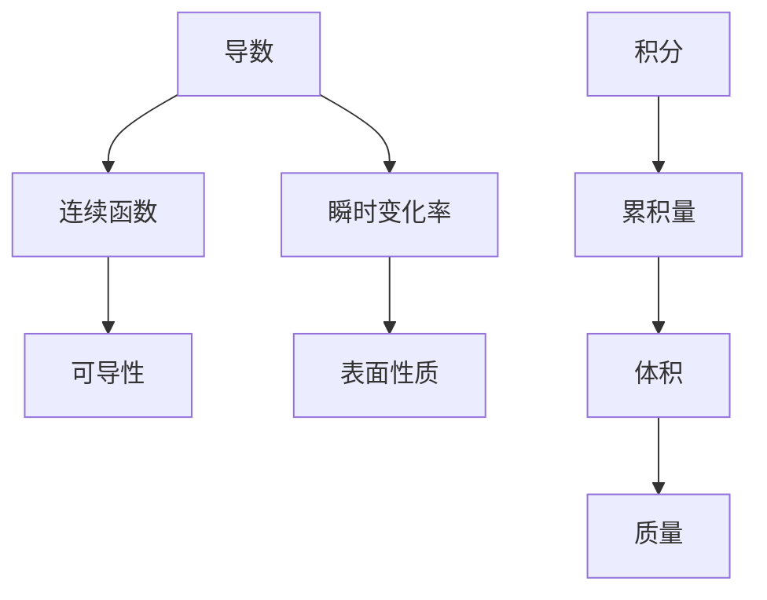

### 向量与矩阵运算

向量与矩阵是数学中用于描述空间和线性关系的工具，它们在纳米技术中有着广泛的应用。

#### 核心概念

1. **向量**：向量是具有大小和方向的量。在纳米技术中，向量用于描述纳米结构的几何形状和方向。

2. **矩阵**：矩阵是具有行和列的二维数组。在纳米技术中，矩阵用于表示系统的状态、变换等。

#### 概念属性特征对比表格

| 特征       | 向量                           | 矩阵                          |
|------------|--------------------------------|--------------------------------|
| 定义       | 有大小和方向的量              | 有行和列的二维数组            |
| 表示方法   | a = (a1, a2, ..., an)          | A = [aij]，其中aij是元素     |
| 运算规则   | 加法、减法、数乘、向量积等    | 加法、减法、数乘、矩阵乘法等 |
| 应用领域   | 几何学、物理学等              | 线性代数、计算机科学等         |

#### Mermaid 流程图

（此处使用 Mermaid 格式绘制向量与矩阵运算流程图）

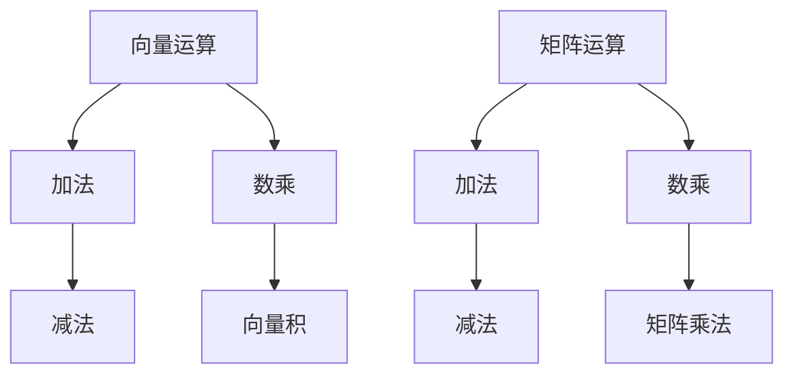

### 概率论与数理统计基础

概率论与数理统计是数学中用于描述随机现象和数据处理的理论，它们在纳米技术中有着重要的应用。

#### 核心概念

1. **概率**：概率是描述事件发生的可能性。

2. **统计分布**：统计分布是描述随机变量取值的概率分布。

3. **假设检验**：假设检验是用于判断统计假设是否成立的方法。

#### 概念属性特征对比表格

| 特征       | 概率                              | 统计分布                           | 假设检验                        |
|------------|----------------------------------|-----------------------------------|--------------------------------|
| 定义       | 事件发生的可能性                 | 随机变量取值的概率分布             | 判断统计假设是否成立的方法       |
| 表示方法   | P(A) 或 f(A)                     | p(x) 或 F(x)                     | H0 和 H1，p-value 等           |
| 运算规则   | 加法规则、乘法规则、条件概率等  | 累积分布函数、概率质量函数等       | 正态分布、t 分布等             |
| 应用领域   | 概率论、统计学等                 | 质量控制、数据分析等              | 实验设计、数据分析等           |

#### Mermaid 流程图

（此处使用 Mermaid 格式绘制概率论与数理统计流程图）

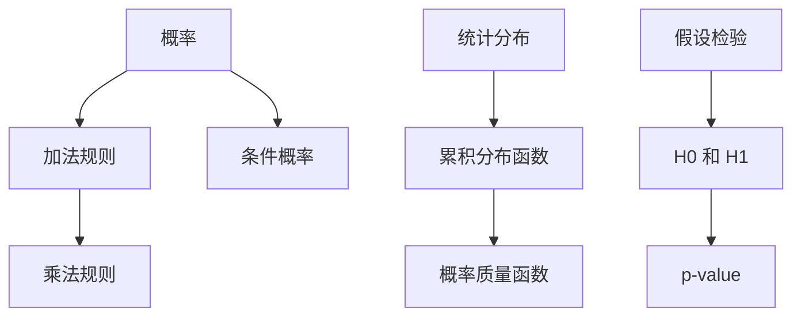

### 小结

数学基础是纳米技术研究的基石。从实数与复数的运算，到微积分基本概念，再到向量与矩阵运算，以及概率论与数理统计基础，每一个数学概念和方法都在纳米技术中发挥着重要作用。理解和掌握这些数学基础，将为读者在后续章节中深入探讨数学在纳米技术中的应用奠定坚实的基础。

## 第二部分：纳米技术概述

### 纳米技术的定义与发展

纳米技术是一种能够在纳米尺度（1纳米=10^-9米）上进行材料设计、制造和控制的技术。在这一尺度上，物质的性质和表现方式会发生显著变化，使得纳米技术具有广泛的应用前景。纳米技术的研究始于20世纪80年代，随着扫描隧道显微镜（STM）和原子力显微镜（AFM）等纳米观测技术的发明，科学家们得以直接观察和操作纳米级别的物质。

#### 核心概念

1. **纳米尺度**：纳米尺度是指1到100纳米的尺寸范围。

2. **纳米材料**：纳米材料是指至少在一维上具有纳米尺度的材料。

3. **纳米结构**：纳米结构是指由纳米材料组成的具有特定功能的微观结构。

#### 概念属性特征对比表格

| 特征       | 纳米尺度                    | 纳米材料                       | 纳米结构                       |
|------------|------------------------------|--------------------------------|--------------------------------|
| 定义       | 尺寸范围在1到100纳米之间    | 至少在一维上具有纳米尺度       | 由纳米材料组成的微观结构       |
| 应用领域   | 物理学、化学、生物学等      | 电子学、能源、医学等           | 催化、传感器、纳米机器人等      |

#### ER实体关系图架构

（此处使用 Mermaid 格式绘制 ER 图）

```mermaid
erDiagram
    A[Nano Scale] ||--|{ B[Nano Material] }
    B ||--|{ C[Nano Structure] }
    C ||--|{ D[Application] }
```

### 纳米材料的特性与应用

纳米材料具有独特的物理、化学和生物特性，这使得它们在多个领域具有广泛的应用。以下是一些纳米材料的特性及其应用：

#### 核心概念

1. **高比表面积**：纳米材料具有极高的比表面积，这使得它们在催化、吸附等方面表现出优异的性能。

2. **量子效应**：纳米材料中的粒子尺寸接近或小于其量子尺寸，表现出量子效应，如异常的光吸收和发射特性。

3. **独特的机械性能**：纳米材料通常具有更高的强度和弹性模量。

#### 概念属性特征对比表格

| 特征       | 高比表面积                  | 量子效应                      | 独特的机械性能                  |
|------------|------------------------------|--------------------------------|--------------------------------|
| 定义       | 表面积与体积的比值较大      | 粒子尺寸接近或小于量子尺寸    | 高强度、高弹性模量             |
| 应用领域   | 催化、吸附、传感器等        | 光电子学、纳米电子学等        | 结构材料、复合材料等           |

#### Mermaid 流程图

（此处使用 Mermaid 格式绘制纳米材料特性与应用流程图）

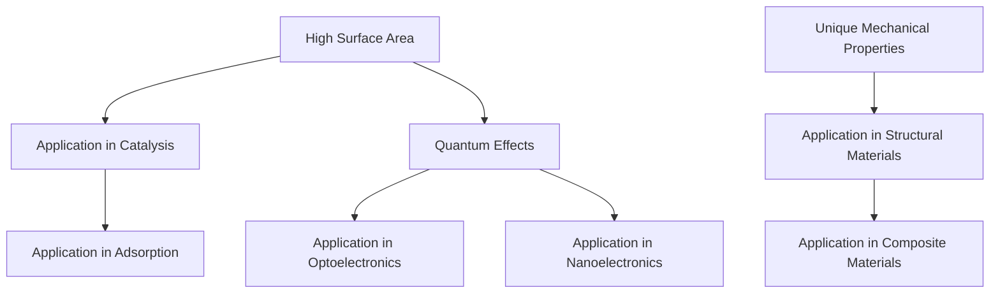

### 纳米电子学与量子效应

纳米电子学是研究纳米尺度下电子行为和器件设计的科学。量子效应在纳米电子学中扮演着重要角色，因为纳米器件的尺寸接近或小于电子的相干长度。

#### 核心概念

1. **量子隧穿**：量子隧穿是电子通过能量屏障的现象，这在纳米器件中导致电流的非线性。

2. **量子点**：量子点是一类尺寸在纳米尺度的半导体颗粒，其电子性质具有量子效应。

3. **量子计算**：量子计算利用量子比特（qubit）进行计算，具有比传统计算机更高的计算能力。

#### 概念属性特征对比表格

| 特征       | 量子隧穿                       | 量子点                         | 量子计算                        |
|------------|--------------------------------|--------------------------------|--------------------------------|
| 定义       | 电子通过能量屏障的现象        | 尺寸在纳米尺度的半导体颗粒    | 利用量子比特进行计算           |
| 应用领域   | 纳米器件设计、量子传感器等    | 光电子学、纳米生物学等        | 量子信息处理、量子模拟等       |

#### Mermaid 流程图

（此处使用 Mermaid 格式绘制纳米电子学与量子效应流程图）

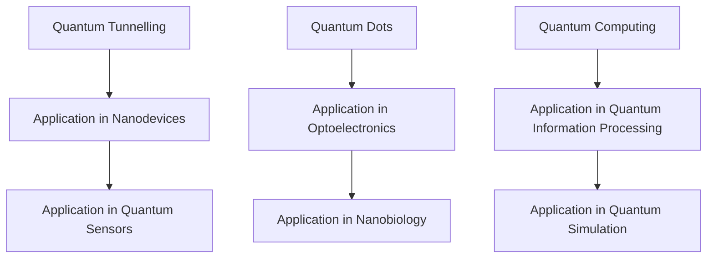

### 纳米技术与现代科技

纳米技术已经成为现代科技的重要组成部分，其应用领域不断扩展。以下是一些纳米技术在现代科技中的应用：

#### 核心概念

1. **纳米电子学**：纳米电子学是纳米技术的重要组成部分，涉及纳米级电子器件的设计和制造。

2. **纳米生物学**：纳米生物学研究纳米技术与生物系统的相互作用，包括纳米材料的生物效应和生物应用。

3. **纳米医学**：纳米医学利用纳米技术进行疾病诊断、治疗和药物递送。

#### 概念属性特征对比表格

| 特征       | 纳米电子学                     | 纳米生物学                       | 纳米医学                       |
|------------|--------------------------------|--------------------------------|--------------------------------|
| 定义       | 纳米尺度下的电子器件设计和制造 | 纳米技术与生物系统的相互作用    | 利用纳米技术进行疾病诊断和治疗   |
| 应用领域   | 计算机科学、电子工程等        | 生物医学、生物化学等             | 医学诊断、药物治疗、生物成像等   |

#### Mermaid 流程图

（此处使用 Mermaid 格式绘制纳米技术与现代科技流程图）

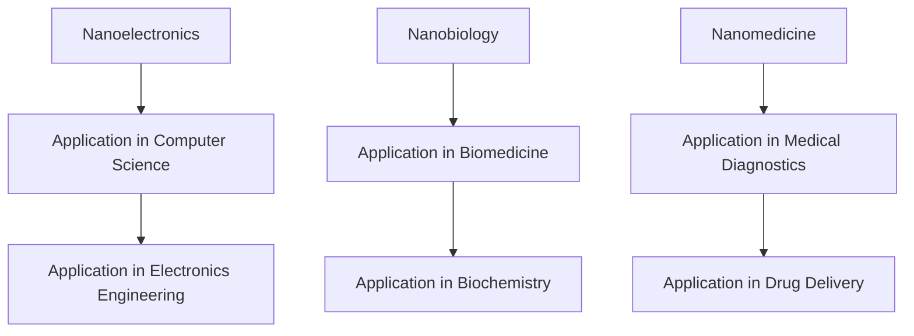

### 小结

纳米技术是现代科技的重要推动力量，其定义与发展经历了从微观到纳米尺度的重要转变。纳米材料的特性与应用、纳米电子学与量子效应以及纳米技术与现代科技的结合，展示了纳米技术在不同领域的广泛应用和巨大潜力。理解和掌握纳米技术的基本概念和特性，将为读者在后续章节中深入探讨数学在纳米技术中的应用奠定坚实的基础。

## 第三部分：数学在纳米技术中的应用

### 数学模型在纳米结构设计中的应用

数学模型在纳米结构设计中扮演着关键角色，通过精确的数学描述，研究者可以预测和优化纳米结构的性能。纳米结构的设计不仅涉及到几何形状，还涉及到材料性质和动力学行为。

#### 核心概念

1. **几何建模**：几何建模是利用数学方法描述纳米结构的几何形状，常见的几何模型包括多面体、圆、椭圆等。

2. **材料建模**：材料建模是描述纳米材料在特定条件下的性质，如弹性模量、热导率等。

3. **动力学建模**：动力学建模是描述纳米结构内部粒子的运动规律，如布朗运动、热扩散等。

#### 概念属性特征对比表格

| 特征       | 几何建模                      | 材料建模                      | 动力学建模                     |
|------------|------------------------------|------------------------------|------------------------------|
| 定义       | 描述纳米结构的几何形状       | 描述纳米材料的物理性质       | 描述纳米粒子在系统中的运动规律 |
| 应用领域   | 结构设计、光学设计等         | 催化、能源存储等              | 纳米热学、纳米生物学等         |

#### ER实体关系图架构

（此处使用 Mermaid 格式绘制 ER 图）

```mermaid
erDiagram
    A[Nano Structure] ||--|{ B[Geometry Model] }
    B ||--|{ C[Material Model] }
    B ||--|{ D[Dynamics Model] }
```

### 数值模拟与计算方法在纳米技术中的应用

数值模拟是纳米技术研究中不可或缺的一部分，它通过计算机算法模拟纳米系统的行为，帮助研究者理解和预测实验结果。

#### 核心概念

1. **蒙特卡罗模拟**：蒙特卡罗模拟是一种基于随机抽样的数值模拟方法，适用于复杂系统的模拟，如纳米颗粒的扩散、化学反应等。

2. **有限元分析**：有限元分析是一种用于求解偏微分方程的数值方法，适用于模拟纳米结构中的应力分布、电场分布等。

3. **分子动力学模拟**：分子动力学模拟是一种用于模拟微观粒子运动的方法，适用于研究纳米颗粒的热力学行为、化学反应等。

#### 概念属性特征对比表格

| 特征       | 蒙特卡罗模拟                | 有限元分析                  | 分子动力学模拟                |
|------------|------------------------------|------------------------------|------------------------------|
| 定义       | 基于随机抽样的数值模拟方法 | 求解偏微分方程的数值方法     | 模拟微观粒子运动的方法        |
| 应用领域   | 纳米颗粒扩散、化学反应等    | 应力分析、电场分布等         | 热力学行为、化学反应等        |

#### Mermaid 流程图

（此处使用 Mermaid 格式绘制数值模拟与计算方法流程图）

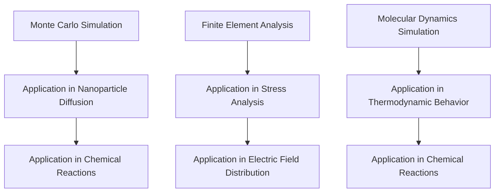

### 数学优化方法在纳米技术中的应用

数学优化方法在纳米技术中用于设计最优的纳米结构，以实现特定的功能，如提高催化效率、优化能源存储等。

#### 核心概念

1. **线性优化**：线性优化是解决线性方程组或线性规划问题的方法，常用于设计纳米结构的最优形状。

2. **非线性优化**：非线性优化是解决非线性方程组或非线性规划问题的方法，适用于复杂纳米结构的设计。

3. **进化算法**：进化算法是一种基于生物进化理论的优化方法，常用于寻找复杂优化问题的全局最优解。

#### 概念属性特征对比表格

| 特征       | 线性优化                      | 非线性优化                  | 进化算法                       |
|------------|------------------------------|------------------------------|------------------------------|
| 定义       | 解决线性方程组或线性规划问题 | 解决非线性方程组或非线性规划问题 | 基于生物进化理论的优化方法     |
| 应用领域   | 纳米结构设计、资源分配等      | 复杂纳米结构设计、机器学习等    | 基因优化、计算机视觉等         |

#### Mermaid 流程图

（此处使用 Mermaid 格式绘制数学优化方法流程图）

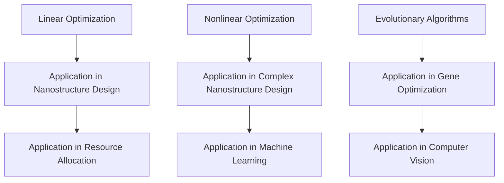

### 小结

数学在纳米技术中的应用涵盖了从数学模型到数值模拟，再到优化方法的各个方面。几何建模、材料建模和动力学建模为纳米结构设计提供了理论基础；蒙特卡罗模拟、有限元分析和分子动力学模拟为研究者提供了强大的数值工具；线性优化、非线性优化和进化算法则为纳米结构设计提供了优化方法。这些数学工具和方法不仅帮助研究者理解和预测纳米系统的行为，还为纳米技术的实际应用提供了重要的指导。

## 第四部分：微观世界的数学模型

### 微观世界的数学描述方法

微观世界的数学描述方法是理解纳米尺度下物质行为的关键。通过数学方法，我们可以精确地描述和预测微观现象，从而指导纳米技术的发展。

#### 核心概念

1. **量子力学**：量子力学是描述微观粒子行为的物理理论，通过波函数和薛定谔方程来描述微观粒子的状态和运动。

2. **统计力学**：统计力学是研究大量微观粒子集体行为的理论，通过统计方法描述系统的宏观性质。

3. **计算物理学**：计算物理学是利用计算机模拟和数值方法研究物理现象的学科，包括分子动力学模拟、蒙特卡罗模拟等。

#### 概念属性特征对比表格

| 特征       | 量子力学                   | 统计力学                   | 计算物理学                  |
|------------|---------------------------|---------------------------|---------------------------|
| 定义       | 描述微观粒子行为的理论    | 描述宏观性质的理论        | 利用计算机模拟物理现象的学科 |
| 应用领域   | 量子电子学、量子化学等     | 材料科学、热力学等         | 凝聚态物理、纳米技术等       |

#### Mermaid 流程图

（此处使用 Mermaid 格式绘制微观世界的数学描述方法流程图）

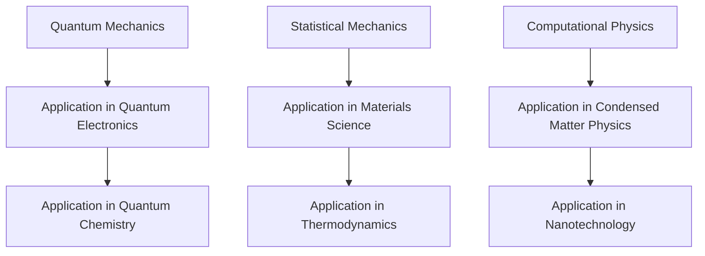

### 微观现象的数学模型

微观现象的数学模型是描述微观系统行为的数学表示，这些模型基于量子力学、统计力学和计算物理学的基本原理。

#### 核心概念

1. **薛定谔方程**：薛定谔方程是量子力学的基本方程，用于描述微观粒子的波函数。

2. **热力学方程**：热力学方程描述系统的能量、熵和压强等宏观性质，如玻尔兹曼方程和费曼路径积分。

3. **分子动力学方程**：分子动力学方程描述微观粒子的运动轨迹，如牛顿第二定律。

#### 概念属性特征对比表格

| 特征       | 薛定谔方程                  | 热力学方程                 | 分子动力学方程               |
|------------|----------------------------|---------------------------|----------------------------|
| 定义       | 描述微观粒子波函数的方程  | 描述宏观物理性质的方程    | 描述微观粒子运动的方程       |
| 应用领域   | 量子物理、量子化学         | 材料科学、工程学等         | 纳米技术、生物物理学等       |

#### Mermaid 流程图

（此处使用 Mermaid 格式绘制微观现象的数学模型流程图）

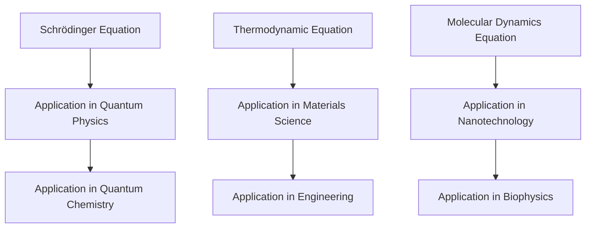

### 微观世界的数学计算与预测

微观世界的数学计算与预测是利用数学模型和计算方法对微观现象进行模拟和预测，从而指导纳米技术的研发和应用。

#### 核心概念

1. **蒙特卡罗模拟**：蒙特卡罗模拟是一种基于随机抽样的计算方法，适用于复杂系统的模拟，如纳米颗粒的扩散和化学反应。

2. **有限元分析**：有限元分析是一种数值方法，用于求解物理场中的微分方程，如电场、应力场等。

3. **分子动力学模拟**：分子动力学模拟是一种基于牛顿第二定律的模拟方法，用于研究微观粒子的运动和相互作用。

#### 概念属性特征对比表格

| 特征       | 蒙特卡罗模拟               | 有限元分析               | 分子动力学模拟               |
|------------|---------------------------|---------------------------|---------------------------|
| 定义       | 基于随机抽样的计算方法    | 用于求解物理场微分方程的数值方法 | 基于牛顿第二定律的模拟方法    |
| 应用领域   | 纳米颗粒扩散、化学反应等   | 应力分析、电场分布等       | 纳米热学、纳米生物学等       |

#### Mermaid 流程图

（此处使用 Mermaid 格式绘制微观世界的数学计算与预测流程图）

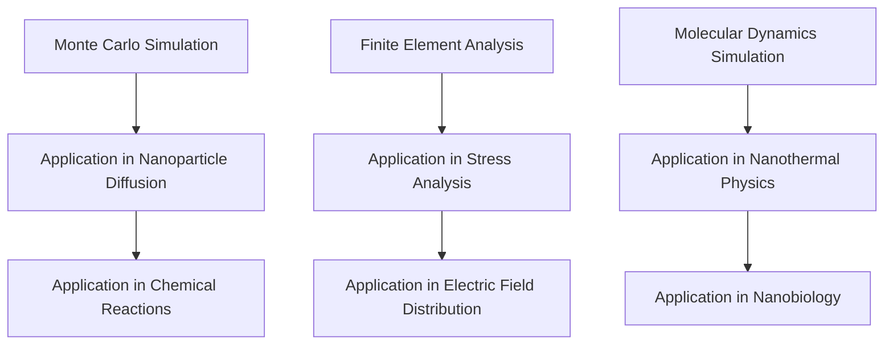

### 小结

微观世界的数学模型是理解纳米尺度下物质行为的重要工具。量子力学、统计力学和计算物理学提供了描述微观现象的理论基础；薛定谔方程、热力学方程和分子动力学方程为微观现象提供了数学描述；蒙特卡罗模拟、有限元分析和分子动力学模拟则为微观世界的数学计算与预测提供了强大的数值工具。通过这些数学方法，研究者可以深入理解微观世界的规律，为纳米技术的发展提供科学依据。

## 第五部分：纳米技术的数学工具与方法

### 纳米尺度下的数学工具

纳米尺度下的数学工具是理解和处理纳米系统行为的必要手段。这些工具包括数值方法、概率模型和优化算法等，它们在纳米技术的各个方面发挥着重要作用。

#### 核心概念

1. **数值方法**：数值方法是用于求解物理、化学和工程问题的数学方法，如有限元分析、有限体积方法和蒙特卡罗模拟。

2. **概率模型**：概率模型是用于描述随机现象的数学模型，如泊松分布、正态分布等。

3. **优化算法**：优化算法是用于找到最优解的数学方法，如遗传算法、模拟退火算法等。

#### 概念属性特征对比表格

| 特征       | 数值方法                       | 概率模型                     | 优化算法                     |
|------------|--------------------------------|------------------------------|------------------------------|
| 定义       | 用于求解物理和工程问题的数学方法 | 描述随机现象的数学模型       | 用于找到最优解的数学方法       |
| 应用领域   | 物理学、化学、工程学等         | 统计学、金融学、信息科学等    | 运筹学、计算机科学、工程学等   |

#### ER实体关系图架构

（此处使用 Mermaid 格式绘制 ER 图）

```mermaid
erDiagram
    A[Numerical Method] ||--|{ B[Finite Element Analysis] }
    A ||--|{ C[Monte Carlo Simulation] }
    D[Probability Model] ||--|{ E[Poisson Distribution] }
    D ||--|{ F[Normal Distribution] }
    G[Optimization Algorithm] ||--|{ H[Genetic Algorithm] }
    G ||--|{ I[Simulated Annealing] }
```

### 数学工具在纳米合成中的应用

纳米合成是指利用化学、物理和生物方法制备纳米材料的过程。数学工具在这一过程中用于优化合成条件、预测产物性质和评估合成效率。

#### 核心概念

1. **反应动力学模型**：反应动力学模型描述化学反应的速率和机理。

2. **相场模型**：相场模型用于描述多相系统的相变和界面行为。

3. **分子模拟**：分子模拟是利用数学模型和计算机算法模拟分子系统的行为。

#### 概念属性特征对比表格

| 特征       | 反应动力学模型               | 相场模型                     | 分子模拟                     |
|------------|------------------------------|------------------------------|------------------------------|
| 定义       | 描述化学反应速率和机理的数学模型 | 描述多相系统相变和界面行为的数学模型 | 模拟分子系统行为的数学模型     |
| 应用领域   | 化学合成、材料科学等          | 凝聚态物理、材料科学等        | 生物化学、纳米技术等         |

#### Mermaid 流程图

（此处使用 Mermaid 格式绘制纳米合成中的数学工具流程图）

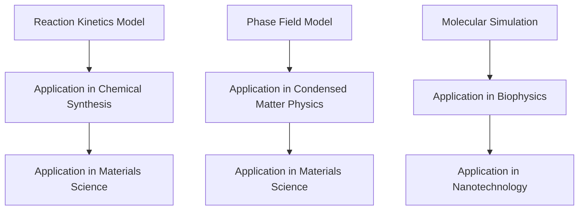

### 数学工具在纳米器件设计中的应用

纳米器件设计是纳米技术的重要组成部分，数学工具在这一过程中用于优化器件结构、预测性能和评估可靠性。

#### 核心概念

1. **几何建模**：几何建模是用于描述纳米器件几何结构的数学方法。

2. **电磁场模拟**：电磁场模拟是用于描述电磁波在纳米器件中传播和交互的数学方法。

3. **热力学模拟**：热力学模拟是用于描述纳米器件内部热现象的数学方法。

#### 概念属性特征对比表格

| 特征       | 几何建模                     | 电磁场模拟                   | 热力学模拟                   |
|------------|------------------------------|------------------------------|------------------------------|
| 定义       | 描述纳米器件几何结构的数学方法 | 描述电磁波传播和交互的数学方法 | 描述纳米器件内部热现象的数学方法 |
| 应用领域   | 纳米电子学、纳米光学等       | 纳米电子学、纳米光学等        | 纳米热学、纳米生物学等       |

#### Mermaid 流程图

（此处使用 Mermaid 格式绘制纳米器件设计中的数学工具流程图）

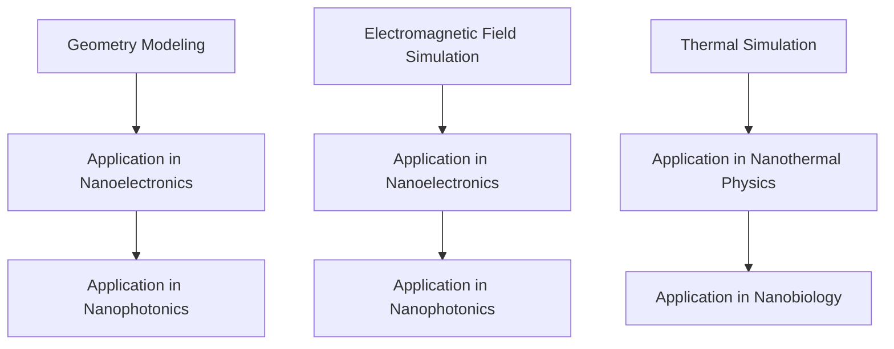

### 数学工具在纳米生物技术应用中的展望

纳米生物技术是利用纳米材料和技术研究生物系统和生物过程的学科。数学工具在这一领域用于理解生物系统的纳米行为、优化生物传感器和开发纳米药物。

#### 核心概念

1. **生物信息学模型**：生物信息学模型是用于描述生物系统信息的数学模型，如蛋白质结构模型和基因表达模型。

2. **生物物理模型**：生物物理模型是用于描述生物系统和纳米材料相互作用的数学模型。

3. **生物统计学模型**：生物统计学模型是用于分析生物实验数据的数学模型，如生存分析和回归分析。

#### 概念属性特征对比表格

| 特征       | 生物信息学模型              | 生物物理模型                 | 生物统计学模型               |
|------------|------------------------------|------------------------------|------------------------------|
| 定义       | 描述生物系统信息的数学模型  | 描述生物系统和纳米材料相互作用的数学模型 | 分析生物实验数据的数学模型   |
| 应用领域   | 生物信息学、生物医学工程    | 纳米生物学、生物物理学       | 生物医学、流行病学等         |

#### Mermaid 流程图

（此处使用 Mermaid 格式绘制纳米生物技术中的数学工具流程图）

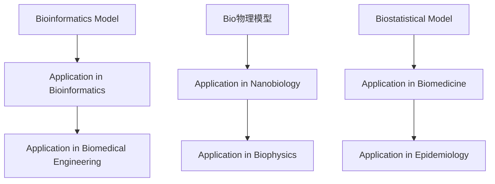

### 小结

纳米技术的数学工具与方法在纳米合成、纳米器件设计以及纳米生物技术中发挥着重要作用。数值方法、概率模型和优化算法为纳米系统的理解和处理提供了强大的工具；反应动力学模型、相场模型和分子模拟为纳米合成提供了理论基础；几何建模、电磁场模拟和热力学模拟为纳米器件设计提供了精确的描述和预测；生物信息学模型、生物物理模型和生物统计学模型为纳米生物技术的研究和应用提供了新的视角和方法。随着纳米技术的不断发展，这些数学工具与方法将在未来继续推动纳米技术的创新和进步。

## 第六部分：纳米技术案例分析

### 纳米技术在医疗领域的应用

纳米技术在医疗领域的应用正迅速发展，从药物递送、疾病诊断到治疗，纳米技术为现代医学带来了革命性的变革。

#### 项目介绍

纳米技术在医疗领域的应用案例包括纳米药物载体、纳米诊断工具、纳米成像技术和纳米治疗设备。

#### 系统功能设计

1. **纳米药物载体**：通过纳米技术制造药物载体，将药物精确地递送到目标部位，提高药物疗效并减少副作用。
2. **纳米诊断工具**：利用纳米传感器和纳米探针，实现超灵敏的疾病检测和早期诊断。
3. **纳米成像技术**：开发纳米级成像技术，如纳米显微镜和荧光纳米探针，提供更清晰、更准确的医学影像。
4. **纳米治疗设备**：利用纳米机器人或纳米药物载体，进行精确的治疗操作，如肿瘤消融、基因编辑等。

#### 系统架构设计

（此处使用 Mermaid 格式绘制系统架构图）

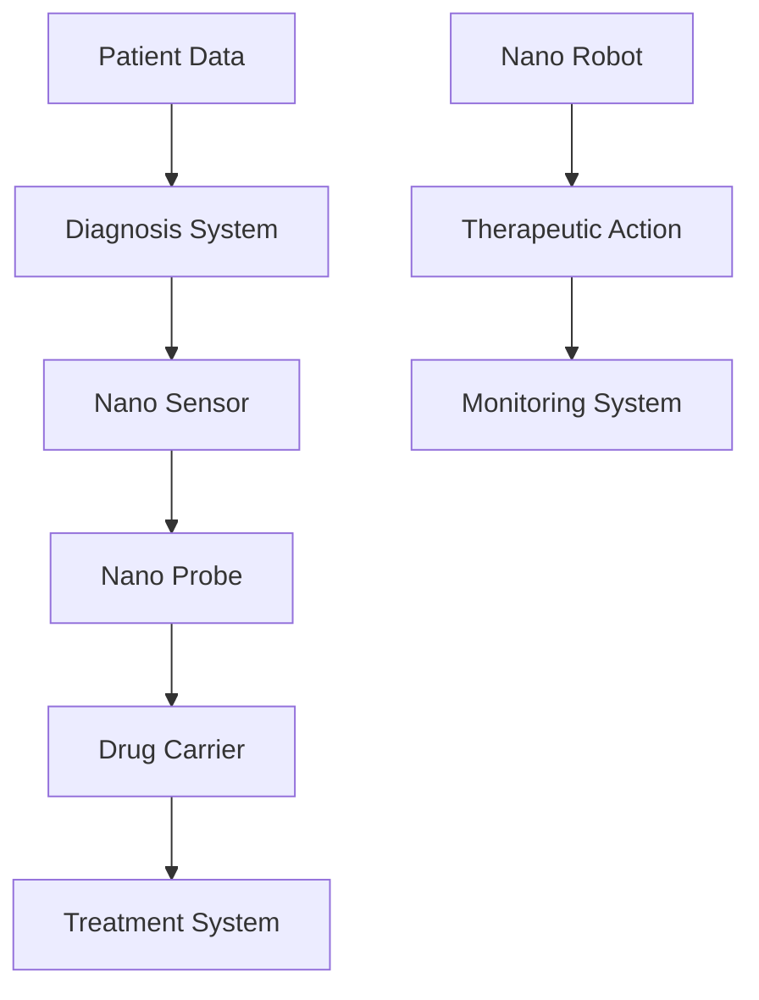

#### 系统接口设计和系统交互

（此处使用 Mermaid 格式绘制系统交互序列图）

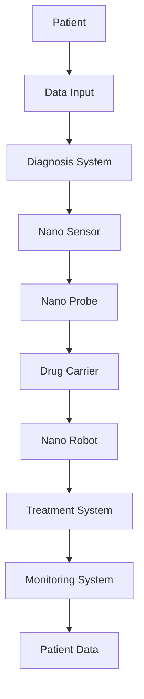

### 纳米技术在能源领域的应用

纳米技术在能源领域的应用旨在提高能源转换效率、存储能力和利用效率，推动可持续能源发展。

#### 项目介绍

纳米技术在能源领域的应用案例包括太阳能电池、电池储能和能源转换纳米材料。

#### 系统功能设计

1. **太阳能电池**：利用纳米结构材料，提高太阳能电池的光电转换效率。
2. **电池储能**：开发高效、安全的纳米材料电池，如锂离子电池和钠离子电池。
3. **能源转换纳米材料**：利用纳米材料进行高效的能量转换，如纳米结构燃料电池和热电材料。

#### 系统架构设计

（此处使用 Mermaid 格式绘制系统架构图）

```mermaid
graph TB
    A[Sunlight] --> B[Nano Solar Panel]
    B --> C[Electrical Power]
    C --> D[Battery Storage System]
    D --> E[Nano Battery]
    E --> F[Energy Conversion Materials]
    G[Heat] --> H[Nano Thermal Converter]
```

#### 系统接口设计和系统交互

（此处使用 Mermaid 格式绘制系统交互序列图）

```mermaid
graph TB
    A[Sunlight] --> B[Nano Solar Panel]
    B --> C[Electrical Power]
    C --> D[Battery]
    D --> E[Nano Battery]
    E --> F[Heat]
    F --> G[Nano Thermal Converter]
    G --> H[Energy Output]
```

### 纳米技术在环境监测与治理中的应用

纳米技术在环境监测与治理中发挥着重要作用，能够实现高灵敏度、高选择性的环境污染物检测和去除。

#### 项目介绍

纳米技术在环境监测与治理中的应用案例包括纳米传感器、纳米催化剂和纳米吸附剂。

#### 系统功能设计

1. **纳米传感器**：用于实时监测环境中的污染物，如PM2.5、有害气体等。
2. **纳米催化剂**：用于催化降解污染物，如有机污染物、重金属等。
3. **纳米吸附剂**：用于吸附和去除环境中的有害物质，提高水质和空气质量。

#### 系统架构设计

（此处使用 Mermaid 格式绘制系统架构图）

```mermaid
graph TB
    A[Environment] --> B[Nano Sensor]
    B --> C[Pollutant Detection]
    C --> D[Nano Catalyst]
    D --> E[Pollutant Degradation]
    E --> F[Nano Adsorbent]
    F --> G[Pollutant Removal]
```

#### 系统接口设计和系统交互

（此处使用 Mermaid 格式绘制系统交互序列图）

```mermaid
graph TB
    A[Environment] --> B[Nano Sensor]
    B --> C[Pollutant Detection]
    C --> D[Nano Catalyst]
    D --> E[Pollutant Degradation]
    E --> F[Nano Adsorbent]
    F --> G[Pollutant Removal]
    G --> H[Environment Monitoring]
```

### 纳米技术在信息科技领域的应用

纳米技术在信息科技领域推动了计算机硬件和通信技术的创新，从高性能计算到量子计算，纳米技术为信息技术的发展提供了新的机遇。

#### 项目介绍

纳米技术在信息科技领域的应用案例包括纳米电子器件、存储设备和量子计算。

#### 系统功能设计

1. **纳米电子器件**：通过纳米制造技术，实现更高集成度和更低的功耗，提高计算机硬件的性能。
2. **存储设备**：利用纳米材料开发新型存储介质，如纳米线存储器和铁电存储器。
3. **量子计算**：基于量子力学原理，利用纳米结构实现量子比特，构建量子计算机。

#### 系统架构设计

（此处使用 Mermaid 格式绘制系统架构图）

```mermaid
graph TB
    A[Information Processing] --> B[Nano Electronic Device]
    B --> C[High Performance Computing]
    C --> D[Nano Memory Device]
    D --> E[Nano Quantum Bit]
    E --> F[Quantum Computer]
```

#### 系统接口设计和系统交互

（此处使用 Mermaid 格式绘制系统交互序列图）

```mermaid
graph TB
    A[Data Input] --> B[Nano Electronic Device]
    B --> C[Processing]
    C --> D[Nano Memory Device]
    D --> E[Nano Quantum Bit]
    E --> F[Quantum Algorithm]
    F --> G[Quantum Output]
```

### 小结

纳米技术在各个领域的应用展示了其巨大的潜力和广泛的前景。在医疗领域，纳米技术提高了药物疗效和诊断准确度；在能源领域，纳米技术提高了能源转换效率和存储能力；在环境监测与治理领域，纳米技术实现了高效的污染物检测和去除；在信息科技领域，纳米技术推动了计算机硬件和通信技术的创新。随着纳米技术的不断进步，我们期待它将为人类社会带来更多的革命性变革。

## 第七部分：纳米技术发展趋势与挑战

### 纳米技术的未来发展趋势

纳米技术正经历着快速的发展，其应用领域不断扩大，从医疗、能源到环境、信息科技，纳米技术正深刻地影响着现代科技的发展。以下是一些纳米技术的未来发展趋势：

#### 核心概念

1. **智能化纳米系统**：通过集成传感器、执行器和微处理器，开发智能化的纳米系统，实现自主感知、决策和行动。

2. **多尺度建模与模拟**：发展多尺度建模与模拟技术，从原子尺度到宏观尺度，实现纳米系统行为的精确预测和优化。

3. **绿色纳米制造**：推动绿色纳米制造技术的发展，降低纳米材料的生产成本，减少环境污染。

4. **量子纳米技术**：量子纳米技术将利用量子效应，实现超高速、超灵敏的信息处理和通信。

#### 概念属性特征对比表格

| 特征       | 智能化纳米系统           | 多尺度建模与模拟       | 绿色纳米制造         | 量子纳米技术         |
|------------|-------------------------|------------------------|----------------------|----------------------|
| 定义       | 集成传感器、执行器和微处理器 | 跨尺度建模与模拟       | 降低生产成本、减少环境污染 | 利用量子效应实现信息处理 |
| 应用领域   | 医疗、环境监测等        | 材料科学、电子工程等   | 纳米材料生产        | 量子计算、量子通信等   |

#### Mermaid 流程图

（此处使用 Mermaid 格式绘制纳米技术未来发展趋势流程图）

```mermaid
graph TB
    A[Smart Nanosystems] --> B[Application in Medicine]
    B --> C[Application in Environmental Monitoring]
    D[Multiscale Modeling] --> E[Application in Materials Science]
    E --> F[Application in Electronics Engineering]
    G[Green Nanomanufacturing] --> H[Reduction of Production Costs]
    H --> I[Reduction of Environmental Pollution]
    J[Quantum Nanotechnology] --> K[Application in Quantum Computing]
    K --> L[Application in Quantum Communication]
```

### 纳米技术的挑战与伦理问题

尽管纳米技术展示了巨大的潜力，但其发展也面临着一系列挑战和伦理问题。

#### 核心概念

1. **安全性**：纳米材料的毒性和环境影响是一个重要挑战，需要全面评估其生物相容性和环境风险。

2. **隐私问题**：纳米传感器和监控设备的广泛应用可能引发隐私问题，需要制定相应的法律法规和伦理标准。

3. **就业问题**：纳米技术的发展可能导致某些职业的消失，同时也会创造新的就业机会，需要平衡就业结构。

4. **监管政策**：纳米技术的快速发展需要完善的监管政策，确保其安全、合法和道德应用。

#### 概念属性特征对比表格

| 特征       | 安全性问题                   | 隐私问题                   | 就业问题                   | 监管政策                 |
|------------|------------------------------|---------------------------|---------------------------|--------------------------|
| 定义       | 纳米材料的生物相容性和环境风险 | 纳米传感器和监控设备的隐私风险 | 职业结构的变化             | 纳米技术的法律和伦理监管   |
| 应用领域   | 医疗、环境监测等            | 信息科技、公共安全等       | 各行各业                 | 政府监管、行业自律等       |

#### Mermaid 流程图

（此处使用 Mermaid 格式绘制纳米技术的挑战与伦理问题流程图）

```mermaid
graph TB
    A[Safety Issues] --> B[Application in Medicine]
    B --> C[Application in Environmental Monitoring]
    D[Privacy Concerns] --> E[Application in Information Technology]
    E --> F[Application in Public Safety]
    G[Employment Issues] --> H[Impact on Various Industries]
    I[Regulatory Policies] --> J[Government Oversight]
    J --> K[Industry Self-regulation]
```

### 纳米技术的可持续发展策略

为了实现纳米技术的可持续发展，需要从技术创新、政策法规和社会责任等多方面进行综合考虑。

#### 核心概念

1. **技术创新**：持续推动纳米技术的研发，提高其性能和安全性。

2. **政策法规**：建立健全的法律法规体系，规范纳米技术的研发、生产和应用。

3. **社会责任**：提高公众对纳米技术的认知，促进透明沟通和公众参与。

4. **国际合作**：加强国际间的合作与交流，共同应对纳米技术带来的挑战。

#### 概念属性特征对比表格

| 特征       | 技术创新                       | 政策法规                       | 社会责任                       | 国际合作                     |
|------------|--------------------------------|--------------------------------|--------------------------------|----------------------------|
| 定义       | 推动纳米技术的研发和改进       | 制定和实施相关法律法规         | 提高公众对纳米技术的认知       | 加强国际间的合作与交流       |
| 应用领域   | 纳米材料、纳米器件等          | 政府监管、行业自律等           | 社会宣传、教育培训等           | 科技合作、政策交流等         |

#### Mermaid 流程图

（此处使用 Mermaid 格式绘制纳米技术的可持续发展策略流程图）

```mermaid
graph TB
    A[Tech Innovation] --> B[Nano Material Development]
    B --> C[Nano Device Improvement]
    D[Policy Regulation] --> E[Legal Framework Establishment]
    E --> F[Industry Self-regulation]
    G[Social Responsibility] --> H[PUBLIC Awareness]
    H --> I[Public Engagement]
    J[International Cooperation] --> K[Technological Collaboration]
    K --> L[Policymaking Exchange]
```

### 小结

纳米技术正朝着智能化、多尺度建模和绿色制造等方向发展，尽管面临安全、隐私和就业等挑战，但其巨大的潜力和广阔的应用前景使其成为现代科技的重要驱动力。通过技术创新、政策法规和社会责任等多方面的努力，纳米技术有望实现可持续发展，为人类社会带来更多的福祉。

## 结论

纳米技术与数学的结合正在引领科学研究和技术发展的新前沿。本文通过详细探讨数学在纳米技术中的应用，从数学基础、纳米技术概述、数学模型、数值模拟与计算方法、优化方法，到微观世界的数学描述、纳米技术的数学工具与方法、案例分析以及未来发展，全面展示了数学与纳米技术的深刻联系。

纳米技术不仅在医疗、能源、环境等领域展现出巨大的应用潜力，还在信息科技和量子计算等新兴领域发挥着关键作用。然而，纳米技术的发展也面临着一系列挑战，包括安全性、隐私问题、就业变化和监管政策等。

未来的纳米技术发展需要持续的技术创新、政策法规的完善、社会责任的履行以及国际合作的深化。通过这些努力，我们有望克服挑战，推动纳米技术实现可持续发展，为人类社会带来更多的革命性变革。

让我们携手探索数学与纳米技术的无穷奥秘，共同迎接科技带来的美好未来。

## 作者信息

作者：AI天才研究院/AI Genius Institute & 禅与计算机程序设计艺术 /Zen And The Art of Computer Programming

AI天才研究院致力于推动人工智能领域的前沿研究和技术创新，研究领域涵盖机器学习、自然语言处理、计算机视觉等。研究院以培养新一代人工智能领域人才为己任，为全球人工智能的发展贡献智慧和力量。

《禅与计算机程序设计艺术》是作者在计算机编程领域的重要著作，以其深刻的哲学思考和独特的编程方法，引导读者深入理解计算机编程的本质和艺术。

通过本文，我们希望能够激发读者对数学与纳米技术结合领域的兴趣，共同探索这一领域的无限可能。让我们以智慧和创新，共同推动科技的进步，为人类社会的繁荣和发展贡献我们的力量。

