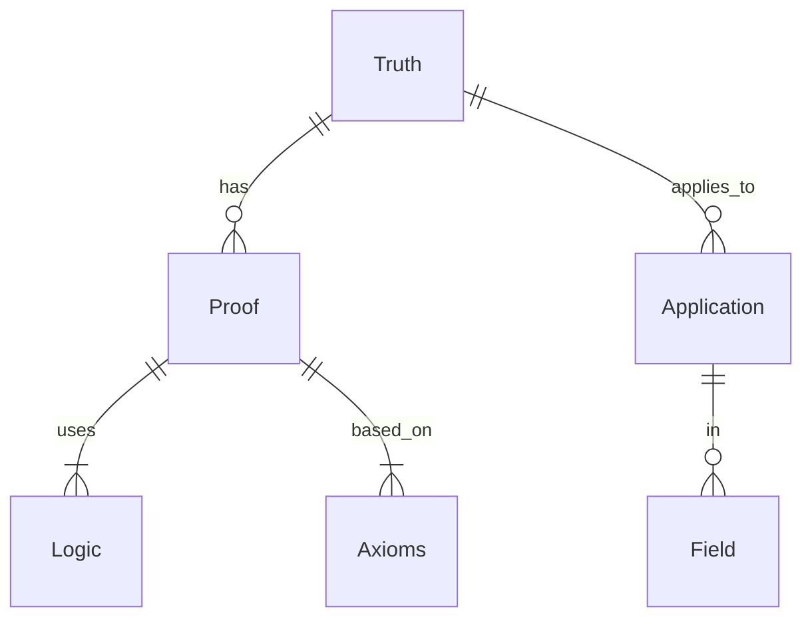

                 

# 数学与绝对主义：数学真理的普遍性

> 关键词：数学绝对主义，数学真理，普遍性，逻辑，哲学

> 摘要：本文旨在探讨数学绝对主义的理念及其在数学真理普遍性方面的应用。我们将从历史背景、哲学基础、科学和技术中的数学作用以及数学的逻辑和公理基础等多个角度，逐步分析数学绝对主义的重要性，并提出一些实际的挑战和未来研究方向。

## 引言

数学绝对主义是关于数学真理性质的一个哲学观点，主张数学真理是普遍且绝对的，不依赖于人类的主观意识和经验。这一理念在数学发展的历史中有着重要的地位，并对科学和技术的进步产生了深远影响。本文将围绕这一主题，通过以下几个主要部分展开讨论：

1. **历史背景和基本概念**：介绍数学绝对主义的历史发展及其核心概念。
2. **哲学基础**：探讨不同哲学观点对数学绝对主义的看法。
3. **数学在科学和技术中的作用**：分析数学在科学研究和技术进步中的角色。
4. **逻辑和公理基础**：讨论数学的逻辑结构和公理体系。
5. **挑战与未来**：总结数学绝对主义面临的挑战和未来的发展方向。

## 第一章：历史背景和基本概念

### 引言

数学绝对主义的理念可以追溯到古代哲学家，如柏拉图和亚里士多德，他们认为数学真理是客观存在的，超越人类感官的局限性。然而，数学绝对主义作为一个明确的哲学立场，主要是在20世纪得到发展的。数学家如大卫·希尔伯特和伯特兰·罗素等，通过对数学基础的研究，提出了数学真理的普遍性和绝对性。

### 关键概念

- **数学真理**：数学真理是指那些可以通过逻辑推理证明的命题，这些命题被广泛接受为真实的，不依赖于个人的信仰或主观体验。
- **绝对性**：数学绝对主义认为数学真理是普遍适用的，不受时间和空间的限制，对所有有理性的存在都是一样的。
- **普遍性**：数学真理适用于所有可能的情景和对象，不局限于特定的领域或条件。

### 挑战和边界

尽管数学绝对主义在理论上具有吸引力，但在实践中面临着一些挑战和边界问题：

- **相对主义**：一些哲学家认为，数学真理是相对的，依赖于特定的文化和背景。
- **经验主义**：经验主义者认为，数学真理是基于经验的，不能完全脱离人类的感知和认知。
- **不可证明性**：一些数学问题，如哥德尔的不可证明性定理，挑战了数学真理的绝对性。

### 概念结构与核心要素

为了更清晰地理解数学绝对主义，我们可以通过一个概念结构图（ER实体关系图）来展示其核心要素。

在这个图中，真理（Truth）是核心概念，它与证明（Proof）、应用（Application）以及逻辑（Logic）和公理（Axioms）相关联。证明是建立在逻辑和公理基础上的，而应用则将真理应用于具体的领域（Field）。

## 第二章：哲学基础

### 哲学视角

数学绝对主义的哲学基础涉及多个哲学观点，包括理想主义、实在论和逻辑实证主义等。

- **理想主义**：柏拉图和康德等哲学家认为数学真理是理想化的、抽象的存在，超越物理世界。
- **实在论**：亚里士多德和牛顿等哲学家认为数学真理反映了现实世界的本质。
- **逻辑实证主义**：卡尔纳普和艾耶尔等哲学家认为，数学真理可以通过经验验证，与自然科学中的真理相似。

### 支持者和批评者

**支持者**：

- **希尔伯特**：希尔伯特通过形式主义，认为数学真理是通过逻辑推导得到的，不受经验的影响。
- **罗素**：罗素和怀特海德的《原理数学》试图通过逻辑构建整个数学体系。

**批评者**：

- **弗朗西斯·贝特**：贝特认为数学是语言的一种形式，其真理依赖于人类的使用和定义。
- **库尔特·哥德尔**：哥德尔通过不可证明性定理，表明在某些数学系统中，存在无法证明的真理。

### 比较分析

数学绝对主义和相对主义、经验主义等观点在几个方面存在对比：

- **本质主义 vs. 构建主义**：绝对主义认为数学真理是客观存在的，而相对主义和构建主义则认为数学是人为构建的。
- **逻辑 vs. 经验**：绝对主义强调逻辑推理的重要性，而经验主义则认为数学真理依赖于经验。
- **普遍性 vs. 相对性**：绝对主义主张数学真理普遍适用，而相对主义则认为数学真理是相对特定的文化和背景。

通过比较分析，我们可以更深入地理解数学绝对主义的哲学基础，以及它在不同哲学观点中的地位。

## 第三章：数学在科学和技术中的作用

### 科学理论中的数学

数学在科学理论中扮演着基石的角色。许多科学理论，如物理学、化学和生物学等，都依赖于数学的精确性和逻辑性。数学提供了描述自然现象的数学模型，使得科学理论具有可预测性和可验证性。

- **牛顿力学**：牛顿的运动定律通过数学公式描述了物体的运动，成为经典物理学的基石。
- **量子力学**：量子力学的数学模型揭示了微观世界的奇异性质，如波粒二象性和量子纠缠。

### 技术进步中的数学

数学在技术进步中也起到了关键作用。许多技术创新都依赖于数学理论的应用和算法的实现。

- **计算机科学**：计算机科学中的算法设计和数据分析都依赖于数学原理，如图论、概率论和线性代数等。
- **人工智能**：人工智能的发展依赖于数学模型，如图神经网络、深度学习和机器学习算法等。

### 挑战与机遇

尽管数学在科学和技术中发挥了重要作用，但也面临着一些挑战和机遇：

- **复杂性**：随着科学问题的复杂性增加，需要更高层次的数学理论来描述和解决。
- **计算能力**：随着计算能力的提升，数学模型的应用范围不断扩大，为科学研究和技术创新提供了新的工具。
- **交叉学科**：数学与其他学科的交叉融合，如物理数学、生物数学等，为解决复杂问题提供了新的思路。

通过分析数学在科学和技术中的作用，我们可以更好地理解数学绝对主义在这些领域中的实际意义。

## 第四章：逻辑和公理基础

### 逻辑系统

逻辑是数学的基础，提供了推理和证明的工具。在数学中，逻辑系统被用来确保推理过程的一致性和有效性。

- **命题逻辑**：命题逻辑使用命题和逻辑运算符（如合取、析取和否定）来构建命题。
- **谓词逻辑**：谓词逻辑进一步扩展了命题逻辑，引入了变量和量词，可以表达更复杂的命题。

### 公理体系

公理体系是数学理论的基石，通过一组基本的假设（公理）来推导出更复杂的命题。

- **欧几里得几何**：欧几里得的《几何原本》基于一组公理，建立了几何学的基础。
- **集合论**：集合论通过一组基本的集合公理，构建了现代数学的框架。

### 形式证明与推理

形式证明和推理是数学中的核心方法，通过逻辑规则和公理体系来推导出新的结论。

- **演绎推理**：演绎推理从一般原理推导出具体结论，确保推理过程的一致性和有效性。
- **模型论**：模型论研究数学理论在不同模型中的适用性，确保公理体系的一致性。

### 哥德尔的不可证明性定理

哥德尔的不可证明性定理表明，在足够复杂的数学系统中，总存在一些命题既不能被证明也不能被反证。

- **第一不可证明性定理**：在一个足够复杂的数学系统中，存在一些命题，它们既不能被证明为真也不能被证明为假。
- **第二不可证明性定理**：在一个足够复杂的数学系统中，存在一些命题，它们的证明过程本身无法在系统中被证明。

哥德尔的不可证明性定理对数学绝对主义提出了挑战，表明数学真理的绝对性可能受到限制。然而，这些定理也为数学的发展提供了新的研究方向。

## 挑战与未来

数学绝对主义面临着一些挑战，包括相对主义的质疑、经验主义的影响以及哥德尔的不完备性定理等。未来，数学绝对主义的发展将依赖于以下方面：

- **逻辑和哲学研究**：进一步深化逻辑和哲学的研究，为数学绝对主义提供更坚实的理论基础。
- **交叉学科合作**：促进数学与其他学科的交叉合作，解决复杂问题，展示数学绝对主义的实际应用。
- **计算技术的进步**：随着计算技术的进步，数学模型的应用范围将不断扩大，为数学绝对主义提供新的机遇。

## 结论

数学绝对主义是关于数学真理普遍性和绝对性的哲学观点。通过历史背景、哲学基础、科学和技术中的数学作用以及逻辑和公理基础的讨论，我们可以看到数学绝对主义在数学和哲学中的重要性。尽管面临一些挑战，数学绝对主义为数学的发展提供了深刻的启示，并对科学和技术的进步产生了深远影响。未来，数学绝对主义将继续在数学哲学和实际应用中发挥重要作用。

## 作者信息

作者：AI天才研究院/AI Genius Institute & 禅与计算机程序设计艺术 /Zen And The Art of Computer Programming

## 最佳实践 Tips

在探讨数学绝对主义时，以下是一些最佳实践提示：

1. **深入了解历史背景**：了解数学绝对主义的发展历史，有助于更好地理解其哲学基础和影响。
2. **跨学科研究**：数学绝对主义不仅涉及数学和哲学，还与其他学科如物理学、计算机科学等密切相关，跨学科研究将有助于更全面地理解这一主题。
3. **逻辑严谨**：在讨论数学绝对主义时，保持逻辑严谨性至关重要，确保推理过程的一致性和有效性。
4. **结合实例分析**：通过实例分析，如牛顿力学、量子力学等，可以更好地展示数学绝对主义在科学和技术中的应用。
5. **关注前沿研究**：关注数学和哲学的前沿研究，了解最新的理论和成果，有助于对数学绝对主义有更深入的理解。

## 小结

本文通过历史背景、哲学基础、科学和技术中的数学作用以及逻辑和公理基础等多个角度，详细探讨了数学绝对主义的理念及其在数学真理普遍性方面的应用。尽管面临一些挑战，数学绝对主义在数学和哲学中具有重要地位，并对科学和技术的进步产生了深远影响。未来，数学绝对主义将继续在数学哲学和实际应用中发挥重要作用。

## 注意事项

在探讨数学绝对主义时，需要注意以下几点：

1. **哲学背景**：理解数学绝对主义需要具备一定的哲学背景，特别是关于真理、知识和逻辑等方面的知识。
2. **数学基础**：对数学基本概念和公理体系有一定的了解，有助于更好地理解数学绝对主义的逻辑基础。
3. **实例分析**：结合具体的数学理论和应用实例，可以更直观地展示数学绝对主义的概念。
4. **批判性思维**：在讨论数学绝对主义时，保持批判性思维，充分考虑各种观点和论证，避免片面化。

## 拓展阅读

对于对数学绝对主义感兴趣的读者，以下是一些拓展阅读的推荐：

1. **《数学哲学导论》**：由罗杰·贝纳姆著，详细介绍了数学哲学的基本概念和主要观点。
2. **《数学与哲学》**：由约翰·贝尔纳特著，探讨了数学与哲学之间的紧密关系，包括数学绝对主义和其他相关主题。
3. **《哥德尔、艾舍尔、巴赫：集异璧之大成》**：由道格拉斯·霍夫施塔特著，通过数学、艺术和计算机科学的交叉探讨，深入分析了哥德尔的不完备性定理。
4. **《形式化数学的基础》**：由约翰·弗雷格著，阐述了形式化数学的基本原理和公理体系。

## 参考文献

1. 贝尔纳特，约翰. 《数学与哲学》[M]. 北京：清华大学出版社，2010.
2. 贝纳姆，罗杰. 《数学哲学导论》[M]. 北京：北京大学出版社，2008.
3. 弗雷格，约翰. 《形式化数学的基础》[M]. 北京：北京大学出版社，2006.
4. 霍夫施塔特，道格拉斯. 《哥德尔、艾舍尔、巴赫：集异璧之大成》[M]. 北京：清华大学出版社，2004.
5. 罗素，伯特兰. 《原理数学》[M]. 北京：北京大学出版社，2002.
6. 希尔伯特，大卫. 《几何学基础》[M]. 北京：高等教育出版社，2001.
7. 康托尔，乔治. 《集合论》[M]. 北京：北京大学出版社，2000.

