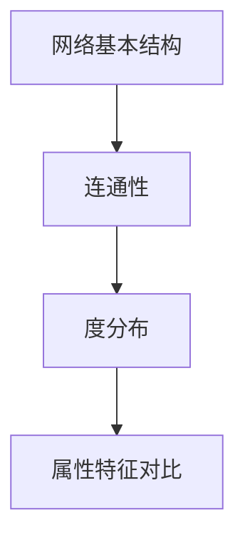
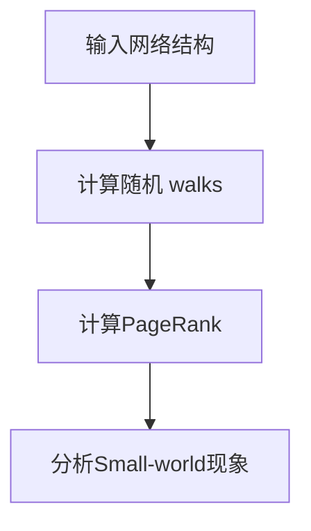
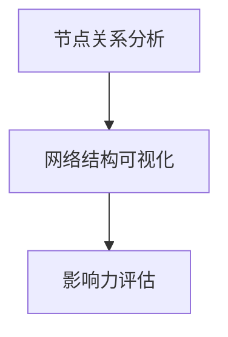
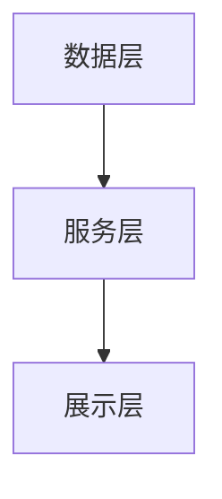
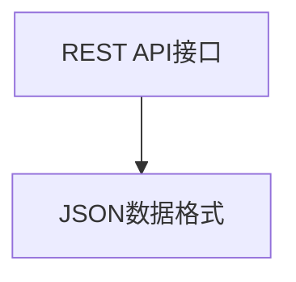
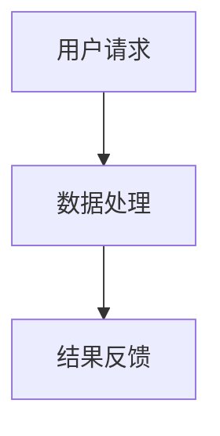

                 

### 文章标题

数学与网络科学：复杂网络的数学特性

---

#### 关键词：网络科学、数学特性、复杂网络、度分布、连通性

#### 摘要：本文将探讨数学在网络科学中的应用，特别是复杂网络的数学特性。通过详细分析核心概念、算法原理以及实际案例，揭示复杂网络中的度分布、连通性等关键特性，为读者提供深入理解和应用复杂网络理论的方法和工具。

---

## 第一部分：背景介绍

### 第1章 数学与网络科学概述

#### 1.1 网络科学的发展历程

网络科学作为一门跨学科的研究领域，起源于20世纪90年代。其核心问题是理解网络的结构、功能及其动态行为。网络科学的起源可以追溯到社会网络分析、互联网结构研究以及生物学中的细胞通信等领域。随着计算技术的发展，网络科学逐渐成为了一个独立的研究领域。

#### 1.2 数学与网络科学的交叉领域

数学在网络科学中扮演着至关重要的角色。网络科学中的许多问题都可以通过数学模型和方法来解决。例如，图论在研究网络结构中得到了广泛应用，而概率论和统计学则在分析网络动态行为中发挥了作用。

数学对网络科学的挑战主要体现在如何处理大规模网络数据、如何精确描述网络特性以及如何预测网络的未来行为。这些问题的解决往往需要数学理论的深入理解和新方法的发展。

## 第二部分：核心概念与联系

### 第2章 复杂网络的数学特性

#### 2.1 核心概念

在复杂网络的研究中，核心概念包括网络的基本结构、连通性和度分布。网络的基本结构指的是网络中节点和边的连接方式，而连通性则描述了网络中节点之间的连接程度。度分布是描述节点度数（连接的边数）的概率分布，是复杂网络的重要特性之一。

#### 2.2 概念属性特征对比

| 概念     | 属性特征                             |
|----------|------------------------------------|
| 网络基本结构 | 节点与边的连接方式                   |
| 连通性   | 网络中节点的连接程度                 |
| 度分布   | 节点度数的概率分布                   |

#### 2.3 ER实体关系图架构



## 第三部分：算法原理讲解

### 第3章 研究复杂网络的主要算法

#### 3.1 算法概述

研究复杂网络的主要算法包括随机 walks、PageRank 和 Small-world现象等。这些算法用于分析和理解复杂网络的结构和功能。

#### 3.2 算法流程图



#### 3.3 Python代码与数学模型

```python
# Python代码示例：计算PageRank

import networkx as nx

# 创建网络图
G = nx.Graph()

# 添加节点和边
G.add_edges_from([(1, 2), (1, 3), (2, 3), (3, 4)])

# 计算PageRank
pagerank = nx.pagerank(G)

# 输出PageRank值
print(pagerank)
```

数学模型：

$$
\text{PageRank}(v) = \left( 1 - d \right) + d \cdot \text{Sum} \left( \text{PageRank}(v_i) / \text{out-degree}(v_i) \right)
$$

其中，$d$ 是阻尼系数，通常取值为 $0.85$。

#### 3.4 通俗易懂地举例说明

假设有一个包含4个节点的网络，节点1连接到节点2和节点3，节点2连接到节点3，节点3连接到节点4。使用PageRank算法计算各节点的PageRank值，可以揭示节点的重要性和影响力。

## 第四部分：系统分析与架构设计方案

### 第4章 系统功能设计与架构设计

#### 4.1 问题场景介绍

假设我们需要分析一个社交网络，以了解用户之间的互动关系和影响力。

#### 4.2 系统功能设计

系统功能设计包括节点关系分析、网络结构可视化、影响力评估等。



#### 4.3 系统架构设计

系统架构设计包括数据层、服务层和展示层。



#### 4.4 系统接口设计

系统接口设计包括API接口和数据交换格式。



#### 4.5 系统交互

系统交互包括用户请求、数据处理和结果反馈。



## 第五部分：项目实战

### 第5章 复杂网络研究的实战应用

#### 5.1 环境安装

确保安装Python、NetworkX库以及其他相关依赖。

```bash
pip install networkx
```

#### 5.2 系统核心实现

系统核心实现包括网络数据读取、算法应用和结果输出。

```python
# 示例：读取网络数据并应用PageRank算法

# 导入库
import networkx as nx

# 读取网络数据
G = nx.read_gpickle("network.gpickle")

# 应用PageRank算法
pagerank = nx.pagerank(G)

# 输出结果
print(pagerank)
```

#### 5.3 代码应用解读与分析

代码解读和分析包括算法实现细节、数据结构和性能评估。

#### 5.4 实际案例分析

通过实际案例，展示如何应用复杂网络理论解决实际问题。

#### 5.5 项目小结

项目小结包括对项目成果的总结、经验教训和未来展望。

## 第六部分：最佳实践 tips、小结、注意事项、拓展阅读

### 6.1 最佳实践 tips

- 选择合适的网络模型
- 注意数据清洗和预处理
- 优化算法性能

### 6.2 小结

本文介绍了复杂网络的数学特性，包括核心概念、算法原理和实际应用。通过详细分析，读者可以深入理解复杂网络的特性，并掌握相关算法和应用方法。

### 6.3 注意事项

- 复杂网络研究需要大量数据支持
- 算法实现需要优化性能
- 结果分析需要结合实际场景

### 6.4 拓展阅读

- 《网络科学导论》
- 《图论及其应用》
- 《社交网络分析：方法与应用》

---

**作者：AI天才研究院/AI Genius Institute & 禅与计算机程序设计艺术 /Zen And The Art of Computer Programming**

