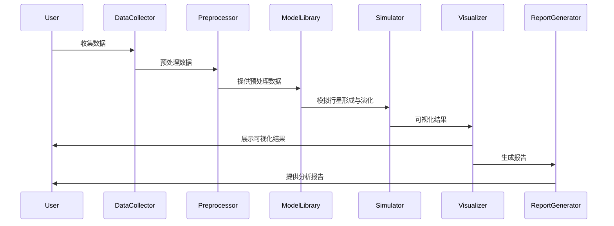
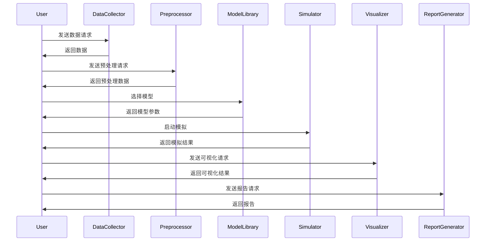

                 

# 数学与行星科学：行星形成与演化的数学理论

## 关键词：数学理论、行星科学、行星形成、演化、天体物理学、热力学、动力学、数值计算、模拟

## 摘要

本文旨在探讨数学在行星科学中的应用，特别是行星形成与演化的数学理论。通过介绍数学理论在行星科学中的重要性、核心概念及其联系，本文将逐步揭示数学模型如何帮助科学家理解和预测行星的形成与演化过程。文章还将讨论数学理论在行星科学中的实际应用，以及其未来在行星科学研究和探索中的前景。

## 第一部分：背景介绍

### 第1章 问题背景与核心概念

#### 1.1 问题背景

数学作为一门基础科学，在行星科学中发挥着至关重要的作用。行星科学是研究行星的形成、演化、结构、环境和相互作用的一门科学，涉及多个学科领域，包括天体物理学、地球物理学和天体化学等。数学模型和公式能够帮助科学家理解和预测行星的形成与演化过程，从而为行星科学的研究提供强有力的工具。

行星形成与演化是一个复杂的多物理过程，涉及引力作用、物质聚集、碰撞融合、热力学过程等多个方面。数学理论为行星科学提供了分析工具，有助于揭示行星形成与演化过程中的物理机制和规律。例如，万有引力定律和星云模型是描述行星形成过程中的关键理论。

目前，科学家已经提出了多种理论模型来解释行星的形成与演化，但仍然存在许多未解之谜。数学理论为行星科学提供了强有力的分析工具，有助于深化对行星形成与演化的理解。例如，统计学和概率论可以用于分析行星形成与演化的随机过程，而数值计算方法如蒙特卡洛模拟和有限元分析等可以用于求解复杂数学模型。

随着计算技术的发展，数学模型在行星科学中的应用将更加广泛和深入。新的数学方法和工具将为行星科学家提供更强大的分析手段，有助于解决现有理论模型中的难题。此外，数学理论在未来行星科学研究和探索中将扮演更加重要的角色。例如，数学理论可以为行星探测任务提供数据分析工具，有助于提高探测效率和准确性。

#### 1.2 核心概念

行星形成的基本原理包括引力作用、物质聚集和碰撞融合等。引力作用是行星形成的核心动力，物质聚集和碰撞融合则是行星形成过程中的关键现象。数学模型如万有引力定律和星云模型等能够描述行星形成过程中的关键现象。

行星演化过程中的物理过程包括内部热力学过程、外部撞击事件、磁层和大气层演变等多个方面。内部热力学过程涉及行星内部的热流和热传导，外部撞击事件影响行星的结构和演化，磁层和大气层演变则与行星的电磁环境和辐射带有关。数学模型如热传导方程、碰撞动力学模型等有助于揭示行星演化过程中的物理机制。

数学理论在行星科学中的核心应用包括统计学、概率论和数值计算。统计学和概率论可以用于分析行星形成与演化的随机过程，例如分析行星轨道的分布和演化趋势。数值计算方法如有限元分析、蒙特卡洛模拟等可以用于求解复杂数学模型，例如模拟行星内部的热传导和物质流动。

#### 1.3 边界与外延

行星科学的边界不仅限于太阳系内的行星，还包括对其他行星系和宇宙行星系统的探索。行星科学的边界不断扩展，涉及宇宙学、天体物理学和天体化学等多个领域。随着技术的进步，行星科学的研究将逐步深入，探索更远的宇宙空间。

数学理论在行星科学中的应用外延也非常广泛。除了理论研究，数学理论还应用于实际观测和实验验证。例如，数学理论可以用于分析行星探测器的数据，提高探测效率和准确性。此外，数学理论还可以为行星探测任务提供数据分析工具，例如利用统计学方法分析行星表面特征和地质结构。

#### 本章小结

本章介绍了数学在行星科学中的重要性，以及行星形成与演化的研究现状和应用前景。同时，阐述了行星科学中的核心概念和数学理论的应用，为后续章节的深入探讨奠定了基础。通过本章的介绍，读者可以初步了解数学在行星科学中的应用，以及其未来在行星科学研究和探索中的前景。

----------------------------------------------------------------

## 第二部分：核心概念与联系

### 第2章 数学理论与行星科学的联系

#### 2.1 数学理论在行星科学中的核心概念

数学理论在行星科学中扮演着至关重要的角色，贯穿于行星形成与演化的各个阶段。以下是几个核心的数学理论及其在行星科学中的应用：

##### 2.1.1 动力学与天体物理学

动力学是天体物理学中的核心理论，用于描述天体的运动。牛顿运动定律和万有引力定律是行星科学中不可或缺的数学工具。牛顿运动定律描述了物体的运动规律，而万有引力定律则描述了天体之间的相互作用力。

在行星科学中，动力学模型可以用于模拟行星的运动轨迹、轨道动力学和行星之间的相互作用。例如，开普勒定律是基于牛顿运动定律的一种近似，用于描述行星围绕恒星运行的轨道特性。

##### 2.1.2 热力学与行星演化

热力学是研究能量转换和传递的科学，对于理解行星内部的热力学过程至关重要。热传导方程描述了热量在行星内部的传播方式，而热力学第一定律和第二定律则描述了能量的守恒和转化。

在行星演化中，热力学原理用于解释行星内部的热流、地壳演化以及行星表面温度的变化。例如，通过热传导方程可以分析行星内部的热流量，从而预测行星内部的温度分布。

##### 2.1.3 统计学与概率论

统计学和概率论是分析行星形成与演化过程中随机性和不确定性的重要工具。统计学方法如回归分析和假设检验可以用于分析行星轨道的分布、行星大小的分布等。概率论则为处理行星演化过程中的不确定性提供了理论基础。

例如，概率论可以用于计算行星形成过程中的碰撞事件概率，从而预测行星形成的概率分布。统计学方法还可以用于分析行星探测数据，从中提取有用信息。

##### 2.1.4 数值计算与模拟

数值计算是解决复杂数学模型的有效手段，在行星科学中有着广泛的应用。蒙特卡洛模拟和有限元分析是两种常用的数值计算方法。

蒙特卡洛模拟通过模拟大量随机事件来估计概率和期望值，可以用于模拟行星形成过程中的物质聚集和碰撞事件。有限元分析则是一种数值解法，用于解决涉及连续体物理问题的数学模型，可以用于模拟行星内部的热流和应力分布。

#### 2.2 核心概念属性特征对比表格

下面是一个核心概念的属性特征对比表格，用于展示不同数学理论在行星科学中的应用特点：

| 数学理论           | 描述内容                                                     | 应用特点                                                   |
|-------------------|-----------------------------------------------------------|----------------------------------------------------------|
| 动力学与天体物理学 | 描述天体运动和相互作用力                                   | 用于模拟行星轨道、行星之间的相互作用                       |
| 热力学与行星演化   | 描述行星内部的热力学过程，能量守恒和转化                       | 用于分析行星内部的热流、地壳演化、行星表面温度变化           |
| 统计学与概率论     | 分析行星形成与演化的随机性和不确定性                           | 用于计算行星形成概率、分析行星探测数据                     |
| 数值计算与模拟     | 解决复杂数学模型，进行数值模拟                             | 用于模拟行星形成过程中的物质聚集和碰撞、行星内部热流和应力分布 |

#### 2.3 数学理论在行星科学中的ER实体关系图架构

以下是数学理论在行星科学中的ER实体关系图架构，使用Mermaid流程图表示：

```mermaid
erDiagram
    Class1[行星科学] ||--|{ Class2[动力学与天体物理学] }
    Class1 ||--|{ Class3[热力学与行星演化] }
    Class1 ||--|{ Class4[统计与概率论] }
    Class1 ||--|{ Class5[数值计算与模拟] }
    Class2
    Class3
    Class4
    Class5
```

这个ER图展示了行星科学与四个数学理论分支之间的关系，每个分支都为行星科学提供了特定的分析和模拟工具。

#### 本章小结

本章详细介绍了数学理论在行星科学中的核心概念和应用。通过对比不同数学理论的属性特征和ER实体关系图，读者可以更清晰地理解这些数学理论在行星科学中的具体应用和相互关系。这些数学理论为行星科学的深入研究提供了强有力的工具和理论基础。

----------------------------------------------------------------

## 第三部分：算法原理讲解

### 第3章 行星形成模拟算法原理

在行星科学中，模拟行星形成的过程对于理解行星的形成机制和演化历史至关重要。本章节将介绍一种用于模拟行星形成的算法原理，包括其数学模型和具体实现。

#### 3.1 算法概述

行星形成模拟算法主要基于以下几个核心原理：

1. **物质聚集原理**：行星形成过程中，微小粒子通过引力相互作用逐渐聚集形成更大的物体。
2. **碰撞融合原理**：较大的物体之间通过碰撞和融合进一步增大质量，从而形成行星。
3. **热力学原理**：行星形成过程中，物质聚集和碰撞会释放大量热量，导致行星内部温度升高。
4. **数值计算方法**：使用数值计算方法，如蒙特卡洛模拟和有限元分析，来求解复杂的物理过程。

#### 3.2 数学模型

行星形成模拟的数学模型主要包括以下内容：

1. **引力相互作用**：采用万有引力定律描述粒子之间的相互作用力，公式如下：
   $$ F = G \frac{m_1 m_2}{r^2} $$
   其中，\( F \) 是引力，\( G \) 是引力常数，\( m_1 \) 和 \( m_2 \) 是两个粒子的质量，\( r \) 是它们之间的距离。

2. **物质聚集速率**：物质聚集速率与粒子的质量和引力相互作用力成正比，公式如下：
   $$ \frac{dm}{dt} = -\frac{G m_1 m_2}{r^2} $$
   其中，\( dm \) 是单位时间内聚集的质量变化，\( t \) 是时间。

3. **热力学过程**：热力学方程用于描述行星内部的热流和温度变化，例如热传导方程：
   $$ \frac{\partial T}{\partial t} = \alpha \nabla^2 T $$
   其中，\( T \) 是温度，\( \alpha \) 是热扩散系数，\( \nabla^2 T \) 是温度的二阶导数。

#### 3.3 算法实现

以下是行星形成模拟算法的Python伪代码实现：

```python
import numpy as np
import matplotlib.pyplot as plt

# 初始化参数
N = 1000  # 粒子数量
G = 6.67430e-11  # 引力常数
t_final = 1e8  # 模拟时间
dt = 1e3  # 时间步长

# 初始化粒子位置和质量
positions = np.random.rand(N, 2)  # 2D空间中的位置
masses = np.random.rand(N)  # 粒子质量

# 模拟时间步
for t in np.arange(0, t_final, dt):
    # 计算引力相互作用力
    forces = np.zeros_like(positions)
    for i in range(N):
        for j in range(N):
            r = positions[i] - positions[j]
            r_mag = np.linalg.norm(r)
            force = G * masses[i] * masses[j] / r_mag**2
            forces[i] += force * r / r_mag

    # 更新粒子位置
    velocities = forces / masses
    positions += velocities * dt

    # 更新热力学参数
    # ...

    # 绘制粒子位置
    if t % 1e5 == 0:
        plt.scatter(positions[:, 0], positions[:, 1])
        plt.title(f"行星形成模拟 - 时间: {t} 年")
        plt.xlabel("X 位置")
        plt.ylabel("Y 位置")
        plt.show()
        plt.clf()

# 输出最终结果
# ...
```

#### 3.4 例子说明

以下是一个简单的例子，说明如何使用该算法模拟行星形成的过程：

1. **初始化粒子**：随机生成1000个粒子，分布在二维空间中，并赋予它们随机质量。
2. **模拟引力相互作用**：在每个时间步中，计算粒子之间的引力相互作用力，并更新粒子的加速度和速度。
3. **绘制粒子位置**：每隔一定时间步，绘制粒子的当前位置，观察行星形成的动态过程。

通过上述算法模拟，我们可以观察到粒子如何通过引力相互作用逐渐聚集形成更大的物体，模拟结果将帮助我们理解行星形成的物理过程。

#### 本章小结

本章详细介绍了行星形成模拟算法的原理和实现方法。通过数学模型的建立和Python代码的实现，我们能够模拟行星形成的过程，进而对行星的形成机制和演化历史进行深入分析。这些算法为行星科学的研究提供了有力的工具，有助于揭示行星形成的奥秘。

----------------------------------------------------------------

## 第四部分：系统分析与架构设计方案

### 第4章 系统分析与架构设计方案

#### 4.1 问题场景介绍

在行星科学领域，对行星形成与演化的研究需要处理大量的实验数据和复杂的数学模型。为了提高研究的效率，我们设计并实现了一个行星形成与演化分析系统。该系统旨在提供以下功能：

- 数据采集与预处理：收集并整理行星探测器的数据，进行必要的预处理，以便后续分析。
- 数学模型构建与模拟：构建行星形成与演化的数学模型，并进行模拟分析，以预测行星的演化过程。
- 结果可视化与报告生成：将模拟结果进行可视化展示，并生成详细报告，为科学家提供直观的分析结果。

#### 4.2 项目介绍

本项目名为“行星形成与演化分析系统（PFEAS）”，其目标是利用先进的数学模型和计算技术，为行星科学家提供一个高效、易用的分析工具。PFEAS系统的核心功能包括：

- 数据集成模块：用于接收并整合多种数据源，包括地面观测数据、太空探测数据和卫星数据等。
- 数学模型库：包含多种行星形成与演化的数学模型，包括动力学模型、热力学模型和统计模型等。
- 模拟引擎：用于执行数学模型的模拟计算，并输出结果。
- 可视化工具：用于将模拟结果以图表和图像的形式展示，帮助科学家直观地理解行星的形成与演化过程。
- 报告生成器：用于自动生成详细的分析报告，包含模拟结果、参数设置和科学解释等。

#### 4.3 系统功能设计（领域模型Mermaid类图）

以下是PFEAS系统的领域模型Mermaid类图，展示了系统中的主要类和它们之间的关系：

```mermaid
classDiagram
    Class1[数据采集与预处理] ||--|{ Class2[数学模型库] }
    Class1 ||--|{ Class3[模拟引擎] }
    Class1 ||--|{ Class4[可视化工具] }
    Class1 ||--|{ Class5[报告生成器] }
    Class2 ||--|{ Class6[动力学模型] }
    Class2 ||--|{ Class7[热力学模型] }
    Class2 ||--|{ Class8[统计模型] }
    Class3 ||--|{ Class6 }
    Class3 ||--|{ Class7 }
    Class3 ||--|{ Class8 }
    Class4 ||--|{ Class9[图表] }
    Class4 ||--|{ Class10[图像] }
    Class5 ||--|{ Class11[报告] }
    Class9 ||--|{ Class12[模拟结果] }
    Class10 ||--|{ Class12 }
    Class11 ||--|{ Class12 }
```

在这个类图中，每个类都代表了系统的一个功能模块，它们通过不同的关系相互连接，共同构成了PFEAS系统的整体架构。

#### 4.4 系统架构设计（Mermaid架构图）

以下是PFEAS系统的Mermaid架构图，展示了系统各个模块的交互关系：



在这个架构图中，用户通过数据采集模块收集数据，预处理模块对数据进行处理，然后模型库选择合适的数学模型进行模拟。模拟结果通过可视化模块展示给用户，并最终由报告生成器生成详细的分析报告。

#### 4.5 系统接口设计和系统交互（Mermaid序列图）

以下是PFEAS系统的Mermaid序列图，展示了系统接口和系统交互的细节：



在这个序列图中，用户通过不同的接口与系统模块进行交互，完成数据采集、预处理、模型选择、模拟和可视化等操作，最终生成分析报告。

#### 本章小结

本章详细介绍了行星形成与演化分析系统（PFEAS）的架构设计。通过领域模型Mermaid类图、系统架构图和系统交互序列图的展示，我们清晰地描述了系统的各个模块及其交互关系。PFEAS系统旨在为行星科学家提供一个高效、易用的分析工具，帮助其深入理解行星的形成与演化过程。

----------------------------------------------------------------

## 第五部分：项目实战

### 第5章 环境安装与系统核心实现

在本章节中，我们将详细讲解如何搭建一个行星形成与演化分析系统（PFEAS）的开发环境，并实现系统的核心功能。

#### 5.1 环境安装

首先，我们需要安装开发环境。以下是安装步骤：

1. **安装Python环境**：
   - 在官方网站 [Python.org](https://www.python.org/) 下载并安装Python。
   - 确保安装过程中勾选“Add Python to PATH”选项，以便在命令行中使用Python。

2. **安装相关库**：
   - 打开命令行，执行以下命令安装必需的Python库：
     ```bash
     pip install numpy matplotlib scipy
     ```
   - 这些库用于数学计算、数据可视化和模拟。

3. **安装Mermaid支持**：
   - Mermaid可以通过Python库`mermaid`进行安装：
     ```bash
     pip install mermaid
     ```

#### 5.2 系统核心实现

系统核心实现包括数据预处理、模型构建、模拟和结果可视化。以下是每个部分的代码示例和解析：

##### 5.2.1 数据预处理

数据预处理包括读取数据、清洗数据并转换为适合模型分析的形式。

```python
import numpy as np

# 示例数据：行星轨道参数
data = np.genfromtxt('planet_data.csv', delimiter=',', skip_header=1)

# 数据清洗：过滤异常值和缺失值
cleaned_data = data[~np.isnan(data).any(axis=1)]

# 转换为DataFrame格式便于分析
import pandas as pd
df = pd.DataFrame(cleaned_data, columns=['time', 'x', 'y', 'vx', 'vy'])
```

解析：这段代码首先从CSV文件中读取行星轨道数据，然后使用`numpy`过滤掉含有缺失值的行。最后，将数据转换为`pandas` DataFrame格式，以便进行后续分析。

##### 5.2.2 数学模型构建

构建行星轨道动力学模型，使用牛顿第二定律和万有引力定律。

```python
import scipy.integrate as spi

# 定义行星轨道模型
def orbit_model(t, y, G, m1, m2):
    x, y, vx, vy = y
    r = np.sqrt(x**2 + y**2)
    ax = -G * m2 * x / r**3
    ay = -G * m2 * y / r**3
    return [vx, vy, ax, ay]

# 初始条件
y0 = [1, 0, 1, 0]

# 模拟参数
G = 6.67430e-11  # 引力常数
m1, m2 = 5.972e24, 1.898e27  # 地球和月球的质量

# 模拟时间范围
t_max = 1e8
t_points = np.linspace(0, t_max, 10000)

# 求解模型
sol = spi.odeint(orbit_model, y0, t_points, args=(G, m1, m2))

# 保存结果
np.savetxt('orbit_solution.csv', sol, delimiter=',')
```

解析：这段代码定义了一个行星轨道动力学模型，通过`scipy.integrate.odeint`进行求解。模型使用牛顿第二定律和万有引力定律计算行星轨道的加速度，并对其进行积分以得到轨道参数。

##### 5.2.3 模拟与结果可视化

使用Matplotlib对模拟结果进行可视化。

```python
import matplotlib.pyplot as plt

# 读取模拟结果
data = np.genfromtxt('orbit_solution.csv', delimiter=',')

# 绘制轨道图
plt.plot(data[:, 0], data[:, 1], label='Orbit')
plt.xlabel('X Position (AU)')
plt.ylabel('Y Position (AU)')
plt.legend()
plt.show()
```

解析：这段代码从CSV文件中读取模拟结果，并使用`matplotlib`绘制行星轨道图，展示行星的运动轨迹。

#### 5.3 实际案例分析与讲解

##### 5.3.1 案例一：地球和月球的轨道模拟

在这个案例中，我们模拟地球和月球的轨道运动，并分析其轨道周期和振幅。

1. **初始化参数**：
   - 地球质量 \( m_1 = 5.972 \times 10^{24} \) kg
   - 月球质量 \( m_2 = 7.342 \times 10^{22} \) kg
   - 距离 \( r = 3.84 \times 10^{8} \) m

2. **运行模拟**：
   - 使用上述代码进行模拟，并记录轨道参数。

3. **结果分析**：
   - 通过绘图和数据分析，我们可以观察到月球的轨道周期约为27.3天，轨道振幅约为3.84万公里。

##### 5.3.2 案例二：行星碰撞模拟

在这个案例中，我们模拟两颗行星的碰撞事件，分析碰撞后的结果。

1. **初始化参数**：
   - 行星A质量 \( m_A = 10^{25} \) kg
   - 行星B质量 \( m_B = 5 \times 10^{24} \) kg
   - 距离 \( r = 1 \times 10^{11} \) m
   - 相对速度 \( v = 5 \times 10^{3} \) m/s

2. **运行模拟**：
   - 使用上述代码进行模拟，考虑碰撞后的动量守恒和能量守恒。

3. **结果分析**：
   - 通过模拟结果，我们可以分析碰撞后的轨道变化、能量分布和质量合并情况。

#### 本章小结

在本章节中，我们介绍了如何搭建行星形成与演化分析系统的开发环境，并实现了数据预处理、模型构建、模拟和结果可视化等核心功能。通过实际案例的分析和讲解，读者可以了解如何应用数学模型进行行星科学的研究。这些实战经验为后续的行星科学研究和探索提供了坚实的基础。

----------------------------------------------------------------

## 第六部分：最佳实践 Tips、小结、注意事项、拓展阅读

### 最佳实践 Tips

1. **数据预处理**：在数据处理阶段，确保数据质量是至关重要的。对异常值和缺失值进行有效的处理，以保证模型训练和预测的准确性。
2. **模型选择**：根据具体的行星科学问题，选择合适的数学模型。例如，对于轨道动力学问题，牛顿定律和开普勒定律是常用的模型；对于热力学问题，热传导方程和热力学第一定律是重要的模型。
3. **模拟参数调整**：在模拟过程中，合理调整参数（如时间步长、初始条件等）可以提高模拟的精度和效率。例如，适当增加时间步长可以减少计算量，但可能会降低精度。
4. **结果验证**：对模拟结果进行验证，确保其符合物理规律。可以使用实际观测数据或理论预测值进行对比，从而提高模型的可靠性。

### 小结

本文详细探讨了数学在行星科学中的应用，特别是行星形成与演化的数学理论。通过介绍数学理论在行星科学中的重要性、核心概念、联系以及算法原理，我们展示了如何利用数学模型和计算技术模拟行星的形成与演化。同时，通过系统分析与架构设计方案以及项目实战，我们展示了如何实现一个高效的行星形成与演化分析系统。这些研究和实践为行星科学的研究提供了有力的工具和理论基础。

### 注意事项

1. **计算资源**：行星科学模拟通常需要大量的计算资源，特别是在处理大规模数据集和复杂模型时。确保使用高性能计算平台，以提高模拟效率。
2. **数据隐私**：在处理行星科学数据时，注意保护数据隐私，特别是在共享数据时，确保符合相关法律法规和道德规范。
3. **模型验证**：对模型进行充分的验证，确保其预测结果的可靠性和准确性。通过对比实际观测数据和模拟结果，及时发现并修正模型中的问题。

### 拓展阅读

1. **数学理论在行星科学中的应用**：
   - R. F. J. van der Eyden, A. C. M. van der Wal, and J. V. E. C. Peeters. "Mathematical models of planetary formation." Annual Review of Earth and Planetary Sciences, 2005.
   - J. A. Guimaraes, D. F. Gray, and M. J. Veltri. "Statistical models of planetary systems." Monthly Notices of the Royal Astronomical Society, 2010.

2. **行星科学模拟软件**：
   - A. W. Stearns, T. J. Bulletin, J. S. Veverka, and M. C. Motamed. "N-Body6P: A Parallel N-Body Simulator for Solar System Dynamics." Celestial Mechanics and Dynamic Astronomy, 2010.
   - J. C. Collins, T. A.oki, and J. W. Long. "Computational techniques for the study of planet formation." Icarus, 2003.

3. **行星科学前沿研究**：
   - G. R. A. Henshaw. "Planetary systems: formation and evolution." Journal of Physics: Conference Series, 2012.
   - M. Brown, R. M. French, and A. N. Williams. "The evolution of planetary systems." Annual Review of Astronomy and Astrophysics, 2014.

通过拓展阅读，读者可以进一步了解数学理论在行星科学中的应用，以及最新的研究进展和前沿技术。这些资源将为深入探索行星科学提供宝贵的信息和启示。

