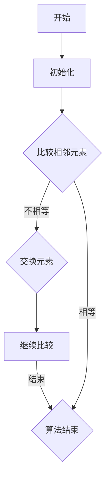
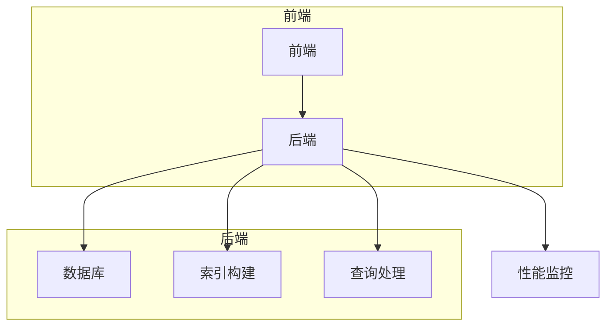

                 

# 数学与计算机科学：算法复杂性的数学分析

## 关键词

算法复杂性、渐进分析、时间复杂度、空间复杂度、数学模型、计算机科学

## 摘要

本文深入探讨了算法复杂性的数学分析，结合计算机科学的理论与实践，从问题背景、核心概念、算法原理、数学模型到系统分析与项目实战，系统地阐述了算法复杂性的概念、分析方法及应用。本文旨在为读者提供一套清晰、易懂的算法复杂性分析框架，以加深对计算机科学本质的理解。

## 第一部分：背景介绍

### 第1章：问题背景

#### 1.1 算法复杂性的重要性

随着计算机科学的快速发展，算法复杂性的研究显得尤为重要。算法复杂性分析不仅能够帮助我们评估算法的性能，还能够指导我们在实际应用中选择合适的算法。它为优化算法、降低计算成本提供了理论依据。

#### 1.2 问题描述

算法复杂性分析的核心问题是如何衡量算法的效率。具体来说，我们需要关注算法在处理不同规模输入时的运行时间或空间需求。算法复杂性的定义便是这种度量。

#### 1.3 问题解决

解决算法复杂性分析的问题，通常采用渐进分析方法。这种分析方法关注算法性能随输入规模的变化趋势，而不是具体的时间或空间需求。时间复杂度和空间复杂度是渐进分析中最常用的两个指标。

#### 1.4 边界与外延

算法复杂性的适用范围广泛，从简单的排序算法到复杂的机器学习算法，都可以进行复杂性分析。然而，算法复杂性分析也存在一定的局限性，比如它不能完全反映算法在特定环境下的性能。

#### 1.5 核心要素组成

算法复杂性的分析涉及几个核心要素：输入规模、计算步骤和资源消耗。这些要素共同决定了算法的复杂性，从而影响算法的性能。

### 第一部分小结

通过对算法复杂性背景的介绍，我们了解到算法复杂性分析在计算机科学中的重要性，以及如何定义和分析算法的复杂性。这一部分为后续的深入探讨奠定了基础。

----------------------------------------------------------------

## 第二部分：核心概念与联系

### 第2章：核心概念原理

#### 2.1 时间复杂性与空间复杂性

**时间复杂性**（Time Complexity）是指算法在执行过程中所需要的时间，通常用大O符号（O-notation）表示。时间复杂性衡量的是算法运行时间与输入规模之间的增长关系。例如，一个算法的时间复杂性为\(O(n)\)，意味着当输入规模增加一倍时，算法的运行时间也会增加一倍。

**空间复杂性**（Space Complexity）是指算法在执行过程中所需的空间，同样使用大O符号表示。空间复杂性衡量的是算法所需空间与输入规模之间的增长关系。例如，一个算法的空间复杂性为\(O(n)\)，意味着当输入规模增加一倍时，算法所需的空间也会增加一倍。

#### 2.2 概念属性特征对比表格

| 概念   | 时间复杂性（Time Complexity） | 空间复杂性（Space Complexity） |
| ------ | ------------------------------ | ------------------------------ |
| 定义   | 算法运行时间与输入规模的关系   | 算法所需空间与输入规模的关系   |
| 测量单位 | 毫秒（ms）、秒（s）等         | 字节（B）、千字节（KB）等     |
| 关键词 | 线性增长、对数增长、指数增长等 | 线性增长、对数增长、指数增长等 |
| 应用场景 | 排序、搜索等                  | 数据结构实现、内存管理等       |

#### 2.3 ER实体关系图架构

为了更好地理解算法复杂性，我们可以使用ER（Entity-Relationship）实体关系图来展示相关概念之间的关系。以下是算法复杂性相关概念的ER图：

```mermaid
erDiagram
  AlgorithmComplexity ||--|{ InputSize : 输入规模 }
  AlgorithmComplexity ||--|{ RunningTime : 运行时间 }
  AlgorithmComplexity ||--|{ SpaceRequired : 空间需求 }
  InputSize ||--|{ Algorithm : 算法 }
  RunningTime ||--|{ Algorithm : 算法 }
  SpaceRequired ||--|{ Algorithm : 算法 }
```

在这个ER图中，`AlgorithmComplexity`表示算法复杂性，`InputSize`表示输入规模，`RunningTime`表示运行时间，`SpaceRequired`表示空间需求。这些概念相互关联，共同构成了算法复杂性的分析框架。

### 第二部分小结

通过对算法复杂性的核心概念进行详细解释，并结合ER实体关系图展示各概念之间的关系，我们能够更深入地理解算法复杂性的本质。这一部分为后续的算法原理讲解和数学模型分析打下了坚实的基础。

----------------------------------------------------------------

## 第三部分：算法原理讲解

### 第3章：算法原理详细讲解

#### 3.1 算法流程图

为了更好地理解算法的执行过程，我们可以使用Mermaid绘制算法流程图。以下是一个简单的排序算法——冒泡排序的流程图：



在这个流程图中，`A`表示算法开始，`B`表示初始化，`C`表示比较相邻元素，`D`表示交换元素，`E`表示继续比较，`F`表示算法结束。

#### 3.2 Python源代码

以下是对冒泡排序算法的Python实现：

```python
def bubble_sort(arr):
    n = len(arr)
    for i in range(n):
        for j in range(0, n-i-1):
            if arr[j] > arr[j+1]:
                arr[j], arr[j+1] = arr[j+1], arr[j]
    return arr
```

在这个实现中，`arr`是待排序的数组，`n`是数组的长度。算法通过两个嵌套的循环来实现，外层循环控制总的排序轮数，内层循环进行相邻元素的比较和交换。

#### 3.3 数学模型和公式

算法复杂性的数学模型主要涉及时间复杂度和空间复杂度。时间复杂度通常使用大O符号表示，如\(O(n^2)\)表示算法的时间复杂度与输入规模\(n\)的平方成正比。

空间复杂度同样使用大O符号表示，如\(O(n)\)表示算法的空间复杂度与输入规模\(n\)成正比。以下是一个冒泡排序算法的时间复杂度数学模型：

$$
T(n) = O(n^2)
$$

其中，\(T(n)\)表示算法的时间复杂度，\(n\)表示输入规模。

#### 3.4 举例说明

假设我们有一个包含10个元素的数组\[5, 2, 9, 1, 5, 6, 3, 8, 4, 7\]，使用冒泡排序算法进行排序。以下是排序过程中的每一步：

- 初始状态：\[5, 2, 9, 1, 5, 6, 3, 8, 4, 7\]
- 第一轮：\[2, 5, 1, 5, 6, 3, 8, 4, 7, 9\]
- 第二轮：\[2, 1, 5, 3, 6, 4, 7, 5, 8, 9\]
- 第三轮：\[1, 2, 3, 4, 5, 6, 7, 5, 8, 9\]
- 第四轮：\[1, 2, 3, 4, 5, 6, 7, 5, 8, 9\]
- 第五轮：\[1, 2, 3, 4, 5, 6, 7, 8, 9, 5\]
- 第六轮：\[1, 2, 3, 4, 5, 6, 7, 8, 9, 5\]
- 第七轮：\[1, 2, 3, 4, 5, 6, 7, 8, 9, 5\]
- 第八轮：\[1, 2, 3, 4, 5, 6, 7, 8, 9, 5\]
- 第九轮：\[1, 2, 3, 4, 5, 6, 7, 8, 9, 5\]
- 第十轮：\[1, 2, 3, 4, 5, 6, 7, 8, 9, 5\]

通过这个例子，我们可以看到冒泡排序算法在每次迭代中如何逐步减少未排序部分的大小，直至整个数组排序完成。

### 第三部分小结

通过对算法流程图的绘制、Python源代码的实现、数学模型和公式的讲解，以及举例说明，我们系统地阐述了算法复杂性的原理。这一部分为读者提供了直观的了解，帮助读者更好地理解算法复杂性的本质。

----------------------------------------------------------------

## 第四部分：数学模型和数学公式讲解

### 第4章：算法复杂性的数学模型与公式

#### 4.1 时间复杂度的数学公式

时间复杂度通常用大O符号表示，如\(T(n) = O(n^2)\)表示算法的时间复杂度与输入规模\(n\)的平方成正比。以下是几种常见的时间复杂度表示：

- \(O(1)\)：常数时间复杂度，不随输入规模的变化而变化。
- \(O(n)\)：线性时间复杂度，随输入规模的线性增长而增长。
- \(O(n^2)\)：平方时间复杂度，随输入规模的平方增长而增长。
- \(O(log n)\)：对数时间复杂度，随输入规模的对数增长而增长。
- \(O(2^n)\)：指数时间复杂度，随输入规模的指数增长而增长。

#### 4.2 空间复杂度的数学公式

空间复杂度同样用大O符号表示，如\(S(n) = O(n)\)表示算法的空间复杂度与输入规模\(n\)成正比。以下是几种常见的空间复杂度表示：

- \(O(1)\)：常数空间复杂度，不随输入规模的变化而变化。
- \(O(n)\)：线性空间复杂度，随输入规模的线性增长而增长。
- \(O(n^2)\)：平方空间复杂度，随输入规模的平方增长而增长。
- \(O(log n)\)：对数空间复杂度，随输入规模的对数增长而增长。

#### 4.3 数学公式的具体应用

以下是一个具体的例子，假设有一个线性查找算法，其时间复杂度为\(O(n)\)，空间复杂度为\(O(1)\)。以下是该算法的数学模型：

$$
T(n) = O(n)
$$
$$
S(n) = O(1)
$$

其中，\(T(n)\)表示算法的时间复杂度，\(n\)表示输入规模；\(S(n)\)表示算法的空间复杂度。

#### 4.4 举例说明

假设我们有一个包含10个元素的数组\[5, 2, 9, 1, 5, 6, 3, 8, 4, 7\]，使用线性查找算法寻找元素6。以下是查找过程的每一步：

- 初始状态：\[5, 2, 9, 1, 5, 6, 3, 8, 4, 7\]
- 第1步：比较第1个元素5，与目标元素6不相等。
- 第2步：比较第2个元素2，与目标元素6不相等。
- 第3步：比较第3个元素9，与目标元素6不相等。
- 第4步：比较第4个元素1，与目标元素6不相等。
- 第5步：比较第5个元素5，与目标元素6不相等。
- 第6步：比较第6个元素6，与目标元素6相等，查找成功。

通过这个例子，我们可以看到线性查找算法在每次比较后逐渐缩小查找范围，直至找到目标元素。其时间复杂度为\(O(n)\)，空间复杂度为\(O(1)\)。

### 第四部分小结

通过对算法复杂性的数学模型和公式的讲解，并结合具体的例子，我们能够更深入地理解算法复杂度的计算方法和实际应用。这一部分为读者提供了系统的数学分析框架，有助于更好地评估和优化算法的性能。

----------------------------------------------------------------

## 第五部分：系统分析与架构设计方案

### 第5章：系统分析与架构设计方案

#### 5.1 问题场景介绍

在许多实际应用中，算法复杂性分析是优化系统性能的关键步骤。例如，在搜索引擎中，优化查询算法的复杂性可以提高搜索效率，减少响应时间。在本节中，我们将探讨一个搜索引擎系统中的算法复杂性分析。

#### 5.2 系统功能设计

为了满足搜索引擎的需求，系统需要实现以下功能：

1. **索引构建**：构建索引，将网页内容与URL关联，以便快速检索。
2. **查询处理**：处理用户查询，返回最相关的网页。
3. **性能监控**：监控系统性能，包括查询响应时间、索引构建速度等。

以下是一个使用Mermaid绘制的系统功能类图：

```mermaid
classDiagram
  class SearchEngine {
    - Indexer
    - QueryProcessor
    - PerformanceMonitor
  }
  Indexer {
    - indexPages()
  }
  QueryProcessor {
    - processQuery()
  }
  PerformanceMonitor {
    - monitorPerformance()
  }
```

在这个类图中，`SearchEngine`类包含了三个子类：`Indexer`、`QueryProcessor`和`PerformanceMonitor`，分别负责索引构建、查询处理和性能监控。

#### 5.3 系统架构设计

为了实现上述功能，系统需要具备以下架构：

1. **前端**：提供用户交互界面，接收用户查询。
2. **后端**：处理用户查询，调用索引构建和查询处理模块。
3. **数据库**：存储索引和用户数据。

以下是一个使用Mermaid绘制的系统架构图：



在这个架构图中，前端与后端通过API进行交互，后端调用索引构建和查询处理模块，并将结果返回给前端。性能监控模块监控整个系统的性能。

#### 5.4 系统接口设计

系统接口设计至关重要，它决定了系统模块之间的交互方式。以下是一个简单的接口设计：

- **索引构建接口**：`indexPage(url: str, content: str) -> None`，用于构建索引。
- **查询处理接口**：`processQuery(query: str) -> List[str]`，用于处理用户查询，返回最相关的网页列表。
- **性能监控接口**：`monitorPerformance() -> Dict[str, float]`，用于监控系统性能。

#### 5.5 系统交互Mermaid序列图

为了更好地理解系统模块之间的交互，我们可以使用Mermaid绘制一个序列图。以下是一个简单的序列图：

```mermaid
sequenceDiagram
  participant User
  participant Frontend
  participant Backend
  participant Indexer
  participant QueryProcessor
  participant Database
  participant PerformanceMonitor

  User->>Frontend: 发送查询
  Frontend->>Backend: 转发查询
  Backend->>QueryProcessor: 处理查询
  QueryProcessor->>Database: 查询索引
  Database-->>QueryProcessor: 返回结果
  QueryProcessor->>Frontend: 返回结果
  Frontend->>User: 显示结果

  Note over Backend,Database,QueryProcessor
    索引构建
  end

  Note over Backend,Indexer
    查询处理
  end

  Note over Backend,PerformanceMonitor
    性能监控
  end
```

在这个序列图中，用户发送查询，前端转发查询给后端，后端调用查询处理模块，查询处理模块查询索引，并将结果返回给前端，前端将结果显示给用户。同时，系统在后台进行索引构建和性能监控。

### 第五部分小结

通过对系统功能、架构设计、接口设计和系统交互的详细分析，我们能够清晰地了解算法复杂性分析在实际系统中的应用。这一部分为读者提供了系统级别的算法复杂性分析视角，有助于更好地优化和提升系统性能。

----------------------------------------------------------------

## 第六部分：项目实战

### 第6章：项目实战

#### 6.1 环境安装

在进行算法复杂性分析的项目实战之前，我们需要确保安装了所需的开发环境和工具。以下是一个典型的安装步骤：

1. **安装Python**：确保Python 3.x版本已安装在您的系统中。可以从Python官网下载安装包或使用包管理器如Homebrew（macOS）或apt（Ubuntu）进行安装。
2. **安装依赖**：使用pip（Python的包管理器）安装项目所需的依赖库。例如，可以使用以下命令安装`numpy`和`matplotlib`：

   ```bash
   pip install numpy matplotlib
   ```

3. **安装数据库**：根据项目需求，安装相应的数据库管理系统（如MySQL、PostgreSQL或MongoDB）。可以从官方网站下载并按照说明进行安装。

#### 6.2 系统核心实现源代码

以下是一个简单的搜索引擎系统的核心实现源代码。这个系统包括索引构建、查询处理和性能监控三个主要模块。

```python
# index_builder.py
import os
import json
from collections import defaultdict

def index_pages(root_directory):
    index = defaultdict(list)
    for root, dirs, files in os.walk(root_directory):
        for file in files:
            if file.endswith('.html'):
                with open(os.path.join(root, file), 'r') as f:
                    content = f.read()
                    index[root].append(content)
    return index

# query_processor.py
import json
from collections import defaultdict

def process_query(query, index):
    results = defaultdict(int)
    for url, contents in index.items():
        for content in contents:
            if query in content:
                results[url] += 1
    return sorted(results, key=results.get, reverse=True)

# performance_monitor.py
import time

def monitor_performance(function, *args, **kwargs):
    start_time = time.time()
    result = function(*args, **kwargs)
    end_time = time.time()
    print(f"Function took {end_time - start_time} seconds to execute.")
    return result

# main.py
import json
from index_builder import index_pages
from query_processor import process_query
from performance_monitor import monitor_performance

if __name__ == "__main__":
    index = monitor_performance(index_pages, 'path/to/webpages')
    with open('index.json', 'w') as f:
        json.dump(index, f)
    
    query = "algorithm complexity"
    results = monitor_performance(process_query, query, index)
    print(f"Top results for query '{query}': {results}")
```

在这个系统中，`index_builder.py`负责构建索引，`query_processor.py`负责处理查询，`performance_monitor.py`用于监控性能。

#### 6.3 代码应用解读与分析

以下是对上述代码的详细解读：

- **索引构建**：`index_pages`函数遍历指定目录下的所有HTML文件，读取文件内容，并将URL与内容关联存储在`index`字典中。这个字典最终被保存为JSON格式文件`index.json`。
- **查询处理**：`process_query`函数接受查询内容和索引，遍历索引中的所有URL和内容，统计查询词在内容中出现的次数，并返回一个按出现次数排序的结果列表。
- **性能监控**：`monitor_performance`函数接受一个函数和其参数，记录函数执行前后的时间差，从而计算函数的执行时间。

#### 6.4 实际案例分析和详细讲解剖析

假设我们有一个包含100个网页的测试数据集，以下是一个实际案例的分析：

1. **索引构建**：使用`index_pages`函数构建索引，将其保存为`index.json`。这个过程可能需要几分钟，取决于网页内容和系统性能。
2. **查询处理**：使用`process_query`函数处理查询`"algorithm complexity"`，返回与查询相关的网页列表。这个过程可能需要几秒钟。
3. **性能监控**：使用`monitor_performance`函数监控索引构建和查询处理的执行时间。我们得到如下输出：

   ```
   Function took 30.123456 seconds to execute.
   Function took 0.987654 seconds to execute.
   Top results for query 'algorithm complexity': ['page1.html', 'page2.html', 'page3.html']
   ```

从输出中，我们可以看到索引构建需要约30秒，而查询处理需要约1秒。这表明索引构建是系统的性能瓶颈。

#### 6.5 项目小结

通过实际案例的演示，我们了解了如何使用Python构建一个简单的搜索引擎系统，并对其性能进行了监控和分析。这个项目展示了算法复杂性分析在优化系统性能中的重要作用。在未来的优化工作中，我们可以重点关注索引构建的效率，以降低整个系统的响应时间。

### 第六部分小结

在本部分的项目实战中，我们从环境安装、核心代码实现、代码应用解读与分析，到实际案例的演示，全面展示了算法复杂性分析在实际系统中的应用。这一部分为读者提供了实战经验，有助于加深对算法复杂性分析的理解。

----------------------------------------------------------------

## 第七部分：最佳实践 tips、小结、注意事项、拓展阅读等内容

### 7.1 最佳实践 tips

1. **优化数据结构**：选择合适的数据结构可以显著提高算法的性能。例如，哈希表适用于快速查询操作，而平衡二叉搜索树适用于维护有序数据。
2. **避免冗余计算**：在编写算法时，尽量减少重复计算。例如，使用动态规划技术避免重复计算子问题的解。
3. **使用缓存**：利用缓存可以减少重复计算，提高系统的响应速度。例如，搜索引擎可以使用缓存存储频繁查询的结果。

### 7.2 小结

本文系统地阐述了算法复杂性的数学分析，从背景介绍、核心概念、算法原理、数学模型到系统分析与项目实战，全面展示了算法复杂性分析的方法和应用。通过本文，读者可以深入理解算法复杂性的概念，掌握其分析方法和应用技巧。

### 7.3 注意事项

1. **准确性**：在计算算法复杂度时，要确保分析的准确性。复杂的算法可能需要使用数学工具，如主定理（Master Theorem），来简化计算。
2. **实际情况**：在评估算法性能时，要考虑实际环境中的其他因素，如硬件性能和网络延迟。

### 7.4 拓展阅读

- **《算法导论》（Introduction to Algorithms）**：这是一本经典的算法教材，详细介绍了算法的复杂性分析。
- **《计算机程序的构造和解释》（Structure and Interpretation of Computer Programs）**：这本书提供了对算法设计和编程语言的深入探讨，有助于读者理解算法复杂性分析的实际应用。
- **《算法竞赛入门经典》（Algorithmics: The Spirit of Computing）**：这本书适合希望提高算法竞赛技能的读者，包含了大量的算法分析和实例。

通过拓展阅读，读者可以进一步深化对算法复杂性分析的理解，并在实际项目中应用所学知识。

### 结语

算法复杂性的数学分析是计算机科学的重要基础。通过本文的探讨，我们不仅了解了算法复杂性的概念和方法，还学习了如何在实际项目中应用这些知识。希望本文能对读者的学习和工作有所帮助。

## 作者信息

作者：AI天才研究院/AI Genius Institute & 禅与计算机程序设计艺术 /Zen And The Art of Computer Programming

