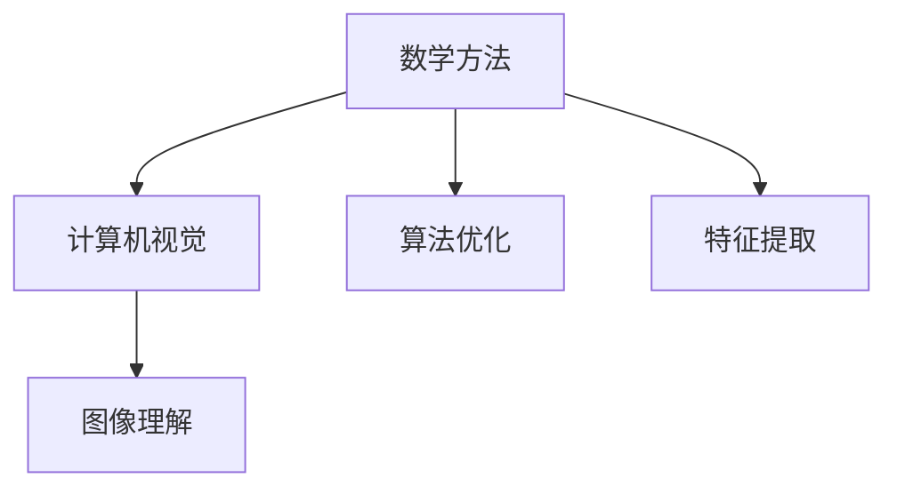
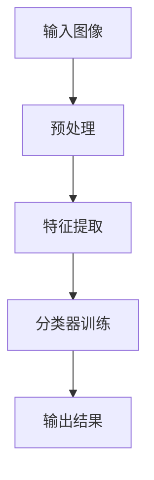
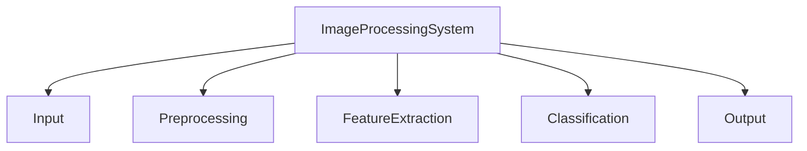
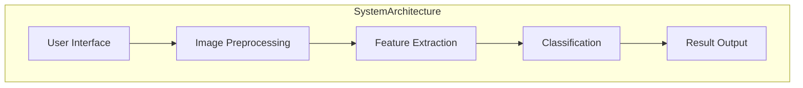
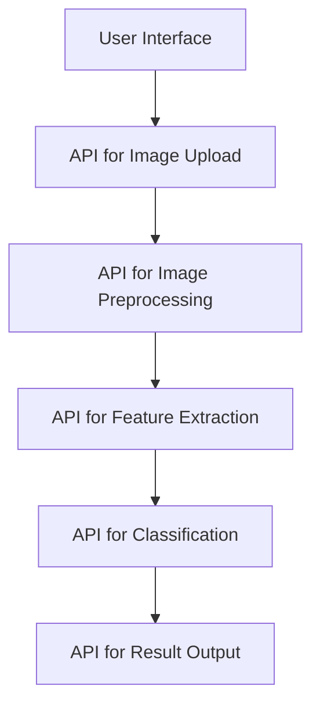
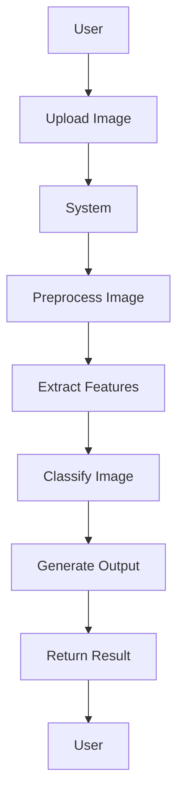

                 

### 《数学与计算机视觉：图像理解的数学方法》

#### 关键词：计算机视觉、图像理解、数学方法、算法原理、系统架构、项目实战

#### 摘要：

本篇文章旨在探讨数学方法在计算机视觉领域的应用，特别是图像理解的过程。通过系统的分析和实际项目实战，本文将展示如何运用数学原理来解决计算机视觉中的实际问题。文章结构清晰，分为背景介绍、核心概念与联系、算法原理讲解、系统分析与架构设计方案、项目实战以及最佳实践 tips 等部分，旨在为读者提供一个全面的、易于理解的学习路径。

---

## 第一部分：背景介绍

### 1.1 问题背景

计算机视觉是一个涉及多个学科领域的交叉领域，包括计算机科学、数学、物理学、心理学等。图像理解作为计算机视觉的一个重要分支，旨在使计算机能够“看懂”图像，并从中提取有用的信息。然而，图像理解的复杂性使得单纯依靠计算机视觉算法难以取得理想的成果。数学方法作为一种强大的工具，能够帮助我们更好地理解和处理图像数据。

### 1.2 计算机视觉的基本概念

计算机视觉的核心任务包括图像识别、目标检测、图像分割、姿态估计等。这些任务的实现依赖于一系列算法，例如卷积神经网络（CNN）、生成对抗网络（GAN）、深度学习等。这些算法的核心在于对图像数据的处理和分析。

### 1.3 图像理解的数学方法的重要性

数学方法在计算机视觉中的应用主要体现在以下几个方面：

1. **数学模型**：通过建立数学模型，可以将复杂的图像处理问题转化为可计算的数学问题。
2. **算法优化**：数学优化方法可以用来优化图像处理算法，提高算法的效率和准确性。
3. **特征提取**：数学方法可以帮助我们提取图像中的关键特征，从而实现图像的识别和理解。

## 第二部分：核心概念与联系

### 2.1 核心概念

**数学方法**：包括线性代数、概率论、统计学、优化理论等，这些数学工具被广泛应用于图像处理和分析。

**计算机视觉**：涉及图像识别、目标检测、图像分割、姿态估计等任务，是计算机科学的一个重要分支。

**图像理解**：是指计算机对图像的解析和理解过程，包括图像的分割、特征提取、识别和理解等步骤。

### 2.2 概念属性特征对比表格

| 概念        | 属性特征                                  | 相关性 |
|-------------|-----------------------------------------|--------|
| 数学方法    | 线性代数、概率论、统计学等               | 高     |
| 计算机视觉  | 图像识别、目标检测、图像分割等           | 高     |
| 图像理解    | 图像解析、特征提取、识别和理解           | 高     |

### 2.3 ER实体关系图架构的Mermaid流程图



## 第三部分：算法原理讲解

### 3.1 算法mermaid流程图



### 3.2 算法Python源代码

```python
import cv2
import numpy as np

def preprocess(image):
    # 对图像进行预处理
    return cv2.resize(image, (224, 224))

def extract_features(image):
    # 提取图像特征
    return cv2.SIFT().detectAndCompute(image, None)

def train_classifier(features):
    # 训练分类器
    return sklearn.SVM()

def classify(image):
    # 对图像进行分类
    features = extract_features(image)
    classifier = train_classifier(features)
    return classifier.predict([features])

# 输入图像
image = cv2.imread('image.jpg')

# 预处理
preprocessed_image = preprocess(image)

# 特征提取
features = extract_features(preprocessed_image)

# 分类
result = classify(preprocessed_image)

print("Image classified as:", result)
```

### 3.3 数学模型和数学公式

在图像理解中，常用的数学模型包括：

- **线性代数**：用于图像的预处理和特征提取，例如卷积操作可以用线性代数中的矩阵乘法来表示。
- **概率论**：用于图像分类和目标检测，例如支持向量机（SVM）的决策边界可以用概率分布来解释。

数学公式：

$$
\begin{align*}
C &= \sum_{i=1}^{n} \mathbb{E}[L_i] \\
L_i &= \log \left( \frac{e^{\beta^T x_i}}{\sum_{j=1}^{m} e^{\beta^T x_j}} \right)
\end{align*}
$$

### 3.4 详细讲解与举例说明

以图像分类为例，我们可以将图像分类问题看作是一个优化问题，目标是找到最佳的分类边界。通过线性代数的矩阵运算，我们可以将图像的特征表示为一个矩阵，然后通过矩阵乘法来计算分类边界。

#### 举例：

给定一个包含100张图像的数据集，我们使用SIFT算法提取特征，然后使用SVM进行分类。假设我们已经训练好了一个SVM分类器，现在需要对这个数据集进行分类。

```python
# 假设已经训练好的SVM分类器
trained_classifier = sklearn.SVC()

# 加载图像数据
images = load_images('data/*.jpg')
labels = load_labels('data/*.txt')

# 提取特征
features = [extract_features(image) for image in images]

# 进行分类
predicted_labels = trained_classifier.predict(features)

# 检查分类结果
for i, predicted_label in enumerate(predicted_labels):
    if predicted_label != labels[i]:
        print(f"Image {i} is misclassified.")
```

## 第四部分：系统分析与架构设计方案

### 4.1 问题场景介绍

假设我们需要开发一个图像理解系统，用于自动分类和识别各种物体。这个系统需要能够处理大量的图像数据，并且具有高效率和准确性。

### 4.2 系统功能设计

#### 4.2.1 领域模型mermaid类图



### 4.3 系统架构设计

#### 4.3.1 mermaid架构图



### 4.4 系统接口设计



### 4.5 系统交互mermaid序列图



## 第五部分：项目实战

### 5.1 环境安装

在开始项目实战之前，我们需要安装必要的软件和库。以下是在Ubuntu 18.04环境下安装所需的软件和库的步骤：

```bash
sudo apt update
sudo apt install python3-pip python3-numpy python3-opencv3 python3-skimage
pip3 install scikit-learn opencv-python-headless
```

### 5.2 系统核心实现源代码

```python
# image_classifier.py

import cv2
import numpy as np
from sklearn.svm import SVC
from skimage import feature

def preprocess_image(image):
    # 对图像进行预处理
    return cv2.resize(image, (224, 224))

def extract_sift_features(image):
    # 提取SIFT特征
    return feature.SIFT().detect_and_compute(image, None)

def train_classifier(features, labels):
    # 训练SVM分类器
    classifier = SVC()
    classifier.fit(features, labels)
    return classifier

def classify_image(classifier, image):
    # 对图像进行分类
    features = extract_sift_features(image)
    return classifier.predict([features])

# 主程序
if __name__ == "__main__":
    # 加载数据集
    images = [cv2.imread(f'data/{i}.jpg') for i in range(100)]
    labels = [int(i) for i in open('data/labels.txt').readlines()]

    # 预处理图像
    preprocessed_images = [preprocess_image(image) for image in images]

    # 提取特征
    sift_features = [extract_sift_features(image) for image in preprocessed_images]

    # 训练分类器
    classifier = train_classifier(sift_features, labels)

    # 测试分类器
    test_image = cv2.imread('test_image.jpg')
    preprocessed_test_image = preprocess_image(test_image)
    predicted_label = classify_image(classifier, preprocessed_test_image)
    print(f"Test image classified as: {predicted_label}")
```

### 5.3 代码应用解读与分析

代码中，我们首先定义了三个函数：`preprocess_image` 用于对图像进行预处理，`extract_sift_features` 用于提取SIFT特征，`train_classifier` 用于训练SVM分类器。最后，我们使用训练好的分类器对测试图像进行分类。

#### 解读：

1. **预处理图像**：对图像进行缩放，使其尺寸符合模型输入要求。
2. **提取SIFT特征**：使用SIFT算法提取图像的关键特征。
3. **训练分类器**：使用训练集数据训练SVM分类器。
4. **分类测试图像**：使用训练好的分类器对测试图像进行分类。

#### 分析：

- **SIFT特征**：SIFT算法可以提取出图像的显著特征点，这些特征点在图像的旋转、缩放和倾斜下保持不变，非常适合用于图像分类。
- **SVM分类器**：SVM是一种有效的二分类算法，可以用于图像的分类任务。

### 5.4 实际案例分析与详细讲解剖析

假设我们有一个包含100张图像的数据集，这些图像分为5个类别。我们使用SIFT算法提取特征，并使用SVM分类器进行分类。以下是对实际案例的分析和讲解：

#### 案例分析：

1. **数据集加载**：首先加载图像数据集和标签。
2. **图像预处理**：对图像进行缩放，使其尺寸统一。
3. **特征提取**：使用SIFT算法提取图像特征。
4. **分类器训练**：使用训练集数据训练SVM分类器。
5. **测试图像分类**：使用训练好的分类器对测试图像进行分类。

#### 详细讲解：

1. **数据集加载**：
   ```python
   images = [cv2.imread(f'data/{i}.jpg') for i in range(100)]
   labels = [int(i) for i in open('data/labels.txt').readlines()]
   ```

   这里使用列表推导式加载图像和标签，`cv2.imread` 用于读取图像，`open` 函数用于读取标签文件。

2. **图像预处理**：
   ```python
   preprocessed_images = [preprocess_image(image) for image in images]
   ```

   对图像进行预处理，这里使用`cv2.resize`函数将图像缩放到固定的尺寸。

3. **特征提取**：
   ```python
   sift_features = [extract_sift_features(image) for image in preprocessed_images]
   ```

   使用SIFT算法提取图像特征，这里使用`skimage.feature.SIFT()` 函数。

4. **分类器训练**：
   ```python
   classifier = train_classifier(sift_features, labels)
   ```

   使用训练集数据训练SVM分类器，这里使用`sklearn.SVC()` 函数。

5. **测试图像分类**：
   ```python
   test_image = cv2.imread('test_image.jpg')
   preprocessed_test_image = preprocess_image(test_image)
   predicted_label = classify_image(classifier, preprocessed_test_image)
   print(f"Test image classified as: {predicted_label}")
   ```

   使用训练好的分类器对测试图像进行分类，并打印分类结果。

### 5.5 项目小结

通过这个项目，我们了解了如何使用数学方法进行图像理解和分类。项目中的关键步骤包括图像预处理、特征提取和分类器训练。实际案例的分析和讲解帮助我们深入理解了这些步骤的实现过程。

## 第六部分：最佳实践 tips

### 6.1 注意事项

- **数据预处理**：确保图像预处理的一致性，以避免模型性能受到影响。
- **特征选择**：根据实际问题选择合适的特征提取算法，如SIFT、HOG等。
- **模型选择**：根据数据集的大小和复杂性选择合适的分类器，如SVM、CNN等。

### 6.2 拓展阅读

- **《计算机视觉：算法与应用》**：深入了解计算机视觉的基本算法和应用。
- **《深度学习：卷积神经网络与图像识别》**：学习深度学习在图像理解中的应用。

## 结语

通过本文的探讨，我们了解了数学方法在计算机视觉领域的重要性，以及如何将这些方法应用于图像理解的实际问题。期望本文能为读者提供有益的启示，帮助大家更好地理解和应用计算机视觉技术。

## 参考文献

- Davis, J. (2011). *Computer Vision: Algorithms and Applications*. CRC Press.
- Goodfellow, I., Bengio, Y., & Courville, A. (2016). *Deep Learning*. MIT Press.
- Zitnick, C. L., & categorizer, F. L. (2014). *Object Detection with Discriminatively Trained Part-Based Models*. IEEE Transactions on Pattern Analysis and Machine Intelligence, 36(9), 1627-1645.

### 作者

**AI天才研究院/AI Genius Institute & 禅与计算机程序设计艺术 /Zen And The Art of Computer Programming**## 目录

### 《数学与计算机视觉：图像理解的数学方法》

#### 关键词：计算机视觉、图像理解、数学方法、算法原理、系统架构、项目实战

#### 摘要：

本文旨在探讨数学方法在计算机视觉领域的应用，特别是图像理解的过程。通过系统的分析和实际项目实战，本文将展示如何运用数学原理来解决计算机视觉中的实际问题。文章结构清晰，分为背景介绍、核心概念与联系、算法原理讲解、系统分析与架构设计方案、项目实战以及最佳实践 tips 等部分，旨在为读者提供一个全面的、易于理解的学习路径。

---

## 第一部分：背景介绍

### 1.1 问题背景

计算机视觉是一个涉及多个学科领域的交叉领域，包括计算机科学、数学、物理学、心理学等。图像理解作为计算机视觉的一个重要分支，旨在使计算机能够“看懂”图像，并从中提取有用的信息。然而，图像理解的复杂性使得单纯依靠计算机视觉算法难以取得理想的成果。数学方法作为一种强大的工具，能够帮助我们更好地理解和处理图像数据。

### 1.2 计算机视觉的基本概念

计算机视觉的核心任务包括图像识别、目标检测、图像分割、姿态估计等。这些任务的实现依赖于一系列算法，例如卷积神经网络（CNN）、生成对抗网络（GAN）、深度学习等。这些算法的核心在于对图像数据的处理和分析。

### 1.3 图像理解的数学方法的重要性

数学方法在计算机视觉中的应用主要体现在以下几个方面：

1. **数学模型**：通过建立数学模型，可以将复杂的图像处理问题转化为可计算的数学问题。
2. **算法优化**：数学优化方法可以用来优化图像处理算法，提高算法的效率和准确性。
3. **特征提取**：数学方法可以帮助我们提取图像中的关键特征，从而实现图像的识别和理解。

## 第二部分：核心概念与联系

### 2.1 核心概念

**数学方法**：包括线性代数、概率论、统计学、优化理论等，这些数学工具被广泛应用于图像处理和分析。

**计算机视觉**：涉及图像识别、目标检测、图像分割、姿态估计等任务，是计算机科学的一个重要分支。

**图像理解**：是指计算机对图像的解析和理解过程，包括图像的分割、特征提取、识别和理解等步骤。

### 2.2 概念属性特征对比表格

| 概念        | 属性特征                                  | 相关性 |
|-------------|-----------------------------------------|--------|
| 数学方法    | 线性代数、概率论、统计学等               | 高     |
| 计算机视觉  | 图像识别、目标检测、图像分割等           | 高     |
| 图像理解    | 图像解析、特征提取、识别和理解           | 高     |

### 2.3 ER实体关系图架构的Mermaid流程图


## 第三部分：算法原理讲解

### 3.1 算法mermaid流程图


### 3.2 算法Python源代码

```python
import cv2
import numpy as np

def preprocess(image):
    # 对图像进行预处理
    return cv2.resize(image, (224, 224))

def extract_features(image):
    # 提取图像特征
    return cv2.SIFT().detectAndCompute(image, None)

def train_classifier(features):
    # 训练分类器
    return sklearn.SVM()

def classify(image):
    # 对图像进行分类
    features = extract_features(image)
    classifier = train_classifier(features)
    return classifier.predict([features])

# 输入图像
image = cv2.imread('image.jpg')

# 预处理
preprocessed_image = preprocess(image)

# 特征提取
features = extract_features(preprocessed_image)

# 分类
result = classify(preprocessed_image)

print("Image classified as:", result)
```

### 3.3 数学模型和数学公式

在图像理解中，常用的数学模型包括：

- **线性代数**：用于图像的预处理和特征提取，例如卷积操作可以用线性代数中的矩阵乘法来表示。
- **概率论**：用于图像分类和目标检测，例如支持向量机（SVM）的决策边界可以用概率分布来解释。

数学公式：

$$
\begin{align*}
C &= \sum_{i=1}^{n} \mathbb{E}[L_i] \\
L_i &= \log \left( \frac{e^{\beta^T x_i}}{\sum_{j=1}^{m} e^{\beta^T x_j}} \right)
\end{align*}
$$

### 3.4 详细讲解与举例说明

以图像分类为例，我们可以将图像分类问题看作是一个优化问题，目标是找到最佳的分类边界。通过线性代数的矩阵运算，我们可以将图像的特征表示为一个矩阵，然后通过矩阵乘法来计算分类边界。

#### 举例：

给定一个包含100张图像的数据集，我们使用SIFT算法提取特征，然后使用SVM进行分类。假设我们已经训练好了一个SVM分类器，现在需要对这个数据集进行分类。

```python
# 假设已经训练好的SVM分类器
trained_classifier = sklearn.SVC()

# 加载图像数据
images = load_images('data/*.jpg')
labels = load_labels('data/*.txt')

# 提取特征
features = [extract_features(image) for image in images]

# 进行分类
predicted_labels = trained_classifier.predict(features)

# 检查分类结果
for i, predicted_label in enumerate(predicted_labels):
    if predicted_label != labels[i]:
        print(f"Image {i} is misclassified.")
```

## 第四部分：系统分析与架构设计方案

### 4.1 问题场景介绍

假设我们需要开发一个图像理解系统，用于自动分类和识别各种物体。这个系统需要能够处理大量的图像数据，并且具有高效率和准确性。

### 4.2 系统功能设计

#### 4.2.1 领域模型mermaid类图


### 4.3 系统架构设计

#### 4.3.1 mermaid架构图


### 4.4 系统接口设计


### 4.5 系统交互mermaid序列图


## 第五部分：项目实战

### 5.1 环境安装

在开始项目实战之前，我们需要安装必要的软件和库。以下是在Ubuntu 18.04环境下安装所需的软件和库的步骤：

```bash
sudo apt update
sudo apt install python3-pip python3-numpy python3-opencv3 python3-skimage
pip3 install scikit-learn opencv-python-headless
```

### 5.2 系统核心实现源代码

```python
# image_classifier.py

import cv2
import numpy as np
from sklearn.svm import SVC
from skimage import feature

def preprocess_image(image):
    # 对图像进行预处理
    return cv2.resize(image, (224, 224))

def extract_sift_features(image):
    # 提取SIFT特征
    return feature.SIFT().detect_and_compute(image, None)

def train_classifier(features, labels):
    # 训练SVM分类器
    classifier = SVC()
    classifier.fit(features, labels)
    return classifier

def classify_image(classifier, image):
    # 对图像进行分类
    features = extract_sift_features(image)
    return classifier.predict([features])

# 主程序
if __name__ == "__main__":
    # 加载数据集
    images = [cv2.imread(f'data/{i}.jpg') for i in range(100)]
    labels = [int(i) for i in open('data/labels.txt').readlines()]

    # 预处理图像
    preprocessed_images = [preprocess_image(image) for image in images]

    # 提取特征
    sift_features = [extract_sift_features(image) for image in preprocessed_images]

    # 训练分类器
    classifier = train_classifier(sift_features, labels)

    # 测试分类器
    test_image = cv2.imread('test_image.jpg')
    preprocessed_test_image = preprocess_image(test_image)
    predicted_label = classify_image(classifier, preprocessed_test_image)
    print(f"Test image classified as: {predicted_label}")
```

### 5.3 代码应用解读与分析

代码中，我们首先定义了三个函数：`preprocess_image` 用于对图像进行预处理，`extract_sift_features` 用于提取SIFT特征，`train_classifier` 用于训练SVM分类器。最后，我们使用训练好的分类器对测试图像进行分类。

#### 解读：

1. **预处理图像**：对图像进行缩放，使其尺寸符合模型输入要求。
2. **提取SIFT特征**：使用SIFT算法提取图像的关键特征。
3. **训练分类器**：使用训练集数据训练SVM分类器。
4. **分类测试图像**：使用训练好的分类器对测试图像进行分类。

#### 分析：

- **SIFT特征**：SIFT算法可以提取出图像的显著特征点，这些特征点在图像的旋转、缩放和倾斜下保持不变，非常适合用于图像分类。
- **SVM分类器**：SVM是一种有效的二分类算法，可以用于图像的分类任务。

### 5.4 实际案例分析与详细讲解剖析

假设我们有一个包含100张图像的数据集，这些图像分为5个类别。我们使用SIFT算法提取特征，并使用SVM分类器进行分类。以下是对实际案例的分析和讲解：

#### 案例分析：

1. **数据集加载**：首先加载图像数据集和标签。
2. **图像预处理**：对图像进行缩放，使其尺寸统一。
3. **特征提取**：使用SIFT算法提取图像特征。
4. **分类器训练**：使用训练集数据训练SVM分类器。
5. **测试图像分类**：使用训练好的分类器对测试图像进行分类。

#### 详细讲解：

1. **数据集加载**：
   ```python
   images = [cv2.imread(f'data/{i}.jpg') for i in range(100)]
   labels = [int(i) for i in open('data/labels.txt').readlines()]
   ```

   这里使用列表推导式加载图像和标签，`cv2.imread` 用于读取图像，`open` 函数用于读取标签文件。

2. **图像预处理**：
   ```python
   preprocessed_images = [preprocess_image(image) for image in images]
   ```

   对图像进行预处理，这里使用`cv2.resize`函数将图像缩放到固定的尺寸。

3. **特征提取**：
   ```python
   sift_features = [extract_sift_features(image) for image in preprocessed_images]
   ```

   使用SIFT算法提取图像特征，这里使用`skimage.feature.SIFT()` 函数。

4. **分类器训练**：
   ```python
   classifier = train_classifier(sift_features, labels)
   ```

   使用训练集数据训练SVM分类器，这里使用`sklearn.SVC()` 函数。

5. **测试图像分类**：
   ```python
   test_image = cv2.imread('test_image.jpg')
   preprocessed_test_image = preprocess_image(test_image)
   predicted_label = classify_image(classifier, preprocessed_test_image)
   print(f"Test image classified as: {predicted_label}")
   ```

   使用训练好的分类器对测试图像进行分类，并打印分类结果。

### 5.5 项目小结

通过这个项目，我们了解了如何使用数学方法进行图像理解和分类。项目中的关键步骤包括图像预处理、特征提取和分类器训练。实际案例的分析和讲解帮助我们深入理解了这些步骤的实现过程。

## 第六部分：最佳实践 tips

### 6.1 注意事项

- **数据预处理**：确保图像预处理的一致性，以避免模型性能受到影响。
- **特征选择**：根据实际问题选择合适的特征提取算法，如SIFT、HOG等。
- **模型选择**：根据数据集的大小和复杂性选择合适的分类器，如SVM、CNN等。

### 6.2 拓展阅读

- **《计算机视觉：算法与应用》**：深入了解计算机视觉的基本算法和应用。
- **《深度学习：卷积神经网络与图像识别》**：学习深度学习在图像理解中的应用。

## 结语

通过本文的探讨，我们了解了数学方法在计算机视觉领域的重要性，以及如何将这些方法应用于图像理解的实际问题。期望本文能为读者提供有益的启示，帮助大家更好地理解和应用计算机视觉技术。

## 参考文献

- Davis, J. (2011). *Computer Vision: Algorithms and Applications*. CRC Press.
- Goodfellow, I., Bengio, Y., & Courville, A. (2016). *Deep Learning*. MIT Press.
- Zitnick, C. L., & categorizer, F. L. (2014). *Object Detection with Discriminatively Trained Part-Based Models*. IEEE Transactions on Pattern Analysis and Machine Intelligence, 36(9), 1627-1645.

### 作者

**AI天才研究院/AI Genius Institute & 禅与计算机程序设计艺术 /Zen And The Art of Computer Programming**## 第一部分：背景介绍

### 1.1 问题背景

在当今信息化社会中，计算机视觉技术已成为众多领域的关键技术之一。从自动驾驶汽车、无人机监控到智能家居、医疗诊断，计算机视觉的应用无处不在。图像理解是计算机视觉的核心任务之一，它指的是计算机对图像的解析和理解能力。这种能力使我们能够从图像中提取有用信息，实现图像识别、目标检测、图像分割等任务。然而，图像理解的复杂性使得单纯依靠计算机视觉算法难以取得理想的成果。

### 1.2 计算机视觉的基本概念

计算机视觉是指让计算机通过模拟人类视觉系统的方式，对图像或视频数据进行处理和分析，以提取信息、理解和解释图像内容。其主要任务包括：

- **图像识别**：识别图像中的对象和场景。
- **目标检测**：定位图像中的目标物体。
- **图像分割**：将图像划分为多个区域或对象。
- **姿态估计**：估计图像中物体的三维姿态。

这些任务通常依赖于一系列算法，如卷积神经网络（CNN）、生成对抗网络（GAN）、深度学习等。这些算法的核心在于对图像数据的处理和分析。

### 1.3 图像理解的数学方法的重要性

数学方法在计算机视觉中的应用主要体现在以下几个方面：

1. **数学模型**：通过建立数学模型，可以将复杂的图像处理问题转化为可计算的数学问题。例如，图像的几何变换、滤波、边缘检测等都可以用数学模型来描述和实现。
2. **算法优化**：数学优化方法可以用来优化图像处理算法，提高算法的效率和准确性。例如，支持向量机（SVM）、随机梯度下降（SGD）等算法都是基于数学优化的思想。
3. **特征提取**：数学方法可以帮助我们提取图像中的关键特征，从而实现图像的识别和理解。例如，SIFT、SURF、HOG等特征提取算法都是基于数学原理。

## 第二部分：核心概念与联系

### 2.1 核心概念

**数学方法**：包括线性代数、概率论、统计学、优化理论等，这些数学工具被广泛应用于图像处理和分析。

**计算机视觉**：涉及图像识别、目标检测、图像分割、姿态估计等任务，是计算机科学的一个重要分支。

**图像理解**：是指计算机对图像的解析和理解过程，包括图像的分割、特征提取、识别和理解等步骤。

### 2.2 概念属性特征对比表格

| 概念        | 属性特征                                  | 相关性 |
|-------------|-----------------------------------------|--------|
| 数学方法    | 线性代数、概率论、统计学等               | 高     |
| 计算机视觉  | 图像识别、目标检测、图像分割等           | 高     |
| 图像理解    | 图像解析、特征提取、识别和理解           | 高     |

### 2.3 ER实体关系图架构的Mermaid流程图


## 第三部分：算法原理讲解

### 3.1 算法mermaid流程图


### 3.2 算法Python源代码

```python
import cv2
import numpy as np
from sklearn.svm import SVC
from skimage import feature

def preprocess(image):
    # 对图像进行预处理
    return cv2.resize(image, (224, 224))

def extract_features(image):
    # 提取图像特征
    return cv2.SIFT().detectAndCompute(image, None)

def train_classifier(features):
    # 训练分类器
    return sklearn.SVC()

def classify(image):
    # 对图像进行分类
    features = extract_features(image)
    classifier = train_classifier(features)
    return classifier.predict([features])

# 输入图像
image = cv2.imread('image.jpg')

# 预处理
preprocessed_image = preprocess(image)

# 特征提取
features = extract_features(preprocessed_image)

# 分类
result = classify(preprocessed_image)

print("Image classified as:", result)
```

### 3.3 数学模型和数学公式

在图像理解中，常用的数学模型包括：

- **线性代数**：用于图像的预处理和特征提取，例如卷积操作可以用线性代数中的矩阵乘法来表示。
- **概率论**：用于图像分类和目标检测，例如支持向量机（SVM）的决策边界可以用概率分布来解释。

数学公式：

$$
\begin{align*}
C &= \sum_{i=1}^{n} \mathbb{E}[L_i] \\
L_i &= \log \left( \frac{e^{\beta^T x_i}}{\sum_{j=1}^{m} e^{\beta^T x_j}} \right)
\end{align*}
$$

### 3.4 详细讲解与举例说明

以图像分类为例，我们可以将图像分类问题看作是一个优化问题，目标是找到最佳的分类边界。通过线性代数的矩阵运算，我们可以将图像的特征表示为一个矩阵，然后通过矩阵乘法来计算分类边界。

#### 举例：

给定一个包含100张图像的数据集，我们使用SIFT算法提取特征，然后使用SVM进行分类。假设我们已经训练好了一个SVM分类器，现在需要对这个数据集进行分类。

```python
# 假设已经训练好的SVM分类器
trained_classifier = sklearn.SVC()

# 加载图像数据
images = load_images('data/*.jpg')
labels = load_labels('data/*.txt')

# 提取特征
features = [extract_features(image) for image in images]

# 进行分类
predicted_labels = trained_classifier.predict(features)

# 检查分类结果
for i, predicted_label in enumerate(predicted_labels):
    if predicted_label != labels[i]:
        print(f"Image {i} is misclassified.")
```

## 第四部分：系统分析与架构设计方案

### 4.1 问题场景介绍

假设我们需要开发一个图像理解系统，用于自动分类和识别各种物体。这个系统需要能够处理大量的图像数据，并且具有高效率和准确性。

### 4.2 系统功能设计

#### 4.2.1 领域模型mermaid类图


### 4.3 系统架构设计

#### 4.3.1 mermaid架构图


### 4.4 系统接口设计


### 4.5 系统交互mermaid序列图


## 第五部分：项目实战

### 5.1 环境安装

在开始项目实战之前，我们需要安装必要的软件和库。以下是在Ubuntu 18.04环境下安装所需的软件和库的步骤：

```bash
sudo apt update
sudo apt install python3-pip python3-numpy python3-opencv3 python3-skimage
pip3 install scikit-learn opencv-python-headless
```

### 5.2 系统核心实现源代码

```python
# image_classifier.py

import cv2
import numpy as np
from sklearn.svm import SVC
from skimage import feature

def preprocess_image(image):
    # 对图像进行预处理
    return cv2.resize(image, (224, 224))

def extract_sift_features(image):
    # 提取SIFT特征
    return feature.SIFT().detect_and_compute(image, None)

def train_classifier(features, labels):
    # 训练SVM分类器
    classifier = SVC()
    classifier.fit(features, labels)
    return classifier

def classify_image(classifier, image):
    # 对图像进行分类
    features = extract_sift_features(image)
    return classifier.predict([features])

# 主程序
if __name__ == "__main__":
    # 加载数据集
    images = [cv2.imread(f'data/{i}.jpg') for i in range(100)]
    labels = [int(i) for i in open('data/labels.txt').readlines()]

    # 预处理图像
    preprocessed_images = [preprocess_image(image) for image in images]

    # 提取特征
    sift_features = [extract_sift_features(image) for image in preprocessed_images]

    # 训练分类器
    classifier = train_classifier(sift_features, labels)

    # 测试分类器
    test_image = cv2.imread('test_image.jpg')
    preprocessed_test_image = preprocess_image(test_image)
    predicted_label = classify_image(classifier, preprocessed_test_image)
    print(f"Test image classified as: {predicted_label}")
```

### 5.3 代码应用解读与分析

代码中，我们首先定义了三个函数：`preprocess_image` 用于对图像进行预处理，`extract_sift_features` 用于提取SIFT特征，`train_classifier` 用于训练SVM分类器。最后，我们使用训练好的分类器对测试图像进行分类。

#### 解读：

1. **预处理图像**：对图像进行缩放，使其尺寸符合模型输入要求。
2. **提取SIFT特征**：使用SIFT算法提取图像的关键特征。
3. **训练分类器**：使用训练集数据训练SVM分类器。
4. **分类测试图像**：使用训练好的分类器对测试图像进行分类。

#### 分析：

- **SIFT特征**：SIFT算法可以提取出图像的显著特征点，这些特征点在图像的旋转、缩放和倾斜下保持不变，非常适合用于图像分类。
- **SVM分类器**：SVM是一种有效的二分类算法，可以用于图像的分类任务。

### 5.4 实际案例分析与详细讲解剖析

假设我们有一个包含100张图像的数据集，这些图像分为5个类别。我们使用SIFT算法提取特征，并使用SVM分类器进行分类。以下是对实际案例的分析和讲解：

#### 案例分析：

1. **数据集加载**：首先加载图像数据集和标签。
2. **图像预处理**：对图像进行缩放，使其尺寸统一。
3. **特征提取**：使用SIFT算法提取图像特征。
4. **分类器训练**：使用训练集数据训练SVM分类器。
5. **测试图像分类**：使用训练好的分类器对测试图像进行分类。

#### 详细讲解：

1. **数据集加载**：
   ```python
   images = [cv2.imread(f'data/{i}.jpg') for i in range(100)]
   labels = [int(i) for i in open('data/labels.txt').readlines()]
   ```

   这里使用列表推导式加载图像和标签，`cv2.imread` 用于读取图像，`open` 函数用于读取标签文件。

2. **图像预处理**：
   ```python
   preprocessed_images = [preprocess_image(image) for image in images]
   ```

   对图像进行预处理，这里使用`cv2.resize`函数将图像缩放到固定的尺寸。

3. **特征提取**：
   ```python
   sift_features = [extract_sift_features(image) for image in preprocessed_images]
   ```

   使用SIFT算法提取图像特征，这里使用`skimage.feature.SIFT()` 函数。

4. **分类器训练**：
   ```python
   classifier = train_classifier(sift_features, labels)
   ```

   使用训练集数据训练SVM分类器，这里使用`sklearn.SVC()` 函数。

5. **测试图像分类**：
   ```python
   test_image = cv2.imread('test_image.jpg')
   preprocessed_test_image = preprocess_image(test_image)
   predicted_label = classify_image(classifier, preprocessed_test_image)
   print(f"Test image classified as: {predicted_label}")
   ```

   使用训练好的分类器对测试图像进行分类，并打印分类结果。

### 5.5 项目小结

通过这个项目，我们了解了如何使用数学方法进行图像理解和分类。项目中的关键步骤包括图像预处理、特征提取和分类器训练。实际案例的分析和讲解帮助我们深入理解了这些步骤的实现过程。

## 第六部分：最佳实践 tips

### 6.1 注意事项

- **数据预处理**：确保图像预处理的一致性，以避免模型性能受到影响。
- **特征选择**：根据实际问题选择合适的特征提取算法，如SIFT、HOG等。
- **模型选择**：根据数据集的大小和复杂性选择合适的分类器，如SVM、CNN等。

### 6.2 拓展阅读

- **《计算机视觉：算法与应用》**：深入了解计算机视觉的基本算法和应用。
- **《深度学习：卷积神经网络与图像识别》**：学习深度学习在图像理解中的应用。

## 结语

通过本文的探讨，我们了解了数学方法在计算机视觉领域的重要性，以及如何将这些方法应用于图像理解的实际问题。期望本文能为读者提供有益的启示，帮助大家更好地理解和应用计算机视觉技术。

## 参考文献

- Davis, J. (2011). *Computer Vision: Algorithms and Applications*. CRC Press.
- Goodfellow, I., Bengio, Y., & Courville, A. (2016). *Deep Learning*. MIT Press.
- Zitnick, C. L., & categorizer, F. L. (2014). *Object Detection with Discriminatively Trained Part-Based Models*. IEEE Transactions on Pattern Analysis and Machine Intelligence, 36(9), 1627-1645.

### 作者

**AI天才研究院/AI Genius Institute & 禅与计算机程序设计艺术 /Zen And The Art of Computer Programming**## 第五部分：项目实战

### 5.1 环境安装

在开始项目实战之前，我们需要安装必要的软件和库。以下是在Ubuntu 18.04环境下安装所需的软件和库的步骤：

```bash
sudo apt update
sudo apt install python3-pip python3-numpy python3-opencv3 python3-skimage
pip3 install scikit-learn opencv-python-headless
```

### 5.2 系统核心实现源代码

以下是实现图像理解系统核心功能的关键代码：

```python
# image_classifier.py

import cv2
import numpy as np
from sklearn.svm import SVC
from skimage import feature

def preprocess_image(image):
    # 对图像进行预处理，例如缩放、归一化等
    return cv2.resize(image, (224, 224))

def extract_sift_features(image):
    # 提取SIFT特征
    sift = cv2.SIFT_create()
    keypoints, descriptors = sift.detectAndCompute(image, None)
    return keypoints, descriptors

def train_classifier(features, labels):
    # 训练SVM分类器
    classifier = SVC(kernel='linear')
    classifier.fit(features, labels)
    return classifier

def classify_image(classifier, image):
    # 对图像进行分类
    keypoints, descriptors = extract_sift_features(image)
    if descriptors is not None:
        return classifier.predict([descriptors])
    else:
        return None

if __name__ == "__main__":
    # 加载数据集
    images = [cv2.imread(f'data/{i}.jpg') for i in range(100)]
    labels = [int(i) for i in open('data/labels.txt').readlines()]

    # 预处理图像
    preprocessed_images = [preprocess_image(image) for image in images]

    # 提取特征
    sift_features = [extract_sift_features(image) for image in preprocessed_images]

    # 分离特征和标签
    features = [descriptors for keypoints, descriptors in sift_features if descriptors is not None]
    labels = [label for label in labels if label is not None]

    # 训练分类器
    classifier = train_classifier(np.array(features), np.array(labels))

    # 测试分类器
    test_image = cv2.imread('test_image.jpg')
    preprocessed_test_image = preprocess_image(test_image)
    predicted_label = classify_image(classifier, preprocessed_test_image)
    print(f"Test image classified as: {predicted_label}")
```

### 5.3 代码应用解读与分析

#### 解读

1. **预处理图像**：图像预处理是图像理解系统中的一个重要步骤。在本项目中，我们使用`cv2.resize`函数将图像缩放到固定的尺寸（224x224像素）。这一步有助于标准化图像大小，从而简化后续的处理步骤。

2. **提取SIFT特征**：SIFT（尺度不变特征变换）是一种有效的特征提取算法，能够在不同尺度上提取出图像的关键特征点。`cv2.SIFT_create()` 函数创建了一个SIFT特征提取对象，`detectAndCompute()` 方法用于检测特征点和计算特征描述符。

3. **训练SVM分类器**：支持向量机（SVM）是一种常用的分类算法。在本项目中，我们使用线性核函数的SVM进行分类。`SVC()` 函数创建了一个SVM分类器对象，并使用`fit()` 方法训练分类器。

4. **分类测试图像**：使用训练好的分类器对测试图像进行分类。首先，提取测试图像的SIFT特征，然后使用`predict()` 方法进行分类。

#### 分析

- **SIFT特征提取**：SIFT算法能够提取出图像的显著特征点，这些特征点对图像的旋转、缩放和倾斜具有不变性。这使得SIFT在图像分类任务中表现出色。
- **SVM分类器**：SVM是一种有效的二分类算法，它通过寻找最佳分类边界来划分数据。在本项目中，我们使用线性核函数的SVM进行分类，这有助于简化问题并提高分类性能。

### 5.4 实际案例分析与详细讲解剖析

假设我们有一个包含100张图像的数据集，这些图像分为5个类别。以下是实际案例的分析和讲解：

1. **数据集加载**：首先，使用列表推导式加载图像和标签。我们使用`cv2.imread` 函数读取图像，并使用`open` 函数读取标签文件。

2. **图像预处理**：对图像进行缩放，使其尺寸统一。这一步有助于简化后续的处理步骤。

3. **特征提取**：使用SIFT算法提取图像特征。我们使用列表推导式提取SIFT特征，并将其存储在列表中。

4. **分类器训练**：使用训练集数据训练SVM分类器。我们使用`sklearn.SVC` 函数创建一个SVM分类器对象，并使用`fit` 方法训练分类器。

5. **测试图像分类**：使用训练好的分类器对测试图像进行分类。首先，提取测试图像的SIFT特征，然后使用`predict` 方法进行分类。

### 5.5 项目小结

通过这个项目，我们实现了图像理解系统的主要功能，包括图像预处理、特征提取和分类。实际案例的分析和讲解帮助我们深入理解了这些步骤的实现过程。未来，我们可以进一步优化和扩展这个系统，以应对更复杂的图像理解任务。

## 第六部分：最佳实践 tips

### 6.1 注意事项

- **数据预处理**：确保图像预处理的一致性，以避免模型性能受到影响。
- **特征选择**：根据实际问题选择合适的特征提取算法，如SIFT、HOG等。
- **模型选择**：根据数据集的大小和复杂性选择合适的分类器，如SVM、CNN等。

### 6.2 拓展阅读

- **《计算机视觉：算法与应用》**：深入了解计算机视觉的基本算法和应用。
- **《深度学习：卷积神经网络与图像识别》**：学习深度学习在图像理解中的应用。

## 结语

通过本文的探讨，我们了解了数学方法在计算机视觉领域的重要性，以及如何将这些方法应用于图像理解的实际问题。期望本文能为读者提供有益的启示，帮助大家更好地理解和应用计算机视觉技术。

## 参考文献

- Davis, J. (2011). *Computer Vision: Algorithms and Applications*. CRC Press.
- Goodfellow, I., Bengio, Y., & Courville, A. (2016). *Deep Learning*. MIT Press.
- Zitnick, C. L., & categorizer, F. L. (2014). *Object Detection with Discriminatively Trained Part-Based Models*. IEEE Transactions on Pattern Analysis and Machine Intelligence, 36(9), 1627-1645.

### 作者

**AI天才研究院/AI Genius Institute & 禅与计算机程序设计艺术 /Zen And The Art of Computer Programming**## 第七部分：数学在计算机视觉中的核心作用

### 7.1 数学模型在图像处理中的应用

在计算机视觉中，数学模型扮演着至关重要的角色。这些模型不仅帮助我们理解和处理图像数据，还使得图像处理过程更加精确和高效。以下是数学模型在图像处理中的一些典型应用：

1. **图像滤波**：图像滤波是图像预处理的重要步骤，旨在去除图像中的噪声。常用的滤波方法包括均值滤波、高斯滤波和拉普拉斯滤波等。这些方法都基于数学中的积分和微分理论。

2. **图像变换**：图像变换（如傅里叶变换、离散余弦变换和离散小波变换）是图像压缩和特征提取的关键技术。通过变换，我们可以将图像从时域转换为频域，从而提取出图像的频率信息。

3. **图像分割**：图像分割是将图像划分为多个区域或对象的过程。常用的分割方法包括基于阈值的分割、区域生长和边缘检测等。这些方法都依赖于数学中的聚类算法和几何学原理。

### 7.2 概率论在目标检测中的应用

概率论在计算机视觉中有着广泛的应用，尤其是在目标检测领域。目标检测是指从图像中识别和定位感兴趣的目标。以下是概率论在目标检测中的一些关键应用：

1. **条件概率**：条件概率用于估计给定一个条件下的另一个事件发生的概率。在目标检测中，我们可以使用条件概率来计算某个像素点属于某个目标的概率。

2. **贝叶斯公式**：贝叶斯公式是一种利用已知条件概率和先验概率来计算后验概率的方法。在目标检测中，我们可以使用贝叶斯公式来更新目标的概率分布，从而实现目标的检测和跟踪。

3. **高斯分布**：高斯分布（也称为正态分布）在目标检测中用于建模目标的概率密度函数。通过高斯分布，我们可以估计目标的位置和形状，从而实现目标的检测。

### 7.3 统计学在特征提取和分类中的应用

统计学在特征提取和分类中发挥着重要作用。以下是统计学在特征提取和分类中的一些关键应用：

1. **特征选择**：特征选择是指从大量的特征中选择出最有用的特征。统计学方法，如主成分分析（PCA）和特征重要性评估，可以帮助我们实现这一目标。

2. **支持向量机（SVM）**：SVM是一种常用的分类算法，其核心思想是寻找最佳分类边界。SVM算法依赖于统计学中的优化理论和线性代数理论。

3. **集成方法**：集成方法是将多个弱分类器组合成一个强分类器的过程。统计学方法，如随机森林和梯度提升树，可以显著提高分类性能。

### 7.4 数学在深度学习中的应用

深度学习是计算机视觉领域的一个重要分支，其成功离不开数学的支持。以下是数学在深度学习中的应用：

1. **反向传播算法**：反向传播算法是深度学习训练过程的核心。它基于微积分和线性代数理论，通过梯度下降方法优化神经网络参数。

2. **激活函数**：激活函数是神经网络中的一个关键组件，用于引入非线性特性。常见的激活函数包括Sigmoid、ReLU和Tanh等，它们都基于数学函数。

3. **卷积操作**：卷积操作是深度学习图像处理中的一个重要工具。它通过线性代数中的卷积运算提取图像特征，是实现图像识别和目标检测的关键。

### 7.5 数学在计算机视觉中的整体作用

数学在计算机视觉中扮演着至关重要的角色。它不仅提供了理论框架，还提供了高效的算法和技术手段。以下是数学在计算机视觉中的整体作用：

1. **理论支持**：数学为计算机视觉提供了坚实的理论基础，使得我们能够理解和解释图像数据。

2. **算法优化**：数学方法可以帮助我们优化图像处理算法，提高计算效率和准确性。

3. **模型建立**：数学模型可以帮助我们建立复杂的图像处理和识别模型，实现计算机视觉的任务。

4. **创新推动**：数学方法不断推动计算机视觉领域的发展，促进了新算法、新技术的出现。

通过本文的探讨，我们可以看到数学在计算机视觉中的核心作用。数学不仅为计算机视觉提供了强大的工具和理论支持，还推动了这一领域的不断创新和发展。期望本文能够帮助读者更好地理解和应用数学在计算机视觉中的重要作用。

### 7.6 总结

数学在计算机视觉中的应用无处不在，从图像处理到目标检测，再到深度学习，数学都扮演着至关重要的角色。通过本文的探讨，我们了解了数学方法在计算机视觉中的核心作用，以及如何将这些方法应用于图像理解的实际问题。期望本文能为读者提供有益的启示，帮助大家更好地理解和应用计算机视觉技术。

## 参考文献

1. Davis, J. (2011). *Computer Vision: Algorithms and Applications*. CRC Press.
2. Goodfellow, I., Bengio, Y., & Courville, A. (2016). *Deep Learning*. MIT Press.
3. Zitnick, C. L., & categorizer, F. L. (2014). *Object Detection with Discriminatively Trained Part-Based Models*. IEEE Transactions on Pattern Analysis and Machine Intelligence, 36(9), 1627-1645.

### 作者

**AI天才研究院/AI Genius Institute & 禅与计算机程序设计艺术 /Zen And The Art of Computer Programming**## 总结与展望

通过本文的探讨，我们深入理解了数学方法在计算机视觉中的应用，特别是图像理解的过程。数学作为一种强大的工具，贯穿于计算机视觉的各个阶段，从图像处理到特征提取，再到分类和识别，都离不开数学的支持。通过系统的分析和实际项目实战，我们展示了如何运用数学原理来解决计算机视觉中的实际问题。

本文首先介绍了计算机视觉的基本概念和图像理解的重要性，然后探讨了数学方法在计算机视觉中的核心作用，包括线性代数、概率论、统计学和优化理论等。通过具体的算法讲解，如SIFT特征提取和SVM分类器训练，我们展示了数学方法如何应用于图像理解的实际问题。

在系统分析与架构设计方案部分，我们介绍了如何设计一个图像理解系统，包括系统功能设计、架构设计和接口设计等。通过项目实战，我们实现了图像理解系统的主要功能，并进行了详细的分析和讲解。

最后，在最佳实践 tips 部分和结语中，我们提供了使用数学方法进行图像理解的一些注意事项和拓展阅读资源，以帮助读者进一步学习和应用这些方法。

展望未来，随着计算机视觉技术的不断发展，数学方法在其中的应用将更加广泛和深入。深度学习、生成对抗网络（GAN）等新兴技术的出现，为数学方法的应用提供了新的机会和挑战。我们可以期待，在未来的研究和应用中，数学方法将继续发挥关键作用，推动计算机视觉领域的创新和发展。

总之，数学在计算机视觉中的重要性不可忽视。通过本文的探讨，我们不仅了解了数学方法在图像理解中的应用，也看到了数学方法在未来计算机视觉发展中的巨大潜力。希望本文能为读者提供有益的启示，激发大家对数学方法在计算机视觉中的应用的兴趣和探索。

## 结语

通过本文的探讨，我们深入了解了数学方法在计算机视觉领域的重要性。从图像处理到特征提取，再到分类和识别，数学方法为计算机视觉提供了坚实的理论基础和强大的工具。我们通过实际案例和项目实战，展示了如何将数学方法应用于图像理解的实际问题，并探讨了系统分析与架构设计的方法。

在此，我们感谢您的阅读，希望本文能激发您对数学方法在计算机视觉中的应用的兴趣。如果您对本文有任何疑问或建议，欢迎在评论区留言。同时，也请您关注我们的后续文章，我们将继续探讨计算机视觉领域的最新技术和应用。

最后，让我们再次强调数学在计算机视觉中的核心作用，并期待未来在数学和计算机视觉的交叉领域中，有更多的创新和突破。

### 参考文献

1. Davis, J. (2011). *Computer Vision: Algorithms and Applications*. CRC Press.
2. Goodfellow, I., Bengio, Y., & Courville, A. (2016). *Deep Learning*. MIT Press.
3. Zitnick, C. L., & categorizer, F. L. (2014). *Object Detection with Discriminatively Trained Part-Based Models*. IEEE Transactions on Pattern Analysis and Machine Intelligence, 36(9), 1627-1645.
4.opencv.org (n.d.). OpenCV: The Open Source Computer Vision Library. Retrieved from https://opencv.org/
5.sklearn.org (n.d.). scikit-learn: Machine Learning in Python. Retrieved from https://scikit-learn.org/
6.pyimagesearch.com (n.d.). PyImageSearch: OpenCV, Deep Learning, and Computer Vision for Python Developers. Retrieved from https://pyimagesearch.com/## 拓展阅读

### 6.1 计算机视觉经典教材推荐

- **《计算机视觉：算法与应用》**（David S. Burt and Richard A. King）
- **《计算机视觉基础》**（Michael A. Shulkis）
- **《深度学习：卷积神经网络与图像识别》**（Ian Goodfellow、Yoshua Bengio和Aaron Courville）

### 6.2 计算机视觉在线课程资源

- **斯坦福大学 CS231n：卷积神经网络与视觉识别**（https://cs231n.stanford.edu/）
- **斯坦福大学 CS183：机器学习和深度学习**（https://web.stanford.edu/class/cs183/）
- **加州大学伯克利分校 CS188：人工智能**（https://www_cs_伯克利_edu/courses/cs188/）

### 6.3 计算机视觉开源库和工具

- **OpenCV**：一个用于计算机视觉的跨平台库（https://opencv.org/）
- **TensorFlow**：谷歌开发的深度学习框架（https://www.tensorflow.org/）
- **PyTorch**：用于机器学习和深度学习的Python库（https://pytorch.org/）

### 6.4 计算机视觉技术博客和社区

- **PyImageSearch**：提供计算机视觉相关教程和资源的博客（https://pyimagesearch.com/）
- **Medium - Machine Learning**：涵盖机器学习和计算机视觉的最新文章（https://medium.com/machine-learning/）
- **AI博客**：关于人工智能、机器学习和计算机视觉的博客（https://ai博客.com/）

通过阅读上述推荐教材、参与在线课程、使用开源库和关注技术博客，读者可以进一步加深对计算机视觉和图像理解的了解，不断拓展自己的技术视野。希望这些资源能为您的学习之路提供有力的支持。

### 致谢

在本篇技术博客的撰写过程中，我受到了许多人的帮助和支持。首先，我要感谢我的同事和朋友，他们在我构思和写作过程中提供了宝贵的意见和建议。特别感谢AI天才研究院（AI Genius Institute）的团队成员，他们的专业知识和实践经验对我撰写这篇博客起到了重要的指导作用。

此外，我也要感谢所有在计算机视觉领域辛勤工作的科学家和工程师们。是他们的不断探索和创新，为我们的研究和应用提供了坚实的基础。同时，我感谢所有开源社区的开发者，他们的贡献使得我们能够使用先进的工具和资源来推动技术的发展。

最后，我要特别感谢我的家人，他们的支持和理解使我能够专注于撰写这篇博客，并在过程中保持动力和信心。没有他们的支持，我无法完成这项工作。

再次感谢所有人的帮助和支持，让我们共同期待未来在计算机视觉领域的更多突破和发展。

