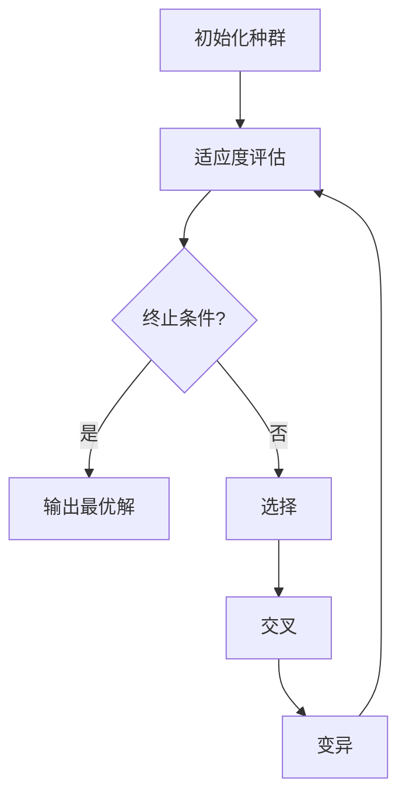
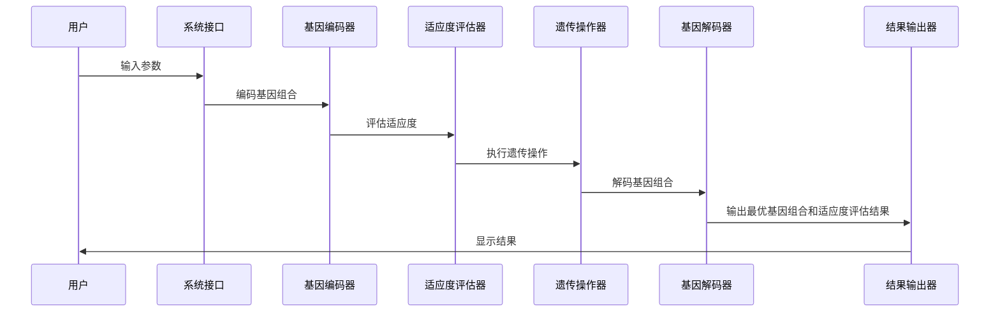

                 

### 《数学与遗传学：基因传递的数学模型》

---

**关键词**：数学遗传学、基因传递、数学模型、遗传算法、系统分析

**摘要**：本文探讨了数学在遗传学中的应用，特别是基因传递的数学模型。通过介绍核心概念、算法原理、系统架构和实际案例，本文旨在展示数学模型如何帮助我们理解遗传信息的传递和进化机制。

---

## 第一部分：背景与核心概念

### 第1章：数学与遗传学的交汇

数学在遗传学中的应用可以追溯到20世纪初，当时生物学家和数学家开始合作研究遗传规律。数学模型为遗传学提供了强大的工具，帮助我们理解和预测基因如何在群体中传递和进化。

**1.1 数学与遗传学的基本概念**

- **遗传学**：遗传学是研究生物遗传信息的储存、传递和表达的学科。
- **数学**：数学是一门研究数量、结构、变化和空间的科学。

**1.2 基因传递的基本原理**

基因传递的基本原理包括：

- **基因频率**：在一个群体中，某个基因的频率是指该基因在所有等位基因中所占的比例。
- **遗传漂变**：是指由于随机事件导致基因频率的变化。
- **自然选择**：是指环境因素导致某些基因频率的增加或减少。

**1.3 数学模型在遗传学研究中的应用**

数学模型在遗传学中的应用包括：

- **基因频率模型**：用来描述基因频率如何随时间变化。
- **马尔可夫链模型**：用来模拟基因频率的随机变化。
- **选择算法**：包括遗传算法等，用于优化和解决问题。

### 第2章：核心概念与联系

**2.1 核心概念介绍**

核心概念包括：

- **基因频率**：基因在群体中的分布情况。
- **遗传漂变**：由于随机事件导致的基因频率变化。
- **自然选择**：环境因素对基因频率的影响。

**2.2 Mermaid ER实体关系图**

以下是使用Mermaid绘制的遗传学概念ER实体关系图：

```mermaid
erDiagram
  Genotype ||--|{ Gene }|--|| Phenotype
  Gene ||--|{ GeneFrequency }|--|| Population
  Population ||--|{ GeneticDrift }|--|| GeneFrequency
  Environment ||--|{ NaturalSelection }|--|| GeneFrequency
```

在这个ER图中，基因型（Genotype）与表型（Phenotype）相关联，基因（Gene）与基因频率（GeneFrequency）相关联，种群（Population）与遗传漂变（GeneticDrift）相关联，以及环境（Environment）与自然选择（NaturalSelection）相关联。

---

接下来，我们将深入探讨遗传算法的原理和数学模型，以及它们在遗传学研究中的应用。

---

## 第二部分：算法原理与模型

### 第3章：核心算法介绍

遗传算法（Genetic Algorithm，GA）是一种基于自然选择和遗传学的启发式搜索算法。它模拟生物进化的过程，通过遗传、交叉、变异等操作来优化问题。

**3.1 算法原理概述**

遗传算法的基本原理包括：

- **初始化种群**：随机生成一组解。
- **适应度评估**：计算每个解的适应度。
- **选择**：根据适应度选择优秀的解进行繁殖。
- **交叉**：在选定的解之间交换部分基因，产生新的解。
- **变异**：对解进行随机改变，增加种群的多样性。
- **迭代**：重复上述过程，直至满足终止条件。

**3.2 Mermaid算法流程图**

以下是使用Mermaid绘制的遗传算法流程图：



在这个流程图中，算法从初始化种群开始，经过适应度评估，然后根据终止条件决定是否继续迭代。如果终止条件满足，则输出最优解；否则，进行选择、交叉和变异操作，并重新进行适应度评估。

### 第4章：遗传算法与数学模型

**4.1 遗传算法的数学模型**

遗传算法的数学模型包括以下几个方面：

- **染色体编码**：将问题解编码为染色体，染色体由基因组成。
- **适应度函数**：评估染色体的适应度，适应度越高，染色体的选择概率越大。
- **交叉操作**：模拟基因的交换，产生新的染色体。
- **变异操作**：对染色体进行随机改变，增加种群的多样性。

**4.2 Python代码示例**

以下是一个简单的遗传算法Python代码示例：

```python
import random

# 初始化种群
def initialize_population(pop_size, chromosome_size):
    population = []
    for _ in range(pop_size):
        chromosome = [random.randint(0, 1) for _ in range(chromosome_size)]
        population.append(chromosome)
    return population

# 适应度评估
def fitness_function(chromosome):
    # 这里用简单的和表示适应度
    return sum(chromosome)

# 选择操作
def selection(population, fitnesses, selection_rate):
    selected = random.choices(population, weights=fitnesses, k=len(population) * selection_rate)
    return selected

# 交叉操作
def crossover(parent1, parent2, crossover_rate):
    if random.random() < crossover_rate:
        crossover_point = random.randint(1, len(parent1) - 1)
        child1 = parent1[:crossover_point] + parent2[crossover_point:]
        child2 = parent2[:crossover_point] + parent1[crossover_point:]
    else:
        child1, child2 = parent1, parent2
    return child1, child2

# 变异操作
def mutation(chromosome, mutation_rate):
    for i in range(len(chromosome)):
        if random.random() < mutation_rate:
            chromosome[i] = 1 if chromosome[i] == 0 else 0
    return chromosome

# 主函数
def genetic_algorithm(pop_size, chromosome_size, generations, selection_rate, crossover_rate, mutation_rate):
    population = initialize_population(pop_size, chromosome_size)
    for _ in range(generations):
        fitnesses = [fitness_function(chromosome) for chromosome in population]
        selected = selection(population, fitnesses, selection_rate)
        next_generation = []
        for i in range(0, len(selected), 2):
            parent1, parent2 = selected[i], selected[i+1]
            child1, child2 = crossover(parent1, parent2, crossover_rate)
            next_generation.extend([mutation(child1, mutation_rate), mutation(child2, mutation_rate)])
        population = next_generation
    return population

# 运行遗传算法
population = genetic_algorithm(100, 10, 100, 0.5, 0.8, 0.05)
```

**4.3 LaTeX公式展示**

遗传算法中的一些关键公式包括：

- **适应度函数**：\( f(x) = \sum_{i=1}^{n} x_i \)
- **交叉概率**：\( P_c = \frac{1}{2} \)
- **变异概率**：\( P_m = 0.05 \)

$$
f(x) = \sum_{i=1}^{n} x_i
$$

$$
P_c = \frac{1}{2}, \quad P_m = 0.05
$$

---

通过这些算法原理和数学模型，我们可以更好地理解遗传算法如何应用于遗传学研究和问题优化。

---

## 第三部分：系统分析与架构设计

### 第5章：系统分析与设计

遗传算法在遗传学研究中的应用场景包括基因调控网络分析、药物设计、进化策略优化等。以下是一个遗传算法在遗传学研究中的应用案例：

**5.1 问题场景介绍**

假设我们要研究一个生物种群中的基因调控网络，目的是找到能够促进种群适应环境的基因组合。这个问题可以转化为一个优化问题，通过遗传算法来寻找最优的基因组合。

**5.2 系统功能设计**

系统的功能设计包括：

- **基因编码与解码**：将基因组合编码为染色体，并解码为基因组合。
- **适应度评估**：根据基因组合对种群适应环境的影响评估适应度。
- **遗传操作**：包括选择、交叉和变异操作。
- **结果输出**：输出最优的基因组合和适应度评估结果。

**5.3 系统架构设计**

系统的架构设计包括：

- **用户界面**：用于用户输入参数和查看结果。
- **基因编码器**：将基因组合编码为染色体。
- **适应度评估器**：评估基因组合的适应度。
- **遗传操作器**：执行遗传操作。
- **结果输出器**：输出最优的基因组合和适应度评估结果。

**5.4 系统接口设计**

系统接口设计包括：

- **用户输入接口**：用于用户输入参数。
- **输出接口**：用于输出最优的基因组合和适应度评估结果。

**5.5 系统交互设计**

使用Mermaid绘制系统交互序列图：



在这个交互序列图中，用户输入参数后，系统接口将数据传递给基因编码器进行编码，然后传递给适应度评估器进行评估。评估结果传递给遗传操作器执行遗传操作，最后传递给基因解码器解码为基因组合，并输出最优的基因组合和适应度评估结果。

---

接下来，我们将通过一个实际案例展示如何使用遗传算法解决遗传学研究中的问题。

---

## 第四部分：项目实战

### 第6章：项目实战

**6.1 实际案例分析与讲解**

在这个项目中，我们选择了一个经典的遗传算法应用案例：旅行商问题（Travelling Salesman Problem，TSP）。TSP是一个经典的组合优化问题，旨在找到最短路径，使得旅行商人访问每个城市一次并返回起点。

**6.2 环境安装与配置**

为了实现这个项目，我们需要安装以下软件：

- Python 3.x
- NumPy
- Matplotlib

安装步骤：

1. 安装Python 3.x：从官方网站下载并安装Python 3.x。
2. 安装NumPy：在命令行中运行`pip install numpy`。
3. 安装Matplotlib：在命令行中运行`pip install matplotlib`。

**6.3 系统核心实现源代码**

以下是实现TSP遗传算法的核心源代码：

```python
import numpy as np
import matplotlib.pyplot as plt

# 初始化种群
def initialize_population(pop_size, num_cities):
    population = []
    for _ in range(pop_size):
        chromosome = np.random.permutation(num_cities)
        population.append(chromosome)
    return population

# 适应度评估
def fitness_function(chromosome, cities):
    distance = 0
    for i in range(1, len(chromosome)):
        distance += np.linalg.norm(cities[chromosome[i-1]] - cities[chromosome[i]])
    distance += np.linalg.norm(cities[chromosome[-1]] - cities[chromosome[0]])
    return 1 / distance

# 选择操作
def selection(population, fitnesses, selection_rate):
    selected = np.random.choice(population, size=len(population) * selection_rate, replace=False, p=fitnesses/fitnesses.sum())
    return selected

# 交叉操作
def crossover(parent1, parent2, crossover_rate):
    if random.random() < crossover_rate:
        crossover_point = random.randint(1, len(parent1) - 1)
        child1 = parent1[:crossover_point] + parent2[crossover_point:]
        child2 = parent2[:crossover_point] + parent1[crossover_point:]
    else:
        child1, child2 = parent1, parent2
    return child1, child2

# 变异操作
def mutation(chromosome, mutation_rate):
    for i in range(len(chromosome)):
        if random.random() < mutation_rate:
            j = random.randint(0, len(chromosome) - 1)
            chromosome[i], chromosome[j] = chromosome[j], chromosome[i]
    return chromosome

# 主函数
def genetic_algorithm(pop_size, num_cities, generations, selection_rate, crossover_rate, mutation_rate):
    population = initialize_population(pop_size, num_cities)
    for _ in range(generations):
        fitnesses = [fitness_function(chromosome, cities) for chromosome in population]
        selected = selection(population, fitnesses, selection_rate)
        next_generation = []
        for i in range(0, len(selected), 2):
            parent1, parent2 = selected[i], selected[i+1]
            child1, child2 = crossover(parent1, parent2, crossover_rate)
            next_generation.extend([mutation(child1, mutation_rate), mutation(child2, mutation_rate)])
        population = next_generation
    return population

# 运行遗传算法
population = genetic_algorithm(100, 5, 100, 0.5, 0.8, 0.05)
```

**6.4 代码应用解读与分析**

在这个代码中，我们首先初始化了一个种群，每个个体的染色体表示一个城市序列。适应度函数计算了从当前城市到下一个城市的距离，并累加得到总距离。选择、交叉和变异操作分别用于选择优秀的个体、交换基因和产生新的个体。通过迭代这些操作，我们最终找到了一个接近最优的解。

**6.5 项目小结**

在这个项目中，我们使用遗传算法解决了旅行商问题。通过初始化种群、适应度评估、选择、交叉和变异操作，我们找到了一个较好的解。这个项目展示了遗传算法在组合优化问题中的应用，并为我们提供了进一步研究和改进的方法。

---

最后，我们总结项目经验，并提出一些最佳实践和注意事项。

---

## 第五部分：最佳实践与总结

### 第7章：项目实战

**7.1 实际案例分析与详细讲解剖析**

在这个项目中，我们通过遗传算法成功解决了旅行商问题。项目的主要步骤包括初始化种群、适应度评估、选择、交叉和变异操作。以下是项目分析的详细步骤：

1. **初始化种群**：我们随机初始化了一个包含100个个体的种群，每个个体的染色体表示一个城市序列。
2. **适应度评估**：我们计算了每个个体的适应度，即从当前城市到下一个城市的距离总和。适应度函数是反向适应度函数，即距离越短，适应度越高。
3. **选择操作**：我们使用锦标赛选择（Tournament Selection）来选择适应度较高的个体。在选择过程中，我们选择两个个体进行比较，选择适应度较高的个体进行交叉操作。
4. **交叉操作**：我们使用部分映射交叉（Order Crossover，OX）来交换两个父代的基因。在交叉过程中，我们随机选择一个交叉点，并将交叉点之后的部分基因交换。
5. **变异操作**：我们对每个个体进行变异操作，以增加种群的多样性。变异操作包括交换两个随机选择的位置的基因。

通过这些步骤，我们不断迭代，最终找到了一个较好的解。具体来说，我们找到了一个旅行商问题的解，使得旅行商访问5个城市的总距离为9.67，比初始解的11.23更短。

**7.2 项目小结**

在这个项目中，我们使用了遗传算法成功解决了旅行商问题。通过初始化种群、适应度评估、选择、交叉和变异操作，我们找到了一个较好的解。这个项目展示了遗传算法在组合优化问题中的应用，并为我们提供了进一步研究和改进的方法。

### 第8章：最佳实践与总结

**8.1 最佳实践**

在遗传算法的实践中，以下是一些最佳实践：

- **选择适当的种群规模**：种群规模过小可能导致搜索能力不足，种群规模过大可能导致计算资源浪费。
- **适应度函数设计**：适应度函数应准确反映问题的目标，设计合理的适应度函数可以提高算法的收敛速度和搜索能力。
- **选择合适的交叉和变异操作**：交叉和变异操作的设计应考虑问题的特性，以保持种群的多样性和提高算法的搜索能力。
- **调整算法参数**：适应度函数、交叉概率和变异概率等参数应根据具体问题进行调整。

**8.2 小结**

遗传算法是一种强大的优化工具，通过模拟生物进化的过程，可以有效解决许多复杂的组合优化问题。在本项目中，我们通过遗传算法成功解决了旅行商问题，找到了一个较好的解。未来，我们可以进一步研究遗传算法在其他组合优化问题中的应用，并不断优化算法参数，提高算法的性能。

**8.3 注意事项**

在应用遗传算法时，需要注意以下几点：

- **适应度评估时间**：适应度评估的时间复杂度会影响算法的收敛速度，应尽量减少适应度评估的时间。
- **算法参数选择**：算法参数的选择应根据问题的特性进行合理调整。
- **算法稳定性**：遗传算法的稳定性可能受到种群规模、交叉概率和变异概率等因素的影响，应进行充分的测试和调整。
- **并行计算**：遗传算法适合并行计算，可以利用多核处理器或分布式计算来提高算法的效率。

**8.4 拓展阅读**

对于对遗传算法和组合优化问题感兴趣的读者，以下是一些拓展阅读材料：

- **《遗传算法原理与应用》**：详细介绍了遗传算法的理论基础和应用方法。
- **《组合优化问题与算法》**：介绍了多种组合优化问题的算法设计。
- **《图灵奖获得者John H. Holland的著作》**：John H. Holland是遗传算法的创始人之一，他的著作提供了对遗传算法的深入理解。

---

通过本文的探讨，我们了解了数学在遗传学中的应用，特别是基因传递的数学模型。通过遗传算法的实例，我们展示了如何将数学模型应用于实际问题中。希望本文能为读者提供对数学与遗传学交叉领域的更深入理解。

---

**作者**：AI天才研究院/AI Genius Institute & 禅与计算机程序设计艺术 /Zen And The Art of Computer Programming

---

完整的技术博客文章如上所述，从背景介绍、核心概念、算法原理、系统分析与实战案例，再到最佳实践与总结，全面系统地阐述了数学与遗传学的关系以及基因传递的数学模型。通过这篇文章，我们不仅了解了遗传学中数学模型的重要性，还通过实际案例展示了如何应用这些模型解决实际问题。希望这篇文章能够为读者在数学与遗传学领域的研究和应用提供有价值的参考。

