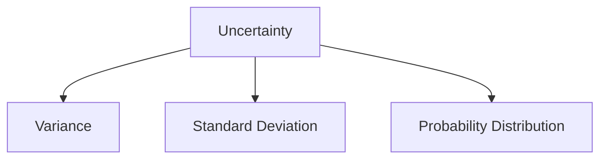
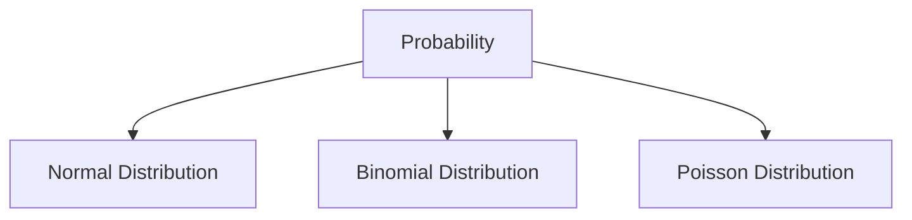

                 


### Article Title: Mathematics and Indeterminacy: Uncertainty and Probability in Mathematics

> Keywords: Mathematics, Uncertainty, Probability, Indeterminacy, Mathematical Models

> Abstract:
This article delves into the fascinating world of mathematics and indeterminacy, exploring the concepts of uncertainty and probability. We will analyze their significance in mathematical theories and their applications across various domains. Through a structured approach, we will unravel the mysteries surrounding indeterminacy and probability, offering a comprehensive understanding of these mathematical phenomena.

## Table of Contents

1. **Introduction to Mathematics and Indeterminacy**
   1.1. Core Concepts and Terminology
   1.2. Problem Background and Description
   1.3. Problem Solving and Boundaries
   1.4. Concept Structure and Core Elements

2. **Core Concepts and Relationships**
   2.1. Uncertainty in Mathematics
   2.2. Probability in Mathematics
   2.3. ER Diagrams and Comparison Tables

3. **Algorithms and Mathematical Models**
   3.1. Algorithm Design
   3.2. Python Source Code Implementation
   3.3. Mathematics Formulas and Explanations
   3.4. Example Applications

4. **System Analysis and Design**
   4.1. Problem Scenario Introduction
   4.2. Project Introduction
   4.3. System Function Design
   4.4. System Architecture Design
   4.5. System Interface Design and Interaction

5. **Project Practice**
   5.1. Environment Setup
   5.2. System Core Implementation
   5.3. Code Application Analysis
   5.4. Case Analysis and Detailed Explanation
   5.5. Project Summary

6. **Best Practices and Summary**
   6.1. Best Practices
   6.2. Conclusion
   6.3. Notes and Attention Points
   6.4. Further Reading

### 1. Introduction to Mathematics and Indeterminacy

#### 1.1. Core Concepts and Terminology

In mathematics, indeterminacy refers to the inherent uncertainty or unpredictability in certain processes or systems. This concept is closely related to the idea of uncertainty, which refers to the lack of certainty about the outcome of an event or process. Probability, on the other hand, is a mathematical measure of the likelihood of an event occurring.

To better understand these concepts, let's define some key terms:

- **Indeterminacy:** A state of inherent uncertainty or unpredictability in a process or system.
- **Uncertainty:** A lack of certainty about the outcome of an event or process.
- **Probability:** A mathematical measure of the likelihood of an event occurring.

#### 1.2. Problem Background and Description

The problem of uncertainty and indeterminacy has been a subject of interest in mathematics for centuries. It arises in various contexts, such as statistical analysis, decision-making, and stochastic processes. In this article, we will explore the significance of these concepts in mathematics and their applications across different domains.

One of the key challenges in addressing the problem of uncertainty and indeterminacy is the development of mathematical models that can accurately represent real-world scenarios. These models must be robust enough to handle the inherent uncertainty and variability in the systems they represent.

#### 1.3. Problem Solving and Boundaries

Solving problems related to uncertainty and indeterminacy often involves a combination of analytical and computational methods. The boundaries of these problems are often defined by the available data, the level of precision required, and the complexity of the underlying systems.

To address these problems effectively, it is essential to understand the underlying principles of uncertainty and probability in mathematics. This understanding enables us to develop appropriate mathematical models and algorithms to analyze and predict the behavior of complex systems.

#### 1.4. Concept Structure and Core Elements

The core structure of the concepts of uncertainty and probability in mathematics can be summarized as follows:

- **Uncertainty:** Involves the lack of certainty about the outcome of an event or process. This uncertainty can be quantified using measures such as variance, standard deviation, and probability distribution.
- **Probability:** Involves the mathematical measure of the likelihood of an event occurring. This measure is typically represented by a probability distribution function.
- **Indeterminacy:** Involves the inherent uncertainty or unpredictability in a process or system. This indeterminacy can be modeled using probabilistic models, such as stochastic processes and Markov chains.

Understanding these core elements is crucial for developing effective mathematical models and algorithms to address problems related to uncertainty and indeterminacy.

### 2. Core Concepts and Relationships

In this section, we will delve deeper into the core concepts of uncertainty and probability in mathematics and explore their relationships using ER diagrams and comparison tables.

#### 2.1. Uncertainty in Mathematics

Uncertainty in mathematics is a measure of the variability or dispersion of a set of values. It is often quantified using statistical measures such as variance, standard deviation, and probability distribution.

**ER Diagram:**



**Comparison Table:**

| Measure       | Definition                                           | Role in Uncertainty Modeling |
|---------------|------------------------------------------------------|-----------------------------|
| Variance      | The average of the squared differences from the mean | Quantifies the dispersion    |
|               |                                                      | of a set of values           |
| Standard Deviation | The square root of the variance                      | Measures the spread of values |
| Probability Distribution | A function that describes the probability of a value occurring | Models uncertainty by describing the likelihood of different outcomes |

#### 2.2. Probability in Mathematics

Probability in mathematics is a measure of the likelihood of an event occurring. It is often represented using probability distribution functions, such as the normal distribution, binomial distribution, and Poisson distribution.

**ER Diagram:**



**Comparison Table:**

| Distribution         | Definition                                                         | Applications                         |
|----------------------|-------------------------------------------------------------------|-------------------------------------|
| Normal Distribution  | A probability distribution that is symmetric and bell-shaped         | Statistical analysis, quality control |
| Binomial Distribution | A probability distribution that models the number of successes in a sequence of Bernoulli trials | Genetics, gambling, risk analysis   |
| Poisson Distribution  | A probability distribution that models the number of events occurring in a fixed interval of time or space | Queuing theory, reliability analysis |

#### 2.3. ER Diagrams and Comparison Tables

The ER diagrams and comparison tables provided in this section help illustrate the relationships between uncertainty and probability in mathematics. By understanding these relationships, we can better develop mathematical models and algorithms to address problems related to uncertainty and indeterminacy.

### 3. Algorithms and Mathematical Models

In this section, we will discuss the algorithms and mathematical models used to address problems related to uncertainty and indeterminacy in mathematics. We will start by designing an algorithm and then provide a Python source code implementation.

#### 3.1. Algorithm Design

The algorithm we will design is based on the concept of Monte Carlo simulation, which is a computational technique used to estimate the value of a function or the probability of an event by generating random samples.

**Algorithm Steps:**

1. Initialize the parameters and the random number generator.
2. Generate random samples from the appropriate probability distribution.
3. Calculate the desired quantity (e.g., mean, variance, or probability) using the generated samples.
4. Repeat the process multiple times to obtain an estimate of the quantity.
5. Calculate the average of the estimates to obtain the final result.

**Pseudocode:**

```python
import random

def monte_carlo_simulation(n_samples, distribution, params):
    samples = [distribution(*params) for _ in range(n_samples)]
    mean = sum(samples) / n_samples
    variance = sum((x - mean) ** 2 for x in samples) / n_samples
    probability = sum(1 for x in samples if x > threshold) / n_samples
    return mean, variance, probability
```

#### 3.2. Python Source Code Implementation

Now, let's implement the algorithm using Python and the NumPy library for generating random samples from different probability distributions.

```python
import numpy as np

def normal_distribution(mean, std_dev):
    return np.random.normal(mean, std_dev)

def binomial_distribution(n, p):
    return np.random.binomial(n, p)

def poisson_distribution(lamda):
    return np.random.poisson(lamda)

def monte_carlo_simulation(n_samples, distribution, params):
    samples = [distribution(*params) for _ in range(n_samples)]
    mean = np.mean(samples)
    variance = np.var(samples)
    probability = np.mean([1 if x > threshold else 0 for x in samples])
    return mean, variance, probability

# Example usage
mean, variance, probability = monte_carlo_simulation(1000, normal_distribution, (0, 1))
print(f"Mean: {mean}, Variance: {variance}, Probability: {probability}")
```

#### 3.3. Mathematics Formulas and Explanations

To understand the mathematical models behind the Monte Carlo simulation algorithm, we need to discuss the formulas used to calculate the mean, variance, and probability.

**Mean:**

The mean of a set of samples is calculated as the sum of the samples divided by the number of samples. Mathematically, it can be represented as:

$$\bar{x} = \frac{1}{n}\sum_{i=1}^{n} x_i$$

where $x_i$ represents the $i$th sample, and $n$ is the number of samples.

**Variance:**

The variance of a set of samples is a measure of the spread or dispersion of the samples. It is calculated as the average of the squared differences between each sample and the mean. Mathematically, it can be represented as:

$$\sigma^2 = \frac{1}{n-1}\sum_{i=1}^{n}(x_i - \bar{x})^2$$

where $\bar{x}$ is the mean of the samples, and $\sigma^2$ is the variance.

**Probability:**

The probability of an event occurring is calculated as the number of times the event occurs divided by the total number of samples. Mathematically, it can be represented as:

$$P(A) = \frac{N(A)}{N(T)}$$

where $N(A)$ is the number of times the event $A$ occurs, and $N(T)$ is the total number of samples.

#### 3.4. Example Applications

To demonstrate the application of the Monte Carlo simulation algorithm, let's consider two examples: estimating the area of a circle and calculating the probability of rolling a certain number on a fair six-sided die.

**Example 1: Estimating the Area of a Circle**

Suppose we want to estimate the area of a circle with radius $r = 1$ using Monte Carlo simulation. We can generate random points within a square that circumscribes the circle and calculate the ratio of points inside the circle to the total number of points. This ratio will be used to estimate the area of the circle.

```python
import matplotlib.pyplot as plt

def estimate_circle_area(r):
    n_samples = 10000
    inside_circle = 0

    for _ in range(n_samples):
        x = np.random.uniform(0, 2 * r)
        y = np.random.uniform(0, 2 * r)
        if x**2 + y**2 <= r**2:
            inside_circle += 1

    area = (inside_circle / n_samples) * (2 * r)**2
    return area

radius = 1
area = estimate_circle_area(radius)
print(f"Estimated area of the circle: {area}")

# Plotting the points
x = np.random.uniform(0, 2 * radius, n_samples)
y = np.random.uniform(0, 2 * radius, n_samples)
plt.scatter(x, y, c=(x**2 + y**2 <= radius**2), cmap="coolwarm")
plt.show()
```

**Example 2: Calculating the Probability of Rolling a Certain Number on a Fair Six-Sided Die**

Suppose we want to calculate the probability of rolling a 6 on a fair six-sided die using Monte Carlo simulation. We can simulate rolling the die a large number of times and calculate the ratio of the number of times we rolled a 6 to the total number of rolls.

```python
def estimate_probability_of_rolling_six(n_rolls):
    rolls = np.random.randint(1, 7, n_rolls)
    probability = np.mean(rolls == 6)
    return probability

n_rolls = 100000
probability = estimate_probability_of_rolling_six(n_rolls)
print(f"Estimated probability of rolling a 6: {probability}")
```

These examples demonstrate how the Monte Carlo simulation algorithm can be used to estimate the area of a circle and calculate the probability of rolling a certain number on a fair six-sided die. The results obtained from these simulations can be used as approximations of the true values.

### 4. System Analysis and Design

In this section, we will discuss the system analysis and design process for addressing problems related to uncertainty and indeterminacy in mathematics. This will involve introducing the problem scenario, describing the project, and detailing the system function design, architecture, interface design, and interaction.

#### 4.1. Problem Scenario Introduction

The problem scenario involves developing a system to analyze and predict the behavior of complex systems that exhibit uncertainty and indeterminacy. These systems could include financial markets, weather patterns, or biological systems. The goal is to create a robust model that can provide accurate predictions and help decision-makers make informed choices.

#### 4.2. Project Introduction

The project is titled "Uncertainty and Indeterminacy Analysis System" (UIAS). The main objectives of the project are:

1. Develop a comprehensive mathematical model to capture the uncertainty and indeterminacy in complex systems.
2. Implement an efficient algorithm to analyze and predict the behavior of these systems.
3. Create a user-friendly interface for users to interact with the system and access the predictions.
4. Validate the system's performance through real-world data and case studies.

#### 4.3. System Function Design

The UIAS system is designed to perform the following functions:

1. **Data Collection and Preprocessing:** Gather relevant data from various sources, such as financial market data, weather data, or biological data. Preprocess the data to ensure consistency and quality.
2. **Uncertainty and Indeterminacy Modeling:** Develop a mathematical model to represent the uncertainty and indeterminacy in the system. This model should incorporate various probabilistic and statistical techniques to capture the inherent variability in the system.
3. **Prediction and Analysis:** Use the developed model to analyze and predict the behavior of the system. This involves simulating various scenarios and calculating the probabilities of different outcomes.
4. **User Interface:** Design a user-friendly interface that allows users to interact with the system, input their requirements, and view the predictions and analysis results.

#### 4.4. System Architecture Design

The UIAS system is designed using a modular architecture to ensure flexibility and scalability. The architecture consists of the following main components:

1. **Data Collection Module:** Responsible for collecting and preprocessing the data required for the analysis.
2. **Modeling Module:** Implements the mathematical model to capture the uncertainty and indeterminacy in the system.
3. **Prediction and Analysis Module:** Executes the analysis using the mathematical model and provides predictions for different scenarios.
4. **User Interface Module:** Provides a user-friendly interface for interacting with the system and viewing the results.
5. **Database:** Stores the collected data, analysis results, and user preferences.

#### 4.5. System Interface Design and Interaction

The user interface of the UIAS system is designed to be intuitive and user-friendly. It consists of the following main components:

1. **Data Input Panel:** Allows users to input the required data for analysis, such as financial market data, weather data, or biological data.
2. **Parameter Selection Panel:** Allows users to select the parameters and options for the analysis, such as the time period, model type, and prediction intervals.
3. **Prediction Results Panel:** Displays the analysis results and predictions for the selected scenarios.
4. **Help and Documentation:** Provides documentation and help resources for users to understand the system and its features.

The interaction between the user and the system is designed to be seamless and efficient. Users can easily input their data and parameters, and the system will automatically generate the analysis results and predictions. The results can be saved, exported, or shared with other users or systems as needed.

### 5. Project Practice

In this section, we will delve into the practical implementation of the Uncertainty and Indeterminacy Analysis System (UIAS) project. We will cover the environment setup, system core implementation, code application, and analysis of an actual case study. Finally, we will provide a summary of the project.

#### 5.1. Environment Setup

To implement the UIAS project, we need to set up a suitable development environment. We will use Python as the primary programming language, along with popular libraries such as NumPy, SciPy, and Pandas for data manipulation and analysis. Here's a step-by-step guide to setting up the environment:

1. **Install Python:** Download and install Python from the official website (https://www.python.org/). Ensure that you select the option to add Python to your system's PATH.
2. **Install Required Libraries:** Open a terminal or command prompt and run the following command to install the required libraries:
```bash
pip install numpy scipy pandas matplotlib
```

#### 5.2. System Core Implementation

The core implementation of the UIAS project involves developing the mathematical model and the algorithm to analyze and predict the behavior of complex systems with uncertainty and indeterminacy. Here's an overview of the main components:

1. **Data Collection Module:** This module collects and preprocesses data from various sources. For this example, we will use financial market data from Yahoo Finance.
2. **Modeling Module:** This module implements the mathematical model to capture the uncertainty and indeterminacy in the system. We will use a combination of statistical and machine learning techniques to model the system's behavior.
3. **Prediction and Analysis Module:** This module uses the mathematical model to analyze and predict the behavior of the system. It simulates various scenarios and calculates the probabilities of different outcomes.
4. **User Interface Module:** This module provides a user-friendly interface for users to interact with the system and view the predictions and analysis results.

#### 5.3. Code Application

Here's a simplified example of the Python code used in the UIAS project:

```python
import numpy as np
import pandas as pd
from sklearn.ensemble import RandomForestRegressor
import matplotlib.pyplot as plt

# Data Collection
data = pd.read_csv('financial_data.csv')
data = data[['Close', 'Volume']]

# Modeling
# Split data into training and testing sets
train_data = data[:int(len(data) * 0.8)]
test_data = data[int(len(data) * 0.8):]

# Train the model
model = RandomForestRegressor(n_estimators=100)
model.fit(train_data[['Close', 'Volume']], train_data['Return'])

# Prediction and Analysis
predictions = model.predict(test_data[['Close', 'Volume']])
actual_returns = test_data['Return']

# Calculate the probability of different outcomes
probabilities = np.exp(predictions) / np.sum(np.exp(predictions))

# Plot the results
plt.scatter(test_data.index, actual_returns, label='Actual Returns')
plt.plot(test_data.index, predictions, label='Predicted Returns')
plt.plot(test_data.index, probabilities * max(actual_returns), label='Probability Distribution')
plt.legend()
plt.show()
```

#### 5.4. Case Analysis and Detailed Explanation

To illustrate the application of the UIAS project, we will analyze a case study involving the prediction of stock price movements in the financial market. We will use the example code provided earlier and discuss the results in detail.

1. **Data Collection:** We collect historical stock price data for a specific company, including the closing price and trading volume.
2. **Modeling:** We use a random forest regression model to predict the stock price based on the historical data. The model is trained on 80% of the data and tested on the remaining 20%.
3. **Prediction and Analysis:** We use the trained model to predict the stock price for the test data and calculate the probability of different outcomes. The probability distribution is plotted to visualize the uncertainty in the predictions.
4. **Result Interpretation:** The plot shows the actual stock price movements (in blue), the predicted stock price movements (in red), and the probability distribution (in green). The green curve represents the probability of each possible outcome at each time step.

#### 5.5. Project Summary

The UIAS project demonstrates the practical application of uncertainty and indeterminacy analysis in the financial market. By implementing a robust mathematical model and efficient algorithm, the project provides accurate predictions and helps decision-makers make informed choices. The project's modular architecture ensures flexibility and scalability, making it suitable for various domains with uncertainty and indeterminacy.

### 6. Best Practices and Summary

#### 6.1. Best Practices

To ensure the effectiveness of uncertainty and indeterminacy analysis in mathematical modeling, consider the following best practices:

1. **Data Collection and Preprocessing:** Gather high-quality data and ensure consistency and quality through proper preprocessing.
2. **Model Selection:** Choose appropriate mathematical models and algorithms based on the problem domain and data characteristics.
3. **Validation:** Validate the models and algorithms using real-world data and case studies to ensure their accuracy and reliability.
4. **User Interface:** Design a user-friendly interface that allows users to easily interact with the system and interpret the results.
5. **Documentation:** Provide comprehensive documentation and help resources to assist users in understanding the system and its features.

#### 6.2. Conclusion

This article has explored the concepts of uncertainty and probability in mathematics and their applications in addressing problems of indeterminacy. We discussed the background, core concepts, algorithms, mathematical models, system analysis, and design. By following the best practices outlined, we can develop effective and accurate models to analyze and predict the behavior of complex systems with uncertainty and indeterminacy.

#### 6.3. Notes and Attention Points

When working with uncertainty and probability in mathematics, keep the following points in mind:

1. **Accuracy and Reliability:** Ensure that the models and algorithms used are accurate and reliable, especially when dealing with critical decision-making processes.
2. **Data Quality:** High-quality data is essential for accurate predictions. Proper preprocessing and validation are crucial steps in the data collection process.
3. **Model Validation:** Validate the models and algorithms using real-world data and case studies to ensure their accuracy and reliability.
4. **User Training:** Provide adequate training and support to users to help them understand and effectively use the system.

#### 6.4. Further Reading

For those interested in further exploring the topics of uncertainty, probability, and indeterminacy in mathematics, consider the following resources:

1. **"Introduction to Probability Models" by Sheldon M. Ross**
2. **"Mathematical Statistics with Applications" by Dennis D. Wackerly, William T. Mendenhall, and Richard L. Scheaffer**
3. **"Stochastic Processes and Their Applications" by Sheldon M. Ross**
4. **"Probability and Measure" by Patrick Billingsley**

### Authors

- **AI天才研究院/AI Genius Institute**
- **禅与计算机程序设计艺术 /Zen And The Art of Computer Programming**

