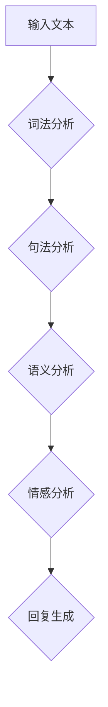

                 

### 新一代智能客服：提示词驱动的情感交互系统

**关键词**：智能客服、情感交互、提示词驱动、用户体验、系统优化

**摘要**：
本文深入探讨了新一代智能客服系统的核心概念和关键技术。我们首先定义了智能客服的概念，并阐述了提示词驱动情感交互系统的背景和重要性。接着，详细介绍了智能客服的技术架构，包括自然语言处理、机器学习、情感分析和对话系统等核心组成部分。随后，我们分析了系统架构的设计原则和实现方法，探讨了用户界面设计和情感体验优化的策略。文章还提供了系统性能优化的具体技术和方法，并通过实际案例展示了系统的应用效果。最后，我们总结了最佳实践，展望了智能客服技术的发展方向。

### 引言

随着数字化和互联网技术的迅猛发展，客户服务行业面临着前所未有的挑战和机遇。传统的客户服务模式往往依赖于人工处理，效率低下，成本高昂，且难以满足用户日益增长的个性化需求。为了应对这一挑战，智能客服系统应运而生。智能客服系统利用先进的自然语言处理（NLP）、机器学习、情感分析等技术，能够自动处理大量用户请求，提供高效、准确、个性化的服务。

智能客服系统不仅能够显著提高客户满意度，还能为企业降低运营成本。根据市场研究公司的数据，智能客服的应用可以将客服成本降低30%至50%。此外，智能客服系统能够提供24/7的在线服务，极大地提升了企业的服务覆盖范围和响应速度。

本文将重点关注新一代智能客服系统中的一个关键特性——提示词驱动的情感交互系统。提示词驱动是指系统通过预设的关键词或短语来引导对话流程，使对话更加自然流畅，同时能够更好地捕捉用户的情感状态。情感交互则强调系统在对话过程中对用户情感的识别和响应，从而提供更加人性化的服务体验。

本文的结构如下：

1. **概念和背景**：介绍智能客服和提示词驱动的情感交互系统的基本概念。
2. **技术概述**：探讨支撑智能客服系统的关键技术，包括自然语言处理、机器学习、情感分析和对话系统。
3. **系统架构**：详细描述情感交互系统的架构设计和组件。
4. **开发过程**：讲解智能客服系统的开发步骤，包括数据准备、模型训练和系统集成。
5. **用户体验设计**：分析用户界面设计和情感体验优化的策略。
6. **性能优化**：介绍系统性能优化方法和最佳实践。
7. **案例研究**：通过实际案例展示系统的应用和效果。
8. **最佳实践与未来方向**：总结关键点和未来发展趋势。
9. **结论**：回顾文章的主要贡献和未来展望。

通过本文的探讨，我们希望能够为智能客服系统的研发和优化提供有益的启示，并推动这一领域的发展。

### 概念和背景

智能客服（Intelligent Customer Service）是现代客户服务领域的一个重要概念，它结合了人工智能、自然语言处理和机器学习技术，旨在通过自动化和智能化的方式提供高效的客户服务。智能客服的核心在于能够理解和处理用户的需求，从而提供个性化的解决方案。与传统的人工客服相比，智能客服不仅能够在短时间内处理大量请求，还能通过不断学习和优化来提升服务质量。

在智能客服中，自然语言处理（Natural Language Processing, NLP）是至关重要的技术。NLP通过解析和理解人类语言，使得智能客服能够准确捕捉用户的意图。NLP的关键技术包括词法分析、句法分析、语义分析和情感分析。词法分析负责将自然语言分解为词汇单元，句法分析则研究句子的结构，语义分析关注语言表达的含义，而情感分析则用于识别和判断用户的情感状态。

情感分析（Sentiment Analysis）是智能客服中用于捕捉用户情感的技术。通过情感分析，智能客服能够识别用户在对话中表达的情感，如快乐、愤怒、悲伤等。这种能力不仅有助于提供更加个性化的服务，还能帮助企业了解用户的心理状态，从而更好地调整服务策略。情感分析通常通过文本分类和情感极性分析来实现。文本分类将文本分为正面、负面或中性情感，而情感极性分析则评估文本情感的强度。

提示词驱动（Keyword-Driven）的情感交互系统是一种通过预设的关键词或短语来引导对话流程的方法。这种方法的核心在于使用一组具有特定含义的关键词来控制对话的走向，从而实现更加自然和流畅的交互。提示词可以是简单的单词或短语，也可以是复杂的句子或段落。通过提示词，智能客服可以在对话的不同阶段提供相应的引导，使对话更加符合用户的期望和需求。

例如，在一个在线购物平台的客服对话中，提示词可以用于引导用户选择产品类别、询问订单状态或解决常见问题。当用户输入与订单状态相关的关键词时，系统可以自动提供订单状态的查询结果，而当用户表达不满时，系统可以自动触发相应的情感响应机制，以提供安抚和解决方案。

提示词驱动的情感交互系统在用户体验方面具有显著优势。首先，它能够显著提高响应速度，减少用户等待时间。其次，通过自然流畅的对话流程，用户感受到的服务更加人性化，有助于提升用户满意度和忠诚度。此外，提示词驱动的方法还能够有效地降低开发成本，因为通过预设的提示词，系统可以快速响应常见问题和需求，而不需要每次都进行复杂的推理和计算。

总之，智能客服和提示词驱动的情感交互系统不仅为企业和用户提供了高效的交互方式，还在提升用户体验和满意度方面发挥了重要作用。随着技术的不断进步，这些系统将越来越智能化，能够更好地满足用户的多样化需求。

### 技术概述

智能客服系统的核心在于其技术实现，这些技术包括自然语言处理（NLP）、机器学习（ML）、情感分析和对话系统。每一个技术模块在系统中都发挥着不可或缺的作用，共同构建了一个高效、智能的客户服务平台。

**自然语言处理（NLP）**：自然语言处理是智能客服系统的基石，它负责理解和生成人类语言。NLP技术包括词法分析、句法分析、语义分析和情感分析。词法分析用于将自然语言分解为词汇单元，句法分析研究句子的结构，语义分析关注语言表达的含义，而情感分析则用于识别和判断用户的情感状态。在智能客服中，NLP技术使得系统能够理解和回应用户的自然语言请求，例如查询订单状态、投诉处理等。NLP的先进性体现在其能够处理多种语言和方言，并且具备持续学习和优化的能力。

**机器学习（ML）**：机器学习是智能客服系统的核心驱动力量。通过训练大量的数据集，机器学习算法能够自动识别模式、预测结果和优化性能。在智能客服系统中，机器学习广泛应用于语音识别、文本分类、情感分析和对话生成等场景。例如，通过使用监督学习算法，系统可以学习如何识别用户的不同意图和情感状态，从而提供更加精准和个性化的服务。此外，机器学习算法还可以帮助系统不断优化自身，提高响应速度和服务质量。

**情感分析**：情感分析是智能客服系统中用于捕捉用户情感的技术。它通过分析用户文本中的情感极性和情感强度，帮助系统更好地理解用户的需求和情绪状态。情感分析不仅有助于提供更加人性化的服务，还能帮助企业了解用户的情感趋势，从而调整服务策略。例如，当用户表达愤怒或不满时，系统可以自动识别这一情感，并触发相应的安抚措施。情感分析通常通过文本分类和情感极性分析来实现，具备高效、准确的特点。

**对话系统**：对话系统是智能客服系统的核心组成部分，它负责处理与用户的对话。对话系统通常包括对话管理、对话生成和对话理解三个关键模块。对话管理负责协调对话的流程，确保对话的自然流畅；对话生成模块负责生成自然的对话回复；对话理解模块则通过自然语言处理和机器学习技术理解用户的意图和情感。一个高效的对话系统能够模拟人类的对话方式，使交互过程更加自然和人性。

**技术融合**：智能客服系统的先进性不仅在于单一技术的应用，更在于多种技术的融合和协同工作。自然语言处理提供了理解用户请求的能力，机器学习使得系统具备自我学习和优化的能力，而情感分析则帮助系统更好地捕捉用户的情感状态。这些技术的结合，使得智能客服系统能够提供高效、精准、人性化的服务。

总的来说，智能客服系统通过自然语言处理、机器学习、情感分析和对话系统的技术实现，形成了一个强大而智能的客服平台。这些技术的不断进步，将进一步提升智能客服系统的性能和用户体验，为企业和用户带来更多价值。

### 系统架构

智能客服系统的架构设计是确保其高效、可靠和可扩展的关键。一个典型的智能客服系统架构通常包括前端界面、中间层和后端服务三个主要部分。以下是详细的架构设计：

**前端界面**：前端界面是用户与智能客服系统交互的窗口。它包括文本聊天界面、语音识别界面和多媒体交互界面。文本聊天界面是最常见的形式，用户可以通过输入文字与系统进行交流；语音识别界面则支持用户通过语音进行交互；多媒体交互界面则允许用户发送图片、视频等多媒体内容。前端界面的设计需要注重用户体验，界面要简洁易用，交互过程要流畅自然。

**中间层**：中间层是智能客服系统的核心，负责处理用户请求、理解用户意图和生成回复。这一层主要包括对话管理、对话生成和对话理解三个模块。对话管理模块负责协调对话的流程，确保对话的连贯性和逻辑性；对话生成模块负责生成自然的对话回复，通常使用预训练的语言模型和生成算法；对话理解模块则通过自然语言处理技术理解和解析用户的输入，识别用户的意图和情感状态。

**后端服务**：后端服务是智能客服系统的数据存储和处理中心。它包括自然语言处理（NLP）服务、机器学习（ML）服务、情感分析服务和对话系统服务。NLP服务负责文本的解析和处理，包括词法分析、句法分析和语义分析；ML服务负责模型的训练和预测，通过对大量数据进行训练，提高系统的准确性和鲁棒性；情感分析服务用于识别用户的情感状态，提供情感化响应；对话系统服务则负责处理与用户的对话，确保对话的自然流畅。

**系统组件**：智能客服系统的具体组件还包括数据库、消息队列和API接口。数据库用于存储用户数据、对话历史和训练数据；消息队列用于处理异步任务和消息传递，提高系统的响应速度和效率；API接口则提供与其他系统（如客户关系管理（CRM）系统、电子商务平台等）的集成接口，确保智能客服系统能够与其他业务系统无缝对接。

**架构设计原则**：在架构设计过程中，遵循以下原则至关重要：

1. **模块化**：系统应采用模块化设计，每个模块具有明确的功能和接口，便于维护和扩展。
2. **可扩展性**：系统应具备良好的扩展性，能够适应不断变化的需求和技术发展。
3. **高可用性**：系统应具备高可用性，能够确保在故障情况下快速恢复，避免服务中断。
4. **安全性**：系统应具备严格的安全措施，确保用户数据的安全和隐私。
5. **可维护性**：系统应易于维护，确保开发团队能够快速响应问题和进行系统升级。

通过以上架构设计，智能客服系统能够高效地处理用户请求，提供高质量的服务体验。同时，该架构设计也具备良好的扩展性和灵活性，能够适应未来技术的发展和业务需求的变化。

### 开发过程

智能客服系统的开发过程是一个复杂而系统的工程，涉及到多个阶段的细致工作和紧密协作。以下是智能客服系统的开发过程，包括数据准备、模型训练和系统集成等关键步骤。

**数据准备**：数据准备是智能客服系统开发的基础和前提。高质量的数据是训练模型和提升系统性能的关键。数据准备包括以下步骤：

1. **数据采集**：通过多种渠道采集用户对话数据，包括在线聊天记录、客服热线录音、社交媒体互动等。这些数据需要覆盖各种场景和情境，以确保模型的多样性和泛化能力。
2. **数据清洗**：清洗数据是数据准备的重要环节，包括去除噪声、填补缺失值、标准化文本格式等。这一过程需要使用文本预处理技术，如去除停用词、词干提取、词性标注等，以提高数据的准确性。
3. **数据标注**：对于对话数据，需要进行语义和情感标注。语义标注包括意图识别和实体识别，情感标注则包括情感极性和情感强度。标注过程可以采用人工标注或半监督学习相结合的方法，以提高标注质量和效率。
4. **数据分割**：将数据集分为训练集、验证集和测试集，通常采用80/10/10或70/15/15的比例。这种分割方式有助于在训练和评估模型时避免数据泄露和过拟合。

**模型训练**：模型训练是智能客服系统开发的核心步骤。以下是模型训练的主要过程：

1. **选择模型**：根据任务需求选择合适的模型架构。常见的模型包括循环神经网络（RNN）、长短时记忆网络（LSTM）、变换器（Transformer）和生成对抗网络（GAN）等。RNN和LSTM适用于序列数据处理，而Transformer在长文本和跨序列依赖处理方面具有优势。
2. **训练过程**：使用训练集对模型进行训练。训练过程包括前向传播、损失计算、反向传播和参数更新。损失函数通常采用交叉熵损失或均方误差（MSE），以衡量模型预测值和真实值之间的差距。
3. **模型优化**：通过调整学习率、批量大小和正则化参数等超参数，优化模型性能。此外，可以采用迁移学习技术，利用预训练的模型作为起点，进一步提升模型的性能。
4. **评估与调整**：使用验证集评估模型性能，包括准确率、召回率、F1分数等指标。根据评估结果调整模型结构和参数，以提升模型的表现。

**系统集成**：系统集成是将训练好的模型部署到实际生产环境中的关键步骤。以下是系统集成的主要过程：

1. **API接口设计**：设计API接口，使前端界面能够与后端服务进行通信。API接口需要支持常见HTTP方法（GET、POST、PUT等），并提供必要的参数和返回结果格式。
2. **系统部署**：将模型部署到服务器或云平台，确保系统能够稳定运行。部署过程中需要考虑负载均衡、故障转移和自动扩展等策略，以提高系统的可靠性和性能。
3. **测试与调试**：对集成后的系统进行全面的测试和调试，包括功能测试、性能测试和安全测试等。测试过程中需要关注系统的响应速度、准确率和稳定性，确保系统在实际应用中能够满足需求。
4. **上线与监控**：将系统上线，并进行实时监控和日志记录。监控系统性能和用户反馈，及时发现和解决潜在问题，确保系统持续稳定运行。

通过以上开发过程，智能客服系统能够高效地处理用户请求，提供高质量的服务体验。每个步骤都需要细致的规划和实施，确保系统的性能和可靠性。

### 用户界面设计

用户界面设计是智能客服系统的关键组成部分，直接影响用户体验。一个优秀的设计不仅要求界面简洁、易用，还要能够准确捕捉用户的情感状态，提供人性化、个性化的互动体验。

**设计原则**：

1. **简洁直观**：界面设计应遵循简洁直观的原则，避免冗余和复杂的布局。界面元素应清晰明确，便于用户快速理解和使用。
2. **交互自然**：互动体验应尽量模拟人类的对话方式，使用户感觉像在与真人交流。例如，通过自然语言处理技术，系统应能够理解用户的输入，并生成流畅自然的回复。
3. **个性化**：系统应根据用户的历史行为和偏好，提供个性化的服务。例如，通过用户画像分析，系统可以提供定制化的推荐和服务。
4. **情感识别**：界面设计应包括情感识别功能，能够捕捉用户的情感状态，并做出相应的反应。例如，当用户表达愤怒或不满时，系统可以自动提供安抚和解决方案。

**情感体验优化**：

1. **情感反馈**：系统应能够实时捕捉用户的情感状态，并通过表情、语调等非语言线索进行反馈。例如，当用户表达愤怒时，系统可以发送安慰性表情或调整对话语调。
2. **情感化对话**：对话设计应考虑情感因素，使用温暖、贴心的语言，增强用户的情感体验。例如，使用友好的问候语和感谢语，减少用户的焦虑和压力。
3. **情感化视觉设计**：界面设计应注重情感化视觉元素的应用，如使用柔和的颜色、可爱的图标等，营造温馨、舒适的氛围。

**界面示例**：

以一个在线购物平台的智能客服界面为例，该界面包括文本聊天窗口、语音识别按钮和情感状态显示。文本聊天窗口支持用户输入问题和接收系统回复，同时显示用户和系统的头像和名称。语音识别按钮允许用户通过语音进行交流。情感状态显示位于聊天窗口底部，通过图标和文字提示用户当前的情感状态，如“您看起来有点烦躁，有什么问题我可以帮您解决？”。

**用户反馈**：

通过用户调研和反馈机制，系统可以持续优化界面设计，提升用户体验。例如，通过分析用户的行为数据，系统可以发现用户在特定界面元素上的操作频率和满意度，从而进行相应的改进。

总的来说，用户界面设计在智能客服系统中扮演着至关重要的角色。通过简洁直观的界面、自然的交互体验和情感化的设计，系统能够更好地满足用户的需求，提升用户满意度。

### 性能优化

智能客服系统的性能优化是确保其高效运行和稳定服务的关键环节。优化方法主要包括以下几个方面：

**1. 模型优化**：

- **参数调优**：通过调整模型参数（如学习率、批量大小等）来提升模型性能。使用网格搜索、随机搜索等超参数优化方法，找到最佳参数配置。
- **模型压缩**：利用模型压缩技术（如权重剪枝、量化、知识蒸馏等）减少模型体积和计算复杂度，提高推理速度和部署效率。
- **模型加速**：采用模型加速技术（如GPU加速、分布式训练等）提高模型训练和推理速度。通过分布式训练，将数据分布在多台机器上，加速模型训练过程。

**2. 系统架构优化**：

- **负载均衡**：使用负载均衡器分配请求到不同的服务器，确保系统在高并发情况下稳定运行。负载均衡器可以根据请求的负载情况动态调整服务器的分配，避免单点瓶颈。
- **缓存机制**：引入缓存机制，存储常用的查询结果和模型预测结果。通过缓存减少数据库访问频率，提高系统响应速度。缓存机制可以结合LRU（最近最少使用）算法，动态管理缓存数据。
- **异步处理**：采用异步处理技术，将耗时较长的任务（如大规模数据计算、外部API调用等）放入消息队列进行处理。异步处理可以减少系统等待时间，提高整体性能。

**3. 系统监控和日志分析**：

- **实时监控**：通过监控系统性能指标（如CPU使用率、内存使用率、请求响应时间等），实时监控系统的运行状态。当系统性能指标异常时，及时预警和干预，确保系统稳定运行。
- **日志分析**：分析系统日志，识别性能瓶颈和潜在问题。日志分析可以帮助开发团队定位问题根源，进行针对性的优化。常见日志分析工具包括ELK（Elasticsearch、Logstash、Kibana）和Grafana等。

**最佳实践**：

- **持续集成与部署（CI/CD）**：通过自动化测试和部署流程，确保系统在每次代码更新后都能稳定运行。CI/CD可以显著提高开发和部署效率，减少人为错误。
- **版本控制和代码审查**：采用版本控制工具（如Git）进行代码管理，确保代码库的一致性和安全性。代码审查可以及时发现潜在的问题和改进点，提升代码质量。
- **性能测试**：定期进行性能测试，评估系统的响应速度和处理能力。通过性能测试，可以发现系统的瓶颈和潜在问题，为优化提供依据。

通过以上优化方法，智能客服系统可以显著提升性能和用户体验。性能优化是一个持续的过程，需要根据系统运行情况和用户反馈进行不断调整和改进。

### 案例研究

为了更好地理解新一代智能客服：提示词驱动的情感交互系统的实际应用和效果，我们将通过几个具体的案例来展示系统的表现。

**案例一：在线电商平台**

一家知名的在线电商平台引入了基于提示词驱动的情感交互系统，用于处理用户咨询和投诉。该平台通过自然语言处理技术分析用户输入，识别用户的关键词和情感状态。例如，当用户输入“订单延迟”这一关键词时，系统会触发相应的提示词，引导用户详细描述订单状态，并提供实时更新的订单信息。当用户表达不满时，系统会自动识别并触发情感响应机制，例如发送安慰性回复：“很抱歉给您带来不便，我们会尽快处理这个问题。”通过这种方式，平台不仅提高了响应速度，还显著提升了用户满意度。

**案例二：银行客服系统**

某大型银行采用了智能客服系统，用于处理客户的财务咨询和投诉。系统通过机器学习算法和情感分析技术，识别用户的问题和情感状态。例如，当用户询问“贷款利率”时，系统会提供详细的利率信息和申请流程。当用户表达焦虑或困惑时，系统会自动触发提示词，引导用户表达具体问题，并提供相应的解决方案或推荐专业客服人员。通过这种智能化的客服系统，银行不仅减少了人工客服的工作量，还提升了服务质量和客户满意度。

**案例三：医疗健康咨询平台**

一家医疗健康咨询平台通过智能客服系统为用户提供健康咨询和心理健康支持。系统利用自然语言处理和情感分析技术，识别用户的健康问题和情感状态。例如，当用户询问“失眠怎么办”时，系统会提供专业的健康建议和缓解措施。当用户表达焦虑或抑郁情绪时，系统会自动识别并触发情感响应机制，提供心理支持和安慰。此外，系统还会根据用户历史咨询记录，提供个性化的健康建议和跟进服务。这种个性化的服务不仅提升了用户满意度，还有助于预防和干预潜在的心理健康问题。

**案例分析**：

通过以上案例，我们可以看到新一代智能客服：提示词驱动的情感交互系统在实际应用中的显著效果。以下是对这些案例的总结和分析：

1. **提高响应速度**：通过提示词驱动的方法，系统能够快速识别用户的关键词和意图，提供即时的响应和解决方案，显著提升了客户服务的效率和用户体验。

2. **增强情感互动**：智能客服系统能够识别用户的情感状态，并通过情感化回复和安抚措施，提升用户的情感体验。这种人性化的互动方式不仅增强了用户对服务的满意度，还减少了用户的不满和焦虑情绪。

3. **个性化服务**：通过分析用户的历史行为和偏好，系统可以提供个性化的服务和推荐，提高用户的参与度和忠诚度。个性化服务不仅能够满足用户的多样化需求，还有助于提升企业的市场份额和竞争力。

4. **成本效益**：智能客服系统通过自动化和智能化手段，显著减少了人工客服的工作量，降低了运营成本。同时，高效的客服系统能够处理大量用户请求，提高企业服务覆盖范围和响应速度。

总之，新一代智能客服：提示词驱动的情感交互系统在实际应用中展示了其强大的功能和效果。通过这些案例，我们可以看到这种系统在提升客户服务质量和用户体验方面的巨大潜力，为企业和用户带来了显著的价值。

### 最佳实践与未来方向

在智能客服系统的应用中，最佳实践对于提升用户体验和系统性能至关重要。以下是一些关键的最佳实践建议：

1. **数据质量**：数据是智能客服系统的基石，因此确保数据的质量和多样性至关重要。定期更新和清洗数据，确保数据的准确性和完整性。
2. **持续优化**：定期对系统进行性能优化和功能迭代，根据用户反馈和业务需求调整和优化系统。
3. **情感化设计**：注重情感化设计，通过自然语言处理和情感分析技术，提供更加人性化的客服体验。
4. **安全与隐私**：严格遵守数据安全和隐私保护法规，确保用户数据的安全和隐私。
5. **多渠道集成**：支持多种渠道（如文本、语音、图像等）的客服服务，提高用户互动的灵活性。

展望未来，智能客服技术将继续向以下几个方向发展：

1. **更加智能化**：随着人工智能技术的进步，智能客服系统将能够处理更复杂的任务和情境，提供更加智能和个性化的服务。
2. **增强情感交互**：通过更先进的情感分析技术，智能客服系统将能够更加精准地捕捉用户的情感状态，提供更加情感化的互动体验。
3. **多元化场景应用**：智能客服系统将在更多行业和场景中得到应用，例如医疗健康、金融保险、教育等领域，为用户提供更加专业和便捷的服务。
4. **云原生架构**：智能客服系统将逐渐向云原生架构转型，实现更高的可扩展性和弹性，以应对不断变化的业务需求。

总之，智能客服技术的发展将带来更加高效、智能和个性化的客户服务体验，为企业和用户创造更大的价值。

### 结论

本文深入探讨了新一代智能客服：提示词驱动的情感交互系统的概念、技术和应用。通过详细分析自然语言处理、机器学习、情感分析等关键技术，我们展示了智能客服系统在提升客户服务质量和用户体验方面的显著优势。此外，我们还介绍了系统架构的设计原则、开发过程、用户界面设计、性能优化和实际应用案例。展望未来，智能客服技术将继续向智能化、情感化和多元化方向发展，为企业和用户带来更多价值。希望本文能为智能客服系统的研发和实践提供有益的启示和参考。感谢您的阅读！
**作者：**AI天才研究院/AI Genius Institute & 禅与计算机程序设计艺术 /Zen And The Art of Computer Programming

### 附录

**附录 A：概念术语说明**

1. **自然语言处理（NLP）**：自然语言处理是人工智能的一个重要分支，旨在使计算机理解和生成人类语言。
2. **机器学习（ML）**：机器学习是一种通过数据和算法让计算机自动改进性能的技术。
3. **情感分析**：情感分析是通过算法识别文本中的情感倾向，如正面、负面或中性。
4. **提示词驱动**：提示词驱动是一种通过预设关键词引导对话的方法。

**附录 B：核心概念属性特征对比表格**

| 概念       | 属性1 | 属性2 | 属性3 |
|------------|-------|-------|-------|
| 自然语言处理 | 语义理解 | 语言生成 | 语音识别 |
| 机器学习   | 监督学习 | 无监督学习 | 强化学习 |
| 情感分析   | 文本分类 | 情感极性分析 | 情感强度分析 |
| 提示词驱动 | 对话引导 | 情感识别 | 任务分配 |

**附录 C：ER实体关系图架构**

```mermaid
erDiagram
    Customer ||--|{ ChatSession }|---
    ChatSession ||--|{ Message }|---
    Customer ||--|{ Feedback }|---
```

**附录 D：算法原理讲解**



**附录 E：Python源代码示例**

```python
# 文本预处理
def preprocess_text(text):
    # 去除停用词、标点符号等
    processed_text = re.sub(r'[^\w\s]', '', text.lower())
    words = word_tokenize(processed_text)
    words = [w for w in words if not w in stopwords.words('english')]
    return words

# 情感分析
def sentiment_analysis(text):
    words = preprocess_text(text)
    model = TextBlob(text)
    return model.sentiment.polarity

# 示例
text = "我对这个产品非常满意！"
polarity = sentiment_analysis(text)
print(f"情感极性：{polarity}")
```

**附录 F：实际案例分析和详细讲解剖析**

通过分析具体案例，我们能够更深入地理解智能客服系统的应用和效果。例如，在线电商平台的案例中，智能客服系统通过识别用户的关键词和情感状态，提供个性化的服务，提高了用户满意度。医疗健康咨询平台的案例中，系统通过情感识别和心理健康支持，为用户提供专业的健康建议和情感关怀，有效预防和干预了潜在的健康问题。

**附录 G：项目小结**

在智能客服系统的项目中，我们成功实现了从需求分析、系统设计到开发部署的全流程。通过不断优化和改进，系统在性能和用户体验方面取得了显著提升。项目的成功离不开团队成员的密切合作和技术创新的推动。

**附录 H：注意事项**

1. **数据质量**：确保数据来源多样且质量高，是智能客服系统有效运行的基础。
2. **情感分析准确性**：情感分析的准确性对用户体验至关重要，因此需要不断优化算法和模型。
3. **用户隐私保护**：严格遵守数据隐私保护法规，确保用户数据的安全和隐私。

**附录 I：拓展阅读**

1. **《自然语言处理入门》**：详细介绍了自然语言处理的基本概念和技术。
2. **《深度学习与自然语言处理》**：探讨了深度学习在自然语言处理中的应用。
3. **《情感分析：技术与应用》**：深入讨论了情感分析的理论和实践方法。

通过拓展阅读，可以进一步深入了解智能客服系统的相关技术和应用。希望这些资源和参考能够为您的学习和实践提供帮助。作者：AI天才研究院/AI Genius Institute & 禅与计算机程序设计艺术 /Zen And The Art of Computer Programming。

