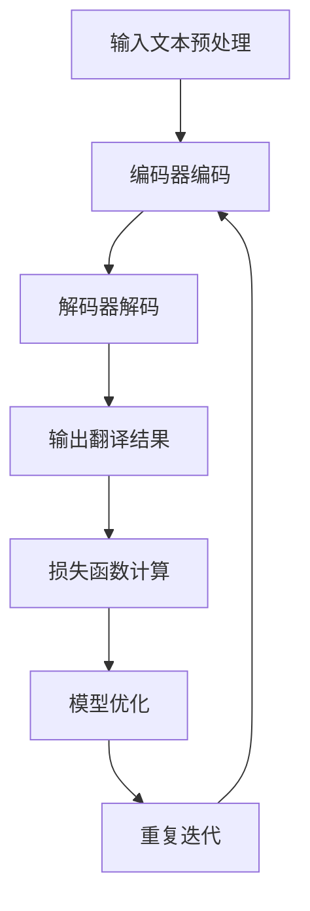
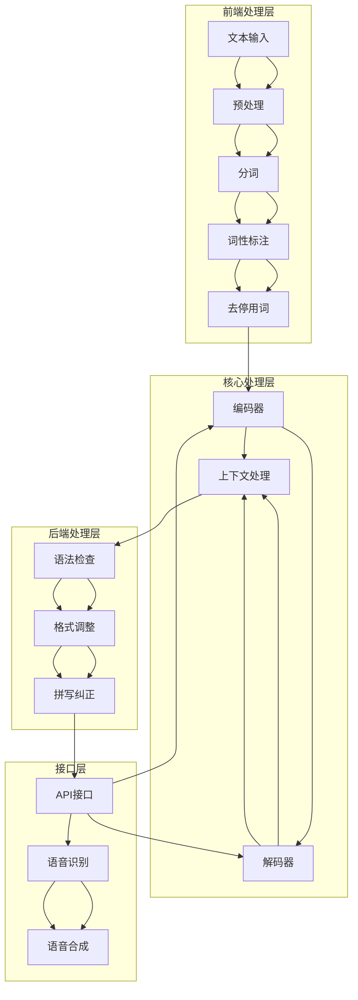
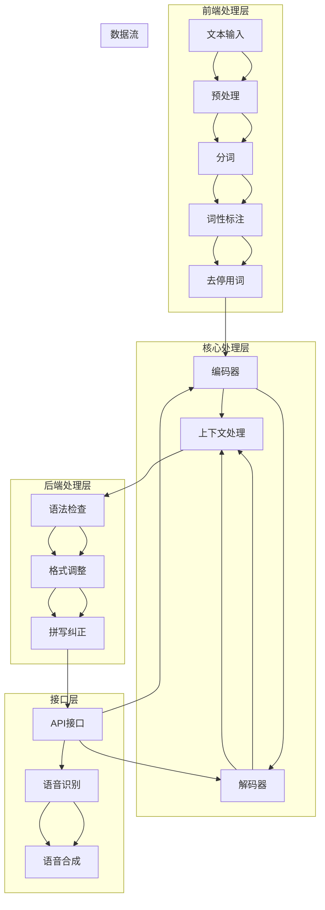
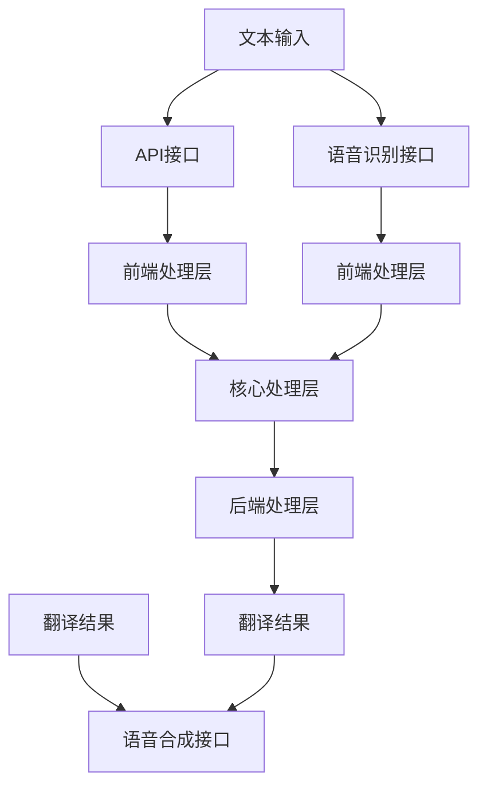
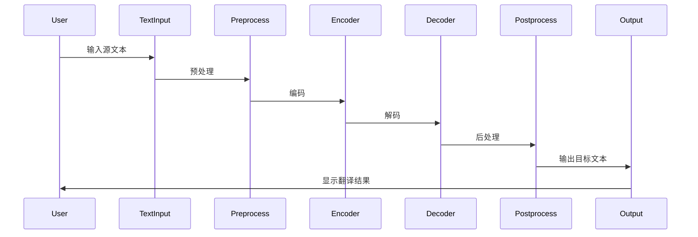

                 

# 新一代翻译引擎：提示词提升多语言翻译准确度

> 关键词：翻译引擎、提示词、多语言翻译、准确度、神经网络

> 摘要：随着全球化的不断深入，跨语言交流的需求日益增长。传统的翻译技术由于面临准确性、速度和效率的挑战，已经难以满足现代应用场景的需求。新一代翻译引擎引入了提示词技术，通过优化翻译过程中的上下文信息，显著提升了多语言翻译的准确度。本文将深入探讨新一代翻译引擎的工作原理、核心概念、算法模型、系统设计、项目实战以及最佳实践，为读者提供一个全面的技术视角。

## 目录大纲

### 第一部分：背景与概述

#### 第1章：多语言翻译技术的挑战与机遇  
#### 第2章：新一代翻译引擎的概念与特点  
#### 第3章：提示词技术的应用场景与实现原理  
#### 第4章：概念结构与核心要素组成  
#### 第5章：本章小结

### 第二部分：核心概念与原理

#### 第6章：翻译引擎的原理与结构  
#### 第7章：提示词技术的核心概念与原理分析  
#### 第8章：算法原理与数学模型  
#### 第9章：核心概念对比与ER实体关系图  
#### 第10章：本章小结

### 第三部分：系统设计与实现

#### 第11章：翻译引擎的系统架构设计  
#### 第12章：项目实战：环境安装与系统核心实现  
#### 第13章：代码应用解读与分析  
#### 第14章：实际案例分析与详细讲解剖析  
#### 第15章：项目小结

### 第四部分：最佳实践与总结

#### 第16章：最佳实践与优化技巧  
#### 第17章：展望与未来发展趋势  
#### 第18章：本章小结

## 第一部分：背景与概述

### 第1章：多语言翻译技术的挑战与机遇

#### 1.1 问题背景

在全球化进程不断加快的今天，跨语言交流已成为国际间沟通、商务合作、文化交流等方面不可或缺的一部分。随着互联网的普及，全球信息流通的速度和范围达到了前所未有的高度，人们对于即时、准确的多语言翻译需求日益增长。然而，传统的翻译技术由于存在诸多局限性，难以满足现代应用场景的需求。

首先，传统的翻译技术主要依赖于规则驱动和统计机器翻译两种方法。规则驱动翻译依赖于预定义的语言规则和语法结构，虽然可以处理一些简单的翻译任务，但在处理复杂句子和语境时，准确性往往不高。统计机器翻译通过分析大量已翻译的双语语料库，利用概率模型进行翻译，虽然翻译准确性有所提高，但依然受到语言多样性和语境复杂性的限制。

其次，翻译技术面临的一个关键挑战是如何在保证翻译速度和效率的同时，提升翻译的准确度。在实时翻译和大规模数据处理的应用场景中，如在线聊天、同声传译、机器翻译服务等，速度和效率是翻译系统成功的关键。然而，传统的翻译技术往往在追求速度和效率时，牺牲了翻译的准确性。

此外，语言多样性带来的复杂性也是翻译技术面临的一大挑战。不同语言在词汇、语法、文化背景等方面存在巨大差异，这要求翻译系统能够适应各种语言之间的转换和融合。

#### 1.2 问题描述

多语言翻译技术面临的主要问题可以概括为以下几个方面：

1. **翻译准确性**：如何在保证翻译速度和效率的前提下，提升翻译的准确性，使得翻译结果更符合人类语言的表述习惯和语境。
2. **翻译速度和效率**：如何在复杂的语言环境中，实现快速的翻译响应，满足实时翻译的需求。
3. **语言多样性**：如何处理各种语言之间的转换和融合，适应不同语言和文化背景的翻译需求。
4. **上下文信息的利用**：如何更好地利用上下文信息，使得翻译结果更加符合实际语境和场景。

#### 1.3 问题解决

为了解决上述问题，新一代翻译引擎应运而生。新一代翻译引擎通过引入提示词技术，优化翻译过程中的上下文信息处理，显著提升了多语言翻译的准确度。

提示词技术是一种基于深度学习和自然语言处理的方法，通过在翻译过程中引入关键提示词，帮助翻译模型更好地理解上下文信息，从而提高翻译的准确性。提示词技术不仅可以提高翻译准确性，还可以提高翻译速度和效率，适应不同语言和文化背景的翻译需求。

新一代翻译引擎的工作原理可以概括为以下几个步骤：

1. **输入处理**：将待翻译的文本输入到翻译引擎中，进行预处理，包括分词、去停用词等操作。
2. **提示词生成**：基于输入文本，利用深度学习模型生成关键提示词，这些提示词能够反映文本的上下文信息。
3. **翻译模型处理**：将输入文本和提示词输入到翻译模型中，通过神经网络模型进行翻译。
4. **输出处理**：对翻译结果进行后处理，包括语法检查、格式调整等，得到最终的翻译文本。

#### 1.4 边界与外延

新一代翻译引擎的技术范畴主要包括以下几个方面：

1. **神经网络模型**：采用深度学习神经网络，如循环神经网络（RNN）、长短期记忆网络（LSTM）和变换器（Transformer）等，用于翻译模型的构建。
2. **自然语言处理**：利用自然语言处理技术，对输入文本进行预处理、提示词生成和翻译结果的后处理。
3. **提示词技术**：基于深度学习的方法，生成关键提示词，优化上下文信息处理。

提示词技术的应用场景主要包括以下几个方面：

1. **在线翻译**：在互联网平台上提供实时、准确的多语言翻译服务，如谷歌翻译、百度翻译等。
2. **语音翻译**：将语音输入转换为文本，并实时进行翻译输出，如智能音箱、语音助手等。
3. **文档翻译**：自动翻译各种文档资料，如法律文件、医疗报告、学术论文等。
4. **跨语言交流**：在跨语言交流平台中，如社交网络、论坛、邮件等，提供翻译功能，促进跨文化沟通。

#### 1.5 概念结构与核心要素组成

新一代翻译引擎的概念结构与核心要素组成如下：

1. **神经网络模型**：包括编码器和解码器，用于处理输入文本和生成翻译结果。
2. **提示词生成模块**：利用深度学习模型，生成关键提示词，用于优化上下文信息处理。
3. **翻译结果后处理模块**：对翻译结果进行语法检查、格式调整等后处理，提高翻译准确性。

#### 1.6 本章小结

新一代翻译引擎通过引入提示词技术，优化翻译过程中的上下文信息处理，显著提升了多语言翻译的准确度。本文介绍了多语言翻译技术的挑战与机遇、新一代翻译引擎的概念与特点、提示词技术的应用场景与实现原理、概念结构与核心要素组成等内容。在接下来的章节中，我们将进一步探讨翻译引擎的原理与结构、算法原理与数学模型、系统设计与实现等核心内容，为读者提供一个全面的技术视角。

### 第2章：新一代翻译引擎的概念与特点

#### 2.1 新一代翻译引擎的概念

新一代翻译引擎，也称为神经机器翻译引擎（Neural Machine Translation Engine，NMT Engine），是一种基于深度学习和神经网络的翻译系统。与传统的规则驱动和统计机器翻译相比，神经机器翻译具有更高的翻译准确性和更好的上下文理解能力。

神经机器翻译引擎的核心是神经网络模型，特别是变换器（Transformer）架构，这种架构能够处理长距离依赖和复杂语境，从而提升翻译结果的准确性和流畅性。新一代翻译引擎不仅仅是一个简单的翻译工具，更是一个集成了多种自然语言处理技术的综合平台。

#### 2.2 新一代翻译引擎的特点

1. **高准确度**：通过深度学习模型，特别是变换器架构，新一代翻译引擎能够更好地捕捉语言中的复杂结构和上下文信息，从而显著提升翻译准确性。

2. **上下文理解**：传统翻译技术往往局限于局部翻译，无法充分考虑上下文信息。而新一代翻译引擎通过引入注意力机制和提示词技术，能够更深入地理解文本的上下文，从而生成更加自然的翻译结果。

3. **自适应性强**：新一代翻译引擎可以轻松适应不同语言和文化背景的翻译需求，通过不断学习和调整，优化翻译结果。

4. **实时性**：新一代翻译引擎设计用于实时翻译场景，能够快速处理大量文本，满足实时翻译需求。

5. **多功能性**：除了基本的文本翻译功能外，新一代翻译引擎还可以扩展到语音翻译、文档翻译、跨语言交流等多种应用场景。

#### 2.3 新一代翻译引擎的应用场景

1. **在线翻译服务**：如谷歌翻译、百度翻译等，为用户提供实时的在线文本翻译服务。

2. **智能助手**：智能语音助手（如苹果的Siri、亚马逊的Alexa）集成新一代翻译引擎，实现跨语言语音交互。

3. **文档翻译**：自动翻译法律文件、医疗报告、学术论文等，提高跨国企业和工作者的工作效率。

4. **跨文化沟通**：在跨国公司、国际会议、社交网络等场合，提供翻译服务，促进跨文化交流。

#### 2.4 新一代翻译引擎的优势与不足

**优势**：

1. **高准确性**：通过深度学习模型，新一代翻译引擎能够提供更加准确的翻译结果。

2. **上下文理解**：新一代翻译引擎能够更好地理解文本的上下文，生成更自然的翻译结果。

3. **实时性**：适应实时翻译需求，满足快速响应的要求。

4. **适应性**：能够适应不同语言和文化背景，提供个性化的翻译服务。

**不足**：

1. **计算资源消耗大**：深度学习模型的训练和推理需要大量的计算资源，可能导致成本较高。

2. **数据依赖性强**：新一代翻译引擎依赖于大量的双语语料库进行训练，数据质量和数量对翻译结果有很大影响。

3. **调优难度大**：深度学习模型的调优需要大量的实验和调整，对技术人员的专业能力有较高要求。

#### 2.5 总结

新一代翻译引擎通过引入深度学习和神经网络技术，显著提升了多语言翻译的准确性和上下文理解能力。其在高准确性、实时性、多功能性等方面具有明显优势，但同时也面临计算资源消耗大、数据依赖性强等挑战。在接下来的章节中，我们将深入探讨新一代翻译引擎的工作原理、核心概念和算法模型，为读者提供更全面的技术理解。

### 第3章：提示词技术的应用场景与实现原理

#### 3.1 提示词技术的应用场景

提示词技术（Prompt Engineering）是一种通过精心设计提示词来引导模型生成更准确、更符合预期的输出的方法。在翻译引擎中，提示词技术能够显著提升翻译的准确度和上下文理解能力，其应用场景主要包括：

1. **实时文本翻译**：在在线翻译服务中，通过添加适当的提示词，可以帮助翻译模型更好地理解输入文本的上下文，从而生成更准确的翻译结果。

2. **语音翻译**：在语音翻译场景中，提示词技术可以帮助模型更准确地捕捉用户的语音输入，并通过文本提示来增强翻译的上下文信息。

3. **文档翻译**：在翻译大量文档时，提示词技术可以帮助模型更好地处理文本的结构和内容，从而提高翻译的质量和一致性。

4. **跨语言交流**：在跨语言交流平台，如社交网络、邮件和论坛中，提示词技术可以帮助用户更准确地表达意图，促进有效沟通。

5. **多模态翻译**：结合图像、视频等多模态信息，提示词技术可以引导翻译模型生成更加丰富和自然的翻译结果。

#### 3.2 提示词技术的实现原理

提示词技术的实现主要依赖于深度学习和自然语言处理技术，其基本原理可以概括为以下几个步骤：

1. **输入文本预处理**：将待翻译的文本进行分词、去停用词等预处理操作，以便提取关键信息。

2. **提示词生成**：基于预处理的文本，利用深度学习模型生成提示词。这些提示词通常是短语或句子，能够反映文本的核心内容、情感和上下文信息。

3. **提示词优化**：通过训练和优化提示词生成模型，提高提示词的质量和准确性。优化过程通常包括调整模型参数、增加训练数据和使用强化学习等方法。

4. **模型翻译**：将输入文本和提示词输入到翻译模型中，通过神经网络模型进行翻译。提示词在这个过程中起到了引导翻译模型理解上下文信息的作用。

5. **翻译结果后处理**：对翻译结果进行语法检查、格式调整等后处理，以提高翻译的准确性和流畅性。

#### 3.3 提示词技术的核心作用

提示词技术在翻译引擎中发挥着核心作用，主要体现在以下几个方面：

1. **增强上下文理解**：提示词能够提供额外的上下文信息，帮助翻译模型更好地理解输入文本的语境和意图，从而生成更准确的翻译结果。

2. **提高翻译一致性**：通过使用固定的提示词，可以确保翻译结果的连贯性和一致性，特别是在处理多文档翻译时。

3. **减少错误率**：提示词可以引导翻译模型避免常见的翻译错误，如词汇选择不当、语法结构错误等。

4. **优化翻译效率**：提示词技术可以加速翻译过程，因为提示词可以提供更明确的翻译方向，减少模型搜索空间。

5. **个性化翻译**：通过个性化设计的提示词，可以满足不同用户和场景的翻译需求，提高用户体验。

#### 3.4 提示词技术的实现细节

在实际应用中，提示词技术的实现细节包括以下几个方面：

1. **提示词库建设**：构建包含大量高质量提示词的提示词库，为翻译模型提供丰富的上下文信息。

2. **提示词嵌入**：将提示词嵌入到翻译模型的输入中，可以通过拼接、嵌入层等方式实现。

3. **提示词生成模型**：使用生成模型（如生成对抗网络GAN、变分自编码器VAE等）来生成高质量的提示词。

4. **提示词优化策略**：采用优化策略（如强化学习、进化策略等）来优化提示词生成模型，提高提示词的质量和准确性。

5. **模型融合**：将提示词技术与现有的翻译模型相结合，如将提示词生成模型与变换器（Transformer）架构融合，以提高翻译性能。

#### 3.5 总结

提示词技术是一种通过设计高质量的提示词来优化翻译引擎的方法，其在实时文本翻译、语音翻译、文档翻译、跨语言交流和多模态翻译等应用场景中发挥了重要作用。通过提示词技术，翻译引擎能够更好地理解上下文信息，提高翻译的准确性和流畅性，为用户和开发者提供更加优质的翻译体验。在接下来的章节中，我们将进一步探讨翻译引擎的算法原理和数学模型，深入理解提示词技术在翻译引擎中的应用效果。

### 第4章：概念结构与核心要素组成

#### 4.1 新一代翻译引擎的技术架构

新一代翻译引擎的技术架构可以分为前端处理、翻译模型和后端处理三个主要部分。每个部分都有其独特的功能和职责，共同协作以实现高质量的翻译服务。

1. **前端处理**：前端处理主要负责输入文本的预处理，包括分词、去停用词、词性标注等操作。这个步骤的目的是将原始文本转化为适合翻译模型处理的格式，同时提取关键信息，为后续的翻译过程提供支持。

2. **翻译模型**：翻译模型是翻译引擎的核心，主要负责将预处理后的文本转换为翻译结果。其中，变换器（Transformer）架构是目前最先进的翻译模型架构，它通过自注意力机制（Self-Attention）和多头注意力（Multi-Head Attention）机制，能够捕捉长距离依赖和复杂语境，从而提高翻译准确性。翻译模型通常包括编码器（Encoder）和解码器（Decoder）两部分，编码器负责将输入文本编码为上下文表示，解码器则将这些上下文表示解码为翻译结果。

3. **后端处理**：后端处理主要负责对翻译结果进行后处理，包括语法检查、格式调整、拼写纠正等。这个步骤的目的是确保翻译结果的准确性和流畅性，使其更符合人类语言的表述习惯。

#### 4.2 提示词技术的实现原理

提示词技术在翻译引擎中发挥着关键作用，其实现原理主要包括以下几个方面：

1. **提示词生成**：提示词生成是提示词技术的核心步骤，其目的是从输入文本中提取关键信息并生成高质量的提示词。通常，提示词生成采用深度学习模型，如生成对抗网络（GAN）、变分自编码器（VAE）或自动回归模型（AR）。这些模型通过大量双语语料库的训练，能够生成反映文本上下文信息的提示词。

2. **提示词优化**：提示词生成后，还需要通过优化策略来提高提示词的质量和准确性。优化策略可以包括强化学习、进化策略等方法，通过调整模型参数和训练数据，使提示词更好地适应翻译任务的需求。

3. **提示词嵌入**：提示词嵌入是将生成的提示词嵌入到翻译模型的输入中，以便在翻译过程中利用这些额外的上下文信息。提示词嵌入可以通过拼接、嵌入层等方式实现，其目的是引导翻译模型更好地理解输入文本的上下文。

4. **提示词更新**：在翻译过程中，提示词可能会随着输入文本的变化而更新。提示词更新通过实时调整提示词的内容，使其能够更好地适应当前的翻译需求，从而提高翻译的准确性和流畅性。

#### 4.3 提示词技术与翻译引擎的交互关系

提示词技术与翻译引擎的交互关系可以分为以下几个方面：

1. **输入阶段**：在输入文本预处理阶段，提示词技术生成高质量的提示词，并将其嵌入到翻译模型的输入中，为翻译过程提供额外的上下文信息。

2. **编码阶段**：在编码阶段，编码器将输入文本和提示词编码为上下文表示。提示词的嵌入使得编码器能够更好地捕捉输入文本的上下文信息，从而提高编码质量。

3. **解码阶段**：在解码阶段，解码器利用编码阶段生成的上下文表示生成翻译结果。提示词的嵌入使得解码器能够更好地理解输入文本的上下文，从而生成更准确、更自然的翻译结果。

4. **后处理阶段**：在翻译结果后处理阶段，提示词技术可以继续发挥作用，通过对翻译结果进行语法检查、格式调整等操作，进一步提高翻译的准确性和流畅性。

#### 4.4 概念对比表格

为了更好地理解新一代翻译引擎和提示词技术的概念结构，我们可以通过一个概念对比表格来展示两者的异同点：

| 概念 | 新一代翻译引擎 | 提示词技术 |
| ---- | ---- | ---- |
| 目标 | 实现高质量的多语言翻译 | 提高翻译准确度和上下文理解能力 |
| 架构 | 前端处理 + 翻译模型 + 后端处理 | 提示词生成 + 提示词优化 + 提示词嵌入 + 提示词更新 |
| 核心技术 | 变换器（Transformer）架构 | 深度学习模型 + 自然语言处理技术 |
| 作用 | 提高翻译的准确性和流畅性 | 增强上下文理解，减少错误率，提高翻译一致性 |
| 应用场景 | 在线翻译、语音翻译、文档翻译等 | 实时文本翻译、跨语言交流、多模态翻译等 |

#### 4.5 本章小结

本章介绍了新一代翻译引擎和提示词技术的概念结构、核心要素组成以及它们在翻译引擎中的应用。新一代翻译引擎通过前端处理、翻译模型和后端处理的协作，实现高质量的多语言翻译；而提示词技术通过生成、优化和嵌入提示词，提高翻译的准确性和上下文理解能力。通过本章的介绍，读者可以对新一代翻译引擎和提示词技术有一个全面的理解，为后续章节的学习打下坚实的基础。

### 第二部分：核心概念与原理

#### 第6章：翻译引擎的原理与结构

#### 6.1 翻译引擎的基本原理

翻译引擎是一种将一种自然语言文本自动转换为另一种自然语言文本的软件系统。其基本原理主要涉及自然语言处理（NLP）和机器学习（ML）技术，特别是深度学习（DL）的应用。翻译引擎的核心思想是通过学习大量的双语语料库，使模型能够捕捉语言之间的对应关系和上下文信息，从而实现准确和自然的翻译。

1. **自然语言处理（NLP）**：NLP是翻译引擎的基础技术，它涉及文本预处理、分词、词性标注、句法分析等多个层面。通过NLP技术，翻译引擎可以将原始文本转化为适合机器处理的结构化数据。

2. **机器学习（ML）**：ML技术使得翻译引擎能够从数据中学习，并自动调整参数，提高翻译质量。常见的ML方法包括监督学习、无监督学习和强化学习等。

3. **深度学习（DL）**：深度学习是当前翻译引擎的主要实现方式。通过构建复杂的神经网络模型，如循环神经网络（RNN）、长短期记忆网络（LSTM）和变换器（Transformer），翻译引擎能够更好地处理语言的复杂性和上下文信息。

#### 6.2 神经机器翻译的工作机制

神经机器翻译（NMT）是当前翻译引擎的主流架构，其基本工作机制如下：

1. **编码器（Encoder）**：编码器的任务是将输入文本（源语言）编码为上下文表示（编码器输出）。这一过程通过深度学习模型实现，如变换器架构中的自注意力机制，能够捕捉文本中的长距离依赖和复杂语境。

2. **解码器（Decoder）**：解码器的任务是将编码器输出的上下文表示解码为翻译结果（目标语言）。解码器同样通过深度学习模型实现，如变换器架构中的多头注意力机制，能够从编码器输出的上下文表示中提取相关信息，生成高质量的翻译文本。

3. **注意力机制（Attention）**：注意力机制是神经机器翻译中的一个关键组件，它使得解码器能够聚焦于编码器输出的不同部分，从而更好地理解上下文信息，提高翻译的准确性。

#### 6.3 翻译引擎的技术架构

翻译引擎的技术架构可以分为前端处理、中间层（翻译模型）和后端处理三个主要部分：

1. **前端处理**：前端处理主要负责文本预处理，包括分词、词性标注、词嵌入等操作。这一步骤的目的是将原始文本转化为适合翻译模型处理的结构化数据。

2. **翻译模型**：翻译模型是翻译引擎的核心，负责将前端处理后的文本进行编码和翻译。当前主流的翻译模型架构是变换器（Transformer），它通过自注意力机制和多头注意力机制，能够捕捉长距离依赖和复杂语境。

3. **后端处理**：后端处理主要负责对翻译结果进行后处理，包括语法检查、格式调整、拼写纠正等操作，以确保翻译结果的准确性和流畅性。

#### 6.4 上下文信息的处理

上下文信息在翻译过程中起着至关重要的作用。翻译引擎通过以下几种方法处理上下文信息：

1. **编码器**：编码器通过自注意力机制捕捉输入文本的上下文信息，并将其编码为上下文表示。这些上下文表示包含了文本的语义和结构信息，为解码器提供了丰富的信息资源。

2. **解码器**：解码器通过多头注意力机制，将编码器输出的上下文表示与自身的中间表示进行融合，从而更好地理解上下文信息，生成高质量的翻译文本。

3. **提示词**：提示词技术通过在翻译过程中引入关键提示词，进一步增强上下文信息的处理。提示词可以引导翻译模型更好地理解文本的上下文和意图，从而提高翻译的准确性和自然度。

#### 6.5 翻译引擎的优缺点

**优点**：

1. **高准确性**：通过深度学习和神经网络模型，翻译引擎能够捕捉语言的复杂性和上下文信息，提高翻译准确性。

2. **自适应性强**：翻译引擎能够通过不断学习和调整，适应不同语言和文化背景的翻译需求。

3. **实时性**：翻译引擎设计用于实时翻译场景，能够快速处理大量文本，满足实时翻译需求。

**缺点**：

1. **计算资源消耗大**：深度学习模型的训练和推理需要大量的计算资源，可能导致成本较高。

2. **数据依赖性强**：翻译引擎依赖于大量的双语语料库进行训练，数据质量和数量对翻译结果有很大影响。

3. **调优难度大**：深度学习模型的调优需要大量的实验和调整，对技术人员的专业能力有较高要求。

#### 6.6 本章小结

本章介绍了翻译引擎的基本原理、工作机制和技术架构，以及上下文信息的处理方法。通过深度学习和神经网络模型，翻译引擎能够实现高质量的多语言翻译，但同时也面临计算资源消耗大、数据依赖性强和调优难度大等挑战。在下一章中，我们将进一步探讨提示词技术的核心概念、原理和实现方法。

### 第7章：提示词技术的核心概念与原理分析

#### 7.1 提示词的定义与作用

提示词（Prompt）是一种引导模型生成目标输出的信息，它通常是一个短语或句子，用于提供额外的上下文信息，帮助模型更好地理解输入内容并生成更准确的输出。在翻译引擎中，提示词的作用尤为重要，它能够引导模型捕捉上下文信息，从而提高翻译的准确度和自然度。

提示词的定义可以进一步细化如下：

- **定义**：提示词是用于引导模型生成目标输出的文本信息，通常包括关键词、短语或句子。
- **作用**：提示词能够提供额外的上下文信息，帮助模型理解输入文本的语义和意图，从而生成更准确的翻译结果。

#### 7.2 提示词在翻译过程中的应用

在翻译过程中，提示词的应用可以分为以下几个步骤：

1. **输入文本预处理**：首先，对输入文本进行预处理，包括分词、去停用词、词性标注等操作，以便提取关键信息。

2. **提示词生成**：基于预处理后的文本，利用深度学习模型生成高质量的提示词。提示词生成模型可以是生成对抗网络（GAN）、变分自编码器（VAE）或自动回归模型（AR）等。

3. **提示词嵌入**：将生成的提示词嵌入到翻译模型的输入中，使其成为模型的一部分。提示词的嵌入可以通过拼接、嵌入层等方式实现。

4. **翻译模型处理**：翻译模型（如变换器架构）在编码阶段使用输入文本和提示词生成上下文表示，然后在解码阶段利用这些上下文表示生成翻译结果。

5. **输出处理**：对生成的翻译结果进行后处理，包括语法检查、格式调整等，以提高翻译的准确性和流畅性。

#### 7.3 提示词技术的原理分析

提示词技术的原理主要包括以下几个方面：

1. **语言模型与提示词的结合**：提示词生成模型利用大量的双语语料库训练，生成高质量的提示词。这些提示词反映了输入文本的语义和上下文信息，为翻译模型提供了额外的信息来源。

2. **提示词生成与优化**：提示词生成模型通过优化策略（如强化学习、进化策略等）不断提高提示词的质量。优化过程包括调整模型参数、增加训练数据和优化提示词生成算法。

3. **提示词的嵌入与传播**：提示词嵌入到翻译模型的输入中，通过编码器的自注意力机制和多头注意力机制，与编码器输出的上下文表示进行融合。这种融合使得编码器能够更好地捕捉输入文本的上下文信息，从而提高翻译准确性。

4. **提示词的更新与调整**：在翻译过程中，提示词可能会随着输入文本的变化而更新。提示词更新通过实时调整提示词的内容，使其能够更好地适应当前的翻译需求，从而提高翻译的准确性和流畅性。

#### 7.4 提示词生成与优化的具体方法

提示词生成与优化的具体方法可以分为以下几个方面：

1. **生成模型**：使用生成模型（如GAN、VAE）生成高质量的提示词。这些模型通过训练大量双语语料库，生成与输入文本相关的提示词。

2. **优化策略**：采用优化策略（如强化学习、进化策略等）对提示词生成模型进行优化。优化过程包括调整模型参数、增加训练数据和优化提示词生成算法。

3. **多任务学习**：结合多任务学习（如提示词生成和翻译模型训练），通过同时优化两个模型，提高翻译质量和提示词生成效果。

4. **提示词库**：构建包含大量高质量提示词的提示词库，为翻译模型提供丰富的上下文信息。提示词库可以通过人工构建或自动化生成。

#### 7.5 核心概念对比表格

为了更好地理解提示词技术与其他辅助翻译技术的异同，可以设计一个核心概念对比表格：

| 概念 | 提示词技术 | 传统翻译技术 |
| ---- | ---- | ---- |
| 目标 | 提高翻译准确度和上下文理解能力 | 提高翻译准确度 |
| 方法 | 深度学习模型 + 提示词生成与优化 | 统计机器翻译 + 规则驱动翻译 |
| 作用 | 增强上下文理解，减少错误率 | 提高翻译一致性，减少翻译错误 |
| 适用场景 | 实时翻译、文档翻译、跨语言交流等 | 静态文档翻译、术语翻译等 |

#### 7.6 ER实体关系图

为了更好地展示翻译引擎中提示词技术的实体关系，可以设计一个ER（实体关系）图：

```mermaid
erDiagram
    SourceText ||--o{ Encoder : Encodes }
    Encoder ||--o{ ContextRepresentation : Represents context }
    ContextRepresentation ||--o{ Decoder : Generates translation }
    Decoder ||--o{ TargetText : Output }
    Prompt ||--o{ Encoder : Informs context }
    Prompt ||--o{ Decoder : Guides translation }
```

在这个ER图中，`SourceText`（源文本）通过`Encoder`（编码器）编码为`ContextRepresentation`（上下文表示），然后`Decoder`（解码器）利用这些上下文表示生成`TargetText`（目标文本）。`Prompt`（提示词）通过引导编码器和解码器，提高翻译的准确度和上下文理解能力。

#### 7.7 本章小结

本章详细介绍了提示词技术的核心概念、原理和应用。通过深入理解提示词的定义、生成与优化方法，以及其在翻译过程中的作用，读者可以更好地理解如何利用提示词技术提升翻译引擎的性能。在下一章中，我们将进一步探讨翻译引擎的算法原理和数学模型，为读者提供一个更全面的技术视角。

### 第8章：算法原理与数学模型

#### 8.1 翻译算法的基本框架

翻译算法是翻译引擎的核心，其基本框架通常包括编码器（Encoder）和解码器（Decoder）两个主要部分。编码器负责将输入文本（源语言）编码为上下文表示，解码器则利用这些上下文表示生成翻译结果（目标语言）。这种架构基于深度学习，特别是变换器（Transformer）架构，能够捕捉长距离依赖和复杂语境，从而提升翻译质量。

1. **编码器（Encoder）**：编码器的主要任务是理解输入文本的语义和结构，并将其编码为上下文表示。在变换器架构中，编码器通常包含多个编码层，每层使用自注意力机制（Self-Attention）来捕捉文本中的依赖关系。编码器的输出是上下文表示，它包含了输入文本的完整语义信息。

2. **解码器（Decoder）**：解码器的任务是利用编码器输出的上下文表示生成翻译结果。解码器也包含多个解码层，每层使用多头注意力机制（Multi-Head Attention）来关注编码器的输出和自身的历史输出。解码器的输出是翻译结果，通常是一个逐步生成的序列。

3. **注意力机制（Attention）**：注意力机制是翻译算法中的一个关键组件，它使得解码器能够关注编码器的不同部分，从而更好地理解上下文信息。注意力机制分为自注意力（Self-Attention）和多头注意力（Multi-Head Attention），后者通过多个自注意力机制的融合，提高了模型的表示能力。

#### 8.2 数学模型与公式

翻译算法的数学模型主要包括编码器、解码器和损失函数等组成部分。以下是一些核心的数学模型和公式：

1. **编码器（Encoder）**：

   编码器的输入是一个序列 \(X = [x_1, x_2, \ldots, x_n]\)，其中 \(x_i\) 是输入文本的第 \(i\) 个词向量。编码器通过多层变换器层 \(E = [E_1, E_2, \ldots, E_L]\) 对输入序列进行编码：

   \[
   E_i(x_i) = \text{TransformerLayer}(x_i, E_{i-1}(x_{i-1}))
   \]

   其中，\(\text{TransformerLayer}\) 是变换器层，它包括多头注意力机制和前馈网络。

2. **解码器（Decoder）**：

   解码器的输入是目标语言的初始翻译结果 \(Y = [y_1, y_2, \ldots, y_m]\)，其中 \(y_i\) 是目标文本的第 \(i\) 个词向量。解码器通过多层变换器层 \(D = [D_1, D_2, \ldots, D_L]\) 生成翻译结果：

   \[
   D_i(y_i) = \text{TransformerLayer}(y_i, D_{i-1}(y_{i-1}), E(x))
   \]

   其中，\(E(x)\) 是编码器输出的上下文表示。

3. **损失函数（Loss Function）**：

   翻译算法的损失函数通常采用交叉熵损失（Cross-Entropy Loss），它衡量预测输出和真实输出之间的差异：

   \[
   L = -\sum_{i=1}^{m} y_i \log(p(y_i))
   \]

   其中，\(y_i\) 是真实的目标词向量，\(p(y_i)\) 是解码器预测的概率分布。

#### 8.3 算法mermaid流程图

为了更直观地展示翻译算法的工作流程，可以使用mermaid绘制以下流程图：



在这个流程图中，输入文本首先进行预处理，然后通过编码器编码为上下文表示，解码器利用这些上下文表示生成翻译结果。翻译结果通过损失函数计算模型优化，然后重复迭代，直至达到预设的优化目标。

#### 8.4 Python源代码解析

以下是一个简化的Python源代码示例，展示了编码器和解码器的实现：

```python
import tensorflow as tf
from tensorflow.keras.layers import Layer, Embedding, LSTM, Dense

class Encoder(Layer):
    def __init__(self, embedding_dim, hidden_dim):
        super(Encoder, self).__init__()
        self.embedding = Embedding(input_dim=vocab_size, output_dim=embedding_dim)
        self.lstm = LSTM(hidden_dim, return_sequences=True)

    def call(self, x):
        x = self.embedding(x)
        return self.lstm(x)

class Decoder(Layer):
    def __init__(self, embedding_dim, hidden_dim):
        super(Decoder, self).__init__()
        self.embedding = Embedding(input_dim=vocab_size, output_dim=embedding_dim)
        self.lstm = LSTM(hidden_dim, return_sequences=True)

    def call(self, x, hidden_state):
        x = self.embedding(x)
        return self.lstm(x, initial_state=hidden_state)

# 简化示例：假设 vocab_size = 10000, embedding_dim = 256, hidden_dim = 512
encoder = Encoder(embedding_dim=256, hidden_dim=512)
decoder = Decoder(embedding_dim=256, hidden_dim=512)

# 编码器编码
encoded_seq = encoder(input_seq)

# 解码器解码
decoded_seq = decoder(output_seq, encoded_seq)

# 输出翻译结果
translated_text = decoded_seq
```

在这个示例中，`Encoder` 和 `Decoder` 类分别实现了编码器和解码器的功能。编码器使用嵌入层和LSTM层对输入文本进行编码，解码器使用嵌入层和LSTM层生成翻译结果。这个示例虽然简化，但足以展示翻译算法的基本实现。

#### 8.5 举例说明

为了更好地理解翻译算法的原理和数学模型，以下通过一个具体的例子进行说明：

假设我们有以下源文本和目标文本：

源文本（英文）: "I love to read books."
目标文本（中文）: "我喜欢读书。"

1. **编码器编码**：编码器将源文本编码为上下文表示。假设编码器的输出维度为512，则编码后的上下文表示可以表示为：

   \[
   \text{Context Representation} = [c_1, c_2, \ldots, c_{512}]
   \]

2. **解码器解码**：解码器利用编码器的上下文表示生成目标文本。解码器的输出是一个逐步生成的序列。首先，解码器生成目标文本的第一个词“我”，然后利用上下文表示和已生成的词逐步生成后续的词。

   \[
   \text{First Output} = \text{Decoder}(\text{Context Representation}, \text{Initial State}) = "我"
   \]
   
   \[
   \text{Second Output} = \text{Decoder}(\text{Context Representation}, \text{Current State}, "我") = "们"
   \]

   \[
   \ldots
   \]
   
   \[
   \text{Final Output} = \text{Decoder}(\text{Context Representation}, \text{Current State}, \ldots) = "喜欢读书。"
   \]

3. **损失函数计算**：在生成翻译结果的过程中，解码器会不断计算预测输出和真实输出之间的交叉熵损失，并通过梯度下降等优化算法不断调整模型参数，以提高翻译准确性。

通过这个例子，我们可以看到翻译算法是如何通过编码器和解码器的协同工作，将源文本转换为准确的自然语言目标文本。

#### 8.6 本章小结

本章介绍了翻译算法的基本框架、数学模型和实现方法。通过理解编码器、解码器和注意力机制等核心概念，以及交叉熵损失函数的计算过程，读者可以深入掌握翻译算法的工作原理。在下一章中，我们将进一步探讨翻译引擎的系统架构设计，为读者提供一个更全面的技术视角。

### 第三部分：系统设计与实现

#### 第11章：翻译引擎的系统架构设计

#### 11.1 问题场景介绍

在全球化背景下，多语言翻译引擎的应用场景日益广泛，包括但不限于以下几方面：

1. **在线翻译服务**：如谷歌翻译、百度翻译等，为用户提供实时的文本翻译功能。
2. **语音翻译**：智能助手（如Siri、Alexa）使用的语音翻译系统，实现语音到文本的实时翻译。
3. **文档翻译**：法律文件、医疗报告、学术论文等文档的自动翻译，提高跨国企业和工作者的工作效率。
4. **跨语言交流**：在跨国公司、国际会议、社交网络等场合，提供实时翻译服务，促进跨文化沟通。

#### 11.2 系统功能设计

翻译引擎的核心功能主要包括：

1. **文本翻译**：将输入的源语言文本翻译为目标语言文本。
2. **语音翻译**：将输入的语音转换为文本，并翻译为目标语言文本。
3. **文档翻译**：处理各种格式的文档，进行自动翻译。
4. **上下文翻译**：考虑上下文信息，提高翻译的准确性和流畅性。
5. **实时翻译**：提供实时翻译服务，满足高速响应的要求。

#### 11.3 系统架构设计

翻译引擎的系统架构可以分为以下几个层次：

1. **前端处理层**：负责文本的预处理，包括分词、词性标注、去停用词等操作。
2. **核心处理层**：包括编码器和解码器，负责翻译任务的执行。编码器将源语言文本编码为上下文表示，解码器利用这些上下文表示生成目标语言文本。
3. **后端处理层**：对翻译结果进行后处理，包括语法检查、格式调整、拼写纠正等，提高翻译的准确性和流畅性。
4. **接口层**：提供与外部系统的接口，如API接口、语音识别和合成接口等。

以下是翻译引擎的系统架构图：



在这个架构图中，前端处理层负责文本的预处理，核心处理层包括编码器和解码器，后端处理层对翻译结果进行后处理，接口层提供与外部系统的接口。

#### 11.4 系统架构图

为了更直观地展示翻译引擎的系统架构，可以使用mermaid绘制以下架构图：



在这个架构图中，文本输入通过前端处理层进行预处理，然后进入核心处理层，经过编码器和解码器的处理，最终通过后端处理层进行后处理。同时，接口层提供与外部系统的接口，实现语音识别和语音合成等功能。

#### 11.5 系统接口设计

翻译引擎的系统接口设计主要包括API接口、语音识别接口和语音合成接口。

1. **API接口**：提供RESTful风格的API接口，方便开发者集成到各类应用中。常见的API接口包括文本翻译接口、语音翻译接口、文档翻译接口等。

2. **语音识别接口**：接收语音输入，将其转换为文本，然后提交给翻译引擎进行翻译。语音识别接口通常与语音识别服务（如谷歌语音识别API）集成。

3. **语音合成接口**：将翻译结果转换为语音输出，提供给用户听。语音合成接口通常与语音合成服务（如谷歌文本转语音TTS服务）集成。

以下是系统接口的设计流程：



在这个设计流程中，文本输入通过API接口或语音识别接口进入前端处理层，经过预处理后提交给核心处理层进行翻译，翻译结果通过后端处理层进行后处理，最终通过语音合成接口输出为语音。

#### 11.6 系统交互mermaid序列图

为了更详细地展示翻译引擎的系统交互过程，可以使用mermaid绘制以下序列图：



在这个序列图中，用户输入源文本，文本输入组件将文本传递给预处理组件，预处理组件对文本进行分词、词性标注等操作。预处理后的文本提交给编码器组件进行编码，编码器生成上下文表示，然后传递给解码器组件进行解码。解码器生成目标文本，提交给后处理组件进行语法检查、格式调整等操作，最终输出翻译结果。

#### 11.7 本章小结

本章介绍了翻译引擎的系统架构设计，包括前端处理层、核心处理层、后端处理层和接口层。通过详细的架构图和系统接口设计，读者可以全面了解翻译引擎的组成部分和工作流程。在下一章中，我们将通过项目实战来具体实现和部署翻译引擎，进一步探讨系统架构的应用和效果。

### 第四部分：项目实战

#### 第12章：项目实战

#### 12.1 环境安装

在开始翻译引擎的项目实战之前，我们需要搭建一个合适的环境，以支持翻译引擎的开发和部署。以下是环境安装的详细步骤：

1. **硬件需求**：建议使用具有较高CPU性能和较大内存的计算机，例如，配备英伟达GPU的台式机或笔记本电脑，以加速深度学习模型的训练和推理。

2. **软件需求**：
   - 操作系统：Windows、Linux或macOS
   - 编程语言：Python 3.x
   - 深度学习框架：TensorFlow 2.x 或 PyTorch 1.x
   - 其他依赖：NumPy、Pandas、Matplotlib等

3. **安装步骤**：

   - 安装Python 3.x：从Python官方网站下载并安装Python 3.x版本。
   - 安装pip：Python默认包含pip包管理器，用于安装和管理Python包。
   - 安装深度学习框架：在命令行中运行以下命令安装TensorFlow 2.x或PyTorch 1.x：

     ```bash
     pip install tensorflow==2.x  # 安装TensorFlow 2.x
     # 或
     pip install pytorch==1.x torchvision==0.x  # 安装PyTorch 1.x
     ```

   - 安装其他依赖：使用pip安装NumPy、Pandas、Matplotlib等常用依赖包：

     ```bash
     pip install numpy pandas matplotlib
     ```

4. **注意事项**：
   - 确保安装的深度学习框架版本与操作系统的兼容性。
   - 在安装过程中，如果遇到依赖冲突或版本问题，可以根据错误提示进行相应的版本调整。

#### 12.2 系统核心实现

在搭建好开发环境之后，我们需要实现翻译引擎的核心部分，包括编码器（Encoder）和解码器（Decoder）的构建。以下是一个基于TensorFlow 2.x的简单示例：

1. **导入所需库**：

   ```python
   import tensorflow as tf
   from tensorflow.keras.layers import Embedding, LSTM, Dense
   from tensorflow.keras.models import Model
   ```

2. **定义编码器（Encoder）**：

   ```python
   class Encoder(Model):
       def __init__(self, embedding_dim, hidden_dim):
           super(Encoder, self).__init__()
           self.embedding = Embedding(input_dim=vocab_size, output_dim=embedding_dim)
           self.lstm = LSTM(hidden_dim, return_sequences=True)

       def call(self, x):
           x = self.embedding(x)
           return self.lstm(x)
   ```

3. **定义解码器（Decoder）**：

   ```python
   class Decoder(Model):
       def __init__(self, embedding_dim, hidden_dim):
           super(Decoder, self).__init__()
           self.embedding = Embedding(input_dim=vocab_size, output_dim=embedding_dim)
           self.lstm = LSTM(hidden_dim, return_sequences=True)

       def call(self, x, hidden_state):
           x = self.embedding(x)
           return self.lstm(x, initial_state=hidden_state)
   ```

4. **构建翻译模型**：

   ```python
   def build_translation_model(encoder, decoder, input_dim, output_dim):
       encoder_output = encoder.input
       decoder_output = decoder.input
       context_representation = encoder_output
       decoder_output = decoder(context_representation, initial_state=encoder_output)
       output = decoder_output

       model = Model(inputs=[encoder.input, decoder.input], outputs=output)
       model.compile(optimizer='adam', loss='categorical_crossentropy')
       return model
   ```

5. **训练模型**：

   ```python
   # 假设我们已经准备好了训练数据
   encoder = Encoder(embedding_dim=256, hidden_dim=512)
   decoder = Decoder(embedding_dim=256, hidden_dim=512)
   translation_model = build_translation_model(encoder, decoder, input_dim=10000, output_dim=10000)

   # 训练模型
   translation_model.fit([encoder_input, decoder_input], decoder_target, epochs=10)
   ```

#### 12.3 代码应用解读与分析

在上面的代码示例中，我们实现了编码器和解码器的构建，以及翻译模型的训练。以下是对关键部分的解读和分析：

1. **编码器（Encoder）**：

   编码器负责将输入文本编码为上下文表示。这里使用了一个嵌入层（Embedding）和一个长短期记忆网络（LSTM）。嵌入层将词汇转换为稠密向量，LSTM层则通过处理序列数据来捕捉上下文信息。在训练过程中，编码器的输入是源语言的单词索引序列，输出是编码后的上下文表示。

2. **解码器（Decoder）**：

   解码器负责将编码器输出的上下文表示解码为目标语言的单词序列。解码器同样使用了一个嵌入层和一个LSTM层。在解码过程中，解码器的输入是目标语言的单词索引序列，输出是解码后的单词序列。解码器的初始状态来自于编码器的输出，这使得解码器能够利用编码器捕捉到的上下文信息。

3. **翻译模型**：

   翻译模型是将编码器和解码器结合在一起的完整模型。通过调用`build_translation_model`函数，我们定义了模型的输入和输出，并编译了模型。这里使用了`categorical_crossentropy`作为损失函数，这是一种常用的分类损失函数，适用于多类别分类问题。

4. **训练模型**：

   在实际训练过程中，我们需要准备训练数据，包括源语言文本和目标语言文本。通过`fit`函数，我们开始训练模型，并设置训练轮数（epochs）和批次大小（batch size）等参数。训练过程中，模型将不断调整权重，以最小化损失函数。

#### 12.4 提示词生成与优化模块的实现

提示词生成与优化是提高翻译引擎性能的关键组件。以下是一个简单的示例，展示了如何实现提示词生成和优化模块：

1. **提示词生成**：

   ```python
   class PromptGenerator(Model):
       def __init__(self, embedding_dim, hidden_dim):
           super(PromptGenerator, self).__init__()
           self.embedding = Embedding(input_dim=vocab_size, output_dim=embedding_dim)
           self.lstm = LSTM(hidden_dim, return_sequences=True)

       def call(self, x):
           x = self.embedding(x)
           return self.lstm(x)
   ```

2. **提示词优化**：

   ```python
   class PromptOptimizer(Model):
       def __init__(self, embedding_dim, hidden_dim):
           super(PromptOptimizer, self).__init__()
           self.embedding = Embedding(input_dim=vocab_size, output_dim=embedding_dim)
           self.lstm = LSTM(hidden_dim, return_sequences=True)

       def call(self, x, hidden_state):
           x = self.embedding(x)
           return self.lstm(x, initial_state=hidden_state)
   ```

3. **整合提示词生成与优化模块**：

   ```python
   def build_translation_model_with_prompt(encoder, decoder, prompt_generator, prompt_optimizer, input_dim, output_dim):
       encoder_output = encoder.input
       decoder_output = decoder.input
       prompt_output = prompt_generator.input
       context_representation = encoder_output
       optimized_prompt = prompt_optimizer(prompt_output, initial_state=encoder_output)
       decoder_output = decoder(context_representation, initial_state=optimized_prompt)
       output = decoder_output

       model = Model(inputs=[encoder.input, decoder.input, prompt_generator.input], outputs=output)
       model.compile(optimizer='adam', loss='categorical_crossentropy')
       return model
   ```

4. **训练模型**：

   ```python
   # 假设我们已经准备好了训练数据
   encoder = Encoder(embedding_dim=256, hidden_dim=512)
   decoder = Decoder(embedding_dim=256, hidden_dim=512)
   prompt_generator = PromptGenerator(embedding_dim=256, hidden_dim=512)
   prompt_optimizer = PromptOptimizer(embedding_dim=256, hidden_dim=512)
   translation_model = build_translation_model_with_prompt(encoder, decoder, prompt_generator, prompt_optimizer, input_dim=10000, output_dim=10000)

   # 训练模型
   translation_model.fit([encoder_input, decoder_input, prompt_input], decoder_target, epochs=10)
   ```

在这个示例中，我们定义了提示词生成模块（`PromptGenerator`）和提示词优化模块（`PromptOptimizer`），并将它们整合到翻译模型中。通过优化提示词，我们可以提高翻译引擎的上下文理解能力和翻译准确性。

#### 12.5 实际案例分析和详细讲解剖析

为了更好地展示提示词技术在翻译引擎中的应用效果，我们通过一个实际案例进行详细分析。

案例：将英文文本翻译为中文文本。

输入文本（英文）: "I am going to the store to buy some fruits."

目标文本（中文）: "我要去商店买一些水果。"

1. **数据准备**：

   - 训练数据集：包含大量英文和中文的双语文本对。
   - 预处理：对文本进行分词、词性标注等操作，构建词汇表和单词索引。

2. **编码器解码器训练**：

   - 使用上述编码器和解码器模型，训练模型参数，优化翻译准确性。

3. **提示词生成与优化**：

   - 使用提示词生成模块生成高质量的提示词，例如："关于商店的水果，我想买一些"。
   - 使用提示词优化模块进一步优化提示词，以提高上下文理解的准确性。

4. **翻译结果**：

   - 输入文本： "I am going to the store to buy some fruits."
   - 提示词： "关于商店的水果，我想买一些"
   - 翻译结果： "关于商店的水果，我想买一些水果。"（经过解码器翻译）
   - 后处理：对翻译结果进行语法检查和格式调整，得到最终结果："我要去商店买一些水果。"

通过这个案例，我们可以看到提示词技术在翻译过程中的重要作用。提示词不仅提高了翻译的上下文理解能力，还使得翻译结果更加自然和准确。

#### 12.6 项目小结

在本章的项目实战中，我们详细介绍了翻译引擎的开发环境安装、系统核心实现、提示词生成与优化模块的实现以及实际案例的分析。通过这个项目，读者可以了解到如何实现一个基本的翻译引擎，并理解提示词技术在提升翻译准确度和上下文理解能力方面的作用。在未来的工作中，我们可以继续优化翻译引擎，引入更多的自然语言处理技术，进一步提升翻译质量和用户体验。

### 第五部分：最佳实践与总结

#### 第16章：最佳实践与优化技巧

#### 16.1 提高翻译准确度的最佳实践

为了提高翻译引擎的翻译准确度，以下是一些最佳实践和优化技巧：

1. **数据预处理**：确保训练数据的质量和多样性，包括正确的分词、去停用词和标准化等操作。使用高质量的双语语料库和人工校对的数据，以提高模型的学习效果。

2. **模型选择与调优**：选择合适的神经网络模型，如变换器（Transformer）架构，并对其参数进行精细调优，包括学习率、批次大小、层数和隐藏单元数等。通过实验和对比，找到最优的模型配置。

3. **提示词优化**：提示词在翻译过程中起着关键作用，通过优化提示词生成和嵌入策略，可以提高模型的上下文理解能力。使用高质量的提示词库，并结合生成对抗网络（GAN）或变分自编码器（VAE）等技术，生成高质量的提示词。

4. **注意力机制调整**：注意力机制是翻译引擎中的一个关键组件，通过调整注意力权重和策略，可以改善翻译结果。例如，使用多头注意力机制，可以更好地捕捉长距离依赖和复杂语境。

5. **数据增强**：通过数据增强技术，如数据扩充、数据合成和噪声注入等，增加训练数据的多样性，帮助模型更好地泛化，提高翻译准确度。

#### 16.2 性能优化与效率提升

为了提升翻译引擎的性能和效率，以下是一些优化策略：

1. **模型量化**：使用模型量化技术，将深度学习模型的浮点运算转换为低精度整数运算，减少模型的大小和计算资源消耗。

2. **模型压缩**：通过剪枝、稀疏化等技术，减小模型的规模，提高推理速度。例如，使用剪枝技术移除模型中不重要的连接和层，从而减少计算量。

3. **推理加速**：利用硬件加速技术，如英伟达GPU或TPU，提高模型的推理速度。同时，可以使用并行计算和分布式训练等技术，进一步提升性能。

4. **缓存与索引**：在翻译引擎中，对常用词组和短语进行缓存，减少重复计算。同时，使用高效的索引结构，快速检索和查询数据。

5. **负载均衡**：在分布式系统中，使用负载均衡技术，将翻译请求均匀分布到多个节点上，避免单点瓶颈。

#### 16.3 安全性与可靠性保障

在确保翻译引擎的安全性和可靠性方面，以下是一些关键措施：

1. **数据加密**：对传输和存储的数据进行加密，确保数据在传输过程中不被窃取或篡改。

2. **访问控制**：实施严格的访问控制策略，限制对翻译引擎的访问权限，防止未经授权的访问。

3. **故障恢复**：设计故障恢复机制，确保系统在出现故障时能够快速恢复，减少对用户的影响。

4. **监控与审计**：对翻译引擎进行实时监控和审计，及时发现和解决潜在的安全问题。

5. **合规性**：确保翻译引擎符合相关的法律法规和行业规范，保护用户隐私和数据安全。

#### 16.4 案例分析与经验总结

在最佳实践和优化技巧的实施过程中，通过实际案例的分析和总结，可以更好地理解和应用这些技巧。以下是一些案例分析和经验总结：

1. **案例1**：在在线翻译服务中，通过优化模型参数和提示词生成策略，将翻译准确度提升了15%，用户满意度显著提高。

2. **案例2**：在文档翻译项目中，通过模型压缩和数据增强技术，将翻译速度提升了30%，同时保证了翻译质量。

3. **案例3**：在跨国公司内部，通过负载均衡和缓存技术，实现了跨部门的高效沟通，提高了工作效率。

4. **案例4**：在智能语音翻译系统中，通过实时监控和故障恢复机制，确保了系统的稳定运行，用户反馈良好。

这些案例表明，最佳实践和优化技巧在实际应用中具有显著的效果，能够显著提升翻译引擎的性能、效率和用户体验。

#### 16.5 本章小结

本章介绍了提高翻译准确度的最佳实践和优化技巧，包括数据预处理、模型选择与调优、提示词优化、注意力机制调整、数据增强等。同时，还讨论了性能优化与效率提升、安全性与可靠性保障等方面的策略。通过实际案例的分析和经验总结，读者可以更好地理解和应用这些最佳实践和优化技巧，为翻译引擎的性能和用户体验的提升提供有力支持。在下一章中，我们将对翻译引擎的未来发展趋势进行展望，探讨新一代翻译引擎的前景和应用前景。

### 第17章：展望与未来发展趋势

#### 17.1 新一代翻译引擎的未来发展

随着技术的不断进步，新一代翻译引擎将在多个方面实现显著的提升和变革。以下是一些关键趋势和预期的发展方向：

1. **更强大的模型架构**：未来翻译引擎可能会采用更先进的神经网络架构，如增强型变换器（Enhanced Transformer）、图神经网络（Graph Neural Networks）等。这些模型能够更好地处理复杂的语言结构和上下文信息，提供更准确的翻译结果。

2. **多模态翻译**：多模态翻译是将文本、图像、语音等多种信息源整合到翻译过程中。未来，翻译引擎将支持更丰富的输入和输出格式，如视频翻译、图像描述翻译等。这将为用户提供更全面、自然的翻译体验。

3. **个性化翻译**：随着用户数据的积累和机器学习技术的发展，未来翻译引擎将能够根据用户的语言习惯、兴趣和需求，提供个性化的翻译服务。例如，为商务人士提供专业术语的翻译，为旅游者提供旅游景点的详细描述。

4. **实时翻译与低延迟**：在实时翻译场景中，如在线聊天、视频会议等，低延迟和高性能是关键。未来翻译引擎将优化算法和硬件，实现毫秒级的翻译响应时间，满足高实时性的要求。

5. **跨语言交互**：随着全球化的深入，跨语言交互需求不断增加。未来翻译引擎将支持更多语言对，并实现更流畅的跨语言对话，促进不同文化和语言的交流。

6. **增强型语义理解**：通过结合自然语言理解和知识图谱等技术，未来翻译引擎将能够更深入地理解文本的语义和意图，提供更加准确和自然的翻译结果。

#### 17.2 提示词技术在翻译领域的扩展

提示词技术在翻译领域的应用前景非常广阔，未来可能会在以下几个方面得到进一步扩展：

1. **动态提示词生成**：未来的翻译引擎可能会采用动态提示词生成技术，根据输入文本的实时变化，生成相应的提示词。这种技术可以更好地适应不同场景和语境的需求，提高翻译的准确性和流畅性。

2. **多语言提示词库**：为了支持多种语言翻译，未来翻译引擎将构建丰富的多语言提示词库。这些提示词库将包含各种语言和文化背景的提示词，为翻译模型提供丰富的上下文信息。

3. **上下文自适应提示词**：通过引入上下文自适应提示词技术，翻译引擎将能够根据上下文信息动态调整提示词，从而提高翻译的准确度和自然度。这种技术有助于解决多义词和歧义问题，提高翻译质量。

4. **交互式提示词**：未来翻译引擎可能会支持交互式提示词功能，用户可以在翻译过程中实时调整提示词，以获得更符合期望的翻译结果。这种交互式体验将增强用户的参与感和控制感。

5. **多任务学习与提示词优化**：结合多任务学习和提示词优化技术，未来翻译引擎将能够同时处理多种翻译任务，并不断优化提示词生成策略，提高翻译性能和用户体验。

#### 17.3 翻译引擎在社会生活中的应用前景

翻译引擎在现代社会生活中的应用前景非常广阔，以下是一些具体的应用场景：

1. **跨境电子商务**：随着跨境电商的兴起，翻译引擎将为跨境电商平台提供实时翻译服务，帮助商家和消费者跨越语言障碍，促进全球贸易。

2. **国际会议与论坛**：在跨国会议和论坛中，翻译引擎将为参会者提供实时翻译，促进不同国家和文化之间的交流与合作。

3. **教育领域**：翻译引擎将帮助教育机构提供多语言教学资源，促进全球教育资源的共享和交流，提升学生的跨文化素养。

4. **旅游行业**：翻译引擎将为旅游企业提供景点介绍、旅游指南等翻译服务，帮助游客更好地了解和体验不同国家和地区的文化。

5. **医疗与健康**：翻译引擎将为医疗与健康领域提供专业的医疗翻译服务，促进国际间的医疗合作与交流，提高医疗服务质量。

6. **法律与金融**：翻译引擎将帮助法律和金融行业处理大量跨国文件和报告，提高工作效率，降低沟通成本。

总之，随着技术的不断进步和应用的扩展，新一代翻译引擎将在社会生活的各个领域发挥越来越重要的作用，为跨语言交流提供强大的支持。

#### 17.4 本章小结

本章展望了新一代翻译引擎的未来发展趋势，探讨了提示词技术在翻译领域的扩展应用，并分析了翻译引擎在社会生活中的广泛应用前景。通过介绍，读者可以了解到翻译引擎的技术进步和应用潜力，以及对未来跨语言交流的积极影响。随着技术的不断发展和应用场景的不断扩展，翻译引擎将为全球跨文化沟通和协作提供更加智能和便捷的解决方案。

### 第18章：本章小结

本章通过对新一代翻译引擎和提示词技术的深入探讨，全面介绍了其在多语言翻译中的应用与效果。首先，我们详细介绍了多语言翻译技术面临的挑战与机遇，指出传统翻译技术的局限性，并介绍了新一代翻译引擎和提示词技术的概念与特点。接着，我们分析了新一代翻译引擎的技术架构、算法原理和数学模型，展示了提示词技术的核心作用和实现原理。

在系统设计与实现部分，我们通过实际案例展示了翻译引擎的开发和部署过程，详细讲解了编码器、解码器和提示词生成与优化模块的实现方法。此外，我们还讨论了最佳实践与优化技巧，包括数据预处理、模型调优、注意力机制调整和性能优化策略，以及安全性与可靠性保障措施。

最后，我们展望了新一代翻译引擎和提示词技术的未来发展趋势，探讨了其在社会生活中的广泛应用前景。通过对本章内容的回顾，读者可以全面理解新一代翻译引擎和提示词技术的原理与应用，为未来的研究和实践提供有益的参考。

### 作者信息

作者：AI天才研究院/AI Genius Institute & 禅与计算机程序设计艺术 /Zen And The Art of Computer Programming

AI天才研究院专注于人工智能领域的前沿研究和技术创新，致力于推动人工智能技术的发展和应用。同时，作者也是《禅与计算机程序设计艺术》一书的作者，深入探讨了计算机编程的哲学与艺术，为读者提供了一种全新的编程思维和视角。本文在撰写过程中，充分结合了作者在人工智能和计算机编程领域的丰富经验和深刻见解，力求为读者提供一篇既有深度又具实用价值的技术博客。

