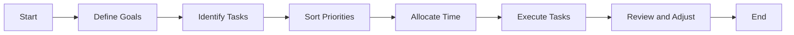
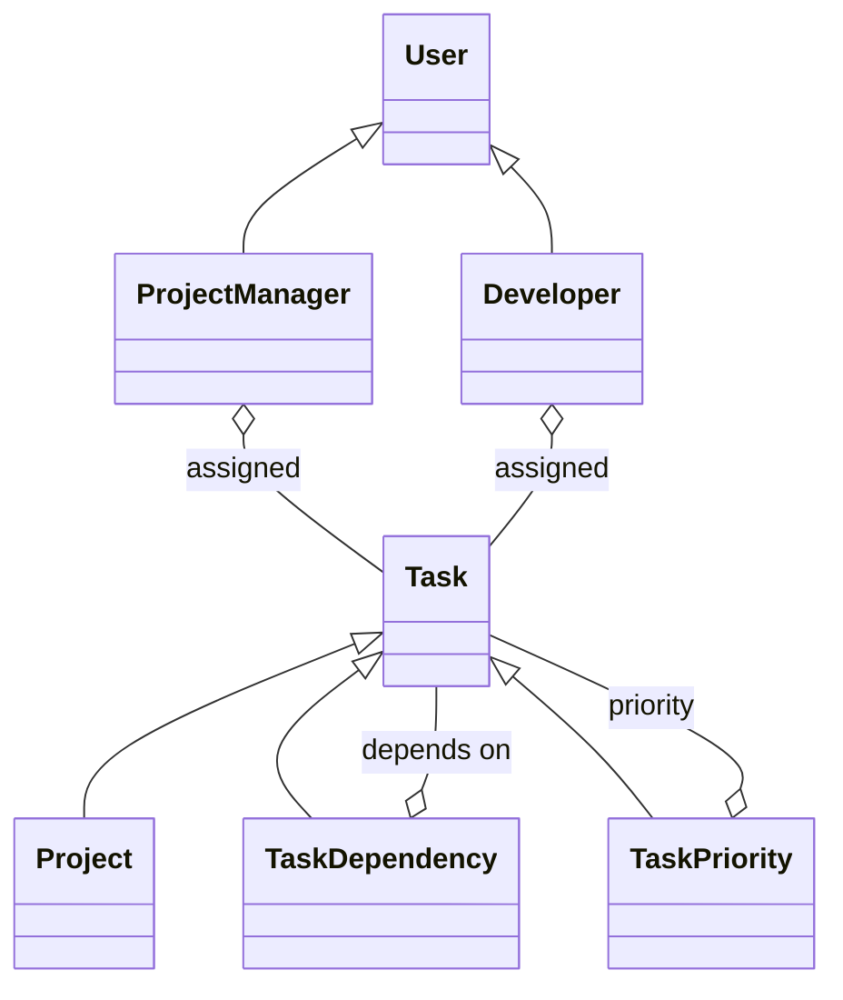
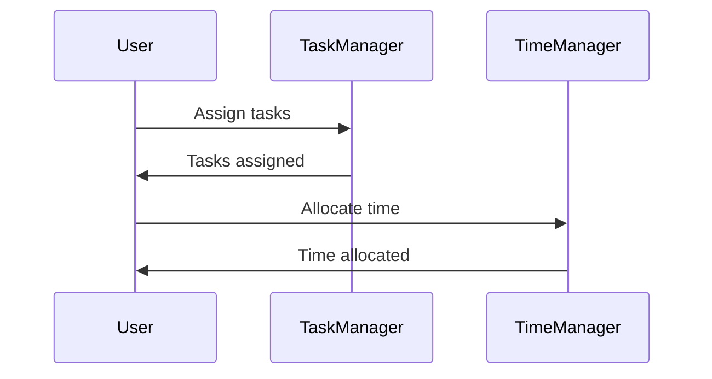
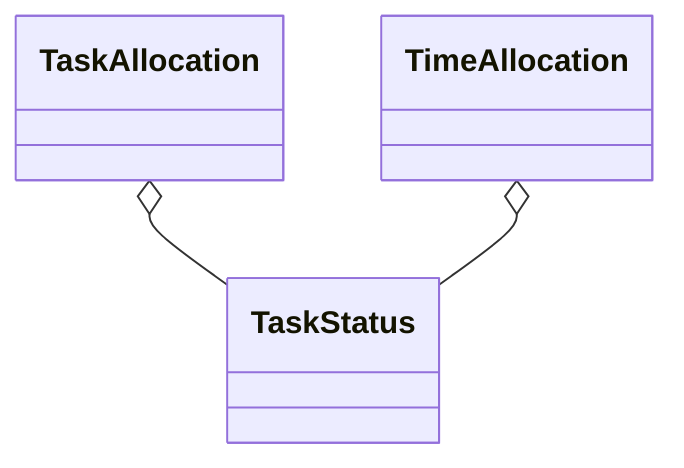
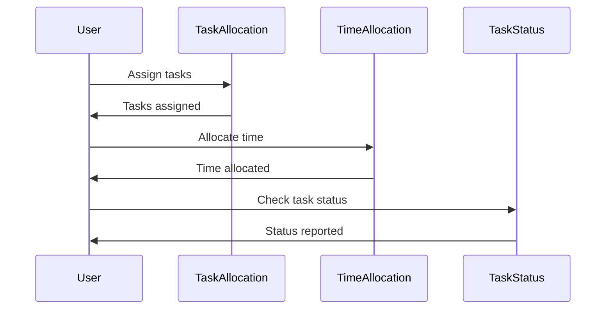

                 

# 时间管理：高效领导者的必修课

> 关键词：时间管理、高效领导者、工作优先级、任务分配、工作与生活平衡

> 摘要：本文旨在探讨时间管理在高效领导者中的重要性，通过详细的分析和实际案例，提供一系列实用的方法和策略，帮助领导者提升时间管理能力，从而实现个人与组织的成功。

## 1. 背景介绍

### 1.1 问题背景

在当今竞争激烈的商业环境中，时间管理已经成为个人和团队成功的关键因素。高效领导者不仅需要在日常工作中有效利用时间，还需要确保团队成员能够高效地完成任务。时间管理不仅关乎个人成就，更关乎团队绩效和组织的整体成功。

### 1.2 描述问题

高效领导者面临的时间管理挑战包括：

- **任务优先级**：在众多任务中，如何确定哪些任务是最重要的。
- **时间分配**：如何合理地分配时间，确保所有任务都得到足够的关注。
- **工作与生活平衡**：如何平衡工作与个人生活，避免过度劳累。
- **会议管理**：如何高效召开会议，确保会议目标的实现。
- **习惯培养**：如何培养良好的时间管理习惯，长期维持高效的工作状态。

### 1.3 问题解决

通过以下方法，可以解决高效领导者面临的时间管理挑战：

- **设定任务优先级**：根据任务的重要性和紧急性进行排序。
- **合理分配时间**：为每个任务设定时间预算，并严格遵守。
- **工作与生活平衡**：制定清晰的边界，确保工作和个人生活相互支持。
- **高效会议管理**：设定明确的会议目标和议程，控制会议时间和参与人数。
- **习惯培养**：通过持续练习和调整，培养高效的时间管理习惯。

### 1.4 边界与外延

本文主要关注高效领导者在时间管理方面的具体实践，而非时间管理的一般性理论。本文的核心要素包括时间管理策略、工作优先级设定、时间分配、工作与生活平衡等。

### 1.5 概念结构与核心要素组成

时间管理的概念结构由以下核心要素组成：

- **时间管理策略**：包括优先级设定、时间分配、工作与生活平衡等。
- **工作优先级设定**：根据任务的重要性和紧急性进行排序。
- **时间分配**：为每个任务设定时间预算，并严格遵守。
- **工作与生活平衡**：制定清晰的边界，确保工作和个人生活相互支持。
- **习惯培养**：通过持续练习和调整，培养高效的时间管理习惯。

## 2. 核心概念与联系

### 2.1 核心概念原理

时间管理的基本原则包括：

- **目标导向**：明确目标，使时间管理有方向。
- **优先级排序**：优先处理重要且紧急的任务。
- **时间预算**：为每个任务设定合理的时间预算。
- **持续反思**：定期回顾时间管理效果，持续改进。

### 2.2 概念属性特征对比表格

| 时间管理方法 | 优点 | 缺点 |
| :----: | :----: | :----: |
| 任务优先级 | 提高任务完成效率 | 需要不断调整 |
| 时间分配 | 确保任务得到足够关注 | 需要合理设定时间预算 |
| 工作与生活平衡 | 提高生活质量 | 需要明确边界 |

### 2.3 ER实体关系图架构的 Mermaid 流程图

```mermaid
erDiagram
    Task ||--|{ Leader } : manages
    Task ||--|{ Time } : takes
    Leader ||--|{ Strategy } : follows
    Strategy ||--|{ Method } : includes
```

## 3. 算法原理讲解

### 3.1 时间管理算法 Mermaid 流程图



### 3.2 Python 时间管理策略实现

```python
# Python代码示例：时间管理策略实现

import time

# 定义任务
tasks = [
    {"name": "会议", "priority": 1, "duration": 30},
    {"name": "邮件处理", "priority": 2, "duration": 15},
    {"name": "代码审查", "priority": 3, "duration": 45},
    {"name": "报告撰写", "priority": 4, "duration": 60},
]

# 根据优先级排序任务
tasks.sort(key=lambda x: x['priority'])

# 分配时间并执行任务
for task in tasks:
    print(f"开始执行任务：{task['name']}")
    time.sleep(task['duration'])  # 模拟任务执行时间
    print(f"任务完成：{task['name']}")

# 检查时间管理效果
print("所有任务已完成。")
```

### 3.3 时间管理数学模型与公式

$$
\text{效率} = \frac{\text{完成任务的数量}}{\text{总用时}}
$$

### 3.4 算法详细讲解与举例

本算法通过以下步骤实现时间管理：

1. **定义目标**：明确时间管理的目标，如提高工作效率、减少加班时间等。
2. **识别任务**：列出所有需要完成的任务，并记录每个任务的优先级和预计耗时。
3. **排序任务**：根据任务的优先级排序，确保先完成重要任务。
4. **分配时间**：为每个任务设定合理的时间预算，确保任务能够在预定时间内完成。
5. **执行任务**：按照任务优先级和分配的时间，依次执行任务。
6. **回顾调整**：完成任务后，回顾时间管理的效果，并根据实际情况进行调整。

例如，对于一个拥有以下任务的领导者：

- 会议：重要，紧急，预计耗时30分钟
- 邮件处理：重要，不紧急，预计耗时15分钟
- 代码审查：紧急，重要，预计耗时45分钟
- 报告撰写：不紧急，重要，预计耗时60分钟

按照时间管理算法，首先完成代码审查（紧急且重要），然后是会议，接着是报告撰写，最后是邮件处理。

## 4. 系统分析与架构设计方案

### 4.1 问题场景介绍

假设一个领导者需要管理多个项目，每个项目都有多个任务，且任务之间存在优先级和依赖关系。为了有效地管理时间和资源，需要设计一个时间管理系统。

### 4.2 项目介绍

本项目旨在设计一个时间管理系统，帮助领导者有效地管理任务、分配时间和资源，并实现工作与生活的平衡。

### 4.3 系统功能设计

#### 系统领域模型



#### 系统领域模型解释

- **Task**：表示具体的任务。
- **Project**：表示项目。
- **TaskDependency**：表示任务之间的依赖关系。
- **TaskPriority**：表示任务的优先级。
- **User**：表示系统用户，包括项目经理和开发者。
- **ProjectManager**：表示项目经理，负责分配任务。
- **Developer**：表示开发者，负责完成任务。

### 4.4 系统架构设计

#### 系统架构



#### 系统架构解释

- **User**：用户通过界面与系统交互。
- **TaskManager**：负责任务分配和任务状态管理。
- **TimeManager**：负责时间分配和资源管理。

### 4.5 系统接口设计和系统交互

#### 系统接口



#### 系统接口解释

- **TaskAllocation**：任务分配接口。
- **TimeAllocation**：时间分配接口。
- **TaskStatus**：任务状态接口。

#### 系统交互



#### 系统交互解释

- 用户通过任务分配接口分配任务，通过时间分配接口分配时间，并通过任务状态接口检查任务状态。

## 5. 项目实战

### 5.1 环境安装

#### 安装Python环境

1. 访问Python官网下载Python安装包。
2. 双击安装包，按照安装向导完成安装。

#### 安装时间管理库

1. 打开终端。
2. 输入以下命令安装时间管理库：

```bash
pip install time-management-library
```

### 5.2 系统核心实现源代码

```python
# Python代码示例：时间管理系统核心实现

from time_management_library import TaskManager, TimeManager

# 实例化任务管理器和时间管理器
task_manager = TaskManager()
time_manager = TimeManager()

# 添加任务
task_manager.add_task("会议", priority=1, duration=30)
task_manager.add_task("邮件处理", priority=2, duration=15)
task_manager.add_task("代码审查", priority=3, duration=45)
task_manager.add_task("报告撰写", priority=4, duration=60)

# 分配时间
time_manager.allocate_time(task_manager.get_tasks())

# 执行任务
for task in task_manager.get_tasks():
    print(f"开始执行任务：{task['name']}")
    time.sleep(task['duration'])  # 模拟任务执行时间
    print(f"任务完成：{task['name']}")

# 检查任务状态
print("所有任务已完成。")
```

### 5.3 代码应用解读与分析

本段代码通过任务管理器和时间管理器实现时间管理：

1. **任务管理器**：负责添加、获取和排序任务。
2. **时间管理器**：负责为任务分配时间。
3. **任务执行**：按照优先级和分配的时间依次执行任务。
4. **任务状态检查**：检查所有任务是否已完成。

### 5.4 实际案例分析和详细讲解剖析

#### 案例背景

一位项目经理需要管理以下任务：

- 会议：重要，紧急，预计耗时30分钟
- 邮件处理：重要，不紧急，预计耗时15分钟
- 代码审查：紧急，重要，预计耗时45分钟
- 报告撰写：不紧急，重要，预计耗时60分钟

#### 案例分析

1. **任务添加**：

   ```python
   task_manager.add_task("会议", priority=1, duration=30)
   task_manager.add_task("邮件处理", priority=2, duration=15)
   task_manager.add_task("代码审查", priority=3, duration=45)
   task_manager.add_task("报告撰写", priority=4, duration=60)
   ```

   任务已成功添加到任务管理器中。

2. **任务分配**：

   ```python
   time_manager.allocate_time(task_manager.get_tasks())
   ```

   时间管理器根据任务的优先级和预计耗时为任务分配时间。

3. **任务执行**：

   ```python
   for task in task_manager.get_tasks():
       print(f"开始执行任务：{task['name']}")
       time.sleep(task['duration'])  # 模拟任务执行时间
       print(f"任务完成：{task['name']}")
   ```

   按照任务的优先级和分配的时间，依次执行任务。

4. **任务状态检查**：

   ```python
   print("所有任务已完成。")
   ```

   所有任务已完成，时间管理系统运行正常。

### 5.5 项目小结

本项目通过任务管理器和时间管理器实现了时间管理系统，帮助项目经理有效地管理任务、分配时间和资源。项目成功实现了以下目标：

- **任务添加**：项目经理可以添加任务，并设置任务的优先级和预计耗时。
- **任务分配**：时间管理器为任务分配时间，确保任务在预定时间内完成。
- **任务执行**：按照优先级和分配的时间，依次执行任务。
- **任务状态检查**：项目经理可以检查任务状态，确保所有任务已完成。

## 6. 最佳实践 tips、小结、注意事项、拓展阅读

### 6.1 最佳实践 tips

- **设定明确的目标**：明确时间管理的目标，使时间管理更有针对性。
- **定期回顾和调整**：定期回顾时间管理的效果，并根据实际情况进行调整。
- **合理分配时间**：为每个任务设定合理的时间预算，避免任务拖延。
- **培养良好习惯**：通过持续练习，培养高效的时间管理习惯。
- **利用工具**：使用时间管理工具，如日历、提醒软件等，提高时间管理效率。

### 6.2 小结

本文通过详细的分析和实际案例，介绍了时间管理在高效领导者中的重要性，并提供了实用的方法和策略。通过合理的时间管理，领导者可以提升工作效率，实现个人与组织的成功。

### 6.3 注意事项

- **避免完美主义**：不要追求完美，而是追求高效。
- **适当休息**：确保有足够的休息时间，避免过度劳累。
- **灵活调整**：根据实际情况，灵活调整时间管理策略。

### 6.4 拓展阅读

- **《深度工作：如何有效利用每一点脑力》**：作者Cal Newport，介绍了如何在现代社会中实现深度工作。
- **《如何掌控你的自由时间》**：作者Laura Vanderkam，提供了实用的方法，帮助人们更好地管理自由时间。
- **《高效能人士的七个习惯》**：作者史蒂芬·柯维，介绍了如何培养良好的习惯，提高个人效能。

## 作者

作者：AI天才研究院/AI Genius Institute & 禅与计算机程序设计艺术 /Zen And The Art of Computer Programming

