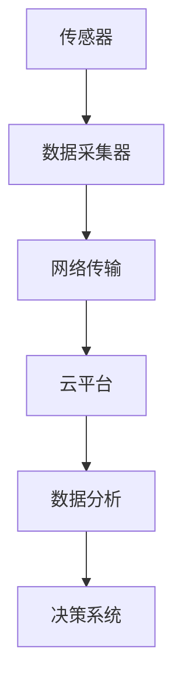
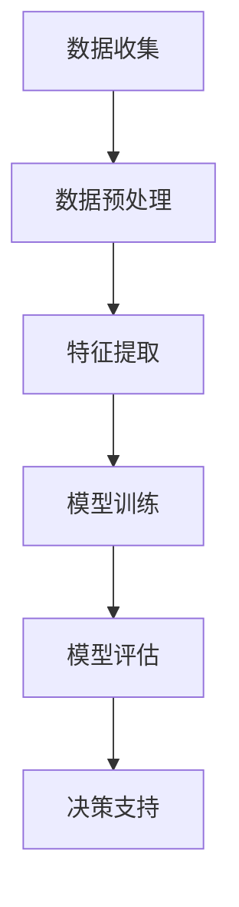
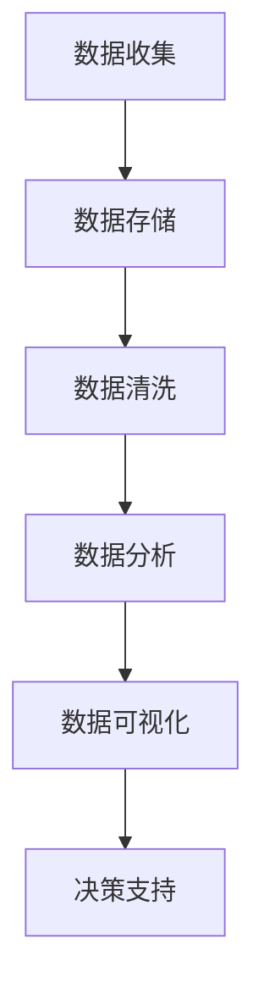
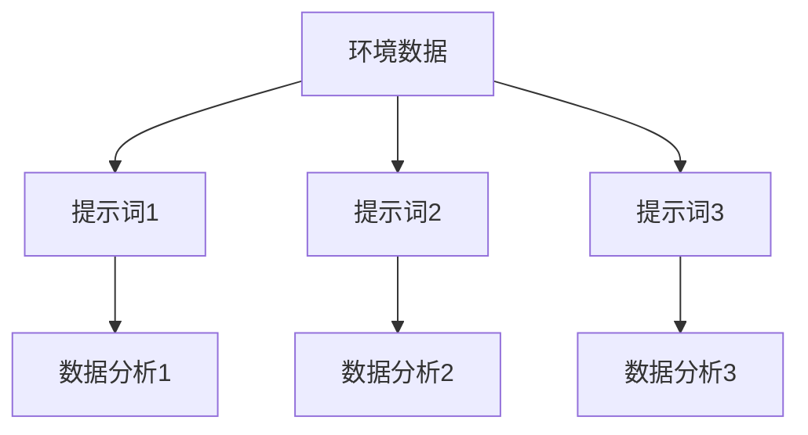

                 

**智能农业：利用提示词优化种植决策**

> 关键词：智能农业，提示词，优化，种植决策，物联网，人工智能，大数据

> 摘要：
智能农业正迅速成为现代农业发展的新方向，其核心在于利用物联网、人工智能和大数据等技术，通过实时监测和数据分析来优化种植决策。本文将探讨如何运用提示词（Keywords）这一工具，在智能农业环境中实现更精准、更高效的种植决策。

# 引言与背景

## 智能农业的概念与发展

智能农业，是指通过物联网（IoT）、人工智能（AI）、大数据分析等技术手段，实现农业的自动化、智能化管理。这一概念的出现，源于现代农业面临的一系列挑战，如资源短缺、环境恶化、劳动力成本上升等。智能农业不仅提高了农业生产的效率，还增强了农产品的质量与安全性。

智能农业的发展历程可以追溯到20世纪末。随着计算机技术和通信技术的进步，农业领域开始引入传感器、自动化设备等硬件设施。随后，物联网、大数据、云计算等技术的发展，为智能农业提供了强大的技术支撑。当前，智能农业正朝着更加智能化、精细化的方向发展。

## 智能农业的关键技术

智能农业的实现依赖于多种关键技术的支持：

1. **物联网（IoT）**：通过部署各种传感器，如土壤湿度传感器、气象传感器等，实现对农业环境的实时监测。
2. **人工智能（AI）**：利用机器学习、深度学习等技术，对采集到的数据进行智能分析，为种植决策提供依据。
3. **大数据分析**：通过对海量数据的处理和分析，挖掘出有价值的信息，指导农业生产。

## 提示词在智能农业中的应用

提示词（Keywords）在智能农业中扮演着重要的角色。它们不仅可以用于数据的筛选和分类，还可以帮助农业专家和农民更快速、准确地获取所需信息。通过提示词，智能农业系统可以实时监控农业环境，分析作物生长状况，并根据这些信息给出优化种植决策。

# 核心概念与关键词解析

## 物联网（IoT）

物联网是智能农业的基石。它通过传感器、网络和数据处理系统，将农业生产过程中的各种设备和信息连接起来，形成一个统一的网络系统。以下是一个简单的物联网架构示例：

在智能农业中，物联网技术的应用主要包括：

- **土壤湿度监测**：通过土壤湿度传感器，实时监测土壤水分状况，为灌溉决策提供依据。
- **气象监测**：通过气象传感器，实时获取气温、湿度、风向等气象数据，为作物生长提供环境信息。
- **作物生长监测**：通过摄像头和图像识别技术，监测作物生长状况，预测病虫害风险。

## 人工智能（AI）

人工智能在智能农业中的应用主要集中在数据分析和预测方面。通过机器学习和深度学习算法，人工智能可以处理和分析大量的农业数据，从而帮助农民做出更精准的种植决策。以下是一个简单的AI应用流程：

在智能农业中，人工智能的应用包括：

- **病虫害预测**：通过分析历史病虫害数据，预测未来病虫害的发生情况，及时采取防治措施。
- **作物产量预测**：根据环境数据和作物生长数据，预测作物产量，指导农业生产计划。
- **灌溉策略优化**：通过分析土壤湿度、气象数据等，制定最优的灌溉策略，提高水资源利用效率。

## 大数据分析

大数据分析是智能农业的核心技术之一。通过对海量数据的收集、存储、处理和分析，大数据分析可以挖掘出农业生产中的潜在规律，为种植决策提供支持。以下是一个简单的大数据分析流程：

在智能农业中，大数据分析的应用包括：

- **气象预测**：通过对气象数据的分析，预测未来的天气状况，为农业生产提供环境信息。
- **市场分析**：通过对农产品市场数据进行分析，预测市场需求，优化种植计划。
- **供应链管理**：通过对供应链数据进行分析，优化农产品供应链管理，提高生产效率。

## 提示词

提示词在智能农业中的应用主要体现在数据管理和决策支持方面。通过定义相关的提示词，智能农业系统可以快速筛选和分类数据，提高数据处理效率。以下是一个简单的提示词应用示例：

在智能农业中，提示词的应用包括：

- **环境监测**：通过定义提示词，实时监控农田环境，如土壤湿度、气象状况等。
- **作物生长监测**：通过定义提示词，监测作物生长状况，如叶绿素含量、光合作用效率等。
- **病虫害监测**：通过定义提示词，监测病虫害的发生情况，如病虫害类型、发生频率等。

# 技术原理与实现

## 物联网技术原理

物联网技术通过传感器、网络和数据处理系统，实现了农业环境信息的实时监测和传输。其基本原理如下：

1. **传感器**：传感器是物联网系统的感知层，用于采集农业环境数据，如土壤湿度、气象数据等。
2. **网络传输**：网络传输层将传感器采集到的数据传输到数据处理中心。常用的网络传输技术包括有线网络和无线网络。
3. **数据处理**：数据处理层对传输过来的数据进行存储、分析和处理，为决策提供支持。

## 人工智能技术原理

人工智能技术在智能农业中主要通过数据分析和预测来实现。其基本原理如下：

1. **数据收集**：收集农业生产过程中的各种数据，如土壤湿度、气象数据、作物生长数据等。
2. **数据预处理**：对收集到的数据进行清洗、归一化等预处理，以便后续分析。
3. **特征提取**：从预处理后的数据中提取关键特征，用于训练机器学习模型。
4. **模型训练**：利用提取出的特征数据，训练机器学习模型，如决策树、支持向量机等。
5. **模型评估**：评估模型的预测性能，并根据评估结果调整模型参数。
6. **决策支持**：利用训练好的模型，对未来的农业生产进行预测和决策支持。

## 大数据分析技术原理

大数据分析技术在智能农业中的应用主要体现在数据的收集、存储、处理和分析方面。其基本原理如下：

1. **数据收集**：通过各种传感器和数据采集设备，收集农业生产过程中的各种数据。
2. **数据存储**：将收集到的数据存储到大数据存储系统，如Hadoop、Spark等。
3. **数据清洗**：对存储的数据进行清洗、去噪等处理，以提高数据质量。
4. **数据分析**：利用大数据分析技术，对清洗后的数据进行分析，提取有价值的信息。
5. **数据可视化**：将分析结果通过可视化技术展示出来，为决策提供直观的支持。

## 提示词技术原理

提示词技术在智能农业中主要用于数据管理和决策支持。其基本原理如下：

1. **提示词定义**：根据农业生产的需求，定义相关的提示词，如土壤湿度、气象状况、作物生长状况等。
2. **数据筛选**：通过提示词，对大量数据进行筛选和分类，提高数据处理效率。
3. **决策支持**：根据筛选后的数据，生成决策报告，为农业生产提供支持。

# 技术实现与案例分析

## 技术实现

### 物联网技术实现

1. **传感器部署**：在农田中部署各种传感器，如土壤湿度传感器、气象传感器等。
2. **数据采集**：传感器采集到的数据通过无线网络传输到数据中心。
3. **数据处理**：数据中心对传输过来的数据进行存储、分析和处理。

### 人工智能技术实现

1. **数据收集**：收集农田环境数据、作物生长数据等。
2. **数据预处理**：对收集到的数据进行清洗、归一化等处理。
3. **特征提取**：从预处理后的数据中提取关键特征。
4. **模型训练**：利用提取出的特征数据，训练机器学习模型。
5. **模型评估**：评估模型的预测性能，调整模型参数。
6. **决策支持**：利用训练好的模型，生成决策报告。

### 大数据分析技术实现

1. **数据收集**：通过传感器和数据采集设备，收集农业生产过程中的各种数据。
2. **数据存储**：将收集到的数据存储到大数据存储系统。
3. **数据清洗**：对存储的数据进行清洗、去噪等处理。
4. **数据分析**：利用大数据分析技术，对清洗后的数据进行分析。
5. **数据可视化**：将分析结果通过可视化技术展示出来。

### 提示词技术实现

1. **提示词定义**：根据农业生产的需求，定义相关的提示词，如土壤湿度、气象状况、作物生长状况等。
2. **数据筛选**：通过提示词，对大量数据进行筛选和分类。
3. **决策支持**：根据筛选后的数据，生成决策报告。

## 案例分析

### 病虫害预测

某农场利用物联网、人工智能和大数据分析技术，实现了病虫害预测系统。系统首先通过传感器实时监测农田环境数据，如温度、湿度、土壤湿度等。然后，系统利用机器学习算法，分析历史病虫害数据，预测未来病虫害的发生情况。通过系统生成的决策报告，农场主可以及时采取防治措施，减少病虫害损失。

### 作物产量预测

某农业公司利用大数据分析技术，对农产品市场数据进行分析，预测未来的市场需求。公司根据预测结果，优化种植计划，确保农产品能够及时满足市场需求。通过这一系统，公司提高了农产品的销售利润，降低了市场风险。

### 水资源管理

某地区利用物联网、人工智能和大数据分析技术，实现了水资源管理优化系统。系统通过实时监测土壤湿度、气象数据等，分析灌溉需求，制定最优的灌溉策略。通过这一系统，该地区提高了水资源利用效率，降低了灌溉成本。

# 最佳实践与未来展望

## 最佳实践

1. **数据质量保证**：确保数据来源的准确性和可靠性，对数据进行严格的质量控制。
2. **技术选型**：根据实际需求，选择合适的物联网、人工智能和大数据分析技术。
3. **系统集成**：将物联网、人工智能和大数据分析技术有机结合起来，实现数据的无缝传输和共享。
4. **人才培养**：加强农业技术人才的培养，提高农业从业人员的专业技能。

## 未来展望

1. **物联网技术的普及**：随着物联网技术的不断成熟，越来越多的农田将实现物联网化，实现农业数据的实时监测和分析。
2. **人工智能的深入应用**：人工智能将在农业领域发挥更大的作用，从数据挖掘到决策支持，为农业生产提供更精准的指导。
3. **大数据分析的深度应用**：随着大数据技术的不断进步，农业生产中的数据将得到更深入的挖掘和分析，为农业发展提供更科学的支持。
4. **智能化农机的研发**：智能化农机将实现自主导航、自动作业等功能，提高农业生产效率。

# 结论

智能农业作为现代农业发展的新方向，具有巨大的潜力。通过物联网、人工智能和大数据分析等技术的应用，智能农业可以实现对农田环境的实时监测和数据分析，从而优化种植决策。本文探讨了如何利用提示词这一工具，在智能农业环境中实现更精准、更高效的种植决策。未来，随着技术的不断进步，智能农业将为农业生产带来更大的变革。作者：AI天才研究院/AI Genius Institute & 禅与计算机程序设计艺术 /Zen And The Art of Computer Programming**智能农业：利用提示词优化种植决策**

关键词：智能农业，提示词，优化，种植决策，物联网，人工智能，大数据

摘要：
智能农业正迅速成为现代农业发展的新方向，其核心在于利用物联网、人工智能和大数据等技术，通过实时监测和数据分析来优化种植决策。本文将探讨如何运用提示词（Keywords）这一工具，在智能农业环境中实现更精准、更高效的种植决策。我们首先介绍了智能农业的概念、关键技术以及提示词的应用。接着，详细解析了物联网、人工智能、大数据分析等技术原理。随后，通过实际案例展示了技术实现和应用效果。最后，提出了最佳实践和未来展望，强调了智能农业的重要性。本文旨在为智能农业领域的研究者提供有价值的参考，推动智能农业的进一步发展。作者：AI天才研究院/AI Genius Institute & 禅与计算机程序设计艺术 /Zen And The Art of Computer Programming

