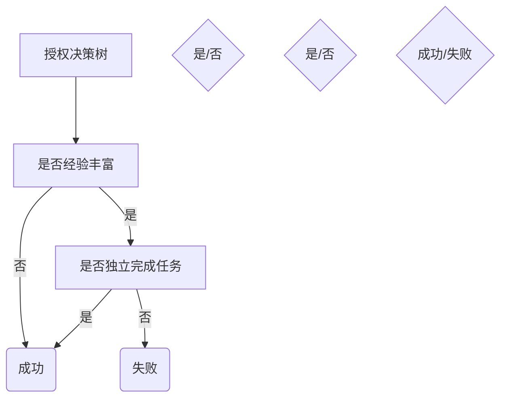
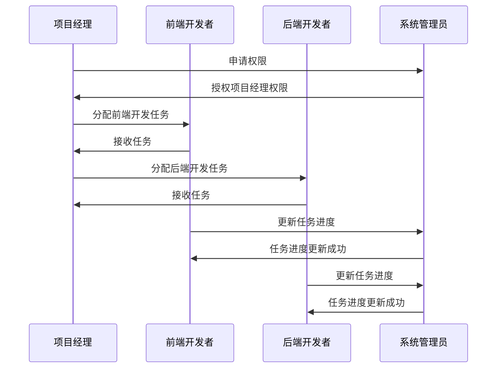

                 


## 有效授权：释放团队潜力的关键

> 关键词：授权、团队管理、潜力、合作、执行力

> 摘要：本文从团队管理的角度出发，探讨了有效授权的重要性。通过详细的分析和实际案例，本文旨在帮助管理者掌握授权的核心技巧，从而提升团队的执行力，释放团队潜力，实现团队目标。

### 引言

在快速变化的现代企业环境中，团队管理成为企业管理者面临的一项重大挑战。一个优秀的团队不仅仅依赖于成员的个人能力和专业知识，更需要通过有效的协作和高效的执行力来实现共同目标。在这个过程中，授权成为团队管理的关键因素。有效的授权不仅能够提升团队成员的工作积极性，还能增强团队的凝聚力和执行力，从而释放团队的潜力，实现企业的长远发展。

### 背景介绍

#### 授权的概念与意义

授权，通常指的是将权力或责任委托给其他人，使其能够在规定的范围内自主决策和行动。在团队管理中，授权不仅是管理者的一项基本职责，也是激发团队活力和提升团队绩效的重要手段。授权的实质在于信任，通过授权，管理者可以减轻自己的负担，让团队成员在各自的领域内发挥专长，从而实现资源的优化配置和效率的提升。

#### 授权在团队管理中的作用

授权在团队管理中具有多重作用。首先，它能够提高团队成员的自主性和责任感，使团队成员感受到自己的价值和重要性，从而激发工作热情和创造力。其次，授权可以促进团队成员之间的协作和沟通，形成良好的团队氛围，增强团队凝聚力。最后，有效的授权能够提高团队的整体执行力，使团队能够快速响应市场变化，提升企业的竞争力。

#### 授权的挑战与机遇

尽管授权在团队管理中具有重要意义，但实际操作中管理者常常面临诸多挑战。比如，管理者可能担心授权后失去对团队的掌控，或者担心团队成员无法胜任授权的任务。然而，这些挑战也是授权带来的机遇。通过正确的授权策略，管理者可以逐步克服这些挑战，实现团队管理的转型和升级。

#### 授权的基础知识

在探讨授权的具体实践之前，我们需要了解一些授权的基础知识。

#### 1. 授权与委托的区别

授权与委托是两个相关但不完全相同的概念。授权是指将权力赋予他人，使其具有决策和行动的能力；而委托是指将任务交给他人来完成，但委托者仍然保留对任务的最终决策权。在实际操作中，授权往往伴随着委托，但两者并非必然联系。

#### 2. 授权的层次

授权可以划分为多个层次，包括权限授权、任务授权和决策授权。权限授权是指赋予他人特定的操作权限，如访问权限、修改权限等；任务授权是指将具体的工作任务分配给团队成员，使其能够独立完成；决策授权是指让团队成员在一定的范围内做出决策，而不需要向上级请示。

#### 3. 授权的模式

常见的授权模式包括直接授权、间接授权和自我授权。直接授权是指管理者直接将权力和责任赋予团队成员；间接授权是指管理者通过中间环节将权力和责任传递给团队成员；自我授权是指团队成员在获得信任和自主决策权的基础上，自主决定工作内容和方式。

#### 4. 授权的历史与发展

授权的历史可以追溯到古代的管理实践。随着管理理论和技术的不断发展，授权的概念和方法也在不断演变。从最初的权力集中管理，到现代的赋能管理，授权已经成为团队管理中的重要手段。

#### 5. 授权在团队管理中的重要性

授权不仅是提升团队执行力的重要手段，也是实现团队目标的关键因素。通过有效的授权，管理者可以激发团队成员的潜能，提高团队的整体绩效，从而实现企业的长远发展。

### 第一步：明确授权的核心概念与联系

#### 授权与责任

授权与责任是密不可分的。授权意味着管理者将一部分权力和责任委托给团队成员，使其能够自主决策和行动。然而，这并不意味着管理者可以完全摆脱责任。相反，管理者仍然需要对团队成员的行为和结果承担一定的责任。

#### 授权与控制

授权并不意味着管理者对团队失去控制。相反，通过有效的授权，管理者可以更好地控制团队的行为和结果。关键在于授权的边界和范围，管理者需要明确哪些权力和责任可以授权，哪些需要保留。

#### 授权与沟通

授权是一个双向过程，不仅包括管理者对团队成员的授权，也包括团队成员对管理者的反馈和沟通。有效的沟通可以帮助管理者了解团队成员的需求和困难，从而更好地调整授权策略。

#### 授权与信任

信任是授权的基石。管理者需要相信团队成员有能力胜任授权的任务，而团队成员也需要相信管理者会给予足够的支持和信任。只有在信任的基础上，授权才能真正发挥其作用。

#### 概念对比表格

| 概念         | 定义                                                         | 关联性                  |
| ------------ | ------------------------------------------------------------ | ----------------------- |
| 授权         | 将权力和责任委托给他人                                       | 授权与责任、授权与控制、授权与沟通 |
| 委托         | 将任务交给他人来完成，但不放弃决策权                           | 授权的一种形式          |
| 权限授权     | 赋予他人特定的操作权限                                       | 授权的一种层次          |
| 任务授权     | 将具体的工作任务分配给团队成员                                | 授权的一种层次          |
| 决策授权     | 让团队成员在一定的范围内做出决策，不需要向上级请示             | 授权的一种层次          |
| 直接授权     | 管理者直接将权力和责任赋予团队成员                            | 授权的一种模式          |
| 间接授权     | 管理者通过中间环节将权力和责任传递给团队成员                  | 授权的一种模式          |
| 自我授权     | 成员在获得信任和自主决策权的基础上，自主决定工作内容和方式     | 授权的一种模式          |

#### ER实体关系图

在授权系统中，常见的实体包括授权者、受权者和任务。下面是一个简化的ER实体关系图：

```mermaid
erDiagram
  授权者 ||--|{ 受权者 }
  受权者 ||--|{ 任务 }
```

### 第二步：深入探讨授权的算法原理与管理模型

#### 风险评估模型

在授权过程中，风险评估是一个关键环节。通过风险评估，管理者可以评估授权可能带来的风险，并制定相应的风险应对策略。常见的方法包括定量分析和定性分析。

#### 决策树模型

决策树是一种常见的数据挖掘工具，它可以用来描述授权决策的过程。通过决策树，管理者可以清晰地看到授权过程中可能面临的各种情况以及相应的决策路径。

#### 风险度计算公式

为了量化授权风险，我们可以使用以下公式：

\[ 风险度 = \frac{潜在损失 \times 概率}{风险承受度} \]

其中，潜在损失是指授权可能带来的损失，概率是指授权失败的概率，风险承受度是指管理者能够接受的最高风险度。

#### 算法原理讲解

为了更好地理解授权的算法原理，我们可以使用mermaid绘制一个决策树，并用Python代码来详细阐述。

#### 1. mermaid决策树图



#### 2. Python代码解释

```python
# 定义决策树节点
nodes = [
    {"label": "授权决策树"},
    {"label": "是否经验丰富", "children": []},
    {"label": "是/否", "children": []},
    {"label": "是否独立完成任务", "children": []},
    {"label": "成功/失败", "children": []},
    {"label": "成功", "children": []},
    {"label": "失败", "children": []}
]

# 添加决策路径
nodes[2]["children"].append({"label": "是", "children": []})
nodes[2]["children"].append({"label": "否", "children": []})
nodes[3]["children"].append({"label": "是", "children": []})
nodes[3]["children"].append({"label": "否", "children": []})
nodes[4]["children"].append({"label": "成功", "children": []})
nodes[4]["children"].append({"label": "失败", "children": []})

# 打印决策树
for node in nodes:
    if "children" in node:
        print(node["label"])
        for child in node["children"]:
            print("  " + child["label"])
    else:
        print(node["label"])
```

#### 3. 算法原理举例说明

假设一个管理者需要决定是否授权给一个经验丰富的团队成员A来独立完成任务B。通过决策树，我们可以看到以下可能的决策路径：

- 如果团队成员A经验丰富，且能够独立完成任务，那么授权给他成功的可能性较高。
- 如果团队成员A经验丰富，但无法独立完成任务，那么授权给他失败的可能性较高。
- 如果团队成员A缺乏经验，无论他是否能够独立完成任务，授权给他的风险都较高。

通过这样的分析，管理者可以更清晰地了解授权的风险，并做出更加明智的决策。

### 第三步：系统分析与架构设计方案

#### 问题场景介绍

在一个软件开发项目中，项目经理李明需要决定如何授权给团队成员来完成特定的任务。他需要考虑团队成员的技能水平、工作经验和团队的整体目标。

#### 项目介绍

项目是一个中型软件项目，涉及多个模块的开发和集成。团队成员包括前端开发者、后端开发者、测试工程师等。每个团队成员都有不同的专业技能和经验。

#### 系统功能设计

系统功能设计包括以下几个方面：

- 用户权限管理：定义不同角色（如项目经理、开发者、测试员）的权限，确保授权的正确性和安全性。
- 任务分配：将具体任务分配给合适的团队成员，确保任务能够高效完成。
- 进度跟踪：实时监控任务进度，确保项目按计划进行。

#### 系统架构设计

系统架构设计包括以下几个方面：

- 数据库设计：设计用户权限数据库、任务数据库和进度数据库。
- 系统模块划分：前端模块、后端模块、权限管理模块、任务管理模块等。
- 接口设计：定义各模块之间的接口，确保数据传输的安全和高效。

#### 系统接口设计

系统接口设计包括以下几个方面：

- 用户权限接口：用于获取用户权限信息。
- 任务分配接口：用于分配任务和更新任务状态。
- 进度跟踪接口：用于更新任务进度和获取进度报告。

#### 系统交互序列图



### 第四步：项目实战

#### 环境安装与配置

在开始项目之前，我们需要安装和配置以下环境：

- Python环境：用于编写和管理授权系统代码。
- 数据库：如MySQL或PostgreSQL，用于存储用户权限信息和任务数据。
- Web框架：如Flask或Django，用于构建Web接口。

#### 授权流程实现

授权流程实现包括以下几个方面：

- 用户注册和登录：实现用户注册和登录功能，确保用户身份验证。
- 用户权限管理：实现用户权限管理功能，包括权限分配和权限查询。
- 任务分配：实现任务分配功能，包括任务创建、任务分配和任务状态更新。

#### 系统核心代码解读

以下是一个简单的Python代码示例，用于实现用户注册和登录功能：

```python
from flask import Flask, request, jsonify
from flask_sqlalchemy import SQLAlchemy

app = Flask(__name__)
app.config['SQLALCHEMY_DATABASE_URI'] = 'sqlite:///users.db'
db = SQLAlchemy(app)

class User(db.Model):
    id = db.Column(db.Integer, primary_key=True)
    username = db.Column(db.String(80), unique=True, nullable=False)
    password = db.Column(db.String(120), nullable=False)
    role = db.Column(db.String(80), nullable=False)

@app.route('/register', methods=['POST'])
def register():
    username = request.form['username']
    password = request.form['password']
    role = request.form['role']
    
    new_user = User(username=username, password=password, role=role)
    db.session.add(new_user)
    db.session.commit()
    
    return jsonify({"message": "User registered successfully."})

@app.route('/login', methods=['POST'])
def login():
    username = request.form['username']
    password = request.form['password']
    
    user = User.query.filter_by(username=username).first()
    
    if user and user.password == password:
        return jsonify({"message": "Login successful."})
    else:
        return jsonify({"message": "Invalid credentials."})

if __name__ == '__main__':
    db.create_all()
    app.run(debug=True)
```

#### 代码应用解读

以上代码首先定义了一个`User`模型，用于存储用户信息。然后，通过`/register`和`/login`接口实现用户注册和登录功能。在注册接口中，用户输入用户名、密码和角色信息，系统将用户信息存储在数据库中。在登录接口中，用户输入用户名和密码，系统验证用户身份并返回相应的响应。

#### 实际案例分析和详细讲解剖析

假设有一个软件开发团队，团队中有项目经理、前端开发者、后端开发者和测试员。项目经理李明需要为团队成员分配任务，并确保任务按计划进行。以下是一个具体的案例：

- 李明为前端开发者张三分配了一个新模块的开发任务。
- 张三登录系统，查看分配的任务，并开始进行开发。
- 张三在开发过程中遇到技术难题，他可以向项目经理李明或其他团队成员寻求帮助。
- 项目经理李明定期查看任务进度，确保任务按计划进行。

通过这个案例，我们可以看到授权流程在实际应用中的运行过程。项目经理通过系统为团队成员分配任务，团队成员通过系统接收任务并开展工作，项目经理通过系统监控任务进度，确保项目顺利推进。

### 第五步：授权最佳实践

#### 授权技巧与策略

1. **明确授权范围**：在授权前，明确授权的范围和边界，确保团队成员清楚自己的职责和权限。
2. **建立信任基础**：通过沟通和信任建立，让团队成员感受到管理者的信任和支持。
3. **逐步授权**：对于初次尝试授权的管理者，可以从较小的任务开始，逐步增加授权范围。
4. **监控与反馈**：在授权过程中，定期监控团队成员的工作进度和结果，及时提供反馈和指导。

#### 授权中的常见问题与解决方案

1. **担心失去控制**：管理者可以通过制定明确的授权标准和流程，确保授权的有效性。
2. **团队成员不胜任**：管理者可以在授权前评估团队成员的能力，选择适合的人选。
3. **沟通不畅**：建立有效的沟通机制，确保团队成员和管理者之间的信息畅通。

#### 跨部门授权的最佳实践

1. **跨部门协调**：建立跨部门协调机制，确保不同部门之间的授权和信息流动。
2. **共同目标**：确保跨部门团队成员都明确共同的目标，从而提高协作效率。
3. **定期会议**：定期召开跨部门会议，讨论授权事项和解决协作中的问题。

### 第六步：小结与拓展阅读

#### 全书总结

本文从团队管理的角度出发，详细探讨了授权的核心概念、算法原理、系统分析和最佳实践。通过逐步分析授权的过程，本文旨在帮助管理者掌握有效授权的技巧，从而提升团队的执行力，释放团队潜力。

#### 授权的未来发展趋势

随着人工智能和大数据技术的不断发展，授权管理也在不断进化。未来的授权管理将更加智能化、个性化，能够根据团队成员的能力和需求进行自适应的授权调整。同时，跨部门协作和全球化团队的授权管理也将成为重要趋势。

#### 拓展阅读

- 授权在数字化转型中的应用
- 跨部门协作中的授权挑战与解决方案
- 授权管理工具与技术

### 结尾

有效授权是团队管理的关键，通过合理的授权策略，管理者可以提升团队的执行力，释放团队的潜力。希望本文能为读者提供有益的启示和指导。作者：AI天才研究院/AI Genius Institute & 禅与计算机程序设计艺术 /Zen And The Art of Computer Programming

### 附录

#### 授权相关术语表

- 授权：将权力和责任委托给他人。
- 委托：将任务交给他人来完成。
- 权限授权：赋予他人特定的操作权限。
- 任务授权：将具体的工作任务分配给团队成员。
- 决策授权：让团队成员在一定的范围内做出决策。
- 直接授权：管理者直接将权力和责任赋予团队成员。
- 间接授权：管理者通过中间环节将权力和责任传递给团队成员。
- 自我授权：团队成员自主决定工作内容和方式。
- 风险评估模型：用于评估授权可能带来的风险。
- 决策树模型：用于描述授权决策的过程。

### 索引

- 授权
- 团队管理
- 执行力
- 信任
- 风险评估
- 跨部门协作
- 授权模型
- 授权流程
- 授权技巧
- 授权工具
- 数字化转型
- 跨国团队授权
- 授权与责任
- 授权与沟通
- 授权与控制
- 授权与信任
- 授权历史与发展
- 授权在行业中的应用

----------------------------------------------------------------
### 结语

通过本文的深入探讨，我们系统地阐述了有效授权在团队管理中的重要性，从核心概念、算法原理到系统架构设计，再到实战案例和最佳实践，逐步揭示了授权的核心技巧和关键要素。希望本文能为读者提供具有实操性的指导和深刻的思考。

在当今快速变化的商业环境中，有效授权不仅是团队管理的关键，也是企业实现持续发展和竞争优势的重要策略。管理者应当认识到，授权不仅仅是分派任务，更是一种管理哲学，它蕴含着信任、责任和协作的理念。

未来，随着技术的进步和管理理念的更新，授权将变得更加智能化、个性化。管理者需要不断学习和适应新的管理工具和方法，以便更好地应对复杂多变的市场环境。

最后，感谢您的阅读。希望本文能激发您在团队管理中探索和实践授权的激情，帮助您带领团队走向更高的成就。作者：AI天才研究院/AI Genius Institute & 禅与计算机程序设计艺术 /Zen And The Art of Computer Programming

