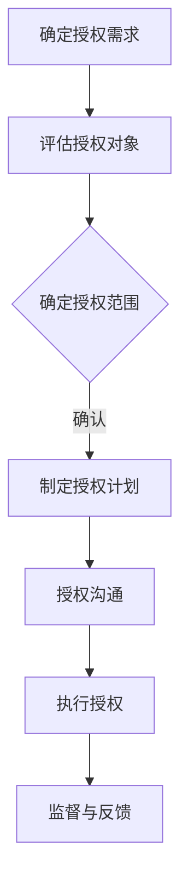

                 

### 有效授权：释放团队潜能的艺术

> 关键词：授权、团队管理、工作效率、技能培养、组织效能

> 摘要：本文将深入探讨有效授权在团队管理中的重要性，通过逻辑清晰、结构紧凑的分析，从背景介绍、核心概念、授权流程设计等多个角度，全面解析如何通过有效授权来提升团队的工作效率和成员技能水平，从而实现组织效能的全面提升。

### 目录大纲

# 有效授权：释放团队潜能的艺术

## 第一部分：理解有效授权的重要性

## 第1章：背景介绍

### 1.1 问题背景

- **问题描述**: 管理者在授权过程中面临的常见问题是什么？
- **问题解决**: 授权的有效性如何提升？
- **边界与外延**: 授权的定义、授权与委托的区别、授权的范围

### 1.2 核心概念

- **核心概念**: 有效授权、授权流程、授权原则
- **概念属性特征对比表格**

### 1.3 概念属性特征对比表格

| 概念         | 定义                                                         | 特点                                       |
| ------------ | ------------------------------------------------------------ | ------------------------------------------ |
| 有效授权     | 在正确的时间、正确的范围和正确的条件下，授权给合适的团队成员 | 提高效率、增强团队自主性、培养团队成员能力 |
| 授权流程     | 授权的过程和步骤                                             | 清晰明确、有序推进                           |
| 授权原则     | 授权过程中应遵循的基本规则                                   | 安全性、透明性、一致性                       |

### 1.4 ER实体关系图架构

```mermaid
erDiagram
  Staff -->|授权| Authorization
  Manager ||--|授权请求| Request
  Team ||--|成员| Member
```

## 第2章：核心概念与联系

### 2.1 有效授权原理

- **原理概述**: 有效授权的工作机制
- **原理详细**: 授权的核心要素、授权的过程

### 2.2 有效授权的属性特征对比表格

| 属性特征       | 描述                                                         | 对比             |
| -------------- | ------------------------------------------------------------ | --------------- |
| 明确性         | 授权内容清晰明确                                             | 透明性、模糊性   |
| 适应性         | 授权范围可调整，以适应团队需求                               | 刻板、不灵活     |
| 培养性         | 授权过程中注重培养团队成员的能力                             | 单一任务型授权   |
| 支持性         | 授权过程中给予团队成员必要的支持和资源                       | 放任自流         |

### 2.3 有效授权的ER实体关系图架构

```mermaid
erDiagram
  Manager ||--|授权| Authorization
  Team Member ||--|授权| Authorization
  Project ||--|授权| Authorization
```

## 第二部分：有效授权的流程与实践

## 第3章：授权流程设计

### 3.1 授权流程概述

- **流程步骤**: 授权的一般流程
- **流程详细**: 各步骤的具体实施方法

### 3.2 授权流程图



### 3.3 授权流程的注意事项

- **常见问题**: 授权过程中可能遇到的问题
- **解决方法**: 针对问题的解决策略

## 第4章：授权原则与实施

### 4.1 授权原则

- **原则概述**: 授权过程中应遵循的基本原则
- **原则详细**: 安全性、透明性、一致性

### 4.2 授权原则的具体实施方法

- **安全第一**: 授权内容的安全性保障
- **透明度**: 授权过程中的透明性和公开性
- **一致性**: 授权过程中的标准和规则

### 4.3 授权实施的案例分析

- **案例介绍**: 某企业授权实施的案例
- **案例解析**: 案例中的成功经验和不足之处

## 结论

- **总结**: 有效授权的重要性及其实施策略
- **未来展望**: 授权在团队管理和组织发展中的作用

---

### 第1章：背景介绍

#### 1.1 问题背景

在团队管理中，管理者常常面临如何有效授权的困境。授权不仅仅是把任务分配给团队成员，更是对团队成员信任和能力的认可。然而，许多管理者在授权过程中遇到了诸多问题，如授权过度、授权不足、授权不当等。

**问题描述**: 管理者在授权过程中主要面临以下问题：
1. 授权过度：管理者将过多的责任和权限授予团队成员，导致团队成员压力过大，无法有效承担。
2. 授权不足：管理者对团队成员的信任度不高，导致授权范围和权限过于狭窄，无法发挥团队成员的潜力。
3. 授权不当：授权的内容和范围不够明确，导致团队成员在执行任务时出现混乱和误解。

**问题解决**: 提升授权的有效性是解决上述问题的关键。通过以下方法，可以有效提升授权的有效性：
1. 明确授权范围和责任：明确授权的内容和权限，确保团队成员清楚自己的职责和责任。
2. 评估团队成员的能力：在授权前，对团队成员的能力进行评估，确保他们能够胜任所授权的任务。
3. 建立信任：通过建立良好的沟通和信任机制，让团队成员感受到管理者的支持和信任。

**边界与外延**:
1. **授权的定义**：授权是指管理者将一部分权力和责任转移给团队成员，使其能够独立完成特定任务的过程。
2. **授权与委托的区别**：授权是赋予团队成员一定的决策权和执行权，而委托则是在特定任务上给予团队成员执行权，但决策权仍然在管理者手中。
3. **授权的范围**：授权的范围可以是任务、决策、资源等多个方面，但必须明确和具体，以确保团队成员能够准确执行。

#### 1.2 核心概念

在探讨授权的重要性之前，我们需要明确一些核心概念，包括有效授权、授权流程和授权原则。

**有效授权**：有效授权是指在正确的时间、正确的范围和正确的条件下，将权力和责任授权给合适的团队成员，以提高工作效率和团队效能的过程。

**授权流程**：授权流程是指从授权需求的提出、评估、确定授权范围、制定授权计划、授权沟通到执行授权和监督反馈的整个过程。

**授权原则**：授权原则是指在授权过程中应遵循的基本规则和原则，包括安全性、透明性、一致性等。

#### 1.3 概念属性特征对比表格

| 概念         | 定义                                                         | 特点                                       |
| ------------ | ------------------------------------------------------------ | ------------------------------------------ |
| 有效授权     | 在正确的时间、正确的范围和正确的条件下，授权给合适的团队成员 | 提高效率、增强团队自主性、培养团队成员能力 |
| 授权流程     | 授权的过程和步骤                                             | 清晰明确、有序推进                           |
| 授权原则     | 授权过程中应遵循的基本规则                                   | 安全性、透明性、一致性                       |

#### 1.4 ER实体关系图架构

为了更好地理解授权的概念和关系，我们可以使用ER实体关系图来展示。

```mermaid
erDiagram
  Staff -->|授权| Authorization
  Manager ||--|授权请求| Request
  Team ||--|成员| Member
```

在这个ER图中，`Staff`代表团队成员，`Manager`代表管理者，`Authorization`代表授权关系，`Request`代表授权请求，`Team`代表团队。

### 第2章：核心概念与联系

#### 2.1 有效授权原理

**原理概述**：

有效授权是一种通过合理分配权力和责任来提高团队效率和成员自主性的管理方法。其核心原理包括：

1. **信任与责任**：管理者需要对团队成员有足够的信任，并明确他们的责任范围。
2. **透明与沟通**：授权过程应该是透明和开放的，以确保团队成员了解授权的内容和目的。
3. **适应与调整**：授权范围和权限应根据团队需求和成员能力进行动态调整。

**原理详细**：

1. **授权的核心要素**：

   - **明确性**：授权内容必须清晰明确，避免模糊和误解。
   - **适应性**：授权范围应根据团队的需求和能力进行灵活调整。
   - **培养性**：授权过程中要注重培养团队成员的能力和责任感。
   - **支持性**：授权过程中要提供必要的支持和资源，帮助团队成员完成任务。

2. **授权的过程**：

   - **需求识别**：确定哪些任务需要授权，以及哪些团队成员适合执行。
   - **能力评估**：评估团队成员的能力，确保他们能够胜任所授权的任务。
   - **授权沟通**：与管理者和团队成员进行充分的沟通，确保授权内容和责任范围的明确性。
   - **授权实施**：将授权内容正式传达给团队成员，并开始执行。
   - **监督与反馈**：对授权过程进行监督，并及时给予反馈，确保授权的有效性。

#### 2.2 有效授权的属性特征对比表格

| 属性特征       | 描述                                                         | 对比             |
| -------------- | ------------------------------------------------------------ | --------------- |
| 明确性         | 授权内容清晰明确                                             | 透明性、模糊性   |
| 适应性         | 授权范围可调整，以适应团队需求                               | 刻板、不灵活     |
| 培养性         | 授权过程中注重培养团队成员的能力                             | 单一任务型授权   |
| 支持性         | 授权过程中给予团队成员必要的支持和资源                       | 放任自流         |

**对比**：

- **明确性**：有效的授权应该具备明确性，这意味着授权的内容、范围和责任必须清晰明确，避免团队成员在执行任务时产生误解或困惑。
- **适应性**：授权的范围应该具备一定的适应性，能够根据团队的需求和成员的能力进行灵活调整，以适应不同的工作环境和任务需求。
- **培养性**：有效的授权不仅仅是将任务分配给团队成员，更是一个培养过程。管理者应该通过授权来提升团队成员的能力和责任感。
- **支持性**：在授权过程中，管理者应该提供必要的支持和资源，帮助团队成员克服困难和挑战，确保任务能够顺利完成。

#### 2.3 有效授权的ER实体关系图架构

为了更好地理解有效授权的实体关系，我们可以使用ER实体关系图来展示。

```mermaid
erDiagram
  Manager ||--|授权| Authorization
  Team Member ||--|授权| Authorization
  Project ||--|授权| Authorization
```

在这个ER图中，`Manager`代表管理者，`Team Member`代表团队成员，`Authorization`代表授权关系，`Project`代表项目。授权关系将管理者与团队成员、项目关联起来，确保授权的有效性和团队协作的顺畅。

### 第3章：授权流程设计

#### 3.1 授权流程概述

**流程步骤**：

授权流程是确保授权活动顺利进行的关键。一个完整的授权流程通常包括以下步骤：

1. **确定授权需求**：识别哪些任务需要授权，并确定授权的对象。
2. **评估授权对象**：评估团队成员的能力，确保他们适合接受授权。
3. **确定授权范围**：明确授权的内容和权限，确保团队成员了解他们的职责。
4. **制定授权计划**：制定具体的授权计划，包括授权的时间、方式、资源和预期目标。
5. **授权沟通**：与管理者和团队成员进行充分的沟通，确保授权内容的明确性。
6. **执行授权**：将授权内容正式传达给团队成员，并开始执行任务。
7. **监督与反馈**：对授权过程进行监督，并及时给予反馈，确保授权的有效性。

**流程详细**：

1. **确定授权需求**：

   在确定授权需求时，管理者需要考虑以下几个方面：

   - **任务复杂性**：对于复杂的任务，需要更多的授权和资源支持。
   - **团队成员能力**：根据团队成员的能力和经验，确定哪些任务适合授权。
   - **团队需求**：考虑团队的整体目标和需求，确保授权活动与团队目标一致。

2. **评估授权对象**：

   评估授权对象的主要目的是确保团队成员具备完成任务的能力和信心。管理者可以从以下几个方面进行评估：

   - **专业能力**：评估团队成员在相关领域的专业知识和技能。
   - **经验**：评估团队成员在类似任务上的经验和业绩。
   - **责任心**：评估团队成员的责任心和职业素养。

3. **确定授权范围**：

   授权范围是指授权的内容和权限。管理者需要明确以下内容：

   - **任务内容**：明确授权的任务内容，确保团队成员了解他们的职责。
   - **权限范围**：明确团队成员在授权任务上的权限，包括决策权、资源调配权等。
   - **责任范围**：明确团队成员在授权任务中的责任，包括成果质量、时间节点等。

4. **制定授权计划**：

   授权计划是授权活动的具体实施方案。管理者需要制定详细的授权计划，包括以下内容：

   - **授权时间**：确定授权的时间和期限，确保团队成员有足够的时间完成任务。
   - **授权方式**：确定授权的方式，包括口头授权、书面授权等。
   - **资源支持**：确定团队成员在执行授权任务时所需的资源和支持。
   - **预期目标**：明确授权任务的目标和预期成果。

5. **授权沟通**：

   授权沟通是确保授权活动顺利进行的重要环节。管理者需要与管理者和团队成员进行充分的沟通，确保以下内容：

   - **授权内容**：明确授权的内容和权限，确保团队成员了解他们的职责。
   - **责任和期望**：明确团队成员在授权任务中的责任和期望，确保团队成员有明确的目标和动力。
   - **支持和反馈**：告知团队成员在执行授权任务时可以得到的支持和反馈机制。

6. **执行授权**：

   在执行授权时，管理者需要确保以下事项：

   - **传达授权内容**：将授权内容正式传达给团队成员，确保团队成员了解他们的职责和权限。
   - **监控执行过程**：对授权任务的执行过程进行监控，确保任务按计划进行。
   - **提供必要支持**：在团队成员遇到困难时，提供必要的支持和资源。

7. **监督与反馈**：

   监督与反馈是确保授权活动有效性的关键。管理者需要以下事项：

   - **定期检查**：定期检查授权任务的进展情况，确保任务按计划进行。
   - **反馈与沟通**：及时给予团队成员反馈，沟通任务进展和存在的问题。
   - **调整授权计划**：根据实际情况调整授权计划，确保授权活动能够顺利进行。

#### 3.2 授权流程图

为了更直观地展示授权流程，我们可以使用Mermaid绘制流程图。


在这个流程图中，每个节点代表授权流程的一个步骤，箭头表示流程的顺序。通过这个流程图，我们可以清晰地了解授权流程的各个步骤和顺序。

#### 3.3 授权流程的注意事项

**常见问题**：

在授权流程中，管理者可能会遇到以下问题：

1. **授权过度**：管理者将过多的责任和权限授予团队成员，导致团队成员压力过大，无法有效承担。
2. **授权不足**：管理者对团队成员的信任度不高，导致授权范围和权限过于狭窄，无法发挥团队成员的潜力。
3. **授权不当**：授权的内容和范围不够明确，导致团队成员在执行任务时出现混乱和误解。

**解决方法**：

为了解决这些问题，管理者可以采取以下策略：

1. **明确授权范围和责任**：在授权前，明确授权的内容和权限，确保团队成员清楚自己的职责和责任。
2. **评估团队成员的能力**：在授权前，对团队成员的能力进行评估，确保他们能够胜任所授权的任务。
3. **建立信任**：通过建立良好的沟通和信任机制，让团队成员感受到管理者的支持和信任。
4. **提供必要的支持和资源**：在授权过程中，提供必要的支持和资源，帮助团队成员克服困难和挑战。

### 第4章：授权原则与实施

#### 4.1 授权原则

授权原则是确保授权活动顺利进行的基本规则。以下是有效授权应遵循的几个关键原则：

1. **安全性**：授权过程中要确保安全和风险控制，避免授权带来的潜在风险。
2. **透明性**：授权过程应该是透明和开放的，确保团队成员了解授权的内容和目的。
3. **一致性**：授权标准和规则应该一致，避免因规则不统一而导致的管理混乱。
4. **适度性**：授权的范围和权限应该是适度的，既能发挥团队成员的潜力，又不会过度增加他们的负担。

#### 4.2 授权原则的具体实施方法

**安全第一**：

在授权过程中，安全性是首要考虑的因素。以下是一些具体的安全保障措施：

1. **风险评估**：在授权前，进行详细的风险评估，识别可能的风险点，并制定相应的风险管理计划。
2. **权限控制**：根据团队成员的能力和职责，合理分配权限，避免过多的权限导致的风险。
3. **监控和审计**：对授权任务进行监控和审计，确保团队成员在执行任务时遵守安全规定。

**透明度**：

透明度是授权过程中建立信任的关键。以下是一些提高透明度的措施：

1. **沟通机制**：建立有效的沟通机制，确保团队成员和管理者之间的信息畅通。
2. **文档记录**：将授权过程和结果记录下来，确保团队成员和管理者都能够查阅。
3. **反馈机制**：建立反馈机制，定期收集团队成员的反馈，及时调整授权策略。

**一致性**：

授权的一致性是确保团队管理规范性的基础。以下是一些确保一致性的措施：

1. **制定标准**：制定统一的授权标准和流程，确保所有团队成员都按照相同的标准进行授权。
2. **培训和教育**：对团队成员和管理者进行培训，确保他们了解授权的原则和标准。
3. **监督和检查**：定期监督和检查授权活动，确保团队管理的一致性。

**适度性**：

适度的授权既能激发团队成员的积极性，又不会增加他们的负担。以下是一些实现适度性的措施：

1. **任务分解**：将复杂任务分解为若干小任务，分别授权给不同的团队成员。
2. **能力评估**：根据团队成员的能力和经验，合理分配任务和权限。
3. **反馈和调整**：根据团队成员的反馈和任务完成情况，及时调整授权的范围和权限。

#### 4.3 授权实施的案例分析

**案例介绍**：

某大型企业在进行项目开发时，采用了有效的授权策略，取得了显著的效果。以下是对该案例的详细介绍。

**案例解析**：

1. **背景**：

   该企业在进行一个大型项目开发时，意识到传统的集中管理模式无法满足项目的快速推进和灵活性要求。因此，企业决定采用授权模式，以提高团队的工作效率和项目成功率。

2. **实施过程**：

   - **确定授权需求**：企业识别出项目中需要授权的任务，并确定合适的授权对象。
   - **评估授权对象**：企业对团队成员进行了详细的能力评估，确保他们能够胜任所授权的任务。
   - **制定授权计划**：企业制定了详细的授权计划，包括授权时间、方式、资源和预期目标。
   - **授权沟通**：企业与管理者和团队成员进行了充分的沟通，确保授权内容的明确性。
   - **执行授权**：企业将授权内容正式传达给团队成员，并开始执行任务。
   - **监督与反馈**：企业对授权任务进行了监控和反馈，确保任务按计划进行。

3. **成功经验**：

   - **提高工作效率**：通过授权，团队成员能够独立完成任务，减少了等待和管理者的介入时间，大大提高了工作效率。
   - **培养团队成员**：授权过程中，团队成员得到了锻炼和成长，提高了技能水平和工作能力。
   - **提升团队凝聚力**：授权模式增强了团队成员之间的信任和合作，提高了团队的凝聚力。

4. **不足之处**：

   - **沟通不足**：在授权过程中，某些团队成员对授权内容和责任范围不够明确，导致执行过程中出现了一些误解和问题。
   - **监督不力**：部分授权任务在执行过程中缺乏有效的监督，导致部分任务进度和质量受到影响。

**总结**：

通过这个案例，我们可以看到有效授权对团队管理和项目成功的重要性。成功的授权不仅提高了工作效率，还培养了团队成员的能力和责任感，但同时也需要注重沟通和监督，以确保授权活动的顺利进行。

### 结论

有效授权是团队管理中的重要环节，它能够提高工作效率、培养团队成员的能力，并增强团队的凝聚力。通过理解授权的核心概念、遵循授权原则和设计合理的授权流程，管理者可以有效地释放团队的潜能，实现组织效能的全面提升。未来，随着团队管理理念的不断完善和技术的进步，有效授权将在组织发展中发挥更加重要的作用。

### 未来展望

随着数字化和信息化的快速发展，团队管理面临着前所未有的挑战和机遇。未来，有效授权将在以下几个方面发挥重要作用：

1. **人工智能与授权**：人工智能技术可以帮助管理者更准确地评估团队成员的能力，优化授权流程，提高授权的精准度和效率。
2. **远程工作与授权**：远程工作的普及要求授权模式更加灵活和高效。管理者需要通过技术手段确保远程团队成员之间的沟通和协作，实现有效授权。
3. **持续学习与授权**：随着知识的快速更新，团队成员需要不断学习和提升能力。管理者可以通过授权促进团队成员的持续学习，提升团队的整体竞争力。
4. **跨部门协作与授权**：在复杂的组织架构中，跨部门协作越来越重要。通过有效的授权，可以促进不同部门之间的沟通和合作，实现资源的共享和优势互补。

总之，有效授权不仅是提升团队工作效率的重要手段，也是实现组织发展的关键策略。随着技术的进步和管理理念的更新，有效授权将在团队管理和组织发展中发挥越来越重要的作用。管理者需要不断学习和探索，以适应未来团队管理的新趋势。

