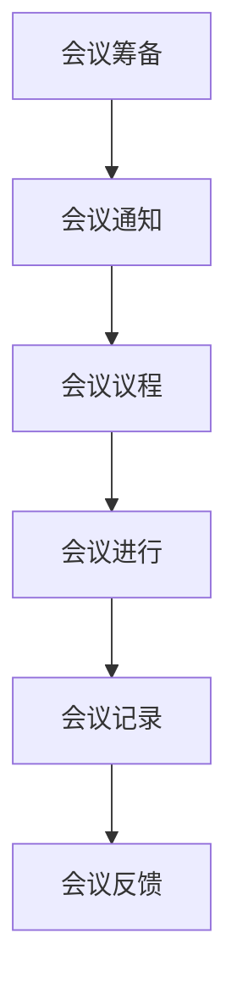
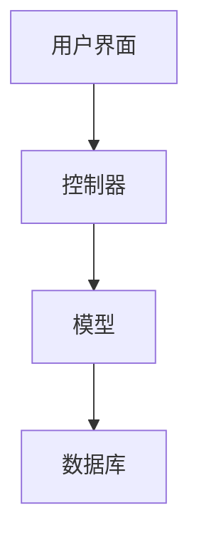
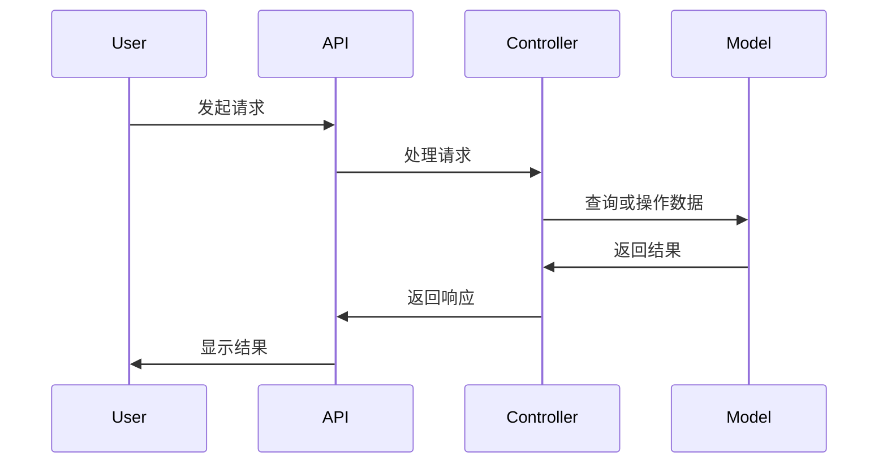

                 


# 有效的团队会议管理技巧

关键词：团队会议管理、时间管理、沟通技巧、协作效率、项目管理

摘要：本文深入探讨了有效的团队会议管理技巧，包括基础知识、算法原理、系统分析与架构设计、实战项目以及最佳实践。通过详细的讲解和案例分析，帮助读者掌握团队会议管理的核心要素，提高会议效率，促进团队合作，实现项目管理目标。

## 第一部分：团队会议管理的基础知识

### 第1章：团队会议管理的背景与重要性

#### 1.1 问题的背景与描述

在现代企业和组织中，团队会议是日常运营的重要组成部分。然而，不合理的会议安排和糟糕的会议管理往往导致时间浪费、效率低下和员工疲劳。为了解决这一问题，我们需要深入了解团队会议管理的背景和重要性。

#### 1.2 团队会议管理的目标

团队会议管理的目标主要包括提高会议效率、确保信息传递准确、促进团队成员之间的协作、提高项目完成质量等。通过有效的团队会议管理，我们可以实现这些目标，从而提升整个团队的绩效。

#### 1.3 团队会议管理的边界与外延

团队会议管理涉及多个方面，包括会议类型、参与者、目的等。了解这些边界与外延有助于我们更好地进行会议管理，确保会议达到预期效果。

#### 1.4 核心概念

##### 1.4.1 会议的类型

会议类型包括日常会议、项目会议、培训会议等。每种类型的会议都有其特定的目的和参与人员。

##### 1.4.2 会议的参与者

会议参与者包括项目经理、团队成员、外部合作伙伴等。了解参与者的角色和职责有助于提高会议效率。

##### 1.4.3 会议的目的

会议目的包括沟通信息、解决问题、决策制定等。明确会议目的有助于确保会议内容聚焦，避免跑题。

#### 1.5 概念结构

##### 1.5.1 会议管理的基本原则

会议管理的基本原则包括提前准备、明确目标、合理安排时间、有效沟通等。

##### 1.5.2 会议管理的要素

会议管理的要素包括会议议程、会议记录、会议反馈等。这些要素有助于确保会议顺利进行，提高会议效果。

## 第二部分：团队会议的算法原理与数学模型

### 第2章：团队会议的算法原理讲解

#### 2.1 算法mermaid流程图

以下是一个简单的团队会议流程图，展示了会议前、会议中和会议后的关键步骤：



#### 2.2 Python源代码详细阐述

以下是一个简单的Python脚本，用于生成会议通知和记录：

```python
import datetime

def send_notification(meeting_date, meeting_time, agenda):
    notification = f"会议通知：\n日期：{meeting_date}\n时间：{meeting_time}\n议程：{agenda}"
    print(notification)

def record_meeting(date, time, attendees, agenda, issues):
    record = f"日期：{date}\n时间：{time}\n参与者：{attendees}\n议程：{agenda}\n问题：{issues}"
    print(record)

# 示例
send_notification("2022-10-01", "14:00", "项目进展讨论")
record_meeting("2022-10-01", "14:00", ["张三", "李四", "王五"], "项目进展讨论", "需求变更")

```

#### 2.3 算法原理的数学模型和公式

在团队会议管理中，我们可以使用一些数学模型和公式来评估会议效果和效率。以下是一个简单的例子：

##### 2.3.1 公式一

会议效率 = (会议目标实现率 × 100%) / 会议时间

##### 2.3.2 公式二

会议时间优化率 = (理想会议时间 - 实际会议时间) / 理想会议时间 × 100%

#### 2.4 举例说明

假设一个会议原定于2小时，实际进行了3小时，会议目标实现率为80%，我们可以使用以上公式计算会议效率和会议时间优化率：

会议效率 = (80% × 100%) / 3小时 = 26.67%

会议时间优化率 = (2小时 - 3小时) / 2小时 × 100% = -50%

## 第三部分：团队会议的系统分析与架构设计

### 第3章：系统分析与架构设计方案

#### 3.1 问题场景介绍

在一个大型软件项目中，团队需要定期召开会议来讨论项目进展、解决问题和制定决策。然而，由于缺乏有效的会议管理，项目进度受到影响，团队成员感到压力巨大。

#### 3.2 项目介绍

本项目旨在设计一个基于Python的团队会议管理系统，用于协助团队成员进行会议筹备、记录和反馈。该系统将提高会议效率，降低团队成员的工作压力，从而提升项目整体进度。

#### 3.3 系统功能设计

系统功能设计主要包括会议通知、会议记录、会议反馈等模块。以下是一个简单的领域模型类图：

```mermaid
classDiagram
    MeetingNotification <<interface>>
    MeetingRecord <<interface>>
    MeetingFeedback <<interface>>

    MeetingNotification|--|> MeetingRecord
    MeetingNotification|--|> MeetingFeedback
    MeetingRecord|--|> MeetingFeedback
```

#### 3.4 系统架构设计

系统架构采用MVC（模型-视图-控制器）模式，其中：

- 模型（Model）：负责处理数据存储和业务逻辑；
- 视图（View）：负责展示用户界面；
- 控制器（Controller）：负责接收用户输入，调用模型和视图进行处理。

以下是一个简单的系统架构图：



#### 3.5 系统接口设计

系统接口设计主要包括RESTful API，用于实现会议通知、会议记录和会议反馈的增删改查功能。以下是一个简单的系统接口序列图：



## 第四部分：团队会议的实战项目

### 第4章：团队会议的实战项目

#### 5.1 环境安装

在开始项目之前，我们需要安装Python环境以及相关的库，如SQLite、Flask等。

```bash
pip install flask
pip install flask_sqlalchemy
```

#### 5.2 系统核心实现源代码

以下是一个简单的会议管理系统核心实现：

```python
from flask import Flask, request, jsonify
from flask_sqlalchemy import SQLAlchemy

app = Flask(__name__)
app.config['SQLALCHEMY_DATABASE_URI'] = 'sqlite:///meetings.db'
db = SQLAlchemy(app)

class MeetingNotification(db.Model):
    id = db.Column(db.Integer, primary_key=True)
    date = db.Column(db.Date, nullable=False)
    time = db.Column(db.Time, nullable=False)
    agenda = db.Column(db.Text, nullable=False)

class MeetingRecord(db.Model):
    id = db.Column(db.Integer, primary_key=True)
    date = db.Column(db.Date, nullable=False)
    time = db.Column(db.Time, nullable=False)
    attendees = db.Column(db.Text, nullable=False)
    agenda = db.Column(db.Text, nullable=False)
    issues = db.Column(db.Text, nullable=False)

@app.route('/notifications', methods=['POST'])
def create_notification():
    data = request.get_json()
    notification = MeetingNotification(
        date=data['date'],
        time=data['time'],
        agenda=data['agenda']
    )
    db.session.add(notification)
    db.session.commit()
    return jsonify({'message': 'Notification created successfully.'})

@app.route('/records', methods=['POST'])
def create_record():
    data = request.get_json()
    record = MeetingRecord(
        date=data['date'],
        time=data['time'],
        attendees=data['attendees'],
        agenda=data['agenda'],
        issues=data['issues']
    )
    db.session.add(record)
    db.session.commit()
    return jsonify({'message': 'Record created successfully.'})

if __name__ == '__main__':
    db.create_all()
    app.run(debug=True)
```

#### 5.3 代码应用解读与分析

在这个项目中，我们使用了Flask框架构建了一个简单的API服务。通过定义两个模型`MeetingNotification`和`MeetingRecord`，分别用于处理会议通知和会议记录的数据存储。在API接口中，我们实现了创建会议通知和会议记录的功能。

#### 5.4 实际案例分析和详细讲解剖析

在实际应用中，我们可以通过API接口发起请求，创建会议通知和会议记录。以下是一个实际案例：

```json
POST /notifications
{
  "date": "2022-10-01",
  "time": "14:00",
  "agenda": "项目进展讨论"
}

响应：
{
  "message": "Notification created successfully."
}
```

通过这个案例，我们可以看到如何通过API创建一个会议通知。类似地，我们可以创建会议记录：

```json
POST /records
{
  "date": "2022-10-01",
  "time": "14:00",
  "attendees": "张三、李四、王五",
  "agenda": "项目进展讨论",
  "issues": "需求变更"
}

响应：
{
  "message": "Record created successfully."
}
```

#### 5.5 项目小结

通过本项目的实现，我们构建了一个简单的团队会议管理系统，用于协助团队成员进行会议通知和记录。虽然这是一个简单的示例，但通过实际案例的分析，我们可以看到如何利用Python和Flask框架实现团队会议管理的核心功能。在实际项目中，我们可以根据需求进一步扩展和优化系统功能。

## 第五部分：团队会议管理的最佳实践与小结

### 第6章：最佳实践Tips

#### 6.1 提高会议效率的技巧

1. 提前通知会议议程和参会人员；
2. 确定会议目标和时间限制；
3. 会议中保持专注，避免跑题；
4. 会议后及时总结和反馈。

#### 6.2 避免会议疲劳的策略

1. 合理安排会议时间，避免连续长时间开会；
2. 提供舒适的会议环境，确保会议设施齐全；
3. 会议前进行热身活动，缓解紧张情绪；
4. 鼓励参会人员在会议中积极参与，避免被动听。

#### 6.3 促进团队合作的方法

1. 建立良好的沟通机制，鼓励团队成员畅所欲言；
2. 分享项目进展和成果，增强团队凝聚力；
3. 设定共同的目标和愿景，激发团队动力；
4. 定期组织团建活动，增进团队成员之间的了解。

### 第7章：小结与注意事项

#### 7.1 团队会议管理的要点回顾

1. 明确会议目标和议程；
2. 提前通知和准备；
3. 保持会议高效有序；
4. 会议后及时总结和反馈。

#### 7.2 注意事项

1. 避免会议过于频繁或时间过长；
2. 确保会议内容聚焦，避免跑题；
3. 充分利用会议记录和反馈，优化后续会议；
4. 建立良好的会议文化和氛围。

#### 7.3 拓展阅读

1. 《有效的沟通技巧》；
2. 《项目管理：系统方法和实践技巧》；
3. 《团队协作与领导力》。

## 作者信息

作者：AI天才研究院/AI Genius Institute & 禅与计算机程序设计艺术 /Zen And The Art of Computer Programming

以上是针对“有效的团队会议管理技巧”这一主题的详细技术博客文章，涵盖了团队会议管理的基础知识、算法原理、系统分析与架构设计、实战项目以及最佳实践等内容。通过本文的阅读，读者可以深入了解团队会议管理的核心要素和方法，提高会议效率，促进团队合作，实现项目管理目标。

