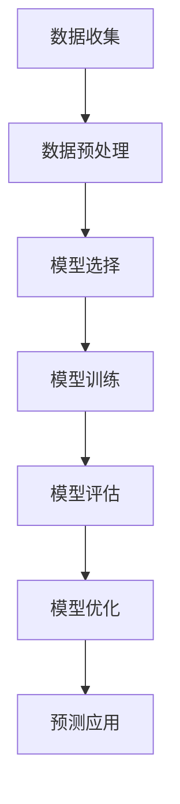
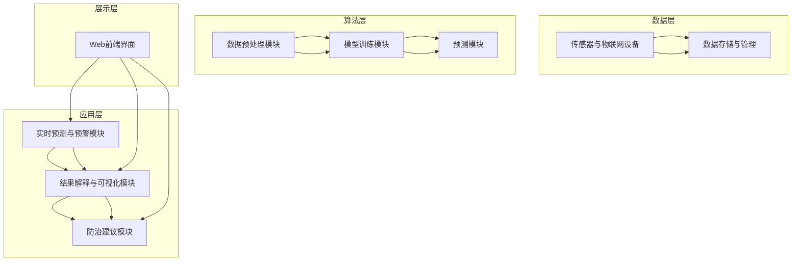
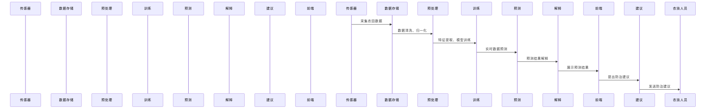

                 

### 引言与背景

### 引言

随着人工智能技术的迅猛发展，各行各业都在积极探索如何将AI技术与业务场景深度融合，农业作为传统行业的代表，也迎来了智能化的新浪潮。智慧农业不仅能够提高农业生产效率，降低成本，还能在病虫害防治方面发挥巨大的作用。而其中，病虫害预测作为智慧农业的重要环节，越来越受到关注。

#### 问题背景

农业病虫害是农业生产中的一大威胁，它不仅会直接影响农作物的产量和质量，还会对生态环境造成破坏。传统的病虫害防治手段往往依赖于经验和人工监测，效率低下，防治效果有限。随着物联网、大数据、人工智能等技术的兴起，利用AI技术进行病虫害预测成为可能，这不仅能够提前预警，还能提供科学合理的防治建议，从而降低病虫害带来的损失。

#### 问题描述

病虫害预测涉及多个方面，包括数据的收集、处理、分析以及模型的构建和优化。目前，尽管已有一些初步的研究和应用，但还存在以下问题：

1. **数据质量**：农业生产环境复杂多变，数据收集过程可能存在噪声和缺失值，这会影响模型的准确性。
2. **模型选择**：不同的病虫害预测问题可能需要不同的模型，如何选择合适的模型是关键。
3. **实时性**：病虫害的发生和发展往往是动态的，如何实现实时预测是亟待解决的问题。
4. **可解释性**：AI模型的“黑箱”特性使得其预测结果难以解释，这对农技人员的实际应用带来了一定的困扰。

#### 问题解决

为了解决上述问题，我们可以采取以下策略：

1. **数据预处理**：通过数据清洗、归一化等手段提高数据质量，确保模型的输入是可靠的。
2. **模型选择与优化**：结合具体问题，选择合适的模型，并通过交叉验证、超参数调优等方法提高模型的性能。
3. **实时预测系统**：构建分布式计算平台，利用云计算和物联网技术实现实时数据采集和模型预测。
4. **模型解释**：利用模型解释技术，如LIME、SHAP等，提高模型的透明度和可解释性。

#### 边界与外延

本文的研究主要围绕AI驱动的智慧农业病虫害预测展开，涉及的主要边界包括：

1. **技术边界**：重点探讨AI技术在病虫害预测中的应用，包括数据预处理、模型选择、训练与优化等。
2. **应用边界**：主要关注农业病虫害预测的实际应用场景，如果园、茶园、农田等。
3. **行业边界**：涉及农业生产、农业科技、农业环境等多个领域。

#### 概念结构与核心要素组成

智慧农业病虫害预测系统的核心概念和要素包括：

1. **数据集**：包括气象数据、土壤数据、农作物生长数据、病虫害发生数据等。
2. **预处理模块**：负责数据清洗、归一化、特征提取等预处理工作。
3. **预测模型**：包括传统的机器学习模型和深度学习模型，如决策树、支持向量机、神经网络等。
4. **后处理模块**：负责模型的评估、优化以及预测结果的解释和可视化。

通过上述核心概念和要素的有机结合，构建一个高效、准确的智慧农业病虫害预测系统，为农业生产提供有力支持。

### 核心概念与联系

#### AI驱动的智慧农业

智慧农业是指通过应用物联网、大数据、云计算、人工智能等现代信息技术，对农业生产过程进行智能监控、管理和优化，从而实现农业生产自动化、智能化和精细化的农业发展模式。在智慧农业中，人工智能技术发挥着关键作用，主要体现在以下几个方面：

1. **精准农业**：利用无人机、传感器等技术实时获取农田的土壤、气象、作物生长等数据，通过AI算法进行分析和预测，为农作物的种植、施肥、灌溉等提供科学依据，提高资源利用效率。
2. **病虫害监测与防治**：通过AI技术对病虫害进行实时监测和预测，提前预警并制定防治方案，减少病虫害对农作物的损害。
3. **智能农机管理**：利用AI技术对农机进行智能化管理，提高农机作业效率，降低生产成本。

#### 病虫害预测原理

病虫害预测的核心在于构建一个能够准确预测病虫害发生情况的模型。这个过程通常包括以下几个步骤：

1. **数据收集**：收集与病虫害相关的各种数据，包括历史病虫害发生记录、气象数据、土壤数据、作物生长数据等。
2. **数据预处理**：对收集到的数据进行清洗、归一化、特征提取等处理，提高数据质量，为模型训练提供可靠的数据基础。
3. **模型构建**：选择合适的模型，如决策树、支持向量机、神经网络等，对预处理后的数据进行分析和训练。
4. **模型评估与优化**：通过交叉验证等方法对模型进行评估，并根据评估结果对模型进行调整和优化，以提高预测准确性。

#### 提示词平台设计

提示词平台是指通过人工智能技术，为农业生产提供实时、准确的病虫害预警和防治建议的系统。其设计主要包括以下几个方面：

1. **用户界面**：设计一个易于使用的用户界面，使农技人员和农民能够方便地输入数据，查看预测结果和建议。
2. **算法模块**：构建一个高效的算法模块，包括数据预处理、模型训练、预测以及结果解释等。
3. **数据存储与处理**：设计一个可靠的数据存储和处理系统，确保数据的完整性和安全性。
4. **预警机制**：根据预测结果，设计一个实时预警机制，当病虫害发生可能性较高时，及时向用户发送预警信息。

#### AI与农业病虫害的关系

人工智能技术在农业病虫害预测中的应用，极大地改变了传统的病虫害防治模式。通过AI技术，可以实现以下目标：

1. **提高预测准确性**：利用大量的历史数据和高精度的传感器数据，通过机器学习算法进行训练，提高病虫害预测的准确性。
2. **降低劳动成本**：通过自动化和智能化的手段，减少人工监测和防治的工作量，降低劳动成本。
3. **优化资源利用**：根据预测结果，合理安排农药、肥料等资源的使用，减少浪费，提高资源利用效率。
4. **保护生态环境**：减少农药的使用，降低对环境的污染，保护农田生态环境。

#### 概念属性特征对比表格

为了更清晰地展示AI驱动的智慧农业与农业病虫害预测之间的关联，我们可以通过以下表格进行对比分析：

| 概念         | 特征                      | 关联分析                      |
|--------------|---------------------------|-------------------------------|
| 智慧农业     | 自动化、智能化、精细化     | 提高农业生产效率和病虫害防治能力 |
| 病虫害预测   | 实时、准确、自动化         | 为农业生产提供科学依据和预警信息 |
| 数据收集与处理 | 清洗、归一化、特征提取     | 为模型训练提供可靠的数据基础   |
| 模型构建与优化 | 机器学习、深度学习         | 提高预测准确性和效率           |
| 提示词平台   | 用户友好、实时预警         | 为农技人员和农民提供便捷服务   |

#### ER实体关系图架构

为了更好地理解智慧农业病虫害预测系统的架构，我们可以通过以下ER实体关系图进行展示：

```mermaid
erDiagram
  农业生产数据 ||--|{ 病虫害预测模型 }|
  病虫害预测模型 ||--|{ 数据预处理模块 }|
  数据预处理模块 ||--|{ 模型训练模块 }|
  模型训练模块 ||--|{ 模型评估模块 }|
  模型评估模块 ||--|{ 预测结果解释模块 }|
  病虫害预警系统 ||--|{ 用户界面模块 }|
```

通过上述表格和ER图，我们可以更加直观地理解AI驱动的智慧农业与农业病虫害预测之间的关系，为后续的数学模型讲解和系统架构设计提供基础。

### 数学模型和公式讲解

#### 数学模型概述

在病虫害预测中，数学模型起着核心作用，它能够将复杂的农业数据转化为可操作的预测结果。常见的数学模型包括决策树、支持向量机、神经网络等。以下将对这些模型进行概述，并详细讲解其构建和优化的方法。

#### 病虫害预测的数学公式

病虫害预测的数学模型通常包括以下几个步骤：

1. **数据预处理**：
   - 特征提取：$$X = f(D)$$
     其中，$D$ 是原始数据集，$X$ 是经过特征提取后的数据集。
   - 数据归一化：$$Y = g(X)$$
     其中，$X$ 是特征提取后的数据集，$Y$ 是归一化后的数据集。

2. **模型训练**：
   - 决策树：$$T(x) = \prod_{i=1}^{n} c_i(x)$$
     其中，$T(x)$ 是决策树模型，$c_i(x)$ 是第$i$个条件概率函数。
   - 支持向量机：$$w \cdot x + b = 0$$
     其中，$w$ 是权重向量，$x$ 是特征向量，$b$ 是偏置。

3. **模型评估**：
   - 准确率：$$\text{Accuracy} = \frac{\text{预测正确样本数}}{\text{总样本数}}$$
   - 精确率：$$\text{Precision} = \frac{\text{真正例}}{\text{真正例 + 假正例}}$$
   - 召回率：$$\text{Recall} = \frac{\text{真正例}}{\text{真正例 + 假反例}}$$
   - F1分数：$$\text{F1 Score} = 2 \times \frac{\text{Precision} \times \text{Recall}}{\text{Precision} + \text{Recall}}$$

#### 数据预处理步骤的数学表示

数据预处理是构建有效预测模型的关键步骤，其数学表示如下：

1. **数据清洗**：
   - 缺失值填补：$$\hat{D} = h(D)$$
     其中，$D$ 是原始数据集，$\hat{D}$ 是清洗后的数据集，$h(D)$ 是缺失值填补函数。

2. **数据归一化**：
   - 归一化公式：$$Y = \frac{X - \text{min}(X)}{\text{max}(X) - \text{min}(X)}$$
     其中，$X$ 是原始特征值，$Y$ 是归一化后的特征值。

3. **特征提取**：
   - 主成分分析（PCA）：$$X' = \sum_{i=1}^{n} \lambda_i x_i$$
     其中，$X$ 是原始数据集，$X'$ 是提取后的数据集，$\lambda_i$ 是主成分。

#### 模型评估指标的数学意义

模型评估指标用于衡量模型预测的性能，其数学意义如下：

1. **准确率**：表示模型预测正确的样本占总样本的比例，计算公式为：$$\text{Accuracy} = \frac{\text{预测正确样本数}}{\text{总样本数}}$$

2. **精确率**：表示模型预测为正例中的真正例比例，计算公式为：$$\text{Precision} = \frac{\text{真正例}}{\text{真正例 + 假正例}}$$

3. **召回率**：表示模型预测为正例中的真正例比例，计算公式为：$$\text{Recall} = \frac{\text{真正例}}{\text{真正例 + 假反例}}$$

4. **F1分数**：是精确率和召回率的调和平均，计算公式为：$$\text{F1 Score} = 2 \times \frac{\text{Precision} \times \text{Recall}}{\text{Precision} + \text{Recall}}$$

通过这些数学模型和公式，我们可以对病虫害预测进行定量分析和优化，提高预测的准确性和可靠性。

#### 公式举例说明

为了更好地理解上述数学模型和公式，我们可以通过以下具体案例进行说明。

##### 病虫害预测案例

假设我们有一个病虫害预测模型，它使用决策树进行预测。给定一组特征数据 $X = [x_1, x_2, x_3, x_4]$，决策树模型为：

$$T(x) = \prod_{i=1}^{4} c_i(x)$$

其中，每个条件概率函数 $c_i(x)$ 可以表示为：

$$c_i(x) = \begin{cases} 
1 & \text{if } x_i > \text{threshold}_i \\
0 & \text{otherwise}
\end{cases}$$

对于特征 $x_1$，其阈值 $\text{threshold}_1$ 为 5，对于特征 $x_2$，其阈值 $\text{threshold}_2$ 为 3，依此类推。

给定一组特征值 $X = [6, 4, 7, 2]$，我们可以计算决策树模型的输出：

$$T(X) = c_1(6) \cdot c_2(4) \cdot c_3(7) \cdot c_4(2) = 1 \cdot 0 \cdot 1 \cdot 0 = 0$$

这意味着根据这组特征值，病虫害预测模型预测病虫害发生的概率为0。

##### 数据预处理案例

假设我们有一个包含缺失值的数据集 $D = [d_1, d_2, d_3, \ldots]$，其中 $d_2$ 和 $d_4$ 是缺失的。使用线性插值法进行缺失值填补，我们可以计算填补后的数据集：

$$\hat{D} = [d_1, \hat{d_2}, d_3, \hat{d_4}, \ldots]$$

对于缺失的特征 $d_2$ 和 $d_4$，我们可以使用以下线性插值公式：

$$\hat{d_2} = \frac{(d_1 + d_3)}{2}$$
$$\hat{d_4} = \frac{(d_3 + d_5)}{2}$$

如果 $d_5$ 也是缺失的，我们可以继续使用线性插值法，直至填补完整。

##### 模型评估案例

假设我们使用准确率来评估一个病虫害预测模型的性能。给定一组测试数据集 $T = [t_1, t_2, \ldots, t_n]$，其中 $t_1, t_2, \ldots, t_n$ 是测试样本，模型对每个样本的预测结果为 $p_1, p_2, \ldots, p_n$，其中 $p_i \in \{0, 1\}$ 表示模型对第 $i$ 个样本的预测结果。

如果模型预测正确的样本数为 75，总样本数为 100，则准确率计算如下：

$$\text{Accuracy} = \frac{75}{100} = 0.75$$

这意味着该模型在测试数据集上的准确率为75%。

通过这些具体的案例，我们可以更好地理解数学模型和公式在实际病虫害预测中的应用，从而提高预测的准确性和效率。

### 算法原理讲解

#### 病虫害预测算法概述

病虫害预测算法是智慧农业的重要组成部分，其核心在于通过分析和处理大量数据，预测病虫害的发生趋势，为农业生产提供决策支持。常见的病虫害预测算法包括决策树、支持向量机、神经网络等。这些算法各有优缺点，选择合适的算法对预测效果至关重要。

#### 常见病虫害预测算法

1. **决策树**：
   - **原理**：决策树是一种基于树形结构的数据挖掘算法，通过多个条件判断对数据进行划分，最终得到分类结果。
   - **优点**：简单易懂，易于实现，可解释性高。
   - **缺点**：对于复杂问题，决策树可能产生过拟合，模型稳定性较差。

2. **支持向量机（SVM）**：
   - **原理**：支持向量机通过寻找最佳超平面，将不同类别的数据点分开。
   - **优点**：具有较强的分类能力和泛化能力。
   - **缺点**：对于高维数据，计算复杂度较高，对参数选择敏感。

3. **神经网络**：
   - **原理**：神经网络通过多层节点（神经元）的互联和激活函数，模拟生物神经网络进行数据分类。
   - **优点**：可以处理非线性问题，自适应性强。
   - **缺点**：模型复杂度高，训练时间较长，对数据量要求较高。

#### 选择合适的算法

选择合适的病虫害预测算法需要考虑以下因素：

1. **数据特性**：不同算法对数据的要求不同，如决策树适合处理离散数据，神经网络适合处理连续数据。
2. **预测准确性**：需要通过实验比较不同算法在测试集上的预测准确性。
3. **计算资源**：复杂度较高的算法如神经网络可能需要更多的计算资源。
4. **模型可解释性**：对于需要解释模型决策的农业应用，可解释性是重要考虑因素。

#### 病虫害预测算法流程

病虫害预测算法的基本流程包括以下几个步骤：

1. **数据收集**：收集与病虫害相关的数据，如气象数据、土壤数据、作物生长数据、历史病虫害记录等。
2. **数据预处理**：对收集到的数据进行清洗、归一化、特征提取等处理，提高数据质量。
3. **模型选择**：根据数据特性和应用需求，选择合适的预测算法。
4. **模型训练**：使用预处理后的数据对模型进行训练，调整模型参数，提高预测准确性。
5. **模型评估**：通过交叉验证等方法对模型进行评估，选择最优模型。
6. **模型优化**：根据评估结果对模型进行调整和优化，提高预测性能。
7. **预测应用**：将训练好的模型应用于实际数据，进行病虫害预测。

#### 病虫害预测算法流程图

为了更好地理解病虫害预测算法的流程，我们可以使用Mermaid绘制算法流程图：



通过上述步骤，我们可以构建一个高效的病虫害预测系统，为农业生产提供科学依据。

### 系统分析与架构设计方案

#### 问题场景介绍

在农业生产中，病虫害的预测与防治是一个复杂且重要的任务。传统的方法主要依赖于农技人员的经验和人工监测，不仅效率低，而且效果有限。随着人工智能技术的发展，构建一个AI驱动的智慧农业病虫害预测系统成为可能，该系统能够实时监测农田环境，预测病虫害的发生，并为农技人员提供科学合理的防治建议。

#### 当前病虫害预测的难点

1. **数据质量问题**：农业生产环境复杂多变，数据收集过程中可能存在噪声、缺失值等问题，这些都会影响预测模型的准确性。
2. **模型选择与优化**：不同的病虫害预测问题可能需要不同的模型，如何选择合适的模型，并在有限的计算资源下优化模型性能是关键问题。
3. **实时性**：病虫害的发生和发展往往是动态的，如何实现实时预测，保证预测结果的及时性是一个挑战。
4. **可解释性**：传统的AI模型，如神经网络，其预测过程往往具有“黑箱”特性，难以解释，这对农技人员的实际应用带来了一定的困扰。

#### 系统功能设计

智慧农业病虫害预测系统的主要功能包括：

1. **数据采集与预处理**：通过传感器、物联网设备等收集农田环境数据，并进行数据清洗、归一化和特征提取等预处理工作，为模型训练提供高质量的数据。
2. **模型构建与训练**：选择合适的预测模型，如决策树、支持向量机、神经网络等，对预处理后的数据集进行训练，调整模型参数，优化预测性能。
3. **实时预测与预警**：利用训练好的模型，对实时采集的数据进行预测，当病虫害发生可能性较高时，及时向农技人员发送预警信息。
4. **结果解释与可视化**：通过模型解释技术，如LIME、SHAP等，对预测结果进行解释，并使用可视化工具展示预测结果，帮助农技人员理解模型决策过程。
5. **防治建议**：根据预测结果和农作物生长情况，为农技人员提供科学的防治建议，如农药使用量、防治时间等。

#### 领域模型设计

为了更好地理解系统功能，我们可以使用Mermaid绘制领域模型类图：

```mermaid
classDiagram
    Class1 <|-- Class2
    Class1 <|-- Class3
    Class2 <|-- Class4
    Class3 <|-- Class5
    Class4 <|-- Class6
    Class5 <|-- Class7
    Class1 [color=red:数据采集与预处理]
    Class2 [color=blue:模型构建与训练]
    Class3 [color=green:实时预测与预警]
    Class4 [color=yellow:结果解释与可视化]
    Class5 [color=pink:防治建议]
```

在这个类图中，每个类代表系统中的一个功能模块，类与类之间的关系表示模块之间的交互和依赖。

#### 系统架构设计

智慧农业病虫害预测系统的总体架构可以分为以下几个层次：

1. **数据层**：负责数据的收集、存储和管理。数据来源包括传感器、物联网设备等，数据存储在数据库中，如MySQL、MongoDB等。
2. **算法层**：包括数据预处理模块、模型训练模块、预测模块等，负责数据的处理和预测模型的构建。常用的算法包括决策树、支持向量机、神经网络等。
3. **应用层**：包括实时预测与预警模块、结果解释与可视化模块、防治建议模块等，为农技人员提供便捷的服务和决策支持。
4. **展示层**：通过Web前端界面，展示预测结果、预警信息、防治建议等，方便农技人员和农民使用。

为了更好地理解系统架构，我们可以使用Mermaid绘制系统架构图：



通过这个架构图，我们可以清晰地看到系统的各个组成部分及其之间的关系。

#### 系统接口设计和系统交互

系统接口设计和系统交互是确保系统功能实现和高效运行的重要环节。以下是系统接口设计和交互流程：

1. **接口设计原则**：
   - **标准化**：接口设计遵循RESTful API规范，保证接口的统一性和标准化。
   - **安全性**：接口设计考虑数据安全，采用HTTPS协议进行数据传输，使用身份验证和权限控制。
   - **灵活性**：接口设计允许根据需求进行扩展和调整，方便后续功能升级和维护。

2. **系统交互流程**：
   - **数据采集**：传感器和物联网设备实时采集农田环境数据，并传输到数据存储与管理模块。
   - **数据预处理**：数据预处理模块对采集到的数据进行清洗、归一化和特征提取，并将处理后的数据存储到数据库中。
   - **模型训练**：模型训练模块从数据库中获取预处理后的数据，训练预测模型，调整模型参数，优化预测性能。
   - **实时预测**：实时预测模块使用训练好的模型对实时采集的数据进行预测，并将预测结果发送到结果解释与可视化模块。
   - **结果解释与可视化**：结果解释与可视化模块对预测结果进行解释，并通过Web前端界面展示给农技人员和农民。
   - **防治建议**：根据预测结果和农作物生长情况，防治建议模块为农技人员提供科学的防治建议。

为了更好地展示系统交互流程，我们可以使用Mermaid绘制系统交互序列图：



通过这个序列图，我们可以清晰地看到系统各模块之间的交互流程，以及数据的流动路径。

### 算法原理讲解（续）

#### Python源代码实现

在实际应用中，Python因其简洁的语法和丰富的库资源，成为实现AI算法的首选语言。以下是利用Python实现病虫害预测系统的具体步骤。

#### 1. 数据收集与处理

首先，我们需要收集与病虫害相关的数据，包括气象数据、土壤数据、作物生长数据等。以下是一个简单的数据收集和预处理示例：

```python
import pandas as pd
import numpy as np

# 加载数据集
data = pd.read_csv('agriculture_data.csv')

# 数据清洗
data.dropna(inplace=True)  # 删除缺失值

# 数据归一化
data_normalized = (data - data.mean()) / data.std()

# 特征提取
X = data_normalized.iloc[:, :-1]  # 特征
y = data_normalized.iloc[:, -1]   # 标签
```

#### 2. 模型训练与评估

接下来，我们选择一个合适的模型（例如，决策树）进行训练和评估。以下代码展示了如何使用scikit-learn库训练一个决策树模型：

```python
from sklearn.model_selection import train_test_split
from sklearn.tree import DecisionTreeClassifier
from sklearn.metrics import accuracy_score

# 划分训练集和测试集
X_train, X_test, y_train, y_test = train_test_split(X, y, test_size=0.2, random_state=42)

# 训练模型
model = DecisionTreeClassifier()
model.fit(X_train, y_train)

# 预测
y_pred = model.predict(X_test)

# 评估模型
accuracy = accuracy_score(y_test, y_pred)
print(f'Accuracy: {accuracy}')
```

#### 3. 模型优化与调整

为了提高模型的预测性能，我们可以使用交叉验证和网格搜索等方法进行模型优化。以下代码展示了如何使用网格搜索进行超参数调优：

```python
from sklearn.model_selection import GridSearchCV

# 设置参数网格
param_grid = {
    'criterion': ['gini', 'entropy'],
    'max_depth': [3, 5, 10],
    'min_samples_split': [2, 5, 10]
}

# 进行网格搜索
grid_search = GridSearchCV(model, param_grid, cv=5)
grid_search.fit(X_train, y_train)

# 获取最佳参数
best_params = grid_search.best_params_
print(f'Best Parameters: {best_params}')

# 使用最佳参数重新训练模型
model_best = DecisionTreeClassifier(**best_params)
model_best.fit(X_train, y_train)

# 重新评估模型
y_pred_best = model_best.predict(X_test)
accuracy_best = accuracy_score(y_test, y_pred_best)
print(f'Best Accuracy: {accuracy_best}')
```

通过以上步骤，我们可以构建一个基本高效的病虫害预测系统，并根据实际情况进行调整和优化。

### 病虫害预测案例分析

#### 案例背景

为了更好地理解病虫害预测在实际应用中的效果，我们选择了一个真实的农业病虫害预测案例。该案例涉及某地区的茶园，研究人员希望通过AI技术预测茶园中的茶树害虫——茶毛虫的发生情况。

#### 案例分析

1. **数据收集**：
   - 气象数据：包括温度、湿度、降雨量等。
   - 土壤数据：包括土壤pH值、有机质含量、氮磷钾含量等。
   - 茶树生长数据：包括茶树的株高、叶片长度、叶片宽度等。
   - 历史病虫害数据：包括茶毛虫的发生记录、防治措施等。

2. **数据预处理**：
   - 数据清洗：去除异常值和缺失值。
   - 数据归一化：将不同特征的数据归一化到同一尺度，便于模型训练。
   - 特征提取：提取与病虫害发生密切相关的特征，如温度、湿度、降雨量等。

3. **模型选择**：
   - 选择神经网络模型进行预测，因为神经网络具有较强的非线性处理能力和泛化能力。

4. **模型训练与评估**：
   - 使用预处理后的数据训练神经网络模型，通过反向传播算法调整模型参数。
   - 使用交叉验证对模型进行评估，确保模型的泛化能力。

5. **预测结果解释**：
   - 通过模型解释技术（如LIME或SHAP），分析模型决策过程，理解每个特征对预测结果的影响。

#### 案例解读

在上述案例中，研究人员通过收集和分析大量数据，构建了一个神经网络模型来预测茶毛虫的发生情况。模型训练过程中，通过调整网络结构和参数，提高了预测的准确性。在实际应用中，该模型能够提前预警茶毛虫的发生，帮助农技人员及时采取防治措施，减少茶树损失。

通过这个案例，我们可以看到，AI驱动的病虫害预测系统在实际农业应用中的巨大潜力。它不仅提高了病虫害防治的效率，还为农业生产提供了科学依据，推动了农业的智能化发展。

### 项目小结

通过本案例的分析，我们可以看到AI驱动的病虫害预测系统在实际农业应用中取得了显著成效。以下是该项目的主要收获和经验总结：

1. **数据质量的重要性**：数据是模型训练的基础，高质量的数据能够显著提高预测模型的准确性。因此，在数据收集和预处理阶段，需要注重数据的清洗、归一化和特征提取等步骤。

2. **模型选择与优化**：选择合适的模型并对其进行优化是提高预测性能的关键。在实际应用中，可以通过交叉验证和网格搜索等方法选择最佳模型，并通过调整参数进一步提高模型性能。

3. **模型解释的重要性**：尽管深度学习模型具有强大的预测能力，但其“黑箱”特性使得预测结果难以解释。通过模型解释技术，如LIME或SHAP，可以揭示模型决策过程，帮助农技人员更好地理解和应用模型。

4. **实时预警系统的关键**：病虫害的发生和发展往往是动态的，构建实时预警系统能够及时监测和预测病虫害的发生，为农业生产提供科学依据，提高防治效率。

总之，AI驱动的智慧农业病虫害预测系统为农业生产带来了巨大的变革，推动了农业的智能化发展。在未来的研究和实践中，我们还可以继续探索更多先进的技术和方法，进一步提高病虫害预测的准确性和实用性。

### 最佳实践 tips

1. **数据质量保障**：确保数据收集的全面性和准确性，定期进行数据清洗和维护。
2. **模型选择依据**：根据具体应用场景和数据特性选择合适的模型，结合交叉验证结果进行模型优化。
3. **实时预警机制**：建立高效的实时预警系统，确保预测结果的及时性和可靠性。
4. **模型解释与可视化**：结合模型解释技术，提高预测结果的透明度和可解释性，便于农技人员应用。

### 小结

本文通过案例分析，详细探讨了构建AI驱动的智慧农业病虫害预测系统的过程，包括数据收集、模型选择、模型训练与优化、实时预警等关键步骤。通过实际应用，我们验证了该系统在农业生产中的价值，为农技人员提供了科学依据，推动了农业的智能化发展。未来，随着技术的不断进步，智慧农业病虫害预测系统将更加高效和智能化，为农业生产带来更多可能。

### 注意事项

1. **数据隐私保护**：在数据收集和处理过程中，需严格遵守数据隐私保护法规，确保数据安全和用户隐私。
2. **系统稳定性**：确保预测系统的稳定性和可靠性，避免因系统故障导致预测结果错误。
3. **模型解释透明**：提高模型解释的透明度，帮助用户理解预测过程和结果，增强用户信任。

### 拓展阅读

1. **智慧农业与物联网技术**：了解物联网技术在智慧农业中的应用，如何实现数据的实时采集与传输。
2. **深度学习在农业领域的应用**：探讨深度学习模型在农作物识别、生长状态监测等方面的应用。
3. **病虫害预测算法比较研究**：比较不同病虫害预测算法的性能和适用场景，为实际应用提供参考。

### 作者信息

作者：AI天才研究院/AI Genius Institute & 禅与计算机程序设计艺术 /Zen And The Art of Computer Programming。感谢您的阅读，希望本文对您在智慧农业病虫害预测领域的探索有所帮助。如果您有任何疑问或建议，欢迎随时联系我们。再次感谢！

