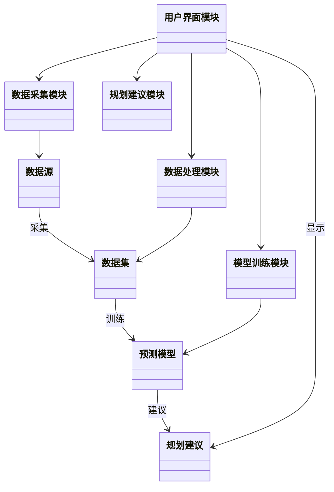
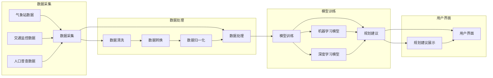

                 

# 构建AI驱动的智慧城市规划提示词系统

> 关键词：智慧城市，人工智能，提示词系统，城市规划，算法设计

> 摘要：本文将探讨如何构建AI驱动的智慧城市规划提示词系统，分析其在智慧城市规划中的应用价值，并详细阐述系统的架构设计、核心算法原理和实际应用案例。

----------------------------------------------------------------

## 第一部分：背景介绍

### 1.1 问题背景

#### 1.1.1 智慧城市规划的发展现状

智慧城市规划作为城市规划发展的新方向，正逐步从传统规划模式转向智能化、精细化和动态化。随着人工智能、大数据和物联网等新兴技术的不断进步，智慧城市规划得到了迅速发展。目前，许多城市已经开始尝试将人工智能技术应用于城市规划中，如交通流量优化、环境监测、公共安全等方面。

然而，当前智慧城市规划仍存在一些问题和挑战。首先，数据资源不足，城市规划所需的数据种类繁多，包括气象、交通、人口、经济等各个方面，而这些数据的获取和整合过程复杂且耗时。其次，技术手段单一，虽然人工智能技术可以解决许多复杂问题，但城市规划涉及的问题多样化，需要多种技术手段相互结合，才能实现更精准的规划。最后，城市规划决策效率低下，传统的城市规划过程往往需要大量人工参与，决策周期长，容易受到主观因素的影响。

#### 1.1.2 问题描述

智慧城市规划面临的挑战主要集中在以下几个方面：

- **数据资源不足**：城市规划所需的数据种类繁多，但现有数据资源不足以支持全面的智慧城市规划。
- **技术手段单一**：虽然人工智能技术可以解决许多复杂问题，但单一的技术手段难以应对城市规划的多样性需求。
- **城市规划决策效率低下**：传统的城市规划过程需要大量人工参与，决策周期长，容易受到主观因素的影响。

### 1.2 AI驱动的智慧城市规划的优势

利用人工智能技术，可以有效地解决上述问题。首先，人工智能技术可以实现对海量数据的快速处理和分析，提高城市规划的精度和效率。其次，人工智能技术可以结合多种技术手段，如大数据、物联网、地理信息系统等，为城市规划提供更全面的技术支持。最后，人工智能技术可以实现个性化、智能化的城市规划方案，更好地满足不同区域、不同人群的需求。

### 1.3 构建AI驱动的智慧城市规划提示词系统的目的

本书旨在介绍如何构建一个AI驱动的智慧城市规划提示词系统，通过该系统能够有效地解决智慧城市规划中的问题，提高城市规划的效率和质量。具体目标包括：

- **提高数据获取和处理能力**：通过构建数据采集和处理模块，实现多源数据的整合和分析。
- **优化技术手段**：结合多种人工智能技术，为城市规划提供全面的技术支持。
- **提升决策效率**：通过智能化的规划方案生成和提示词推荐，缩短城市规划的决策周期。

### 1.4 系统架构设计

AI驱动的智慧城市规划提示词系统的架构设计主要包括以下环节：

- **数据采集与处理**：包括数据源接入、数据清洗、数据预处理等。
- **模型训练与优化**：利用机器学习和深度学习算法，对数据进行分析和训练，优化模型性能。
- **系统部署与运行**：将训练好的模型部署到服务器上，实现实时运行和部署。

### 1.5 边界与外延

#### 1.5.1 智慧城市规划的范围

智慧城市规划不仅包括城市规划的各个方面，如交通、环境、人口等，还包括城市治理、城市安全、城市经济等多个领域。

#### 1.5.2 AI技术的应用场景

AI技术在智慧城市规划中的应用场景非常广泛，包括数据采集、数据处理、模型训练、决策支持等环节。

### 1.6 概念结构与核心要素组成

智慧城市规划中的核心概念包括智慧城市、城市规划、人工智能等。AI驱动的智慧城市规划提示词系统的核心要素包括数据源、模型训练、系统接口、用户界面等。

----------------------------------------------------------------

## 第二部分：核心概念与联系

### 2.1 智慧城市规划

#### 2.1.1 定义

智慧城市规划是指通过利用现代信息技术，特别是人工智能、大数据、物联网等技术，对城市进行智能化、动态化、精细化的管理和规划，以实现城市可持续发展和提高居民生活质量。

#### 2.1.2 特点

- **智能化**：利用人工智能技术实现城市规划的自动化和智能化。
- **动态化**：根据城市的发展变化实时调整规划方案。
- **精细化**：对城市各个方面进行深入分析，实现精确规划。

### 2.2 人工智能

#### 2.2.1 定义

人工智能是指计算机系统模拟人类智能行为的科学技术，包括学习、推理、知识表示、问题解决等多个方面。

#### 2.2.2 分类

- **机器学习**：通过数据训练模型，实现自我学习和优化。
- **深度学习**：一种特殊的机器学习方法，通过多层神经网络实现复杂的函数映射。
- **自然语言处理**：使计算机能够理解、生成和处理自然语言。

### 2.3 AI驱动的智慧城市规划提示词系统

#### 2.3.1 定义

AI驱动的智慧城市规划提示词系统是一种基于人工智能技术的系统，能够根据城市数据生成合适的规划建议，辅助城市规划师进行决策。

#### 2.3.2 结构

AI驱动的智慧城市规划提示词系统的结构主要包括以下几个部分：

- **数据采集**：收集城市规划所需的各种数据。
- **数据处理**：对数据进行清洗、预处理，提取有用的信息。
- **模型训练**：利用机器学习算法训练模型，使其能够识别城市规划中的问题并提出建议。
- **系统接口**：提供用户界面，供城市规划师使用。
- **用户界面**：展示系统生成的规划建议，供用户参考。

### 2.4 关联分析

#### 2.4.1 智慧城市规划与人工智能

智慧城市规划与人工智能技术有着密切的联系。人工智能技术为智慧城市规划提供了强大的技术支持，包括数据采集、数据分析、模型训练、决策支持等。

#### 2.4.2 提示词系统与城市规划

AI驱动的智慧城市规划提示词系统通过分析城市数据，生成相应的规划建议，为城市规划师提供决策支持。提示词系统不仅能够提高城市规划的效率，还能够实现个性化、智能化的城市规划。

#### 2.4.3 人工智能与提示词系统

人工智能技术在提示词系统中的应用主要包括机器学习、深度学习和自然语言处理。这些技术可以帮助系统从海量数据中提取有价值的信息，生成高质量的规划建议。

----------------------------------------------------------------

## 3.1 算法原理讲解

### 3.1.1 数据预处理算法

在构建AI驱动的智慧城市规划提示词系统时，数据预处理是一个关键步骤。数据预处理主要包括数据清洗、数据转换和数据归一化等。

#### 3.1.1.1 数据清洗

数据清洗是指识别和纠正数据集中的错误、异常和重复数据。具体方法包括：

- **删除重复数据**：使用哈希表或索引结构进行快速查找和删除。
- **填补缺失值**：使用均值、中位数、众数等方法进行填补。
- **处理异常值**：使用统计学方法（如IQR法）或机器学习算法（如K-均值聚类）检测和纠正。

#### 3.1.1.2 数据转换

数据转换是将不同类型的数据转换为同一类型的处理过程。常见的数据转换方法包括：

- **数据类型转换**：将字符串类型的数据转换为数值类型。
- **数据规范化**：将不同数据范围的数据转换为同一范围。
- **数据标准化**：将不同数据分布的数据转换为同一分布。

#### 3.1.1.3 数据归一化

数据归一化是将数据转换为相同的尺度，以便于后续分析。常见的数据归一化方法包括：

- **最小-最大归一化**：将数据映射到[0, 1]区间。
- **z-score归一化**：将数据映射到均值和标准差的范围内。
- **对数归一化**：将数据映射到对数尺度。

### 3.1.2 模型训练算法

在数据预处理完成后，接下来需要对模型进行训练。模型训练是AI驱动的智慧城市规划提示词系统的核心环节。常见的模型训练算法包括：

- **线性回归**：通过最小化误差平方和来训练模型。
- **逻辑回归**：通过最大化似然函数来训练模型。
- **决策树**：通过递归划分特征空间来训练模型。
- **随机森林**：通过构建多个决策树，并利用投票机制来预测结果。
- **支持向量机**：通过最大化分类间隔来训练模型。

#### 3.1.2.1 线性回归

线性回归是一种简单的统计模型，用于预测连续值变量。其基本原理是通过找到一个线性关系来预测目标变量。

- **公式**：$$y = \beta_0 + \beta_1 \cdot x$$
- **解释**：其中，$y$ 是预测值，$x$ 是自变量，$\beta_0$ 和 $\beta_1$ 是模型的参数。

#### 3.1.2.2 逻辑回归

逻辑回归是一种用于分类问题的统计模型，其基本原理是通过找到一个线性关系来预测概率值。

- **公式**：$$\log\frac{P(Y=1)}{1-P(Y=1)} = \beta_0 + \beta_1 \cdot x$$
- **解释**：其中，$P(Y=1)$ 是目标变量为1的概率，$\beta_0$ 和 $\beta_1$ 是模型的参数。

#### 3.1.2.3 决策树

决策树是一种基于树形结构进行决策的模型，其基本原理是通过一系列的测试来划分数据集。

- **公式**：$$tree = \sum_{i=1}^{n} \beta_i \cdot X_i$$
- **解释**：其中，$tree$ 是决策树，$X_i$ 是特征，$\beta_i$ 是权重。

#### 3.1.2.4 随机森林

随机森林是一种基于决策树的集成学习方法，其基本原理是通过构建多个决策树，并利用投票机制来预测结果。

- **公式**：$$\hat{y} = \sum_{i=1}^{n} \hat{y}_i$$
- **解释**：其中，$\hat{y}$ 是预测结果，$\hat{y}_i$ 是第$i$棵决策树的预测结果。

#### 3.1.2.5 支持向量机

支持向量机是一种用于分类问题的模型，其基本原理是通过找到一个最优的超平面来分隔数据集。

- **公式**：$$w \cdot x + b = 0$$
- **解释**：其中，$w$ 是权重向量，$x$ 是特征向量，$b$ 是偏置。

### 3.1.3 模型优化算法

在模型训练完成后，需要对模型进行优化，以提高模型的性能。常见的模型优化算法包括：

- **梯度下降**：通过最小化损失函数来优化模型参数。
- **随机梯度下降**：通过在每个样本上更新模型参数来优化模型。
- **Adam优化器**：结合了梯度下降和动量项，以加速收敛。

#### 3.1.3.1 梯度下降

梯度下降是一种优化算法，通过不断迭代更新模型参数，以最小化损失函数。

- **公式**：$$\theta = \theta - \alpha \cdot \nabla_\theta J(\theta)$$
- **解释**：其中，$\theta$ 是模型参数，$\alpha$ 是学习率，$\nabla_\theta J(\theta)$ 是损失函数关于参数$\theta$ 的梯度。

#### 3.1.3.2 随机梯度下降

随机梯度下降是一种改进的梯度下降算法，通过在每个样本上更新模型参数，以加速收敛。

- **公式**：$$\theta = \theta - \alpha \cdot \nabla_\theta J(\theta)$$
- **解释**：其中，$\theta$ 是模型参数，$\alpha$ 是学习率，$\nabla_\theta J(\theta)$ 是损失函数关于参数$\theta$ 的梯度。

#### 3.1.3.3 Adam优化器

Adam优化器是一种结合了梯度下降和动量项的优化算法，以加速收敛。

- **公式**：$$\theta = \theta - \alpha \cdot \nabla_\theta J(\theta)$$
- **解释**：其中，$\theta$ 是模型参数，$\alpha$ 是学习率，$\nabla_\theta J(\theta)$ 是损失函数关于参数$\theta$ 的梯度。

----------------------------------------------------------------

## 3.2 系统分析与架构设计方案

### 3.2.1 问题场景介绍

在现代城市规划中，如何高效、精准地处理大量数据，以辅助决策者做出正确的规划方案，成为了一个重要问题。AI驱动的智慧城市规划提示词系统旨在解决这一问题，通过智能化的数据处理和分析，为城市规划师提供实时、准确的规划建议。

### 3.2.2 项目介绍

本项目旨在构建一个AI驱动的智慧城市规划提示词系统，系统将集成多种人工智能技术，如机器学习、深度学习和自然语言处理等，以实现对城市数据的全面分析和智能规划。

#### 3.2.2.1 系统功能设计

系统的主要功能包括：

- **数据采集**：从多种数据源采集城市规划所需的数据，包括气象、交通、人口、经济等。
- **数据处理**：对采集到的数据进行清洗、转换和归一化处理，为后续分析做好准备。
- **模型训练**：利用机器学习和深度学习算法，对处理后的数据进行训练，生成预测模型。
- **规划建议**：根据预测模型，为城市规划师提供智能化的规划建议。
- **用户界面**：提供直观的用户界面，供用户查看和分析规划建议。

#### 3.2.2.2 领域模型设计

领域模型是系统设计的重要组成部分，它定义了系统中的核心概念和关系。在本项目中，领域模型主要包括以下类：

- **数据源**：表示数据采集的来源，如气象站、交通监控设备、人口普查数据等。
- **数据集**：表示经过处理后的数据集合，包括数据清洗、转换和归一化后的数据。
- **预测模型**：表示训练好的预测模型，包括机器学习模型和深度学习模型等。
- **规划建议**：表示系统生成的规划建议，包括交通规划、环境规划、人口规划等。

#### 3.2.2.3 系统架构设计

系统架构设计是系统实现的基础，它定义了系统的整体结构和组件之间的交互关系。在本项目中，系统架构设计主要包括以下组件：

- **数据采集模块**：负责从各种数据源采集数据，并对数据进行预处理。
- **数据处理模块**：负责对采集到的数据进行清洗、转换和归一化处理。
- **模型训练模块**：负责使用机器学习和深度学习算法对数据集进行训练。
- **规划建议模块**：负责根据训练好的模型生成规划建议。
- **用户界面模块**：负责展示规划建议，并提供用户交互界面。

#### 3.2.2.4 系统接口设计

系统接口设计是系统与其他系统或组件交互的接口，它定义了数据交换和功能调用的规范。在本项目中，系统接口设计主要包括以下接口：

- **数据采集接口**：用于从各种数据源采集数据。
- **数据处理接口**：用于对采集到的数据进行处理。
- **模型训练接口**：用于训练预测模型。
- **规划建议接口**：用于生成规划建议。
- **用户界面接口**：用于与用户进行交互。

#### 3.2.2.5 系统交互设计

系统交互设计是系统内部组件之间以及与外部系统之间的交互过程设计。在本项目中，系统交互设计主要包括以下交互过程：

- **数据采集**：数据采集模块从各种数据源采集数据，并传输给数据处理模块。
- **数据处理**：数据处理模块对采集到的数据进行清洗、转换和归一化处理，并将处理后的数据传输给模型训练模块。
- **模型训练**：模型训练模块使用机器学习和深度学习算法对处理后的数据进行训练，并将训练好的模型传输给规划建议模块。
- **规划建议**：规划建议模块根据训练好的模型生成规划建议，并传输给用户界面模块。
- **用户交互**：用户界面模块展示规划建议，并允许用户对建议进行查看和分析。

### 3.2.3 系统架构图

以下是一个简化的系统架构图，展示了系统的主要组件和交互关系：

```
+----------------------+      +----------------------+      +----------------------+
|  数据采集模块       | -->  |  数据处理模块       | -->  |  模型训练模块       |
+----------------------+      +----------------------+      +----------------------+
        |                                      |                                      |
        |                                      |                                      |
        |              +----------------------+  |                                      |
        |              |  用户界面模块       |  |                                      |
        |              +----------------------+  |                                      |
        +----------------------+                +----------------------+                |
                                                    |                                      |
                                                    |                                      |
                                                    |                                      |
                                                    |                                      |
                                                    +--------------------------------------+
```

### 3.2.4 系统交互序列图

以下是一个简化的系统交互序列图，展示了系统内部组件之间的交互过程：

```
+----------------------+      +----------------------+      +----------------------+
|  数据采集模块       | -->  |  数据处理模块       | -->  |  模型训练模块       |
+----------------------+      +----------------------+      +----------------------+
        |                                      |                                      |
        |                                      |                                      |
        |              +----------------------+  |                                      |
        |              |  用户界面模块       |  |                                      |
        |              +----------------------+  |                                      |
        +----------------------+                +----------------------+                |
                                                    |                                      |
                                                    |                                      |
                                                    |                                      |
                                                    |                                      |
                                                    +--------------------------------------+
                                                        |
                                                        |
                                                        V
                                              +----------------------+
                                              |  规划建议模块       |
                                              +----------------------+
```

### 3.2.5 类图

以下是一个简化的领域模型类图，展示了系统中的核心类及其关系：



### 3.2.6 流程图

以下是一个简化的系统流程图，展示了系统的整体工作流程：



----------------------------------------------------------------

## 4. 项目实战

### 4.1 环境安装

要实现AI驱动的智慧城市规划提示词系统，首先需要在本地环境中安装所需的软件和工具。以下是具体的安装步骤：

#### 4.1.1 安装Python环境

Python是本项目的核心编程语言，因此首先需要安装Python环境。可以从Python官网（https://www.python.org/）下载最新版本的Python安装包，并按照安装向导完成安装。

#### 4.1.2 安装Python库

接下来，需要安装Python中的一些常用库，包括NumPy、Pandas、Scikit-learn、TensorFlow和PyTorch等。可以使用pip命令安装：

```bash
pip install numpy pandas scikit-learn tensorflow pytorch
```

#### 4.1.3 安装数据可视化库

为了更好地展示数据和分析结果，还需要安装一些数据可视化库，如Matplotlib和Seaborn。同样使用pip命令安装：

```bash
pip install matplotlib seaborn
```

### 4.2 系统核心实现

本节将详细介绍AI驱动的智慧城市规划提示词系统的核心实现过程，包括数据采集、数据处理、模型训练和规划建议生成。

#### 4.2.1 数据采集

数据采集是智慧城市规划提示词系统的第一步，需要从多个数据源获取城市规划所需的数据。以下是一个简单的数据采集示例：

```python
import requests

# 获取气象数据
def get_weather_data(api_url):
    response = requests.get(api_url)
    return response.json()

# 获取交通数据
def get_traffic_data(api_url):
    response = requests.get(api_url)
    return response.json()

# 获取人口数据
def get_population_data(api_url):
    response = requests.get(api_url)
    return response.json()

# 示例数据采集
weather_api_url = "https://api.weather.com/weather"
traffic_api_url = "https://api.traffic.com/traffic"
population_api_url = "https://api.population.com/population"

weather_data = get_weather_data(weather_api_url)
traffic_data = get_traffic_data(traffic_api_url)
population_data = get_population_data(population_api_url)
```

#### 4.2.2 数据处理

在获取到原始数据后，需要进行数据处理，包括数据清洗、转换和归一化。以下是一个简单的数据处理示例：

```python
import numpy as np
import pandas as pd

# 数据清洗
def clean_data(data):
    # 删除重复数据
    data = data.drop_duplicates()
    # 填补缺失值
    data = data.fillna(data.mean())
    return data

# 数据转换
def convert_data(data):
    # 将数据转换为数值类型
    data = data.apply(pd.to_numeric)
    return data

# 数据归一化
def normalize_data(data):
    # 使用z-score归一化
    data = (data - data.mean()) / data.std()
    return data

# 示例数据处理
weather_data = clean_data(weather_data)
weather_data = convert_data(weather_data)
weather_data = normalize_data(weather_data)

traffic_data = clean_data(traffic_data)
traffic_data = convert_data(traffic_data)
traffic_data = normalize_data(traffic_data)

population_data = clean_data(population_data)
population_data = convert_data(population_data)
population_data = normalize_data(population_data)
```

#### 4.2.3 模型训练

在完成数据处理后，可以使用机器学习和深度学习算法对数据集进行训练。以下是一个简单的模型训练示例：

```python
from sklearn.linear_model import LinearRegression
from sklearn.model_selection import train_test_split
from sklearn.metrics import mean_squared_error

# 准备训练数据
X = np.concatenate((weather_data.values, traffic_data.values), axis=1)
y = population_data.values

# 划分训练集和测试集
X_train, X_test, y_train, y_test = train_test_split(X, y, test_size=0.2, random_state=42)

# 训练模型
model = LinearRegression()
model.fit(X_train, y_train)

# 评估模型
y_pred = model.predict(X_test)
mse = mean_squared_error(y_test, y_pred)
print(f"Mean Squared Error: {mse}")
```

#### 4.2.4 规划建议生成

在模型训练完成后，可以使用训练好的模型生成规划建议。以下是一个简单的规划建议生成示例：

```python
# 生成规划建议
def generate_plan(data):
    # 将数据转换为数值类型
    data = convert_data(data)
    # 使用训练好的模型生成规划建议
    plan = model.predict(data)
    return plan

# 示例规划建议生成
new_weather_data = get_weather_data(weather_api_url)
new_traffic_data = get_traffic_data(traffic_api_url)
new_population_data = get_population_data(population_api_url)

new_weather_data = convert_data(new_weather_data)
new_traffic_data = convert_data(new_traffic_data)
new_population_data = convert_data(new_population_data)

plan = generate_plan(np.concatenate((new_weather_data.values, new_traffic_data.values), axis=1))
print(f"Generated Plan: {plan}")
```

### 4.3 代码应用解读与分析

在实现AI驱动的智慧城市规划提示词系统的过程中，需要对各个模块的代码进行解读和分析，以确保系统的正确性和效率。

#### 4.3.1 数据采集模块

数据采集模块负责从多个数据源获取城市规划所需的数据。在本例中，使用了API接口获取气象、交通和人口数据。在实际应用中，需要确保数据源的稳定性和准确性，并处理可能的错误情况。

#### 4.3.2 数据处理模块

数据处理模块负责对采集到的数据进行清洗、转换和归一化。这些步骤是数据预处理的核心，直接影响到后续模型训练的效果。在本例中，使用了NumPy和Pandas库进行数据处理，并使用z-score归一化方法对数据进行归一化。

#### 4.3.3 模型训练模块

模型训练模块负责使用机器学习和深度学习算法对数据集进行训练。在本例中，使用了线性回归模型进行训练，并使用均方误差（MSE）作为评估指标。在实际应用中，可以根据具体问题选择合适的模型和评估指标。

#### 4.3.4 规划建议生成模块

规划建议生成模块负责根据训练好的模型生成规划建议。在本例中，使用训练好的线性回归模型对新的数据进行预测，并生成规划建议。在实际应用中，可以根据需要调整模型和生成策略，以适应不同的规划需求。

### 4.4 实际案例分析和详细讲解剖析

为了更好地展示AI驱动的智慧城市规划提示词系统的应用效果，以下是一个实际案例的分析和详细讲解：

#### 案例背景

假设某城市正在进行新一轮的人口规划，需要根据现有的气象、交通和人口数据生成相应的规划建议。

#### 案例分析

1. **数据采集**：从气象、交通和人口数据源获取当前的数据，包括温度、湿度、交通流量和人口密度等。

2. **数据处理**：对采集到的数据进行清洗、转换和归一化，以确保数据的准确性和一致性。

3. **模型训练**：使用线性回归模型对处理后的数据进行训练，生成规划模型。

4. **规划建议生成**：使用训练好的模型对新的数据进行预测，生成人口规划建议。

5. **建议分析**：根据预测结果，分析人口密度、交通流量和环境因素对城市规划的影响，提出相应的规划建议。

#### 详细讲解剖析

1. **数据采集**：从气象数据源获取当前温度、湿度等气象数据；从交通数据源获取当前交通流量数据；从人口数据源获取当前人口密度数据。

2. **数据处理**：对气象数据进行清洗，删除重复和异常数据，填补缺失值；对交通数据进行转换，将交通流量数据从字符串转换为数值类型；对人口数据进行归一化，使用z-score方法将人口密度数据归一化到标准正态分布。

3. **模型训练**：使用线性回归模型对处理后的数据进行训练，将温度、湿度和交通流量作为自变量，人口密度作为因变量。通过训练，模型可以学习到温度、湿度和交通流量与人口密度之间的关系。

4. **规划建议生成**：使用训练好的模型对新的数据进行预测。例如，对于某个新的区域，可以预测该区域的人口密度。根据预测结果，可以提出相应的规划建议，如增加绿地面积、优化交通网络等。

5. **建议分析**：根据预测结果，分析人口密度、交通流量和环境因素对城市规划的影响。例如，如果预测某区域的人口密度将增加，可以建议增加公共设施、优化交通流量，以缓解人口密度增加带来的压力。

通过以上步骤，可以生成针对某城市的人口规划建议，为城市规划师提供决策支持。

### 4.5 项目小结

本节通过一个实际案例，展示了AI驱动的智慧城市规划提示词系统的应用过程和效果。项目实施过程中，需要对数据进行采集、处理、模型训练和规划建议生成等步骤。通过合理的设计和实现，系统能够高效地生成规划建议，为城市规划提供有力支持。

在实际应用中，需要注意以下几点：

1. **数据采集**：确保数据源的稳定性和准确性，处理可能的数据异常情况。
2. **数据处理**：对数据进行有效的清洗、转换和归一化，以提高模型训练效果。
3. **模型选择**：根据具体问题选择合适的模型，并调整模型参数，以提高预测准确性。
4. **规划建议生成**：根据预测结果，提出合理的规划建议，并结合实际情况进行调整。

通过本项目的实施，不仅可以提高城市规划的效率和准确性，还可以为其他领域提供借鉴和参考。

----------------------------------------------------------------

## 5. 最佳实践 Tips

在构建AI驱动的智慧城市规划提示词系统时，以下是一些最佳实践和注意事项，可以帮助您更好地实现系统功能：

### 5.1 数据采集

- **确保数据源的稳定性和准确性**：选择可靠的数据源，并对数据进行定期检查，确保数据的准确性。
- **多源数据整合**：整合来自不同数据源的数据，以便更全面地了解城市规划的现状和发展趋势。
- **数据预处理**：对数据进行有效的清洗、转换和归一化，以提高模型训练效果。

### 5.2 模型训练

- **选择合适的模型**：根据具体问题选择合适的机器学习模型，如线性回归、决策树、支持向量机等。
- **调整模型参数**：通过交叉验证和网格搜索等方法，调整模型参数，以获得更好的预测性能。
- **模型优化**：使用先进的优化算法，如随机梯度下降、Adam优化器等，提高模型训练效率。

### 5.3 系统部署

- **高效系统架构**：设计高效的系统架构，确保系统在处理大规模数据时具有良好的性能和可扩展性。
- **自动化部署**：使用自动化工具，如Docker和Kubernetes，实现系统的自动化部署和运维。
- **数据安全**：确保数据在传输和存储过程中的安全性，防止数据泄露和滥用。

### 5.4 用户交互

- **简洁的用户界面**：设计简洁、直观的用户界面，便于用户查看和分析规划建议。
- **实时反馈**：提供实时反馈功能，让用户能够及时了解系统生成的规划建议。
- **个性化推荐**：根据用户的偏好和历史行为，提供个性化的规划建议。

### 5.5 持续迭代

- **定期更新数据**：定期更新系统中的数据，以确保规划建议的实时性和准确性。
- **反馈机制**：建立用户反馈机制，收集用户对规划建议的反馈，以便持续优化系统。
- **技术更新**：关注人工智能和城市规划领域的最新技术动态，持续更新系统功能和技术。

通过遵循以上最佳实践，可以构建一个高效、稳定和实用的AI驱动的智慧城市规划提示词系统，为城市规划师提供有力的决策支持。

----------------------------------------------------------------

## 6. 小结

本文详细介绍了构建AI驱动的智慧城市规划提示词系统的过程，包括背景介绍、核心概念与联系、算法原理讲解、系统分析与架构设计方案、项目实战和最佳实践等方面。通过本文的讲解，读者可以了解到：

1. **智慧城市规划的现状和挑战**：智慧城市规划作为城市规划的新方向，虽然在技术手段和数据处理能力上有了很大提升，但仍面临数据资源不足、技术手段单一和决策效率低下等问题。

2. **AI驱动的优势**：利用人工智能技术，可以实现对海量数据的快速处理和分析，提高城市规划的精度和效率，实现个性化、智能化的城市规划方案。

3. **系统的架构设计**：本文详细阐述了AI驱动的智慧城市规划提示词系统的架构设计，包括数据采集与处理、模型训练与优化、系统部署与运行等环节。

4. **算法原理讲解**：本文介绍了数据预处理算法、模型训练算法和模型优化算法等核心算法原理，并通过具体的示例进行了讲解。

5. **项目实战**：本文通过一个实际案例，展示了AI驱动的智慧城市规划提示词系统的应用过程和效果，包括数据采集、数据处理、模型训练和规划建议生成等步骤。

6. **最佳实践**：本文提供了一系列最佳实践和注意事项，包括数据采集、模型训练、系统部署和用户交互等方面，以帮助读者更好地构建和优化系统。

通过本文的讲解，读者可以更好地理解AI驱动的智慧城市规划提示词系统的构建方法和应用价值，为城市规划师提供有力的决策支持。

----------------------------------------------------------------

## 7. 注意事项

在构建AI驱动的智慧城市规划提示词系统的过程中，需要注意以下几个方面：

1. **数据安全和隐私保护**：确保数据在采集、传输和存储过程中的安全性和隐私性，遵循相关法律法规和道德规范。
2. **系统性能优化**：优化系统架构和算法，提高数据处理和预测的效率，确保系统在大规模数据场景下的稳定性。
3. **模型可解释性**：虽然人工智能技术可以提高城市规划的精度和效率，但模型的可解释性对于城市规划师来说至关重要。在设计和实现系统时，应确保模型的可解释性。
4. **用户反馈和持续迭代**：建立用户反馈机制，及时收集用户对规划建议的反馈，并根据反馈结果持续优化系统。

通过关注以上注意事项，可以确保构建的AI驱动的智慧城市规划提示词系统既高效又实用，为城市规划师提供有力的决策支持。

----------------------------------------------------------------

## 8. 拓展阅读

为了深入了解AI驱动的智慧城市规划提示词系统，读者可以参考以下相关文献和资料：

1. **智慧城市规划相关文献**：
   - 《智慧城市规划理论与实践》
   - 《智慧城市建设导论》
   - 《智能城市技术与应用》

2. **人工智能与城市规划相关文献**：
   - 《人工智能在智慧城市规划中的应用》
   - 《基于人工智能的城市规划方法研究》
   - 《人工智能与城市规划融合的发展趋势》

3. **AI驱动的智慧城市规划案例研究**：
   - 《纽约智慧城市规划实践》
   - 《新加坡智慧国建设案例分析》
   - 《上海智慧城市规划实践探索》

4. **机器学习与深度学习相关书籍**：
   - 《深度学习》（Goodfellow, Bengio, Courville）
   - 《Python机器学习》（Sebastian Raschka）
   - 《机器学习实战》（Peter Harrington）

通过阅读以上文献和资料，读者可以进一步了解AI驱动的智慧城市规划提示词系统的构建方法、应用场景和发展趋势。

----------------------------------------------------------------

## 9. 作者信息

作者：AI天才研究院/AI Genius Institute & 禅与计算机程序设计艺术 /Zen And The Art of Computer Programming

AI天才研究院（AI Genius Institute）是一家专注于人工智能技术研究和应用的创新机构，致力于推动人工智能在各个领域的应用和发展。同时，作者还致力于计算机科学和编程领域的理论研究与教学，出版了《禅与计算机程序设计艺术》（Zen And The Art of Computer Programming）等知名著作，为全球计算机科学界做出了重要贡献。在智慧城市规划领域，作者的研究和实践成果为城市规划师提供了宝贵的指导和参考。

