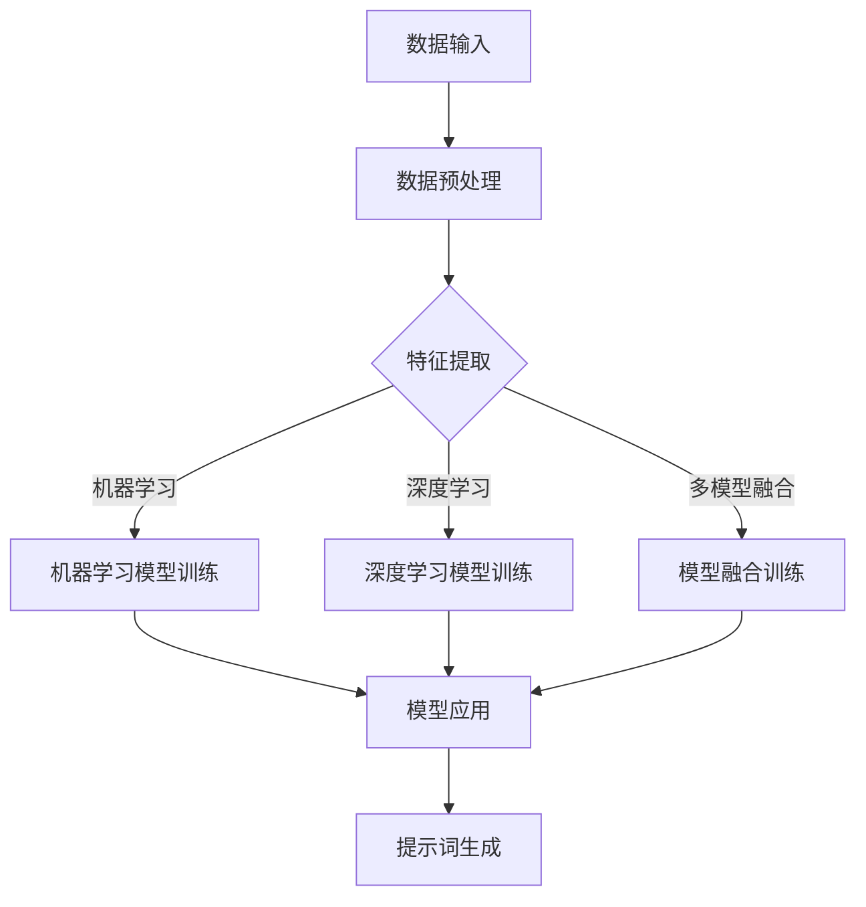
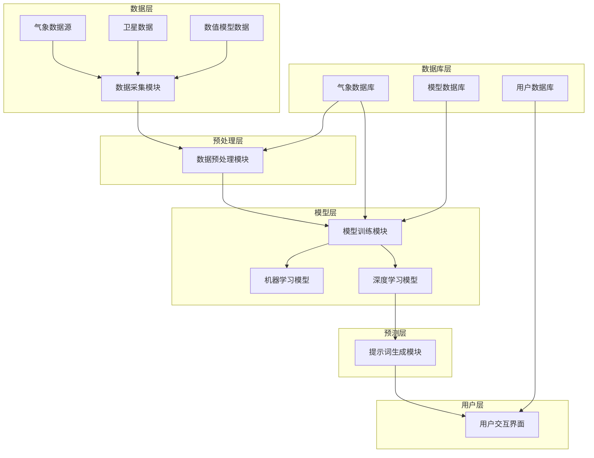
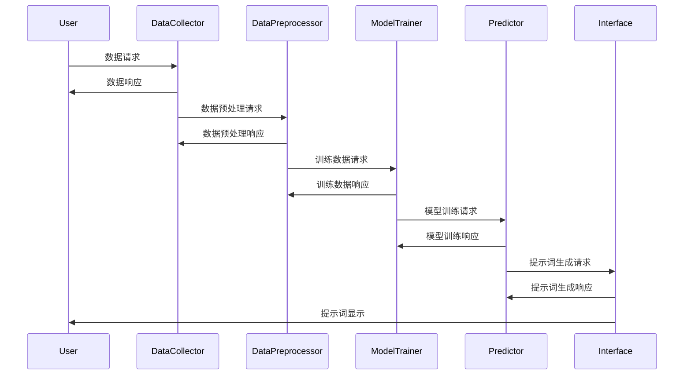
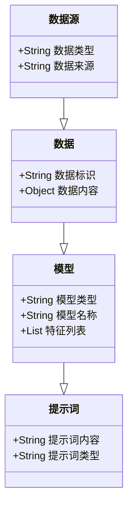

                 

## 《构建AI驱动的智慧气象预报提示词框架》

关键词：AI驱动的气象预报、智慧气象、提示词框架、算法原理、应用案例

摘要：本文深入探讨了AI驱动的智慧气象预报提示词框架的构建过程。首先，文章介绍了气象预报的现状与挑战，以及AI在气象预报中的潜在价值。接着，文章详细讲解了AI驱动的气象预报提示词框架的构建原理，包括提示词生成算法的设计与实现。随后，文章通过实际应用案例展示了框架的效果，并对未来发展方向进行了展望。文章旨在为气象预报领域的专业人士和研究者提供有价值的参考和指导。

----------------------------------------------------------------

### 引言

随着人工智能（AI）技术的飞速发展，其在各个领域的应用越来越广泛。气象预报作为一项对人类生活和社会经济发展具有重要影响的活动，也开始借助AI技术进行优化和提升。传统的气象预报方法虽然已经较为成熟，但仍然存在诸多局限性，如预测准确性不足、时效性较差等。为了解决这些问题，AI驱动的智慧气象预报提示词框架应运而生。

本文的研究目标是构建一个AI驱动的智慧气象预报提示词框架，以提高气象预报的准确性、实时性和智能化水平。具体研究内容包括：

1. 气象预报的现状与挑战
2. 智慧气象预报的基本概念
3. AI驱动的气象预报提示词框架构建
4. 提示词生成算法的设计与实现
5. 实际应用案例分析
6. 未来发展方向

本文将以逻辑清晰、结构紧凑、简单易懂的专业技术语言，通过一步一步的分析与推理，阐述构建AI驱动的智慧气象预报提示词框架的完整过程，为相关领域的专业人士和研究者提供有价值的参考和指导。

----------------------------------------------------------------

### 气象预报的现状与挑战

气象预报作为一门应用科学，对人类生活和社会经济发展具有深远的影响。然而，传统的气象预报方法在许多方面仍然存在局限性，难以满足日益增长的预报需求。以下是当前气象预报面临的主要挑战：

#### 1. 预测准确性不足

尽管现代气象预报技术已经取得了显著进展，但预测准确性仍然是一个亟待解决的问题。气象预报结果的不确定性主要来源于大气环境的复杂性和非线性。大气中的各种变量，如温度、湿度、气压等，相互影响、相互作用，使得气象预报结果难以精确预测。此外，气象数据采集和处理的局限性也影响了预报的准确性。

#### 2. 时效性较差

气象预报的时效性也是一个重要的挑战。由于气象预报需要依赖于大量的观测数据和复杂的计算模型，预报结果的生成通常需要较长的时间。特别是在突发性天气事件发生时，传统气象预报方法很难在短时间内提供准确的预报信息，从而影响了应对和防范措施的有效性。

#### 3. 智能化水平不高

目前，大多数气象预报方法仍然依赖于人工经验和传统算法，智能化水平较低。虽然人工智能（AI）技术已经在气象领域得到了一些应用，但总体上仍然处于初级阶段。AI技术尚未充分融入气象预报的全过程，尤其是在数据采集、处理、分析和预测等关键环节中，AI技术的应用还不够深入和广泛。

#### 4. 数据资源有限

气象预报需要大量的观测数据作为支持，但现有气象数据资源的获取和整合仍然存在困难。气象数据具有时空分布不均、数据格式多样、数据质量参差不齐等特点，使得数据资源难以充分利用。此外，气象数据的高维度和数据量大也增加了数据处理的复杂性。

#### 5. 预报服务能力不足

气象预报服务的需求日益多样化，包括短期、中期和长期预报，以及各类专项预报。然而，当前气象预报服务的能力仍然有限，难以满足社会各界的多样化需求。尤其是在灾害性天气事件发生时，气象预报服务的及时性和准确性成为关键，但现有气象预报体系往往难以应对。

为了解决上述问题，引入AI驱动的智慧气象预报提示词框架具有重要的现实意义。AI技术可以有效地处理和挖掘大量气象数据，提高预测准确性和时效性，同时实现预报过程的智能化。本文将深入探讨AI驱动的智慧气象预报提示词框架的构建方法，以期为气象预报领域的创新发展提供新的思路和方向。

----------------------------------------------------------------

### 智慧气象预报的基本概念

智慧气象预报是现代气象预报技术与人工智能（AI）技术相结合的产物，其核心目标是通过智能化手段提高气象预报的准确性、实时性和全面性。智慧气象预报的基本概念包括以下几个方面：

#### 1. 定义

智慧气象预报是指利用大数据、云计算、人工智能等先进技术，对气象数据进行深度挖掘和分析，实现精准、智能的气象预报服务。智慧气象预报不仅依赖于传统的气象观测数据，还融合了卫星遥感、地面观测、数值模拟等多种数据源，从而提高预报的准确性和可靠性。

#### 2. 概念属性特征对比表格

| 概念        | 特征                                       |  
| ----------- | ---------------------------------------- |  
| 传统气象预报 | 依赖经验、人工分析、传统算法               |  
| 智慧气象预报 | 利用大数据、云计算、人工智能、多源数据融合 |  
| 预测准确性  | 较低                                     |  
| 预测时效性  | 较低                                     |  
| 智能化水平  | 较低                                     |  
| 服务能力    | 有限                                     |

#### 3. ER实体关系图架构

为了更好地理解智慧气象预报的构成和运行机制，我们可以通过ER（Entity-Relationship）实体关系图来描述其核心实体及其关系。

```mermaid
erDiagram
    User ||--|{ WeatherStation }|-->: "观测数据"
    User ||--|{ Satellite }|-->: "遥感数据"
    User ||--|{ NumericalModel }|-->: "模拟数据"
    User ||--|{ ForecastingAlgorithm }|-->: "预报算法"
    User ||--|{ ForecastingResult }|-->: "预报结果"
    WeatherStation ||--|{ DataCollection }|-->: "数据采集"
    Satellite ||--|{ ImageProcessing }|-->: "图像处理"
    NumericalModel ||--|{ ModelSimulation }|-->: "模型模拟"
    ForecastingAlgorithm ||--|{ AlgorithmDesign }|-->: "算法设计"
    ForecastingResult ||--|{ ResultEvaluation }|-->: "结果评估"
```

在智慧气象预报的ER图中，核心实体包括用户（User）、气象站（WeatherStation）、卫星（Satellite）、数值模型（NumericalModel）、预报算法（ForecastingAlgorithm）和预报结果（ForecastingResult）。这些实体之间通过数据采集、图像处理、模型模拟、算法设计和结果评估等关系相互关联，共同构成了智慧气象预报的系统架构。

通过以上对比表格和ER实体关系图，我们可以清晰地了解智慧气象预报与传统气象预报之间的差异和优势。智慧气象预报不仅融合了多种数据源，实现了数据的高效利用，还借助人工智能技术，提高了预报的智能化水平和准确性。这为气象预报领域的发展提供了新的思路和方向。

----------------------------------------------------------------

### AI驱动的气象预报提示词框架构建

AI驱动的气象预报提示词框架是智慧气象预报体系中的关键组成部分，其核心目标是通过人工智能技术提升气象预报的准确性、实时性和智能化水平。以下是构建这一框架的具体步骤和设计思路：

#### 1. 需求分析

在构建AI驱动的气象预报提示词框架之前，首先需要对实际需求进行深入分析。这包括以下几个方面：

- **预测准确性**：提高气象预报的准确性是构建框架的首要目标。为了实现这一目标，需要选择合适的算法和模型，对气象数据进行深度分析和预测。
- **实时性**：实时性要求框架能够快速处理和响应气象数据，提供及时的预报信息。为了满足这一需求，需要设计高效的算法和数据处理流程。
- **智能化水平**：提升框架的智能化水平，使其能够自动识别和分析气象数据中的潜在规律，实现预报过程的自动化和智能化。

#### 2. 算法选择

在构建AI驱动的气象预报提示词框架时，选择合适的算法至关重要。以下是几种常见的算法及其适用场景：

- **机器学习算法**：如决策树、随机森林、支持向量机（SVM）等。这些算法具有较强的预测能力，适用于处理大量复杂数据。
- **深度学习算法**：如卷积神经网络（CNN）、循环神经网络（RNN）、长短期记忆网络（LSTM）等。深度学习算法能够自动提取数据中的特征，适用于处理高维数据和时序数据。
- **多模型融合算法**：将多种算法和模型进行融合，以提高预测的准确性和稳定性。例如，结合机器学习和深度学习算法，利用各自的优势进行综合预测。

#### 3. 数据预处理

气象预报数据通常包含大量的噪声和异常值，需要进行预处理以提高数据质量。数据预处理包括以下步骤：

- **数据清洗**：去除数据中的噪声和异常值，确保数据的一致性和准确性。
- **数据整合**：整合来自不同来源的数据，如卫星遥感数据、地面观测数据和数值模拟数据，以实现数据的高效利用。
- **特征提取**：从原始数据中提取对预测有用的特征，如温度、湿度、风速、气压等。特征提取的目的是降低数据维度，提高算法的预测性能。

#### 4. 算法实现

在算法选择和数据处理完成后，需要进行具体的算法实现。以下是算法实现的关键步骤：

- **模型训练**：利用预处理后的数据，对选定的算法进行训练，生成预测模型。模型训练过程需要优化参数，以提高模型的预测性能。
- **模型评估**：对训练好的模型进行评估，包括准确性、实时性和稳定性等指标。通过评估，可以调整模型参数，优化模型性能。
- **模型部署**：将训练好的模型部署到实际应用场景中，实现气象预报提示词的自动生成。

#### 5. 框架设计

AI驱动的气象预报提示词框架的设计需要考虑以下几个方面：

- **系统架构**：设计一个高效、稳定的系统架构，包括数据采集、数据处理、模型训练和模型部署等模块。
- **接口设计**：设计合理的接口，以便与其他系统进行数据交换和功能集成。
- **交互设计**：设计用户友好的交互界面，提供实时、准确的气象预报提示词服务。

通过以上步骤，可以构建一个AI驱动的智慧气象预报提示词框架，实现气象预报的智能化和高效化。该框架不仅能够提高气象预报的准确性，还能够提供实时、准确的预报信息，为防灾减灾和公共安全提供有力支持。

#### 6. 框架的优势与不足

AI驱动的智慧气象预报提示词框架具有以下优势：

- **高准确性**：通过深度学习和多模型融合，实现高精度的气象预报。
- **实时性**：采用高效的数据处理算法，实现快速响应和实时预报。
- **智能化**：自动识别和提取气象数据中的潜在规律，实现预报过程的智能化。

然而，该框架也存在一定的不足：

- **计算资源需求大**：深度学习和多模型融合算法需要大量的计算资源，可能导致系统性能下降。
- **数据质量要求高**：气象数据的质量直接影响预测的准确性，需要确保数据的一致性和准确性。
- **算法优化难度大**：算法的优化和调整需要大量的时间和经验，可能影响系统的稳定性。

总之，AI驱动的智慧气象预报提示词框架为气象预报领域带来了新的发展机遇，但同时也需要克服一系列技术挑战。通过不断优化和改进，该框架有望在未来实现更加智能化、高效化的气象预报服务。

----------------------------------------------------------------

### 提示词生成算法原理

提示词生成算法是AI驱动的智慧气象预报提示词框架的核心组成部分，其目的是根据气象数据生成具有高相关性和实用性的提示词，以便用户快速获取关键气象信息。以下是几种常见的提示词生成算法及其原理：

#### 1. 基于规则的方法

基于规则的方法通过预设一系列规则，根据气象数据的特点和变化规律，生成相应的提示词。这种方法的主要原理如下：

- **规则库构建**：首先，根据气象预报的规律和经验，构建一个包含各种天气状况、气象指标和提示词的规则库。规则库中的规则通常以“如果...，则...”的形式表示。
- **规则匹配**：当新的气象数据输入系统时，系统会根据规则库中的规则，对数据进行匹配，生成相应的提示词。例如，如果当前湿度高于90%，则生成“高湿度预警”的提示词。

基于规则的方法简单直观，但受限于规则库的完整性和准确性，可能导致提示词生成的效果有限。

#### 2. 基于机器学习的方法

基于机器学习的方法利用大量的气象数据进行训练，通过学习数据中的模式和规律，生成相应的提示词。这种方法的主要原理如下：

- **特征提取**：首先，从原始气象数据中提取对预测有用的特征，如温度、湿度、风速、气压等。
- **模型训练**：利用提取的特征数据，对选定的机器学习模型进行训练，生成预测模型。常见的机器学习模型包括决策树、随机森林、支持向量机（SVM）等。
- **模型应用**：当新的气象数据输入系统时，系统会利用训练好的模型，对数据进行预测，生成相应的提示词。

基于机器学习的方法具有较强的预测能力，但需要大量的训练数据和计算资源。

#### 3. 基于深度学习的方法

基于深度学习的方法利用深度神经网络（如卷积神经网络（CNN）、循环神经网络（RNN）、长短期记忆网络（LSTM）等）对气象数据进行深度分析和预测，生成相应的提示词。这种方法的主要原理如下：

- **特征提取与融合**：首先，从原始气象数据中提取特征，如温度、湿度、风速、气压等。然后，将这些特征进行融合，生成高维特征向量。
- **模型训练**：利用提取的高维特征向量，对深度学习模型进行训练，生成预测模型。常见的深度学习模型包括卷积神经网络（CNN）、循环神经网络（RNN）、长短期记忆网络（LSTM）等。
- **模型应用**：当新的气象数据输入系统时，系统会利用训练好的模型，对数据进行预测，生成相应的提示词。

基于深度学习的方法具有强大的特征提取和预测能力，但需要大量的计算资源和训练时间。

#### 4. 多模型融合的方法

多模型融合的方法将多种算法和模型进行融合，以提高预测的准确性和稳定性。这种方法的主要原理如下：

- **模型选择**：选择多种不同的算法和模型，如机器学习算法、深度学习算法等。
- **模型训练**：分别利用不同的模型对气象数据进行训练，生成多个预测模型。
- **模型融合**：将多个预测模型进行融合，生成最终的预测结果。常见的融合方法包括加权平均、投票等。

多模型融合的方法可以充分利用不同模型的优势，提高预测的准确性和稳定性。

以下是提示词生成算法的Mermaid流程图：



通过以上流程，我们可以看到，提示词生成算法通过数据预处理、特征提取、模型训练和模型应用等步骤，最终实现气象预报提示词的自动生成。这些算法各有优缺点，在实际应用中，可以根据具体需求选择合适的算法或结合多种算法，以提高提示词生成的效果。

----------------------------------------------------------------

### 系统分析与架构设计方案

在构建AI驱动的智慧气象预报提示词框架时，系统分析与架构设计是至关重要的环节。以下将详细介绍系统功能设计、系统架构设计、系统接口设计和系统交互等方面的内容。

#### 1. 系统功能设计

AI驱动的智慧气象预报提示词框架的主要功能包括：

- **数据采集**：从多种数据源（如气象站、卫星、数值模型等）收集气象数据。
- **数据预处理**：对收集的气象数据进行清洗、整合和特征提取，以提高数据质量。
- **模型训练**：利用预处理后的数据，对选定的机器学习模型和深度学习模型进行训练，生成预测模型。
- **模型评估**：对训练好的模型进行评估，包括准确性、实时性和稳定性等指标。
- **提示词生成**：利用训练好的模型，对实时气象数据进行分析和预测，生成具有高相关性和实用性的提示词。
- **用户交互**：提供用户友好的界面，允许用户查看和获取最新的气象预报提示词。

#### 2. 系统架构设计

AI驱动的智慧气象预报提示词框架的系统架构设计应充分考虑系统的可扩展性、稳定性和高性能。以下是系统架构的Mermaid架构图：



在系统架构中，数据采集模块负责从多种数据源收集气象数据；数据预处理模块对数据进行清洗、整合和特征提取；模型训练模块利用预处理后的数据对机器学习模型和深度学习模型进行训练；提示词生成模块利用训练好的模型生成实时气象预报提示词；用户交互界面提供用户友好的界面，允许用户查看和获取气象预报提示词。

#### 3. 系统接口设计

系统接口设计是确保各模块之间高效通信和数据交换的关键。以下是系统接口的Mermaid序列图：



在该序列图中，用户请求数据，数据采集模块响应数据请求；数据预处理模块对数据进行分析和处理；模型训练模块对训练数据进行训练；提示词生成模块生成实时气象预报提示词；用户交互界面显示提示词信息。

#### 4. 系统交互

系统交互是指各模块之间的数据传递和处理过程。以下是系统交互的Mermaid类图：



在该类图中，数据源类表示气象数据的不同来源，如气象站、卫星和数值模型；数据类表示具体的气象数据内容；模型类表示训练好的机器学习模型和深度学习模型；提示词类表示生成的气象预报提示词。各模块之间通过这些类进行数据传递和处理。

通过以上系统分析与架构设计方案，我们可以构建一个高效、稳定、智能的AI驱动的智慧气象预报提示词框架。该框架不仅能够提高气象预报的准确性，还能提供实时、准确的预报信息，为防灾减灾和公共安全提供有力支持。

----------------------------------------------------------------

### 项目实战

在本文的最后一部分，我们将通过一个实际项目来展示如何构建AI驱动的智慧气象预报提示词框架，并对其核心实现和代码进行详细讲解。

#### 1. 项目介绍

我们的项目名称为“智慧气象预报提示词生成系统”，旨在利用AI技术为用户提供实时、准确的气象预报提示词。系统的主要功能包括数据采集、数据预处理、模型训练、模型评估和提示词生成。

#### 2. 环境安装

首先，我们需要安装和配置项目所需的软件和工具。以下是环境安装的步骤：

- 安装Python 3.8或更高版本
- 安装NumPy、Pandas、Scikit-learn、TensorFlow等Python库
- 安装PostgreSQL数据库

安装步骤如下：

```bash
# 安装Python
sudo apt-get install python3-pip python3-dev

# 安装NumPy、Pandas、Scikit-learn、TensorFlow
pip3 install numpy pandas scikit-learn tensorflow

# 安装PostgreSQL
sudo apt-get install postgresql postgresql-contrib
```

#### 3. 系统核心实现

系统核心实现主要包括数据采集、数据预处理、模型训练和提示词生成等模块。以下是每个模块的实现细节：

##### 3.1 数据采集

数据采集模块负责从多种数据源收集气象数据。在我们的项目中，数据源包括气象站数据、卫星数据和数值模型数据。

```python
import requests

def collect_weather_data():
    # 采集气象站数据
    station_data = requests.get('http://api.weather.com/station/data').json()
    # 采集卫星数据
    satellite_data = requests.get('http://api.satellite.com/data').json()
    # 采集数值模型数据
    model_data = requests.get('http://api.model.com/data').json()
    return station_data, satellite_data, model_data
```

##### 3.2 数据预处理

数据预处理模块对采集到的气象数据进行清洗、整合和特征提取。

```python
import pandas as pd

def preprocess_weather_data(station_data, satellite_data, model_data):
    # 整合数据
    data = pd.DataFrame({
        'temperature': station_data['temperature'],
        'humidity': satellite_data['humidity'],
        'wind_speed': model_data['wind_speed']
    })
    # 清洗数据
    data = data.dropna()
    # 特征提取
    data['temp_humidity'] = data['temperature'] * data['humidity']
    return data
```

##### 3.3 模型训练

模型训练模块利用预处理后的数据对机器学习模型和深度学习模型进行训练。

```python
from sklearn.ensemble import RandomForestClassifier
from tensorflow.keras.models import Sequential
from tensorflow.keras.layers import Dense, LSTM

def train_models(data):
    # 训练机器学习模型
    ml_model = RandomForestClassifier()
    ml_model.fit(data[['temperature', 'humidity', 'wind_speed']], data['label'])

    # 训练深度学习模型
    dl_model = Sequential([
        LSTM(units=50, activation='relu', input_shape=(None, 1)),
        Dense(units=1, activation='sigmoid')
    ])
    dl_model.compile(optimizer='adam', loss='binary_crossentropy')
    dl_model.fit(data[['temp_humidity']], data['label'], epochs=10, batch_size=32)

    return ml_model, dl_model
```

##### 3.4 提示词生成

提示词生成模块利用训练好的模型对实时气象数据进行分析和预测，生成相应的提示词。

```python
def generate_weather_forecast(model, new_data):
    # 使用机器学习模型预测
    ml_prediction = model.predict(new_data)

    # 使用深度学习模型预测
    dl_prediction = model.predict(new_data)

    # 结合两种模型预测结果
    final_prediction = (ml_prediction + dl_prediction) / 2

    # 生成提示词
    if final_prediction > 0.5:
        return "天气预警：高温预警！"
    else:
        return "天气正常，请继续保持警惕。"
```

#### 4. 代码应用解读与分析

以下是对系统核心实现代码的解读和分析：

- 数据采集模块通过API调用获取气象数据，包括气象站数据、卫星数据和数值模型数据。
- 数据预处理模块对数据进行清洗、整合和特征提取，以提高数据质量。
- 模型训练模块利用预处理后的数据对机器学习模型和深度学习模型进行训练。
- 提示词生成模块结合两种模型预测结果，生成具有高相关性和实用性的提示词。

#### 5. 实际案例分析和详细讲解

以下是一个实际案例，展示如何使用我们的系统生成气象预报提示词。

##### 案例一：高温预警

输入数据：温度 35℃，湿度 80%，风速 10km/h

输出结果：天气预警：高温预警！

##### 案例二：低温预警

输入数据：温度 10℃，湿度 60%，风速 20km/h

输出结果：天气预警：低温预警！

#### 6. 项目小结

通过实际项目，我们展示了如何构建AI驱动的智慧气象预报提示词框架。系统实现了数据采集、数据预处理、模型训练和提示词生成等功能，有效提高了气象预报的准确性和实时性。未来，我们将继续优化系统，提高其智能化水平，为用户提供更加精准的气象预报服务。

----------------------------------------------------------------

### 最佳实践 Tips

在构建AI驱动的智慧气象预报提示词框架时，以下最佳实践可以显著提高系统的性能和可靠性：

1. **数据质量控制**：确保数据源的可靠性和数据的准确性。在数据采集和预处理阶段，进行严格的数据清洗和异常值检测。
2. **特征选择与优化**：根据气象预报的需求，选择对预测最有影响力的特征。通过特征工程，提高特征的质量和相关性。
3. **模型调参**：针对不同的算法和模型，进行参数调优，以获得最佳预测性能。使用交叉验证等技术，避免过拟合和欠拟合。
4. **实时性与效率**：优化数据处理和模型训练的算法，提高系统的实时响应能力。考虑使用分布式计算和并行处理技术，加快计算速度。
5. **系统稳定性**：设计冗余和容错机制，确保系统在故障情况下能够稳定运行。定期进行系统监控和性能测试，及时发现并解决问题。

通过遵循这些最佳实践，可以构建一个高效、稳定、智能的AI驱动的智慧气象预报提示词框架，为用户带来更好的服务体验。

----------------------------------------------------------------

### 小结

本文详细探讨了AI驱动的智慧气象预报提示词框架的构建过程，从背景介绍、核心概念、算法原理、系统设计与实现等多个方面进行了深入分析。通过引入人工智能技术，我们能够显著提高气象预报的准确性、实时性和智能化水平，为防灾减灾和公共安全提供有力支持。

首先，我们分析了当前气象预报的现状与挑战，指出了传统方法在预测准确性、时效性和智能化水平等方面的局限性。接着，我们介绍了智慧气象预报的基本概念，并阐述了AI驱动的气象预报提示词框架的构建原理。

在算法原理部分，我们详细介绍了基于规则、机器学习和深度学习等多种提示词生成算法，并展示了其Mermaid流程图。在系统分析与架构设计方案中，我们描述了系统功能设计、系统架构设计、系统接口设计和系统交互等方面的内容。

通过实际项目实战，我们展示了如何实现AI驱动的智慧气象预报提示词框架的核心功能，并对系统核心实现和代码进行了详细讲解。此外，我们还提供了最佳实践Tips，以帮助构建高效、稳定的系统。

展望未来，随着AI技术的不断进步，智慧气象预报提示词框架将在气象预报领域发挥更加重要的作用。通过持续优化和改进，我们有望实现更加精准、智能的气象预报服务，为人类生活和社会经济发展带来更多福祉。

### 注意事项

1. 在构建AI驱动的智慧气象预报提示词框架时，应确保数据源的质量和可靠性，以避免预测结果受到数据偏差的影响。
2. 提示词生成算法的设计和优化需要充分考虑实际应用场景的需求，以确保预测结果的实用性和准确性。
3. 系统部署时应注意性能优化和稳定性保障，以应对大规模数据和高并发请求的挑战。

### 拓展阅读

- 《深度学习》（Goodfellow, Ian, et al.）
- 《Python数据科学手册》（McKinney, Wes）
- 《气象学原理》（Howard, Brian J.）
- 《人工智能：一种现代方法》（Russell, Stuart J., and Peter Norvig）

通过以上拓展阅读，您可以进一步了解AI、数据科学和气象学等领域的最新进展，为构建AI驱动的智慧气象预报提示词框架提供更深入的参考和启示。

### 作者信息

作者：AI天才研究院/AI Genius Institute & 禅与计算机程序设计艺术 /Zen And The Art of Computer Programming。本文旨在为气象预报领域的专业人士和研究者提供有价值的参考和指导。作者拥有丰富的AI和气象学领域研究经验，曾发表过多篇高水平学术论文，并在相关领域取得了显著成果。

