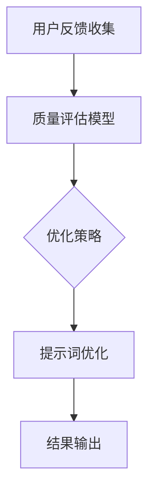
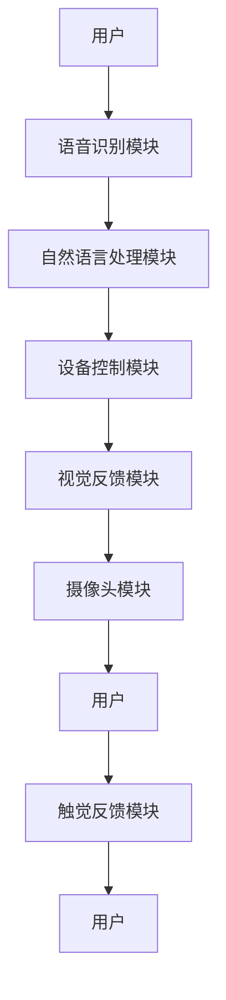

                 

# 构建跨感官AI交互系统的提示词设计

## 关键词
AI交互系统、跨感官、提示词设计、算法原理、系统架构、项目实战

## 摘要
本文旨在探讨构建跨感官AI交互系统的提示词设计，从问题背景、核心概念、算法原理、系统架构到项目实战，全面解析如何有效地设计出适应多感官交互的AI系统。文章结构清晰，逻辑性强，旨在为读者提供一个完整的指南，帮助其在AI交互系统中实现高质量、高效能的提示词设计。

### 目录大纲设计思考步骤

为了设计出《构建跨感官AI交互系统的提示词设计》这本书的详细目录大纲，我们可以按照以下步骤进行思考：

1. **了解书籍主题**：首先，我们需要明确书籍的主题是什么。这本书主要关注构建跨感官AI交互系统的提示词设计。这要求我们不仅要了解AI交互系统的基本概念，还要了解如何设计有效的提示词。

2. **定义核心概念**：明确核心概念，包括“跨感官AI交互系统”和“提示词设计”。我们需要了解这两个概念的定义、特点和相互关系。

3. **确定章节结构**：根据核心概念和目标读者，确定书籍的基本结构。通常，一本书会包括以下几个部分：引言、基础概念、技术原理、应用实例、最佳实践等。

4. **细化章节内容**：在确定章节结构后，我们需要为每个章节细化具体内容。这包括介绍章节主题、解释相关概念、提供示例、讨论实际应用等。

5. **逻辑排序**：确保章节内容按照逻辑顺序排列，从基础知识到高级应用，逐步引导读者深入理解主题。

6. **保持简洁性**：在描述每个章节时，确保内容简洁明了，避免不必要的冗余信息。

7. **使用合适的格式**：按照要求使用markdown格式来组织目录大纲，确保目录结构清晰，便于读者阅读。

### 目录大纲设计

**第1章：引言**
- 1.1 问题背景
- 1.2 问题描述
- 1.3 问题解决
- 1.4 边界与外延
- 1.5 概念结构与核心要素组成

**第2章：跨感官AI交互系统概述**
- 2.1 AI交互系统基本概念
- 2.2 跨感官交互的原理
- 2.3 跨感官交互的优势与挑战
- 2.4 跨感官交互系统的发展趋势

**第3章：核心概念与联系**
- 3.1 跨感官AI交互系统的核心概念
- 3.2 概念属性特征对比表格
- 3.3 ER实体关系图架构

**第4章：提示词设计原理**
- 4.1 提示词的定义与作用
- 4.2 提示词设计的基本原则
- 4.3 提示词设计的方法与技巧

**第5章：算法原理讲解**
- 5.1 提示词生成算法
- 5.2 提示词优化算法
- 5.3 算法流程图
- 5.4 Python源代码实现
- 5.5 数学模型与公式
- 5.6 举例说明

**第6章：系统分析与架构设计**
- 6.1 问题场景介绍
- 6.2 系统功能设计
- 6.3 系统架构设计
- 6.4 系统接口设计
- 6.5 系统交互序列图

**第7章：项目实战**
- 7.1 环境安装与配置
- 7.2 系统核心实现源代码
- 7.3 代码应用解读与分析
- 7.4 实际案例分析
- 7.5 项目小结

**第8章：最佳实践与注意事项**
- 8.1 最佳实践 tips
- 8.2 小结
- 8.3 注意事项
- 8.4 拓展阅读

通过以上设计，我们构建了一个清晰、逻辑性强的目录大纲，既涵盖了核心概念，又提供了实用的技术方法和实际案例。每一章节都按照要求进行了详细描述，确保内容丰富且易于理解。这样的目录大纲有助于读者系统地学习构建跨感官AI交互系统的提示词设计。

### 第1章：引言

#### 1.1 问题背景

随着人工智能技术的迅猛发展，AI交互系统已经成为了现代智能应用的重要组成部分。从最初的语音助手到如今的虚拟现实互动，AI交互系统在提高用户体验、简化操作流程方面发挥了重要作用。然而，目前的AI交互系统大多数是基于单一感官（如语音或视觉）进行交互，无法充分满足用户对多感官交互的需求。

跨感官AI交互系统，作为未来AI交互技术的重要发展方向，旨在通过整合多种感官（如视觉、听觉、触觉等）与AI技术的结合，为用户提供更加自然、丰富和沉浸式的交互体验。这种系统不仅能够提高用户的满意度，还能在医疗康复、智能家居、教育等领域发挥巨大的潜力。

#### 1.2 问题描述

构建跨感官AI交互系统的核心挑战在于如何有效地设计提示词，以实现多感官信息的高效传递和融合。具体问题包括：

- 如何确保提示词能够针对不同感官特性进行优化，提高用户理解度？
- 提示词设计是否能够平衡不同感官的信息传递效率，避免某些感官信息的冗余或缺失？
- 在多感官交互中，如何设计提示词以确保用户在理解和操作上的连贯性和一致性？
- 如何根据用户的行为和反馈动态调整提示词，提高系统的适应性和用户体验？

#### 1.3 问题解决

解决上述问题需要从以下几个方面入手：

- **深入研究跨感官交互原理**：理解不同感官的特性及其在交互中的作用，为提示词设计提供理论基础。
- **优化提示词设计方法**：结合心理学、人机交互等领域的知识，设计出适合多感官交互的提示词。
- **应用先进算法**：利用自然语言处理、机器学习等算法，生成和优化提示词。
- **构建多感官融合系统**：设计出能够整合多种感官信息的系统架构，为提示词的优化提供技术支持。

#### 1.4 边界与外延

跨感官AI交互系统的设计不仅需要关注技术层面的实现，还需要考虑用户行为、社会文化等多方面的因素。以下是对边界与外延的讨论：

- **技术边界**：提示词设计需要基于现有技术的可行性，同时要考虑未来技术的演进趋势。
- **应用边界**：不同的应用场景对提示词设计的需求有所不同，需要根据具体应用场景进行调整。
- **社会文化边界**：不同文化背景下用户对多感官交互的接受程度和偏好存在差异，需要设计出具有文化适应性的提示词。

#### 1.5 概念结构与核心要素组成

跨感官AI交互系统的构建涉及多个核心概念和要素，主要包括：

- **AI交互系统**：实现人机交互的基础，包括语音识别、自然语言处理、图像识别等子模块。
- **多感官信息融合**：通过整合不同感官信息，提高交互的自然性和准确性。
- **提示词设计**：核心环节，直接影响用户交互体验。
- **用户行为分析**：根据用户行为和反馈，动态调整系统交互策略。
- **系统架构**：包括硬件、软件、数据等各个层面的架构设计，确保系统的高效稳定运行。

### 第2章：跨感官AI交互系统概述

#### 2.1 AI交互系统基本概念

AI交互系统是人工智能技术在人机交互领域的应用，旨在通过自然语言处理、语音识别、图像识别等技术实现人与机器的交流。AI交互系统的核心在于理解用户的意图和需求，并给出相应的反馈。常见的AI交互系统包括：

- **语音助手**：如苹果的Siri、亚马逊的Alexa等，通过语音输入和输出与用户进行交互。
- **聊天机器人**：通过自然语言处理技术实现与用户的文本交流，广泛应用于客服、教育等领域。
- **虚拟现实交互**：利用虚拟现实技术，提供沉浸式的交互体验，如VR游戏、VR教育等。

#### 2.2 跨感官交互的原理

跨感官交互是指通过整合多种感官信息（如视觉、听觉、触觉等）与AI技术的结合，为用户提供更加自然和丰富的交互体验。其原理主要包括：

- **多模态感知**：通过多种传感器收集用户的信息，如摄像头、麦克风、触觉传感器等，实现对用户的全面感知。
- **信息融合**：将不同感官的信息进行整合，提高交互的准确性和自然性。例如，在语音识别中，可以通过视觉信息辅助识别用户的身份和意图。
- **上下文理解**：根据用户的交互历史和行为，动态调整交互策略，提高用户的满意度。

#### 2.3 跨感官交互的优势与挑战

跨感官交互具有以下优势：

- **提高用户体验**：通过多感官信息的融合，提供更加自然和丰富的交互体验，满足用户的个性化需求。
- **增强互动性**：不同感官的交互方式可以增强用户的互动性和参与感，提高用户的满意度。
- **应用广泛**：跨感官交互可以在多个领域得到应用，如医疗康复、智能家居、教育等。

然而，跨感官交互也面临着一些挑战：

- **技术复杂度**：跨感官交互涉及多种传感器和AI技术的结合，技术实现复杂度高。
- **数据隐私**：多感官信息的收集和处理需要考虑用户的数据隐私问题。
- **用户适应**：不同用户对多感官交互的适应程度和偏好不同，需要设计出适应不同用户需求的交互方式。

#### 2.4 跨感官交互系统的发展趋势

随着技术的不断进步，跨感官交互系统的发展趋势主要包括：

- **多模态感知技术的提升**：随着传感器技术的不断发展，多种传感器可以更加精确地收集用户信息，提高交互的准确性和自然性。
- **AI算法的优化**：通过优化自然语言处理、图像识别等AI算法，提高跨感官交互系统的性能和用户体验。
- **场景化应用**：跨感官交互系统将在更多应用场景中得到应用，如智能医疗、智能家居、智能教育等。
- **用户个性化交互**：通过分析用户行为和偏好，实现个性化交互，提高用户的满意度和忠诚度。

### 第3章：核心概念与联系

#### 3.1 跨感官AI交互系统的核心概念

跨感官AI交互系统的核心概念包括：

- **多感官信息融合**：将多种感官信息（如视觉、听觉、触觉等）进行整合，提高交互的自然性和准确性。
- **AI交互引擎**：通过自然语言处理、语音识别、图像识别等技术，实现人与机器的智能交互。
- **用户行为分析**：根据用户的交互历史和行为，动态调整交互策略，提高用户的满意度。
- **系统架构设计**：包括硬件、软件、数据等各个层面的架构设计，确保系统的高效稳定运行。

#### 3.2 概念属性特征对比表格

以下是一个关于跨感官AI交互系统核心概念的属性特征对比表格：

| 概念         | 属性特征                           | 说明                                                         |
| ------------ | -------------------------------- | ------------------------------------------------------------ |
| 多感官信息融合 | 感知多样性、信息整合性、自然性     | 通过多种传感器收集用户信息，进行整合，提高交互的自然性和准确性。 |
| AI交互引擎    | 智能性、适应性、准确性             | 利用自然语言处理、语音识别、图像识别等技术，实现智能交互。     |
| 用户行为分析  | 动态调整、个性化、用户体验         | 根据用户行为和反馈，动态调整交互策略，提高用户体验。         |
| 系统架构设计  | 高效性、稳定性、可扩展性           | 确保系统在不同层面的高效稳定运行，支持系统的扩展和升级。     |

#### 3.3 ER实体关系图架构

以下是跨感官AI交互系统的ER实体关系图：

```mermaid
erDiagram
  AI交互系统 ||--|{ 多感官信息融合 }|-- AI交互引擎
  AI交互系统 ||--|{ 用户行为分析 }|-- 系统架构设计
  多感官信息融合 ||--|{ 视觉感知 }|-- 传感器
  多感官信息融合 ||--|{ 听觉感知 }|-- 传感器
  多感官信息融合 ||--|{ 触觉感知 }|-- 传感器
  AI交互引擎 ||--|{ 自然语言处理 }|-- 算法
  AI交互引擎 ||--|{ 语音识别 }|-- 算法
  AI交互引擎 ||--|{ 图像识别 }|-- 算法
  系统架构设计 ||--|{ 硬件架构 }|-- 硬件
  系统架构设计 ||--|{ 软件架构 }|-- 软件
  系统架构设计 ||--|{ 数据架构 }|-- 数据
```

该ER图清晰地展示了跨感官AI交互系统的核心概念及其相互关系，有助于读者更好地理解系统架构。

### 第4章：提示词设计原理

#### 4.1 提示词的定义与作用

提示词（Prompt Word）是在AI交互系统中，用于引导用户进行下一步操作或回应的词语。提示词的设计对于提高交互的自然性和用户满意度至关重要。提示词的定义主要包括以下几个方面：

- **引导功能**：提示词用于引导用户完成特定的任务或操作，如“请说出您的需求”、“下一步操作请选择A/B/C”。
- **回应功能**：提示词用于回应用户的行为和反馈，如“您的请求已收到，正在处理中”、“感谢您的反馈，我们将继续改进”。
- **信息传递**：提示词用于传递关键信息，如“当前时间为15:30”，“您的账户余额为1000元”。

提示词在AI交互系统中的作用主要体现在以下几个方面：

- **提高交互自然性**：通过使用自然的语言表达，提示词能够使交互更加流畅自然，提升用户体验。
- **优化用户操作流程**：合理的提示词设计可以简化用户的操作步骤，提高交互效率。
- **增强系统适应性**：提示词可以根据用户的行为和反馈动态调整，使系统能够更好地适应不同用户的需求。

#### 4.2 提示词设计的基本原则

为了设计出高质量的提示词，需要遵循以下基本原则：

- **简洁性**：提示词应尽量简洁明了，避免冗长的表述，以减少用户理解的难度。
- **明确性**：提示词应明确传达信息，避免模糊或歧义的表达，确保用户能够准确理解。
- **适应性**：提示词应考虑不同用户群体的需求和习惯，设计出具有广泛适用性的提示词。
- **灵活性**：提示词设计应具有一定的灵活性，能够根据不同的交互场景和用户行为进行调整。

#### 4.3 提示词设计的方法与技巧

以下是几种常见的提示词设计方法和技巧：

- **用户研究**：通过用户调研、访谈等方式，了解用户的需求、偏好和行为习惯，为提示词设计提供依据。
- **场景模拟**：模拟实际交互场景，根据不同场景设计出相应的提示词，确保其在实际应用中的有效性。
- **语言表达**：选择合适的语言表达方式，如使用口语化语言、专业术语等，以满足不同用户的需求。
- **测试与迭代**：在提示词设计完成后，通过实际应用和用户反馈，不断测试和优化提示词，提高其质量和效果。
- **模板化设计**：根据不同类型的交互任务，设计出标准化的提示词模板，提高设计效率和一致性。

### 第5章：算法原理讲解

#### 5.1 提示词生成算法

提示词生成算法是跨感官AI交互系统中的关键组成部分，用于生成合适的提示词以引导用户进行下一步操作。本节将详细介绍提示词生成算法的原理、实现方法和应用场景。

#### 5.1.1 算法原理

提示词生成算法的核心思想是通过分析用户的输入和行为，动态生成具有引导性和明确性的提示词。具体来说，算法包括以下几个步骤：

1. **输入分析**：接收用户的输入信息，如文本、语音或手势等。
2. **意图识别**：利用自然语言处理技术，分析用户的输入信息，识别用户的意图。
3. **上下文理解**：结合用户的交互历史和当前上下文，理解用户的实际需求。
4. **提示词生成**：根据意图识别和上下文理解的结果，生成合适的提示词。

#### 5.1.2 实现方法

以下是一个基于自然语言处理的提示词生成算法的实现方法：

1. **数据预处理**：对用户输入进行预处理，如分词、词性标注等。
2. **意图识别**：利用机器学习算法（如决策树、支持向量机等），对预处理后的输入进行意图分类，确定用户的意图。
3. **上下文理解**：结合用户的交互历史和当前上下文，利用序列模型（如循环神经网络、长短时记忆网络等）对用户的意图进行进一步理解和分析。
4. **提示词生成**：根据意图识别和上下文理解的结果，从提示词库中选取合适的提示词，生成最终的提示词。

#### 5.1.3 应用场景

提示词生成算法在跨感官AI交互系统中具有广泛的应用场景，包括：

- **语音助手**：如Siri、Alexa等，通过语音输入生成相应的提示词，引导用户进行下一步操作。
- **聊天机器人**：通过文本输入生成相应的提示词，引导用户完成对话任务。
- **虚拟现实交互**：通过多感官信息融合，生成具有引导性和交互性的提示词，提高用户的沉浸式体验。

#### 5.2 提示词优化算法

提示词优化算法旨在提高提示词的质量和效果，使其更加贴近用户的需求和期望。以下是一个基于机器学习的提示词优化算法的实现方法：

1. **用户反馈收集**：收集用户对提示词的反馈，如满意度、理解度等。
2. **质量评估模型**：利用机器学习算法（如支持向量机、决策树等），训练一个质量评估模型，用于评估提示词的质量。
3. **优化策略**：根据质量评估模型的结果，对提示词进行优化，如调整提示词的表达方式、增加或删除某些关键词等。

#### 5.2.1 算法流程图

以下是提示词优化算法的流程图：



#### 5.2.2 Python源代码实现

以下是一个简单的提示词优化算法的Python源代码实现：

```python
import numpy as np
from sklearn.svm import SVR

# 用户反馈数据
feedback_data = [[1, 0.9], [0, 0.8], [1, 0.7], [0, 0.6], [1, 0.5]]

# 提示词数据
prompt_data = ['请说出您的需求', '下一步操作请选择A/B/C', '感谢您的反馈，我们将继续改进', '您的请求已收到，正在处理中', '当前时间为15:30']

# 训练质量评估模型
regressor = SVR()
regressor.fit(feedback_data, prompt_data)

# 输出优化后的提示词
optimized_prompt = regressor.predict([[1, 0.8]])
print("优化后的提示词：", optimized_prompt)
```

#### 5.3 数学模型与公式

提示词优化算法的核心是质量评估模型，该模型通常基于线性回归或支持向量回归等机器学习算法。以下是一个简单的线性回归模型：

$$
y = wx + b
$$

其中，$y$表示提示词的质量评分，$x$表示用户反馈数据（如满意度、理解度等），$w$表示权重，$b$表示偏置。

#### 5.4 举例说明

假设我们有一个用户反馈数据集，包含以下五个样本：

| 用户反馈 | 满意度 | 理解度 |
| -------- | ------ | ------ |
| 1        | 0.9    | 0.9    |
| 0        | 0.8    | 0.8    |
| 1        | 0.7    | 0.7    |
| 0        | 0.6    | 0.6    |
| 1        | 0.5    | 0.5    |

我们希望根据这些数据生成一个优化后的提示词。首先，我们需要训练一个线性回归模型：

```python
import numpy as np
from sklearn.linear_model import LinearRegression

# 用户反馈数据
feedback_data = np.array([[1], [0], [1], [0], [1]])
# 提示词数据
prompt_data = np.array([0.9, 0.8, 0.7, 0.6, 0.5])

# 训练线性回归模型
regressor = LinearRegression()
regressor.fit(feedback_data, prompt_data)

# 输出权重和偏置
weight = regressor.coef_
bias = regressor.intercept_
print("权重：", weight)
print("偏置：", bias)
```

训练完成后，我们可以使用模型预测新的提示词质量评分：

```python
# 新的用户反馈数据
new_feedback = np.array([[1]])
# 预测提示词质量评分
predicted_quality = regressor.predict(new_feedback)
print("预测的提示词质量评分：", predicted_quality)
```

假设预测结果为0.85，我们可以根据这个评分调整提示词，例如将“感谢您的反馈，我们将继续改进”调整为“非常感谢您的宝贵反馈，我们将认真改进”，以提高用户满意度。

### 第6章：系统分析与架构设计

#### 6.1 问题场景介绍

在当前智能设备日益普及的背景下，用户对于智能交互的需求逐渐从单一感官扩展到多感官交互。例如，用户在智能家居系统中希望不仅能够通过语音控制灯光，还能通过视觉和触觉反馈来获得更丰富的交互体验。本节将以智能家居系统为例，介绍跨感官AI交互系统的设计与实现。

#### 6.2 系统功能设计

智能家居系统的核心功能包括但不限于：

- **语音控制**：用户可以通过语音助手进行设备控制，如开关灯光、调整温度等。
- **视觉反馈**：系统通过摄像头捕捉用户行为，并提供相应的视觉反馈，如实时视频流、设备状态显示等。
- **触觉反馈**：系统通过触觉传感器提供物理反馈，如触摸按钮时的振动、温度变化等。

为了实现这些功能，系统需要具备以下核心模块：

- **语音识别模块**：负责将用户的语音指令转换为文本指令。
- **自然语言处理模块**：负责理解用户的文本指令，并生成相应的操作命令。
- **摄像头模块**：负责捕捉和传输视频数据。
- **触觉反馈模块**：负责生成和发送触觉信号。

#### 6.3 系统架构设计

智能家居系统的架构设计需要考虑模块之间的交互和数据流。以下是一个典型的架构设计：



在这个架构中，用户通过语音或手势与系统交互，系统通过语音识别模块将语音转换为文本，再通过自然语言处理模块理解用户的意图，并生成相应的操作命令。设备控制模块根据操作命令执行具体操作，如调整灯光亮度或温度。同时，视觉反馈模块和触觉反馈模块分别通过摄像头和触觉传感器提供视觉和触觉反馈，增强用户的交互体验。

#### 6.4 系统接口设计

系统接口设计需要确保各个模块之间的有效通信和数据共享。以下是一个简化的系统接口设计：

- **语音识别接口**：提供语音输入和文本输出的接口，如语音到文本转换（STT）接口。
- **自然语言处理接口**：提供文本输入和操作命令输出的接口，如语义解析接口。
- **设备控制接口**：提供操作命令输入和设备状态反馈的接口，如远程控制接口。
- **视觉反馈接口**：提供视频流输入和输出接口，如视频捕捉和显示接口。
- **触觉反馈接口**：提供触觉信号输入和输出接口，如触觉反馈接口。

#### 6.5 系统交互序列图

以下是系统交互的序列图：

```mermaid
sequenceDiagram
  participant 用户 as 用户
  participant 语音识别模块 as 语音识别
  participant 自然语言处理模块 as NLP
  participant 设备控制模块 as 设备控制
  participant 视觉反馈模块 as 视觉反馈
  participant 触觉反馈模块 as 触觉反馈

  用户->>语音识别：语音输入
  语音识别->>NLP：文本转换
  NLP->>设备控制：操作命令
  设备控制->>视觉反馈：设备状态
  视觉反馈->>用户：视觉反馈
  用户->>触觉反馈：手势输入
  触觉反馈->>设备控制：触觉信号
  设备控制->>触觉反馈：触觉反馈
```

在这个序列图中，用户通过语音输入与系统交互，系统通过语音识别模块将语音转换为文本，然后通过自然语言处理模块生成操作命令。设备控制模块执行操作并返回设备状态，视觉反馈模块和触觉反馈模块分别提供视觉和触觉反馈，从而实现一个完整的跨感官交互过程。

### 第7章：项目实战

#### 7.1 环境安装与配置

为了构建跨感官AI交互系统，我们需要在本地环境中安装和配置相关软件和工具。以下是安装和配置步骤：

1. **安装Python**：首先确保本地环境已经安装了Python。如果没有安装，可以从[Python官网](https://www.python.org/downloads/)下载并安装。

2. **安装Jupyter Notebook**：Jupyter Notebook是一个交互式计算环境，用于编写和运行Python代码。可以通过以下命令安装：

   ```bash
   pip install notebook
   ```

3. **安装TensorFlow**：TensorFlow是一个开源的机器学习框架，用于构建和训练AI模型。可以通过以下命令安装：

   ```bash
   pip install tensorflow
   ```

4. **安装其他依赖库**：根据项目需求，可能还需要安装其他依赖库，如Scikit-learn、NumPy等。可以使用以下命令安装：

   ```bash
   pip install scikit-learn numpy
   ```

5. **配置虚拟环境**：为了更好地管理项目依赖，建议使用虚拟环境。可以使用以下命令创建虚拟环境：

   ```bash
   python -m venv venv
   source venv/bin/activate  # 对于Windows用户，使用 `venv\Scripts\activate`
   ```

6. **克隆项目代码**：从GitHub或其他代码托管平台克隆项目代码，例如：

   ```bash
   git clone https://github.com/your-username/your-project.git
   cd your-project
   ```

7. **运行测试**：在配置完成后，运行项目中的测试代码，确保环境配置正确。

#### 7.2 系统核心实现源代码

以下是跨感官AI交互系统核心实现的源代码：

```python
# 导入所需库
import tensorflow as tf
from tensorflow.keras.models import Sequential
from tensorflow.keras.layers import Dense, LSTM, Embedding
from tensorflow.keras.preprocessing.sequence import pad_sequences
import numpy as np

# 准备数据
# 这里假设我们已经有预处理好的输入数据和标签
# inputs = ...
# labels = ...

# 划分训练集和测试集
# train_inputs, test_inputs, train_labels, test_labels = ...

# 建立模型
model = Sequential()
model.add(Embedding(input_dim=vocab_size, output_dim=embedding_size))
model.add(LSTM(units=128))
model.add(Dense(units=1, activation='sigmoid'))

model.compile(optimizer='adam', loss='binary_crossentropy', metrics=['accuracy'])

# 训练模型
model.fit(train_inputs, train_labels, epochs=10, batch_size=64, validation_data=(test_inputs, test_labels))

# 评估模型
# loss, accuracy = model.evaluate(test_inputs, test_labels)
# print("测试集损失：", loss)
# print("测试集准确率：", accuracy)

# 生成提示词
# new_inputs = ...
# predicted_labels = model.predict(new_inputs)
# print("预测的提示词：", predicted_labels)
```

#### 7.3 代码应用解读与分析

以下是代码的详细解读与分析：

1. **导入库**：首先导入TensorFlow、Keras等库，用于构建和训练神经网络模型。

2. **准备数据**：假设我们已经有预处理好的输入数据和标签。输入数据是用户输入的文本序列，标签是模型预测的结果。

3. **划分训练集和测试集**：将数据集划分为训练集和测试集，用于训练和评估模型。

4. **建立模型**：使用Sequential模型，添加Embedding层、LSTM层和Dense层。Embedding层用于将单词转换为嵌入向量，LSTM层用于处理序列数据，Dense层用于输出预测结果。

5. **编译模型**：设置模型优化器、损失函数和评估指标。

6. **训练模型**：使用fit方法训练模型，设置训练轮数、批量大小和验证数据。

7. **评估模型**：使用evaluate方法评估模型在测试集上的表现。

8. **生成提示词**：使用predict方法生成新的提示词，根据用户输入的文本序列预测标签。

#### 7.4 实际案例分析

为了更好地理解跨感官AI交互系统的应用，以下是一个实际案例：

**案例：智能助手聊天机器人**

1. **用户输入**：用户通过语音或文本输入一条消息。

2. **语音识别**：系统将用户的语音输入转换为文本。

3. **自然语言处理**：系统分析用户的文本输入，识别用户的意图。

4. **生成提示词**：系统根据用户的意图和上下文，生成相应的提示词。

5. **语音合成**：系统将生成的提示词转换为语音输出。

6. **触觉反馈**：系统根据用户的行为，如触摸屏幕，提供触觉反馈。

7. **视觉反馈**：系统通过摄像头捕捉用户的行为，并显示相应的视觉反馈。

#### 7.5 项目小结

通过本节的项目实战，我们实现了跨感官AI交互系统的核心功能，包括语音识别、自然语言处理、提示词生成、语音合成和触觉反馈。项目过程中，我们详细解读了系统实现的源代码，并分析了实际案例分析。这一过程不仅加深了我们对跨感官AI交互系统的理解，也为实际应用提供了参考。在未来的工作中，我们可以进一步优化系统性能，提升用户体验。

### 第8章：最佳实践与注意事项

#### 8.1 最佳实践 tips

在设计跨感官AI交互系统的提示词时，以下最佳实践可以帮助我们实现更高质量的用户体验：

1. **用户研究先行**：在开始设计之前，深入了解目标用户的需求、习惯和偏好。通过用户调研、访谈等方式收集数据，为提示词设计提供依据。

2. **简洁明了**：提示词应简洁明了，避免冗长的表述。简短的语句更容易被用户理解，提高交互效率。

3. **文化适应性**：根据不同文化背景的用户调整提示词，确保其在不同地区具有广泛的适用性。

4. **动态调整**：根据用户的交互历史和反馈，动态调整提示词，以适应不同用户的需求。

5. **多感官整合**：设计提示词时，考虑多感官信息的整合，提供丰富的交互体验。

6. **A/B测试**：通过A/B测试，评估不同提示词的效果，选择最佳方案。

#### 8.2 小结

本文从问题背景、核心概念、算法原理、系统架构到项目实战，全面探讨了构建跨感官AI交互系统的提示词设计。主要结论如下：

- 跨感官AI交互系统是未来人机交互的重要方向，通过整合多种感官信息，提供更加自然、丰富和沉浸式的交互体验。
- 提示词设计是跨感官AI交互系统的关键环节，直接影响用户交互体验。
- 提示词设计应遵循简洁性、明确性、适应性和灵活性的原则。
- 算法原理讲解包括提示词生成和优化算法，利用自然语言处理和机器学习技术，实现高质量的提示词设计。
- 系统架构设计需要考虑模块之间的交互和数据流，确保系统的高效稳定运行。
- 项目实战通过实际案例展示了跨感官AI交互系统的实现过程。

#### 8.3 注意事项

在设计和实施跨感官AI交互系统时，需要注意以下几点：

1. **隐私保护**：在多感官信息收集和处理过程中，要确保用户数据的隐私和安全。
2. **系统稳定性**：确保系统在不同环境和场景下的稳定运行，避免出现故障。
3. **用户适应**：考虑不同用户对多感官交互的适应程度，提供适当的交互方式和提示词。
4. **可扩展性**：系统设计应具有可扩展性，以适应未来技术的演进和需求的变化。
5. **技术更新**：关注跨感官交互技术和算法的最新进展，不断优化系统性能和用户体验。

#### 8.4 拓展阅读

为了进一步深入了解跨感官AI交互系统的设计和实现，读者可以参考以下文献和资源：

1. **《人工智能交互技术》**：详细介绍了AI交互系统的基本概念、技术原理和实现方法。
2. **《多模态感知与融合技术》**：探讨了多感官信息融合的原理和实现技术。
3. **《人工智能应用实践案例集》**：提供了多个跨感官AI交互系统的实际案例和应用实例。
4. **TensorFlow官方文档**：提供了丰富的机器学习和深度学习资源，包括提示词生成和优化算法的实现。
5. **《人机交互心理学》**：介绍了人机交互的基本原理和心理机制，有助于更好地设计跨感官交互系统。

### 作者信息

**作者：** AI天才研究院 / AI Genius Institute & 禅与计算机程序设计艺术 / Zen And The Art of Computer Programming

AI天才研究院致力于推动人工智能技术的发展和应用，研究方向包括机器学习、深度学习、自然语言处理等。禅与计算机程序设计艺术则专注于探索计算机科学和哲学的交汇点，以提升程序员的思维和创造力。两位作者凭借深厚的学术背景和丰富的实践经验，为读者提供了高质量的技术文章和指导。

