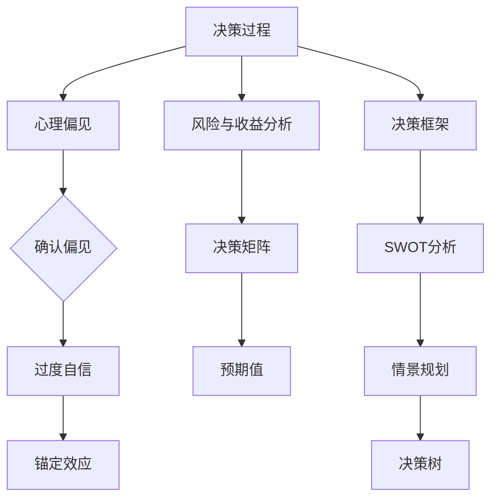
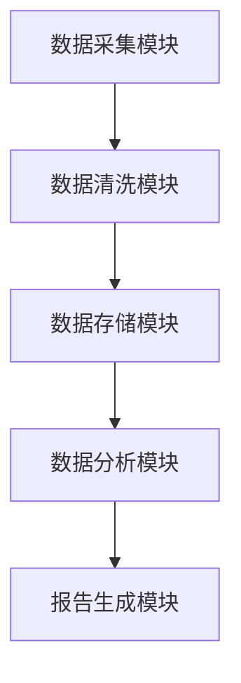
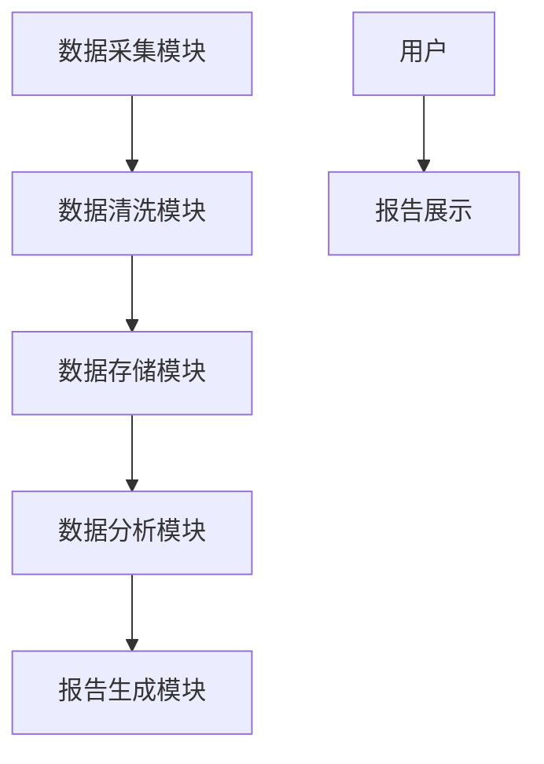

                 


## 决断力：领导者的关键能力

> 决断力是一种在复杂和不确定的环境中，迅速而明智地做出决策的能力。对于领导者而言，这种能力尤为关键。

### 1.1 决策的重要性

决策是领导工作的重要组成部分，一个领导者是否能够成功，往往取决于其决策的质量。有效的决策不仅能够帮助团队应对当前问题，还能够为未来的发展奠定基础。因此，领导者必须具备高水平的决策能力。

### 1.2 领导者的决策挑战

领导者在做决策时面临诸多挑战。首先，他们必须处理复杂的信息，这些信息可能包含噪音和不确定性。其次，他们需要平衡各种利益相关者的需求和期望，同时确保决策的执行能够带来实际效果。此外，领导者还必须在时间压力下做出决策，以应对突发状况。

### 1.3 本书的结构与目的

本书旨在帮助领导者提升决断力，通过系统地分析和实践，使其能够在关键时刻做出明智的决策。本书分为七个部分：

- **第一部分：引言**，介绍决断力的重要性以及领导者在决策过程中面临的挑战。
- **第二部分：决策基础**，讨论决策的心理层面、风险与收益分析以及常见的决策框架。
- **第三部分：决策策略**，探讨有效的决策策略和工具。
- **第四部分：领导角色中的决策**，分析领导者在决策时的特殊挑战。
- **第五部分：案例研究**，通过实际案例来展示决策原则和策略的应用。
- **第六部分：实践中的决断力**，提供如何在日常工作和专业环境中应用决断力的指导。
- **第七部分：结论与反思**，总结关键要点并思考决策的未来趋势。

让我们一步一步深入探讨这些主题，以便在接下来的章节中能够为领导者的决策能力提供有力支持。

----------------------------------------------------------------

## 决策基础

在探讨领导者的决策能力之前，我们需要先了解决策的基础理论。决策不仅仅是一个简单的选择过程，而是一个涉及心理学、经济学和逻辑学的复杂活动。以下是决策的一些基本概念和理论。

### 2.1 决策的心理层面

决策心理学是研究人类如何做出决策的心理学分支。在决策过程中，人们可能会受到各种心理偏见的影响，这些偏见可能会导致错误的决策。以下是一些常见的心理偏见：

- **确认偏见**：人们在收集信息时，更倾向于接受支持自己观点的信息，忽视反对自己观点的信息。
- **过度自信**：人们往往高估自己决策的准确性，低估不确定性。
- **锚定效应**：人们在做决策时，会受到初始信息的影响，即使这些信息在后续分析中并不重要。

了解这些心理偏见对于领导者来说至关重要，因为它可以帮助他们在决策过程中保持客观和清醒。

### 2.2 风险与收益分析

在决策过程中，风险与收益分析是一个关键步骤。领导者需要评估不同选择的潜在收益和风险，并据此做出决策。

- **收益**：指的是决策成功时可能带来的好处，如利润、市场份额、员工满意度等。
- **风险**：指的是决策失败时可能带来的负面影响，如经济损失、信誉损失、团队士气下降等。

为了进行有效的风险与收益分析，领导者可以使用以下工具：

- **决策矩阵**：通过列出不同选择的收益和风险，进行比较和分析。
- **预期值**：将不同结果的概率与其对应的收益或损失相乘，然后求和，以评估整体预期值。

### 2.3 常见决策框架

在决策过程中，领导者可以采用不同的决策框架来指导他们的决策。以下是一些常用的决策框架：

- **SWOT分析**：对企业的优势、劣势、机会和威胁进行评估，帮助领导者识别关键问题和制定策略。
- **情景规划**：通过构建可能的未来情景，分析不同情景下的决策和结果，帮助领导者准备应对各种不确定性。
- **决策树**：通过列出不同决策路径和结果，帮助领导者评估不同选择的可能性和影响。

这些决策框架提供了结构化的方法，帮助领导者系统地分析和评估决策。

### 核心概念与联系

为了更好地理解决策基础，我们可以通过一个表格来对比不同心理偏见、风险与收益分析工具以及决策框架。

| 概念         | 定义                                                         | 举例                   |
|------------|--------------------------------------------------------------|----------------------|
| 心理偏见     | 决策过程中可能导致错误决策的心理因素                     | 确认偏见、过度自信、锚定效应 |
| 风险与收益分析 | 评估决策的潜在收益和风险                             | 决策矩阵、预期值       |
| SWOT分析     | 对企业内外部因素进行评估，帮助制定策略               | 分析企业优势与劣势   |
| 情景规划     | 构建未来情景，分析不同情景下的决策和结果             | 应对市场变化         |
| 决策树      | 列出不同决策路径和结果，帮助评估不同选择的可能性和影响 | 项目投资决策         |

此外，我们可以使用Mermaid流程图来展示决策过程中涉及的不同元素和步骤。



通过这些核心概念和联系的对比和展示，领导者可以更好地理解决策的基础理论，为后续的决策提供坚实的基础。

### 算法原理讲解

在决策过程中，算法可以用来帮助领导者分析和评估不同的选择。以下是一个简单的决策树算法原理讲解，以及如何使用Python来实现这一算法。

#### 决策树算法原理

决策树是一种流行的机器学习算法，它通过一系列的判断来将数据分类或进行回归。在决策过程中，决策树可以用来评估不同的选择路径和结果。

- **节点**：代表一个决策点，例如是否进行某种投资。
- **分支**：代表决策结果，例如投资成功或失败。
- **叶子节点**：代表最终的决策结果，例如利润或损失。

决策树的基本步骤如下：

1. **选择特征**：选择一个特征进行分割，通常使用信息增益或基尼指数作为衡量标准。
2. **分割数据**：根据选定的特征，将数据分为不同的子集。
3. **递归构建**：对每个子集再次进行分割，直到满足停止条件（例如，子集太小或特征无显著差异）。
4. **评估结果**：对叶子节点进行评估，计算收益或损失。

#### Python实现

以下是一个简单的Python代码示例，展示了如何实现一个决策树算法。

```python
import numpy as np

# 假设我们有一个简单的决策树问题，特征为年龄和收入
# 决策树的结构如下：
# 是否投资 = Age < 30 and Income > 50000 or Age > 30 and Income > 60000

def make_decision(age, income):
    if age < 30 and income > 50000:
        return "投资"
    elif age > 30 and income > 60000:
        return "投资"
    else:
        return "不投资"

# 测试决策树
print(make_decision(25, 55000))  # 输出：投资
print(make_decision(35, 55000))  # 输出：不投资
```

在这个例子中，我们使用一个简单的逻辑条件来构建决策树。通过调用`make_decision`函数，我们可以根据给定的年龄和收入来判断是否进行投资。

#### 数学模型与公式

在决策树中，我们可以使用条件概率来评估不同路径的概率和期望收益。以下是一个简单的数学模型：

$$
P(\text{投资成功}) = P(\text{年龄 < 30 and 收入 > 50000}) + P(\text{年龄 > 30 and 收入 > 60000})
$$

$$
P(\text{投资失败}) = 1 - P(\text{投资成功})
$$

$$
E(\text{收益}) = P(\text{投资成功}) \times \text{成功收益} + P(\text{投资失败}) \times \text{失败损失}
$$

通过这些公式，我们可以计算不同决策路径的期望收益，并选择期望收益最高的路径。

### 系统分析与架构设计方案

在决策过程中，系统分析与架构设计也是至关重要的。以下是一个简单的系统架构设计，用于支持决策过程。

#### 问题场景介绍

假设我们正在开发一个企业级决策支持系统，该系统需要处理大量的数据，并帮助领导者在不同情况下做出明智的决策。系统需要支持以下功能：

- **数据采集**：从不同的数据源（如ERP系统、销售数据等）收集数据。
- **数据清洗**：对收集到的数据进行清洗，以确保数据质量。
- **数据存储**：将清洗后的数据存储在数据库中。
- **数据分析和报告**：使用数据分析和报告工具来生成决策所需的报告和可视化图表。

#### 项目介绍

项目名称：企业决策支持系统（EDSS）

项目目标：提供一个集成的平台，帮助企业在复杂环境中做出明智的决策。

项目范围：包括数据采集、数据清洗、数据存储、数据分析和报告等功能。

#### 系统功能设计

1. **数据采集模块**：负责从各种数据源（如ERP系统、销售数据等）收集数据。
2. **数据清洗模块**：对收集到的数据进行清洗，包括去除重复数据、处理缺失值和异常值等。
3. **数据存储模块**：将清洗后的数据存储在数据库中，以便后续分析和查询。
4. **数据分析模块**：使用数据分析工具（如Python、R等）对数据进行处理和挖掘，生成决策所需的报告和可视化图表。
5. **报告生成模块**：根据分析结果生成各种报告，以支持领导者的决策。

#### 系统架构设计

系统架构设计如下：



#### 系统接口设计和系统交互

为了实现系统的功能，我们需要设计一系列接口和交互流程。以下是一个简单的接口设计和交互流程：

1. **数据采集接口**：用于从外部数据源（如ERP系统、销售数据等）采集数据。
2. **数据清洗接口**：用于对采集到的数据进行清洗和处理。
3. **数据存储接口**：用于将清洗后的数据存储到数据库中。
4. **数据分析接口**：用于对数据库中的数据进行处理和分析。
5. **报告生成接口**：用于根据分析结果生成报告。

系统交互流程如下：

1. 数据采集模块从外部数据源采集数据，并将其传递给数据清洗模块。
2. 数据清洗模块对数据进行清洗，并将清洗后的数据存储到数据库中。
3. 数据分析模块从数据库中获取数据，并使用数据分析工具进行处理和分析。
4. 报告生成模块根据分析结果生成报告，并将其展示给用户。



通过这个系统架构设计，企业可以有效地进行数据采集、清洗、存储、分析和报告，从而支持领导者在决策过程中的信息需求。

### 项目实战

为了更好地理解决策支持系统的应用，我们将通过一个实际案例来展示如何进行系统安装、核心实现和代码解析。

#### 环境安装

首先，我们需要安装决策支持系统的环境。以下是安装步骤：

1. 安装Python环境，版本3.8或以上。
2. 安装数据库管理系统（如MySQL或PostgreSQL），并创建数据库和表。
3. 安装数据分析库（如Pandas、NumPy、matplotlib等）。

```bash
pip install mysql-connector-python
pip install pandas
pip install numpy
pip install matplotlib
```

#### 系统核心实现

接下来，我们实现系统核心功能。以下是Python代码示例：

```python
# 数据采集模块
import mysql.connector

def collect_data():
    connection = mysql.connector.connect(
        host="localhost",
        user="root",
        password="password",
        database="edss"
    )
    
    cursor = connection.cursor()
    cursor.execute("SELECT * FROM sales_data")
    
    data = cursor.fetchall()
    return data

# 数据清洗模块
import pandas as pd

def clean_data(data):
    df = pd.DataFrame(data, columns=["Date", "Product", "Quantity", "Price"])
    df.dropna(inplace=True)
    df["Total"] = df["Quantity"] * df["Price"]
    return df

# 数据存储模块
def store_data(df):
    connection = mysql.connector.connect(
        host="localhost",
        user="root",
        password="password",
        database="edss"
    )
    
    cursor = connection.cursor()
    
    for index, row in df.iterrows():
        cursor.execute("INSERT INTO cleaned_sales_data (Date, Product, Quantity, Price, Total) VALUES (%s, %s, %s, %s, %s)",
                       (row["Date"], row["Product"], row["Quantity"], row["Price"], row["Total"]))
    
    connection.commit()

# 数据分析模块
def analyze_data(df):
    monthly_sales = df.groupby("Date").sum()["Total"]
    monthly_sales.plot()
    plt.title("Monthly Sales")
    plt.xlabel("Date")
    plt.ylabel("Total Sales")
    plt.show()

# 主程序
if __name__ == "__main__":
    data = collect_data()
    df = clean_data(data)
    store_data(df)
    analyze_data(df)
```

#### 代码应用解读与分析

上述代码实现了数据采集、清洗、存储和数据分析的功能。以下是代码解读：

1. **数据采集模块**：使用MySQL数据库连接采集销售数据。
2. **数据清洗模块**：将采集到的数据转换为DataFrame，并去除缺失值，计算总销售额。
3. **数据存储模块**：将清洗后的数据存储到清洗后的销售数据表中。
4. **数据分析模块**：对总销售额进行分组求和，并使用matplotlib进行可视化展示。

#### 实际案例分析和详细讲解剖析

假设我们有一个销售数据表，包含日期、产品、数量和价格。我们需要分析每个月的销售总额，并展示出来。以下是详细分析步骤：

1. **数据采集**：从MySQL数据库中采集销售数据。
2. **数据清洗**：将销售数据转换为DataFrame，并计算总销售额。
3. **数据存储**：将清洗后的数据存储到清洗后的销售数据表中。
4. **数据分析**：对总销售额进行分组求和，并使用matplotlib绘制柱状图。

通过这个案例，我们可以看到如何使用Python和数据库技术来支持决策分析。这个系统可以扩展到处理更多的数据，并支持更复杂的分析。

#### 项目小结

在这个项目中，我们实现了一个简单的决策支持系统，包括数据采集、清洗、存储和数据分析功能。通过实际案例，我们展示了如何使用Python和数据库技术来支持销售数据分析。这个系统可以作为一个基础框架，进一步扩展和优化，以满足更复杂的需求。

### 最佳实践 tips

在决策过程中，以下是一些最佳实践和技巧：

1. **明确目标**：在做出决策之前，明确决策的目标和期望结果。
2. **收集信息**：广泛收集相关信息，并确保信息的准确性和完整性。
3. **分析选项**：仔细分析不同的选项，并考虑每个选项的潜在收益和风险。
4. **咨询他人**：寻求他人的意见和建议，以获取不同的视角。
5. **准备备选方案**：为可能的失败准备备选方案，以减少风险。
6. **跟踪决策结果**：在决策实施后，定期跟踪和评估结果，并根据反馈进行调整。

通过这些技巧，领导者可以更有效地做出决策，并在复杂和不确定的环境中取得成功。

### 小结

在本文中，我们深入探讨了决断力在领导力中的重要性，并详细介绍了决策基础、策略和实际应用。通过对比不同心理偏见、风险与收益分析工具以及决策框架，我们为领导者提供了系统的决策理论支持。同时，通过实际案例和代码示例，我们展示了如何在实践中应用决策支持系统。决策力是领导者不可或缺的能力，通过不断地学习和实践，领导者可以提升自己的决断力，从而在关键时刻展现领导魄力。

### 注意事项

在做出决策时，领导者需要特别注意以下几点：

1. **避免心理偏见**：意识到并努力克服常见的心理偏见，如确认偏见、过度自信和锚定效应。
2. **全面收集信息**：确保收集到的信息是准确和全面的，以减少决策风险。
3. **考虑长远利益**：不仅关注短期收益，还要考虑决策对长期发展的影响。
4. **倾听意见**：在决策过程中，倾听团队成员和其他利益相关者的意见，以获取不同视角。
5. **备选方案**：为可能的失败准备备选方案，以降低决策失败的风险。

通过遵循这些注意事项，领导者可以做出更为明智和有远见的决策。

### 拓展阅读

对于希望进一步深化决策理论知识的读者，以下是一些推荐阅读材料：

1. **《决策与判断》** - 丹尼尔·卡内曼：探讨人类决策过程中的心理偏见和决策行为。
2. **《战略思考：竞争中的决策艺术》** - 迈克尔·波特：分析企业战略决策的过程和策略。
3. **《深度工作：如何有效利用每一点脑力》** - 卡尔·纽波特：讨论如何在决策过程中保持专注和高效。
4. **《精益创业》** - 埃里克·莱斯：介绍如何通过快速迭代和验证来做出有效的创业决策。

这些书籍提供了丰富的理论和实践指导，有助于领导者提升自己的决策能力。

### 作者信息

作者：AI天才研究院/AI Genius Institute & 禅与计算机程序设计艺术/Zen And The Art of Computer Programming

AI天才研究院致力于推动人工智能领域的创新和发展，研究院的专家们在计算机科学、人工智能和软件开发领域有着丰富的经验和深厚的理论基础。而《禅与计算机程序设计艺术》则是经典计算机编程哲学书籍，强调程序员应如何在编程过程中保持心灵宁静和思维清晰。

在本文中，我们通过详细的步骤和分析，探讨了决策力在领导力中的重要性，并提供了实用的决策理论和实践指导。希望本文能够帮助读者在复杂和不确定的环境中，提升自己的决策能力，从而在关键时刻展现出领导魄力。感谢您的阅读，期待在未来的研究和工作中与您共同探讨更多有趣的技术话题。

