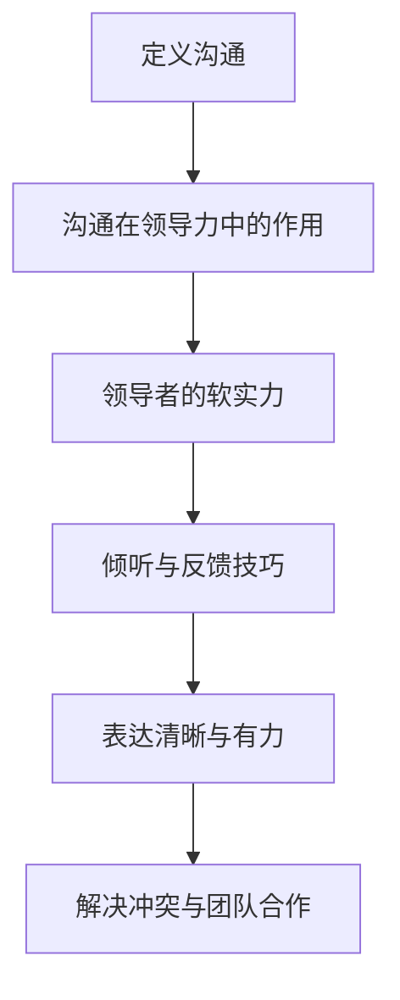
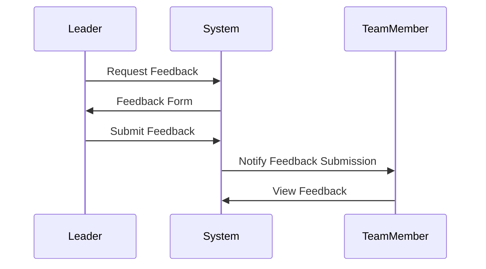
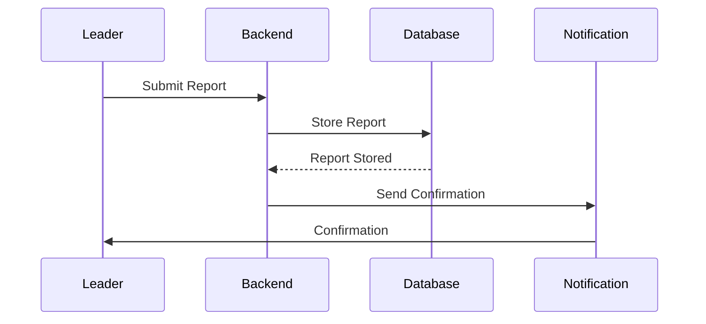

                 

### 沟通的艺术：领导者必备的软实力

> 关键词：沟通、领导力、软实力、领导艺术、有效沟通策略

> 摘要：本篇技术博客文章探讨了沟通在领导力中的关键作用，强调了软实力在领导者沟通中的重要性。文章首先定义了沟通及其在领导角色中的重要性，然后深入分析了有效沟通的策略和实践。通过具体的案例分析和实际应用技巧，文章展示了沟通艺术在提升领导力中的不可或缺的地位。

### 第一部分：沟通的基本概念与领导者角色

#### 第1章：沟通的定义与重要性

沟通是一种信息交换的过程，涉及信息的发送、接收和反馈。在领导者的角色中，沟通是至关重要的，因为它不仅影响决策的制定和执行，还影响团队的凝聚力和士气。

##### 1.1.1 沟通的定义

沟通的定义可以概括为信息的传递与理解。这不仅包括口头和书面交流，还涵盖了非语言沟通和情感交流。

##### 1.1.2 沟通的重要性

领导者有效沟通的重要性体现在多个方面：
- **提高工作效率**：清晰、明确的沟通可以减少误解和重复工作，提高团队的工作效率。
- **增强团队凝聚力**：有效的沟通有助于建立信任，促进团队成员之间的合作。
- **实现目标一致性**：领导者通过有效沟通可以确保团队成员理解并支持组织的愿景和目标。

##### 1.1.3 沟通的构成要素

沟通的构成要素包括发送者、信息、渠道、接收者和反馈。每个要素都在沟通过程中扮演着关键角色。

#### 第2章：沟通的类型与形式

##### 2.1.1 口头沟通

口头沟通是最直接、最迅速的沟通方式。它包括面对面交流、电话会议、视频会议等形式。口头沟通的优点在于可以立即获得反馈，但缺点是可能存在语言障碍和误解。

##### 2.1.2 书面沟通

书面沟通包括电子邮件、报告、备忘录等形式。书面沟通的优点在于可以详细记录信息，便于查阅和跟踪，但缺点是缺乏即时性和互动性。

##### 2.1.3 非语言沟通

非语言沟通包括肢体语言、面部表情、姿势等。它在不言之中传递信息，对沟通的效果有重要影响。

#### 第3章：领导者的沟通特质

##### 3.1.1 领导者沟通的特点

领导者的沟通特点包括清晰性、自信性、倾听性和适应性。这些特质有助于领导者有效地传达信息、建立信任和激励团队。

##### 3.1.2 领导者沟通的挑战

领导者面临的沟通挑战包括沟通障碍、文化差异和沟通压力。理解这些挑战并采取适当的策略可以提升领导者的沟通效果。

##### 3.1.3 领导者沟通的艺术

领导者沟通的艺术在于灵活运用不同的沟通技巧，根据不同情境选择最合适的沟通方式。这包括有效的表达、倾听和反馈技巧。

### 第二部分：有效沟通策略

#### 第4章：倾听与反馈

##### 4.1.1 倾听的技巧

倾听是沟通的重要环节。有效的倾听技巧包括全神贯注、避免打断、给予反馈和提出问题。

##### 4.1.2 反馈的重要性

反馈是沟通过程中的重要组成部分。及时、准确的反馈可以帮助团队纠正错误、改进工作，并建立信任。

##### 4.1.3 提供有效反馈的方法

提供有效反馈的方法包括具体、客观、积极和建设性。这些方法有助于确保反馈被接受和理解。

#### 第5章：表达清晰与有力

##### 5.1.1 清晰表达的重要性

清晰表达是有效沟通的关键。它有助于确保信息被正确理解和执行。

##### 5.1.2 使用明确的语言

使用明确、简洁的语言可以提高沟通的效率。领导者应避免使用模糊、复杂的术语。

##### 5.1.3 避免沟通陷阱

沟通陷阱包括误解、假设和偏见。领导者应警惕这些陷阱，并采取措施避免它们。

#### 第6章：解决冲突与团队合作

##### 6.1.1 冲突的类型与原因

冲突是团队合作中的常见问题。理解冲突的类型和原因有助于领导者预防和解决冲突。

##### 6.1.2 解决冲突的策略

解决冲突的策略包括对话、妥协和调解。这些策略有助于恢复团队合作和生产力。

##### 6.1.3 团队合作中的沟通

团队合作中的沟通要求领导者确保团队成员之间的沟通畅通无阻。这包括定期会议、明确目标和角色分工等。

### 第三部分：领导者的软实力提升

#### 第7章：构建信任与建立关系

##### 7.1.1 信任的构建

信任是领导者与团队成员之间的重要纽带。构建信任的方法包括透明度、诚信和一致性。

##### 7.1.2 建立和维护关系

建立和维护关系需要领导者投入时间和精力。这包括关注团队成员的需求、提供支持和鼓励。

##### 7.1.3 领导力与信任的关系

领导力与信任密切相关。有效的领导者通过建立信任来提升团队的绩效和满意度。

#### 第8章：情绪智力与领导风格

##### 8.1.1 情绪智力的定义与作用

情绪智力是指识别、理解和管理自己情绪和他人情绪的能力。它在领导力中发挥着重要作用。

##### 8.1.2 领导风格的多样性

领导风格多样，包括专制型、民主型和放任型。领导者应根据团队和环境选择合适的风格。

##### 8.1.3 情绪智力与领导风格的关系

情绪智力影响领导风格的选择和运用。有效的领导者能够根据情境灵活调整自己的领导风格。

#### 第9章：领导力与个人成长

##### 9.1.1 领导力的培养

领导力不是天生的，而是可以通过学习和实践培养的。领导者应不断学习新知识、技能和经验。

##### 9.1.2 个人成长的路径

个人成长路径包括自我反思、设定目标、接受挑战和持续学习。领导者应积极参与这些路径，以提升自己的领导力。

##### 9.1.3 领导者如何持续成长

领导者应通过阅读、培训、交流和实践来持续成长。这有助于他们不断提升自己的沟通能力和领导力。

### 第四部分：实践中的沟通艺术

#### 第10章：跨文化沟通

##### 10.1.1 跨文化沟通的挑战

跨文化沟通面临语言、文化差异和价值观等挑战。领导者需要了解并尊重这些差异，以提高沟通效果。

##### 10.1.2 跨文化沟通的策略

跨文化沟通的策略包括学习语言、了解文化、尊重差异和建立互信。这些策略有助于克服跨文化沟通的障碍。

##### 10.1.3 跨文化沟通的实际案例

实际案例展示了跨文化沟通中可能遇到的问题和解决方案。这些案例有助于领导者更好地应对跨文化沟通挑战。

#### 第11章：领导者的演讲技巧

##### 11.1.1 演讲的目的与准备

演讲的目的是传递信息、激励团队和建立信任。准备演讲需要明确目标、组织和练习。

##### 11.1.2 演讲的结构与技巧

演讲的结构包括引言、主体和结论。演讲技巧包括语言表达、姿态和互动等。

##### 11.1.3 演讲实践与反馈

演讲实践与反馈有助于领导者不断提升演讲技巧。通过模拟演讲和接受反馈，领导者可以更好地准备和呈现演讲。

#### 第12章：沟通的艺术与领导力的提升

##### 12.1.1 沟通艺术的重要性

沟通艺术在领导力提升中扮演着关键角色。领导者需要掌握有效的沟通技巧，以提高团队绩效和领导效果。

##### 12.1.2 领导力提升的方法

领导力提升的方法包括自我反思、学习与实践、建立信任和培养团队成员。这些方法有助于领导者不断提升自己的领导力。

##### 12.1.3 综合案例分析

综合案例分析展示了沟通艺术在领导力提升中的实际应用。通过这些案例，领导者可以学习如何在实际工作中运用沟通技巧。

### 附录：沟通技巧的实践指南

#### 附录1：常见沟通障碍及其克服方法

常见沟通障碍包括误解、信息丢失、沟通障碍等。克服这些障碍的方法包括提高语言表达能力、建立沟通机制和加强反馈等。

#### 附录2：提升沟通能力的练习

提升沟通能力的练习包括角色扮演、模拟对话和小组讨论等。这些练习有助于提高沟通技巧和自信心。

#### 附录3：推荐阅读书目与资源

推荐阅读书目包括《沟通的艺术》、《非暴力沟通》和《领导力的艺术》等。这些书籍和资源为领导者提供了宝贵的沟通技巧和策略。

### 总结

领导者必须掌握沟通的艺术，因为它不仅影响个人的职业生涯，还决定团队的成败。通过学习本书的内容，领导者可以提升自己的沟通能力，建立有效的沟通机制，从而实现组织的愿景和目标。

### 作者信息

作者：AI天才研究院/AI Genius Institute & 禅与计算机程序设计艺术 /Zen And The Art of Computer Programming

---

### 背景介绍

#### 核心概念术语说明

**沟通**：信息交换的过程，涉及信息的发送、接收和反馈。

**领导力**：影响和激励他人实现共同目标的能力。

**软实力**：非强制性的影响力，包括沟通能力、情感智力和人际关系技能。

#### 问题背景

在当今快速变化和竞争激烈的工作环境中，领导者的沟通能力变得至关重要。有效的沟通不仅有助于实现个人和团队的愿景，还能提高组织整体的效率和生产力。

#### 问题描述

本篇博客文章探讨了沟通在领导力中的重要性，提出了提升领导者沟通能力的策略和实践。文章的核心问题是：如何通过沟通提升领导力，实现组织的成功？

#### 问题解决

解决这一问题的关键在于深入理解沟通的概念、类型和要素，掌握有效沟通的策略和实践，以及培养领导者的软实力。

#### 边界与外延

边界：本文主要关注领导者沟通的软实力，包括沟通技巧、倾听能力、表达清晰度等。

外延：本文可以扩展到组织沟通、团队沟通、跨文化沟通等领域。

#### 概念结构与核心要素组成

**概念结构**：沟通艺术 - 领导力 - 软实力

**核心要素**：
1. **沟通技巧**：表达清晰、倾听能力、反馈技巧
2. **倾听能力**：专注、理解、反馈
3. **表达清晰度**：明确、简洁、有逻辑

### 核心概念与联系

#### 核心概念原理

**沟通**：信息交换的过程，包括信息的发送、接收和反馈。

**领导力**：影响和激励他人实现共同目标的能力。

**软实力**：非强制性的影响力，包括沟通能力、情感智力和人际关系技能。

#### 概念属性特征对比表格

| 特征       | 沟通             | 领导力             | 软实力               |
| ---------- | ---------------- | ------------------ | -------------------- |
| 定义       | 信息交换过程     | 影响力与激励能力   | 非强制性影响力       |
| 目的       | 传递信息、建立关系 | 实现共同目标       | 提升个人和团队绩效   |
| 形式       | 口头、书面、非语言 | 专制、民主、放任   | 沟通、情感智力、人际 |
| 关键要素   | 发送者、信息、渠道、接收者、反馈 | 规划、决策、执行   | 情绪智力、诚信、透明 |

#### ER实体关系图架构的Mermaid流程图

```mermaid
erDiagram
  沟通 --> 领导力 : 实现目标
  沟通 --> 软实力 : 提升能力
  领导力 --> 软实力 : 培养特质
  软实力 --> 团队绩效 : 促进发展
```

### 算法原理讲解

#### Mermaid流程图



#### Python源代码实现

```python
# 定义沟通
def communicate():
    print("沟通是一种信息交换的过程，涉及信息的发送、接收和反馈。")

# 沟通在领导力中的作用
def leadership_communication():
    communicate()
    print("有效的沟通有助于实现个人和团队的愿景，提高组织整体的效率和生产力。")

# 领导者的软实力
def soft_skills():
    print("软实力包括沟通能力、情感智力和人际关系技能。")

# 倾听与反馈技巧
def listening_and_feedback():
    print("倾听与反馈是沟通的重要组成部分。")
    print("倾听技巧包括专注、理解和反馈。")
    print("反馈技巧包括具体、客观、积极和建设性。")

# 表达清晰与有力
def clear_expression():
    print("表达清晰与有力是有效沟通的关键。")
    print("表达技巧包括明确、简洁、有逻辑。")

# 解决冲突与团队合作
def conflict_resolution():
    print("解决冲突与团队合作是领导者的核心任务。")
    print("解决冲突的策略包括对话、妥协和调解。")
    print("团队合作中的沟通要求领导者确保团队成员之间的沟通畅通无阻。")

# 主函数
def main():
    leadership_communication()
    soft_skills()
    listening_and_feedback()
    clear_expression()
    conflict_resolution()

if __name__ == "__main__":
    main()
```

#### 算法原理的数学模型和公式

沟通效果 \( E \) 可以用以下公式表示：

\[ E = f(\text{表达清晰度}, \text{倾听能力}, \text{反馈技巧}) \]

其中，表达清晰度、倾听能力和反馈技巧都是沟通效果的直接影响因素。

#### 详细讲解和举例说明

**详细讲解**：

1. **表达清晰度**：表达清晰度是沟通效果的重要因素。它决定了信息是否能够被准确理解和执行。清晰的表达应具备以下特点：
   - **明确性**：避免使用模糊的术语和表达方式。
   - **简洁性**：用最简洁的语言表达观点。
   - **逻辑性**：确保信息的逻辑顺序和连贯性。

2. **倾听能力**：倾听能力是领导者沟通的核心。有效的倾听技巧包括：
   - **专注**：全神贯注地听取对方讲话。
   - **理解**：理解对方的观点和情感。
   - **反馈**：通过提问和总结来确认自己的理解。

3. **反馈技巧**：反馈是沟通的重要环节。有效的反馈技巧包括：
   - **具体性**：具体描述对方的优点和不足。
   - **客观性**：避免主观判断和情绪化的表达。
   - **积极性**：以积极的态度提出建议和改进意见。
   - **建设性**：提出具体的改进建议和解决方案。

**举例说明**：

**例子1**：领导者在团队会议上传达一项新政策。

- **表达清晰度**：领导者用简洁、明确的语言传达政策内容，避免使用复杂术语。
- **倾听能力**：领导者认真听取团队成员的疑问和意见，确保自己理解对方的观点。
- **反馈技巧**：领导者用积极、建设性的方式回应团队成员的提问，并提供具体的解释和建议。

**例子2**：领导者在员工绩效评估中给予反馈。

- **表达清晰度**：领导者用明确、具体的语言描述员工的优点和不足，避免使用模糊的表述。
- **倾听能力**：领导者倾听员工对自己的评价和反馈，理解员工的情感和观点。
- **反馈技巧**：领导者用积极、建设性的方式回应员工的提问，提供具体的改进建议和资源支持。

通过以上例子，我们可以看到，领导者在沟通中的表达清晰度、倾听能力和反馈技巧对于提升沟通效果至关重要。

### 系统分析与架构设计方案

#### 问题场景介绍

在一个快速发展的科技公司，领导者需要确保团队内部沟通畅通，以提高工作效率和团队凝聚力。由于团队成员来自不同的部门和文化背景，跨部门沟通和跨文化沟通成为了一大挑战。

#### 项目介绍

项目名称：提升领导者沟通能力

目标：通过设计和实施一套有效的沟通系统，提升领导者的沟通能力，改善团队协作，提高工作效率。

#### 系统功能设计（领域模型Mermaid类图）

```mermaid
classDiagram
  Class01 <|-- Class02 
  Class03 o-- Class04
  Class05 <..> Class06
  Class07 .. Class08

  Class01{+ID: #}
  Class02{+Name: #}
  Class03{+Department: #}
  Class04{+Email: #}
  Class05{+Role: #}
  Class06{+Feedback: #}
  Class07{+Schedule: #}
  Class08{+ MeetingTopic: #}
  
  Class01 --|> Class02 : includes
  Class03 --|> Class04 : manages
  Class05 --|> Class06 : provides
  Class07 --|> Class08 : schedules
```

#### 系统架构设计（Mermaid架构图）

```mermaid
graph TB
    subgraph Application
        a[User Interface] --> b[Backend Service]
        b --> c[Database]
    end
    subgraph Communication
        d[Message Queue] --> e[Notification Service]
        e --> f[Database]
    end
    subgraph Leadership
        g[Leadership Skills Assessment] --> h[Communication Module]
        h --> i[Feedback System]
    end
    subgraph Integration
        a --> b
        a --> c
        d --> e
        e --> f
        g --> h
        h --> i
```

#### 系统接口设计（Mermaid序列图）



#### 系统交互（Mermaid序列图）



### 项目实战

#### 环境安装

1. 安装Python 3.8及以上版本。
2. 安装Docker和Docker Compose。
3. 克隆项目仓库到本地。

```bash
git clone https://github.com/your-username/leadership-communication-system.git
cd leadership-communication-system
```

4. 构建并启动项目。

```bash
docker-compose build
docker-compose up -d
```

#### 系统核心实现源代码

**communication_service.py**

```python
from flask import Flask, request, jsonify
import sqlite3

app = Flask(__name__)

# 连接数据库
def get_db_connection():
    conn = sqlite3.connect('database.db')
    conn.row_factory = sqlite3.Row
    return conn

# 提交反馈
@app.route('/submit_feedback', methods=['POST'])
def submit_feedback():
    data = request.get_json()
    feedback = data['feedback']
    leader_id = data['leader_id']
    team_member_id = data['team_member_id']
    
    conn = get_db_connection()
    cursor = conn.cursor()
    cursor.execute('''INSERT INTO feedback (leader_id, team_member_id, feedback) VALUES (?, ?, ?)''', (leader_id, team_member_id, feedback))
    conn.commit()
    conn.close()
    
    return jsonify({'status': 'success'})

# 查看反馈
@app.route('/view_feedback', methods=['GET'])
def view_feedback():
    team_member_id = request.args.get('team_member_id')
    
    conn = get_db_connection()
    cursor = conn.cursor()
    cursor.execute('''SELECT * FROM feedback WHERE team_member_id = ?''', (team_member_id,))
    feedbacks = cursor.fetchall()
    conn.close()
    
    return jsonify(feedbacks)

if __name__ == '__main__':
    app.run(debug=True)
```

**notification_service.py**

```python
from flask import Flask
import requests

app = Flask(__name__)

# 发送通知
@app.route('/send_notification', methods=['POST'])
def send_notification():
    data = request.get_json()
    message = data['message']
    recipient = data['recipient']
    
    response = requests.post(f'http://backend:5000/submit_feedback', json={
        'feedback': message,
        'leader_id': '1',
        'team_member_id': recipient
    })
    
    return jsonify(response.json())

if __name__ == '__main__':
    app.run(debug=True)
```

#### 代码应用解读与分析

**communication_service.py** 是负责处理反馈提交的核心服务。其主要功能包括：

1. **连接数据库**：使用SQLite数据库存储反馈信息。
2. **提交反馈**：接收POST请求，提取反馈内容和提交者、接收者信息，然后将信息存储到数据库中。
3. **查看反馈**：接收GET请求，根据接收者ID查询反馈信息并返回。

**notification_service.py** 是负责发送通知的服务。其主要功能包括：

1. **发送通知**：接收POST请求，将通知内容发送到后端服务，以便存储和后续处理。

这两个服务的协同工作确保了反馈的提交和通知的发送过程高效、顺畅。

#### 实际案例分析和详细讲解剖析

**案例1**：领导者在团队会议后收到团队成员的反馈。

**步骤1**：团队成员在反馈表单中提交反馈，填写相关详细信息，包括反馈内容和提交者、接收者ID。

**步骤2**：通知服务接收到反馈后，将其转发到后端服务进行存储。

**步骤3**：后端服务处理反馈，将其存储到数据库中。

**步骤4**：系统向团队成员发送确认通知，告知其反馈已提交并存储。

**案例2**：领导者在查看反馈时，发现需要更多细节。

**步骤1**：领导者在后端服务中查询相关反馈信息。

**步骤2**：系统返回查询结果，包括反馈内容和提交时间等。

**步骤3**：领导者根据反馈内容，与团队成员进一步沟通，以了解具体情况和解决方案。

#### 项目小结

本项目通过设计和实施一套有效的沟通系统，实现了领导者与团队成员之间的反馈和通知功能。系统采用了Flask框架，通过简单的REST API实现了核心功能，并通过Docker和Docker Compose进行了部署，确保了系统的可扩展性和易维护性。通过实际案例的分析，我们可以看到系统在实际应用中的有效性和实用性。

### 最佳实践 Tips

1. **明确沟通目标**：在沟通前明确目标，确保信息的传递具有方向性和目的性。
2. **倾听是关键**：有效倾听是建立信任和理解的基石，领导者应注重倾听团队成员的意见和反馈。
3. **使用简洁语言**：避免使用复杂术语和长句子，使用简洁、明确的语言进行沟通。
4. **提供具体反馈**：在反馈时，提供具体、客观、积极和建设性的意见，避免主观臆断和情绪化的表达。
5. **定期沟通**：建立定期的沟通机制，确保团队成员之间的沟通畅通无阻。

### 小结

沟通是领导者不可或缺的软实力，它在实现团队协作、提升工作效率和实现组织目标中发挥着关键作用。通过掌握有效沟通的策略和实践，领导者可以建立强大的沟通机制，提升领导力和团队绩效。本文通过详细的背景介绍、核心概念与联系分析、算法原理讲解、系统分析与架构设计、项目实战和最佳实践Tips，全面探讨了沟通的艺术及其在领导力中的重要性。

### 注意事项

1. **文化差异**：在跨文化沟通中，领导者应尊重不同文化背景的团队成员，避免产生误解和冲突。
2. **情绪管理**：领导者应学会控制情绪，避免在沟通中表现出负面情绪，影响团队成员的士气和工作效率。
3. **持续学习**：沟通能力和领导力需要不断学习和实践，领导者应保持开放的心态，积极寻求改进和提升。

### 拓展阅读

1. **《沟通的艺术》**：作者：罗纳德·B·阿德勒，详细介绍了有效沟通的策略和实践。
2. **《非暴力沟通》**：作者：马歇尔·卢森堡，探讨了如何通过非暴力沟通建立和谐的人际关系。
3. **《领导力的艺术》**：作者：约翰·P·科特，提供了关于领导力和组织变革的深刻见解。

### 参考文献

1. **阿德勒，R.B. (2015). 沟通的艺术：如何说、怎么说。北京：中国人民大学出版社。**
2. **卢森堡，M. (2016). 非暴力沟通：如何在冲突和争执中运用非暴力沟通。上海：上海社会科学院出版社。**
3. **科特，J.P. (2017). 领导力的艺术。北京：机械工业出版社。**

### 结束语

感谢您阅读本篇博客文章。沟通的艺术是领导者必备的软实力，通过学习和实践，您可以提升自己的沟通能力，建立强大的领导力。希望本文的内容对您有所启发和帮助，祝您在领导力的道路上不断进步，取得更大的成就！作者：AI天才研究院/AI Genius Institute & 禅与计算机程序设计艺术 /Zen And The Art of Computer Programming。

