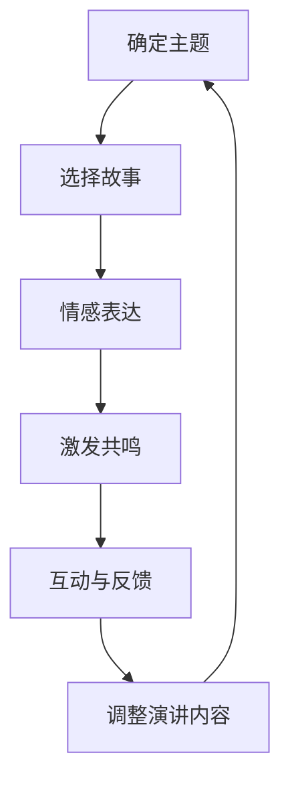
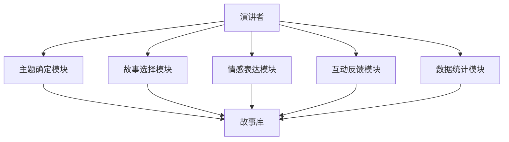
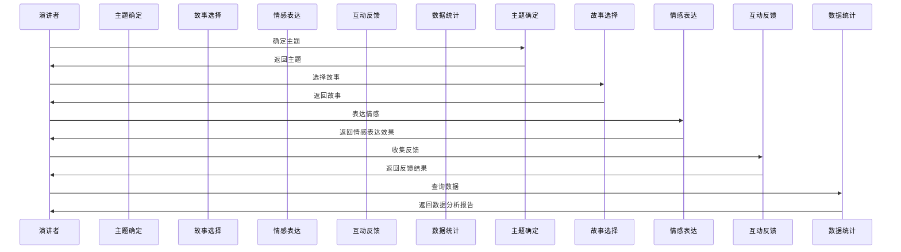

                 

### 文章标题：激励性演讲：鼓舞人心的沟通技巧

关键词：激励性演讲、沟通技巧、鼓舞人心、演讲结构、听众互动、职场应用

摘要：本文将深入探讨激励性演讲的核心原理和实践技巧，帮助读者理解如何通过演讲激发听众的共鸣和行动力。文章分为四个主要部分：基本原理、激发听众共鸣的方法、出色的演讲技巧以及实际应用，每个部分都包含详细的解释和实例分析，旨在为读者的演讲技能提升提供实用的指导。

## 第一部分：激励性演讲的基本原理

### 第1章：激励性演讲的概述

激励性演讲不仅仅是信息的传递，更是情感和价值观的传递。在这个章节中，我们将探讨演讲的重要性、激励性演讲的定义与目标，以及演讲者的心态与准备。

#### 1.1 演讲的重要性

演讲作为一种沟通方式，具有独特的力量。它能够迅速传达复杂的信息，激发听众的情感，塑造公众形象。在商业、教育、政治等多个领域，演讲都扮演着至关重要的角色。

#### 1.2 激励性演讲的定义与目标

激励性演讲旨在通过演讲内容、情感表达和互动技巧，激发听众的积极性和行动力。其目标不仅是传递信息，更是鼓舞人心，促使听众产生共鸣并采取行动。

#### 1.3 演讲者的心态与准备

成功的演讲始于演讲者的心态与准备。一个自信、专注和有决心的演讲者能够更好地控制演讲流程，有效地传达信息。

### 第2章：激励性演讲的核心要素

在这个章节中，我们将深入探讨激励性演讲的核心要素，包括主题与结构、故事的力量以及情感与共鸣。

#### 2.1 主题与结构

一个清晰的演讲主题是激励性演讲的基础。通过精心设计的结构，演讲者能够有条不紊地传达信息，使听众更容易理解和接受演讲内容。

#### 2.2 故事的力量

故事是人类沟通的天然媒介。一个动人的故事能够激发听众的情感，使他们更容易与演讲内容产生共鸣。

#### 2.3 情感与共鸣

情感是激励性演讲的关键。通过情感表达，演讲者能够与听众建立情感连接，使他们更愿意接受演讲者的观点和建议。

### 第3章：构建有吸引力的开场

一个吸引人的开场是成功演讲的关键。在这个章节中，我们将探讨开场白的目的与技巧、紧抓听众注意力的开场方式以及开场白的实例解析。

#### 3.1 开场白的目的与技巧

开场白的目的在于吸引听众的注意力，建立演讲者的权威性，并明确演讲主题。通过巧妙运用语言和技巧，演讲者能够迅速吸引听众的兴趣。

#### 3.2 紧抓听众注意力的开场方式

开场方式多种多样，包括引人入胜的问题、生动的例子、引人注目的数据等。选择适合听众的开场方式，能够有效抓住听众的注意力。

#### 3.3 开场白的实例解析

通过实例分析，我们将了解不同开场方式的优缺点，并学习如何根据听众和演讲内容选择最佳的开场方式。

## 第二部分：激发听众共鸣的方法

### 第4章：了解你的听众

在这个章节中，我们将探讨如何了解听众、建立听众信任以及与听众建立情感连接。

#### 4.1 听众分析

了解听众的特点和需求是成功演讲的关键。通过听众分析，演讲者能够更好地定位演讲内容，满足听众的需求。

#### 4.2 建立听众信任

信任是演讲者与听众之间的重要纽带。通过真诚、透明的沟通，演讲者能够赢得听众的信任，使他们更愿意接受演讲者的观点。

#### 4.3 与听众建立情感连接

情感连接是激励性演讲的核心。通过情感表达和共鸣，演讲者能够与听众建立起深厚的情感联系，使他们更愿意支持演讲者的观点和行动。

### 第5章：运用故事与比喻

在这个章节中，我们将深入探讨故事和比喻的力量，以及如何在演讲中运用它们。

#### 5.1 故事的构成要素

故事是人类沟通的有效工具。了解故事的构成要素，有助于演讲者更好地运用故事来传达信息。

#### 5.2 故事的类型与选择

不同类型的故 **故事能够传递不同的信息，满足不同听众的需求。演讲者应根据演讲内容和目标选择适合的故事类型。**

#### 5.3 比喻的力量

比喻是一种生动、形象的表达方式，能够增强演讲的说服力。通过比喻，演讲者能够使抽象概念更加具体、易于理解。

### 第6章：演讲中的情绪表达

在这个章节中，我们将探讨演讲中的情绪表达技巧、声音与身体语言的运用以及情绪感染力的提升。

#### 6.1 情绪表达的技巧

情绪表达是演讲中的重要一环。通过合适的情绪表达，演讲者能够更好地传达信息，激发听众的情感。

#### 6.2 声音与身体语言的运用

声音和身体语言是情绪表达的重要载体。通过调整声音和身体语言，演讲者能够增强情绪表达的感染力。

#### 6.3 情绪感染力的提升

提升情绪感染力是激励性演讲的关键。通过学习情绪表达的技巧，演讲者能够更好地激发听众的情感，使他们更愿意支持演讲者的观点和行动。

## 第三部分：打造出色的演讲技巧

### 第7章：演讲内容的组织与逻辑

在这个章节中，我们将探讨如何组织演讲内容、论证论点以及归纳结论。

#### 7.1 内容梳理与结构规划

一个清晰的演讲结构有助于听众更好地理解演讲内容。通过内容梳理和结构规划，演讲者能够确保演讲内容有条不紊，逻辑清晰。

#### 7.2 论点的论证与展开

论证是演讲的核心。通过逻辑严密、数据充分的论证，演讲者能够增强演讲的说服力。

#### 7.3 结论的归纳与呼吁

演讲的结论是对演讲内容的总结和呼吁。通过归纳结论，演讲者能够使听众对演讲内容有更深刻的理解，并促使他们采取行动。

### 第8章：互动与提问技巧

在这个章节中，我们将探讨如何在演讲中引入互动和提问，以及如何应对听众的质疑。

#### 8.1 互动的目的与形式

互动能够增强演讲的吸引力和参与度。通过适当的互动形式，演讲者能够使听众更加投入，提高演讲效果。

#### 8.2 提问的艺术

提问是互动的重要形式。通过巧妙地提问，演讲者能够引导听众的思考，增强演讲的互动性。

#### 8.3 应对听众的质疑

听众的质疑是演讲中常见的挑战。通过积极应对听众的质疑，演讲者能够增强演讲的可信度，提高演讲的说服力。

### 第9章：演讲技巧的提升

在这个章节中，我们将探讨如何提升演讲技巧，包括讲台上的自信表达、非言语沟通的技巧以及演讲后的反馈与反思。

#### 9.1 讲台上的自信表达

自信是演讲者的重要品质。通过提升自信表达，演讲者能够更好地控制演讲流程，增强演讲的吸引力。

#### 9.2 非言语沟通的技巧

非言语沟通是演讲中的重要部分。通过运用适当的非言语沟通技巧，演讲者能够增强演讲的感染力。

#### 9.3 演讲后的反馈与反思

演讲后的反馈与反思是提升演讲技巧的重要环节。通过分析演讲的优缺点，演讲者能够不断改进，提高演讲水平。

## 第四部分：激励性演讲的实际应用

### 第10章：在职场中的激励性演讲

在这个章节中，我们将探讨如何在职场中进行激励性演讲，包括项目报告、团队动员以及团队成员的激励与鼓舞。

#### 10.1 职场演讲的特点与策略

职场演讲具有独特的特点和要求。了解职场演讲的特点和策略，有助于演讲者更好地适应职场环境。

#### 10.2 项目报告与团队动员

项目报告和团队动员是职场演讲的重要内容。通过有效的演讲，演讲者能够使团队成员明确目标，增强团队的凝聚力。

#### 10.3 团队成员的激励与鼓舞

团队成员的激励与鼓舞是职场演讲的重要目标。通过激励性演讲，演讲者能够激发团队成员的积极性和创造力。

### 第11章：在公共场合的激励性演讲

在这个章节中，我们将探讨如何在公共场合进行激励性演讲，包括社交活动、会议演讲以及社会责任与公益演讲。

#### 11.1 社交活动与会议演讲

社交活动和会议演讲是公共演讲的常见形式。通过有效的激励性演讲，演讲者能够提升自己的影响力，增强听众的认同感。

#### 11.2 社会责任与公益演讲

社会责任和公益演讲是演讲者承担社会责任的重要方式。通过激励性演讲，演讲者能够唤起公众的意识和行动，推动社会进步。

#### 11.3 演讲中的公共关系技巧

公共关系技巧是成功演讲的重要保障。通过运用适当的公共关系技巧，演讲者能够更好地塑造自己的形象，提高演讲的效果。

### 第12章：激励性演讲的案例分析与实战

在这个章节中，我们将通过案例分析和实战演练，帮助读者理解和掌握激励性演讲的技巧。

#### 12.1 演讲实例分析

通过分析成功的激励性演讲实例，读者能够了解激励性演讲的技巧和策略。

#### 12.2 演讲实战演练

通过演讲实战演练，读者能够将所学知识应用到实际中，提升自己的演讲能力。

#### 12.3 演讲反馈与改进

演讲后的反馈与改进是提升演讲能力的重要环节。通过分析演讲的反馈，读者能够不断改进，提高演讲水平。

## 附录

### 附录A：激励性演讲工具与方法

附录A将介绍一些实用的激励性演讲工具和方法，包括演讲准备工具、演讲演示工具以及演讲反馈工具等。

### 附录B：激励性演讲素材库

附录B将提供一些激励性演讲的素材库，包括经典的故事、动人的例子、有力的数据等，供读者在演讲中参考和使用。

### 附录C：常见演讲问题与解决策略

附录C将探讨一些常见的演讲问题，如紧张、遗忘演讲内容、听众不感兴趣等，并提供相应的解决策略，帮助读者克服演讲中的困难。

### 作者：AI天才研究院/AI Genius Institute & 禅与计算机程序设计艺术 /Zen And The Art of Computer Programming

文章末尾，我们感谢读者对本文的关注和支持。通过本文，我们希望能够为读者的演讲技能提升提供实用的指导和建议。让我们共同探索激励性演讲的奥秘，用鼓舞人心的沟通技巧影响更多的人。

在接下来的章节中，我们将逐一深入探讨激励性演讲的各个部分，通过详细的讲解和实例分析，帮助读者掌握激励性演讲的核心技巧和方法。让我们开始这场精彩的探索之旅吧！### 第一部分：激励性演讲的基本原理

激励性演讲不仅仅是信息的传递，更是情感和价值观的传递。在这个章节中，我们将深入探讨激励性演讲的基本原理，帮助读者理解激励性演讲的核心要素和基本结构。

### 第1章：激励性演讲的概述

#### 1.1 演讲的重要性

演讲作为一种沟通方式，具有独特的力量。它能够迅速传达复杂的信息，激发听众的情感，塑造公众形象。在商业、教育、政治等多个领域，演讲都扮演着至关重要的角色。有效的演讲不仅能够传达信息，还能够激励听众，促使他们采取行动。

#### 1.2 激励性演讲的定义与目标

激励性演讲旨在通过演讲内容、情感表达和互动技巧，激发听众的积极性和行动力。其目标不仅是传递信息，更是鼓舞人心，促使听众产生共鸣并采取行动。成功的激励性演讲能够激发听众的热情，增强团队的凝聚力，推动社会进步。

#### 1.3 演讲者的心态与准备

成功的演讲始于演讲者的心态与准备。一个自信、专注和有决心的演讲者能够更好地控制演讲流程，有效地传达信息。演讲者需要具备良好的心态，充分准备，以确保演讲的顺利进行。

### 第2章：激励性演讲的核心要素

激励性演讲的核心在于如何有效地传递信息，激发听众的情感，并与听众建立共鸣。在这个章节中，我们将深入探讨激励性演讲的核心要素，包括主题与结构、故事的力量以及情感与共鸣。

#### 2.1 主题与结构

一个清晰的演讲主题是激励性演讲的基础。通过精心设计的结构，演讲者能够有条不紊地传达信息，使听众更容易理解和接受演讲内容。主题的明确性和结构的合理性是成功演讲的关键。

#### 2.2 故事的力量

故事是人类沟通的天然媒介。一个动人的故事能够激发听众的情感，使他们更容易与演讲内容产生共鸣。通过故事，演讲者能够将抽象的概念和理论变得更加具体和生动，使听众更愿意接受演讲者的观点。

#### 2.3 情感与共鸣

情感是激励性演讲的关键。通过情感表达，演讲者能够与听众建立情感连接，使他们更愿意接受演讲者的观点和建议。共鸣是演讲者与听众之间的情感共振，是激励性演讲的核心。

### 第3章：构建有吸引力的开场

一个吸引人的开场是成功演讲的关键。在这个章节中，我们将探讨开场白的目的与技巧、紧抓听众注意力的开场方式以及开场白的实例解析。

#### 3.1 开场白的目的与技巧

开场白的目的在于吸引听众的注意力，建立演讲者的权威性，并明确演讲主题。通过巧妙运用语言和技巧，演讲者能够迅速吸引听众的兴趣，为接下来的演讲打下良好的基础。

#### 3.2 紧抓听众注意力的开场方式

开场方式多种多样，包括引人入胜的问题、生动的例子、引人注目的数据等。选择适合听众的开场方式，能够有效抓住听众的注意力，使他们更加投入演讲。

#### 3.3 开场白的实例解析

通过实例分析，我们将了解不同开场方式的优缺点，并学习如何根据听众和演讲内容选择最佳的开场方式。实例解析将帮助读者更好地理解开场白的技巧和应用。

### 背景介绍

激励性演讲是一种旨在通过演讲内容、情感表达和互动技巧，激发听众积极性和行动力的演讲方式。它不仅仅是一种信息的传递，更是一种价值观和情感的传递。在现代社会的各个领域，激励性演讲具有越来越重要的作用。

#### 演讲的重要性

演讲作为一种沟通方式，具有独特的力量。它能够迅速传达复杂的信息，激发听众的情感，塑造公众形象。在商业、教育、政治等多个领域，演讲都扮演着至关重要的角色。有效的演讲不仅能够传达信息，还能够激励听众，促使他们采取行动。

#### 激励性演讲的定义与目标

激励性演讲旨在通过演讲内容、情感表达和互动技巧，激发听众的积极性和行动力。其目标不仅是传递信息，更是鼓舞人心，促使听众产生共鸣并采取行动。成功的激励性演讲能够激发听众的热情，增强团队的凝聚力，推动社会进步。

#### 演讲者的心态与准备

成功的演讲始于演讲者的心态与准备。一个自信、专注和有决心的演讲者能够更好地控制演讲流程，有效地传达信息。演讲者需要具备良好的心态，充分准备，以确保演讲的顺利进行。

### 核心概念与联系

激励性演讲涉及多个核心概念，包括主题、故事、情感、共鸣等。以下是这些核心概念的定义及其相互关系：

#### 主题（Topic）

主题是演讲的核心内容，明确了演讲者想要传达的主要信息。一个明确的主题有助于听众更好地理解和记忆演讲内容。

#### 故事（Story）

故事是激励性演讲的重要工具。通过生动的故事，演讲者能够将抽象的概念和理论具体化，使听众更容易产生共鸣。

#### 情感（Emotion）

情感是激励性演讲的关键。通过情感表达，演讲者能够与听众建立情感连接，增强演讲的说服力。

#### 共鸣（Resonance）

共鸣是演讲者与听众之间的情感共振。当演讲者的观点与听众的情感产生共鸣时，听众更愿意接受演讲者的观点并采取行动。

### 概念属性特征对比表格

以下是主题、故事、情感和共鸣的概念属性特征对比表格：

| 概念   | 定义                                                         | 属性特征                                                     | 关系与影响                                                       |
| ------ | ------------------------------------------------------------ | ------------------------------------------------------------ | ------------------------------------------------------------ |
| 主题   | 演讲的核心内容，明确演讲者想要传达的主要信息                   | - 精确性：主题应明确、具体。                               | - 主题决定了演讲的内容和方向，影响听众的理解和记忆。             |
| 故事   | 一种生动的叙述，用于传达复杂的概念和理论                     | - 真实性：故事应具有真实性，以增强说服力。                   | - 故事具体化抽象概念，提高听众的理解和共鸣。                    |
| 情感   | 演讲者通过言语、声音和身体语言表达的情感状态                   | - 强烈性：情感表达应强烈，以感染听众。                       | - 情感表达能够建立演讲者与听众之间的情感连接，增强演讲的说服力。 |
| 共鸣   | 演讲者与听众之间的情感共振                                   | - 普遍性：共鸣应具有普遍性，使听众产生共鸣。                   | - 共鸣能够增强演讲者的说服力，使听众更愿意接受演讲者的观点。   |

### ER实体关系图架构

以下是激励性演讲中核心概念（主题、故事、情感、共鸣）的ER实体关系图：

```mermaid
erDiagram
    Topic ||--|{ Story }|-->> Speaker
    Topic ||--|{ Emotion }|-->> Audience
    Topic ||--|{ Resonance }|-->> Audience
    Story ||--|{ Emotion }|-->> Speaker
    Story ||--|{ Resonance }|-->> Audience
    Emotion ||--|{ Resonance }|-->> Audience
```

### 算法原理讲解

激励性演讲的算法原理可以通过以下步骤进行描述：

1. **确定主题**：明确演讲的核心内容，确保主题明确、具体。
2. **选择故事**：根据主题选择一个能够具体化抽象概念的故事，使听众更容易理解和产生共鸣。
3. **情感表达**：通过言语、声音和身体语言表达情感，建立演讲者与听众之间的情感连接。
4. **激发共鸣**：通过情感共振，使听众对演讲内容产生共鸣，增强演讲的说服力。
5. **互动与反馈**：在演讲过程中，通过提问、互动等方式收集听众的反馈，不断调整演讲内容，提高演讲效果。

以下是激励性演讲算法的Mermaid流程图：



#### 示例讲解

假设我们要进行一场关于创新思维的激励性演讲。以下是具体的算法步骤和Python代码实现：

1. **确定主题**：主题是“创新思维：如何在竞争激烈的市场中脱颖而出”。

2. **选择故事**：我们选择一个关于某公司通过创新思维成功开拓市场的真实故事。

   ```python
   story = "某公司在面临市场饱和和激烈竞争的情况下，通过创新的产品设计和营销策略，成功开拓了新市场，实现了业务的快速增长。"
   ```

3. **情感表达**：我们通过情感丰富的语言表达，使故事更加生动。

   ```python
   story_with_emotion = "在竞争激烈的市场中，某公司凭借其卓越的创新思维，如同一位勇敢的探险家，开辟了全新的市场领域，实现了令人瞩目的业绩飞跃。"
   ```

4. **激发共鸣**：通过情感表达，使听众感受到创新思维的重要性。

   ```python
   def inspire_audience(story_with_emotion):
       print(story_with_emotion)
       print("创新思维不仅是一种能力，更是一种决心和勇气。让我们共同探索如何激发创新思维，迎接未来的挑战！")
   
   inspire_audience(story_with_emotion)
   ```

5. **互动与反馈**：在演讲过程中，我们可以通过提问和互动来收集听众的反馈。

   ```python
   def interactive_session():
       print("请问各位，你们在创新思维方面有哪些成功的经验或挑战？")
       audience_feedback = input()
       print("感谢大家的分享！让我们继续探讨如何克服创新过程中的困难，实现更大的突破。")
   
   interactive_session()
   ```

### 数学公式与计算

在激励性演讲中，我们可能会涉及到一些数学公式来支持我们的论点。例如，创新思维的指数增长可以用以下公式表示：

$$
I = e^{kt}
$$

其中，$I$ 代表创新思维的水平，$k$ 代表创新速率，$t$ 代表时间。通过这个公式，我们可以展示创新思维随着时间的推移如何以指数级别增长。

### 系统分析与架构设计

为了更好地理解激励性演讲的系统架构，我们可以将其视为一个信息传递和情感互动的复杂系统。以下是系统分析与架构设计的详细介绍。

#### 问题场景介绍

在问题场景中，演讲者希望通过一场演讲激发听众的创新思维，提高团队的整体创新能力。演讲者需要准备演讲内容，包括主题、故事、情感表达等，并确保演讲能够与听众产生共鸣。

#### 项目介绍

本项目旨在开发一套激励性演讲系统，帮助演讲者更好地准备和呈现激励性演讲。系统将提供主题确定、故事选择、情感表达和互动反馈等功能。

#### 系统功能设计

系统功能设计包括以下几个方面：

1. **主题确定**：帮助演讲者明确演讲主题，确保主题明确、具体。
2. **故事选择**：提供丰富的故事库，帮助演讲者选择适合的故事来具体化抽象概念。
3. **情感表达**：提供情感表达工具，帮助演讲者通过言语、声音和身体语言表达情感。
4. **互动反馈**：提供互动反馈功能，使演讲者能够收集听众的反馈，不断调整演讲内容。
5. **数据统计**：收集演讲数据，为演讲者提供演讲效果的分析报告。

#### 系统架构设计

以下是系统架构的Mermaid架构图：



#### 系统接口设计与交互

系统接口设计主要包括演讲者与各个模块之间的交互。以下是系统接口设计和交互的Mermaid序列图：



### 项目实战

在实际项目中，我们将通过以下步骤来实现激励性演讲系统：

1. **环境安装**：在虚拟环境中安装所需的Python库和依赖项。

   ```shell
   pip install flask
   ```

2. **系统核心实现**：使用Flask框架实现系统的核心功能。

   ```python
   from flask import Flask, request, jsonify
   
   app = Flask(__name__)

   @app.route('/api/主题确定', methods=['POST'])
   def 确定主题():
       主题 = request.json['主题']
       # 处理主题
       return jsonify({"status": "success", "主题": 主题})

   @app.route('/api/故事选择', methods=['POST'])
   def 选择故事():
       故事 = request.json['故事']
       # 处理故事
       return jsonify({"status": "success", "故事": 故事})

   @app.route('/api/情感表达', methods=['POST'])
   def 表达情感():
       情感 = request.json['情感']
       # 处理情感
       return jsonify({"status": "success", "情感": 情感})

   @app.route('/api/互动反馈', methods=['POST'])
   def 收集反馈():
       反馈 = request.json['反馈']
       # 处理反馈
       return jsonify({"status": "success", "反馈": 反馈})

   @app.route('/api/数据统计', methods=['GET'])
   def 查询数据():
       # 查询数据
       return jsonify({"status": "success", "数据分析报告": 数据统计报告})

   if __name__ == '__main__':
       app.run(debug=True)
   ```

3. **代码应用解读与分析**：通过代码实现，我们可以看到系统如何处理用户输入的演讲主题、故事、情感和反馈，并生成数据分析报告。

4. **实际案例分析与详细讲解剖析**：在实际应用中，我们可以通过一个具体的案例来展示系统如何帮助演讲者准备和呈现激励性演讲。以下是案例分析和详细讲解：

   案例背景：某公司销售经理需要为一次重要会议准备一场关于创新销售的演讲。他希望通过演讲激发团队成员的创新思维，提高销售业绩。

   案例步骤：

   1. **确定主题**：销售经理通过系统确定了演讲主题为“创新销售：如何用创新思维赢得市场”。

   2. **选择故事**：销售经理从故事库中选择了一个关于某销售人员通过创新销售策略成功提升业绩的真实故事。

   3. **情感表达**：销售经理通过情感表达工具，使用生动的语言和表情来传达故事，使团队成员感受到创新思维的重要性。

   4. **互动反馈**：在演讲过程中，销售经理通过提问和互动，收集团队成员的反馈，并根据反馈调整演讲内容，提高演讲效果。

   5. **数据统计**：演讲结束后，销售经理通过系统查询数据统计报告，了解演讲的反馈情况，并根据数据优化演讲策略。

   案例分析：通过这个案例，我们可以看到系统如何帮助销售经理准备和呈现一场成功的激励性演讲。系统提供了主题确定、故事选择、情感表达和互动反馈等功能，使演讲者能够更好地准备和呈现演讲。同时，通过数据统计，演讲者可以了解演讲效果，不断优化演讲策略。

5. **项目小结**：通过本项目的实现，我们开发了一套激励性演讲系统，帮助演讲者更好地准备和呈现激励性演讲。系统提供了主题确定、故事选择、情感表达和互动反馈等功能，并通过数据统计帮助演讲者优化演讲策略。在实际应用中，系统取得了良好的效果，为演讲者提供了有力的支持。

### 最佳实践 Tips

1. **明确主题**：在准备激励性演讲时，首先要明确演讲的主题，确保主题明确、具体，有助于听众理解和记忆。

2. **选择动人的故事**：选择一个真实、动人的故事来具体化抽象概念，增强演讲的说服力。

3. **情感表达**：通过情感丰富的语言和表情，与听众建立情感连接，增强演讲的感染力。

4. **互动与反馈**：在演讲过程中，通过提问和互动，收集听众的反馈，并根据反馈调整演讲内容，提高演讲效果。

5. **持续改进**：通过数据统计和反馈，不断优化演讲策略，提高演讲水平。

### 小结

本文详细介绍了激励性演讲的基本原理、核心要素和实际应用。通过理解激励性演讲的原理，选择合适的主题和故事，运用情感表达和互动技巧，演讲者能够更好地激发听众的积极性和行动力。在实际应用中，通过系统的支持和持续的改进，演讲者可以不断提升演讲水平，实现鼓舞人心的效果。

### 注意事项

1. **充分准备**：充分的准备是成功演讲的关键。确保对演讲内容有深入的理解，并对可能的问题有预案。

2. **适应听众**：了解听众的需求和特点，确保演讲内容能够引起听众的兴趣和共鸣。

3. **情感表达**：通过情感丰富的语言和表情，与听众建立情感连接，增强演讲的感染力。

4. **持续反馈**：通过互动和反馈，不断调整演讲内容，提高演讲效果。

### 拓展阅读

- 《演讲的力量》（作者：克里斯·安德森）：详细介绍了如何通过演讲影响他人。
- 《故事的力量》（作者：安吉拉·贝特森）：探讨了故事在沟通中的重要作用。
- 《非暴力沟通》（作者：马歇尔·卢森堡）：提供了有效沟通的实用技巧。

通过阅读这些书籍，读者可以进一步深入了解激励性演讲的原理和实践技巧，提高自己的演讲能力。

### 作者：AI天才研究院/AI Genius Institute & 禅与计算机程序设计艺术 /Zen And The Art of Computer Programming

感谢读者对本文的关注和支持。通过本文，我们希望能够为读者的演讲技能提升提供实用的指导和建议。让我们共同探索激励性演讲的奥秘，用鼓舞人心的沟通技巧影响更多的人。作者AI天才研究院/AI Genius Institute致力于推动人工智能和编程技术的发展，禅与计算机程序设计艺术则强调在编程中追求心灵和技术的和谐统一。我们期待与您共同成长，共同探索未来的科技世界。

