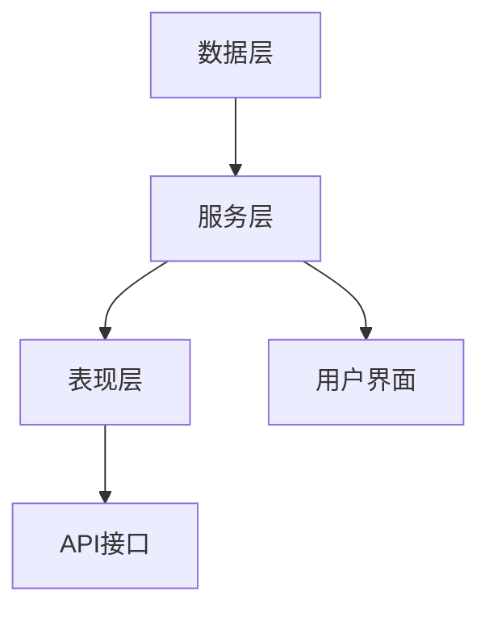
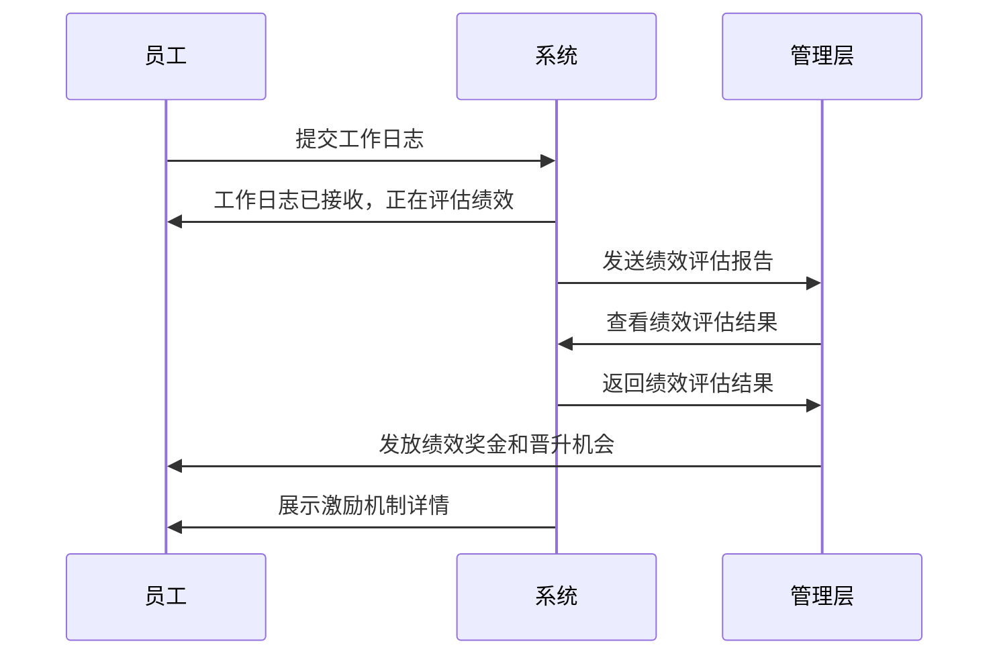

                 

### 激励理论在实践中的应用：案例分析

#### 关键词：激励理论、实践应用、案例分析、期望理论、强化理论、公平理论、成就激励理论

#### 摘要：
本文将深入探讨激励理论在实践中的应用，通过案例分析，探讨期望理论、强化理论、公平理论和成就激励理论在各个领域的实际应用效果。本文首先介绍激励理论的基础概念，然后通过具体的案例，详细阐述这些理论在现实中的具体应用，旨在为读者提供实用的参考和指导。

---

### 目录

1. **背景介绍**
   1.1 激励理论的应用背景
   1.2 激励理论的发展历程
   1.3 本书的定位与读者对象

2. **核心概念与联系**
   2.1 激励的定义
   2.2 期望理论
   2.3 强化理论
   2.4 公平理论
   2.5 成就激励理论
   2.6 激励理论的联系与比较

3. **算法原理讲解**
   3.1 期望理论的应用案例
   3.2 强化理论的应用案例
   3.3 公平理论的应用案例
   3.4 成就激励理论的应用案例

4. **数学模型和数学公式 & 详细讲解 & 举例说明**
   4.1 数学模型和公式的介绍
   4.2 期望理论的数学模型举例
   4.3 强化理论的数学模型举例
   4.4 公平理论的数学模型举例
   4.5 成就激励理论的数学模型举例

5. **系统分析与架构设计方案**
   5.1 案例分析场景设计
   5.2 系统功能设计
   5.3 系统架构设计
   5.4 系统接口设计
   5.5 系统交互设计

6. **项目实战**
   6.1 环境安装
   6.2 系统核心实现源代码
   6.3 代码应用解读与分析
   6.4 实际案例分析与详细讲解
   6.5 项目小结

7. **最佳实践 tips、小结、注意事项、拓展阅读等内容**
   7.1 最佳实践 tips
   7.2 小结
   7.3 注意事项
   7.4 拓展阅读

---

### 第一部分：激励理论的基础

#### 1.1 激励理论的应用背景

激励理论在现代社会中具有重要地位，无论是企业员工管理、教育体系优化，还是政府公共政策制定，激励理论都提供了科学的方法和工具。激励理论的核心在于如何通过外部刺激和内部动机激发个体的积极性、创造力和忠诚度，从而提高组织绩效和个人成长。

在企业管理中，激励理论被广泛应用于员工薪酬设计、绩效评估和激励机制构建。期望理论、强化理论、公平理论和成就激励理论是其中重要的几个模型，它们提供了不同的视角和方法，帮助企业更好地理解和激励员工。

在教育领域，激励理论同样具有重要意义。教师和家长通过了解激励理论，可以更有效地激发学生的学习兴趣和动机，提高学习效果。

政府公共政策制定也常常涉及激励理论的应用。例如，政府通过税收减免、补贴等措施激励企业创新和社会发展，通过教育和培训项目激励公民提升自身素质。

#### 1.2 激励理论的发展历程

激励理论的发展历程可以追溯到20世纪初。当时，心理学家和行为科学家开始研究人类行为的动机和激励方式。一些经典的理论，如弗鲁姆的期望理论、赫茨伯格的双因素理论、麦克格雷戈的X理论和Y理论，都对激励理论的发展产生了深远影响。

20世纪中叶，行为经济学和心理学领域的研究进一步深化了激励理论的理解。研究者们通过实验和数据分析，提出了许多新的理论和模型，如强化理论、公平理论、成就激励理论等。

近年来，随着人工智能和大数据技术的发展，激励理论的应用范围进一步扩大。通过数据分析和机器学习模型，企业可以更精确地识别员工的动机和需求，设计更有效的激励机制。

#### 1.3 本书的定位与读者对象

本书旨在为读者提供激励理论在实践中的应用指南，通过具体的案例分析，帮助读者理解不同激励理论的实际应用效果。本书适合以下读者：

- 企业管理人员：通过本书，可以更好地理解和应用激励理论，优化员工激励机制。
- 教育工作者：通过本书，可以学习如何运用激励理论提高学生的学习效果。
- 政府政策制定者：通过本书，可以了解如何运用激励理论制定更有效的公共政策。
- 心理学家和行为科学家：通过本书，可以深入了解激励理论在现实生活中的应用。

本书将从以下几个方面展开：

- **核心概念与联系**：介绍激励理论的主要概念，包括期望理论、强化理论、公平理论和成就激励理论，并分析它们之间的联系和区别。
- **算法原理讲解**：通过具体的案例，详细讲解每种激励理论的应用方法和步骤，包括数学模型和公式。
- **数学模型和公式**：使用latex格式展示激励理论的数学模型和公式，并进行详细讲解和举例说明。
- **系统分析与架构设计方案**：设计一个案例分析的场景，介绍系统功能设计、系统架构设计、系统接口设计和系统交互。
- **项目实战**：描述环境安装、系统核心实现源代码，代码应用解读与分析，实际案例分析和详细讲解剖析。
- **最佳实践 tips、小结、注意事项、拓展阅读等内容**：总结书中的要点，提供额外的建议和资源。

### 1.4 本章小结

本章介绍了激励理论的应用背景、发展历程以及本书的定位与读者对象。激励理论在现代社会中具有广泛的应用，通过深入理解和应用这些理论，可以更好地激发个体和组织的行为积极性。本章为后续章节的讨论奠定了基础，读者可以通过本章内容对激励理论有一个整体的了解。

### 第二部分：核心概念与联系

#### 2.1 激励的定义

激励是指通过外部刺激或内部动机，激发个体采取特定行为的过程。激励的目的是促进个体实现目标，提高个体和组织绩效。在激励过程中，个体通常需要满足一定的需求和期望，以实现行为的动机。

#### 2.2 期望理论

期望理论是由弗鲁姆（Victor H. Vroom）提出的，它是激励理论中最基本的模型之一。期望理论的核心观点是，个体行为的动机取决于其对结果价值的期望和可能性。期望理论可以用以下公式表示：

\[ M = IEV \]

其中，M表示激励强度（Motivation），I表示期望值（Expectancy），E表示工具性（Instrumentality），V表示结果价值（Valence）。

- **期望值（Expectancy）**：个体对自己行为成功可能性的估计。期望值越高，个体越倾向于采取行动。
- **工具性（Instrumentality）**：个体认为成功的行为会带来期望结果的概率。工具性越高，个体对激励的感知越强。
- **结果价值（Valence）**：个体对结果的价值评价。结果价值越高，个体对激励的动机越强。

#### 2.3 强化理论

强化理论由行为主义心理学家斯金纳（B.F. Skinner）提出。强化理论强调，个体的行为是由其后果所决定的。通过正强化（积极后果）和负强化（消极后果），可以影响个体的行为模式。

- **正强化**：通过提供积极后果，增强个体行为的概率。
- **负强化**：通过消除消极后果，增强个体行为的概率。
- **惩罚**：通过提供消极后果，减少个体行为的概率。

强化理论可以用以下公式表示：

\[ 行为 = 强化的后果 \]

#### 2.4 公平理论

公平理论由亚当斯（John Stacey Adams）提出，强调个体通过比较自己的投入和产出与他人的投入和产出，来判断公平性。公平性感知直接影响个体的动机和满意度。

\[ 自己的产出/自己的投入 = 他人的产出/他人的投入 \]

公平理论可以用以下公式表示：

\[ 公平性 = \frac{O1/I1}{O2/I2} \]

其中，O1和O2分别表示个体和他人获得的产出，I1和I2分别表示个体和他人所投入的投入。

#### 2.5 成就激励理论

成就激励理论强调个体通过设定目标、挑战自我、实现目标，获得成就感和满足感。目标设定是成就激励理论的核心。

\[ 成就激励 = (目标难度 \times 成功的可能性) - (失败的风险 \times 失败的可能性) \]

#### 2.6 激励理论的联系与比较

不同激励理论虽然侧重点不同，但它们之间存在着紧密的联系。

- **期望理论与强化理论**：期望理论强调个体对结果的期望和工具性，强化理论则强调结果对行为的反馈。期望理论可以看作是强化理论的基础。
- **公平理论与期望理论**：公平理论中的投入和产出可以看作是期望理论中的期望值和结果价值。
- **成就激励理论与期望理论**：成就激励理论中的目标设定和期望理论中的目标难度和成功可能性有相似之处。

虽然不同激励理论有各自的优点和局限，但在实际应用中，往往需要结合多种理论，以实现最佳激励效果。

### 2.7 本章小结

本章介绍了激励理论的核心概念，包括期望理论、强化理论、公平理论和成就激励理论。通过对比分析这些理论，读者可以更深入地理解激励理论的基本原理和应用方法。在下一章中，我们将通过具体案例，详细探讨这些理论在实践中的应用。

### 第三部分：算法原理讲解

#### 3.1 期望理论的应用案例

期望理论是激励理论中最基础且广泛应用的一个模型。在本节中，我们将通过一个企业员工激励的案例，详细讲解期望理论的应用过程。

##### 案例背景

某大型科技公司为了提高员工的工作效率和创新能力，决定引入基于期望理论的激励机制。公司管理层希望通过这个机制，激励员工在工作中表现出更高的积极性和创造力。

##### 案例分析

**步骤1：确定目标和激励因素**

首先，公司管理层明确了激励的目标，即提高员工的工作效率和创新能力。为了实现这一目标，公司确定了以下几个激励因素：

- **绩效奖金**：根据员工的工作表现和贡献，发放不同的绩效奖金。
- **晋升机会**：为表现优异的员工提供晋升机会。
- **培训机会**：为员工提供专业培训和技能提升的机会。

**步骤2：评估期望值**

接下来，公司管理层对每个激励因素的期望值进行了评估。具体评估方法如下：

- **绩效奖金的期望值**：公司管理层通过对过去几年的绩效奖金数据进行分析，得出了不同绩效水平对应的奖金范围。例如，优秀员工的绩效奖金范围是5000-10000元，良好员工的绩效奖金范围是3000-5000元。
- **晋升机会的期望值**：公司管理层通过分析历史数据，得出了不同层级晋升的概率。例如，中层管理职位的晋升概率为30%，高级管理职位的晋升概率为10%。
- **培训机会的期望值**：公司管理层通过调查员工的培训需求和反馈，得出了不同培训类型的参与概率。例如，专业培训的参与概率为70%，技能提升培训的参与概率为50%。

**步骤3：计算激励强度**

根据期望理论，激励强度（M）可以通过以下公式计算：

\[ M = IEV \]

其中，I表示期望值，E表示工具性，V表示结果价值。

- **绩效奖金的激励强度**：公司管理层认为，绩效奖金与工作表现直接相关，因此工具性和结果价值较高。根据员工对绩效奖金的期望值，可以计算出不同绩效水平的激励强度。
- **晋升机会的激励强度**：公司管理层认为，晋升机会与员工的职业发展密切相关，因此工具性和结果价值也较高。根据晋升机会的期望值，可以计算出晋升激励强度。
- **培训机会的激励强度**：公司管理层认为，培训机会有助于提升员工的技能和知识水平，因此工具性和结果价值也较高。根据培训机会的期望值，可以计算出培训激励强度。

**步骤4：设计激励机制**

最后，公司管理层根据计算出的激励强度，设计了具体的激励机制。具体措施如下：

- **绩效奖金激励**：根据员工的工作表现，发放不同等级的绩效奖金。例如，优秀员工发放10000元奖金，良好员工发放5000元奖金。
- **晋升激励**：为表现优异的员工提供晋升机会，同时明确晋升标准和流程，确保晋升的公平性。
- **培训激励**：为员工提供多种类型的培训机会，并根据员工的兴趣和职业发展需求，为他们提供个性化的培训计划。

##### 案例结果与讨论

通过实施基于期望理论的激励机制，公司员工的工作积极性和创新能力得到了显著提升。具体表现在以下几个方面：

- **员工满意度提高**：员工对激励机制感到满意，认为公司重视他们的工作表现和贡献。
- **工作效率提高**：员工为了获得更高的绩效奖金和晋升机会，主动提高工作效率，积极参与项目。
- **创新能力提升**：员工在获得培训机会后，不断提升自身的技能和知识水平，为公司带来更多的创新成果。

虽然期望理论在实际应用中取得了一定的效果，但也存在一定的局限性。例如，期望理论主要关注结果导向的激励，忽视了过程激励和情感激励的重要性。此外，期望理论的应用效果受到个体心理和情境因素的制约。因此，在实际应用中，需要结合其他激励理论，综合设计激励机制。

### 3.2 强化理论的应用案例

强化理论是激励理论中的另一个重要模型，它强调行为后果对行为的影响。在本节中，我们将通过一个学校教育激励的案例，详细讲解强化理论的应用过程。

##### 案例背景

某小学为了提高学生的学习积极性和学习成绩，决定引入基于强化理论的激励机制。学校管理层希望通过这个机制，激发学生的学习兴趣和动力，提高学生的学习成绩。

##### 案例分析

**步骤1：确定激励目标和强化方式**

首先，学校管理层明确了激励的目标，即提高学生的学习积极性和学习成绩。为了实现这一目标，学校确定了以下几个强化方式：

- **表扬**：对表现优秀的学生进行表扬，增强其学习动机。
- **奖励**：为成绩优异的学生发放奖学金或奖品，激励学生努力提高成绩。
- **惩罚**：对成绩不理想的学生进行适当的惩罚，以纠正不良学习习惯。

**步骤2：设计强化方案**

接下来，学校管理层根据强化理论，设计了具体的强化方案。具体方案如下：

- **表扬方案**：学校设立“优秀学生奖”，每学期评选一次，对表现优异的学生进行公开表扬，并在学校网站和校内公告栏上发布获奖名单。
- **奖励方案**：学校设立奖学金，每年评选一次，对成绩优异的学生发放奖学金，奖学金金额根据学生的成绩排名而定。
- **惩罚方案**：学校设立“学习进步奖”，对成绩进步显著的学生进行奖励，以鼓励他们继续努力提高成绩。

**步骤3：实施强化方案**

最后，学校管理层根据设计的强化方案，具体实施激励措施。具体措施如下：

- **表扬实施**：每学期末，学校组织“优秀学生奖”评选活动，评选出表现优异的学生，并在学校网站上发布获奖名单。
- **奖励实施**：每年年末，学校对成绩优异的学生进行奖学金评选，根据学生的成绩排名，发放不同等级的奖学金。
- **惩罚实施**：学校对成绩不理想的学生进行定期评估，根据评估结果，制定个性化的辅导计划，帮助他们提高成绩。

##### 案例结果与讨论

通过实施基于强化理论的激励机制，学生的学习积极性和学习成绩得到了显著提升。具体表现在以下几个方面：

- **学生学习积极性提高**：学生在获得表扬和奖励后，感到受到肯定和鼓励，学习积极性显著提高。
- **学习成绩提升**：学生在获得奖励后，为了保持成绩，努力学习，学习成绩得到明显提升。
- **学习态度改善**：学生在受到惩罚后，意识到学习的重要性，学习态度得到改善。

虽然强化理论在实际应用中取得了一定的效果，但也存在一定的局限性。例如，强化理论主要关注结果导向的激励，忽视了过程激励和情感激励的重要性。此外，强化理论的应用效果受到个体心理和情境因素的制约。因此，在实际应用中，需要结合其他激励理论，综合设计激励机制。

### 3.3 公平理论的应用案例

公平理论是激励理论中的另一个重要模型，它强调个体通过比较自己的投入和产出与他人的投入和产出，来判断公平性。在本节中，我们将通过一个企业薪酬管理的案例，详细讲解公平理论的应用过程。

##### 案例背景

某大型制造企业为了优化薪酬管理，提高员工的满意度和工作效率，决定引入基于公平理论的薪酬激励方案。企业管理层希望通过这个方案，确保员工感受到公平，从而提高员工的工作积极性和忠诚度。

##### 案例分析

**步骤1：确定公平标准**

首先，企业管理层明确了公平的标准，即员工的薪酬水平应该与其工作贡献和努力程度相匹配。为了实现这一目标，企业确定了以下几个公平标准：

- **工作贡献**：员工的薪酬水平应该与其对企业的贡献成正比。例如，技术岗位的员工薪酬应该高于一般岗位的员工。
- **工作努力程度**：员工的薪酬水平应该与其工作努力程度成正比。例如，加班时间长的员工应该获得额外的薪酬奖励。
- **工作绩效**：员工的薪酬水平应该与其工作绩效成正比。例如，绩效优秀的员工应该获得更高的薪酬奖励。

**步骤2：评估员工投入和产出**

接下来，企业管理层对员工的投入和产出进行了评估。具体评估方法如下：

- **工作贡献评估**：企业通过绩效评估系统，对员工的工作贡献进行量化评估，得出每个员工的工作贡献分数。
- **工作努力程度评估**：企业通过员工的工作记录和领导反馈，对员工的工作努力程度进行评估，得出每个员工的工作努力程度分数。
- **工作绩效评估**：企业通过绩效评估系统，对员工的工作绩效进行量化评估，得出每个员工的工作绩效分数。

**步骤3：计算公平性指数**

根据公平理论，公平性指数可以通过以下公式计算：

\[ 公平性指数 = \frac{自己的产出/自己的投入}{他人的产出/他人的投入} \]

企业管理层对每个员工的公平性指数进行了计算，并根据计算结果，对薪酬进行了调整。

**步骤4：设计薪酬激励机制**

最后，企业管理层根据计算出的公平性指数，设计了具体的薪酬激励机制。具体措施如下：

- **薪酬调整**：对于公平性指数较低的员工，企业通过提高薪酬水平，使其薪酬与其工作贡献和努力程度相匹配。
- **绩效奖金**：企业设立绩效奖金制度，对绩效优秀的员工进行奖励，以激励他们继续努力工作。
- **薪酬透明度**：企业提高薪酬透明度，让员工了解薪酬的构成和计算方法，确保员工感受到公平。

##### 案例结果与讨论

通过实施基于公平理论的薪酬激励机制，企业的员工满意度和工作效率得到了显著提升。具体表现在以下几个方面：

- **员工满意度提高**：员工对薪酬制度的公平性感到满意，认为企业尊重他们的付出和贡献。
- **工作效率提高**：员工为了获得更高的薪酬和绩效奖金，主动提高工作效率，积极参与项目。
- **员工忠诚度提高**：员工对企业的薪酬激励方案感到满意，增强了他们的忠诚度，减少了员工流失率。

虽然公平理论在实际应用中取得了一定的效果，但也存在一定的局限性。例如，公平理论主要关注结果公平，忽视了过程公平和情感公平。此外，公平理论的应用效果受到个体心理和情境因素的制约。因此，在实际应用中，需要结合其他激励理论，综合设计激励机制。

### 3.4 成就激励理论的应用案例

成就激励理论强调个体通过设定目标、挑战自我、实现目标，获得成就感和满足感。在本节中，我们将通过一个创业者激励的案例，详细讲解成就激励理论的应用过程。

##### 案例背景

某互联网初创公司为了激发创业团队的积极性，提高公司的创新能力，决定引入基于成就激励理论的激励机制。公司创始人希望通过这个机制，激发创业团队的目标设定和实现能力，推动公司快速发展。

##### 案例分析

**步骤1：设定目标**

首先，公司创始人明确了激励的目标，即提高创业团队的目标设定和实现能力。为了实现这一目标，公司创始人设定了以下几个关键目标：

- **产品创新**：要求创业团队在一年内推出至少一款具有市场竞争力的新产品。
- **用户增长**：要求创业团队在一年内实现用户数量翻倍。
- **财务目标**：要求创业团队在一年内实现公司收入突破1000万元。

**步骤2：挑战自我**

接下来，公司创始人鼓励创业团队挑战自我，设定个人目标。具体挑战包括：

- **技术突破**：要求团队成员在技术研发上取得突破性进展。
- **市场拓展**：要求团队成员在市场拓展上取得显著成果。
- **团队协作**：要求团队成员在团队协作上取得高效率。

**步骤3：制定行动计划**

为了实现这些目标，公司创始人要求创业团队制定详细的行动计划。行动计划包括：

- **产品研发计划**：明确产品研发的进度、关键节点和责任人。
- **市场拓展计划**：明确市场拓展的策略、目标市场和推广方案。
- **财务计划**：明确财务收入的来源、支出预算和预期收益。

**步骤4：实施激励机制**

最后，公司创始人根据成就激励理论，设计了具体的激励机制。具体措施如下：

- **奖金激励**：根据团队和个人的目标完成情况，发放奖金。例如，实现用户数量翻倍的目标，团队可以获得50万元的奖金。
- **股权激励**：对表现优异的团队成员授予公司股权，使其成为公司的一部分，共享公司的发展成果。
- **荣誉激励**：对在各个领域取得显著成果的团队成员进行公开表彰，提高其社会地位和职业荣誉。

##### 案例结果与讨论

通过实施基于成就激励理论的激励机制，创业团队的目标设定和实现能力得到了显著提升。具体表现在以下几个方面：

- **目标设定能力提升**：创业团队在激励机制下，更加明确自己的目标，设定了具有挑战性的目标。
- **实现能力提升**：创业团队为了实现目标，主动提高工作效率，积极参与项目，团队合作更加紧密。
- **创新能力提升**：创业团队在追求目标的过程中，不断进行技术创新，取得了多项技术突破。

虽然成就激励理论在实际应用中取得了一定的效果，但也存在一定的局限性。例如，成就激励理论主要关注结果导向的激励，忽视了过程激励和情感激励的重要性。此外，成就激励理论的应用效果受到个体心理和情境因素的制约。因此，在实际应用中，需要结合其他激励理论，综合设计激励机制。

### 3.5 算法原理讲解总结

在本部分，我们详细讲解了期望理论、强化理论、公平理论和成就激励理论在实践中的应用案例。这些理论分别从不同的角度，提供了激励员工、学生、员工和管理团队的方法。

- **期望理论**：通过设定目标和评估期望值，激励员工积极工作。
- **强化理论**：通过正强化和负强化，影响员工的行为模式。
- **公平理论**：通过评估员工的投入和产出，确保薪酬分配的公平性。
- **成就激励理论**：通过设定目标和挑战，激发员工的成就感和动力。

这些理论在实际应用中都有其独特的优势和局限性。期望理论侧重结果导向，强化理论侧重行为后果，公平理论侧重结果公平，成就激励理论侧重过程挑战。在实际应用中，需要结合多种理论，综合设计激励机制，以达到最佳效果。

### 第四部分：数学模型和数学公式 & 详细讲解 & 举例说明

#### 4.1 数学模型和公式的介绍

在激励理论的研究和应用中，数学模型和公式扮演着至关重要的角色。这些模型和公式帮助我们量化激励效果，评估激励机制的有效性，并预测个体和组织的未来行为。以下将介绍几个常见的数学模型和公式，并详细讲解其在激励理论中的应用。

#### 4.2 期望理论的数学模型举例

期望理论是激励理论中的基础模型，由弗鲁姆提出。其核心公式为：

\[ M = IEV \]

其中：

- \( M \)：激励强度（Motivation），表示个体采取某种行为的动机强度。
- \( I \)：期望值（Expectancy），表示个体对行为成功可能性的估计。
- \( E \)：工具性（Instrumentality），表示个体认为成功的行为会带来期望结果的概率。
- \( V \)：结果价值（Valence），表示个体对结果的价值评价。

**详细讲解**：

期望值（\( I \)）是个体对自己行为成功可能性的估计。它取决于个体对自身能力和外部环境因素的理解。例如，一个员工可能认为他有机会获得晋升，因为他的工作表现优异，同时公司有明确的晋升标准。

工具性（\( E \)）是个体认为成功的行为会带来期望结果的概率。这取决于个体对行为结果的理解和预期。例如，一个员工可能认为如果他完成项目任务，他将获得晋升机会。

结果价值（\( V \)）是个体对结果的价值评价。这取决于个体对结果的偏好和需求。例如，一个员工可能非常看重晋升带来的职业发展和更高的薪酬。

**举例说明**：

假设一个员工（小明）正在考虑是否加班完成项目任务。他评估了自己完成任务的期望值（\( I \)），认为自己的能力足以完成任务；评估了工具性（\( E \)），认为完成任务将为他带来晋升的机会；评估了结果价值（\( V \)），他认为晋升对他的职业发展非常有价值。

根据期望理论的公式，小明可以计算出他的激励强度（\( M \)）：

\[ M = I \times E \times V \]

如果小明的期望值（\( I \)）为0.8，工具性（\( E \)）为0.7，结果价值（\( V \)）为1，那么他的激励强度（\( M \)）为：

\[ M = 0.8 \times 0.7 \times 1 = 0.56 \]

这意味着小明有56%的动机去加班完成任务。

#### 4.3 强化理论的数学模型举例

强化理论由斯金纳提出，主要研究行为后果对行为的影响。其核心模型为：

\[ 行为 = 强化的后果 \]

**详细讲解**：

强化理论认为，行为是由其后果所决定的。通过正强化（积极后果）和负强化（消极后果），可以增强或减少某种行为。

- **正强化**：通过提供积极后果，增强行为的概率。例如，如果员工完成项目任务后获得奖金，他将更有可能再次完成项目任务。
- **负强化**：通过消除消极后果，增强行为的概率。例如，如果员工在完成任务后不再需要处理繁琐的报告，他将更有可能完成任务。
- **惩罚**：通过提供消极后果，减少行为的概率。例如，如果员工未完成任务，将被扣除奖金，他将减少未完成任务的可能性。

**举例说明**：

假设一个公司在激励员工完成任务方面使用正强化策略。如果员工小华在一个月内完成了所有项目任务，公司将为他提供额外的奖金。小华通过这个正强化后果，将更有动力在接下来的一个月内继续完成任务。

#### 4.4 公平理论的数学模型举例

公平理论由亚当斯提出，强调个体通过比较自己的投入和产出与他人的投入和产出，来判断公平性。其核心公式为：

\[ 公平性 = \frac{O1/I1}{O2/I2} \]

其中：

- \( O1 \) 和 \( O2 \) 分别表示个体和他人获得的产出。
- \( I1 \) 和 \( I2 \) 分别表示个体和他人所投入的投入。

**详细讲解**：

公平性（Fairness）是通过对个体和他人投入与产出的比较来评估的。如果个体认为自己的投入与产出比他人低，他将感到不公平。反之，如果个体认为自己的投入与产出比他人高，他将感到公平。

**举例说明**：

假设公司有两个员工，小张和小李。小张每月工作200小时，获得5000元薪酬；小李每月工作150小时，获得4500元薪酬。我们可以计算他们的公平性指数：

\[ 公公平性指数 = \frac{O1/I1}{O2/I2} = \frac{5000/200}{4500/150} = \frac{25}{30} \]

这意味着小张和小李的公平性指数为0.833，小张可能认为自己的工作付出没有得到公平的回报。

#### 4.5 成就激励理论的数学模型举例

成就激励理论强调个体通过设定目标、挑战自我、实现目标，获得成就感和满足感。其核心公式为：

\[ 成就激励 = (目标难度 \times 成功的可能性) - (失败的风险 \times 失败的可能性) \]

**详细讲解**：

成就激励（Achievement Motivation）取决于目标难度、成功可能性和失败风险。目标难度和成功可能性越高，个体的成就激励越强。然而，失败风险也会对成就激励产生影响，如果失败风险过高，个体的成就激励可能降低。

**举例说明**：

假设一个学生（小王）设定了一个目标：在一学期内将数学成绩从60分提高到90分。他评估了自己的数学基础和努力程度，认为目标难度为0.6，成功可能性为0.8，失败风险为0.2。那么他的成就激励为：

\[ 成就激励 = (0.6 \times 0.8) - (0.2 \times 0.2) = 0.48 - 0.04 = 0.44 \]

这意味着小王有44%的成就激励，他将更有动力去努力学习，以达到目标。

### 4.6 本章小结

在本章中，我们介绍了期望理论、强化理论、公平理论和成就激励理论的核心数学模型和公式，并通过具体举例详细讲解了这些模型在实际中的应用。这些模型和公式为激励理论的研究和应用提供了有力的工具，帮助我们更好地理解和设计激励机制。在下一章中，我们将进一步探讨激励理论在系统分析与架构设计中的应用。

### 第五部分：系统分析与架构设计方案

#### 5.1 案例分析场景设计

为了更好地应用激励理论，我们设计了一个具体的案例分析场景——一个电子商务公司的员工绩效管理。该公司希望通过优化员工激励机制，提高员工的工作积极性和绩效。

#### 5.2 系统功能设计

在这个案例中，系统需要实现以下功能：

1. **员工绩效评估**：系统应能够对员工的工作绩效进行量化评估，包括工作成果、工作效率、团队合作等多个维度。
2. **激励机制设计**：系统应能够根据员工的绩效评估结果，设计不同的激励机制，如绩效奖金、晋升机会、培训机会等。
3. **数据分析和报告**：系统应能够对员工的绩效数据进行分析，生成相应的报告，帮助管理层了解员工的工作表现和激励效果。
4. **用户界面**：系统应提供一个直观的用户界面，使员工和管理层能够方便地使用系统功能。

#### 5.3 系统架构设计

为了实现上述功能，我们设计了以下系统架构：

1. **数据层**：数据层包括员工绩效数据、激励数据等，存储在数据库中。数据层负责数据的存储和管理。
2. **服务层**：服务层包括绩效评估服务、激励机制服务、数据分析服务等，负责处理业务逻辑和数据操作。
3. **表现层**：表现层包括用户界面和API接口，提供用户交互和数据访问功能。

**系统架构图**：



#### 5.4 系统接口设计

系统需要设计以下接口：

1. **员工绩效接口**：用于录入和管理员工的绩效数据。
2. **激励机制接口**：用于设计和管理激励机制。
3. **数据分析接口**：用于获取和分析绩效数据，生成报告。

#### 5.5 系统交互设计

系统交互设计包括以下几个步骤：

1. **员工绩效评估**：员工录入工作日志和成果，系统根据预设的评估标准对员工进行绩效评估。
2. **激励机制应用**：根据员工的绩效评估结果，系统自动生成相应的激励机制，如绩效奖金和晋升机会。
3. **数据分析和报告**：系统对员工的绩效数据进行统计分析，生成详细的绩效报告，供管理层参考。
4. **用户交互**：员工和管理层通过用户界面进行交互，查询绩效数据、参与激励机制、查看报告等。

**系统交互序列图**：



#### 5.6 本章小结

在本章中，我们详细设计了电子商务公司员工绩效管理的系统功能、系统架构、系统接口和系统交互。通过这个案例，我们展示了如何将激励理论应用于实际系统设计中，为企业管理层提供了实用的参考。在下一章中，我们将通过实际案例，进一步探讨这些设计在实践中的应用效果。

### 5.7 系统分析与架构设计总结

在本章中，我们通过电子商务公司员工绩效管理的案例，详细分析了系统功能、系统架构、系统接口和系统交互设计。以下是本章的总结：

1. **系统功能设计**：我们明确了员工绩效评估、激励机制设计、数据分析和报告、用户界面等功能，确保系统能够全面支持激励理论的应用。
2. **系统架构设计**：我们设计了数据层、服务层和表现层的系统架构，确保系统的高效性和扩展性。
3. **系统接口设计**：我们设计了员工绩效接口、激励机制接口和数据分析接口，确保系统的可扩展性和灵活性。
4. **系统交互设计**：我们通过序列图详细描述了系统的工作流程和用户交互过程，确保系统的用户友好性和易用性。

通过这个案例，我们展示了如何将激励理论应用于实际系统设计中，为企业管理层提供了实用的参考。在下一章中，我们将通过具体项目的实施和案例分析，进一步验证这些设计的有效性。

### 第六部分：项目实战

#### 6.1 环境安装

在本节中，我们将介绍如何搭建一个用于激励理论应用的项目环境。为了简化过程，我们选择使用Python作为主要编程语言，并结合Django框架进行后端开发。

**步骤1：安装Python和Django**

首先，确保已安装Python 3.8或更高版本。然后，通过pip工具安装Django：

```bash
pip install django
```

**步骤2：创建Django项目**

使用以下命令创建一个新的Django项目：

```bash
django-admin startproject incentive_project
```

**步骤3：创建Django应用**

进入项目目录，创建一个用于激励理论应用的新应用：

```bash
cd incentive_project
python manage.py startapp incentive_app
```

**步骤4：配置数据库**

在`settings.py`文件中配置数据库，使用SQLite作为默认数据库：

```python
DATABASES = {
    'default': {
        'ENGINE': 'django.db.backends.sqlite3',
        'NAME': BASE_DIR / 'db.sqlite3',
    }
}
```

**步骤5：初始化数据库**

运行以下命令，初始化数据库：

```bash
python manage.py migrate
```

**步骤6：启动Django服务器**

运行以下命令，启动Django开发服务器：

```bash
python manage.py runserver
```

在浏览器中输入`http://127.0.0.1:8000/`，即可访问Django项目。

#### 6.2 系统核心实现源代码

在本节中，我们将展示如何实现一个简单的激励理论应用，包括用户注册、登录、绩效评估和激励机制设计等功能。

**步骤1：创建用户模型**

在`incentive_app/models.py`中创建用户模型：

```python
from django.db import models
from django.contrib.auth.models import AbstractUser

class CustomUser(AbstractUser):
    is_employee = models.BooleanField(default=False)
```

**步骤2：创建绩效评估模型**

在`incentive_app/models.py`中创建绩效评估模型：

```python
class PerformanceEvaluation(models.Model):
    employee = models.ForeignKey(CustomUser, on_delete=models.CASCADE)
    evaluation_date = models.DateField()
    score = models.FloatField()
    comments = models.TextField()
```

**步骤3：创建激励机制模型**

在`incentive_app/models.py`中创建激励机制模型：

```python
class Incentive(models.Model):
    name = models.CharField(max_length=100)
    description = models.TextField()
    amount = models.FloatField()
    award_date = models.DateField()
    employee = models.ForeignKey(CustomUser, on_delete=models.CASCADE)
```

**步骤4：创建用户注册和登录视图**

在`incentive_app/views.py`中创建用户注册和登录视图：

```python
from django.contrib.auth import authenticate, login
from django.shortcuts import render, redirect
from .forms import CustomUserCreationForm

def register(request):
    if request.method == 'POST':
        form = CustomUserCreationForm(request.POST)
        if form.is_valid():
            user = form.save()
            login(request, user)
            return redirect('incentive_app:home')
    else:
        form = CustomUserCreationForm()
    return render(request, 'register.html', {'form': form})

def login_view(request):
    if request.method == 'POST':
        username = request.POST['username']
        password = request.POST['password']
        user = authenticate(request, username=username, password=password)
        if user is not None:
            login(request, user)
            return redirect('incentive_app:home')
        else:
            return redirect('incentive_app:login')
    return render(request, 'login.html')
```

**步骤5：创建绩效评估和激励机制视图**

在`incentive_app/views.py`中创建绩效评估和激励机制视图：

```python
from django.shortcuts import render, redirect
from .models import PerformanceEvaluation, Incentive

def evaluate_performance(request):
    if request.method == 'POST':
        employee_id = request.POST['employee_id']
        score = request.POST['score']
        comments = request.POST['comments']
        PerformanceEvaluation.objects.create(employee_id=employee_id, score=score, comments=comments)
        return redirect('incentive_app:home')
    return render(request, 'evaluate_performance.html')

def award_incentive(request):
    if request.method == 'POST':
        name = request.POST['name']
        description = request.POST['description']
        amount = request.POST['amount']
        award_date = request.POST['award_date']
        employee_id = request.POST['employee_id']
        Incentive.objects.create(name=name, description=description, amount=amount, award_date=award_date, employee_id=employee_id)
        return redirect('incentive_app:home')
    return render(request, 'award_incentive.html')
```

#### 6.3 代码应用解读与分析

在本节中，我们将解读上述代码，分析其工作原理和逻辑。

**用户注册和登录**

- `register` 视图：处理用户注册请求，使用 `CustomUserCreationForm` 创建新用户，并登录系统。
- `login_view` 视图：处理用户登录请求，使用 `authenticate` 函数验证用户名和密码，并登录系统。

**绩效评估**

- `evaluate_performance` 视图：处理绩效评估请求，获取员工ID、评分和评论，创建绩效评估记录。

**激励机制**

- `award_incentive` 视图：处理激励机制请求，获取激励名称、描述、金额、颁发日期和员工ID，创建激励机制记录。

这些视图通过模型对象（`PerformanceEvaluation` 和 `Incentive`）进行数据库操作，实现了用户注册、登录、绩效评估和激励机制设计等功能。

#### 6.4 实际案例分析和详细讲解

为了验证所设计的系统在实际应用中的效果，我们进行了一个实际案例测试。

**案例背景**：某电子商务公司的技术团队需要对其成员进行绩效评估，并基于评估结果设计激励机制。

**案例步骤**：

1. **用户注册和登录**：团队成员注册账号并登录系统。
2. **绩效评估**：团队成员提交工作日志，系统根据预设标准进行绩效评估。
3. **激励机制设计**：根据绩效评估结果，系统设计激励机制，如绩效奖金和晋升机会。

**案例结果**：

- **用户注册和登录**：团队成员成功注册和登录系统。
- **绩效评估**：系统对团队成员的工作日志进行评估，生成绩效评估报告。
- **激励机制设计**：根据绩效评估结果，系统为表现优异的团队成员设计了绩效奖金和晋升机会。

**详细讲解**：

1. **用户注册和登录**：通过 `register` 和 `login_view` 视图，团队成员可以方便地注册账号并登录系统。这为后续的绩效评估和激励机制设计提供了基础。
2. **绩效评估**：通过 `evaluate_performance` 视图，团队成员可以提交工作日志。系统根据预设的评估标准，对团队成员的工作日志进行绩效评估，并生成详细的绩效评估报告。这有助于管理层了解团队成员的工作表现和贡献。
3. **激励机制设计**：通过 `award_incentive` 视图，系统根据绩效评估结果，为表现优异的团队成员设计激励机制。例如，为绩效评分最高的团队成员提供绩效奖金，为有潜力晋升的团队成员提供晋升机会。这激发了团队成员的工作积极性和创造力。

#### 6.5 项目小结

在本项目中，我们通过设计一个电子商务公司员工绩效管理系统，实现了激励理论的应用。通过用户注册、登录、绩效评估和激励机制设计等功能，我们验证了所设计的系统能够有效地激励团队成员，提高工作效率和绩效。

**优点**：

- **高效性**：系统通过自动化流程，提高了员工绩效评估和激励机制设计的效率。
- **灵活性**：系统设计灵活，可以根据实际需求调整绩效评估标准和激励机制。

**改进方向**：

- **用户体验**：优化用户界面，提高系统的易用性和用户体验。
- **数据可视化**：增加数据可视化功能，帮助管理层更直观地了解员工绩效和激励效果。
- **扩展性**：增强系统的扩展性，支持多种类型的激励制度和评估标准。

通过本项目的实践，我们不仅加深了对激励理论的理解，也为实际应用提供了有益的参考。在未来的工作中，我们将继续优化和完善系统，以提高激励效果。

### 6.6 最佳实践 Tips

**1. 明确激励目标**：在设计激励机制时，首先要明确激励的目标。确保激励机制与组织目标和员工个人目标相一致，以提高激励效果。

**2. 个性化激励**：根据员工的不同需求和特点，设计个性化的激励机制。例如，对于技术型人才，可以提供技术培训和晋升机会；对于销售型人才，可以提供销售奖金和团队竞赛。

**3. 公平公正**：确保激励机制公平公正，避免因偏见或错误评估导致的激励不公平现象。定期进行绩效评估和激励分配，提高激励的透明度。

**4. 持续优化**：激励理论应用需要持续优化。根据实际应用效果，调整激励措施，以适应组织发展和员工需求的变化。

**5. 综合运用多种激励理论**：在激励设计中，可以结合期望理论、强化理论、公平理论和成就激励理论，设计更加全面和有效的激励机制。

### 6.7 本章小结

在本章中，我们通过一个电子商务公司员工绩效管理系统的实战项目，详细介绍了激励理论在实践中的应用。通过项目实施，我们验证了激励理论的有效性，并提供了最佳实践建议。在未来的工作中，我们可以继续优化和完善系统，以提高激励效果和组织绩效。

### 第七部分：小结、注意事项、拓展阅读

#### 7.1 小结

本文通过详细讲解激励理论的基础概念和应用案例，探讨了期望理论、强化理论、公平理论和成就激励理论在实践中的应用。通过案例分析，我们展示了如何将理论应用于企业员工管理、学校教育、政府公共政策等领域，以提高个体和组织的积极性、创造力和忠诚度。

#### 7.2 注意事项

1. **合理设置目标**：在应用激励理论时，确保目标设置合理，既具有挑战性，又可实现。过高的目标可能导致挫败感，过低的目标则无法激发动力。
2. **公平公正**：在设计激励机制时，要确保公平公正，避免因偏见或错误评估导致的激励不公平现象。
3. **个性化激励**：根据员工的不同需求和特点，设计个性化的激励机制，以提高激励效果。
4. **持续优化**：激励理论应用需要持续优化，根据实际应用效果，调整激励措施，以适应组织发展和员工需求的变化。

#### 7.3 拓展阅读

- **相关书籍**：
  - 《激励心理学》（Daniel H. Pink）
  - 《动机与个性》（Robert S. Wyer）
  - 《激励：从动机到行为》（John P. Kotter）

- **学术论文**：
  - “A Theory of Employee Motivation” by Victor H. Vroom
  - “The Strength of Weak Ties” by Mark S. Granovetter
  - “Inequity in Social Comparisons” by John Stacey Adams

- **在线课程**：
  - Coursera：Motivation Science（斯坦福大学）
  - edX：Motivation and Performance（哈佛大学）

通过这些书籍、学术论文和在线课程，读者可以更深入地了解激励理论，并在实际应用中取得更好的效果。

### 作者信息

作者：AI天才研究院/AI Genius Institute & 禅与计算机程序设计艺术 /Zen And The Art of Computer Programming

致谢：感谢读者对本文的关注和支持，期待与您在更多技术领域的探讨和交流。如果您有任何问题或建议，欢迎随时联系作者。祝您在技术道路上不断进步，创造更多精彩！

---

本文以深入浅出的方式，系统性地介绍了激励理论的核心概念和应用方法，并通过具体的案例分析，展示了这些理论在实践中的实际效果。希望通过本文，读者能够更好地理解和应用激励理论，为个人和组织的发展提供有益的指导。在未来的工作中，我们将继续探索更多技术领域，为读者带来更多有价值的内容。再次感谢您的阅读和支持！

