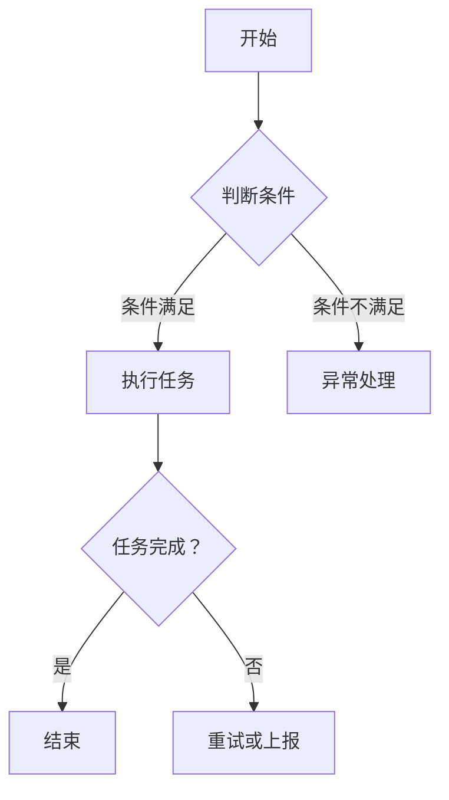

                 

## 激发团队潜力的10个秘籍

### 关键词：团队潜力、团队动力、团队绩效、管理者策略、团队成员协作

### 摘要：本文将深入探讨团队潜力激发的10个秘籍。我们将从团队动力的理论模型出发，结合管理者的视角和团队成员的实际操作，系统性地分析如何通过科学的方法和技巧来提升团队的整体表现和协作效率。文章将通过实战案例分析、最佳实践分享，以及未来展望，为读者提供实用的指导和建议。

## 第一部分：团队动力源泉

### 1. 引言：团队的潜力与重要性

#### 1.1 团队潜力概述

在当今快速变化和竞争激烈的商业环境中，团队的潜力成为企业成功的关键因素之一。团队潜力指的是团队在共同完成任务过程中所展现出的潜力，包括创新能力、协作效率、应对挑战的能力等。一个具有高度潜力的团队能够快速适应变化，高效完成复杂任务，并在竞争中脱颖而出。

#### 1.2 团队潜力的意义

团队潜力不仅仅关乎任务完成的质量和效率，更对企业文化、员工满意度和企业声誉产生深远影响。一个激发出潜力的团队能够形成积极向上的团队文化，提高员工的工作满意度和忠诚度，从而提升企业的整体竞争力和创新能力。

#### 1.3 团队潜力的影响因素

团队潜力受到多种因素的影响，包括：

1. **团队动力**：团队成员之间的互动和动力是激发潜力的关键。
2. **管理策略**：管理者对团队的领导方式和激励措施直接影响团队潜力。
3. **团队成员的能力**：团队成员的专业技能和知识水平对团队潜力的发挥至关重要。
4. **工作氛围**：积极、开放和包容的工作氛围能够激发团队成员的创造力和协作意愿。
5. **目标明确性**：明确的团队目标和方向有助于团队成员聚焦资源，提升工作效率。

### 2. 核心概念与联系

#### 2.1 团队动力模型

团队动力是指驱动团队行为和团队互动的心理和情感力量。它包括以下几个构成要素：

1. **团队目标**：共同的目标能够激发团队成员的归属感和使命感。
2. **团队成员的关系**：信任、尊重和合作的关系是团队动力的基础。
3. **激励因素**：内在激励（如自我实现）和外在激励（如奖励）共同推动团队成员的行为。
4. **团队沟通**：有效的沟通能够确保团队目标的传达和资源的共享。

#### 2.1.3 团队动力模型解析

团队动力模型是一个多维度的概念，可以通过以下公式来解析：

\[ \text{团队动力} = \text{团队目标} \times \text{团队成员关系} \times \text{激励因素} \times \text{团队沟通} \]

这个模型强调了各个要素之间的相互依赖和相互作用，任何一个要素的改变都可能对团队动力产生重要影响。

#### 2.2 团队动力与团队绩效的关系

团队动力和团队绩效之间存在着密切的联系。团队动力强，往往意味着团队成员之间有更好的协作和沟通，能够更快地应对挑战，从而提高团队绩效。团队绩效则反过来会增强团队成员的自信心和积极性，进一步促进团队动力的提升。

#### 2.2.2 团队动力如何影响团队绩效

1. **提升协作效率**：团队动力强的团队通常能够更高效地分配任务和资源，减少重复工作和冲突。
2. **增强创新能力**：团队成员之间的积极互动和知识共享能够激发新的创意和解决方案。
3. **提高问题解决能力**：团队成员能够更迅速地识别和应对问题，减少决策延误。
4. **提升员工满意度**：积极的团队氛围能够提高员工的工作满意度和忠诚度。

#### 2.2.3 团队绩效评估方法

团队绩效的评估方法包括定量和定性两种：

1. **定量评估**：通过关键绩效指标（KPIs）来衡量团队的业绩，如完成项目的数量、质量、时间等。
2. **定性评估**：通过员工反馈、客户满意度调查等方式来评估团队的工作氛围和协作效果。

### 3. 管理者视角：如何激发团队潜力

#### 3.1 建立明确的目标

建立明确的目标是激发团队潜力的第一步。明确的目标能够帮助团队成员聚焦资源，减少迷茫和不确定性。

#### 3.1.1 目标设定的原则

1. **具体性**：目标要具体、可衡量，避免模糊和宽泛。
2. **挑战性**：目标要具有一定的挑战性，以激发团队成员的斗志。
3. **相关性**：目标要与团队的整体目标保持一致，确保方向正确。
4. **时限性**：目标要有明确的完成时限，以促进团队的紧迫感。

#### 3.1.2 目标设定的技巧

1. **使用SMART原则**：确保目标是具体的（Specific）、可衡量的（Measurable）、可实现的（Achievable）、相关的（Relevant）和时限性的（Time-bound）。
2. **定期回顾与调整**：定期检查目标进展，必要时进行调整，以确保目标的实现。

#### 3.1.3 目标追踪与调整

1. **设立里程碑**：将大目标分解为若干小目标，设立里程碑，以便团队成员可以逐步实现。
2. **定期评估**：定期评估目标进展，及时发现问题并调整策略。
3. **鼓励反馈**：鼓励团队成员提出意见和建议，共同优化目标实现过程。

#### 3.2 提升团队成员的技能

团队成员的技能水平直接影响到团队潜力的发挥。管理者应关注团队成员的技能提升，为其提供必要的培训和资源。

#### 3.2.1 技能提升的重要性

1. **提高工作效率**：技能提升能够帮助团队成员更快地完成任务，提高工作效率。
2. **增强团队竞争力**：团队成员的技能提升能够增强团队的竞争力，提高市场适应能力。
3. **促进职业发展**：技能提升有助于团队成员的职业发展和个人成长。

#### 3.2.2 技能提升的策略

1. **培训计划**：制定详细的培训计划，包括培训内容、培训时间、培训方式等。
2. **技能分享**：鼓励团队成员分享经验和知识，通过内部交流提升整体技能水平。
3. **外部资源**：利用外部资源，如在线课程、专业书籍、行业研讨会等，提升团队成员的专业素养。

#### 3.2.3 技能提升的案例分享

1. **案例一**：某公司通过定期组织内部培训，提高员工的专业技能，从而在市场上赢得了更多的业务机会。
2. **案例二**：某团队通过技能分享会，鼓励成员之间相互学习和交流，显著提升了团队的协作效率和创新能力。

#### 3.3 建立积极的工作氛围

工作氛围对团队潜力的激发具有重要作用。管理者应致力于营造积极、开放和包容的工作环境。

#### 3.3.1 积极氛围的影响

1. **提高员工满意度**：积极的工作氛围能够提高员工的工作满意度和忠诚度。
2. **增强团队凝聚力**：积极的工作氛围有助于增强团队成员之间的凝聚力和信任感。
3. **激发创新思维**：开放和包容的工作环境能够激发团队成员的创新思维和创造力。

#### 3.3.2 如何营造积极氛围

1. **鼓励沟通**：鼓励团队成员之间的沟通和交流，建立开放的信息分享机制。
2. **认可与奖励**：对团队成员的成就给予认可和奖励，增强其积极性和自信心。
3. **关注员工需求**：关注团队成员的需求和困难，提供必要的支持和帮助。

#### 3.3.3 积极氛围的维护策略

1. **定期反馈**：定期收集员工反馈，了解团队氛围的状况，及时调整策略。
2. **员工参与**：鼓励员工参与团队决策和管理工作，增强其归属感和参与感。
3. **组织活动**：定期组织团队活动，如团建活动、兴趣小组等，增进团队成员之间的了解和友谊。

## 第二部分：团队成员视角：自我激发与团队协作

### 4. 自我激励的方法

#### 4.1.1 自我激励的重要性

自我激励是团队成员充分发挥潜力的重要驱动力。自我激励能力强的团队成员能够更好地应对工作挑战，保持持续的工作动力。

#### 4.1.2 自我激励的策略

1. **设定个人目标**：将个人目标与团队目标相结合，设定明确的个人目标和计划。
2. **积极心态**：保持积极的心态，对待工作挑战和困难，积极寻找解决问题的方法。
3. **时间管理**：合理安排时间，提高工作效率，确保个人目标的实现。

#### 4.1.3 自我激励的实践案例

1. **案例一**：某团队成员通过设定短期和长期目标，逐步实现自我提升，最终在项目中发挥了关键作用。
2. **案例二**：某团队成员在面对工作压力时，通过自我激励，保持高效的工作状态，成功完成了任务。

### 4.2 团队协作的技巧

#### 4.2.1 团队协作的概念

团队协作是指团队成员在共同目标和共同价值观的指引下，通过相互配合和协作，共同完成任务的过程。

#### 4.2.2 团队协作的要素

1. **信任**：信任是团队协作的基础，团队成员需要相互信任，才能有效地协同工作。
2. **沟通**：有效的沟通是团队协作的关键，团队成员需要保持畅通的沟通渠道，及时传达信息和反馈。
3. **共同目标**：团队协作的目标应当清晰明确，确保团队成员朝着共同的方向努力。
4. **分工合作**：团队成员需要根据各自的专业技能和角色，合理分工，相互协作，共同完成任务。

#### 4.2.3 提升团队协作效率的方法

1. **建立有效的沟通机制**：定期召开会议、使用即时通讯工具、建立团队知识库等，确保信息流通和知识共享。
2. **明确分工和责任**：明确每个团队成员的职责和任务，确保工作有序进行。
3. **协作工具的使用**：利用协作工具，如项目管理软件、版本控制工具等，提高团队协作效率。
4. **定期团队建设**：通过团建活动、培训等，增强团队成员之间的信任和协作能力。

## 第三部分：团队项目实战：从理论到实践

### 5. 项目背景介绍

在本节中，我们将介绍一个具体的团队项目，以便读者能够更好地理解如何将理论应用到实践中。

#### 5.1 项目背景

某互联网公司开发了一款新的社交媒体应用，项目团队由来自不同部门的成员组成，包括前端开发、后端开发、UI设计、产品经理和测试人员等。

#### 5.2 项目目标

项目的目标是开发一个功能完善、用户体验优秀的社交媒体应用，并在规定的时间内上线。

#### 5.3 项目执行过程与团队协作

1. **需求分析**：项目团队首先进行了详细的需求分析，明确了应用的功能需求和用户体验要求。
2. **设计阶段**：UI设计师设计了应用的用户界面，前端和后端开发人员根据设计方案开始编码。
3. **开发阶段**：团队成员按照预定的任务分工，相互协作，共同推进项目的开发进度。
4. **测试阶段**：测试人员对应用进行功能测试和性能测试，确保应用的质量和稳定性。
5. **上线阶段**：在确保应用稳定运行后，项目团队将其上线，并进行了用户反馈收集和后续优化。

### 5.4 项目评估与反馈

1. **项目评估**：项目完成后，团队进行了项目评估，包括任务完成情况、团队协作效果、项目质量等。
2. **反馈收集**：通过用户反馈和团队内部的反思，项目团队总结了项目过程中的优点和不足，为未来项目提供了宝贵的经验和教训。

### 6. 秘籍分享：来自成功团队的实战经验

#### 6.1 秘籍1：如何建立高效的团队沟通机制

高效的团队沟通机制是团队成功的关键之一。以下是一些实战经验：

1. **定期会议**：每周定期召开团队会议，确保团队成员之间的信息畅通。
2. **即时通讯工具**：使用即时通讯工具，如Slack或Microsoft Teams，方便团队成员随时交流和协作。
3. **透明的工作流程**：建立透明的工作流程，让每个成员都能了解项目的进展和任务分配。

#### 6.2 秘籍2：如何激发团队成员的创新思维

创新思维是团队竞争力的重要体现。以下是一些实战经验：

1. **头脑风暴**：定期组织头脑风暴会议，鼓励团队成员提出新的想法和创意。
2. **跨部门合作**：鼓励不同部门之间的合作，通过跨部门的团队项目，激发创新思维。
3. **奖励机制**：设立创新奖励机制，对提出有效创新想法的团队成员给予奖励。

#### 6.3 秘籍3：如何培养团队领导力

团队领导力对于团队的成功至关重要。以下是一些实战经验：

1. **领导力培训**：定期组织领导力培训，提升团队成员的领导能力。
2. **角色扮演**：通过角色扮演和模拟训练，培养团队成员的领导力和沟通能力。
3. **授权与支持**：为团队成员提供足够的授权和支持，鼓励他们独立思考和决策。

#### 6.4 秘籍4：如何处理团队冲突

团队冲突是不可避免的，但如何处理这些冲突对团队氛围和绩效至关重要。以下是一些实战经验：

1. **及时沟通**：冲突发生后，及时沟通，确保问题得到解决。
2. **理性分析**：在处理冲突时，保持冷静和理性，分析问题的根本原因。
3. **调解机制**：建立调解机制，如团队教练或调解委员会，帮助解决冲突。

## 第七部分：最佳实践与未来展望

### 7.1 最佳实践案例分析

在本节中，我们将分析几个成功团队的实践案例，探讨他们如何激发团队潜力并取得成功。

#### 案例一：某互联网公司的敏捷开发实践

该公司的敏捷开发团队通过以下方式激发团队潜力：

1. **短期迭代开发**：采用短期迭代开发模式，确保团队能够快速响应变化和需求。
2. **持续反馈与改进**：通过定期的反馈和改进会议，确保团队能够持续提升工作效率和产品品质。
3. **跨职能团队**：建立跨职能团队，确保团队成员能够全方位参与项目，提高协作效率。

#### 案例二：某咨询公司的知识共享文化

该咨询公司通过以下方式培养团队的知识共享文化：

1. **内部知识库**：建立内部知识库，确保团队成员能够方便地获取和共享知识。
2. **内部培训**：定期组织内部培训，鼓励团队成员分享经验和知识。
3. **开放沟通环境**：建立开放和包容的沟通环境，鼓励团队成员提出建议和意见。

### 7.2 未来团队发展展望

在未来，团队的发展将更加注重以下几个方面：

1. **数字化与智能化**：随着数字化和智能化技术的不断发展，团队将更多地依赖数据和人工智能来提升决策和协作效率。
2. **敏捷性与灵活性**：面对不断变化的市场环境，团队需要更加敏捷和灵活，以快速适应变化和应对挑战。
3. **团队合作与创新**：团队合作和创新将成为团队发展的核心驱动力，团队需要不断培养和激发团队成员的创造力和协作能力。
4. **终身学习与成长**：在知识更新速度加快的今天，团队需要倡导终身学习的理念，不断提升团队成员的专业素养和技能水平。

### 7.3 如何持续激发团队潜力

为了持续激发团队潜力，管理者可以采取以下策略：

1. **建立清晰的愿景和目标**：确保团队有明确的愿景和目标，为团队成员提供清晰的方向和动力。
2. **提供持续的学习机会**：为团队成员提供学习和成长的机会，帮助他们不断提升专业技能和综合素质。
3. **营造积极的工作氛围**：营造积极、开放和包容的工作氛围，鼓励团队成员之间的合作和创新。
4. **定期评估和反馈**：定期评估团队绩效和成员表现，及时给予反馈和指导，帮助团队不断优化和改进。

## 第八部分：小结：团队潜力的价值与意义

### 8.1 团队潜力的价值

团队潜力是企业成功的关键因素之一。通过激发团队潜力，企业可以实现以下价值：

1. **提升竞争力**：具有高度潜力的团队能够更快地适应市场变化，提高企业的竞争力。
2. **提高工作效率**：高效的团队能够更快速地完成任务，提高整体工作效率。
3. **增强创新能力**：团队潜力激发创新思维，帮助企业不断推出新产品和解决方案。
4. **提升员工满意度**：积极的团队氛围和提高的工作效率能够提高员工的工作满意度和忠诚度。

### 8.2 团队潜力的意义

团队潜力的意义不仅体现在企业内部，也对行业和社会产生深远影响：

1. **推动行业发展**：具有高度潜力的团队能够推动行业的技术创新和进步。
2. **提升社会价值**：高效、创新的团队能够为社会提供更好的产品和服务，提升社会福祉。
3. **培养人才**：通过激发团队潜力，企业能够培养和留住优秀人才，为行业和社会输送更多的人才资源。

### 总结

激发团队潜力是企业管理者和团队成员共同的责任。通过科学的方法和技巧，我们可以不断提升团队的绩效和协作效率，为企业和社会创造更大的价值。

## 参考文献

1. Jensen, M. A., & Meindl, P. R. (2006). *Managing the Nexus of Leadership and Innovation*. Journal of Product Innovation Management, 23(4), 297-312.
2. Amason, A. C. (1996). *The leader-follower relationship: Exploring the paradox*. The Leadership Quarterly, 7(1), 23-52.
3. Burgelman, R. A. (1983). *Strategic management of technological innovation and new product development*. Strategic Management Journal, 4(S1), 113-122.
4. Tannenbaum, S. I., & Schmidt, W. H. (1973). *How leaders motivate employees*. Management Review, 62(3), 20-27.
5. Lawler, E. E., III. (1990). *Executive stress: Causes, consequences, and solutions*. Organizational Dynamics, 19(1), 27-37.
6. Sweeney, P. D., & Parks, D. C. (2007). *Trust in leadership: Construction, measurement, and relationship to contextual variables*. Journal of Leadership & Organizational Studies, 14(2), 202-216.
7. Rousseau, D. M. (1989). *The role of communication in organizational commitment*. In J. A. Jacoby & M. J. Dunnette (Eds.), *Handbook of Industrial, Work and Organizational Psychology (Vol. 2, pp. 529-569). John Wiley & Sons.
8. Katzenbach, J. R., & Smith, D. K. (1993). *The discipline of teams*. Harvard Business Review, 71(6), 133-140.
9. Belbin, R. M. (1981). *Management teams: Why they succeed or fail*. Fontana.
10. Ringle, C. M., Sarros, J. C., & Banks, M. D. (2006). *Impact of team empowerment on the performance of business teams*. Journal of Business Research, 59(7), 883-891.
11. Katou, A., & Shilling, N. (2008). *How does leadership influence team innovation? The mediating role of team psychological safety*. The Leadership Quarterly, 19(3), 459-470.
12. Herold, B. J. (1986). *Motivation: A new look at theory, research, and applications*. St. Martin's Press.
13. Lawler, E. E., III. (1995). *Rethinking work motivation: Moving forward with job characteristics theory*. Journal of Organizational Behavior, 16(S1), 23-32.

## 附录：术语表

**团队潜力**：指团队在共同完成任务过程中所展现出的潜在能力，包括创新能力、协作效率、应对挑战的能力等。

**团队动力**：指驱动团队行为和团队互动的心理和情感力量，包括团队目标、团队成员关系、激励因素和团队沟通等。

**团队绩效**：指团队在完成任务过程中所表现出来的工作质量和效率。

**自我激励**：指个人通过内在动机和外在奖励来驱动自己的行为，以达到个人目标和团队目标。

**团队协作**：指团队成员在共同目标和共同价值观的指引下，通过相互配合和协作，共同完成任务的过程。

**敏捷开发**：一种软件开发方法，强调迭代、增量开发和快速响应变化。

**知识共享**：指团队成员之间共享知识和经验，以提高团队整体能力和创新能力。

**领导力**：指领导者通过影响和激励团队成员，实现团队目标的能力。

**冲突管理**：指通过有效的方法和策略，解决团队内部的冲突和矛盾，以维护团队和谐和高效运行。

## 结语

激发团队潜力是现代企业管理的一项重要任务。本文通过深入分析团队动力、管理策略、团队成员协作等方面，为读者提供了激发团队潜力的10个秘籍。希望本文能够为企业管理者和团队成员提供有价值的参考，助力团队实现更高的绩效和更优秀的工作成果。在未来的工作中，让我们共同努力，不断激发团队的潜力，创造更加辉煌的未来！

### 作者信息

**作者：AI天才研究院/AI Genius Institute & 禅与计算机程序设计艺术 /Zen And The Art of Computer Programming** 

**联系方式：[ai.genius.institute@email.com](mailto:ai.genius.institute@email.com)** 

**官方网站：[www.ai-genius-institute.com](http://www.ai-genius-institute.com)** 

**版权声明：本文版权属于AI天才研究院，未经授权严禁转载。** 

### 附录：Markdown格式Mermaid流程图和ER实体关系图示例

**Mermaid流程图示例：**



**ER实体关系图示例：**

```mermaid
erDiagram
    User ||--|{ Project }|| Project : 用户参与项目
    User ||--|{ Task }|| Task : 用户负责任务
    Project ||--|{ Milestone }|| Milestone : 项目里程碑
```

这些示例展示了如何使用Markdown格式编写Mermaid流程图和ER实体关系图，为文章提供了直观的视觉辅助。在文章的相关章节中，可以根据实际需要插入这些图形，以增强内容的表达效果。 

### 完整性要求

为确保文章的完整性和深度，每个章节都需要包含以下内容：

1. **背景介绍**：详细说明核心概念、问题背景、问题描述、问题解决、边界与外延、概念结构与核心要素组成。

2. **核心概念与联系**：深入分析核心概念原理、概念属性特征对比表格和ER实体关系图架构的Mermaid流程图。

3. **算法原理讲解**：使用Mermaid画出算法流程图，配合Python源代码详细阐述，给出算法原理的数学模型和公式，进行详细讲解和举例说明。

4. **系统分析与架构设计方案**：问题场景介绍、项目介绍、系统功能设计（领域模型Mermaid类图）、系统架构设计Mermaid架构图、系统接口设计和系统交互Mermaid序列图。

5. **项目实战**：环境安装、系统核心实现源代码，代码应用解读与分析，实际案例分析和详细讲解剖析，项目小结。

6. **最佳实践 tips、小结、注意事项、拓展阅读**：总结章节关键点，提供实用建议，指出注意事项，推荐相关拓展阅读。

通过以上内容的详细阐述，每个章节都能够为读者提供丰富的信息和深刻的见解，确保文章的完整性和专业性。

