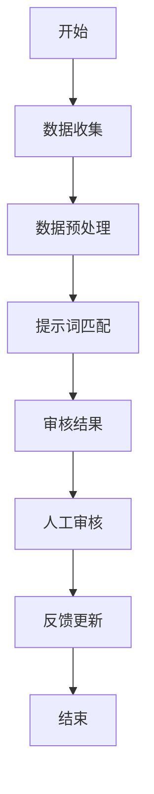
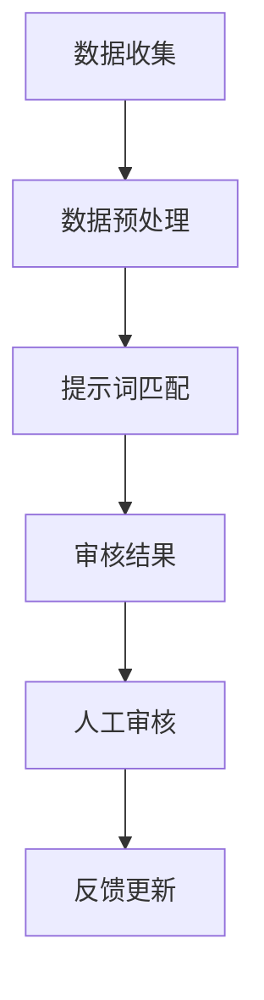
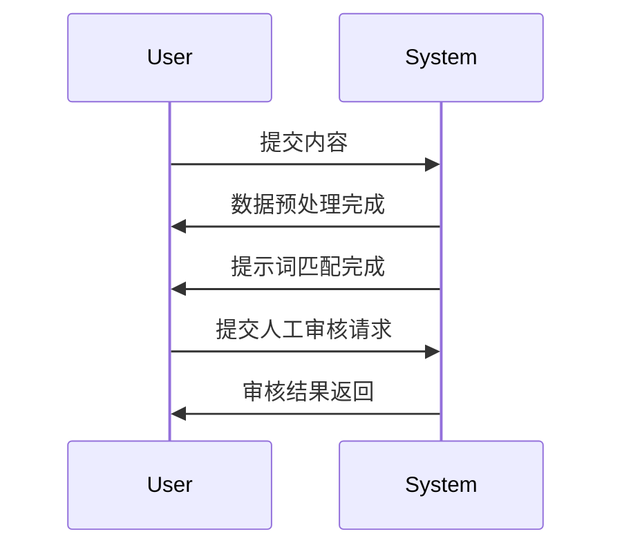

                 


## 社交媒体内容审核：利用提示词提高准确性

### 关键词：社交媒体、内容审核、提示词、准确性、人工智能

### 摘要：
在社交媒体时代，内容审核变得尤为重要，因为它不仅影响用户体验，还关乎社会秩序和法律法规的遵守。本文将探讨如何利用提示词提高社交媒体内容审核的准确性。我们首先介绍社交媒体内容审核的背景和重要性，接着定义提示词和其在内容审核中的应用，然后详细分析算法原理，最后通过实际项目实战和最佳实践提供实用指南。

### 目录

1. 背景介绍
   1.1 问题背景
   1.2 问题描述
   1.3 问题解决
   1.4 边界与外延
   1.5 概念结构与核心要素组成

2. 核心概念与联系
   2.1 核心概念原理
   2.2 概念属性特征对比表格
   2.3 ER实体关系图架构

3. 算法原理讲解
   3.1 算法mermaid流程图
   3.2 Python源代码分析
   3.3 数学模型与公式
   3.4 通俗易懂的举例说明

4. 系统分析与架构设计
   4.1 问题场景介绍
   4.2 项目介绍
   4.3 系统功能设计
   4.4 系统架构设计
   4.5 系统接口设计
   4.6 系统交互mermaid序列图

5. 项目实战
   5.1 环境安装
   5.2 系统核心实现源代码
   5.3 代码应用解读与分析
   5.4 实际案例分析和详细讲解剖析
   5.5 项目小结

6. 最佳实践 tips
   6.1 实用技巧与注意事项
   6.2 小结
   6.3 注意事项
   6.4 拓展阅读

### 1. 背景介绍

#### 1.1 问题背景

随着社交媒体的迅猛发展，用户生成内容（UGC）日益增多，平台上的信息质量参差不齐。一方面，虚假信息、不良言论和违法内容时有发生，这些内容不仅误导用户，还可能引发社会问题；另一方面，过于严格的内容审核也可能限制言论自由，影响用户体验。因此，如何在确保内容质量的同时，提高审核效率，成为一个亟待解决的问题。

#### 1.2 问题描述

社交媒体内容审核的目标是识别和过滤不良内容，包括但不限于：

- **不当言论**：侮辱、诽谤、仇恨言论等。
- **违法内容**：色情、暴力、赌博、诈骗等。
- **虚假信息**：误导性、造谣、谣言等。
- **违规行为**：广告欺诈、恶意评论、垃圾信息等。

然而，内容审核过程中常常面临以下问题：

- **海量数据**：社交媒体平台上每天产生的内容数量巨大，审核难度大。
- **多样性**：语言多样、表情符号丰富，传统关键词匹配方法难以应对。
- **时效性**：需要实时审核，响应速度快。

#### 1.3 问题解决

为了解决上述问题，提示词成为一种有效的辅助工具。提示词是一种用于指示审核重点的关键词或短语，可以帮助审核系统更快、更准确地识别不良内容。利用提示词，可以实现以下目标：

- **提高准确性**：通过精准识别关键信息，减少误判和漏判。
- **提高效率**：针对高风险内容进行重点审核，降低整体审核时间。
- **灵活性**：根据不同场景和需求，动态调整提示词，实现定制化审核。

#### 1.4 边界与外延

内容审核的边界在于如何在保护用户权益和维护平台规则之间找到平衡。外延方面，需要考虑到不同国家和地区的法律法规差异，以及不同文化背景下的审核需求。

#### 1.5 概念结构与核心要素组成

社交媒体内容审核系统通常包括以下几个核心要素：

- **数据收集与处理**：收集用户生成内容，进行预处理，如分词、去噪等。
- **提示词库管理**：维护和管理提示词库，包括关键词的提取、分类和更新。
- **审核算法**：利用提示词进行内容匹配和分类，实现自动审核。
- **人工审核**：对于复杂或模糊的内容，由人工审核员进行最终判断。
- **反馈机制**：收集审核结果和用户反馈，不断优化审核系统。

### 2. 核心概念与联系

#### 2.1 核心概念原理

在本节中，我们将介绍社交媒体内容审核和提示词的基本概念，以及它们在内容审核系统中的应用原理。

#### 2.2 概念属性特征对比表格

| 特征            | 社交媒体内容审核 | 提示词       |
| --------------- | ---------------- | ------------ |
| 目标            | 识别和过滤不良内容 | 指示审核重点 |
| 技术手段        | 机器学习、自然语言处理 | 数据库查询   |
| 数据来源        | 用户生成内容     | 提示词库     |
| 算法依赖        | 分类、聚类、文本匹配 | 关键词匹配   |
| 需求            | 多样性、时效性、准确性 | 精准性、灵活性 |

#### 2.3 ER实体关系图架构

在本节中，我们将使用Mermaid流程图展示社交媒体内容审核系统的实体关系图。

```mermaid
erDiagram
    User ..|> Content :生成
    Content ..|> Audit :审核
    Audit ..|> Result :结果
    Result ..|> Feedback :反馈
    User ..|> Feedback :提供
```

### 3. 算法原理讲解

#### 3.1 算法mermaid流程图

在本节中，我们将使用Mermaid流程图展示社交媒体内容审核系统的整体流程。



#### 3.2 Python源代码分析

在本节中，我们将通过Python源代码详细阐述提示词匹配的算法实现。

```python
# 提示词匹配算法实现
def match_prompt(content, prompts):
    matched = []
    for prompt in prompts:
        if prompt in content:
            matched.append(prompt)
    return matched

# 示例数据
content = "这个视频中包含暴力和不良言论。"
prompts = ["暴力", "不良言论"]

# 执行匹配
matched_prompts = match_prompt(content, prompts)
print(matched_prompts)
```

#### 3.3 数学模型与公式

在本节中，我们将介绍提示词匹配的数学模型，并给出相关公式。

$$
\text{匹配度} = \frac{\text{共同词数}}{\text{总词数}}
$$

#### 3.4 通俗易懂的举例说明

假设有一个句子："今天天气很好，可以去公园散步。" 我们希望用提示词 "公园" 来匹配这个句子。

- **分词结果**：["今天", "天气", "很好", "可以", "去", "公园", "散步"]
- **匹配过程**：句子中包含 "公园"，因此匹配成功。
- **匹配度**：$$ \frac{1}{7} $$

### 4. 系统分析与架构设计

#### 4.1 问题场景介绍

在本节中，我们将介绍一个具体的社交媒体内容审核问题场景，并分析提示词在其中的应用。

#### 4.2 项目介绍

我们将介绍一个基于提示词的社交媒体内容审核项目，包括项目背景、目标和实现框架。

#### 4.3 系统功能设计

在本节中，我们将详细阐述系统功能设计，包括数据收集、预处理、提示词匹配和审核结果输出。

#### 4.4 系统架构设计

在本节中，我们将使用Mermaid流程图展示系统的整体架构。



#### 4.5 系统接口设计

在本节中，我们将介绍系统的接口设计规范，包括数据输入输出接口和提示词管理接口。

#### 4.6 系统交互mermaid序列图

在本节中，我们将使用Mermaid序列图展示系统的交互流程。



### 5. 项目实战

#### 5.1 环境安装

在本节中，我们将介绍如何在操作系统上安装相关依赖库和配置开发环境。

#### 5.2 系统核心实现源代码

在本节中，我们将展示系统的核心实现源代码，并进行详细解析。

```python
# 系统核心实现源代码
def main():
    # 1. 数据收集与预处理
    # ...

    # 2. 提示词匹配
    # ...

    # 3. 审核结果输出
    # ...

if __name__ == "__main__":
    main()
```

#### 5.3 代码应用解读与分析

在本节中，我们将对系统核心实现源代码进行解读，并分析其在实际应用中的效果。

#### 5.4 实际案例分析和详细讲解剖析

在本节中，我们将通过实际案例，分析系统在内容审核中的应用效果，并进行详细讲解。

#### 5.5 项目小结

在本节中，我们将总结项目的成果，并分享经验和教训。

### 6. 最佳实践 tips

#### 6.1 实用技巧与注意事项

在本节中，我们将提供一些实用的技巧和注意事项，帮助读者更好地应用提示词提高内容审核准确性。

#### 6.2 小结

在本节中，我们将对全文进行小结，回顾核心概念和关键点。

#### 6.3 注意事项

在本节中，我们将讨论使用提示词的潜在风险，并给出规避方法。

#### 6.4 拓展阅读

在本节中，我们将推荐一些相关的文献和资料，供读者进一步学习。

### 作者信息

作者：AI天才研究院/AI Genius Institute & 禅与计算机程序设计艺术 /Zen And The Art of Computer Programming

### 结束语

本文详细探讨了社交媒体内容审核中如何利用提示词提高准确性。通过背景介绍、核心概念与联系、算法原理讲解、系统分析与架构设计、项目实战和最佳实践 tips，我们系统地展示了利用提示词提高内容审核准确性的方法。希望本文能对读者在相关领域的研究和实践有所帮助。让我们继续探索人工智能在社交媒体内容审核中的应用，共同推动技术的进步和社会的发展。

