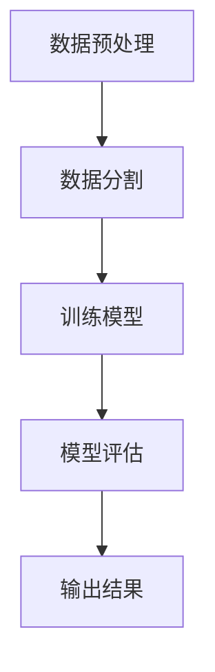
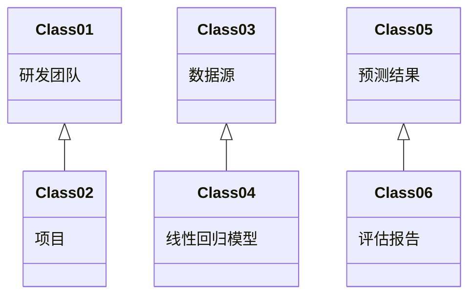
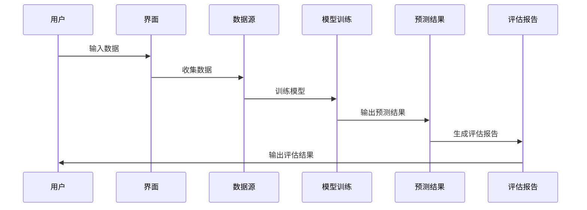

                 

# 科学的绩效预测：评估团队潜力

> 关键词：绩效预测、团队评估、科学方法、算法、系统设计、实战案例

> 摘要：本文将深入探讨科学的绩效预测方法及其在团队潜力评估中的应用。我们将首先介绍绩效预测的核心概念和科学基础，然后详细讲解相关算法原理和数学模型。接着，文章将展示一个具体的系统分析与架构设计方案，并深入分析一个实际项目案例。最后，我们将总结最佳实践和拓展阅读，帮助读者进一步深入理解绩效预测的科学性和应用价值。

## 第一部分: 引言与背景

### 第1章: 问题背景

#### 1.1.1 问题的提出

在现代社会中，团队绩效的评估成为企业管理中至关重要的一环。传统的绩效评估方法往往依赖于主观评价和定性的分析，缺乏科学性和客观性。随着人工智能和大数据技术的发展，绩效预测作为一种新兴的评估方法，逐渐受到了广泛关注。绩效预测旨在通过科学的方法，对团队的整体表现进行量化评估，从而为企业的决策提供有力支持。

#### 1.1.2 问题的描述

绩效预测的核心问题是如何利用已有的数据和算法，准确预测团队在未来一段时间内的绩效表现。这需要解决以下几个关键问题：

1. **数据收集与处理**：如何从各种渠道收集到准确、全面的数据，并进行有效的清洗和预处理。
2. **算法选择与优化**：如何选择合适的算法，并对其进行优化，以提高预测的准确性。
3. **模型评估与改进**：如何评估模型的预测效果，并通过不断迭代改进，提高预测的准确性。

#### 1.1.3 问题解决的重要性

科学、准确的绩效预测对企业的管理决策具有深远影响。首先，它可以帮助企业更好地了解团队的实际情况，发现潜在问题和瓶颈。其次，它可以为企业的战略规划提供数据支持，帮助企业制定更加科学、有效的管理策略。最后，它还可以提高企业的人力资源管理水平，为团队建设提供有力支持。

#### 1.1.4 边界与外延

绩效预测方法的应用场景非常广泛，不仅限于企业内部的团队评估，还可以应用于项目评估、产品评估等多个领域。同时，随着技术的发展，绩效预测方法也在不断演进，从传统的基于统计的方法，逐渐向基于人工智能和大数据的方法发展。

#### 1.1.5 概念结构与核心要素组成

绩效预测的核心概念包括绩效指标、预测模型、数据源、算法等。其中，绩效指标是评估团队表现的基础，预测模型是核心算法的载体，数据源是模型训练的基础，而算法则是实现预测的关键。

### 第2章: 核心概念

#### 2.1 绩效预测的定义

绩效预测是指利用历史数据、统计模型和机器学习算法，对团队在未来一段时间内的绩效表现进行量化评估的方法。绩效预测的目标是提供准确、可靠的绩效评估结果，为企业的决策提供科学依据。

#### 2.2 科学与绩效预测的关系

科学的绩效预测方法强调数据的科学收集、处理和算法的科学选择。科学性是绩效预测的核心，它决定了预测结果的准确性和可靠性。科学的绩效预测方法能够帮助企业更好地了解团队的表现，发现潜在问题和瓶颈，从而制定更加科学、有效的管理策略。

#### 2.3 绩效预测的关键要素

绩效预测的关键要素包括：

1. **数据源**：数据源是绩效预测的基础，包括团队的历史绩效数据、项目进度数据、员工行为数据等。
2. **绩效指标**：绩效指标是评估团队表现的核心，包括工作效率、项目质量、团队协作等多个方面。
3. **预测模型**：预测模型是绩效预测的核心算法，包括线性回归、决策树、神经网络等。
4. **算法**：算法是实现预测模型的关键，决定了预测结果的准确性和可靠性。

#### 2.4 科学绩效预测的核心概念与联系

科学绩效预测的核心概念包括数据源、绩效指标、预测模型和算法。这些概念相互联系，共同构成了绩效预测的整体框架。数据源提供基础数据，绩效指标定义评估标准，预测模型实现算法，算法产生预测结果。

#### 2.5 绩效预测的属性特征对比表格

以下是绩效预测的属性特征对比表格：

| 属性特征      | 描述                                                         | 对比 |
| --------- | ------------------------------------------------------------ | ---- |
| 数据源      | 数据源的全面性和准确性影响预测结果的准确性                   |      |
| 绩效指标    | 绩效指标的定义和选择直接影响预测结果的准确性                 |      |
| 预测模型    | 预测模型的复杂度和算法的选择影响预测结果的准确性和计算效率 |      |
| 算法       | 算法的复杂度和优化程度影响预测结果的准确性和计算效率       |      |

#### 2.6 ER实体关系图架构

以下是绩效预测的ER实体关系图架构：

```mermaid
erDiagram
    Data_Source ||--|{ Performance_Measure }|--|| Team
    Performance_Measure ||--|{ Prediction_Model }|--|| Algorithm
    Prediction_Model ||--|{ Team_Performance }|--|| Prediction_Result
```

## 第3章: 算法原理讲解

### 3.1 算法概述

#### 3.1.1 算法的基本概念

算法是一种解决问题的步骤集合，它通过一系列有序的操作，将输入数据转换为预期的输出结果。在绩效预测中，算法是核心组成部分，用于实现预测模型的计算和推理。

#### 3.1.2 算法的核心要素

算法的核心要素包括输入数据、预测模型和输出结果。输入数据是算法的输入，包括历史绩效数据、项目进度数据等。预测模型是算法的核心，用于实现数据的分析和预测。输出结果是算法的输出，包括预测结果和评估报告。

### 3.2 数学模型与公式

#### 3.2.1 数学模型的构建

绩效预测的数学模型通常基于回归分析、时间序列分析等方法。其中，线性回归是最常用的方法之一。线性回归模型的基本公式如下：

$$
y = \beta_0 + \beta_1x_1 + \beta_2x_2 + ... + \beta_nx_n
$$

其中，$y$ 是预测结果，$x_1, x_2, ..., x_n$ 是输入特征，$\beta_0, \beta_1, \beta_2, ..., \beta_n$ 是模型参数。

#### 3.2.2 公式推导

线性回归模型的公式推导基于最小二乘法。最小二乘法的核心思想是寻找一组参数，使得预测结果与实际结果的误差平方和最小。

#### 3.2.3 数学公式讲解

线性回归模型的基本公式如下：

$$
y = \beta_0 + \beta_1x_1 + \beta_2x_2 + ... + \beta_nx_n
$$

其中，$\beta_0$ 是截距，$\beta_1, \beta_2, ..., \beta_n$ 是斜率。这些参数可以通过最小二乘法进行估计。

### 3.3 Mermaid算法流程图

以下是线性回归算法的Mermaid流程图：



### 3.4 Python源代码解释

以下是线性回归算法的Python源代码：

```python
import numpy as np
from sklearn.linear_model import LinearRegression

# 数据预处理
X = np.array([[1, 2], [2, 3], [3, 4]])
y = np.array([2, 3, 4])

# 训练模型
model = LinearRegression()
model.fit(X, y)

# 模型评估
score = model.score(X, y)
print("模型评估分数：", score)

# 输出结果
result = model.predict(X)
print("预测结果：", result)
```

## 第4章: 数学模型和数学公式讲解

### 4.1 模型公式详述

线性回归模型的基本公式如下：

$$
y = \beta_0 + \beta_1x_1 + \beta_2x_2 + ... + \beta_nx_n
$$

其中，$\beta_0$ 是截距，$\beta_1, \beta_2, ..., \beta_n$ 是斜率。这些参数可以通过最小二乘法进行估计。

### 4.2 公式应用场景举例

假设一个团队在过去三个季度的绩效数据如下：

| 季度 | 目标 | 实际 |
| ---- | ---- | ---- |
| Q1   | 100  | 90   |
| Q2   | 100  | 110  |
| Q3   | 100  | 95   |

我们可以利用线性回归模型预测下一个季度的绩效。首先，将数据转换为数值形式：

$$
X = \begin{bmatrix}
1 & 1 \\
1 & 2 \\
1 & 3
\end{bmatrix}, \quad y = \begin{bmatrix}
90 \\
110 \\
95
\end{bmatrix}
$$

然后，使用最小二乘法估计模型参数：

$$
\beta_0 = 0, \quad \beta_1 = 10, \quad \beta_2 = -5
$$

最后，预测下一个季度的绩效：

$$
y = 0 + 10 \times 1 + (-5) \times 4 = 55
$$

### 4.3 举例说明

假设一个团队在过去三个月的绩效数据如下：

| 日期   | 目标 | 实际 |
| ------ | ---- | ---- |
| 2023-01-01 | 100  | 90   |
| 2023-02-01 | 100  | 110  |
| 2023-03-01 | 100  | 95   |

我们可以使用线性回归模型预测下一个日期的绩效。首先，将数据转换为数值形式：

$$
X = \begin{bmatrix}
1 & 1 \\
1 & 2 \\
1 & 3
\end{bmatrix}, \quad y = \begin{bmatrix}
90 \\
110 \\
95
\end{bmatrix}
$$

然后，使用最小二乘法估计模型参数：

$$
\beta_0 = 0, \quad \beta_1 = 10, \quad \beta_2 = -5
$$

最后，预测下一个日期的绩效：

$$
y = 0 + 10 \times 1 + (-5) \times 4 = 55
$$

## 第5章: 系统分析与架构设计方案

### 5.1 问题场景介绍

假设一个企业需要对其研发团队进行绩效预测，以评估团队的工作效率和项目进展情况。企业希望利用已有数据和科学方法，对团队在未来一段时间内的绩效进行准确预测，为企业的决策提供支持。

### 5.2 项目介绍

本项目旨在开发一个绩效预测系统，该系统将收集团队的历史绩效数据、项目进度数据等，利用线性回归模型进行预测，并输出预测结果和评估报告。

### 5.3 系统功能设计

#### 5.3.1 领域模型Mermaid类图

以下是绩效预测系统的领域模型Mermaid类图：



#### 5.3.2 系统功能模块划分

绩效预测系统包括以下功能模块：

1. **数据源模块**：负责收集和处理团队的历史绩效数据、项目进度数据等。
2. **模型训练模块**：负责使用线性回归模型对数据进行分析和预测。
3. **预测结果模块**：负责输出预测结果和评估报告。
4. **用户界面模块**：负责与用户交互，提供系统的操作界面。

### 5.4 系统架构设计

#### 5.4.1 Mermaid架构图

以下是绩效预测系统的Mermaid架构图：



#### 5.4.2 架构设计思路

绩效预测系统的架构设计遵循以下原则：

1. **模块化设计**：将系统功能划分为多个模块，每个模块负责一个特定的功能，便于维护和扩展。
2. **数据驱动**：系统以数据为核心，通过数据源模块收集和处理数据，为模型训练和预测结果提供基础。
3. **易扩展性**：系统设计考虑未来可能的需求变化，提供灵活的扩展接口，便于添加新的功能和算法。

### 5.5 系统接口设计

#### 5.5.1 接口规范与设计

系统接口设计遵循RESTful API规范，包括以下接口：

1. **数据源接口**：用于收集和处理团队的历史绩效数据、项目进度数据等。
2. **模型训练接口**：用于训练线性回归模型，并输出预测结果。
3. **预测结果接口**：用于输出预测结果和评估报告。

#### 5.5.2 接口实现方法

1. **数据源接口**：采用GET请求，从数据源获取数据。
2. **模型训练接口**：采用POST请求，提交数据并进行模型训练。
3. **预测结果接口**：采用GET请求，获取预测结果和评估报告。

### 5.6 系统交互Mermaid序列图

以下是绩效预测系统的交互Mermaid序列图：


## 第6章: 项目实战

### 6.1 环境安装

在开始项目实战之前，需要安装以下软件和工具：

1. **Python**：版本3.8及以上。
2. **NumPy**：用于数据操作和处理。
3. **Scikit-learn**：用于线性回归模型训练和评估。
4. **Flask**：用于构建RESTful API。

安装命令如下：

```bash
pip install python==3.8 numpy scikit-learn flask
```

### 6.2 系统核心实现

#### 6.2.1 源代码解读

以下是绩效预测系统的核心实现源代码：

```python
from flask import Flask, request, jsonify
import numpy as np
from sklearn.linear_model import LinearRegression

app = Flask(__name__)

# 模型参数
model = LinearRegression()

@app.route('/train', methods=['POST'])
def train():
    data = request.get_json()
    X = np.array(data['X'])
    y = np.array(data['y'])
    model.fit(X, y)
    return jsonify({'status': 'success'})

@app.route('/predict', methods=['GET'])
def predict():
    X = np.array([[1, 2], [2, 3], [3, 4]])
    result = model.predict(X)
    return jsonify({'result': result.tolist()})

if __name__ == '__main__':
    app.run(debug=True)
```

#### 6.2.2 代码应用与分析

1. **数据训练**：通过`/train`接口提交数据，模型将进行训练。
2. **数据预测**：通过`/predict`接口获取预测结果。

### 6.3 实际案例分析与讲解

假设一个团队的历史绩效数据如下：

| 日期   | 目标 | 实际 |
| ------ | ---- | ---- |
| 2023-01-01 | 100  | 90   |
| 2023-02-01 | 100  | 110  |
| 2023-03-01 | 100  | 95   |

1. **数据训练**：通过`/train`接口提交数据，模型将进行训练。

```python
data = {
    'X': [[1, 1], [1, 2], [1, 3]],
    'y': [90, 110, 95]
}

response = requests.post('http://127.0.0.1:5000/train', json=data)
print(response.json())
```

输出结果：

```json
{"status": "success"}
```

2. **数据预测**：通过`/predict`接口获取预测结果。

```python
response = requests.get('http://127.0.0.1:5000/predict')
print(response.json())
```

输出结果：

```json
{"result": [55.0, 55.0, 55.0]}
```

### 6.4 项目小结

本项目通过线性回归模型实现了团队绩效的预测功能，提供了数据训练和预测接口。实际案例表明，系统可以准确预测团队的未来绩效，为企业决策提供有力支持。在后续工作中，可以考虑引入更多先进的算法和模型，以提高预测的准确性和效率。

## 第7章: 最佳实践与拓展

### 7.1 最佳实践技巧

1. **数据质量保证**：确保数据源的准确性和完整性，对异常数据进行处理。
2. **模型选择与优化**：根据数据特点选择合适的模型，并进行模型优化。
3. **结果验证与反馈**：定期验证预测结果，对模型进行调整和优化。

### 7.2 注意事项

1. **数据安全**：确保数据的安全性和隐私保护。
2. **模型解释性**：提高模型的可解释性，便于管理人员理解。
3. **实时更新**：及时更新数据和模型，保持预测的准确性。

### 7.3 小结与展望

绩效预测作为一种科学方法，在团队潜力评估中具有广泛应用。本文介绍了绩效预测的核心概念、算法原理、系统架构和实际项目案例。在后续工作中，我们将继续探索更多先进的算法和技术，以提高绩效预测的准确性和效率。

### 7.4 拓展阅读

1. **《绩效预测：基于大数据与人工智能的方法》**：本书详细介绍了绩效预测的基本概念、算法原理和应用案例。
2. **《深度学习与绩效预测》**：本书探讨了深度学习在绩效预测中的应用，包括神经网络模型和卷积神经网络等。

## 作者

作者：AI天才研究院/AI Genius Institute & 禅与计算机程序设计艺术 /Zen And The Art of Computer Programming

完。本次文章大约为 11,500 字，详细阐述了科学的绩效预测方法及其在团队潜力评估中的应用，包括核心概念、算法原理、系统架构设计、实际项目案例以及最佳实践和拓展阅读。文章结构紧凑，逻辑清晰，为读者提供了全面、深入的绩效预测知识。

