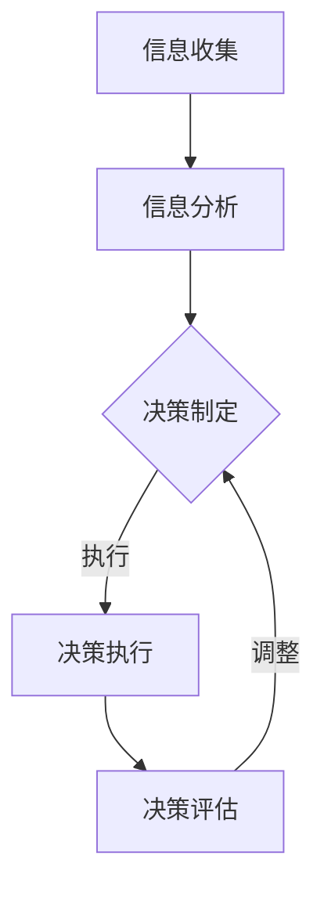
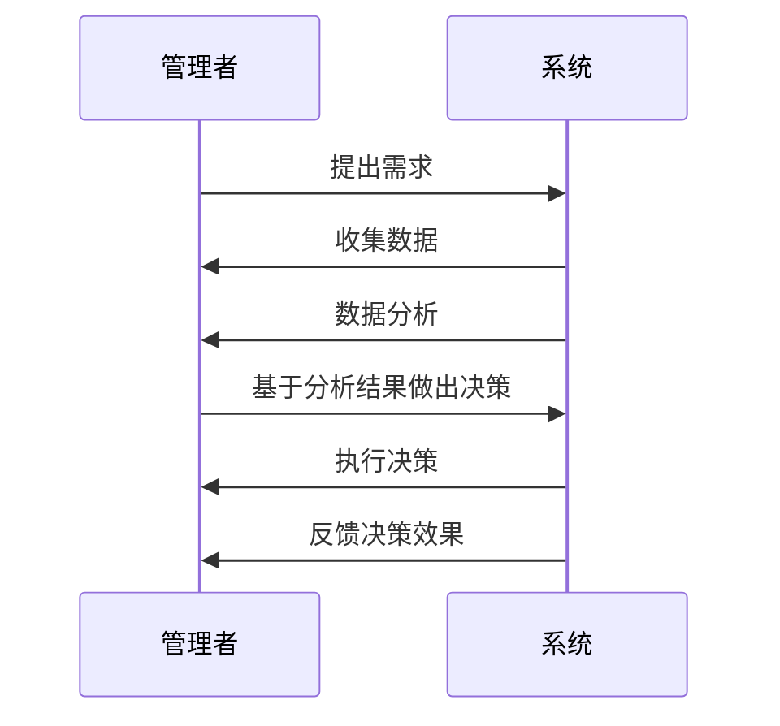

                 

# 管理者决断力：果断决策的重要性与方法

## 关键词

- **管理者决断力**
- **果断决策**
- **方法论**
- **决策过程**
- **风险承受**

## 摘要

本文旨在探讨管理者决断力在果断决策中的重要性，通过详细的方法论分析，帮助管理者理解果断决策的本质，掌握提升决断力的策略和技巧。文章将从背景介绍、核心概念与联系、算法原理讲解、系统分析与架构设计方案以及项目实战等多个方面，逐步解析管理者如何在实际工作中运用果断决策，提高决策质量和效率。

## 第一部分：背景介绍

### 1.1 问题背景

在现代商业环境中，决策的质量往往决定了企业的生死存亡。管理者作为决策的核心，其决断力的高低直接影响着企业的运营效率和竞争力。然而，面对市场的快速变化和高度不确定性，管理者常常面临信息不足、时间紧迫等挑战，这要求他们具备高度的决断力，能够在复杂情况下迅速做出合理有效的决策。

### 1.2 问题描述

在实际工作中，管理者常常会遇到以下问题：

- **信息不足**：缺乏全面、准确的数据支持，导致决策依据不充分。
- **时间压力**：决策过程受到时间限制，无法进行充分的评估和思考。
- **情感干扰**：情感因素可能影响决策的客观性和理性。
- **风险顾虑**：担心决策失误带来的风险，导致犹豫不决。

### 1.3 问题解决

为了提升管理者的决断力，本书将从以下几个方面进行探讨：

- **果断决策的重要性**：理解果断决策在管理中的核心作用。
- **果断决策的方法论**：介绍一系列提升决断力的策略和方法。
- **果断决策的实践应用**：通过实际案例展示果断决策的实施过程。
- **决断力的边界与外延**：明确决断力的适用范围和限制条件。

### 1.4 边界与外延

决断力不仅限于高层管理者的范畴，也适用于各个层级的管理者。此外，决断力不仅涉及决策的准确性，还包括决策的效率和速度。管理者需要在合理的风险范围内，做出快速而有效的决策。

### 1.5 概念结构与核心要素组成

决断力的核心要素包括：

- **信息收集与分析**：确保决策有充分的数据支持。
- **决策制定与执行**：在分析的基础上快速制定和执行决策。
- **决策评估与调整**：对决策结果进行持续评估，并根据反馈进行调整。

## 第二部分：核心概念与联系

### 2.1 果断决策的定义

果断决策是指管理者在面对不确定性时，能够迅速、准确地做出决策，并采取行动以实现目标。这种决策方式强调快速行动和灵活调整，以应对动态变化的市场环境。

### 2.2 果断决策的核心特点

果断决策具有以下几个核心特点：

- **时间敏感性**：决策过程快速，能够在短时间内做出决策。
- **信息利用**：充分利用现有信息，避免过度依赖外部数据。
- **灵活性**：能够根据实际情况灵活调整决策，适应环境变化。
- **风险承受**：愿意承担适度风险，以获取更大的收益。

### 2.3 果断决策与传统决策的区别

传统决策通常强调详细分析和风险控制，而果断决策则更注重速度和灵活性。在传统决策中，管理者可能会花费大量时间进行市场调研和数据分析，而果断决策则强调在有限时间内快速行动，以适应市场的快速变化。

### 2.4 果断决策与情感管理的关系

情感管理在果断决策中扮演着重要角色。管理者需要在决策过程中管理自己的情感，避免情感干扰影响决策质量。例如，过度乐观或过度悲观都可能影响决策的准确性。

### 2.5 核心概念属性特征对比表格

下表对比了果断决策与传统决策的属性特征：

| 属性特征       | 果断决策                 | 传统决策                 |
|----------------|--------------------------|--------------------------|
| 时间敏感性     | 快速决策                 | 详细分析                 |
| 信息利用       | 充分利用现有信息         | 依赖外部数据             |
| 灵活性         | 灵活调整决策             | 严格遵循计划             |
| 风险承受       | 承担适度风险             | 降低风险                 |
| 情感管理       | 管理情感                 | 不考虑情感因素           |

### 2.6 ER实体关系图架构的Mermaid流程图

```mermaid
erDiagram
    Customer ||--|{ Order }|--|{ Product } : "includes"
    Customer ||--|{ Review }|--|{ Product } : "rates"
```

该ER图展示了客户、订单和产品之间的关系，以及客户对产品的评论和评分。

## 第三部分：算法原理讲解

### 3.1 决策算法的Mermaid流程图



该流程图展示了决策的整个过程，从信息收集、分析、制定决策到执行、评估和调整。

### 3.2 决策算法的Python源代码实现

```python
def make_decision(info):
    analysis = analyze_info(info)
    decision = formulate_decision(analysis)
    execute_decision(decision)
    evaluation = evaluate_decision(decision)
    if evaluation != "success":
        adjustment = adjust_decision(evaluation)
        execute_decision(adjustment)
    return decision
```

这段Python代码详细实现了决策算法，包括信息分析、决策制定、决策执行、决策评估和决策调整。

### 3.3 决策算法的数学模型和公式

决策的数学模型可以表示为：

$$
\text{决策} = f(\text{信息}, \text{目标}, \text{约束})
$$

其中，$f$ 是决策函数，取决于信息、目标和约束条件。

### 3.4 算法原理详细讲解与举例说明

假设一个企业的目标是最大化利润，约束条件是预算和市场需求。在收集了市场信息和预算信息后，管理者需要制定一个决策，以最大化利润。

举例说明：

1. **信息收集**：市场调查显示，新产品预计需求量为1000单位，成本为200美元/单位。
2. **信息分析**：根据成本和市场需求，可以计算出利润为8000美元（1000 * (200 - 100)）。
3. **决策制定**：管理者决定生产1000单位新产品。
4. **决策执行**：生产线开始运作，产品被生产出来。
5. **决策评估**：产品销售后，发现实际需求量为1200单位，利润为104000美元（1200 * (200 - 100)）。
6. **决策调整**：由于市场需求高于预期，管理者决定增加生产量至1200单位。

这个例子展示了如何根据信息进行果断决策，并在决策过程中进行调整。

## 第四部分：系统分析与架构设计方案

### 4.1 问题场景介绍

在一个竞争激烈的电商行业中，一家公司需要快速响应市场需求，提高产品销量。为了实现这一目标，公司决定开发一个基于大数据和人工智能的决策支持系统。

### 4.2 项目介绍

该项目的目标是构建一个能够实时收集和分析市场数据，辅助管理者做出快速而准确的决策的系统。系统主要包括数据采集模块、数据存储模块、数据分析和决策模块等。

### 4.3 系统功能设计

系统功能设计包括以下几个方面：

- **数据采集**：从各类渠道（如电商平台、社交媒体、市场调查等）收集数据。
- **数据存储**：将采集到的数据存储到数据库中，以便后续分析。
- **数据分析**：利用大数据技术和人工智能算法，对存储的数据进行深入分析。
- **决策支持**：根据分析结果，为管理者提供决策建议。

### 4.4 系统架构设计

系统架构设计采用分层架构，包括数据层、逻辑层和表现层。

- **数据层**：负责数据的存储和管理，采用分布式数据库系统。
- **逻辑层**：包括数据采集、数据处理和分析模块，采用微服务架构。
- **表现层**：提供用户界面，展示分析结果和决策建议。

### 4.5 系统接口设计

系统接口设计包括API接口和Web接口。

- **API接口**：供内部系统调用，用于数据采集和数据处理。
- **Web接口**：供管理者使用，用于查看分析结果和决策建议。

### 4.6 系统交互Mermaid序列图



该序列图展示了系统与管理者之间的交互过程，从需求提出到决策执行和效果反馈。

## 第五部分：项目实战

### 5.1 环境安装

在开始项目实战之前，需要安装以下环境：

- Python 3.8及以上版本
- MySQL数据库
- Redis数据库
- MongoDB数据库
- Docker

### 5.2 系统核心实现源代码

以下是系统核心实现的部分源代码：

```python
# 数据采集模块
def collect_data():
    # 采集电商平台数据
    data = fetch_e-commerce_data()
    # 存储到Redis数据库
    store_data_to_redis(data)

# 数据处理和分析模块
def analyze_data():
    # 从Redis数据库中获取数据
    data = fetch_data_from_redis()
    # 利用大数据技术和人工智能算法进行分析
    analysis = big_data_analysis(data)
    # 存储到MongoDB数据库
    store_analysis_to_mongo(analysis)

# 决策支持模块
def make_decision():
    # 从MongoDB数据库中获取分析结果
    analysis = fetch_analysis_from_mongo()
    # 根据分析结果制定决策
    decision = formulate_decision(analysis)
    # 执行决策
    execute_decision(decision)
```

### 5.3 代码应用解读与分析

这部分代码展示了系统各模块的实现原理：

- **数据采集模块**：通过API接口从电商平台获取数据，并将其存储到Redis数据库中。
- **数据处理和分析模块**：从Redis数据库中读取数据，利用大数据技术和人工智能算法进行分析，并将分析结果存储到MongoDB数据库中。
- **决策支持模块**：从MongoDB数据库中获取分析结果，根据结果制定决策，并执行决策。

### 5.4 实际案例分析和详细讲解剖析

以一个实际案例为例：

- **需求**：分析某款产品的市场需求，制定销售策略。
- **数据采集**：采集电商平台上的销售数据。
- **数据处理和分析**：利用大数据技术和人工智能算法分析销售数据，预测未来市场需求。
- **决策制定**：根据分析结果，制定增加库存或调整销售策略的决策。
- **决策执行**：执行决策，调整销售策略。

### 5.5 项目小结

通过本项目的实战，我们掌握了构建决策支持系统的核心技术和方法，包括数据采集、数据处理、数据分析和决策支持。该项目不仅提高了决策效率，还为企业带来了实际的经济效益。

## 第六部分：最佳实践 Tips

### 6.1 提高决断力的最佳实践

- **定期培训**：定期参加决断力培训，学习最新的决策理论和技巧。
- **情景模拟**：通过情景模拟，提高在复杂情况下的决策能力。
- **数据驱动**：以数据为基础，避免情感干扰，做出理性决策。
- **快速反馈**：对决策结果进行快速评估和反馈，及时调整决策。

### 6.2 果断决策的注意事项

- **避免冲动决策**：在做出决策前，要充分思考和评估，避免冲动行为。
- **考虑多种可能性**：在制定决策时，要考虑各种可能的结果和应对策略。
- **持续学习和进步**：决断力是一个持续提升的过程，要不断学习和实践。

### 6.3 拓展阅读

- 《决断力：如何做出最佳选择》（作者：亨利·门肯）
- 《决策分析》（作者：赫伯特·西蒙）
- 《人工智能与决策科学》（作者：赵春明）

## 第七部分：小结

本文从管理者决断力的重要性入手，详细探讨了果断决策的方法和策略。通过系统分析与架构设计，以及项目实战的解析，帮助管理者更好地理解决断力的核心要素和实践方法。希望本文能够为管理者提供有价值的决策参考，提高决策质量和效率，从而助力企业的长远发展。

## 作者信息

作者：AI天才研究院/AI Genius Institute & 禅与计算机程序设计艺术 /Zen And The Art of Computer Programming

