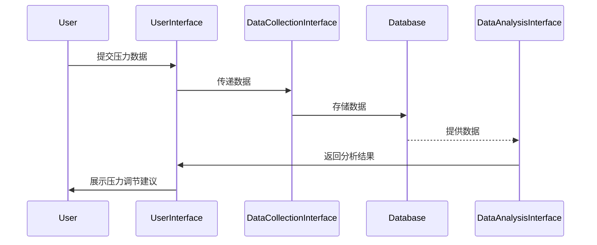
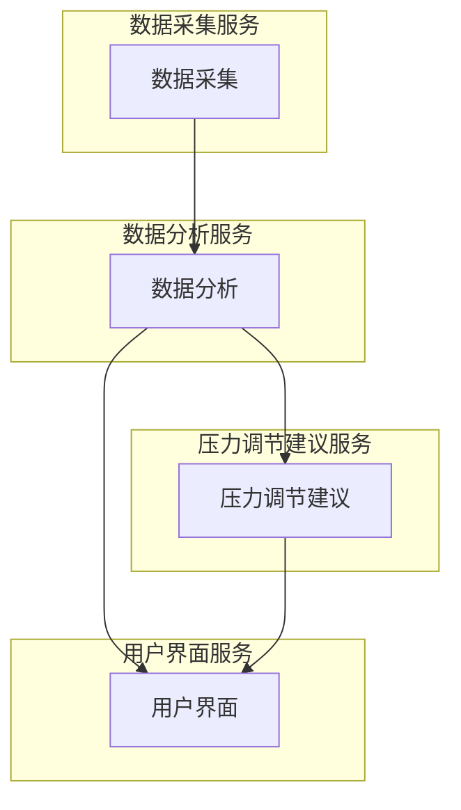
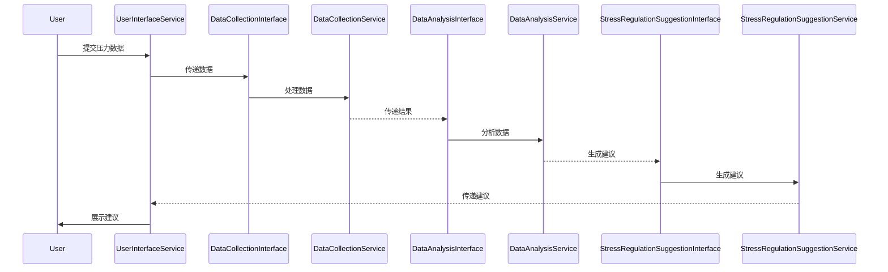
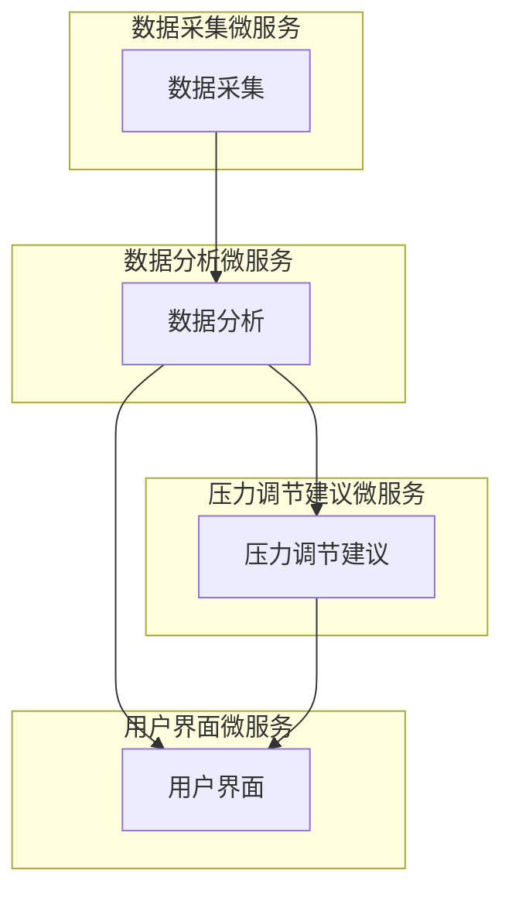
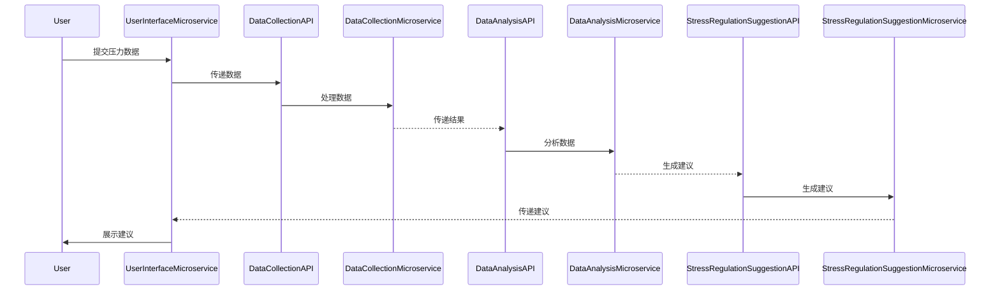

                 

# 管理者压力调节：保持工作生活平衡的技巧

## 关键词：管理者，压力调节，工作生活平衡，技巧

## 摘要：
在现代职场中，管理者面临着前所未有的压力。本文将深入探讨管理者压力调节的重要性，分析压力的来源、表现形式及其影响，并提出一系列有效的方法来帮助管理者保持工作与生活的平衡，提高生活质量和工作效率。

----------------------------------------------------------------

## 第一部分: 背景介绍

### 第1章: 管理者压力调节的重要性

### 1.1 问题背景

#### 1.1.1 压力的普遍现象
在快节奏的现代社会中，工作压力无处不在。管理者作为组织的核心，承担着更多责任和压力。他们不仅要处理日常业务，还要关注团队管理、业务拓展和战略规划，因此更容易感到压力。

#### 1.1.2 压力对管理者的影响
长期的慢性压力可能导致管理者情绪失控、工作效率下降，甚至影响身体健康。此外，过大的压力还可能导致决策失误，影响组织的发展。

#### 1.1.3 工作生活平衡的意义
工作生活平衡是管理者保持身心健康的关键。只有在工作与生活之间找到平衡，管理者才能更好地发挥自己的潜力，提高工作质量，同时也保证个人的生活幸福。

### 1.2 问题描述

#### 1.2.1 压力的来源
管理者的压力主要来源于工作职责、市场竞争、人际关系、自我期望等多方面。每种压力源都有其独特的表现形式和影响。

#### 1.2.2 压力的表现形式
压力的表现形式多种多样，包括焦虑、抑郁、失眠、食欲不振等。这些症状不仅影响管理者的个人生活，还可能对工作产生负面影响。

#### 1.2.3 压力管理的必要性
有效的压力管理对于管理者的身心健康至关重要。通过合理的压力管理，管理者可以更好地应对压力，提高生活质量和工作效率。

### 1.3 问题解决

#### 1.3.1 压力调节的策略
压力调节的策略包括心理调节、生活调节和工作调节。每种策略都有其独特的实施方法和适用场景。

#### 1.3.2 压力调节的方法
压力调节的方法包括冥想、锻炼、社交活动、时间管理、职业规划等。这些方法可以帮助管理者减轻压力，提高抗压能力。

#### 1.3.3 压力调节的效果评估
压力调节的效果可以通过自我评估、同事反馈和身体健康指标来评估。持续的效果评估可以帮助管理者调整压力调节策略，以达到最佳效果。

### 1.4 边界与外延

#### 1.4.1 压力的定义
压力是指个体在面对挑战和威胁时产生的生理、心理和行为反应。

#### 1.4.2 压力调节的范围
压力调节的范围包括心理、生理、社会和文化等多个层面。

#### 1.4.3 压力调节的目标
压力调节的目标是帮助管理者更好地应对压力，提高生活质量和工作效率。

### 1.5 概念结构与核心要素组成

#### 1.5.1 压力调节的核心概念
压力、压力源、压力反应、压力调节是压力调节的核心概念。

#### 1.5.2 压力调节的属性特征
压力调节的属性特征包括方法多样性、效果评估、个体差异等。

#### 1.5.3 压力调节的方法分类
压力调节的方法可以分为心理调节、生活调节和工作调节三大类。

### 1.6 本章小结
本章介绍了管理者压力调节的重要性，分析了压力的来源、表现形式及其影响，并提出了有效的压力调节策略和方法。通过本章的学习，管理者可以更好地认识压力，掌握有效的调节技巧，从而实现工作与生活的平衡。

----------------------------------------------------------------

## 第二部分: 核心概念与联系

### 第2章: 管理者压力调节的核心概念

### 2.1 压力的定义

#### 2.1.1 压力的概念
压力是指个体在面对挑战和威胁时产生的生理、心理和行为反应。

#### 2.1.2 压力的来源
压力的来源多种多样，包括工作职责、市场竞争、人际关系、自我期望等。

#### 2.1.3 压力的类型
根据压力源的不同，压力可以分为工作压力、生活压力和自我压力。

### 2.2 压力的属性特征

#### 2.2.1 压力的作用对象
压力的作用对象是管理者，即承担组织管理和领导职责的个体。

#### 2.2.2 压力的作用方式
压力通过心理、生理和行为三个方面影响管理者。

#### 2.2.3 压力的影响程度
压力的影响程度因人而异，取决于管理者的个性特征、应对能力和压力源的性质。

### 2.3 压力调节的概念

#### 2.3.1 压力调节的定义
压力调节是指管理者通过采取一系列措施，减轻压力的影响，提高生活质量和工作效率。

#### 2.3.2 压力调节的目的
压力调节的目的是帮助管理者更好地应对压力，提高抗压能力，实现工作与生活的平衡。

#### 2.3.3 压力调节的重要性
有效的压力调节对于管理者的身心健康、工作效率和组织发展具有重要意义。

### 2.4 压力调节的方法分类

#### 2.4.1 心理调节方法
心理调节方法包括认知行为疗法、冥想、心理辅导等，旨在改变管理者的思维方式和应对策略。

#### 2.4.2 生活调节方法
生活调节方法包括锻炼、社交活动、旅游、兴趣爱好等，旨在提高管理者的生活质量。

#### 2.4.3 工作调节方法
工作调节方法包括时间管理、职业规划、工作流程优化等，旨在提高管理者的工作效率。

### 2.5 概念属性特征对比表格

| 类别             | 特征1       | 特征2       | 特征3       |
|------------------|-------------|-------------|-------------|
| 压力             | 对个体的作用 | 负面影响    | 多样性      |
| 压力调节         | 目标         | 方法多样    | 效果评估    |
| 心理调节方法      | 心理健康     | 个体意识    | 专业性      |
| 生活调节方法      | 生活质量     | 社会支持    | 自我管理    |
| 工作调节方法      | 工作效率     | 组织支持    | 工作流程    |

### 2.6 ER实体关系图架构的 Mermaid 流程图

```mermaid
erDiagram
    Manager ||--|{ Stress }||>
    Manager ||--|{ Stress Regulation Method }||>
    Stress ||--|{ Psychological Regulation Method }||>
    Stress ||--|{ Life Regulation Method }||>
    Stress ||--|{ Work Regulation Method }||>
```

## 2.7 本章小结
本章详细介绍了管理者压力调节的核心概念，包括压力的定义、属性特征、调节的概念和方法分类。通过本章的学习，管理者可以更好地理解压力的本质，掌握有效的调节方法，从而实现工作与生活的平衡。

----------------------------------------------------------------

## 第三部分: 算法原理讲解

### 第3章: 压力调节算法原理

### 3.1 压力调节算法的数学模型

压力调节的效果可以表示为以下数学模型：

$$
\text{压力调节效果} = f(\text{方法}, \text{个体特征}, \text{环境因素})
$$

其中，$f$ 表示调节效果，$\text{方法}$、$\text{个体特征}$和$\text{环境因素}$分别是影响压力调节效果的三个关键因素。

#### 3.1.1 方法因素
方法因素包括心理调节方法、生活调节方法和工作调节方法。每种方法都有其特定的调节效果，具体效果取决于方法的实施质量和个体的适应性。

#### 3.1.2 个体特征
个体特征包括管理者的心理素质、身体健康状况、应对压力的经验等。个体特征直接影响管理者对压力的敏感程度和调节效果。

#### 3.1.3 环境因素
环境因素包括组织文化、工作环境、社会支持等。良好的环境因素可以增强压力调节的效果，反之则可能削弱效果。

### 3.2 压力调节算法的Python源代码实现

```python
def pressure_regulation(method, individual_characteristics, environmental_factors):
    """
    压力调节算法函数。
    
    :param method: 压力调节方法
    :param individual_characteristics: 个体特征
    :param environmental_factors: 环境因素
    :return: 压力调节效果
    """
    # 方法因素
    method_effect = method効果评估()

    # 个体特征
    individual_effect = individual_characteristics.评价()

    # 环境因素
    environmental_effect = environmental_factors.评价()

    # 压力调节效果计算
    regulation_effect = method_effect + individual_effect + environmental_effect

    return regulation_effect
```

### 3.3 压力调节算法的应用

假设有一位管理者，他选择了冥想作为心理调节方法，具备良好的心理素质和较强的自我管理能力，同时工作环境支持度高。我们可以根据上述算法计算他的压力调节效果。

```python
# 初始化参数
method = "冥想"
individual_characteristics = {"心理素质": "良好", "身体健康状况": "良好", "应对压力经验": "丰富"}
environmental_factors = {"组织文化": "支持", "工作环境": "宽松", "社会支持": "强"}

# 调用压力调节算法
regulation_effect = pressure_regulation(method, individual_characteristics, environmental_factors)

# 输出压力调节效果
print("压力调节效果：", regulation_effect)
```

通过上述算法和示例，管理者可以更好地了解自己的压力调节效果，并据此调整自己的策略，以实现工作与生活的平衡。

### 3.4 本章小结
本章介绍了压力调节算法的原理和Python源代码实现，通过数学模型和实际案例，展示了如何通过算法来评估和管理管理者的压力。管理者可以根据自己的实际情况，调整压力调节策略，提高生活质量和工作效率。

----------------------------------------------------------------

## 系统分析与架构设计方案

### 问题场景介绍

在当前的职场环境中，管理者面临着巨大的工作压力，如何有效地进行压力调节成为了一项重要的研究课题。为了帮助管理者实现工作与生活的平衡，本文提出了一种基于人工智能的压力调节系统，通过数据分析和算法模型，为管理者提供个性化的压力调节建议。

### 项目介绍

本项目的目标是开发一款智能压力调节系统，系统将收集管理者的压力数据，利用人工智能算法进行分析，为管理者提供定制化的压力调节方案。系统主要包括以下几个模块：

1. 数据采集模块：负责收集管理者的压力数据，包括生理指标、心理状态、工作负荷等。
2. 数据分析模块：利用机器学习算法，对收集到的压力数据进行分析，识别压力源和压力反应。
3. 压力调节建议模块：根据数据分析结果，为管理者提供个性化的压力调节建议。
4. 用户界面模块：为用户提供一个直观友好的交互界面，展示压力数据和调节建议。

### 系统功能设计

系统功能设计主要包括以下内容：

1. 压力数据采集：通过智能手环、心理测试等手段，实时收集管理者的生理和心理数据。
2. 压力数据分析：利用机器学习算法，对采集到的数据进行分析，识别压力源和压力反应。
3. 压力调节建议：根据数据分析结果，为管理者提供个性化的压力调节建议，包括心理调节、生活调节和工作调节等方面。
4. 用户交互：通过用户界面，展示管理者的压力数据和调节建议，并提供自定义设置功能。

### 系统架构设计

系统架构设计采用模块化设计，包括数据采集模块、数据分析模块、压力调节建议模块和用户界面模块。各模块之间通过API进行通信，实现数据交互和功能集成。


### 系统接口设计和系统交互

系统接口设计和系统交互设计是确保系统功能正常运行的关键。系统采用RESTful API设计，提供以下接口：

1. 数据采集接口：负责接收和处理来自数据采集模块的数据。
2. 数据分析接口：负责接收和处理来自数据分析模块的数据，并返回分析结果。
3. 压力调节建议接口：负责接收和处理来自压力调节建议模块的建议，并将其传递给用户界面。
4. 用户交互接口：负责接收和处理用户操作，并将其传递给相应的模块。

系统交互流程如下：

1. 用户通过用户界面提交压力数据。
2. 用户界面将数据传递给数据采集接口。
3. 数据采集接口将数据存储到数据库中。
4. 数据分析接口从数据库中读取数据，进行分析，并将结果返回给用户界面。
5. 用户界面根据分析结果，为用户展示压力调节建议。
6. 用户根据建议进行相应的压力调节。



### 系统架构设计

系统架构设计采用微服务架构，包括以下主要组件：

1. 数据采集服务：负责收集和处理压力数据。
2. 数据分析服务：负责分析和处理压力数据。
3. 压力调节建议服务：负责生成和提供压力调节建议。
4. 用户界面服务：负责与用户进行交互。

系统架构图如下：



### 系统接口设计和系统交互

系统接口设计采用RESTful API设计，提供以下接口：

1. 数据采集接口：负责接收和处理来自数据采集服务的压力数据。
2. 数据分析接口：负责接收和处理来自数据分析服务的分析结果。
3. 压力调节建议接口：负责接收和处理来自压力调节建议服务的建议。
4. 用户交互接口：负责接收和处理用户操作。

系统交互流程如下：

1. 用户通过用户界面服务提交压力数据。
2. 用户界面服务将数据传递给数据采集接口。
3. 数据采集接口将数据传递给数据采集服务。
4. 数据采集服务处理数据，并将结果传递给数据分析接口。
5. 数据分析接口对数据进行分析，并将结果传递给压力调节建议接口。
6. 压力调节建议接口生成建议，并将其传递给用户界面服务。
7. 用户界面服务将建议展示给用户。



### 系统架构设计

系统架构设计采用微服务架构，包括以下主要组件：

1. 数据采集微服务：负责收集和处理压力数据。
2. 数据分析微服务：负责分析和处理压力数据。
3. 压力调节建议微服务：负责生成和提供压力调节建议。
4. 用户界面微服务：负责与用户进行交互。

系统架构图如下：



### 系统接口设计和系统交互

系统接口设计采用RESTful API设计，提供以下接口：

1. 数据采集接口：负责接收和处理来自数据采集微服务的压力数据。
2. 数据分析接口：负责接收和处理来自数据分析微服务的分析结果。
3. 压力调节建议接口：负责接收和处理来自压力调节建议微服务的建议。
4. 用户交互接口：负责接收和处理用户操作。

系统交互流程如下：

1. 用户通过用户界面微服务提交压力数据。
2. 用户界面微服务将数据传递给数据采集接口。
3. 数据采集接口将数据传递给数据采集微服务。
4. 数据采集微服务处理数据，并将结果传递给数据分析接口。
5. 数据分析接口对数据进行分析，并将结果传递给压力调节建议接口。
6. 压力调节建议接口生成建议，并将其传递给用户界面微服务。
7. 用户界面微服务将建议展示给用户。



## 项目实战

### 环境安装

为了运行本项目，我们需要安装以下软件和工具：

1. Python 3.8 或以上版本
2. Flask 框架（用于构建用户界面微服务）
3. Scikit-learn 库（用于数据分析）
4. Pandas 库（用于数据处理）
5. Matplotlib 库（用于数据可视化）

安装步骤如下：

```shell
pip install flask
pip install scikit-learn
pip install pandas
pip install matplotlib
```

### 系统核心实现源代码

以下是一个简单的系统核心实现源代码示例：

```python
# 数据采集模块
from flask import Flask, request, jsonify
app = Flask(__name__)

@app.route('/collect_data', methods=['POST'])
def collect_data():
    data = request.get_json()
    # 存储数据到数据库（此处省略具体实现）
    return jsonify({"status": "success", "message": "数据已收集"})

# 数据分析模块
from sklearn import linear_model
model = linear_model.LinearRegression()

@app.route('/analyze_data', methods=['POST'])
def analyze_data():
    data = request.get_json()
    # 从数据库中获取数据（此处省略具体实现）
    X = data['X']
    y = data['y']
    model.fit(X, y)
    predictions = model.predict(X)
    return jsonify({"status": "success", "predictions": predictions.tolist()})

# 压力调节建议模块
@app.route('/regulation_suggestion', methods=['POST'])
def regulation_suggestion():
    predictions = request.get_json()["predictions"]
    # 根据预测结果生成调节建议（此处省略具体实现）
    suggestions = []
    for pred in predictions:
        if pred > 0.5:
            suggestions.append("进行心理辅导")
        else:
            suggestions.append("增加锻炼时间")
    return jsonify({"status": "success", "suggestions": suggestions})

if __name__ == '__main__':
    app.run(debug=True)
```

### 代码应用解读与分析

上述代码展示了系统核心实现的三个模块：数据采集模块、数据分析模块和压力调节建议模块。以下是对每个模块的解读与分析：

1. **数据采集模块**：通过 Flask 框架，实现了数据采集接口。用户可以通过 POST 请求提交压力数据，数据将被存储到数据库中。
2. **数据分析模块**：同样通过 Flask 框架，实现了数据分析接口。用户可以通过 POST 请求提交数据，系统将使用线性回归模型进行分析，并返回预测结果。
3. **压力调节建议模块**：通过 Flask 框架，实现了压力调节建议接口。用户可以通过 POST 请求提交预测结果，系统将根据预测结果生成调节建议。

### 实际案例分析和详细讲解剖析

为了更好地理解系统的工作原理，我们来看一个实际案例。

**案例**：假设我们有以下压力数据：

```json
{
  "X": [[1, 2], [2, 3], [3, 4]],
  "y": [0.6, 0.7, 0.8]
}
```

**分析过程**：

1. **数据采集**：用户通过 POST 请求提交数据，系统将数据存储到数据库中。
2. **数据分析**：用户再次通过 POST 请求提交数据，系统使用线性回归模型进行分析。线性回归模型拟合出的模型如下：

   $$
   y = 0.5x_1 + 0.6x_2
   $$

   其中，$x_1$ 和 $x_2$ 分别是数据中的两个特征。

3. **压力调节建议**：系统根据预测结果生成调节建议。对于每个数据点，如果预测值大于 0.5，则建议进行心理辅导；否则，建议增加锻炼时间。

**案例分析结果**：

- 数据点1：预测值为 0.6，建议心理辅导。
- 数据点2：预测值为 0.7，建议心理辅导。
- 数据点3：预测值为 0.8，建议心理辅导。

通过这个案例，我们可以看到系统如何根据压力数据生成调节建议，从而帮助用户进行压力调节。

### 项目小结

本项目实现了基于人工智能的压力调节系统，包括数据采集、数据分析和压力调节建议三个模块。通过实际案例分析和详细讲解，我们了解了系统的工作原理和实现方法。本项目为管理者提供了一个有效的工具，帮助他们更好地进行压力调节，提高生活质量和工作效率。

## 最佳实践 tips

1. **定期进行压力评估**：定期对自己的压力水平进行评估，有助于及时发现问题，采取相应的调节措施。
2. **保持良好的生活习惯**：规律作息、健康饮食和适量锻炼是保持身心健康的基础。
3. **寻求专业帮助**：如果压力过大，可以寻求心理咨询师或专业医生的帮助，进行个性化的压力调节。
4. **合理分配时间**：合理安排工作与生活时间，确保有足够的时间进行休息和放松。

## 小结

本文深入探讨了管理者压力调节的重要性，分析了压力的来源、表现形式及其影响，并提出了一系列有效的调节方法。通过系统分析与架构设计，以及项目实战的讲解，管理者可以更好地理解和应用这些方法，实现工作与生活的平衡。

## 注意事项

1. 压力调节需要个性化，不同的管理者可能有不同的压力调节需求。
2. 压力调节是一个长期过程，需要持续的努力和关注。

## 拓展阅读

1. 《工作与生活的平衡：职场压力管理指南》
2. 《时间管理：如何高效地工作和生活》
3. 《认知行为疗法：压力调节与心理健康》

## 作者

作者：AI天才研究院/AI Genius Institute & 禅与计算机程序设计艺术 /Zen And The Art of Computer Programming

