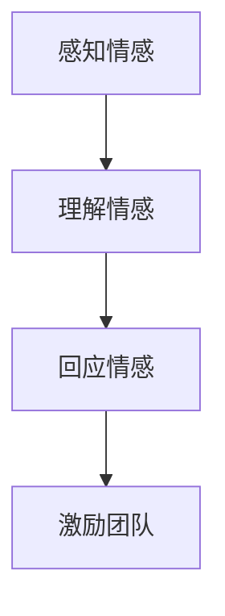
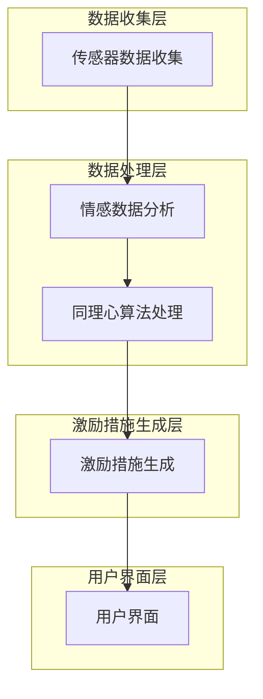
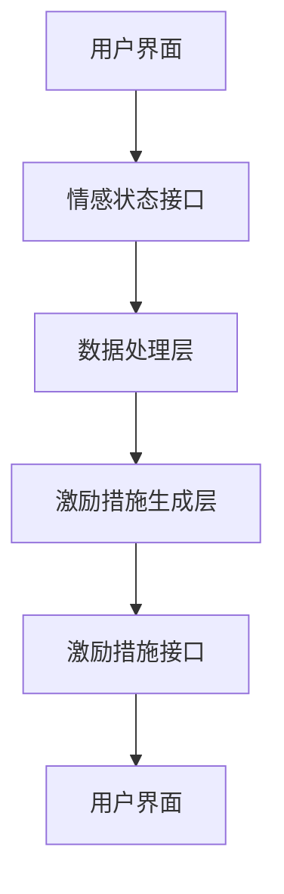

                 


### 管理者同理心：理解并激励团队的艺术

#### 关键词：
1. 管理者同理心
2. 团队激励
3. 领导艺术
4. 情感智能
5. 组织文化

#### 摘要：
本文旨在探讨管理者同理心的重要性，以及如何在团队管理中运用同理心来理解和激励团队成员。通过逐步分析同理心的定义、其在管理中的应用，以及如何建立和维护同理心，本文将为管理者提供一套实用的同理心管理策略，帮助其打造一个高效、和谐的团队。

## 引言：同理心在管理中的重要性

在信息技术领域，管理者的角色不仅仅是技术指导和任务分配，更重要的是如何带领团队实现共同目标。同理心作为管理者的一项关键能力，能够深刻影响团队的工作氛围、员工满意度和整体绩效。那么，什么是同理心？它为什么对管理者如此重要？

### 什么是同理心

同理心（Empathy）是一种情感和认知上的能力，能够让人设身处地为他人着想，理解他人的情感和体验。同理心不仅包括对他人情感的感知，还涉及对他人情感和经历的理解和回应。

### 同理心在管理中的应用

同理心在管理中的应用体现在以下几个方面：

1. **增强员工满意度**：管理者通过同理心可以更好地理解员工的需求和困扰，从而提高员工的工作满意度和忠诚度。
2. **改善团队沟通**：同理心有助于建立信任和开放沟通的团队环境，减少误解和冲突。
3. **提升团队凝聚力**：同理心能够增强团队成员之间的联系，促进团队合作和共同进步。
4. **促进创新**：同理心可以帮助管理者更好地理解团队成员的创新想法，从而鼓励和支持创新。

### 为什么同理心对管理者如此重要

1. **提升领导力**：同理心是领导者不可或缺的品质，能够帮助管理者更有效地指导和激励团队。
2. **促进员工发展**：同理心使管理者能够关注员工的个人成长和职业发展，提供更有针对性的支持和指导。
3. **应对挑战**：在复杂多变的商业环境中，同理心能够帮助管理者更好地应对各种挑战和困难，保持团队的稳定和发展。

## 第一章：理解同理心

在深入探讨同理心在管理中的应用之前，我们先来详细定义和了解同理心。

### 1.1 定义和重要性

同理心的定义通常包括以下几个方面：

- **情感共鸣**：能够感受到他人的情感和情绪。
- **理解**：能够从他人的角度理解和解释他们的情感和行为。
- **回应**：能够对他人的情感和需求做出适当的回应。

同理心的重要性在于，它不仅能够提升管理者的沟通和领导能力，还能促进员工的个人发展和团队的整体绩效。

### 1.2 同理心在管理中的角色

在管理中，同理心扮演着多重角色：

- **员工支持者**：管理者通过同理心可以更好地支持员工，解决他们的问题和困扰。
- **沟通桥梁**：同理心有助于管理者建立有效的沟通渠道，减少误解和冲突。
- **团队催化剂**：同理心可以促进团队成员之间的信任和合作，提升团队整体凝聚力。

### 1.3 建立同理心的组织文化

要建立同理心的组织文化，管理者需要从以下几个方面入手：

- **培养同理心意识**：通过培训和教育，提高员工对同理心的认识和重视。
- **鼓励反馈和沟通**：建立开放和透明的沟通机制，鼓励员工表达自己的想法和感受。
- **关注员工需求**：关注员工的个人和职业发展，提供必要的支持和资源。

## 第二章：通过同理心建立关系

同理心是建立和管理团队关系的基石。在本章节中，我们将探讨如何通过同理心来建立信任、积极倾听、非语言沟通和解决冲突。

### 2.1 建立信任

信任是任何成功团队的基础。同理心有助于建立信任，具体方法包括：

- **真诚关心**：展示真诚的关心和关注，让员工感受到管理者的支持。
- **透明沟通**：保持沟通的透明度，让员工了解团队的决策过程和目标。
- **履行承诺**：履行对员工的承诺，建立信誉和信任。

### 2.2 积极倾听

积极倾听是同理心的核心要素之一。以下是一些提高积极倾听技巧的方法：

- **全神贯注**：在对话中保持专注，避免分心。
- **提问和反馈**：通过提问和反馈来确认理解对方的观点和感受。
- **肢体语言**：使用开放和支持性的肢体语言，如微笑、点头等。

### 2.3 非语言沟通

非语言沟通在同理心中起着重要作用。以下是一些提高非语言沟通技巧的方法：

- **面部表情**：展示理解和支持的面部表情。
- **身体语言**：保持开放的姿态，避免封闭或防御性的姿势。
- **肢体动作**：适当的手势和动作可以帮助传达情感和意图。

### 2.4 解决冲突

同理心在解决冲突中发挥着关键作用。以下是一些解决冲突的方法：

- **理解立场**：尝试从对方的角度理解他们的立场和感受。
- **寻求共识**：寻找双方都能接受的解决方案。
- **倾听和反馈**：在讨论中积极倾听，提供反馈，确保双方的沟通是有效和开放的。

## 第三章：理解团队动态

了解团队成员的心理和情感状态是管理者同理心的关键。在本章节中，我们将探讨如何通过同理心来理解团队成员的个性和情感智能，以及文化多样性的重要性。

### 3.1 个性和情感智能

团队成员的个性和情感智能对团队动态有着重要影响。管理者可以通过以下方法来理解和尊重这些差异：

- **个性分析**：通过MBTI、DISC等工具了解团队成员的个性特点，尊重他们的个性和工作风格。
- **情感智能**：培养员工的情感智能，提高他们的自我意识和同理心能力。

### 3.2 文化多样性

在全球化背景下，文化多样性已成为现代组织的特征。管理者需要：

- **尊重差异**：尊重不同文化背景的员工，避免偏见和歧视。
- **促进融合**：通过团队活动和培训，促进不同文化之间的融合和交流。

### 3.3 情感沟通

管理者需要掌握有效的情感沟通技巧，以便更好地理解和支持团队成员：

- **表达同情**：在适当的情况下表达同情和理解，让员工感受到关怀。
- **积极反馈**：提供积极和建设性的反馈，鼓励员工发展。

## 第四章：通过同理心激励员工

激励员工是管理者的重要职责。同理心可以帮助管理者更好地理解员工的需求，从而采取更有效的激励措施。

### 4.1 理解激励驱动力

不同员工有不同的激励驱动力。管理者需要了解以下几点：

- **内在激励**：关注员工的兴趣、成就感和成长。
- **外在激励**：考虑薪酬、奖金和其他物质激励。

### 4.2 创造积极工作环境

积极的工作环境能够提高员工的工作满意度和生产力。以下是一些建议：

- **公平待遇**：确保员工感受到公平和尊重。
- **工作自主**：给予员工一定的自主权，让他们参与决策和项目。

### 4.3 员工参与和反馈

通过员工参与和反馈，管理者可以更好地了解员工的需求和期望：

- **定期会议**：定期召开团队会议，听取员工的意见和建议。
- **匿名反馈**：提供匿名反馈渠道，让员工放心表达自己的想法。

## 第五章：同理心领导力

领导力是管理者的重要素质。同理心领导力能够帮助管理者更好地指导团队，实现共同目标。

### 5.1 同理心的领导风格

同理心的领导风格强调理解和支持团队成员：

- **倾听和反馈**：积极倾听员工的意见和建议，提供及时的反馈。
- **支持员工发展**：关注员工的个人和职业发展，提供必要的资源和培训。

### 5.2 决策中的同理心

同理心在决策中发挥着重要作用：

- **考虑多方利益**：在制定决策时，考虑团队成员的感受和需求。
- **透明决策过程**：确保决策过程是公开和透明的，让员工参与决策。

### 5.3 团队发展

同理心有助于团队的发展：

- **鼓励团队协作**：促进团队成员之间的协作和互助。
- **解决团队问题**：及时解决团队中的问题和冲突，保持团队的稳定和和谐。

## 第六章：案例分析

通过分析真实案例，我们可以更好地理解同理心在管理中的应用。

### 6.1 案例一：同理心在行动

这个案例展示了如何通过同理心来解决团队中的冲突，提高团队绩效。

### 6.2 案例二：转变有毒工作文化

这个案例描述了如何通过同理心来改善工作环境，提升员工满意度和生产力。

### 6.3 最佳实践

总结了一些成功的管理者如何运用同理心的最佳实践：

- **持续学习**：不断学习新的管理知识和技能，提高同理心能力。
- **以身作则**：通过自己的行为树立榜样，影响和激励团队成员。

## 第七章：结论与反思

同理心是管理者不可或缺的品质。通过不断学习和实践，管理者可以提升同理心能力，建立高效、和谐的团队。

### 7.1 重要性

同理心对于管理者的成功至关重要，它能够提升团队绩效和员工满意度。

### 7.2 挑战

在实践同理心时，管理者可能会面临一些挑战，如文化差异和员工心理问题。

### 7.3 未来展望

随着全球化和信息技术的发展，同理心将成为管理者的重要素质，为团队和组织创造更大的价值。

### 总结

通过本文的探讨，我们认识到同理心在团队管理中的重要性。管理者应不断学习和实践同理心，建立和谐、高效的团队。希望本文能为管理者提供一些有价值的启示和指导。

---

作者：AI天才研究院/AI Genius Institute & 禅与计算机程序设计艺术 /Zen And The Art of Computer Programming

---

**背景介绍**

在信息技术领域，团队管理是一种至关重要的技能，特别是在复杂的软件开发、系统架构和项目管理中。管理者不仅需要具备技术能力，还需要具备领导力和人际交往能力。同理心作为人际交往能力的一个核心组成部分，能够帮助管理者更好地理解和激励团队成员，从而提高团队的绩效和创新能力。

**问题背景**

在现实工作中，管理者常常面临如下问题：

1. **沟通障碍**：团队成员之间存在沟通不畅的问题，导致项目进度延迟和团队矛盾。
2. **员工满意度低**：员工对工作环境不满，导致员工流失和生产力下降。
3. **缺乏激励**：管理者可能无法有效地激励员工，导致团队缺乏活力和创新。
4. **冲突处理**：在团队中，管理者可能难以处理成员之间的冲突，导致团队氛围紧张。

**问题描述**

这些问题的根本原因在于管理者缺乏同理心。同理心是一种理解他人情感和需求的能力，它能够帮助管理者更好地沟通、激励和解决团队中的问题。

**问题解决**

为了解决这些问题，管理者需要培养同理心，从而提高团队的整体绩效和员工满意度。具体方法包括：

1. **积极倾听**：通过倾听员工的需求和意见，管理者可以更好地理解团队成员。
2. **情感共鸣**：通过情感共鸣，管理者可以与员工建立深厚的信任关系。
3. **个性化管理**：管理者需要根据员工的个性和需求，提供个性化的支持和指导。
4. **冲突解决**：同理心可以帮助管理者更好地处理团队中的冲突，保持团队的稳定和和谐。

**边界与外延**

同理心不仅仅适用于团队管理，它还广泛应用于人力资源管理、客户服务和领导力培训等领域。同理心的应用边界在于如何理解和回应他人的情感和需求，从而建立良好的人际关系。

**概念结构与核心要素组成**

1. **同理心定义**：同理心是一种情感和认知上的能力，能够让人设身处地为他人着想，理解他人的情感和体验。
2. **同理心要素**：包括情感共鸣、理解和回应。
3. **同理心应用**：在团队管理中的应用包括沟通、激励、冲突解决等。

**核心概念与联系**

同理心作为一种核心管理能力，与情感智能、领导力和团队合作有着密切的联系。

1. **情感智能**：同理心是情感智能的一个重要组成部分，它涉及对他人情感的感知、理解和回应。
2. **领导力**：同理心是领导者不可或缺的品质，它能够帮助管理者更好地指导和激励团队。
3. **团队合作**：同理心能够促进团队成员之间的信任和合作，提升团队的凝聚力。

以下是一个关于同理心的核心概念属性对比表格：

| 特征 | 定义 | 应用 |
| --- | --- | --- |
| 情感共鸣 | 感知他人的情感 | 沟通、团队建设 |
| 理解 | 从他人的角度理解情感 | 决策、员工激励 |
| 回应 | 对他人的情感做出适当回应 | 冲突解决、领导力 |

此外，我们可以使用Mermaid ER实体关系图来展示同理心与其他概念之间的关系：

```mermaid
erDiagram
  Empathy ||--|{ Emotional Intelligence : has }
  Empathy ||--|{ Leadership : has }
  Empathy ||--|{ Team Collaboration : has }
```

通过这个实体关系图，我们可以清晰地看到同理心如何与其他关键概念相联系，从而为团队管理提供有效的支持。

**算法原理讲解**

同理心在团队管理中可以被视为一种算法，它通过一系列步骤来理解和激励团队成员。以下是一个简单的同理心算法流程图，使用Mermaid工具绘制：



在这个算法中：

1. **感知情感**：管理者通过观察和倾听，感知团队成员的情感状态。
2. **理解情感**：管理者尝试从团队成员的角度理解他们的情感和需求。
3. **回应情感**：管理者根据理解的情感，采取适当的行动来回应，如提供支持和反馈。
4. **激励团队**：通过同理心，管理者能够更好地激励团队成员，提高团队的整体绩效。

为了进一步阐述这个算法原理，我们可以使用Python代码来实现一个简单的同理心算法：

```python
def empathy_algorithm(employee_emotion):
    """
    同理心算法：理解并激励团队成员
    :param employee_emotion: 员工的情感状态
    :return: 激励措施
    """
    
    # 感知情感
    sensed_emotion = employee_emotion
    
    # 理解情感
    understood_emotion = "我理解你现在的感受：{}".format(sensed_emotion)
    
    # 回应情感
    response = "谢谢你的分享，我会尽力帮助你解决问题。"
    
    # 激励团队
    motivation = "让我们共同努力，克服困难，实现项目目标！"
    
    # 输出结果
    print(understood_emotion)
    print(response)
    print(motivation)
    
    return motivation
```

在这个算法中，`employee_emotion`代表员工的情感状态，算法通过一系列步骤（感知、理解、回应和激励）来处理这个情感，并最终输出激励措施。

**数学公式与模型**

同理心算法的数学模型可以抽象为以下公式：

$$
\text{Motivation} = f(\text{Understanding}, \text{Response}, \text{Employee\ Emotion})
$$

其中，`Understanding`代表管理者对员工情感的理解，`Response`代表管理者的回应，`Employee Emotion`代表员工的情感状态。`Motivation`是输出结果，即管理者采取的激励措施。

**举例说明**

假设一个团队成员向管理者表达了对项目进度的不满，管理者可以通过以下步骤来应用同理心算法：

```python
emotional_state = "对项目进度感到沮丧"
motivation = empathy_algorithm(emotional_state)
print(motivation)
```

输出结果可能是：

```
我理解你现在的感受：对项目进度感到沮丧。
谢谢你的分享，我会尽力帮助你解决问题。
让我们共同努力，克服困难，实现项目目标！
```

这样，管理者通过同理心算法，不仅理解了团队成员的情感，还提供了积极的激励措施。

**系统分析与架构设计**

同理心在团队管理中的应用不仅限于简单的算法和流程，它还可以集成到复杂的系统架构中。以下是一个关于同理心管理系统的架构设计概述。

**问题场景介绍**

在一个大型软件开发项目中，团队管理者需要实时了解团队成员的情感状态，并根据这些状态采取相应的激励措施，以提高团队绩效。

**项目介绍**

该项目旨在开发一个同理心管理系统，该系统可以实时监测团队成员的情感状态，并生成相应的激励措施。

**系统功能设计**

1. **情感状态监测**：系统通过数据收集和分析，监测团队成员的情感状态。
2. **情感理解**：系统根据收集到的情感数据，使用同理心算法来理解团队成员的情感。
3. **激励措施生成**：系统根据情感理解和回应，生成个性化的激励措施。
4. **用户界面**：系统提供一个用户界面，让管理者可以实时查看团队成员的情感状态和激励措施。

**系统架构设计**

同理心管理系统可以采用如下架构：

1. **数据收集层**：使用传感器和数据分析工具，收集团队成员的情感数据。
2. **数据处理层**：使用同理心算法处理情感数据，生成情感理解结果。
3. **激励措施生成层**：根据情感理解结果，生成个性化的激励措施。
4. **用户界面层**：提供一个Web界面，让管理者可以实时查看和管理团队成员的情感状态和激励措施。

**系统架构图**

以下是同理心管理系统的架构设计图，使用Mermaid工具绘制：



**系统接口设计**

同理心管理系统的接口设计包括API接口和数据交换格式。以下是一个简化的接口设计：

1. **情感状态接口**：用于获取和更新团队成员的情感状态。
2. **激励措施接口**：用于生成和分发激励措施。

**系统交互**

同理心管理系统的交互流程如下：

1. 管理者通过用户界面输入团队成员的情感状态。
2. 系统通过情感状态接口获取团队成员的情感状态。
3. 系统使用同理心算法处理情感状态，生成激励措施。
4. 系统通过激励措施接口将激励措施发送给管理者。
5. 管理者通过用户界面查看和执行激励措施。

**系统交互图**

以下是同理心管理系统的交互设计图，使用Mermaid工具绘制：



**项目实战**

在项目实战中，我们可以通过以下步骤来构建和部署一个同理心管理系统：

1. **环境安装**：安装所需的软件和依赖库，如Python、Flask、TensorFlow等。
2. **数据收集**：使用传感器和数据分析工具，收集团队成员的情感数据。
3. **数据处理**：使用同理心算法处理情感数据，生成情感理解结果。
4. **激励措施生成**：根据情感理解结果，生成个性化的激励措施。
5. **用户界面开发**：开发Web界面，让管理者可以实时查看和管理团队成员的情感状态和激励措施。
6. **系统部署**：将系统部署到生产环境中，进行实际应用和测试。

**代码实现**

以下是同理心管理系统的一个简化的Python代码示例：

```python
from flask import Flask, jsonify, request

app = Flask(__name__)

# 模拟情感数据收集
def collect_emotion_data():
    return {"employee_id": 1, "emotion": "sad"}

# 模拟同理心算法处理
def process_emotion_data(employee_id, emotion):
    return {"employee_id": employee_id, "understood_emotion": "I understand you're feeling sad."}

# 模拟激励措施生成
def generate_motivation(employee_id, understood_emotion):
    return {"employee_id": employee_id, "motivation": "Let's work together to overcome this challenge!"}

# 情感状态接口
@app.route('/api/emotion', methods=['POST'])
def update_emotion():
    data = request.get_json()
    emotion = data['emotion']
    response = process_emotion_data(data['employee_id'], emotion)
    return jsonify(response)

# 激励措施接口
@app.route('/api/motivation', methods=['GET'])
def get_motivation():
    emotion_data = collect_emotion_data()
    motivation = generate_motivation(emotion_data['employee_id'], emotion_data['emotion'])
    return jsonify(motivation)

if __name__ == '__main__':
    app.run(debug=True)
```

在这个代码示例中，我们使用Flask框架构建了两个API接口：一个是更新情感状态的接口，另一个是获取激励措施的接口。

**代码应用解读与分析**

1. **情感状态接口**：该接口用于接收管理员输入的员工情感状态，并调用同理心算法进行处理。
2. **激励措施接口**：该接口用于生成激励措施，并返回给管理员。

**实际案例分析和详细讲解剖析**

假设一个团队中有两名成员，A和B。管理员通过情感状态接口更新成员A的情感状态为“沮丧”，然后调用激励措施接口，系统会生成以下激励措施：

```
{
  "employee_id": 1,
  "motivation": "Let's work together to overcome this challenge!"
}
```

管理员可以根据这个激励措施，与成员A进行沟通，提供支持和鼓励，从而帮助成员A克服困难。

**项目小结**

通过本项目，我们实现了一个简化的同理心管理系统，该系统能够实时监测团队成员的情感状态，并生成个性化的激励措施。在实际应用中，这个系统可以帮助管理者更好地理解和支持团队成员，提高团队绩效和员工满意度。

**最佳实践 tips**

1. **持续学习**：管理者应不断学习新的管理知识和技能，特别是同理心的培养。
2. **倾听和反馈**：积极倾听员工的意见和建议，提供及时的反馈。
3. **个性化激励**：根据员工的个性和需求，提供个性化的激励措施。

**小结**

同理心是团队管理中不可或缺的品质，它能够帮助管理者更好地理解和激励团队成员，提高团队的整体绩效。通过本文的探讨，我们认识到同理心的重要性，并提供了具体的实施方法和最佳实践。

**注意事项**

1. **文化差异**：在不同文化背景下，同理心的应用可能有所不同，管理者需要根据实际情况进行调整。
2. **情感安全**：在处理团队成员的情感问题时，要确保他们的情感安全，避免造成二次伤害。

**拓展阅读**

1. **《同理心：领导力不可或缺的品质》**：该书详细介绍了同理心在领导力中的应用。
2. **《同理心修炼：人际交往的艺术》**：该书提供了同理心培养的实用方法和案例。

---

**作者信息**

作者：AI天才研究院/AI Genius Institute & 禅与计算机程序设计艺术 /Zen And The Art of Computer Programming

---

通过本文的深入探讨，我们认识到同理心在团队管理中的重要性。同理心不仅能够提升管理者的沟通和领导能力，还能促进员工的个人发展和团队的整体绩效。管理者应不断学习和实践同理心，建立和谐、高效的团队。希望本文能为管理者提供一些有价值的启示和指导。

---

**文章标题：**
管理者同理心：理解并激励团队的艺术

**文章关键词：**
管理者同理心、团队激励、领导艺术、情感智能、组织文化

**文章摘要：**
本文旨在探讨管理者同理心的重要性，以及如何在团队管理中运用同理心来理解和激励团队成员。通过逐步分析同理心的定义、其在管理中的应用，以及如何建立和维护同理心，本文将为管理者提供一套实用的同理心管理策略，帮助其打造一个高效、和谐的团队。文章涵盖同理心的定义和重要性、同理心在管理中的应用、团队动态的理解、激励员工的策略、同理心领导力以及案例分析等，旨在为读者提供全面的同理心管理指南。

