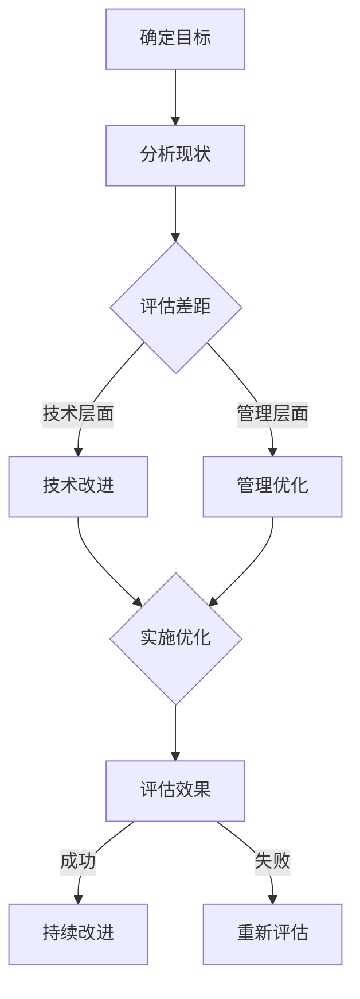

                 

### 管理者思维模式概述

在信息技术迅速发展的今天，管理者角色的转变已成为企业持续发展的关键因素。本文以《管理者思维模式：从执行者到领导者的转变》为题，深入探讨管理者思维模式的演变，以及如何在实践中实现这一转变。本文将结合具体的理论模型和实践案例，帮助读者理解并掌握管理者所需的思维模式，从而提升个人及团队的管理效能。

#### 背景介绍

**核心概念术语说明**：本文中的“执行者”指的是在组织中专注于具体任务和目标实现的人员，他们往往具备出色的执行能力和技术专长；而“领导者”则是指能够在组织中激励团队、制定战略并推动变革的决策者。

**问题背景**：随着企业环境的变化，仅具备执行能力的执行者已难以应对复杂的业务挑战。管理者需要从执行者角色向领导者角色转变，以适应快速变化的市场和技术环境。

**问题描述**：如何在日常工作中培养并运用领导者思维模式，成为有效的领导者？

**问题解决**：通过系统地介绍管理者思维模式，分析执行者与领导者思维模式的差异，提供培养领导者思维的方法和实践指南。

**边界与外延**：本文主要讨论企业管理者在日常运营和战略决策中的思维模式转变，不涉及其他类型组织或个人的领导思维。

**概念结构与核心要素组成**：管理者思维模式的核心要素包括系统性思维、逆向思维、创新思维和适应性思维。这些要素相互关联，共同构成了领导者思维模式的基础。

#### 核心概念与联系

**核心概念原理**：

- **系统性思维**：关注整体，理解各部分之间的关系，能够从全局角度分析和解决问题。
- **逆向思维**：从结果出发，反推问题的根本原因，从而找到解决问题的方法。
- **创新思维**：鼓励探索新的思路和方法，不断推动技术和管理上的突破。
- **适应性思维**：灵活应对变化，快速调整策略，以适应不断变化的环境。

**概念属性特征对比表格**：

| 思维模式 | 特征 | 重要性 |
| --- | --- | --- |
| 系统性思维 | 全局视角，关注关系 | 解决复杂问题的必备能力 |
| 逆向思维 | 反向思考，寻找根本原因 | 提高决策质量和效率 |
| 创新思维 | 探索新思路，推动变革 | 保持组织竞争力 |
| 适应性思维 | 灵活应变，快速调整 | 确保组织持续发展 |

**ER实体关系图架构的 Mermaid 流程图**：

```mermaid
erDiagram
  产品管理 <<|-- 系统架构设计 :使用
  项目管理 <<|-- 团队协作 :领导
  技术创新 <<|-- 产品迭代 :驱动
  市场变化 <<|-- 战略调整 :应对
```

#### 算法原理讲解

在管理者思维模式中，算法原理和数学模型的应用同样重要。以下是一个简化的算法流程图，用于解释系统性思维的应用。

**Mermaid 流�程图**：



**Python 源代码**：

```python
def manager_mind_model(goal, current_state):
    gap = calculate_gap(goal, current_state)
    if gap['technical']:
        improvement = technical_improvement(gap['technical'])
        apply_improvement(improvement)
    if gap['management']:
        optimization = management_optimization(gap['management'])
        apply_optimization(optimization)
    result = evaluate_effectiveness()
    if result['success']:
        continue_improvement()
    else:
        reevaluate_goal()

def calculate_gap(goal, current_state):
    # 计算目标与现状的差距
    pass

def technical_improvement(technical_gap):
    # 技术改进措施
    pass

def management_optimization(management_gap):
    # 管理优化措施
    pass

def apply_improvement(improvement):
    # 实施技术改进
    pass

def apply_optimization(optimization):
    # 实施管理优化
    pass

def evaluate_effectiveness():
    # 评估改进效果
    pass

def continue_improvement():
    # 持续改进
    pass

def reevaluate_goal():
    # 重新评估目标
    pass
```

**数学模型和公式**：

- **目标函数**：最大化效益（或最小化成本）
- **约束条件**：资源限制、时间限制、质量要求

**详细讲解与举例说明**：

假设一家科技公司希望提高产品交付效率，管理者可以使用上述算法模型进行系统性分析。首先，确定目标（提高交付效率），分析现状（当前的交付速度），评估差距（技术和管理层面的问题），然后采取相应的技术改进措施和管理优化措施，最后评估改进效果并持续改进。

**数学公式**：

$$
\text{效益} = f(\text{技术改进}, \text{管理优化})
$$

$$
\text{约束条件}: R \leq R_{\text{max}}, T \leq T_{\text{max}}, Q \geq Q_{\text{min}}
$$

其中，\( R \) 为资源，\( T \) 为时间，\( Q \) 为质量，\( R_{\text{max}} \)、\( T_{\text{max}} \) 和 \( Q_{\text{min}} \) 分别为资源、时间和质量的限制条件。

通过以上详细的算法原理讲解和举例说明，读者可以更深入地理解管理者思维模式中算法的应用，为实际工作提供有益的参考。

### 第一部分：管理者思维模式概述

#### 第1章：管理者思维模式的背景与重要性

随着信息技术的迅猛发展，企业管理者的角色和职责也在不断演变。传统意义上的执行者，在当今复杂多变的市场环境中已难以应对各种挑战。因此，管理者需要具备更加全面和深入的思维模式，从执行者转变为领导者，以适应现代企业的需求。本章将详细探讨管理者思维模式的背景、重要性以及执行者与领导者思维模式的对比。

#### 1.1 管理者思维模式的概念解析

**管理者思维模式**是指管理者在决策、规划、执行和评估过程中所采用的一系列思维方式和认知策略。这种思维模式不仅包括逻辑分析、创新思维和系统性思维，还涉及到对人际关系的处理、对环境变化的适应以及对未来趋势的预见。管理者思维模式是管理者能力的重要组成部分，它决定了管理者在复杂多变的环境中的应变能力和决策质量。

**执行者思维模式**通常关注具体任务的完成，注重效率和质量，强调细节和执行力。执行者思维模式的核心在于将计划转化为实际行动，并确保目标的实现。然而，在高度复杂和动态变化的商业环境中，单纯依靠执行者思维模式往往难以应对突发情况和新挑战。

**领导者思维模式**则更加强调全局视角、战略规划和团队激励。领导者不仅要能够制定清晰的愿景和目标，还要具备激发团队潜力和推动变革的能力。领导者思维模式的核心在于通过激发和引导团队，实现组织目标的最大化。

#### 1.2 管理者角色转变的必要性

**管理者角色转变的必要性**主要体现在以下几个方面：

1. **市场环境的变化**：随着全球化和互联网技术的发展，市场环境变得更加复杂和多变。企业面临的市场竞争不仅来自同行业内的对手，还可能来自跨界竞争。在这种情况下，管理者需要具备更高的适应能力和前瞻性思维，以应对市场变化。

2. **技术创新的加速**：技术的快速进步使得企业必须不断进行创新和变革，以保持竞争力。管理者需要具备创新思维和系统性思维，能够引导团队进行技术创新和管理创新。

3. **人力资源管理的重要性**：人才是企业最重要的资源。管理者需要具备良好的人际关系处理能力和团队管理能力，能够激发员工的潜能，提升团队的协作效率。

4. **企业战略的调整**：企业战略的制定和调整需要管理者具备全局视角和前瞻性思维。管理者需要能够根据外部环境和内部资源的变化，制定和调整战略，确保企业的可持续发展。

#### 1.3 执行者与领导者思维模式的对比

**执行者思维模式**与**领导者思维模式**在多个方面存在显著差异：

1. **关注点不同**：执行者思维模式注重具体任务的完成，而领导者思维模式则更注重整体目标的实现和团队协作。

2. **视野不同**：执行者通常关注短期目标，而领导者则具备更长远的眼光，能够预见未来趋势并制定相应的战略。

3. **决策风格不同**：执行者决策通常更加理性和基于数据，而领导者则更加注重直觉和洞察力，能够在不确定的环境中做出快速决策。

4. **影响力不同**：执行者主要通过个人能力和执行力影响工作，而领导者则通过激发团队潜力和建立信任关系来影响整个组织。

**结论**：

管理者思维模式的转变是从执行者到领导者的关键。通过培养系统性思维、逆向思维、创新思维和适应性思维，管理者可以更好地应对现代企业的挑战，实现组织目标的最大化。在下一章中，我们将进一步探讨这些核心思维模式的详细解析和应用。

### 第二部分：管理者核心思维模式解析

在实现从执行者到领导者的转变过程中，管理者需要掌握并灵活运用多种核心思维模式。这些思维模式不仅有助于提升管理者的决策质量，还能增强团队的整体效能。在本部分中，我们将详细解析系统性思维、逆向思维、创新思维和适应性思维，探讨每种思维模式的核心要素及其应用方法。

#### 第2章：管理者核心思维模式解析

#### 2.1 系统性思维

**系统性思维**是管理者必须掌握的关键思维模式之一。它强调从整体和全局的角度分析和解决问题，关注各部分之间的相互作用和影响。系统性思维能够帮助管理者更好地理解复杂问题，制定全面和协调的解决方案。

**2.1.1 系统性思维的定义与重要性**

**定义**：系统性思维是指将事物视为一个整体，并关注其组成部分之间相互关系和影响的思维方式。它不仅关注个体的性能，还关注系统整体的性能和优化。

**重要性**：在复杂多变的环境中，系统性思维有助于管理者更好地应对挑战。以下是一些系统性思维的重要性：

- **全面分析**：系统性思维能够帮助管理者从多个角度分析问题，避免片面和短视的决策。
- **协调各方利益**：通过理解各部分之间的相互作用，管理者可以更有效地协调各方利益，实现资源的最优配置。
- **预防问题**：系统性思维能够帮助管理者预见潜在问题，提前制定预防措施，降低风险。

**2.1.2 系统性思维的运用**

要运用系统性思维，管理者可以采取以下步骤：

1. **定义目标**：明确系统的目标，确保所有分析和决策都围绕目标展开。
2. **识别系统组成部分**：分析系统中的各个组成部分，明确它们之间的相互关系。
3. **建立模型**：使用图形化工具（如 Mermaid 流程图）建立系统模型，帮助理解系统结构和动态。
4. **进行系统分析**：分析系统在不同情况下的表现，识别潜在问题和瓶颈。
5. **制定解决方案**：基于系统分析结果，制定综合性的解决方案。

**示例**：

假设一家制造企业希望提高生产效率。通过系统性思维，管理者可以采取以下步骤：

1. **定义目标**：提高生产效率，降低生产成本。
2. **识别系统组成部分**：生产设备、工人、物料供应、生产流程等。
3. **建立模型**：使用 Mermaid 流程图建立生产系统模型，明确各部分之间的关系。
4. **进行系统分析**：分析生产过程中的瓶颈和浪费点。
5. **制定解决方案**：引入自动化设备、优化生产流程、提高工人培训等。

#### 2.2 逆向思维

**逆向思维**是一种从结果出发，反向推导问题根本原因的思维方式。与传统的正向思维不同，逆向思维能够帮助管理者从不同的角度看待问题，找到更有效的解决方案。

**2.2.1 逆向思维的概念与特点**

**概念**：逆向思维是指从结果出发，反向推导问题的根本原因，从而找到解决问题的方法。

**特点**：

- **反向思考**：逆向思维强调从结果出发，反向思考问题的根本原因。
- **多角度分析**：逆向思维能够帮助管理者从多个角度分析问题，避免单一思维的限制。
- **创新性**：逆向思维往往能够带来创新的解决方案，突破传统的思维模式。

**2.2.2 逆向思维的实践与应用**

要实践逆向思维，管理者可以采取以下步骤：

1. **确定目标**：明确要解决的问题或要达成的目标。
2. **设定假设**：假设目标没有实现，思考可能的原因。
3. **反向推导**：从结果出发，反向推导问题的根本原因。
4. **分析选项**：基于反向推导的结果，分析不同的解决方案。
5. **选择最佳方案**：选择最有可能解决问题的方案。

**示例**：

假设一家零售企业希望提高销售额。通过逆向思维，管理者可以采取以下步骤：

1. **确定目标**：提高销售额。
2. **设定假设**：假设销售额没有提高，思考可能的原因，如顾客满意度低、产品竞争力不足等。
3. **反向推导**：分析顾客满意度低的原因，可能包括服务质量差、产品不符合顾客需求等。
4. **分析选项**：提高服务质量、优化产品设计和营销策略等。
5. **选择最佳方案**：选择提高服务质量，因为这与顾客满意度直接相关。

#### 2.3 创新思维

**创新思维**是管理者必须具备的重要思维模式之一。它强调探索新的思路和方法，推动技术和管理上的突破，以保持企业的竞争力。

**2.3.1 创新思维的重要性**

**重要性**：

- **保持竞争力**：创新思维能够帮助企业保持竞争优势，适应市场变化。
- **推动发展**：创新思维能够推动企业技术和管理上的突破，实现可持续发展。
- **激发潜力**：创新思维能够激发员工创造力和潜能，提升团队整体效能。

**2.3.2 创新思维的培养与激发**

要培养和激发创新思维，管理者可以采取以下方法：

1. **建立创新文化**：鼓励员工提出创新想法，对创新行为给予奖励和支持。
2. **提供培训**：为员工提供创新思维相关的培训，提升其创新意识和能力。
3. **鼓励跨部门合作**：通过跨部门合作，促进不同领域知识和经验的交流，激发创新灵感。
4. **建立创新机制**：建立创新机制，如创新实验室、头脑风暴会等，为创新提供平台和机会。

**示例**：

假设一家互联网公司希望提升用户体验。通过创新思维，管理者可以采取以下步骤：

1. **建立创新文化**：鼓励员工提出改进用户体验的想法，并对创新行为给予奖励。
2. **提供培训**：为员工提供用户体验设计相关的培训，提升其创新能力。
3. **鼓励跨部门合作**：组织跨部门团队，共同研究用户体验问题，寻找解决方案。
4. **建立创新机制**：设立用户体验创新实验室，定期进行头脑风暴会，收集和筛选创新想法。

#### 2.4 适应性思维

**适应性思维**是指管理者能够灵活应对变化，快速调整策略，以适应不断变化的环境。在快速变化的市场环境中，适应性思维是管理者必须具备的关键能力。

**2.4.1 适应性思维的定义与作用**

**定义**：适应性思维是指管理者能够根据外部环境和内部资源的变化，灵活调整策略和行动，以适应新情况。

**作用**：

- **应对变化**：适应性思维能够帮助管理者迅速应对市场变化和不确定性。
- **降低风险**：通过灵活调整策略，管理者可以降低因环境变化带来的风险。
- **持续发展**：适应性思维能够帮助企业保持持续发展，适应长期竞争。

**2.4.2 提高适应性思维的策略**

要提高适应性思维，管理者可以采取以下策略：

1. **持续学习**：不断学习新知识、新技能，提高对环境的敏感度和应变能力。
2. **建立预警机制**：建立外部环境监测和内部风险预警机制，提前识别潜在问题。
3. **保持灵活性**：在制定战略和决策时，保持一定的灵活性，以便快速调整。
4. **培养团队适应性**：通过培训和团队建设，提高团队成员的适应能力。

**示例**：

假设一家电子商务公司面临市场竞争激烈的环境。通过适应性思维，管理者可以采取以下步骤：

1. **持续学习**：关注行业动态，学习新的营销策略和技术。
2. **建立预警机制**：监测市场变化，提前识别竞争对手的动向。
3. **保持灵活性**：根据市场变化，调整产品策略和营销计划。
4. **培养团队适应性**：通过培训，提高团队在应对市场变化时的应变能力。

**结论**：

管理者核心思维模式包括系统性思维、逆向思维、创新思维和适应性思维。这些思维模式不仅有助于提升管理者的决策质量，还能增强团队的整体效能。在下一章中，我们将探讨从执行者到领导者思维模式转变的必要性和方法。

### 第3章：执行者思维模式的局限性

在企业管理中，执行者思维模式长期以来一直占据重要地位，其专注于任务的具体实施和目标的达成。然而，随着企业环境的日益复杂和多变，执行者思维模式逐渐暴露出其局限性，难以适应现代企业管理的需求。本章将详细分析执行者思维模式的特征及其局限性，并探讨如何突破这些局限。

#### 3.1 执行者思维模式的特征

**执行者思维模式**具有以下主要特征：

1. **注重细节**：执行者通常关注任务的具体实施过程，注重每一个细节的落实。
2. **效率导向**：执行者注重工作效率，追求任务的高效完成。
3. **单一目标**：执行者往往专注于短期目标的实现，追求快速和直接的成果。
4. **个人能力依赖**：执行者的能力很大程度上依赖于个人的专业技能和执行力。

**3.2 执行者思维模式的局限性**

尽管执行者思维模式在许多情况下表现出色，但它也存在一些显著的局限性：

1. **视野狭窄**：执行者往往缺乏全局视角，难以从整体上分析和解决问题。
2. **缺乏前瞻性**：执行者更关注短期目标和任务完成，缺乏对未来趋势和长期发展的规划。
3. **难以应对不确定性**：在复杂多变的环境中，执行者思维模式往往难以应对不确定性和突发情况。
4. **人际沟通不足**：执行者可能缺乏人际沟通和团队协作能力，难以有效地协调和激励团队。

**3.3 如何突破执行者思维模式的瓶颈**

为了突破执行者思维模式的局限性，管理者可以采取以下策略：

1. **培养系统性思维**：通过系统性思维，管理者能够从全局视角分析和解决问题，避免片面和短视的决策。
2. **提升前瞻性**：通过学习和研究，管理者可以增强对市场趋势和未来发展的洞察力，制定长期战略。
3. **增强适应性**：通过建立预警机制和灵活调整策略，管理者能够更好地应对不确定性和突发情况。
4. **强化团队协作**：通过培养团队协作和沟通能力，管理者可以更好地激发团队潜力和提高整体效能。

**示例**：

假设一家科技公司需要应对激烈的市场竞争。通过突破执行者思维模式的局限，管理者可以采取以下步骤：

1. **培养系统性思维**：通过定期召开战略会议，分析市场竞争态势，制定全面应对策略。
2. **提升前瞻性**：通过市场研究和行业分析，提前预判市场变化，制定创新产品规划。
3. **增强适应性**：建立快速响应机制，根据市场反馈及时调整产品策略和营销方案。
4. **强化团队协作**：通过团队建设活动和跨部门合作，提高团队协作效率和创新能力。

**结论**：

执行者思维模式在简单和稳定的环境中具有一定的优势，但在复杂和多变的市场环境中，其局限性逐渐显现。管理者需要通过培养系统性思维、提升前瞻性、增强适应性和强化团队协作，实现从执行者到领导者的转变。在下一章中，我们将详细探讨领导者思维模式的核心要素和培养方法。

### 第4章：领导者思维模式培养

在企业管理中，领导者思维模式至关重要。它不仅能够帮助管理者制定战略、激发团队潜力，还能在复杂多变的环境中实现组织的持续发展。本章将详细探讨领导者思维模式的核心要素，以及如何在实际工作中培养和应用这些思维模式。

#### 4.1 领导者思维模式的核心要素

领导者思维模式包含以下核心要素：

1. **系统性思维**：领导者应具备全局观念，能够从整体角度分析和解决问题。
2. **前瞻性思维**：领导者需要预见未来趋势，制定长期战略。
3. **团队协作能力**：领导者应擅长协调团队，激发团队成员的潜力。
4. **变革管理能力**：领导者需要推动组织变革，适应外部环境的变化。
5. **沟通与表达能力**：领导者应具备良好的沟通和表达能力，确保信息准确传达。

**4.2 培养领导者思维模式的方法**

要培养领导者思维模式，管理者可以采取以下方法：

1. **自我反思**：定期进行自我反思，识别自身的优势和不足，明确改进方向。
2. **持续学习**：通过学习新的管理知识和技能，不断提升自身的综合素质。
3. **实践经验**：通过实际工作，积累经验，提高处理复杂问题的能力。
4. **团队建设**：通过团队活动和沟通，增强团队凝聚力，提升协作效率。
5. **模拟训练**：参加领导力培训和工作坊，进行模拟训练，提高应对复杂情况的能力。

**示例**：

假设一位科技公司管理者希望通过培养领导者思维模式，实现企业的长期发展。他可以采取以下步骤：

1. **自我反思**：每周进行一次自我反思，记录自身的成功经验和失败教训，明确改进方向。
2. **持续学习**：定期参加行业会议和培训，学习新的管理理念和技术。
3. **实践经验**：在实际工作中，尝试运用系统性思维和前瞻性思维，分析并解决复杂问题。
4. **团队建设**：定期组织团队建设活动，如团队拓展训练和头脑风暴会，提高团队协作能力。
5. **模拟训练**：参加领导力培训和工作坊，通过模拟情景训练，提高应对突发情况和变革管理的能力。

**4.3 实践中的领导者思维模式运用**

在实际工作中，领导者思维模式的运用至关重要。以下是一个简化的示例，用于解释领导者如何运用系统性思维和前瞻性思维。

**示例：**

**系统性思维应用**

假设一家制造企业希望提高生产效率。领导者可以采取以下步骤：

1. **定义目标**：明确生产效率提高的具体目标。
2. **识别系统组成部分**：分析生产系统中的各个组成部分，如生产设备、工人、物料供应等。
3. **建立模型**：使用 Mermaid 流程图建立生产系统模型，明确各部分之间的关系。
4. **进行系统分析**：分析生产过程中的瓶颈和浪费点。
5. **制定解决方案**：根据系统分析结果，制定全面的生产优化方案。

**前瞻性思维应用**

假设一家互联网公司面临技术更新迅速的挑战。领导者可以采取以下步骤：

1. **预见未来趋势**：通过市场研究和技术分析，预见未来技术发展趋势。
2. **制定长期战略**：根据未来趋势，制定长期技术发展计划。
3. **提前布局**：投资于新兴技术，提前布局，抢占市场先机。
4. **持续优化**：根据市场反馈，不断调整和优化技术战略。

**结论**：

领导者思维模式的培养需要持续的努力和实践。通过自我反思、持续学习、实践经验、团队建设和模拟训练，管理者可以不断提升自身的领导能力。在实际工作中，领导者应灵活运用系统性思维和前瞻性思维，以实现组织的长期发展。在下一章中，我们将探讨管理者的决策思维和决策过程。

### 第5章：领导者沟通与领导力提升

沟通与领导力是管理者成功的关键要素。一个有效的领导者不仅要具备卓越的技术和管理能力，还要拥有出色的沟通技巧和领导力。本章将探讨领导者沟通的重要性、有效沟通的策略以及提升领导力的关键要素。

#### 5.1 领导者沟通的重要性

**5.1.1 领导者沟通的重要性**

领导者沟通的重要性体现在以下几个方面：

1. **信息传递**：领导者需要将战略、目标和期望清晰地传达给团队成员，确保信息准确无误。
2. **团队协作**：良好的沟通有助于建立团队信任，促进成员之间的协作和合作。
3. **员工激励**：领导者通过沟通可以了解员工的需求和期望，从而激发员工的积极性。
4. **问题解决**：通过沟通，领导者可以及时发现和解决团队中的问题，避免冲突和误解。

**5.1.2 有效沟通的策略**

为了实现有效的沟通，领导者可以采取以下策略：

1. **明确目标**：在沟通前明确沟通的目标和重点，确保信息传达的针对性。
2. **倾听**：积极倾听员工的意见和反馈，了解他们的需求和困惑。
3. **简洁明了**：使用简单明了的语言传达信息，避免使用过于复杂的术语和概念。
4. **双向沟通**：鼓励团队成员提出问题和意见，形成双向沟通，增强互动。
5. **及时反馈**：及时给予员工反馈，让他们了解自己的表现和改进方向。

**5.2 领导者沟通的策略**

**5.2.1 确定沟通目标**

在沟通前，领导者需要明确沟通的目标和重点。这包括：

- **传达战略和目标**：确保团队成员了解组织的愿景、使命和战略。
- **解释决策过程**：让员工了解决策的背景、原因和预期效果。
- **激励员工**：通过沟通传达组织的价值观和目标，激发员工的积极性和归属感。

**5.2.2 倾听和反馈**

倾听是有效沟通的关键。领导者需要：

- **主动倾听**：给予员工充分的发言机会，不打断他们的讲话。
- **同理心**：站在员工的角度思考问题，理解他们的感受和需求。
- **及时反馈**：对员工提出的问题和意见给予及时的反馈，帮助他们理解决策和改进。

**5.2.3 使用简洁明了的语言**

领导者应避免使用复杂的术语和概念，而是使用简单明了的语言传达信息。这包括：

- **使用具体事例**：通过具体事例说明问题，使信息更加易懂。
- **避免行话**：避免使用行业内的行话，确保信息对所有人都是可理解的。
- **保持一致**：在沟通中保持一致的信息和表述，避免混淆和误解。

**5.2.4 鼓励双向沟通**

双向沟通有助于建立团队的信任和协作。领导者可以：

- **鼓励提问**：鼓励团队成员提问，表达他们的想法和意见。
- **开放讨论**：在团队会议中鼓励开放讨论，让每个人都能参与和表达。
- **解决冲突**：通过沟通解决团队中的冲突和误解，确保团队的和谐与稳定。

**5.3 提升领导力的关键要素**

**5.3.1 增强自我认知**

提升领导力首先需要增强自我认知。这包括：

- **了解自己的优势和不足**：通过自我反思和评估，了解自己的优势和需要改进的方面。
- **设定个人目标**：制定个人发展目标，不断提升自己的能力和素质。

**5.3.2 培养同理心**

同理心是领导者成功的关键。这包括：

- **理解员工的需求和感受**：通过倾听和互动，理解员工的实际需求和感受。
- **尊重员工的意见**：尊重员工的意见和决策，鼓励他们参与团队决策。

**5.3.3 增强决策能力**

决策能力是领导者必备的能力。这包括：

- **制定明确的目标和标准**：在决策前明确目标和标准，确保决策有明确的依据。
- **收集和分析信息**：通过收集和分析信息，提高决策的准确性和有效性。
- **勇于承担责任**：在决策过程中勇于承担责任，对自己的决策负责。

**5.3.4 增强团队协作能力**

团队协作能力是提升领导力的关键。这包括：

- **建立信任和合作**：通过信任和合作，增强团队的凝聚力和协作效率。
- **培养团队精神**：鼓励团队成员相互支持，共同实现团队目标。

**结论**：

领导者沟通和领导力提升是管理者成功的关键。通过明确沟通目标、倾听和反馈、使用简洁明了的语言、鼓励双向沟通以及增强自我认知、同理心、决策能力和团队协作能力，领导者可以提升自身的沟通和领导力，实现组织的持续发展。在下一章中，我们将探讨管理者的决策思维和决策过程。

### 第6章：管理者的决策思维

决策思维是管理者在工作中不可或缺的重要能力。有效的决策思维能够帮助管理者在面对复杂和不确定性时做出明智的选择，从而实现组织的战略目标。本章将详细探讨管理者的决策思维概念、常见决策误区及优化策略，并说明如何培养有效的决策思维。

#### 6.1 决策思维的概念与模型

**6.1.1 决策思维的概念**

决策思维是指管理者在决策过程中所采用的一系列思考方式和判断标准。它涉及对信息的收集、分析、评估以及选择最佳方案的过程。决策思维不仅包括逻辑分析和理性判断，还涉及直觉、经验和洞察力。

**6.1.2 决策思维模型**

常见的决策思维模型包括：

1. **理性决策模型**：基于逻辑和分析，通过最大化效益或最小化损失来选择最佳方案。
2. **直觉决策模型**：依赖于管理者的经验和直觉，快速做出决策。
3. **情景决策模型**：根据不同的情景和假设，评估不同方案的结果，选择最合适的方案。

#### 6.2 决策思维中的常见误区及优化策略

**6.2.1 常见误区**

1. **信息过载**：在信息丰富的环境中，管理者容易受到大量信息的影响，导致决策困难。
2. **确认偏误**：当管理者持有某种观点时，容易忽视与该观点不一致的信息，导致偏见。
3. **群体思维**：在团队决策中，管理者可能因为群体压力而放弃个人观点，导致决策质量下降。
4. **时间压力**：在紧迫的时间限制下，管理者可能无法充分考虑所有因素，做出匆忙决策。

**6.2.2 优化策略**

为了克服决策思维中的常见误区，管理者可以采取以下策略：

1. **信息筛选**：对收集的信息进行筛选，重点关注与决策相关的关键信息。
2. **系统化分析**：使用决策思维模型，系统地分析各种因素和选项，避免信息过载和确认偏误。
3. **多样性和开放性**：鼓励团队成员提出不同的观点和方案，增强决策的多样性和开放性，减少群体思维。
4. **时间管理**：合理分配时间，确保有足够的时间进行决策分析，避免时间压力导致的匆忙决策。

#### 6.3 培养有效的决策思维

**6.3.1 自我反思**：定期进行自我反思，评估自己的决策过程和结果，识别改进点。

**6.3.2 学习与实践**：通过学习新的决策理论和模型，结合实际工作经验进行实践，不断提高决策能力。

**6.3.3 沟通与反馈**：与团队成员进行有效沟通，获取反馈和建议，改进决策过程。

**6.3.4 培养批判性思维**：培养批判性思维能力，对信息进行分析和评估，避免盲目接受。

#### 6.4 实例分析

**实例**：一家公司需要决定是否进行产品线的扩展。管理者可以采取以下步骤进行决策：

1. **信息收集**：收集市场需求、竞争情况、资源限制等信息。
2. **系统化分析**：使用决策思维模型，分析每种扩展方案的可能结果。
3. **情景模拟**：假设不同市场情景，评估每种方案在不同情景下的效果。
4. **团队讨论**：与团队成员讨论不同方案，获取反馈和建议。
5. **决策制定**：根据分析结果和团队讨论，选择最佳方案。

通过以上实例，可以看出有效的决策思维不仅包括逻辑分析和信息评估，还涉及团队合作和情景模拟。管理者需要不断培养和提升自己的决策思维，以应对复杂和不确定的业务环境。

### 第7章：管理者的团队建设

团队建设是管理者工作中的一项重要任务，它不仅关系到团队的整体效能，还影响到组织的持续发展和员工的工作满意度。本章将探讨团队建设的重要性、团队建设的策略与技巧，以及团队效能的提升。

#### 7.1 团队建设的重要性

**7.1.1 团队建设的重要性**

团队建设在企业管理中具有重要作用，主要体现在以下几个方面：

1. **提升团队效能**：通过有效的团队建设，可以提升团队的整体效能，实现组织目标的顺利达成。
2. **增强团队凝聚力**：团队建设有助于增强团队成员之间的信任和合作，提升团队的凝聚力。
3. **促进个人发展**：团队建设为员工提供了学习和发展机会，有助于提升员工的技能和职业素养。
4. **提升员工满意度**：良好的团队氛围和工作环境能够提升员工的工作满意度和忠诚度。

**7.1.2 团队建设的目标**

团队建设的目标主要包括：

1. **明确团队目标**：确保团队成员对团队目标和组织目标有清晰的认识。
2. **增强团队协作**：通过有效的沟通和协作，提升团队的执行力。
3. **提升团队凝聚力**：建立信任和合作关系，增强团队的凝聚力。
4. **促进个人发展**：为团队成员提供成长和发展的机会，激发其潜能。

#### 7.2 团队建设的策略与技巧

**7.2.1 制定清晰的团队目标**

清晰的团队目标是团队建设的首要任务。管理者应确保团队目标与组织目标一致，并能够被团队成员理解和接受。以下是一些制定团队目标的策略：

1. **明确性**：确保目标具体、清晰，避免模糊和抽象。
2. **可实现性**：目标应具有可实现性，避免设定过高或不切实际的目标。
3. **可测量性**：目标应具备可测量的标准，以便评估进度和效果。
4. **时限性**：为每个目标设定明确的时间期限，确保团队有明确的努力方向。

**7.2.2 增强团队协作**

有效的团队协作是提升团队效能的关键。以下是一些增强团队协作的策略：

1. **建立沟通机制**：确保团队成员之间的信息畅通，通过定期会议、即时通讯等方式保持沟通。
2. **分配明确职责**：为每个团队成员分配明确的职责和任务，确保团队成员知道自己需要做什么。
3. **促进跨部门合作**：鼓励不同部门之间的合作，通过项目合作、培训等方式促进跨部门沟通和协作。
4. **共享资源**：提供共享的资源，如文档库、工作平台等，方便团队成员协作。

**7.2.3 提升团队凝聚力**

提升团队凝聚力有助于增强团队的稳定性。以下是一些提升团队凝聚力的策略：

1. **共同目标**：确保团队成员对团队目标和组织目标有共同的理解和认同。
2. **团队文化**：建立积极的团队文化，鼓励团队成员之间的互助和合作。
3. **奖励与认可**：对团队成员的贡献给予奖励和认可，提升团队士气。
4. **团队建设活动**：定期组织团队建设活动，如团建、培训等，增强团队成员之间的情感联系。

**7.2.4 促进个人发展**

为团队成员提供成长和发展的机会，有助于提升团队的总体素质和效能。以下是一些促进个人发展的策略：

1. **培训与发展**：提供专业培训和职业发展机会，提升团队成员的技能和知识。
2. **反馈与评估**：定期进行员工绩效评估，提供具体的反馈和改进建议。
3. **晋升机会**：为表现优秀的员工提供晋升机会，激励员工不断进取。
4. **工作生活平衡**：关注员工的工作生活平衡，提供灵活的工作安排，减轻工作压力。

#### 7.3 团队效能的提升

**7.3.1 提高团队执行力**

提升团队执行力是团队效能的重要体现。以下是一些提高团队执行力的策略：

1. **明确任务分配**：确保每个团队成员对任务有清晰的认识，明确责任和权限。
2. **制定详细的计划**：为每个项目制定详细的计划，明确任务的时间表和里程碑。
3. **建立监控机制**：建立有效的监控机制，跟踪项目的进展情况，及时调整和优化。
4. **激励与反馈**：通过激励措施和及时反馈，提升团队成员的积极性和执行力。

**7.3.2 增强团队协作**

增强团队协作是提升团队效能的关键。以下是一些增强团队协作的策略：

1. **建立信任**：通过共同目标和团队建设活动，建立团队成员之间的信任。
2. **提高沟通效率**：通过有效的沟通工具和方法，提高团队内部的信息传递效率。
3. **协调资源**：合理分配和协调团队资源，确保项目能够顺利进行。
4. **跨部门合作**：鼓励跨部门之间的合作，通过项目协作和知识共享，提升整体效能。

**7.3.3 提升团队创新能力**

创新是团队持续发展的动力。以下是一些提升团队创新能力的策略：

1. **鼓励创新思维**：为团队成员创造一个开放和创新的工作环境，鼓励他们提出新的想法和解决方案。
2. **定期头脑风暴**：通过定期举行头脑风暴会议，激发团队成员的创造力和创新思维。
3. **提供培训**：为团队成员提供创新思维和创意技巧的培训，提升他们的创新能力。
4. **激励机制**：设立创新奖励机制，对提出有效创新方案和实施成功的团队给予奖励和认可。

**结论**：

团队建设是管理者工作中的一项重要任务，它关系到团队的整体效能和组织的持续发展。通过制定清晰的团队目标、增强团队协作、提升团队凝聚力以及促进个人发展，管理者可以有效地提升团队效能。在下一章中，我们将通过一个实践案例，探讨如何从执行者转变为领导者，实现管理者的角色转变。

### 第8章：从执行者到领导者的实践案例

#### 8.1 案例介绍

本案例涉及一家中型软件公司，该公司在市场竞争日益激烈的环境中，面临客户需求快速变化和技术不断更新的挑战。公司最初由一位技术出身的高管领导，他作为执行者，专注于技术细节和项目实施，但在面对复杂的市场环境和快速变化的需求时，逐渐暴露出领导力的不足。为了提升公司的竞争力和市场地位，公司决定实施领导力转型，将这位高管从执行者角色转变为领导者。

#### 8.2 案例分析

**8.2.1 执行者思维模式的表现**

- **技术导向**：高管在担任执行者期间，注重技术实现和项目交付，对市场需求和客户反馈关注较少。
- **个人能力依赖**：高管依靠个人技术专长和执行力，团队整体依赖性强，缺乏团队协作。
- **短期目标**：高管关注短期项目进展和绩效，缺乏对长期战略的规划和思考。

**8.2.2 领导者思维模式的转变**

在领导力转型过程中，高管采取了一系列措施，逐步从执行者转变为领导者：

- **系统性思维**：高管开始关注公司整体运营，从整体角度分析和解决问题。
- **团队协作**：高管重视团队建设和协作，通过培训和激励，提升团队整体能力。
- **前瞻性思维**：高管制定长期战略，关注市场趋势和技术发展，提前布局。
- **沟通与激励**：高管加强与员工的沟通，建立信任关系，激励团队积极参与决策。

**8.2.3 领导力转型的效果**

通过领导力转型，公司取得了显著成效：

- **市场竞争力提升**：公司能够更快地响应市场变化，推出符合客户需求的新产品。
- **团队效能提高**：团队成员的积极性和创造力得到激发，项目质量和交付效率显著提升。
- **客户满意度增加**：客户对公司的产品和服务满意度提高，客户关系得到巩固。
- **公司业绩增长**：公司业绩稳步增长，市场份额和盈利能力显著提升。

#### 8.3 案例启示与总结

**8.3.1 案例启示**

1. **领导者需要具备系统性思维**：从整体角度分析和解决问题，提升决策质量和效率。
2. **团队协作是关键**：通过培训和激励，提升团队整体能力，实现共同目标。
3. **前瞻性思维**：预见市场趋势和技术发展，提前布局，保持竞争力。
4. **沟通与激励**：建立信任关系，激励团队积极参与决策，提升整体效能。

**8.3.2 总结**

通过本案例，可以看出从执行者到领导者的转变是一个系统性的过程，需要管理者在思维方式、团队建设和战略规划等方面进行全方位的提升。有效的领导力不仅能够提升个人和团队的效能，还能推动组织的持续发展和成功。在下一章中，我们将总结全文，展望未来领导者思维模式的趋势。

### 第9章：总结与展望

#### 9.1 管理者思维模式的重要性回顾

在本文中，我们深入探讨了管理者思维模式的演变，从执行者到领导者的转变，以及如何通过系统性思维、逆向思维、创新思维和适应性思维提升管理者的决策质量和团队效能。回顾全文，我们得出以下几点重要结论：

1. **系统性思维**：系统性思维帮助管理者从全局角度分析和解决问题，提高决策的全面性和准确性。
2. **逆向思维**：逆向思维通过从结果出发，反向推导问题的根本原因，找到更有效的解决方案。
3. **创新思维**：创新思维推动技术和管理上的突破，保持企业的竞争力和创新能力。
4. **适应性思维**：适应性思维帮助管理者灵活应对变化，快速调整策略，确保组织的持续发展。

#### 9.2 未来领导者思维模式的趋势

随着信息技术的不断进步和全球市场的深度融合，未来领导者思维模式将呈现以下趋势：

1. **数字化转型**：数字化转型将成为企业发展的关键驱动力，领导者需要具备数字化思维，引领企业向数字化转型。
2. **全球化视野**：全球化背景下的领导者需要具备跨文化沟通和管理能力，能够应对全球化带来的挑战和机遇。
3. **可持续思维**：可持续发展将成为企业战略的重要组成部分，领导者需要具备可持续发展的思维，推动企业的可持续发展。
4. **人工智能应用**：人工智能技术的广泛应用将改变企业管理模式，领导者需要了解和掌握人工智能的基本原理和应用，提升管理效能。

#### 9.3 对管理者提出的建议与展望

针对未来的领导者，我们提出以下建议：

1. **持续学习**：不断学习新的管理知识和技能，提升自身的综合素质。
2. **培养系统性思维**：通过系统化分析和全局视角，提高决策质量和团队效能。
3. **增强适应性**：灵活应对市场变化和技术进步，持续调整和优化管理策略。
4. **重视团队建设**：建立信任和合作的团队文化，提升团队凝聚力和创新能力。
5. **关注可持续发展**：将可持续发展纳入企业战略，推动企业的长期健康发展。

**展望未来**：

随着全球化和数字化进程的加速，管理者面临的挑战和机遇将更加复杂和多样。只有具备先进的管理思维模式，才能在激烈的市场竞争中脱颖而出。我们期待未来的领导者能够不断适应和创新，推动企业的持续发展和成功。

### 作者信息

**作者：** AI天才研究院/AI Genius Institute & 禅与计算机程序设计艺术 /Zen And The Art of Computer Programming

**感谢您的阅读！** 我们希望本文能够为您的管理实践提供有益的启示和帮助。未来，我们将继续探讨更多管理和技术领域的深度话题，期待与您共同成长。**祝您工作顺利，事业成功！**

