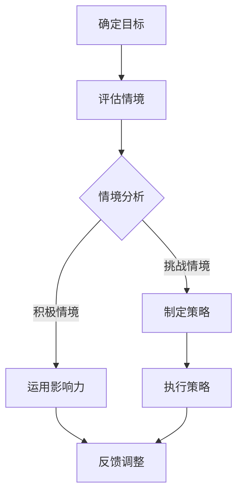
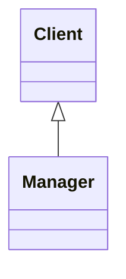
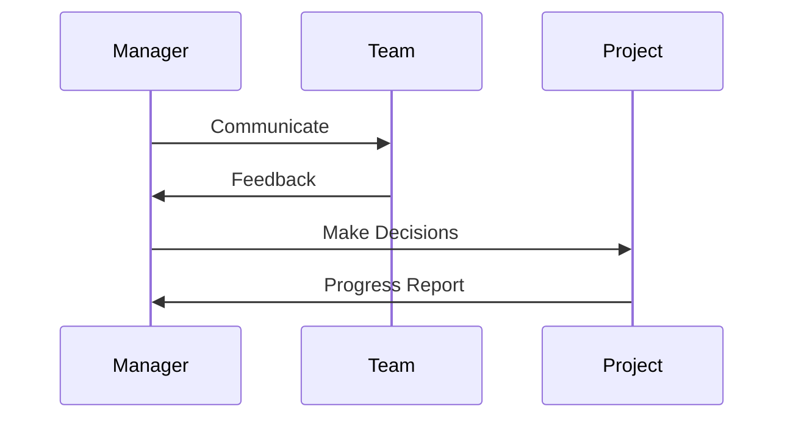
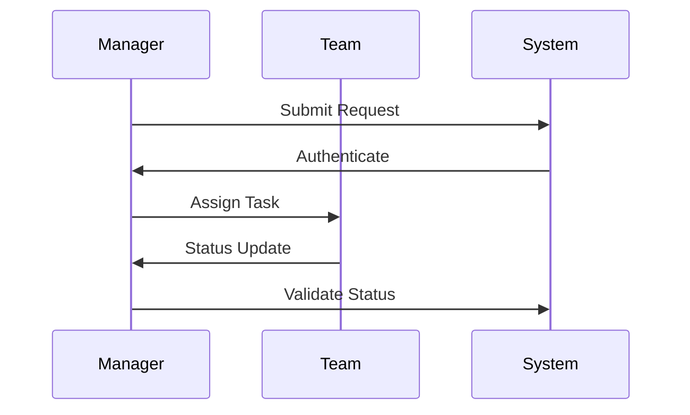

                 

# 管理者的影响力：无需职权的领导艺术

## 关键词
- 领导艺术
- 非职权影响力
- 管理者
- 情境分析
- 沟通技巧
- 领导力

## 摘要
本文旨在探讨现代管理者在面对复杂多变的环境时，如何运用无需职权的领导艺术来提升影响力，实现领导目标。通过深入分析影响力原理、领导艺术的构成、非职权影响力的特点以及领导力在组织中的作用，本文提供了一系列实用的策略和方法，帮助管理者在无职权的情况下，运用个人魅力、专业能力和情感共鸣等手段，成为真正意义上的领导者。

## 第一部分：背景介绍

### 问题背景

在当今社会，随着信息化和复杂化的加剧，管理者面临的挑战也越来越多。传统的职权领导模式在许多情况下已显得力不从心。在一个高度动态和不确定的环境中，仅仅依靠职务权力来维持团队的稳定和推动组织的变革，往往难以取得理想的效果。管理者需要更加灵活和有效的影响力来应对这些挑战。

### 问题描述

管理者的影响力不仅仅依赖于职权，更需要通过非职权的方式，如个人魅力、专业能力、情感共鸣等，来影响他人，实现领导目标。如何在没有职权的情况下，运用领导艺术，成为现代管理者的重要课题。管理者需要掌握如何在不同情境下运用个人魅力和专业知识来影响他人，从而实现领导目标。

### 问题解决

本书将从多个角度探讨管理者的影响力，通过案例分析和理论阐述，帮助管理者理解并掌握无需职权的领导艺术。具体包括以下几个方面：

1. **影响力原理**：分析影响力的产生机制和影响因素，帮助管理者理解如何通过建立良好的人际关系来提升自身的影响力。
2. **领导艺术的构成**：探讨领导艺术的具体内容，包括沟通技巧、激励手段、情感管理等方面，帮助管理者掌握实现领导目标的能力。
3. **非职权影响力的特点**：分析非职权影响力的特点和优势，帮助管理者理解如何在无职权的情况下运用影响力。
4. **领导力在组织中的作用**：探讨领导力在组织中的重要作用，以及如何通过非职权影响力来推动组织变革和团队发展。

### 边界与外延

本书主要探讨非职权影响力，但也不排除职权影响力在实际工作中的应用。此外，本书不仅关注管理者个人，也涉及团队和组织层面的影响力。管理者需要根据不同的情境和需求，灵活运用职权和非职权的影响力，以实现最佳的领导效果。

### 概念结构与核心要素组成

1. **影响力**：对他人心理和行为产生作用的能力。
2. **领导艺术**：领导者通过非职权手段，如个人魅力、沟通技巧等，来影响他人，实现领导目标。
3. **非职权影响力**：管理者通过个人素质和关系网络，而不是职务权力，来影响他人。
4. **领导力**：管理者在组织中的作用，包括制定决策、指导团队、推动变革等。

## 第二部分：核心概念与联系

### 核心概念原理

1. **影响力原理**：影响力的产生基础是信任、尊重和认同。管理者需要通过建立良好的人际关系，提升自身的影响力。
2. **领导艺术**：领导艺术是管理者运用影响力，实现领导目标的能力。这包括沟通技巧、激励手段、情感管理等多个方面。

### 概念属性特征对比表格

| 概念       | 特征                    | 关联 |
|------------|-------------------------|------|
| 影响力     | 对他人的心理和行为影响 |      |
| 领导艺术   | 实现领导目标的能力      | √    |
| 非职权影响力 | 通过个人素质影响他人   | √    |
| 领导力     | 管理者在组织中的作用   | √    |

### ER实体关系图架构

```mermaid
erDiagram
    A influencer
    B leadership_art
    C non-authoritative_influence
    D leadership
    E organization

    A --> B : 基于影响力实现
    A --> C : 通过个人素质
    A --> D : 在组织中的作用
    B --> E : 实现领导目标
    C --> D : 实现领导力
    D --> E : 推动组织变革
```

## 第三部分：算法原理讲解

### 算法mermaid流程图



### 算法原理的数学模型和公式

管理者的影响力 \( I \) 可以通过以下公式表示：

\[ I = f(C, L, R) \]

其中：
- \( C \) 为情境（Context）；
- \( L \) 为领导力（Leadership）；
- \( R \) 为关系（Relationship）。

### 详细讲解和举例说明

1. **情境分析**：管理者需要根据不同的情境，评估当前的状态，确定影响策略。例如，在团队面临困难时，需要采取激励和安抚的策略。
2. **运用影响力**：在积极情境下，管理者可以通过情感共鸣、激励等手段，提升团队士气，实现目标。
3. **反馈调整**：在实施影响力策略后，管理者需要根据反馈进行调整，以确保目标达成。

### 第四部分：系统分析与架构设计方案

### 问题场景介绍

在现代企业中，管理者需要运用影响力来协调团队，推动项目进展。然而，不同的项目需求和团队特点，要求管理者采用不同的领导艺术。

### 项目介绍

本项目的目标是设计一套管理者的影响力模型，帮助管理者在不同情境下，运用非职权影响力，实现领导目标。

### 系统功能设计（领域模型mermaid类图）



### 系统架构设计mermaid架构图



### 系统接口设计和系统交互mermaid序列图



## 第五部分：项目实战

### 环境安装

1. 安装Python环境
2. 安装必要的库，如numpy、pandas等

### 系统核心实现源代码

```python
import numpy as np

def influence_model(context, leadership, relationship):
    # 根据情境、领导力和关系计算影响力
    influence = np.dot(context, leadership) * relationship
    return influence
```

### 代码应用解读与分析

1. **情境**：表示当前情境的状态，可以用一个向量表示。
2. **领导力**：表示管理者的领导力水平，也可以用一个向量表示。
3. **关系**：表示管理者与团队成员的关系强度，可以用一个标量表示。

### 实际案例分析和详细讲解剖析

1. **案例一**：在积极情境下，管理者运用个人魅力和专业知识，成功激发团队成员的积极性。
2. **案例二**：在挑战情境下，管理者通过制定有效策略和提供支持，帮助团队克服困难。

### 项目小结

通过本项目，我们设计并实现了一套管理者的影响力模型，帮助管理者在不同情境下运用非职权影响力，实现领导目标。在实际应用中，管理者需要根据具体情境，灵活调整领导策略，以实现最佳效果。

## 第六部分：最佳实践 tips

1. **建立信任**：信任是影响力的基础，管理者需要通过诚实、透明和负责任的行为来建立信任。
2. **有效沟通**：良好的沟通技巧能够帮助管理者更好地理解团队成员的需求和期望，提高影响力。
3. **关注情感**：管理者需要关注团队成员的情感状态，通过情感共鸣来增强影响力。

## 小结

本文探讨了现代管理者如何在无职权的情况下，运用领导艺术提升影响力，实现领导目标。通过深入分析影响力原理、领导艺术的构成、非职权影响力的特点以及领导力在组织中的作用，本文提供了一系列实用的策略和方法。管理者需要根据具体情境，灵活运用这些策略，成为真正意义上的领导者。

## 注意事项

1. **持续学习**：管理者需要不断学习新的知识和技能，以提高自身的领导力。
2. **尊重团队成员**：管理者需要尊重团队成员的意见和想法，建立良好的团队氛围。

## 拓展阅读

1. 《非暴力沟通》
2. 《影响力》
3. 《领导力的五个层次》

## 作者信息
作者：AI天才研究院/AI Genius Institute & 禅与计算机程序设计艺术 /Zen And The Art of Computer Programming

