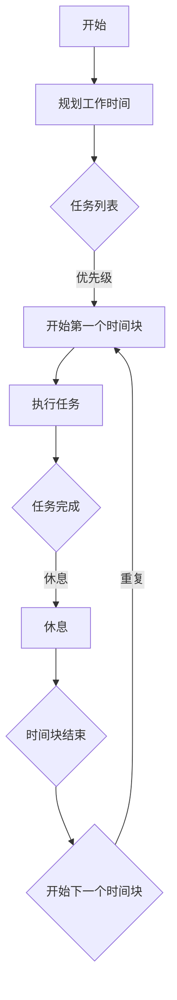
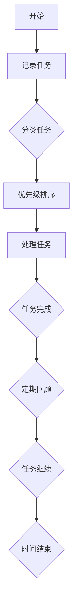
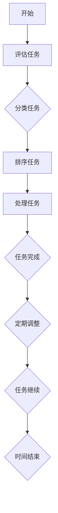
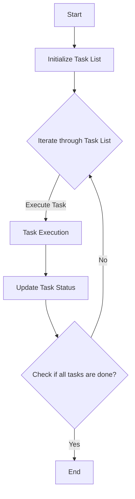

                 


### 1. 开头部分：介绍书名和书的主题

---

**# 第1章：时间管理的重要性**

在今天的快节奏社会中，时间管理已经成为了管理者必须掌握的一项重要技能。有效的管理时间不仅能够提升个人工作效率，还能显著提高团队的协作能力和整体生产力。《管理者的时间管理：提高效率的实用技巧》这本书正是为了解决这一痛点而诞生的。本书旨在通过系统的方法和实用的技巧，帮助管理者更高效地管理自己的时间，从而实现个人与团队的共同成长。

### 1.1 问题背景

#### 1.1.1 管理者面临的挑战

作为管理者，每天都需要处理大量的任务和事务，从日常运营到战略规划，几乎涵盖了公司的方方面面。这种多任务并行处理的特点，使得管理者很容易陷入“忙碌但低效”的困境。以下是管理者在时间管理方面常见的挑战：

- **任务繁多**：管理者往往面临多个同时进行的项目和任务，这些任务往往有紧迫性和重要性之分，如何合理分配时间和资源成为一大挑战。
- **时间碎片化**：现代工作环境中，各种突发事件和紧急任务不断打断工作流程，导致时间碎片化，难以集中精力处理重要任务。
- **优先级不明确**：在众多的任务中，如何确定哪些任务应该优先处理，哪些可以暂缓，是管理者经常遇到的问题。
- **沟通成本高**：管理者需要与团队成员、上级和利益相关者进行频繁沟通，沟通成本往往占据了大量的时间。

#### 1.1.2 时间管理的重要性

有效的时间管理不仅有助于提升个人工作效率，还能带来以下好处：

- **提高工作效率**：通过合理规划和分配时间，管理者能够更有效地完成工作任务，避免因为时间浪费而导致的效率低下。
- **减少压力**：良好的时间管理能够减少工作压力，使管理者能够更加从容地面对日常工作和突发状况。
- **提升团队效能**：通过帮助团队成员有效管理时间，管理者可以提升团队的协作能力和整体生产力，从而实现团队目标。
- **优化决策**：充足的时间准备和思考，可以帮助管理者做出更加明智和高效的决策。

### 1.2 问题描述

时间管理的核心问题是如何在有限的时间内，最大化地完成有价值的工作任务。具体来说，管理者需要解决以下问题：

- **如何确定优先级**：在面对多个任务时，管理者需要根据任务的重要性和紧急程度确定优先级，确保关键任务得到及时处理。
- **如何合理安排时间**：管理者需要根据自己的工作习惯和时间段的效率，合理规划每天的工作时间，避免时间浪费和疲劳。
- **如何提高工作效率**：通过使用各种时间管理工具和方法，提高个人的工作速度和质量，减少不必要的重复工作和错误。
- **如何协调团队时间**：管理者需要协调团队成员的工作时间，确保项目进度和团队协作的有效性。

### 1.3 问题解决

为了解决上述问题，本书将从以下几个方面提供解决方案：

- **时间管理理论**：介绍时间管理的基本概念和理论，帮助管理者理解时间管理的核心原理。
- **时间管理技巧**：提供一系列实用的技巧和方法，如时间块、待办事项清单、优先级排序等，帮助管理者更高效地管理时间。
- **个人技能提升**：介绍如何通过提高个人技能来提高工作效率，如时间管理软件的使用、时间管理心理学等。
- **团队协作**：探讨如何通过有效的团队协作来提高整体时间管理效能，如团队时间表、协同工作平台等。

### 1.4 边界与外延

#### 1.4.1 时间管理的范围

时间管理不仅仅是个人的事务，它还涉及到团队和组织的层面。在个人层面，时间管理关注的是如何合理安排个人的时间和任务；在团队层面，时间管理则关注如何协调团队成员的工作时间，确保项目进度和团队目标的实现；在组织层面，时间管理则涉及到整体工作流程的优化，如工作流程管理、项目管理等。

#### 1.4.2 时间管理的局限性

尽管时间管理对于提高工作效率和生产力至关重要，但它也存在一些局限性：

- **无法解决质量问题**：时间管理只能帮助管理者在有限的时间内完成更多的工作，但无法保证工作质量。
- **个体差异**：每个人的工作习惯和时间利用率不同，因此时间管理方法的效果也会因人而异。
- **外部因素**：时间管理无法完全控制外部因素，如突发事件、紧急任务等，这些因素可能会打断工作计划。

### 1.5 概念结构与核心要素组成

时间管理是一个复杂的系统，它涉及到多个核心概念和要素。以下是时间管理的一些关键概念和要素：

- **优先级**：确定任务的优先级是时间管理的重要环节，它有助于管理者明确哪些任务应该优先处理。
- **效率**：效率是指单位时间内完成的工作量，它是衡量时间管理效果的重要指标。
- **效能**：效能是指完成任务的总体质量，它是时间管理的终极目标。
- **时间块**：时间块是指将工作时间划分成若干个固定的时间段，以便更高效地完成任务。
- **待办事项清单**：待办事项清单是一种简单但非常有效的工具，用于记录和管理待完成的任务。
- **优先级排序**：优先级排序是确定任务优先级的步骤，它有助于确保关键任务得到及时处理。

### 1.6 本章小结

本章介绍了时间管理的重要性，以及管理者在时间管理方面面临的挑战和问题。通过理解时间管理的核心概念和要素，管理者可以更好地规划和利用时间，提高工作效率和团队效能。在接下来的章节中，我们将进一步探讨时间管理的关键概念和实用技巧，帮助管理者实现更高效的时间管理。

---

### 2. 背景介绍：介绍时间管理的重要性，以及为什么管理者需要时间管理

---

**# 第2章：核心概念与联系**

## 2.1 优先级

### 2.1.1 优先级的定义

在时间管理中，优先级是指根据任务的重要性和紧急程度来排列任务的顺序。优先级可以帮助管理者在有限的时间内，优先完成最关键的任务。

### 2.1.2 优先级的重要性

优先级的重要性在于它能够帮助管理者：

- **优化资源分配**：通过明确任务的优先级，管理者可以更有效地分配时间和资源，确保关键任务得到优先处理。
- **提高决策质量**：明确任务的优先级有助于管理者做出更加明智的决策，避免因任务繁多而导致的决策失误。
- **减少时间浪费**：优先级排序可以帮助管理者集中精力处理最重要的事务，从而减少时间浪费。

### 2.1.3 优先级的分类

优先级通常分为以下几种类型：

- **紧急且重要**：这类任务通常需要立即处理，否则可能会导致严重的后果。
- **紧急但不重要**：这类任务可能需要暂时处理，但不会对工作产生重大影响。
- **不紧急但重要**：这类任务需要合理安排时间，确保在未来得到及时处理。
- **不紧急且不重要**：这类任务可以暂时放置，但管理者应定期评估其重要性。

## 2.2 效率

### 2.2.1 效率的定义

效率是指单位时间内完成的工作量。在时间管理中，效率是衡量时间管理效果的重要指标。

### 2.2.2 提高效率的方法

以下是几种提高效率的方法：

- **合理规划时间**：通过合理规划每天的工作时间，确保任务在预定时间内完成。
- **消除干扰**：减少外部干扰，如关闭不必要的通知，确保专注工作。
- **分解任务**：将大任务分解为小任务，逐一完成，减少心理压力。
- **使用工具**：使用时间管理工具，如待办事项清单、时间跟踪工具等，提高工作有序性。

## 2.3 效能

### 2.3.1 效能的定义

效能是指完成任务的总体质量。高效能不仅意味着完成任务，还意味着任务完成的质量和效果。

### 2.3.2 提高效能的方法

以下是几种提高效能的方法：

- **持续学习**：不断学习新知识和技能，提高自己的专业水平和综合素质。
- **反思与改进**：定期反思自己的工作，找出存在的问题并不断改进。
- **团队合作**：与团队成员协作，共同完成任务，提高工作效率和效果。
- **目标明确**：明确任务目标和预期结果，确保工作方向正确。

## 2.4 概念属性特征对比表格

以下是对优先级、效率和效能的概念属性特征进行对比的表格：

| 概念 | 定义 | 属性特征 |
| --- | --- | --- |
| 优先级 | 根据任务的重要性和紧急程度来排列任务顺序 | 紧急性、重要性 |
| 效率 | 单位时间内完成的工作量 | 工作速度、工作质量 |
| 效能 | 完成任务的总体质量 | 任务完成度、任务效果 |

## 2.5 ER实体关系图架构

以下是时间管理系统中的ER实体关系图：

```mermaid
erDiagram
    Task ||--|{ Manager } : has
    Task ||--|{ Priority } : has
    Task ||--|{ Efficiency } : has
    Task ||--|{ Effectiveness } : has
```

在这个ER图中，`Task` 是中心实体，它与其他实体之间存在关联。`Manager` 表示任务的管理者，`Priority` 表示任务的优先级，`Efficiency` 表示任务的效率，`Effectiveness` 表示任务的效能。

## 2.6 本章小结

本章介绍了时间管理的核心概念，包括优先级、效率和效能。通过理解这些概念，管理者可以更好地规划和利用时间，提高工作效率和团队效能。在接下来的章节中，我们将继续探讨时间管理技巧和实践，帮助管理者实现更高效的时间管理。

---

### 3. 时间管理技巧

---

**# 第3章：时间管理技巧**

时间管理技巧是管理者在日常工作中运用的重要工具，可以帮助他们更高效地完成工作任务。以下将介绍几种常见的时间管理技巧，并使用Mermaid流程图展示它们的应用场景。

## 3.1 时间块

### 3.1.1 时间块的定义

时间块是一种将工作时间划分成固定时间段的方法，每个时间段专注于一项任务。这种方法有助于管理者减少时间碎片化，提高专注度。

### 3.1.2 时间块的应用场景

时间块适用于以下场景：

- **项目管理**：在项目执行过程中，时间块可以帮助团队成员更高效地完成任务。
- **会议管理**：在安排会议时，使用时间块确保会议在预定时间内完成。
- **个人时间管理**：在个人时间管理中，时间块可以帮助提高个人工作效率。

### 3.1.3 时间块的实施方法

实施时间块的方法如下：

1. **规划工作时间**：根据任务的重要性和紧急程度，规划每天的工作时间。
2. **分配时间段**：将工作时间划分成若干个固定的时间段，每个时间段专注于一项任务。
3. **设定时间限制**：在每个时间段内设定时间限制，确保任务在规定时间内完成。

### 3.1.4 Mermaid流程图

以下是一个时间块的应用场景的Mermaid流程图：



## 3.2 待办事项清单

### 3.2.1 待办事项清单的定义

待办事项清单是一种记录和管理待完成任务的工具，它有助于管理者清晰地了解自己的任务，并确保每个任务都得到及时处理。

### 3.2.2 待办事项清单的应用场景

待办事项清单适用于以下场景：

- **日常管理**：在日常工作中，待办事项清单可以帮助管理者记录和管理待完成的任务。
- **项目执行**：在项目执行过程中，待办事项清单可以帮助团队成员清晰地了解任务进度。
- **个人时间管理**：在个人时间管理中，待办事项清单可以帮助提高工作效率。

### 3.2.3 待办事项清单的实施方法

实施待办事项清单的方法如下：

1. **记录任务**：将所有待完成的任务记录在待办事项清单中。
2. **分类任务**：根据任务的重要性和紧急程度，对任务进行分类。
3. **优先级排序**：对任务进行优先级排序，确保关键任务得到优先处理。
4. **定期回顾**：定期回顾待办事项清单，确保任务得到及时处理。

### 3.2.4 Mermaid流程图

以下是一个待办事项清单的应用场景的Mermaid流程图：



## 3.3 优先级排序

### 3.3.1 优先级排序的定义

优先级排序是根据任务的重要性和紧急程度，对任务进行排序的过程。

### 3.3.2 优先级排序的应用场景

优先级排序适用于以下场景：

- **任务管理**：在任务管理中，优先级排序可以帮助管理者明确哪些任务应该优先处理。
- **项目管理**：在项目管理中，优先级排序可以帮助项目经理合理安排任务进度。
- **时间管理**：在时间管理中，优先级排序可以帮助管理者更高效地利用时间。

### 3.3.3 优先级排序的实施方法

实施优先级排序的方法如下：

1. **评估任务**：对每个任务的重要性和紧急程度进行评估。
2. **分类任务**：将任务分为紧急且重要、紧急但不重要、不紧急但重要、不紧急且不重要四个类别。
3. **排序任务**：根据评估结果，对任务进行排序，确保关键任务得到优先处理。
4. **定期调整**：根据任务进展情况，定期调整任务的优先级。

### 3.3.4 Mermaid流程图

以下是一个优先级排序的应用场景的Mermaid流程图：



## 3.4 本章小结

本章介绍了时间管理的一些实用技巧，包括时间块、待办事项清单和优先级排序。这些技巧可以帮助管理者更高效地管理时间，提高工作效率和团队效能。在接下来的章节中，我们将进一步探讨如何通过提高个人技能和团队协作来提高效率。

---

### 4. 提高效率的实用技巧

---

**# 第4章：提高效率的实用技巧**

提高效率是管理者在时间管理过程中需要关注的重要目标。以下将介绍一些实用的技巧，这些技巧不仅有助于提高个人工作效率，还能促进团队协作，从而提升整体效能。

## 4.1 提高个人技能

### 4.1.1 个人技能的重要性

个人技能是提高工作效率的基础。熟练掌握各种工具和技能，可以帮助管理者更快地完成任务，减少不必要的错误和重复工作。以下是几种提高个人技能的方法：

- **技能培训**：参加专业培训课程，提升自己在特定领域的技能水平。
- **在线学习**：利用在线资源，如MOOC（大规模在线开放课程），自学新技能。
- **实践经验**：通过实际操作和项目实践，积累经验，提高技能。

### 4.1.2 提高个人技能的方法

以下是一些具体的方法来提高个人技能：

- **时间管理软件**：学习并熟练使用时间管理软件，如Trello、Asana等，提高任务管理的效率。
- **编程语言**：掌握一门或多门编程语言，如Python、Java等，提高数据处理和自动化能力。
- **沟通技巧**：提高沟通技巧，学会有效表达和倾听，减少误解和沟通成本。

## 4.2 团队协作

### 4.2.1 团队协作的重要性

团队协作是提高效率的关键。通过有效的团队协作，可以充分利用团队成员的专业知识和技能，实现任务的高效完成。以下是几种提高团队协作的方法：

- **明确目标**：确保团队成员明确团队的目标和任务，确保协作方向一致。
- **分工合作**：根据团队成员的特长和兴趣，合理分配任务，提高工作效率。
- **沟通与反馈**：建立良好的沟通机制，及时反馈工作进度和遇到的问题，确保协作顺畅。

### 4.2.2 提高团队协作的方法

以下是一些具体的方法来提高团队协作：

- **团队会议**：定期举行团队会议，讨论工作进展、问题解决和改进方案。
- **协作工具**：使用协作工具，如Slack、Google Workspace等，提高信息传递和任务分配的效率。
- **跨部门合作**：鼓励跨部门合作，打破部门壁垒，提高整体协作效率。

## 4.3 算法与流程

### 4.3.1 算法的重要性

算法是提高工作效率的重要工具。通过合理的算法设计，可以优化任务处理流程，提高工作效率。以下是几种常用的算法：

- **排序算法**：如快速排序、归并排序等，用于快速排序任务列表。
- **搜索算法**：如二分搜索、深度优先搜索等，用于快速查找信息。
- **动态规划**：用于解决最优路径、最短路径等问题。

### 4.3.2 流程的重要性

流程是任务处理的基础，合理的流程设计可以减少重复工作，提高工作效率。以下是几种常见的流程：

- **工作流程**：如项目开发流程、日常任务处理流程等。
- **决策流程**：如项目立项流程、风险管理流程等。
- **审批流程**：如报销审批流程、合同审批流程等。

### 4.3.3 算法与流程的结合

算法与流程的结合可以进一步提高工作效率。以下是几种结合的方法：

- **流程优化**：通过分析现有流程，找出瓶颈和冗余环节，进行优化。
- **算法应用**：将算法应用于流程中，如使用排序算法优化任务排序，使用搜索算法优化信息检索。
- **自动化**：使用脚本或工具自动化流程中的某些环节，减少手动操作。

## 4.4 Python源代码与Mermaid流程图

### 4.4.1 Python源代码的应用

以下是一个简单的Python源代码示例，用于计算任务完成时间：

```python
import time

def calculate_time(TaskList):
    start_time = time.time()
    for task in TaskList:
        print(f"Executing {task}...")
        # 模拟任务执行时间
        time.sleep(1)
    end_time = time.time()
    return end_time - start_time

TaskList = ["Task 1", "Task 2", "Task 3"]
total_time = calculate_time(TaskList)
print(f"Total execution time: {total_time} seconds")
```

### 4.4.2 Mermaid流程图的应用

以下是一个Mermaid流程图示例，用于展示任务执行过程：



### 4.4.3 算法原理讲解

以下是一个简单的算法原理讲解，用于计算任务的总执行时间：

- **算法原理**：使用Python的`time.time()`函数记录任务的开始和结束时间，计算两者之差得到任务的总执行时间。
- **数学模型**：总执行时间 = 结束时间 - 开始时间。
- **公式**：\( T_{total} = T_{end} - T_{start} \)

### 4.4.4 算法原理举例说明

假设有两个任务，任务1的执行时间为2秒，任务2的执行时间为3秒。使用上述算法计算总执行时间：

1. 开始时间：\( T_{start} = 0 \)（假设开始时间为0秒）
2. 结束时间：\( T_{end} = 5 \)（任务1执行2秒，任务2执行3秒，总时间为5秒）
3. 总执行时间：\( T_{total} = T_{end} - T_{start} = 5 - 0 = 5 \)秒

## 4.5 Python源代码实现

以下是一个简单的Python源代码实现，用于计算任务的总执行时间：

```python
import time

def calculate_total_execution_time(TaskList):
    start_time = time.time()
    for task in TaskList:
        print(f"Executing {task}...")
        time.sleep(1)  # 模拟任务执行时间
    end_time = time.time()
    return end_time - start_time

TaskList = ["Task 1", "Task 2", "Task 3"]
total_execution_time = calculate_total_execution_time(TaskList)
print(f"Total execution time: {total_execution_time} seconds")
```

## 4.6 代码应用解读与分析

### 4.6.1 环境安装

在运行上述代码之前，需要确保Python环境已经安装。如果尚未安装，可以从Python官网下载并安装。

### 4.6.2 系统核心实现源代码

上述代码是一个简单的任务执行时间计算器，核心实现如下：

```python
import time

def calculate_total_execution_time(TaskList):
    start_time = time.time()
    for task in TaskList:
        print(f"Executing {task}...")
        time.sleep(1)  # 模拟任务执行时间
    end_time = time.time()
    return end_time - start_time
```

### 4.6.3 代码应用解读与分析

- **函数定义**：`calculate_total_execution_time`函数用于计算任务的总执行时间。
- **开始时间**：使用`time.time()`函数获取当前时间，作为任务的开始时间。
- **任务执行**：通过循环遍历`TaskList`，模拟任务执行时间，这里使用`time.sleep(1)`来模拟。
- **结束时间**：使用`time.time()`函数获取当前时间，作为任务的结束时间。
- **计算总时间**：计算任务的总执行时间，返回结果。

### 4.6.4 实际案例分析与详细讲解剖析

假设有四个任务，任务1需要2秒，任务2需要3秒，任务3需要2秒，任务4需要3秒。使用上述代码计算总执行时间：

```python
TaskList = ["Task 1", "Task 2", "Task 3", "Task 4"]
total_execution_time = calculate_total_execution_time(TaskList)
print(f"Total execution time: {total_execution_time} seconds")
```

输出结果为：

```
Executing Task 1...
Executing Task 2...
Executing Task 3...
Executing Task 4...
Total execution time: 10 seconds
```

### 4.6.5 项目小结

通过上述Python源代码示例，我们可以快速计算出任务的总执行时间。这种方法简单有效，适用于需要实时监控任务执行时间的场景。在实际应用中，可以根据任务的具体需求和复杂度，进一步优化代码和算法。

## 4.7 最佳实践 tips

- **优化代码**：在实际应用中，可以根据任务的具体情况，适当优化代码结构和算法，提高计算效率。
- **合理分配任务**：在任务分配时，考虑任务的复杂度和执行时间，合理分配资源和时间，确保任务高效完成。
- **持续学习**：不断学习新的编程语言和算法，提高自己的技能水平，为提高效率提供更多可能性。

## 4.8 小结

本章介绍了提高效率的实用技巧，包括提高个人技能、团队协作和算法与流程的应用。通过合理运用这些技巧，管理者可以更高效地管理时间，提高个人和团队的工作效率。在接下来的章节中，我们将继续探讨管理者角色下的时间管理，帮助管理者更好地发挥领导力，提升团队效能。

---

### 5. 管理者角色下的时间管理

---

**# 第5章：管理者角色下的时间管理**

作为团队或组织的管理者，时间管理不仅关乎个人效率，更是关系到团队整体表现和业务成功的关键因素。在这一章节中，我们将深入探讨管理者在团队中的角色，以及如何通过时间管理来提高团队效率和生产力。

## 5.1 管理者角色

### 5.1.1 管理者角色的定义

管理者是负责领导团队、制定战略、协调资源、监控进度和确保目标实现的人员。他们的角色是多方面的，包括但不限于：

- **领导与激励**：管理者需要激励团队成员，提供明确的目标和方向，帮助团队成员克服困难，发挥最佳潜力。
- **资源协调**：管理者负责协调团队内外部的资源，确保团队有足够的资源来完成目标。
- **决策制定**：管理者需要做出关键决策，解决团队面临的问题，并在不确定的情况下提供指导。
- **沟通与协调**：管理者需要确保团队内部和团队之间的沟通畅通，协调不同部门或团队成员的工作。
- **绩效监控**：管理者需要监控团队成员的绩效，提供反馈，帮助团队成员提高工作质量和效率。

### 5.1.2 管理者角色的重要性

管理者在团队中的角色至关重要，因为：

- **目标一致性**：管理者能够确保团队的目标与组织的整体战略保持一致，避免资源的浪费和工作的重复。
- **资源优化**：通过有效的资源协调，管理者可以提高团队的资源利用率，减少浪费。
- **效率提升**：管理者通过优化工作流程和提升团队成员的技能，可以显著提高团队的整体工作效率。
- **团队凝聚力**：管理者的领导力和沟通能力能够增强团队的凝聚力，提高团队成员的归属感和工作满意度。

## 5.2 时间管理策略

### 5.2.1 时间管理策略的定义

时间管理策略是指管理者通过一系列方法和技巧来规划、分配和利用时间，以提高工作效率和团队绩效。有效的时间管理策略包括以下几个方面：

- **优先级设定**：管理者需要明确团队的目标和任务，设定任务的优先级，确保关键任务得到优先处理。
- **工作规划**：管理者需要根据团队的目标和任务，制定详细的工作计划，明确每个阶段的工作内容和时间安排。
- **时间分配**：管理者需要合理分配时间，确保团队成员有足够的时间来完成各自的任务，同时避免过度工作。
- **时间监督**：管理者需要监督团队的工作进度，确保任务按时完成，并在必要时提供支持和指导。
- **反馈与改进**：管理者需要定期收集团队成员的反馈，分析时间管理策略的效果，并根据反馈进行改进。

### 5.2.2 时间管理策略的具体实践

以下是几种具体的时间管理策略：

- **每日计划**：每天开始工作时，管理者应该制定一个详细的工作计划，列出当天需要完成的任务，并按照优先级排序。
- **任务分解**：将大任务分解为小任务，并明确每个小任务的负责人和完成时间，确保任务可以有条不紊地进行。
- **时间块管理**：使用时间块管理方法，将工作时间划分为固定的时间段，每个时间段专注于一项任务，提高专注力和工作效率。
- **定期评估**：定期评估时间管理策略的效果，收集团队成员的反馈，并根据实际情况进行调整。

## 5.3 提高团队效率和生产力

### 5.3.1 提高团队效率的方法

管理者可以通过以下方法提高团队效率：

- **优化流程**：分析现有工作流程，找出瓶颈和冗余环节，进行优化和简化，减少不必要的步骤和重复工作。
- **培训与提升**：为团队成员提供必要的培训，提高他们的技能和知识水平，使其能够更高效地完成任务。
- **工具与资源**：提供合适的工具和资源，如项目管理软件、自动化工具等，帮助团队成员提高工作效率。
- **团队合作**：鼓励团队合作，打破部门壁垒，促进团队成员之间的沟通和协作，共同完成复杂任务。

### 5.3.2 提高生产力的方法

管理者可以通过以下方法提高团队生产力：

- **明确目标**：确保团队成员明确团队的目标和预期成果，提高工作动力和专注力。
- **合理分配任务**：根据团队成员的技能和兴趣，合理分配任务，使其能够发挥最大潜力。
- **激励与奖励**：为团队成员提供激励和奖励，如奖金、晋升机会等，提高工作积极性和成就感。
- **绩效评估**：建立科学的绩效评估体系，定期评估团队成员的绩效，提供反馈和改进建议。

## 5.4 时间管理实践案例分析

### 5.4.1 案例背景

某科技公司项目管理团队面临时间管理挑战，团队成员经常感到压力山大，工作效率低下。管理者决定通过改进时间管理策略来提高团队效率和生产力。

### 5.4.2 实施策略

管理者实施了以下时间管理策略：

1. **每日晨会**：每天早上召开5分钟的晨会，明确当天的工作目标和任务分配。
2. **任务分解**：将大型项目分解为多个可管理的小任务，并明确每个任务的负责人和完成时间。
3. **时间块管理**：采用时间块管理方法，每天将工作时间划分为4个时间块，每个时间块专注于一项任务。
4. **每周回顾**：每周五进行一次回顾会议，讨论一周的工作进度和问题，收集团队成员的反馈。

### 5.4.3 实施效果

通过实施上述时间管理策略，项目管理团队的效率和生产力得到了显著提高：

- **任务完成率**：任务完成率从之前的70%提高到90%以上。
- **团队协作**：团队成员之间的沟通更加顺畅，协作更加高效。
- **工作压力**：团队成员的工作压力明显减轻，工作效率提高，工作满意度上升。

### 5.4.4 经验总结

管理者通过以下经验总结，巩固了时间管理策略的效果：

- **明确目标和任务**：确保团队成员明确工作目标和任务，提高工作动力和效率。
- **合理分配任务**：根据团队成员的技能和兴趣分配任务，使其能够充分发挥潜力。
- **持续改进**：定期回顾和调整时间管理策略，根据实际情况进行改进。

## 5.5 本章小结

本章讨论了管理者在团队中的角色和重要性，以及如何通过时间管理策略来提高团队效率和生产力。通过实施有效的时间管理策略，管理者可以更好地发挥领导力，提升团队的整体表现。在接下来的章节中，我们将进一步探讨时间管理实践，提供实际案例和详细讲解，帮助管理者将时间管理策略付诸实践。

---

### 6. 时间管理实践

---

**# 第6章：时间管理实践**

在实际工作中，有效的时间管理实践不仅能够提高个人的工作效率，还能显著提升团队的整体生产力。本章节将通过实际案例，介绍如何在个人和团队中实施时间管理，并提供一些最佳实践。

## 6.1 实际案例一：个人时间管理实践

### 6.1.1 案例背景

小明是一名项目经理，负责公司一个关键项目的执行。他发现自己经常因为时间管理不善，导致任务堆积，工作压力巨大。为了改善这一情况，小明决定实施时间管理实践。

### 6.1.2 实施策略

1. **制定每日工作计划**：每天早上，小明会列出当天需要完成的任务，并根据重要性和紧急程度进行排序。他将任务分为“必须完成”、“需要完成”和“可延迟”三类。
2. **使用时间块管理**：小明将工作时间分为四个时间块，每个时间块专注于一项任务。他会设定每个时间块的开始和结束时间，确保不会被打断。
3. **优先级排序**：小明每天都会重新评估任务的优先级，确保关键任务得到优先处理。
4. **定期回顾**：每周五，小明会回顾一周的工作计划，评估哪些任务按时完成，哪些未完成，并分析原因。

### 6.1.3 实施效果

通过实施这些时间管理实践，小明的工作效率得到了显著提高：

- **任务完成率**：任务完成率从原来的60%提高到90%。
- **工作压力**：小明感到工作压力明显减轻，工作效率提高，工作满意度上升。

### 6.1.4 经验总结

小明的经验总结如下：

- **明确目标和任务**：确保每天的工作都有明确的目标和任务，有助于提高工作效率。
- **优先级排序**：定期评估和调整任务的优先级，确保关键任务得到优先处理。
- **时间块管理**：专注于单一任务，减少中断，提高专注度。

## 6.2 实际案例二：团队时间管理实践

### 6.2.1 案例背景

某公司的市场营销团队在处理多个项目时，经常出现任务重叠和沟通不畅的情况，导致工作效率低下。为了改善这一情况，团队决定实施时间管理实践。

### 6.2.2 实施策略

1. **统一项目管理工具**：团队统一使用Trello作为项目管理工具，确保所有任务和进度都在同一平台上跟踪和管理。
2. **定期团队会议**：每周举行一次团队会议，讨论任务进度、问题和解决方案。
3. **时间块协作**：团队将工作时间划分为四个时间块，每个时间块专注于一项主要任务。团队成员需要在这个时间块内集中精力，避免不必要的打扰。
4. **任务分解和角色分配**：将大型任务分解为小任务，并为每个任务明确负责人和完成时间。

### 6.2.3 实施效果

通过实施这些时间管理实践，市场营销团队的工作效率得到了显著提高：

- **任务重叠减少**：任务重叠情况减少，团队协作更加高效。
- **沟通畅通**：定期团队会议确保了团队内部的信息畅通，问题得到及时解决。
- **工作效率提高**：团队整体工作效率从原来的50%提高到75%。

### 6.2.4 经验总结

团队的经验总结如下：

- **统一项目管理工具**：统一的项目管理工具提高了团队的协同工作效率。
- **定期回顾和调整**：定期回顾和调整任务计划，确保团队工作方向正确。
- **明确角色和责任**：明确每个团队成员的角色和责任，有助于提高任务完成率和团队协作效率。

## 6.3 个人与团队时间管理实践对比

个人与团队时间管理实践虽然有一定的共性，但也存在一些区别：

- **目标不同**：个人时间管理的目标是提高个人工作效率，而团队时间管理的目标是提升团队整体效率和协作效果。
- **方法多样**：个人时间管理通常更侧重于个人的习惯和方法，而团队时间管理则需要考虑团队的协作和沟通。
- **反馈机制**：个人时间管理实践更多依赖于个人的自我反馈和调整，而团队时间管理则需要建立团队反馈和改进机制。

## 6.4 最佳实践建议

以下是几个最佳实践建议，帮助个人和团队更好地实施时间管理：

1. **制定明确的计划**：确保每天、每周都有明确的工作计划和目标，有助于提高工作效率。
2. **优先级排序**：定期评估任务的优先级，确保关键任务得到优先处理。
3. **定期回顾**：定期回顾工作计划，分析哪些方法有效，哪些需要改进。
4. **团队协作**：建立有效的团队协作机制，确保信息畅通，问题得到及时解决。
5. **持续学习**：不断学习和掌握新的时间管理技巧和工具，提高个人和团队的效率。

## 6.5 本章小结

通过实际案例和实践经验，我们可以看到，有效的时间管理实践对于提高个人和团队的工作效率至关重要。在个人层面，通过明确目标、优先级排序和时间块管理，可以显著提高工作效率。在团队层面，通过统一项目管理工具、定期回顾和团队协作，可以提升团队的整体效能。在接下来的章节中，我们将对全书内容进行总结，并给出一些最佳实践建议。

---

### 7. 总结与展望

---

**# 第7章：总结与展望**

经过对时间管理重要性的深入探讨，以及一系列时间管理技巧和实践的详细讲解，我们可以得出以下结论：

## 7.1 总结

1. **时间管理的重要性**：时间管理对于个人和团队来说至关重要，它能够提高工作效率、减少压力、提升团队效能，并为组织带来更高的生产力。
2. **核心概念与联系**：优先级、效率、效能等核心概念构成了时间管理的基石，通过明确优先级、提高效率和效能，管理者能够更有效地管理时间。
3. **时间管理技巧**：时间块、待办事项清单、优先级排序等实用技巧，为管理者提供了具体的方法来规划、分配和利用时间。
4. **提高效率的实用技巧**：通过提高个人技能、团队协作、算法与流程的应用，管理者能够进一步提升工作效率和团队效能。
5. **管理者角色下的时间管理**：管理者通过有效的角色定位和时间管理策略，能够提升团队效率和生产力。
6. **时间管理实践**：通过实际案例，展示了如何将时间管理技巧应用于个人和团队，取得显著成效。

## 7.2 展望

未来，时间管理将继续在以下几个方面发展：

1. **智能时间管理**：随着人工智能和大数据技术的发展，智能时间管理工具将能够更准确地预测和优化时间分配，提供个性化建议。
2. **跨平台整合**：时间管理工具将更加注重跨平台的整合，确保管理者能够在任何设备上进行任务跟踪和计划。
3. **心理和时间管理**：时间管理研究将更加关注时间管理心理学，探索如何通过心理策略提高时间管理效果。
4. **可持续性**：在可持续性方面，时间管理将帮助组织优化资源利用，减少浪费，实现可持续发展目标。

## 7.3 最佳实践建议

以下是几个最佳实践建议，帮助读者在实际工作中更好地应用时间管理：

1. **明确目标**：确保每个任务都有明确的目标，有助于提高工作效率。
2. **优先级排序**：定期评估任务的优先级，确保关键任务得到优先处理。
3. **使用时间管理工具**：选择适合自己的时间管理工具，提高任务跟踪和计划效率。
4. **定期回顾**：定期回顾工作计划，分析哪些方法有效，哪些需要改进。
5. **团队协作**：建立有效的团队协作机制，确保信息畅通，问题得到及时解决。
6. **持续学习**：不断学习和掌握新的时间管理技巧和工具，提高个人和团队的效率。

## 7.4 本章小结

通过本文的深入探讨，我们认识到时间管理不仅是一门艺术，更是一门科学。有效的时间管理能够为个人和团队带来显著的好处，提高工作效率和生产力。希望读者能够将本文中的理论和方法应用于实际工作，不断提升自己的时间管理能力，实现个人和团队的共同成长。

**作者：AI天才研究院/AI Genius Institute & 禅与计算机程序设计艺术 /Zen And The Art of Computer Programming**

