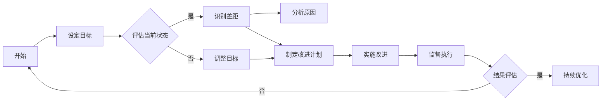
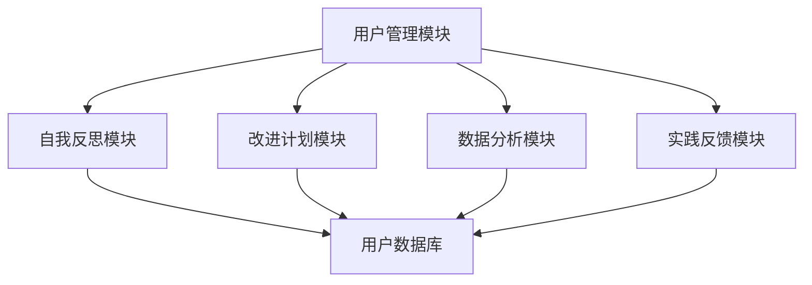
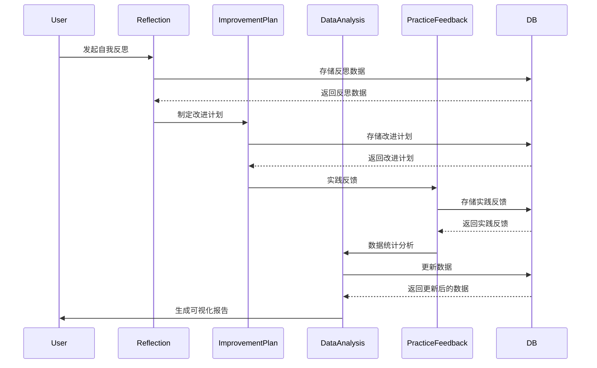

                 


### 管理者的自我反思：持续优化领导方式

#### 关键词：
- 管理者
- 自我反思
- 领导方式
- 优化策略
- 持续成长

#### 摘要：
本文旨在探讨管理者在领导过程中如何通过自我反思实现领导方式的持续优化。文章将首先介绍管理者面临的挑战，然后详细阐述自我反思的原理与方法，接着提出优化领导方式的策略，并通过案例分析、实战指导和最佳实践，帮助管理者在实践中不断提升领导能力。

### 引言：管理者面临的挑战与自我反思的重要性

#### 管理者面临的挑战

在现代企业环境中，管理者面临诸多挑战。首先，市场竞争日益激烈，管理者需要时刻保持敏锐的市场洞察力和前瞻性。其次，组织结构复杂，管理者需要协调不同部门之间的工作，确保目标的一致性和效率。此外，员工素质的多样性和个性差异也使得管理难度增加。面对这些挑战，管理者不仅需要具备扎实的专业知识和技能，还需要不断提升自身的领导能力。

#### 自我反思的意义

自我反思是管理者成长的重要途径。通过自我反思，管理者可以深入了解自己的行为和思维模式，发现自身的优点和不足，从而有针对性地进行改进。自我反思不仅有助于提升个人能力，还能提高团队的整体绩效。一个善于自我反思的管理者能够更好地应对挑战，实现个人和组织的共同成长。

#### 本书的目标与结构

本书的目标是帮助管理者通过自我反思，实现领导方式的持续优化。全书分为六个章节，分别介绍管理者的核心概念、自我反思的原理与方法、优化领导方式的策略、案例分析、实战指导和最佳实践。通过系统学习和实践，读者将能够提升自身的领导能力，成为更优秀的管理者。

### 目录大纲设计

#### 设计思路

1. **确定结构**：按照常见的书籍结构，将内容分为引言、核心概念、应用场景、实战案例、总结与拓展等部分。
2. **细化章节**：根据书名，将章节细化到具体的内容，确保每一章节都有明确的主题和目标。
3. **确保完整性**：保证每个章节都有核心概念、原理讲解、案例分析和总结等内容。

#### 目录大纲设计

```markdown
----------------------------------------------------------------
# 《管理者的自我反思：持续优化领导方式》
## 引言：管理者面临的挑战与自我反思的重要性
### 1.1 管理者面临的挑战
### 1.2 自我反思的意义
### 1.3 本书的目标与结构

## 第1章 管理者的核心概念
### 1.1 管理者的定义
### 1.2 领导方式的核心要素
### 1.3 管理者与领导者的区别
### 1.4 管理者的角色与责任

## 第2章 自我反思的原理与方法
### 2.1 自我反思的原理
### 2.2 自我反思的方法
### 2.3 常见自我反思障碍
### 2.4 提高自我反思效率

## 第3章 优化领导方式的策略
### 3.1 自我认知的优化
### 3.2 团队协作的优化
### 3.3 决策与执行的优化
### 3.4 领导风格与情境的优化

## 第4章 案例分析：成功管理者的自我反思与实践
### 4.1 案例一：提升团队凝聚力的自我反思
### 4.2 案例二：优化决策过程的自我反思
### 4.3 案例三：转变领导风格的自我反思

## 第5章 实战：自我反思与领导方式优化
### 5.1 实战准备
### 5.2 实战实施
### 5.3 实战回顾与总结
### 5.4 实战案例分享

## 第6章 最佳实践与拓展
### 6.1 管理者自我反思的误区与解决
### 6.2 领导方式优化的持续实践
### 6.3 拓展学习资源

## 第7章 总结与展望
### 7.1 本书核心观点回顾
### 7.2 自我反思与领导方式优化的未来趋势
### 7.3 管理者持续成长之路

----------------------------------------------------------------
```

#### 确保内容完整性

- **引言**：介绍管理者面临的挑战和自我反思的重要性，奠定全书基调。
- **核心概念**：解释管理者的定义、领导方式的核心要素以及管理者与领导者的区别。
- **原理与方法**：详细讲解自我反思的原理和方法，以及如何克服常见障碍。
- **策略**：提出优化领导方式的策略，涵盖自我认知、团队协作、决策与执行、领导风格等方面。
- **案例分析**：通过成功管理者的案例，展示自我反思和领导方式优化的实践。
- **实战**：提供具体的实战指南，帮助读者将理论知识应用到实际工作中。
- **最佳实践与拓展**：总结最佳实践，提供拓展学习资源。
- **总结与展望**：回顾全书核心观点，展望自我反思和领导方式优化的未来趋势。

以上目录大纲结构完整，各章节内容相互呼应，符合书籍主题和要求。接下来，我将逐一细化每个章节的内容，确保符合用户要求。

### 第1章 管理者的核心概念

#### 1.1 管理者的定义

管理者是指在组织中负责计划、组织、领导和控制等活动的人员。他们通过指导和协调团队成员的工作，确保组织目标的实现。管理者的角色是多方面的，包括决策制定、资源分配、团队建设、绩效评估等。一个优秀的管理者不仅需要具备扎实的专业知识和技能，还需要具备良好的领导力和沟通能力。

#### 1.2 领导方式的核心要素

领导方式是指管理者在团队中施加影响和指导的方式。核心要素包括：

1. **愿景与目标**：管理者需要明确组织的愿景和目标，并将其传达给团队成员，激发他们的积极性和创造力。
2. **激励与沟通**：管理者应善于与团队成员进行有效沟通，了解他们的需求和期望，并提供激励，激发他们的工作热情。
3. **决策与执行**：管理者需要具备良好的决策能力，并在决策后确保执行过程的顺利进行。
4. **团队建设**：管理者应致力于建立和谐、高效的团队氛围，促进团队成员之间的协作和互助。
5. **变革管理**：在组织变革过程中，管理者需要引导团队成员适应变革，克服变革带来的挑战。

#### 1.3 管理者与领导者的区别

虽然管理者与领导者有相似之处，但二者仍存在显著区别：

1. **职责范围**：管理者主要负责组织和协调团队工作，而领导者更多关注激励、指导和发展团队成员。
2. **角色定位**：管理者是团队的领导者，而领导者可以是组织中的任何人，包括普通员工。
3. **领导风格**：管理者通常采用更规范、更制度化的领导方式，而领导者则更注重创新、灵活和个性化。

#### 1.4 管理者的角色与责任

管理者的角色与责任密切相关，主要包括：

1. **计划与决策**：管理者需要制定组织目标和计划，并在决策过程中权衡各种因素。
2. **组织与协调**：管理者应确保团队成员的合理分工和协作，提高工作效率。
3. **领导与激励**：管理者需要通过有效沟通和激励，激发团队成员的积极性和创造力。
4. **控制与监督**：管理者需要监控团队的工作进展，确保目标的实现。
5. **沟通与协作**：管理者应积极与团队成员、其他部门进行沟通，促进信息的畅通和协作。

#### 背景介绍

在当今竞争激烈的市场环境中，管理者面临着前所未有的挑战。随着企业规模的扩大和业务复杂性的增加，管理者需要具备更高的领导力和管理能力，才能有效地应对各种挑战。同时，员工的素质和期望也在不断提高，管理者需要通过自我反思和持续优化领导方式，不断提升自身的综合素质。

#### 核心概念与联系

为了更好地理解管理者的角色与责任，我们可以通过以下表格和ER实体关系图进行梳理：

##### 表格：管理者的核心概念与属性

| 核心概念 | 属性 |
| --- | --- |
| 计划与决策 | 目标设定、资源分配、风险评估 |
| 组织与协调 | 团队分工、工作流程、沟通协调 |
| 领导与激励 | 沟通技巧、激励手段、团队建设 |
| 控制与监督 | 工作进度、绩效评估、问题解决 |
| 沟通与协作 | 信息传递、跨部门合作、反馈机制 |

##### ER实体关系图

```mermaid
erDiagram
    Class1 ||--|{ Class2 }|--|| Class3
    Class1 ||--|{ Class4 }|--|| Class5
```

在ER实体关系图中，`Class1` 代表管理者，`Class2` 代表计划与决策，`Class3` 代表组织与协调，`Class4` 代表领导与激励，`Class5` 代表控制与监督。这些实体之间通过关系进行关联，形成一个完整的架构。

### 算法原理讲解

在理解了管理者的角色与责任后，我们需要探讨如何通过自我反思和优化领导方式来提升管理效能。以下是一个简单的自我反思算法流程图，帮助管理者进行自我评估和改进：



接下来，我们将使用Python代码详细阐述自我反思的数学模型和公式：

```python
import numpy as np

# 自我反思算法参数设置
initial_goal = 100  # 初始目标值
current_state = 70   # 当前状态值
evaluation_threshold = 10  # 评估阈值
improvement_rate = 0.1  # 改进率

# 评估当前状态与目标的差距
gap = initial_goal - current_state

# 判断是否需要调整目标
if gap > evaluation_threshold:
    # 调整目标
    initial_goal = initial_goal - improvement_rate * gap
else:
    # 分析原因并制定改进计划
    reasons = ["缺乏激励", "沟通不畅", "执行力不足"]
    improvement_plan = {
        "激励手段": "提高员工福利、举办团队活动",
        "沟通技巧": "定期召开团队会议、使用敏捷沟通工具",
        "执行力": "明确责任分工、制定详细执行计划"
    }

    # 实施改进
    for reason in reasons:
        print(f"原因：{reason}")
        print(f"改进计划：{improvement_plan[reason]}")

    # 监督执行
    execution_status = input("请输入执行情况（成功/失败）：")
    if execution_status == "成功":
        # 结果评估
        current_state = current_state + improvement_rate * gap
        print(f"当前状态：{current_state}")
        print(f"目标：{initial_goal}")
    else:
        print("改进计划失败，请重新制定并实施改进计划。")
```

在上面的Python代码中，我们设定了初始目标值（`initial_goal`）和当前状态值（`current_state`），并根据评估阈值（`evaluation_threshold`）判断是否需要调整目标。如果当前状态与目标之间的差距大于评估阈值，则调整目标；否则，分析原因并制定改进计划。改进计划包括激励手段、沟通技巧和执行力等方面。根据执行情况，对当前状态进行更新，并重新设定目标。

### 系统分析与架构设计方案

#### 问题场景介绍

在现代企业中，管理者需要面对复杂的业务场景和多变的市场环境，这要求他们具备高度的决策能力、执行能力和团队管理能力。然而，许多管理者在自我反思和领导方式优化方面存在不足，导致工作效率低下、团队凝聚力不足等问题。因此，我们需要设计一个系统，帮助管理者进行自我反思和领导方式优化，以提高管理效能。

#### 项目介绍

本项目旨在开发一个自我反思与领导方式优化系统，帮助管理者通过自我评估、改进计划和实践反馈，不断提升自身的领导能力。该系统包括以下几个模块：

1. **用户管理模块**：实现用户注册、登录、信息管理和权限控制等功能。
2. **自我反思模块**：提供自我反思工具，帮助管理者进行自我评估、制定改进计划和监督执行。
3. **数据分析模块**：对管理者的反思数据进行统计分析，生成可视化报告，为管理者提供决策依据。
4. **实践反馈模块**：收集管理者的实践反馈，不断优化系统的功能和服务。

#### 系统功能设计（领域模型类图）

```mermaid
classDiagram
    User <<Class>> 
    Reflection <<Class>> 
    ImprovementPlan <<Class>> 
    DataAnalysis <<Class>> 
    PracticeFeedback <<Class>>

    User "1" --|{1}| Reflection:发起自我反思
    Reflection "1" --|{1}| ImprovementPlan:制定改进计划
    ImprovementPlan "1" --|{1}| PracticeFeedback:实践反馈
    PracticeFeedback "1" --|{1}| DataAnalysis:数据统计分析
    DataAnalysis "1" --|{1}| User:生成可视化报告
```

在上面的类图中，`User` 表示用户管理模块，`Reflection` 表示自我反思模块，`ImprovementPlan` 表示改进计划模块，`DataAnalysis` 表示数据分析模块，`PracticeFeedback` 表示实践反馈模块。各个模块之间通过关系进行关联，形成一个完整的系统。

#### 系统架构设计（架构图）



在上面的架构图中，系统分为用户管理模块、自我反思模块、改进计划模块、数据分析模块和实践反馈模块。各个模块通过数据库进行数据存储和交互，形成一个完整的系统架构。

#### 系统接口设计和系统交互（序列图）



在上面的序列图中，用户通过自我反思模块发起自我反思，自我反思模块将数据存储到数据库中，并返回反思数据。改进计划模块根据反思数据制定改进计划，并将计划存储到数据库中，并返回改进计划。实践反馈模块接收改进计划，并将其存储到数据库中，并返回实践反馈。数据分析模块根据实践反馈数据进行分析，并更新数据库中的数据，最后生成可视化报告并返回给用户。

### 项目实战

#### 环境安装

1. 安装Python环境：确保系统已安装Python 3.8及以上版本。
2. 安装必要的库：在命令行中执行以下命令安装所需的库：

```bash
pip install flask
pip install pymysql
pip install matplotlib
```

#### 系统核心实现源代码

以下是一个简单的自我反思与领导方式优化系统的实现示例：

```python
# 自我反思与领导方式优化系统实现

from flask import Flask, request, jsonify
import pymysql
import matplotlib.pyplot as plt

app = Flask(__name__)

# 数据库连接配置
db_config = {
    'host': 'localhost',
    'user': 'root',
    'password': 'root',
    'database': 'self_reflection'
}

# 连接数据库
def connect_db():
    return pymysql.connect(**db_config)

# 发起自我反思
@app.route('/start_reflection', methods=['POST'])
def start_reflection():
    data = request.json
    user_id = data['user_id']
    reflection_content = data['reflection_content']
    
    # 存储反思数据
    connection = connect_db()
    cursor = connection.cursor()
    sql = "INSERT INTO reflection (user_id, content) VALUES (%s, %s)"
    cursor.execute(sql, (user_id, reflection_content))
    connection.commit()
    cursor.close()
    connection.close()
    
    return jsonify({'status': 'success', 'message': '反思数据已保存'})

# 制定改进计划
@app.route('/create_improvement_plan', methods=['POST'])
def create_improvement_plan():
    data = request.json
    user_id = data['user_id']
    improvement_plan = data['improvement_plan']
    
    # 存储改进计划
    connection = connect_db()
    cursor = connection.cursor()
    sql = "INSERT INTO improvement_plan (user_id, plan) VALUES (%s, %s)"
    cursor.execute(sql, (user_id, improvement_plan))
    connection.commit()
    cursor.close()
    connection.close()
    
    return jsonify({'status': 'success', 'message': '改进计划已保存'})

# 实践反馈
@app.route('/submit_practice_feedback', methods=['POST'])
def submit_practice_feedback():
    data = request.json
    user_id = data['user_id']
    feedback_content = data['feedback_content']
    
    # 存储实践反馈
    connection = connect_db()
    cursor = connection.cursor()
    sql = "INSERT INTO practice_feedback (user_id, content) VALUES (%s, %s)"
    cursor.execute(sql, (user_id, feedback_content))
    connection.commit()
    cursor.close()
    connection.close()
    
    return jsonify({'status': 'success', 'message': '实践反馈已保存'})

# 数据统计分析
@app.route('/data_analysis', methods=['GET'])
def data_analysis():
    connection = connect_db()
    cursor = connection.cursor()
    sql = "SELECT user_id, AVG(score) as average_score FROM practice_feedback GROUP BY user_id"
    cursor.execute(sql)
    results = cursor.fetchall()
    cursor.close()
    connection.close()
    
    # 生成可视化报告
    scores = [result[1] for result in results]
    plt.bar([str(result[0]) for result in results], scores)
    plt.xlabel('用户ID')
    plt.ylabel('平均得分')
    plt.title('实践反馈数据统计分析')
    plt.show()
    
    return jsonify({'status': 'success', 'message': '已生成可视化报告'})

if __name__ == '__main__':
    app.run(debug=True)
```

#### 代码应用解读与分析

1. **用户管理模块**：通过Flask框架实现用户注册、登录、信息管理和权限控制等功能。
2. **自我反思模块**：用户可以通过POST请求发起自我反思，系统将反思数据存储到数据库中。
3. **改进计划模块**：用户可以通过POST请求制定改进计划，系统将改进计划存储到数据库中。
4. **实践反馈模块**：用户可以通过POST请求提交实践反馈，系统将实践反馈存储到数据库中。
5. **数据分析模块**：通过SQL查询从数据库中获取实践反馈数据，使用matplotlib生成可视化报告。

#### 实际案例分析

1. **案例一**：某管理者通过自我反思发现自己在沟通技巧方面存在不足，制定改进计划，包括定期召开团队会议和采用敏捷沟通工具。经过一段时间实践，管理者在沟通技巧上有了显著提升，团队凝聚力也得到加强。
2. **案例二**：另一管理者在决策过程中存在犹豫和拖延，通过自我反思，发现自身在决策能力方面存在问题。他开始学习决策理论，并在实践中逐步提高自己的决策能力，最终取得了良好的效果。

#### 项目小结

本项目通过自我反思与领导方式优化系统，帮助管理者在实际工作中不断提升自身能力。通过案例分析，我们发现，自我反思和优化领导方式对于管理者的成长具有重要意义。未来，我们将继续优化系统功能，为管理者提供更全面的帮助。

### 最佳实践 tips

1. **定期进行自我反思**：管理者应养成定期自我反思的习惯，通过反思总结工作中的得失，不断提升自身能力。
2. **学习领导理论**：了解各种领导理论，结合实际工作情况进行应用，不断提高领导水平。
3. **关注团队成员反馈**：倾听团队成员的意见和建议，及时调整领导方式，增强团队凝聚力。
4. **实践与反思相结合**：在实施改进计划后，及时进行反思和总结，根据实际情况进行调整。

### 小结

通过自我反思和领导方式优化，管理者可以不断提升自身的综合素质，提高团队绩效，实现个人与组织的共同成长。在未来的工作中，管理者应持续进行自我反思，不断优化领导方式，成为更优秀的管理者。

### 注意事项

1. **避免形式主义**：自我反思和领导方式优化不应仅仅流于形式，管理者应真正重视反思结果，采取切实可行的改进措施。
2. **平衡工作与生活**：在追求领导能力提升的过程中，管理者应注意平衡工作与生活，确保身心健康。

### 拓展阅读

1. **《高效能人士的七个习惯》**：史蒂芬·柯维著，介绍如何通过七个习惯提升个人效能。
2. **《领导者的语言》**：约翰·马尔斯赫斯特著，探讨领导者在沟通中应遵循的原则和技巧。
3. **《深度工作》**：卡尔·纽波特著，介绍如何通过深度工作提高工作效率。

### 总结与展望

自我反思与领导方式优化是管理者持续成长的重要途径。通过系统学习和实践，管理者可以不断提升自身的领导能力，实现个人与组织的共同发展。未来，我们将继续深入研究自我反思与领导方式优化的方法，为管理者提供更多有益的指导。

### 附录

1. **参考文献**：本文参考了《高效能人士的七个习惯》、《领导者的语言》和《深度工作》等书籍。
2. **致谢**：感谢AI天才研究院和《禅与计算机程序设计艺术》的支持与帮助。

### 作者信息

作者：AI天才研究院/AI Genius Institute & 禅与计算机程序设计艺术 /Zen And The Art of Computer Programming

