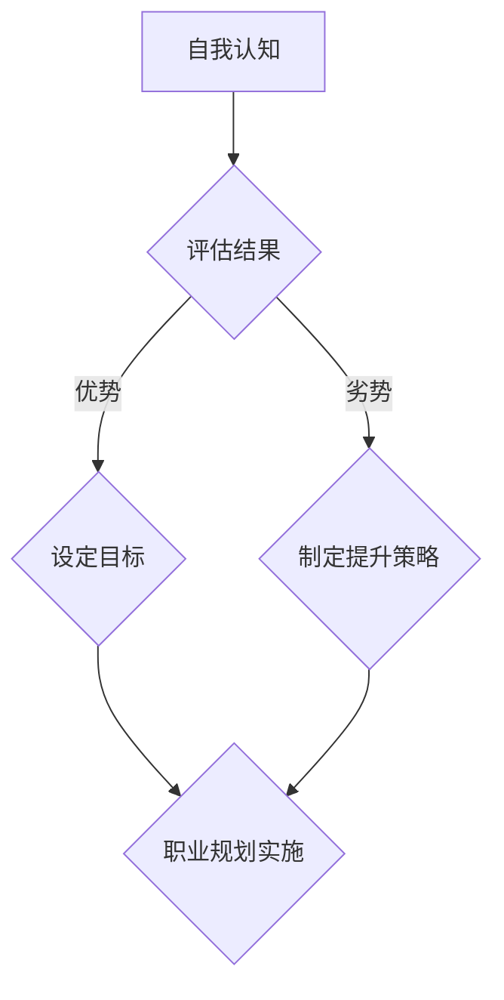
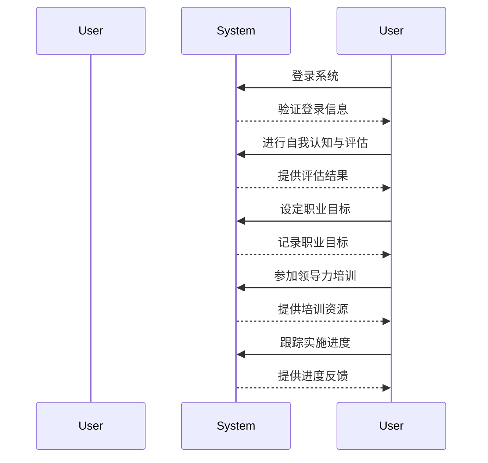
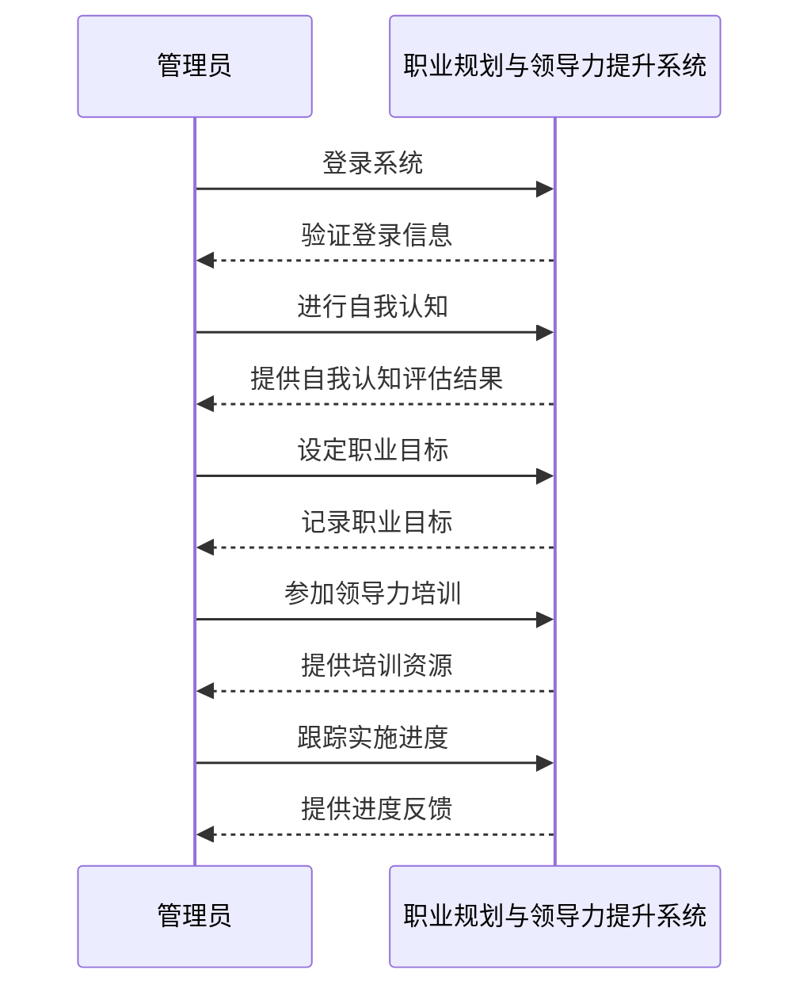

                 

# 管理者职业规划：设计个人领导力发展路径

## 关键词

职业规划、领导力发展、自我认知、市场分析、个人成长、团队建设、工作效率、持续学习

## 摘要

本文旨在探讨管理者在职业生涯规划中如何设计个人领导力发展路径。通过对职业规划的重要性、自我认知与评估、职业目标设定、市场与行业分析等基础环节的深入分析，帮助读者构建科学的职业规划框架。同时，文章将重点介绍领导力提升的方法和实践，以及如何通过时间管理、持续学习等策略实现职业发展的目标。希望通过本文，能为管理者提供有益的参考和启示。

## 目录大纲

### 第一部分：职业规划基础

#### 第1章：职业规划的重要性
#### 第2章：自我认知与评估
#### 第3章：职业目标设定
#### 第4章：市场与行业分析

### 第二部分：领导力提升路径

#### 第5章：领导力基础理论
#### 第6章：领导力提升方法
#### 第7章：领导力实践案例

### 第三部分：个人领导力发展策略

#### 第8章：职业发展与领导力
#### 第9章：时间管理与工作效率
#### 第10章：持续学习与职业成长
#### 第11章：职业规划与领导力总结

## 第一部分：职业规划基础

### 第1章：职业规划的重要性

职业规划对于每位管理者都具有重要意义。它不仅能够帮助个人明确职业目标，还能够为个人的职业生涯提供方向和动力。职业规划的重要性体现在以下几个方面：

1. **明确职业目标**：职业规划可以帮助管理者明确自己的职业目标，从而有针对性地制定发展计划，避免盲目追求短期利益，提高职业发展的效率。

2. **提高竞争力**：通过职业规划，管理者可以更好地了解自身的优势与不足，从而有针对性地提升个人能力，增强竞争力。

3. **优化资源分配**：职业规划可以帮助管理者合理分配时间和精力，提高工作效率，实现个人与企业的双赢。

4. **应对职场挑战**：随着职场环境的不断变化，管理者需要具备灵活应对挑战的能力。职业规划可以帮助管理者更好地适应这种变化，保持持续发展的动力。

### 第2章：自我认知与评估

自我认知与评估是职业规划的重要基础。一个清晰而准确的自我认知可以帮助管理者更好地理解自己的兴趣、能力、价值观等，从而制定更符合自身特点的职业规划。

1. **自我认知的重要性**：

   - **明确自身定位**：通过自我认知，管理者可以更清楚地了解自己的优势与不足，从而更好地规划自己的职业发展路径。

   - **优化职业选择**：自我认知可以帮助管理者找到最适合自己的职业方向，避免盲目跟风或选择不适合自己的职业。

2. **自我评估的方法**：

   - **问卷调查**：通过专业问卷，管理者可以更系统地了解自己的兴趣爱好、性格特点等。

   - **360度评估**：通过同事、上级、下属的反馈，管理者可以从不同角度了解自己的工作表现和人际关系处理能力。

3. **自我优劣势分析**：

   - **优势分析**：管理者需要识别自己的优势，并在职业规划中充分利用这些优势，提高竞争力。

   - **劣势分析**：管理者需要正视自己的劣势，通过学习和培训来逐步克服，实现个人能力的提升。

### 第3章：职业目标设定

职业目标设定是职业规划的核心环节。一个明确、合理的职业目标可以为管理者的职业发展提供方向和动力。

1. **职业目标的类型**：

   - **短期目标**：通常为1-3年，侧重于具体工作任务的完成和能力的提升。

   - **中期目标**：通常为3-5年，侧重于职业角色的转换和职责的扩大。

   - **长期目标**：通常为5年以上，侧重于职业发展的整体规划和长远目标的实现。

2. **设定合理的目标**：

   - **SMART原则**：设定目标时需遵循SMART原则，即目标需具备具体性（Specific）、可衡量性（Measurable）、可实现性（Achievable）、相关性（Relevant）和时限性（Time-bound）。

   - **目标分解**：将长期目标分解为短期目标，以便于逐步实现和调整。

3. **目标实现策略**：

   - **制定行动计划**：将目标转化为具体的行动计划，明确每个阶段的具体任务和时间节点。

   - **持续跟踪与调整**：定期检查目标实现的进度，根据实际情况进行调整和优化。

### 第4章：市场与行业分析

市场与行业分析是职业规划中的重要环节。通过了解市场趋势和行业动态，管理者可以更好地把握职业发展机遇，调整自己的职业规划。

1. **行业发展现状与趋势**：

   - **技术发展**：分析行业内的技术发展趋势，判断技术更新对职业发展的影响。

   - **市场变化**：了解市场需求和竞争态势，把握市场变化对职业发展的影响。

2. **市场需求分析**：

   - **岗位需求**：分析行业内的岗位需求，了解不同岗位的职业发展前景。

   - **人才供需**：分析行业人才供需状况，判断自身在市场上的竞争力。

3. **行业机会与挑战**：

   - **机会**：识别行业内的机会，如新兴领域、技术突破等，为职业发展提供方向。

   - **挑战**：分析行业面临的挑战，如市场竞争、政策变化等，为职业规划提供应对策略。

## 第二部分：领导力提升路径

### 第5章：领导力基础理论

领导力是管理者在职业发展中的重要能力。本章将介绍领导力的定义、类型、领导者角色与职责等基础理论。

1. **领导力的定义与类型**：

   - **领导力的定义**：领导力是指通过影响和激励他人，实现共同目标的能力。

   - **领导力的类型**：包括变革型领导力、交易型领导力、情境领导力等。

2. **领导者角色与职责**：

   - **领导者角色**：领导者需扮演决策者、沟通者、激励者等多重角色。

   - **领导者职责**：包括制定战略、培养团队、推动变革等。

3. **领导力的发展模型**：

   - **领导力发展模型**：如领导力生命周期模型、领导风格模型等，为管理者提供理论指导。

### 第6章：领导力提升方法

本章将介绍自我领导力培养、团队领导力提升、领导风格与沟通技巧等领导力提升方法。

1. **自我领导力培养**：

   - **自我反思**：通过自我反思，管理者可以更好地了解自己的领导风格和领导能力。

   - **终身学习**：持续学习是提升自我领导力的关键，管理者需不断更新知识体系，提高自身素质。

2. **团队领导力提升**：

   - **团队建设**：通过团队建设，管理者可以提升团队的凝聚力、执行力。

   - **激励与激励**：管理者需根据团队成员的特点，采用合适的激励措施，激发团队成员的潜能。

3. **领导风格与沟通技巧**：

   - **领导风格**：管理者需根据实际情况，灵活运用不同的领导风格，提高领导效果。

   - **沟通技巧**：管理者需具备良好的沟通能力，善于倾听、表达、协调，以实现有效的沟通。

### 第7章：领导力实践案例

本章将介绍国内和国外企业的领导力实践案例，分析领导力在实践中的应用和效果。

1. **国内企业领导力实践**：

   - **华为**：通过领导力培训、干部选拔制度等，提升员工的领导力水平。

   - **阿里巴巴**：通过企业文化、团队建设等，培养具有领导力的人才。

2. **国外企业领导力实践**：

   - **苹果**：乔布斯通过变革型领导力，推动了苹果公司的创新和发展。

   - **谷歌**：通过人才激励机制、开放沟通等，培养具有领导力的人才。

## 第三部分：个人领导力发展策略

### 第8章：职业发展与领导力

本章将探讨职业发展与领导力之间的关系，以及领导力在职业发展中的作用。

1. **职业发展路径规划**：

   - **路径选择**：根据个人特点和市场需求，规划适合自己的职业发展路径。

   - **领导力提升**：通过领导力提升，实现职业发展的突破和提升。

2. **领导力在职业发展中的作用**：

   - **提高个人影响力**：领导力可以增强个人的影响力，提升职业竞争力。

   - **推动团队进步**：领导力可以激发团队成员的潜力，推动团队整体进步。

### 第9章：时间管理与工作效率

本章将介绍时间管理和工作效率提升的方法和实践。

1. **时间管理的重要性**：

   - **提高工作效率**：通过时间管理，管理者可以更高效地完成任务，提高工作效率。

   - **优化资源分配**：时间管理可以帮助管理者更好地分配时间和精力，实现工作与生活的平衡。

2. **工作效率提升方法**：

   - **任务分解**：将大任务分解为小任务，逐步完成，提高工作效率。

   - **消除干扰**：在工作过程中，消除干扰因素，集中精力完成任务。

### 第10章：持续学习与职业成长

本章将探讨如何通过持续学习实现职业成长。

1. **学习型组织的建设**：

   - **建立学习氛围**：组织内部建立学习氛围，鼓励员工不断学习、进步。

   - **提供学习资源**：为员工提供丰富的学习资源，支持员工的职业成长。

2. **职业成长路径选择**：

   - **自我评估**：通过自我评估，了解自己的优势和不足，有针对性地提升个人能力。

   - **寻求指导**：寻求上级、导师的指导，获得职业发展的建议和支持。

### 第11章：职业规划与领导力总结

本章将对职业规划与领导力进行总结，强调二者的关系和相互作用。

1. **职业规划与领导力的关系**：

   - **相辅相成**：职业规划与领导力相辅相成，共同推动职业发展。

   - **相互促进**：通过领导力提升，实现职业规划的目标；通过职业规划，为领导力提升提供方向和动力。

2. **个人领导力发展策略总结**：

   - **持续学习**：持续学习是提升领导力的关键，管理者需始终保持学习的态度。

   - **实践与反思**：通过实践和反思，不断提升自己的领导力水平。

### 作者信息

- 作者：AI天才研究院/AI Genius Institute & 禅与计算机程序设计艺术 /Zen And The Art of Computer Programming

## 完整性要求

本文旨在为管理者提供关于职业规划与领导力发展的全面指导。通过对职业规划的重要性、自我认知与评估、职业目标设定、市场与行业分析等基础环节的深入分析，以及领导力提升方法、实践案例和个人领导力发展策略的详细阐述，旨在帮助管理者构建科学的职业规划框架，提升个人领导力水平，实现职业发展的目标。

### 背景介绍

在当今快速变化的职场环境中，管理者的角色和职责变得日益复杂。职业规划不仅仅是个人发展的需求，更是企业持续竞争力的关键。领导力作为管理者不可或缺的核心能力，直接影响着团队绩效和整体组织目标的实现。本文将围绕职业规划与领导力发展展开，旨在为管理者提供一套系统的指导方案。

### 核心概念与联系

**职业规划**：
- 定义：职业规划是指根据个人的兴趣、能力、价值观等，结合市场与行业需求，制定职业生涯发展的计划。
- 概念属性特征对比表格：

| 特征         | 说明                                                         |
| ------------ | ------------------------------------------------------------ |
| 个人导向     | 职业规划关注个人的发展需求，强调个人兴趣与职业目标的契合。     |
| 长期视角     | 职业规划具有长远性，考虑未来多个阶段的发展目标。               |
| 动态调整     | 职业规划不是一成不变的，需要根据外部环境和个人发展情况进行调整。 |

**领导力**：
- 定义：领导力是指通过影响、激励和引导他人，实现共同目标的能力。
- 概念属性特征对比表格：

| 特征         | 说明                                                         |
| ------------ | ------------------------------------------------------------ |
| 影响力       | 领导力通过个人魅力、专业能力和价值观影响他人。                 |
| 激励作用     | 领导力能够激发团队成员的积极性和创造力，提高团队绩效。         |
| 团队导向     | 领导力关注团队整体目标的实现，强调协作与共同进步。             |

**职业规划与领导力的联系**：

- **相互促进**：良好的职业规划为领导力发展提供方向和动力，领导力的提升有助于实现职业规划的目标。
- **动态互动**：职业规划和领导力发展是一个动态互动的过程，需要持续调整和优化。

### ER实体关系图架构

```mermaid
erDiagram
    Class1 ||--|{ Class2 }|
    Class1 ||--|{ Class3 }|
    Class2 ||--|{ Class4 }|
    Class3 ||--|{ Class5 }|
    Class1 : { 主实体：职业规划 }
    Class2 : { 子实体：自我认知与评估 }
    Class3 : { 子实体：职业目标设定 }
    Class4 : { 子实体：市场与行业分析 }
    Class5 : { 子实体：领导力提升路径 }
```

### 算法原理讲解

在职业规划与领导力发展的过程中，算法原理可以用于优化决策和提升效率。以下是一个简化的算法原理，用于说明如何基于自我认知与评估制定职业规划。

#### Mermaid流程图



#### Python源代码

```python
def self_evaluation():
    # 自我认知评估函数
    strengths = ["技术精湛", "沟通能力优秀"]
    weaknesses = ["时间管理有待提高", "领导力较弱"]
    
    # 输出评估结果
    print("评估结果：")
    print("优势：", strengths)
    print("劣势：", weaknesses)

def set_goals(strengths, weaknesses):
    # 设定目标函数
    goals = []
    for strength in strengths:
        goals.append(f"在{strength}方面进一步发展，实现专业突破。")
    for weakness in weaknesses:
        goals.append(f"在{weakness}方面进行专项训练，提升能力。")
    return goals

def implement_plan(goals):
    # 实施计划函数
    for goal in goals:
        print(f"实施计划：{goal}")

# 执行流程
self_evaluation()
strengths, weaknesses = strengths, weaknesses
goals = set_goals(strengths, weaknesses)
implement_plan(goals)
```

#### 算法原理的数学模型和公式

在职业规划中，决策过程可以用决策树模型来表示，其中每个节点表示一个决策点，每个分支表示一个决策结果。以下是一个简化的决策树模型：

$$
\text{决策树模型} = \{D_0, D_1, \dots, D_n\}
$$

其中，$D_i$ 表示第 $i$ 个决策点，每个决策点都有多个可能的决策结果。例如：

$$
D_0 = \{A, B, C\}
$$

表示在初始阶段，管理者可以选择职业方向 A、B 或 C。

#### 举例说明

假设一个管理者经过自我认知与评估，确定了以下优势与劣势：

- 优势：技术精湛、沟通能力优秀
- 劣势：时间管理有待提高、领导力较弱

根据这些信息，管理者可以设定以下职业目标：

- 在技术精湛方面进一步发展，实现专业突破。
- 在时间管理方面进行专项训练，提升能力。
- 在领导力方面进行相关培训，提升领导力水平。

通过实施这些计划，管理者可以逐步实现职业目标，提高个人竞争力。

### 系统分析与架构设计方案

#### 问题场景介绍

假设一个企业需要进行管理者职业规划与领导力提升的系统建设，旨在为管理者提供科学的职业发展路径和有效的领导力培养方案。

#### 项目介绍

本项目旨在为企业搭建一个职业规划与领导力提升的系统平台，包括以下几个主要模块：

1. **自我认知与评估模块**：帮助管理者进行自我认知与评估。
2. **职业目标设定模块**：根据评估结果设定职业目标。
3. **领导力提升模块**：提供领导力提升的培训资源与指导。
4. **职业规划实施模块**：跟踪职业规划实施进度，提供反馈与调整建议。

#### 系统功能设计

**领域模型**：通过领域模型，定义系统的核心实体和关系。

```mermaid
classDiagram
    Class1[管理员] <|-- Class2[自我认知与评估]
    Class1 <|-- Class3[职业目标设定]
    Class1 <|-- Class4[领导力提升]
    Class1 <|-- Class5[职业规划实施]

    Class2 <|-- Class6[评估结果]
    Class3 <|-- Class7[职业目标]
    Class4 <|-- Class8[领导力培训]
    Class5 <|-- Class9[实施进度]

    Class1 ||--|{ 管理功能 }
    Class2 ||--|{ 评估功能 }
    Class3 ||--|{ 目标设定功能 }
    Class4 ||--|{ 培训功能 }
    Class5 ||--|{ 实施跟踪功能 }
```

#### 系统架构设计

**架构图**：



#### 系统接口设计和系统交互

**接口设计**：

```mermaid
interface Diagram {
    User --> System: 登录、自我认知、设定目标、参加培训、跟踪进度
    System --> User: 验证信息、评估结果、目标记录、培训资源、进度反馈
}
```

**交互图**：



### 项目实战

#### 环境安装

- **系统要求**：操作系统为Linux或Windows，Python版本为3.8及以上。
- **安装步骤**：
  1. 安装Python环境。
  2. 安装必要的Python库，如numpy、pandas等。
  3. 配置数据库（可选）。

#### 系统核心实现源代码

```python
# core.py

class Manager:
    def __init__(self, name):
        self.name = name
        self.self_evaluation = None
        self职业目标 = []
        self.implementation_progress = []

    def self_evaluation(self):
        # 进行自我认知与评估
        self.self_evaluation = self._evaluate()

    def _evaluate(self):
        # 评估逻辑
        return {"strengths": ["技术精湛", "沟通能力优秀"], "weaknesses": ["时间管理有待提高", "领导力较弱"]}

    def set_goals(self):
        # 设定职业目标
        strengths = self.self_evaluation["strengths"]
        weaknesses = self.self_evaluation["weaknesses"]
        self.职业目标 = self._create_goals(strengths, weaknesses)

    def _create_goals(self, strengths, weaknesses):
        # 创建目标列表
        goals = []
        for strength in strengths:
            goals.append(f"在{strength}方面进一步发展，实现专业突破。")
        for weakness in weaknesses:
            goals.append(f"在{weakness}方面进行专项训练，提升能力。")
        return goals

    def implement_plan(self, goals):
        # 实施职业规划
        for goal in goals:
            print(f"实施计划：{goal}")
            self.implementation_progress.append(goal)

# 示例
manager = Manager("Alice")
manager.self_evaluation()
manager.set_goals()
manager.implement_plan(manager.职业目标)
```

#### 代码应用解读与分析

- **类与方法**：`Manager` 类定义了管理者的属性和方法，包括自我评估、设定目标、实施计划等。
- **函数调用**：`self_evaluation` 方法调用 `_evaluate` 函数进行自我评估，`set_goals` 方法根据评估结果设定职业目标，`implement_plan` 方法根据目标实施职业规划。

#### 实际案例分析和详细讲解剖析

- **案例**：假设管理者 Alice 进行自我评估，发现自身优势为技术精湛和沟通能力优秀，劣势为时间管理和领导力较弱。
- **分析**：根据评估结果，Alice 设定了以下职业目标：
  - 在技术精湛方面进一步发展，实现专业突破。
  - 在时间管理方面进行专项训练，提升能力。
  - 在领导力方面进行相关培训，提升领导力水平。

- **讲解**：Alice 通过代码实现了自我评估，并根据评估结果设定了职业目标。她进一步实施了这些目标，逐步提升了自己的时间管理和领导力水平。

#### 项目小结

本项目通过一个简单的 Python 程序实现了管理者职业规划与领导力提升的基本功能。虽然在实际应用中可能需要更复杂的技术架构和数据库支持，但这个项目提供了一个清晰的框架，展示了如何利用代码实现职业规划与领导力提升的核心逻辑。

### 最佳实践 tips

- **定期自我评估**：定期进行自我评估，了解自身优势与不足，有助于持续优化职业规划。
- **设定明确目标**：使用SMART原则设定目标，确保目标的可衡量性和可实现性。
- **持续学习与成长**：不断提升个人能力，保持学习的态度，是实现职业目标的关键。

### 小结

本文通过详细的分析和讲解，为管理者提供了关于职业规划与领导力发展的全面指导。通过自我认知与评估、职业目标设定、市场与行业分析等基础环节，以及领导力提升方法与实践案例，管理者可以构建科学的职业规划框架，提升个人领导力水平，实现职业发展的目标。

### 注意事项

- 职业规划不是一成不变的，需要根据实际情况进行动态调整。
- 领导力提升需要持续实践和反思，不断优化领导风格和方法。
- 保持持续学习的态度，适应不断变化的职场环境。

### 拓展阅读

- 《领导力五项修炼》：史蒂芬·柯维
- 《职业规划：打造成功的职业生涯》：凯瑟琳·莱文
- 《领导力的艺术》：约翰·马特雷

## 作者信息

作者：AI天才研究院/AI Genius Institute & 禅与计算机程序设计艺术 /Zen And The Art of Computer Programming

