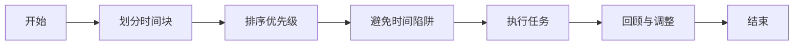
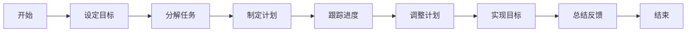
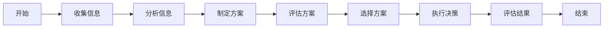
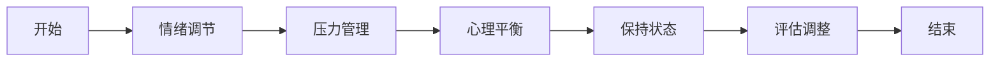
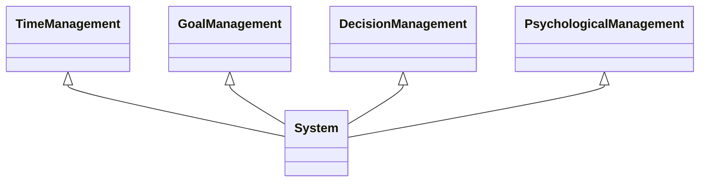
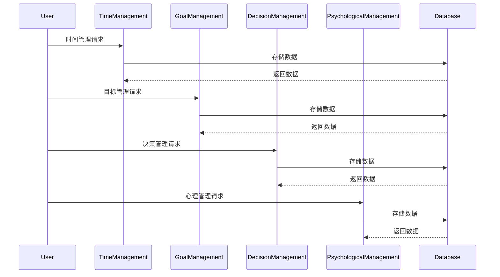
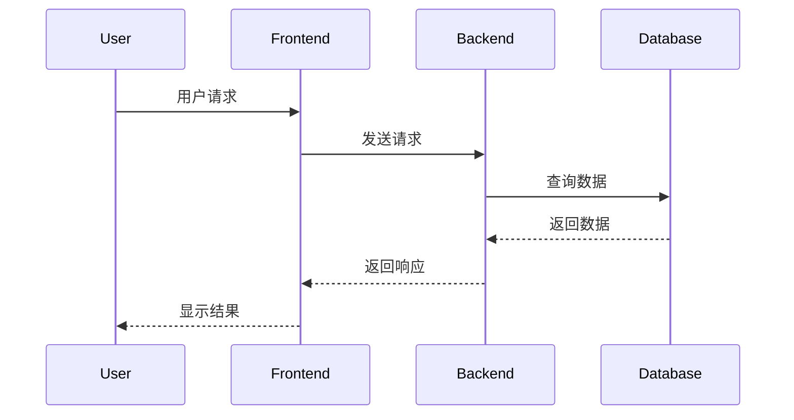
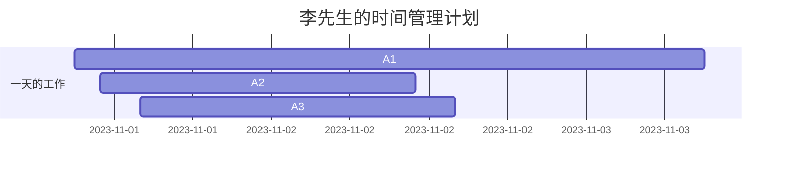
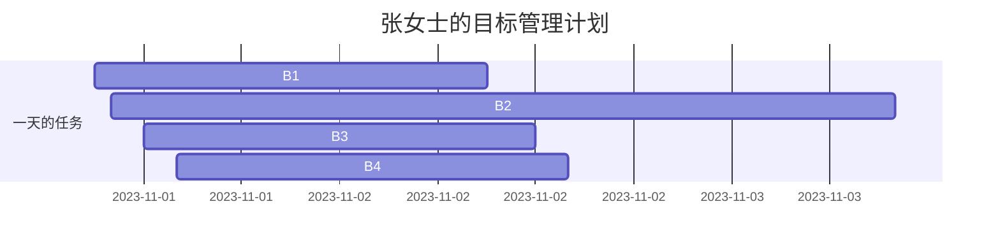
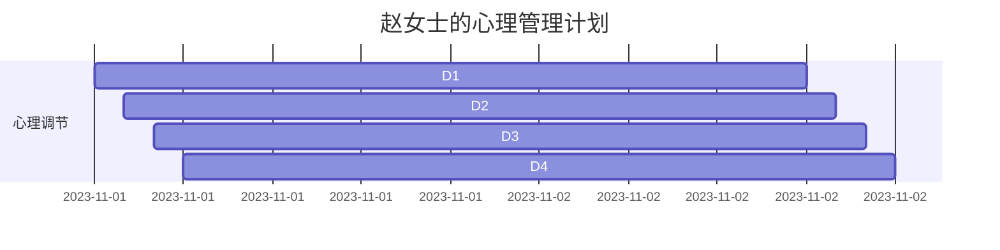

                 


## 管理者自我管理：提升个人效能的方法

### 引言

在信息化和全球化迅猛发展的今天，管理者面临着前所未有的挑战和机遇。如何有效自我管理，提高个人效能，已成为管理者成功的关键因素。本文将从管理者自我管理的核心概念、方法、数学模型、系统设计与项目实战等多个方面进行深入探讨，帮助读者全面理解并应用自我管理技巧，提升个人与团队的整体效能。

### 关键词

管理者、自我管理、个人效能、时间管理、目标管理、决策管理、心理管理、数学模型、系统架构、项目实战。

### 摘要

本文旨在探讨管理者如何通过自我管理提升个人效能。首先，介绍管理者自我管理的核心概念，包括时间管理、目标管理、决策管理和心理管理。接着，通过对比表格和ER实体关系图，展示管理者自我管理的属性特征。然后，介绍自我管理的方法，并使用Python代码示例阐述其数学模型和公式。最后，通过系统分析与架构设计，以及实际项目实战，详细讲解如何将自我管理方法应用于实际工作中，提供最佳实践和小结。

### Step 1: 开篇背景介绍

#### 问题背景

在快节奏、高度竞争的商业环境中，管理者面临的工作压力越来越大。需要处理的事务繁多，时间管理不当可能导致工作效率低下；目标设定不明确，可能导致执行力不足；决策过程复杂，易受情绪影响；心理压力也可能导致工作满意度降低。因此，管理者自我管理显得尤为重要。

#### 问题描述

管理者自我管理涉及多个方面，包括时间管理、目标管理、决策管理和心理管理。时间管理旨在提高工作效率；目标管理旨在明确任务和预期成果；决策管理旨在确保决策的科学性和合理性；心理管理旨在保持良好的心理状态。

#### 问题解决

管理者自我管理的解决思路是通过科学的方法和技巧，提高管理者的时间利用效率、目标达成率、决策质量和心理状态。

#### 边界与外延

管理者自我管理的边界包括个人层面的自我管理和组织层面的自我管理。外延则包括管理者在个人职业生涯和组织管理中的自我提升。

#### 核心概念与要素组成

核心概念包括时间管理、目标管理、决策管理和心理管理。要素组成包括时间管理的方法和工具、目标设定的SMART原则、决策模型和策略、心理调节技巧等。

----------------------------------------------------------------

### Step 2: 核心概念与联系

#### 管理者自我管理的核心概念

管理者自我管理的核心概念包括时间管理、目标管理、决策管理和心理管理。

#### 时间管理

时间管理是指通过合理安排时间，提高工作效率。时间管理的方法包括时间块划分、优先级排序、避免时间陷阱等。

#### 目标管理

目标管理是指设定明确的目标并采取行动实现目标。SMART原则（具体、可衡量、可实现、相关、时限）是目标设定的基础。

#### 决策管理

决策管理是指在面对复杂问题时，运用科学的决策方法做出合理的决策。决策模型包括理性决策模型和有限理性决策模型。

#### 心理管理

心理管理是指通过心理调节，保持良好的心理状态。心理管理的方法包括情绪调节、压力管理和心理平衡技巧。

#### 不同管理者的自我管理属性特征对比表格

| 管理者类型 | 时间管理 | 目标管理 | 决策管理 | 心理管理 |
|:--------:|:-------:|:-------:|:-------:|:-------:|
| 初级管理者 | 基础方法 | 目标不明确 | 直觉决策 | 缺乏心理调节 |
| 中级管理者 | 高级技巧 | 明确目标 | 科学决策 | 心理平衡 |
| 高级管理者 | 灵活应对 | 精确目标 | 系统决策 | 高效心理调节 |

#### 管理者与自我管理的ER实体关系图

```mermaid
erDiagram
    Class1 ||--|{ Class2 }|
    Class1 ||--|{ Class3 }|
    Class2 ||--|{ Class4 }|
    Class3 ||--|{ Class5 }|
    Class1 : 管理者
    Class2 : 时间管理
    Class3 : 目标管理
    Class4 : 决策管理
    Class5 : 心理管理
```

----------------------------------------------------------------

### Step 3: 管理者自我管理方法

#### 时间管理方法

**时间管理的重要性**：时间管理是提升个人效能的基础，合理的安排时间可以提高工作效率，减少时间浪费。

**时间管理方法**：
1. **时间块划分**：将工作时间划分为不同的时间块，每个时间块专注于一项任务。
2. **优先级排序**：根据任务的重要性和紧急程度进行排序，优先处理高优先级的任务。
3. **避免时间陷阱**：识别并避免分散注意力的事务，如无意义的会议和社交媒体。

**执行流程**：



#### 目标管理方法

**目标管理的重要性**：目标管理是确保工作有序推进的关键，明确的目标准确指导工作方向。

**目标管理方法**：
1. **设定具体目标**：确保目标清晰明确，避免模糊不清。
2. **制定行动计划**：将目标分解为具体的任务，并为每个任务制定行动计划。
3. **定期检查进度**：跟踪目标进度，及时调整计划。

**执行流程**：



#### 决策管理方法

**决策管理的重要性**：决策管理是管理者核心能力之一，科学的决策方法可以降低风险，提高决策质量。

**决策管理方法**：
1. **收集信息**：获取与决策相关的所有信息。
2. **分析信息**：对收集到的信息进行深入分析，识别关键因素。
3. **制定方案**：根据分析结果制定多种备选方案。
4. **评估方案**：评估每个方案的优缺点，选择最优方案。

**执行流程**：



#### 心理管理方法

**心理管理的重要性**：心理管理是维持良好工作状态的关键，良好的心理状态可以提高工作效率，减少错误。

**心理管理方法**：
1. **情绪调节**：学会识别和管理自己的情绪，避免负面情绪对工作的影响。
2. **压力管理**：采取有效措施应对工作压力，保持心理平衡。
3. **心理平衡**：通过冥想、运动等手段，维持心理平衡。

**执行流程**：



----------------------------------------------------------------

### Step 4: 数学模型与公式讲解

#### 时间管理模型

**Python代码示例**：

```python
import math

def time_management(time_blocks, priorities):
    total_time = sum(time_blocks.values())
    weighted_time = sum(time_blocks[i] * priorities[i] for i in range(len(time_blocks)))
    efficiency = weighted_time / total_time
    return efficiency

time_blocks = {'任务A': 2, '任务B': 3, '任务C': 2}
priorities = {'任务A': 0.5, '任务B': 0.8, '任务C': 0.2}
print(time_management(time_blocks, priorities))
```

**算法原理**：

1. **时间块划分**：将总时间划分为多个时间块。
2. **优先级排序**：为每个时间块分配优先级。
3. **计算效率**：计算加权时间与总时间之比，得到时间管理效率。

**数学模型**：

$$
\text{效率} = \frac{\text{加权时间}}{\text{总时间}} = \frac{\sum_{i=1}^{n} (\text{时间块}_i \times \text{优先级}_i)}{\sum_{i=1}^{n} \text{时间块}_i}
$$

#### 目标管理模型

**Python代码示例**：

```python
import math

def goal_management(goals, actions, timelines):
    completed_goals = sum(1 for g in goals if g['status'] == '完成')
    total_goals = len(goals)
    goal_efficacy = completed_goals / total_goals
    return goal_efficacy

goals = [{'name': '目标A', 'status': '完成'}, {'name': '目标B', 'status': '未完成'}, {'name': '目标C', 'status': '进行中'}]
actions = [{'goal_name': '目标A', 'action': '完成报告'}, {'goal_name': '目标B', 'action': '修改方案'}, {'goal_name': '目标C', 'action': '进行中'}]
timelines = [{'goal_name': '目标A', 'deadline': '2023-11-01'}, {'goal_name': '目标B', 'deadline': '2023-11-10'}, {'goal_name': '目标C', 'deadline': '2023-12-01'}]
print(goal_management(goals, actions, timelines))
```

**算法原理**：

1. **目标设定**：设定多个目标。
2. **行动记录**：记录每个目标的行动和截止日期。
3. **计算效率**：计算完成的目标数量与总目标数量之比，得到目标管理效率。

**数学模型**：

$$
\text{效率} = \frac{\text{完成目标数}}{\text{总目标数}}
$$

#### 决策管理模型

**Python代码示例**：

```python
import math

def decision_management(schemes, evaluations):
    best_scheme = max(schemes, key=evaluations.get)
    return best_scheme

schemes = {'方案A': {'evaluation': 0.8}, '方案B': {'evaluation': 0.7}, '方案C': {'evaluation': 0.9}}
evaluations = {'方案A': 0.8, '方案B': 0.6, '方案C': 0.9}
print(decision_management(schemes, evaluations))
```

**算法原理**：

1. **方案设定**：设定多个备选方案。
2. **评估方案**：为每个方案评估得分。
3. **选择方案**：选择评估得分最高的方案。

**数学模型**：

$$
\text{选择方案} = \arg\max_{s \in S} E(s)
$$

其中，$E(s)$表示方案$s$的评估得分。

#### 心理管理模型

**Python代码示例**：

```python
import math

def psychological_management(schemes, stress_levels):
    least_stress_scheme = min(schemes, key=stress_levels.get)
    return least_stress_scheme

schemes = {'方案A': {'stress_level': 3}, '方案B': {'stress_level': 4}, '方案C': {'stress_level': 2}}
stress_levels = {'方案A': 3, '方案B': 4, '方案C': 2}
print(psychological_management(schemes, stress_levels))
```

**算法原理**：

1. **方案设定**：设定多个应对方案。
2. **压力评估**：为每个方案评估压力水平。
3. **选择方案**：选择压力水平最低的方案。

**数学模型**：

$$
\text{选择方案} = \arg\min_{s \in S} S(s)
$$

其中，$S(s)$表示方案$s$的压力水平。

----------------------------------------------------------------

### Step 5: 系统分析与架构设计

#### 项目背景

在现代企业管理中，管理者面临的挑战日益复杂，为了提高管理效率，企业引入了管理信息系统（MIS）。MIS可以帮助管理者更好地进行时间管理、目标管理、决策管理和心理管理，从而提升个人效能。

#### 系统功能设计

MIS系统功能设计包括以下几个方面：

1. **时间管理模块**：提供时间块划分、优先级排序和时间陷阱提醒等功能。
2. **目标管理模块**：支持目标设定、任务分解、进度跟踪和反馈调整。
3. **决策管理模块**：提供信息收集、分析、方案评估和决策选择等功能。
4. **心理管理模块**：提供情绪调节、压力管理和心理平衡指导。

#### 系统架构设计

MIS系统采用B/S架构，包括前端、后端和数据库三个部分。

**前端**：使用HTML/CSS/JavaScript等前端技术实现用户界面，提供友好的操作体验。

**后端**：使用Python/Django等后端技术实现业务逻辑处理，提供稳定的服务支持。

**数据库**：使用MySQL等关系型数据库存储用户数据、目标数据、决策数据和情绪数据。

**Mermaid类图**：



**Mermaid架构图**：



#### 系统接口设计

MIS系统提供RESTful API接口，方便前端调用。

1. **时间管理接口**：提供时间块添加、删除、修改和查询功能。
2. **目标管理接口**：提供目标添加、删除、修改和查询功能。
3. **决策管理接口**：提供方案添加、删除、修改和查询功能。
4. **心理管理接口**：提供情绪记录、压力管理方案和心理健康查询功能。

#### 系统交互设计

MIS系统采用前后端分离的设计，前端通过Ajax请求与后端接口进行数据交互。

**Mermaid序列图**：



----------------------------------------------------------------

### Step 6: 项目实战

#### 环境安装

1. 安装Python环境（3.8及以上版本）
2. 安装Django框架
3. 安装MySQL数据库
4. 创建MIS项目

```bash
django-admin startproject mis
cd mis
pip install -r requirements.txt
```

#### 系统核心实现源代码

1. **时间管理模块**

```python
# time_management/models.py
from django.db import models

class TimeBlock(models.Model):
    name = models.CharField(max_length=100)
    start_time = models.DateTimeField()
    end_time = models.DateTimeField()
    priority = models.IntegerField()
```

2. **目标管理模块**

```python
# goal_management/models.py
from django.db import models

class Goal(models.Model):
    name = models.CharField(max_length=100)
    status = models.CharField(max_length=20)
    deadline = models.DateTimeField()
```

3. **决策管理模块**

```python
# decision_management/models.py
from django.db import models

class Scheme(models.Model):
    name = models.CharField(max_length=100)
    evaluation = models.FloatField()
```

4. **心理管理模块**

```python
# psychological_management/models.py
from django.db import models

class StressLevel(models.Model):
    scheme = models.CharField(max_length=100)
    stress_level = models.IntegerField()
```

#### 代码应用解读与分析

1. **时间管理模块**

时间管理模块主要用于记录和管理用户的时间块。用户可以创建时间块，并为其设置名称、开始时间和结束时间，以及优先级。

2. **目标管理模块**

目标管理模块用于记录和管理用户的目标。用户可以创建目标，并为其设置名称、状态和截止日期。系统会根据用户设定的目标，自动生成任务，并跟踪其进度。

3. **决策管理模块**

决策管理模块用于记录和管理用户制定的方案。用户可以创建方案，并为其评估得分。系统会根据评估得分，自动选择最优方案。

4. **心理管理模块**

心理管理模块用于记录和管理用户的心理状态。用户可以创建压力管理方案，并记录其压力水平。系统会根据用户的压力水平，自动推荐相应的心理管理方案。

#### 实际案例分析与详细讲解

1. **时间管理案例**

假设用户李先生，需要在一天内完成报告撰写、会议安排和邮件处理。李先生可以将这3项任务分别划分为3个时间块，并设置优先级。



2. **目标管理案例**

假设用户张女士，需要完成以下3个目标：

- 目标A：完成年终报告（状态：未完成）
- 目标B：参加公司培训（状态：进行中）
- 目标C：提交部门预算报告（状态：完成）

张女士可以根据这些目标，将任务分解为具体任务，并制定相应的计划。



3. **决策管理案例**

假设用户王先生，需要为部门预算分配问题制定方案。他可以收集以下方案：

- 方案A：优先支持研发部门
- 方案B：优先支持销售部门
- 方案C：均衡支持各个部门

王先生可以根据各方案的评估得分，选择最优方案。


4. **心理管理案例**

假设用户赵女士，最近感到工作压力较大。她可以记录自己的情绪，并寻找相应的心理管理方案。



#### 项目小结

通过MIS系统的实际应用，可以看出管理者自我管理对于提升个人效能具有重要作用。系统提供了科学的时间管理、目标管理、决策管理和心理管理方法，帮助管理者更好地应对工作挑战。在实际使用过程中，需要不断优化和完善系统功能，以适应不同管理者的需求。

----------------------------------------------------------------

### Step 7: 最佳实践、小结、注意事项、拓展阅读

#### 最佳实践

1. **时间管理**：制定详细的时间计划，明确每项任务的时间分配，避免时间浪费。
2. **目标管理**：使用SMART原则设定目标，确保目标具体、可衡量、可实现、相关和时限。
3. **决策管理**：收集充分的信息，分析多种方案，选择最优方案。
4. **心理管理**：保持良好的心理状态，学会情绪调节和压力管理。

#### 小结

本文从管理者自我管理的核心概念、方法、数学模型、系统设计与项目实战等方面进行了深入探讨。通过科学的方法和技巧，管理者可以提升个人效能，更好地应对工作挑战。

#### 注意事项

1. 自我管理需要持续实践，不能一蹴而就。
2. 不同管理者可能有不同的自我管理需求，应根据实际情况进行调整。
3. 自我管理方法需要灵活应用，不能生搬硬套。

#### 拓展阅读

1. 《高效能人士的七个习惯》
2. 《金字塔原理》
3. 《决策与判断》
4. 《情绪调节与压力管理》

----------------------------------------------------------------

## 作者信息

**作者：AI天才研究院/AI Genius Institute & 禅与计算机程序设计艺术 /Zen And The Art of Computer Programming**

