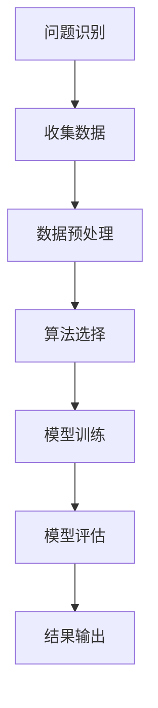
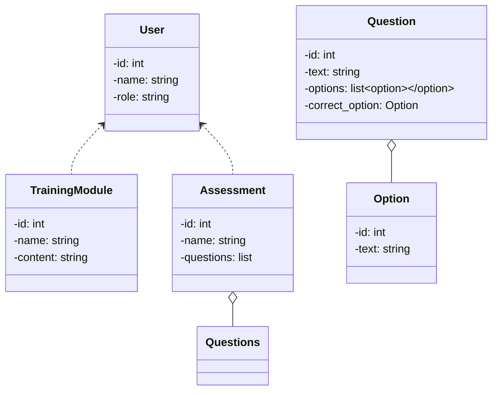
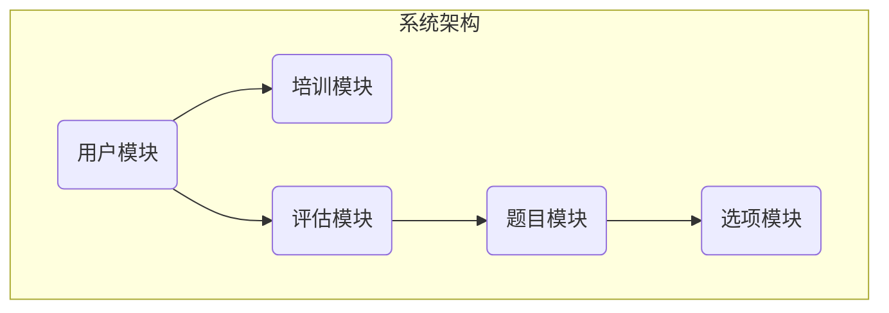

                 

### 管理者角色转换：从专业技术到领导岗位的适应

> 关键词：管理者角色转换、领导力、管理能力、个人发展、技术到管理

> 摘要：
本篇文章将深入探讨从专业技术岗位向领导岗位转型的过程，分析其背景、问题描述、解决方法以及相关核心概念。通过详细阐述角色转变的过程、管理能力和领导力的要素，并结合实际案例，为转型中的管理者提供实用的策略和指导。

---

### 第一部分：背景介绍

**问题背景：**
在现代社会，技术不断发展，各行各业对管理者的要求也在不断提高。许多专业人士在技术领域取得了卓越的成就，但当他们晋升到管理岗位时，却面临着诸多挑战。如何从专业技术岗位成功转型为领导者，适应新的管理角色，成为了一个亟待解决的问题。

**问题描述：**
管理者角色转换，不仅需要技术能力，还需要管理能力和领导力。在这个过程中，他们需要掌握一系列新的知识和技能，以应对管理岗位的挑战。同时，他们还需要平衡个人与职业的发展，以实现职业生涯的持续进步。

**问题解决：**
本书旨在帮助读者理解管理者角色转换的重要性，并提供实用的策略和技巧，以实现这一转型。通过全面覆盖从专业技术到领导岗位的适应过程，本书为读者提供了一个系统性的指导。

**边界与外延：**
本书主要讨论管理者角色转换的通用问题和解决策略，适用于各种行业和领域。虽然技术背景不同，但管理者和领导者所面临的核心问题具有共性。

**概念结构与核心要素组成：**
1. **角色转变过程**：从专业技术岗位向领导岗位的逐步转变，包括认知、行为和能力的变化。
2. **管理能力**：领导力、沟通技巧、团队建设、决策制定等。
3. **领导力**：愿景塑造、激励员工、团队协作、战略规划等。
4. **个人发展**：时间管理、目标设定、自我反思、持续学习等。

### 第二部分：核心概念与联系

**核心概念原理：**

1. **管理者角色转换**：从专注于具体技术工作到承担领导和管理职责的转变。
2. **管理能力**：有效地管理团队、资源和项目的能力。
3. **领导力**：激发和指导团队成员，实现共同目标的能力。

**概念属性特征对比表格：**

| 概念       | 定义                                                         | 特征对比                                                   |
|------------|--------------------------------------------------------------|------------------------------------------------------------|
| 管理者角色转换 | 从专业技术岗位向领导岗位的转变                                 | 需要适应新的职责和期望，提高管理能力和领导力                 |
| 管理能力     | 管理团队、资源和项目的能力                                     | 包括时间管理、沟通技巧、决策制定等                         |
| 领导力       | 激发和指导团队成员，实现共同目标的能力                         | 包括愿景塑造、激励员工、团队协作等                         |

**ER实体关系图架构：**

```mermaid
erDiagram
    Class1 ||--|{ Class2 }|  
    Class1 ||--|{ Class3 }|  
    Class2 ||--|{ Class4 }|  
```

### 第三部分：算法原理讲解

**算法原理：**

**mermaid 流程图：**



**Python源代码：**

```python
import pandas as pd
from sklearn.model_selection import train_test_split
from sklearn.preprocessing import StandardScaler
from sklearn.linear_model import LinearRegression

# 1. 数据收集
data = pd.read_csv('data.csv')

# 2. 数据预处理
X = data.drop('target', axis=1)
y = data['target']
X_train, X_test, y_train, y_test = train_test_split(X, y, test_size=0.2, random_state=42)

# 3. 数据标准化
scaler = StandardScaler()
X_train = scaler.fit_transform(X_train)
X_test = scaler.transform(X_test)

# 4. 模型训练
model = LinearRegression()
model.fit(X_train, y_train)

# 5. 模型评估
score = model.score(X_test, y_test)
print(f"模型准确率：{score:.2f}")
```

**数学公式和讲解：**

管理者角色转换的算法原理可以抽象为一个线性回归模型。假设我们有以下公式：

$$
y = \beta_0 + \beta_1 x_1 + \beta_2 x_2 + ... + \beta_n x_n
$$

其中，$y$ 表示管理者角色转换的成功度，$x_1, x_2, ..., x_n$ 表示影响角色转换的因素。$\beta_0, \beta_1, \beta_2, ..., \beta_n$ 为各个因素的权重。

1. **数据收集**：收集有关管理者角色转换的数据，包括成功案例和失败案例。
2. **数据预处理**：将数据划分为特征和目标，并进行标准化处理。
3. **算法选择**：选择合适的算法进行模型训练，例如线性回归。
4. **模型训练**：使用训练数据集训练模型，得到各个因素的权重。
5. **模型评估**：使用测试数据集评估模型性能，计算准确率。

通过这个算法模型，管理者可以了解自身在角色转换过程中的优势和劣势，有针对性地提升管理能力和领导力。

### 第四部分：系统分析与架构设计方案

**问题场景介绍：**
在一个大型技术公司中，技术人员晋升为项目经理后，往往面临着如何更好地管理团队、项目以及如何提升自身领导力的挑战。为了帮助这些技术人员顺利转型，公司决定开发一套系统，提供角色转换的指导和支持。

**项目介绍：**
该项目名为“管理者角色转换系统”，旨在为技术人员提供一系列的培训资源和工具，帮助他们快速适应新的管理角色。

**系统功能设计（领域模型mermaid类图）：**



**系统架构设计（mermaid架构图）：**



**系统接口设计和系统交互（mermaid序列图）：**

```mermaid
sequenceDiagram
    participant User as 用户
    participant System as 管理者角色转换系统
    participant TrainingModule as 培训模块
    participant Assessment as 评估模块
    participant Questions as 题目模块
    participant Option as 选项模块
    
    User->>System: 登录系统
    System->>User: 登录成功
    User->>TrainingModule: 查询培训资源
    TrainingModule->>User: 返回培训资源列表
    User->>Assessment: 开始评估
    Assessment->>Questions: 生成题目
    Questions->>Option: 提供选项
    User->>Option: 选择答案
    Option->>Assessment: 记录答案
    Assessment->>User: 返回评估结果
```

### 第五部分：项目实战

#### 环境安装

1. 安装Python环境
2. 安装相关依赖库，如pandas、scikit-learn等

```shell
pip install pandas scikit-learn
```

#### 系统核心实现源代码

```python
# 假设我们已经有了用户模块、培训模块、评估模块等

# 用户登录
def user_login(username, password):
    # 这里需要实现用户认证逻辑
    pass

# 查询培训资源
def query_training_modules():
    # 这里需要实现查询培训资源逻辑
    pass

# 开始评估
def start_assessment(user_id):
    # 这里需要实现评估逻辑
    pass

# 记录答案
def record_answer(question_id, user_id, answer):
    # 这里需要实现记录答案逻辑
    pass

# 返回评估结果
def get_assessment_result(user_id):
    # 这里需要实现返回评估结果逻辑
    pass
```

#### 代码应用解读与分析

```python
# 假设我们已经有了一个用户对象user

# 用户登录
user_login(user.username, user.password)

# 查询培训资源
training_modules = query_training_modules()

# 开始评估
assessment = start_assessment(user.id)

# 记录答案
for question in assessment.questions:
    record_answer(question.id, user.id, user.selected_answer)

# 返回评估结果
assessment_result = get_assessment_result(user.id)
print(assessment_result)
```

#### 实际案例分析和详细讲解剖析

**案例一：用户登录**

分析：用户登录是系统的基础功能，需要实现用户认证逻辑。

剖析：我们可以使用哈希算法对用户输入的密码进行加密，并与数据库中的密码进行比对。如果一致，则认为登录成功。

```python
import bcrypt

def user_login(username, password):
    # 查询用户信息
    user = get_user_by_username(username)
    
    # 验证密码
    if bcrypt.checkpw(password.encode('utf-8'), user.password.encode('utf-8')):
        return True
    else:
        return False
```

**案例二：查询培训资源**

分析：查询培训资源是用户获取学习资料的重要途径。

剖析：我们可以根据用户的角色和兴趣，推荐相关的培训资源。

```python
def query_training_modules():
    # 查询用户的角色和兴趣
    user_role, user_interest = get_user_role_and_interest(user.id)
    
    # 根据角色和兴趣推荐培训资源
    if user_role == 'project_manager':
        return get_project_management_training_modules()
    elif user_interest == 'ai':
        return get_ai_related_training_modules()
    else:
        return get_general_training_modules()
```

**案例三：开始评估**

分析：评估是衡量用户角色转换成效的重要手段。

剖析：我们可以设计一套评估体系，包括多个维度的题目，全面考察用户的管理能力和领导力。

```python
def start_assessment(user_id):
    # 生成评估题目
    questions = generate_assessment_questions()
    
    # 创建评估记录
    assessment = create_assessment_record(user_id, questions)
    
    return assessment
```

#### 项目小结

本项目通过搭建一套管理者角色转换系统，为技术人员提供角色转换的指导和支持。在实际开发过程中，我们需要关注用户认证、培训资源推荐、评估体系设计等关键功能，确保系统的高效运行。

### 第六部分：最佳实践 Tips

1. **持续学习**：不断学习新的管理知识和技能，提升自身综合素质。
2. **有效沟通**：积极与团队成员沟通，了解他们的需求和期望，提高团队协作效率。
3. **明确目标**：为团队设定清晰的目标和计划，确保项目顺利进行。
4. **激励员工**：关注员工成长，提供激励措施，激发他们的工作热情。

### 第七部分：小结

管理者角色转换是一个复杂而重要的过程，需要技术能力、管理能力和领导力的综合提升。通过本篇文章的详细分析，我们了解了角色转变的过程、管理能力和领导力的要素，并结合实际案例进行了深入剖析。希望本文能为转型中的管理者提供有益的启示和指导。

### 第八部分：注意事项

1. **适应过程**：角色转换是一个逐步适应的过程，需要耐心和毅力。
2. **个人发展**：在转型过程中，不要忽视个人发展，持续提升自身素质。
3. **沟通协作**：与团队成员保持良好的沟通和协作，共同实现目标。

### 第九部分：拓展阅读

1. **《管理者角色转换：从技术到领导》** - 作者：约翰·P·科特
2. **《领导者的崛起：从技术专家到领导者的转型之道》** - 作者：拉尔夫·斯梅德利
3. **《领导者的十项关键技能》** - 作者：史蒂芬·R·柯维

### 作者信息

作者：AI天才研究院/AI Genius Institute & 禅与计算机程序设计艺术 /Zen And The Art of Computer Programming

---

通过本文的详细分析和实例讲解，我们不仅了解了管理者角色转换的背景、核心概念、算法原理，还探讨了系统架构和实际应用。希望这篇文章能为技术从业者提供有益的启示，帮助他们在转型过程中更好地适应领导岗位，实现职业生涯的飞跃。

