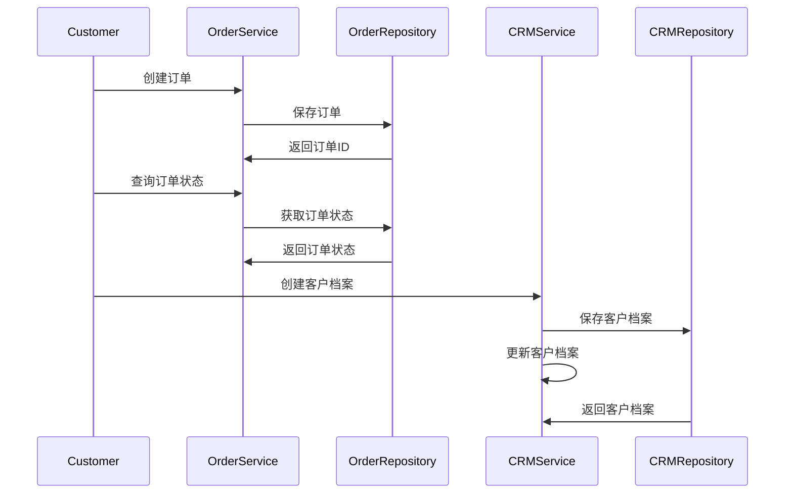
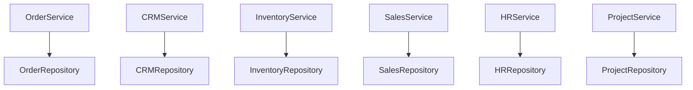

                 

# 组织学习：建立持续进步的企业文化

## 关键词
- 组织学习
- 企业文化
- 持续进步
- 培训机制
- 企业变革
- 领域模型
- 系统架构
- 实战案例

## 摘要
本文旨在探讨组织学习在建立持续进步的企业文化中的重要作用。通过深入分析企业面临的挑战、组织学习的概念与作用、以及如何通过制定有效的策略和实施计划，逐步构建起支持持续进步的企业文化。文章还将阐述组织学习与企业文化的关系、核心概念、算法原理、系统架构设计以及实际案例，为企业在实现持续进步的过程中提供有价值的参考。

## 第一部分：背景介绍

### 1.1 问题背景

在当今快速发展的技术时代，企业面临的挑战越来越复杂。技术更新换代的速度加快，市场环境瞬息万变，客户需求不断升级，这些都对企业提出了更高的要求。在这样的背景下，企业必须不断适应变化，提升自身的竞争力。

**企业面临的挑战**：

1. **技术更新迅速**：新技术的不断涌现，要求企业必须紧跟技术发展趋势，不断更新技术栈。
2. **市场竞争激烈**：市场环境竞争加剧，企业需要通过持续创新来保持竞争优势。
3. **人才流动频繁**：高素质人才的流动性增加，企业需要建立良好的学习和发展环境，以留住人才。

**组织学习的概念与作用**：

组织学习是指企业通过系统的学习过程，提高组织的知识水平、技能和创新能力的活动。它包括对内部知识的共享、外部知识的吸收以及组织成员间的相互学习。

**组织学习的概念与作用**：

1. **知识共享**：通过组织学习，企业内部的知识和经验得到有效的传播和共享，提高整体知识水平。
2. **创新能力**：组织学习促进了创新思维的形成，有助于企业不断推出新产品、新服务，提升市场竞争力。
3. **员工发展**：组织学习为员工提供了成长和发展的机会，提高了员工的技能和职业素养，增强了员工的归属感和忠诚度。

### 1.2 建立持续进步的企业文化的必要性

建立持续进步的企业文化是企业在面临挑战时保持竞争力的关键。企业文化是企业价值观、信念和行为准则的体现，它对企业的经营和发展具有深远的影响。

**建立持续进步的企业文化的必要性**：

1. **提升企业竞争力**：持续进步的企业文化能够激发员工的创新精神和积极态度，提升企业的整体竞争力。
2. **吸引和留住人才**：良好的企业文化能够吸引高素质的人才，同时通过提供良好的发展机会和职业规划，留住人才。
3. **推动组织学习**：持续进步的企业文化鼓励员工不断学习、尝试新事物，形成良好的学习氛围，推动组织学习。

### 1.3 问题描述

在现实情况下，许多企业存在以下问题：

1. **缺乏有效的学习机制**：企业缺乏系统的学习计划和培训机制，员工的技能和知识得不到及时更新。
2. **企业文化无法激发员工潜力**：企业文化未能充分发挥激励作用，员工的创新意识和积极性不高。
3. **组织学习面临的困境**：组织学习过程中存在资源不足、流程不畅等问题，影响了组织学习的有效性。

### 1.4 问题解决

为了解决上述问题，企业需要从以下几个方面入手：

1. **建立组织学习的目标**：明确组织学习的目标，制定具体的行动计划。
2. **制定组织学习策略**：制定有效的组织学习策略，包括学习资源分配、学习流程设计等。
3. **实施组织学习计划**：按照制定的计划，逐步实施组织学习活动，确保学习目标的实现。

### 1.5 边界与外延

**组织学习的适用范围**：

组织学习适用于各类企业，无论企业的规模、行业和业务模式如何。它能够帮助企业提升整体竞争力，适应快速变化的市场环境。

**持续进步的企业文化特征**：

持续进步的企业文化具有以下几个特征：

1. **开放性**：企业鼓励员工分享知识和经验，形成开放的学习氛围。
2. **创新性**：企业鼓励员工不断尝试新事物，推动创新思维的形成。
3. **协作性**：企业强调团队合作，鼓励员工相互学习和支持。

**企业文化对组织学习的影响**：

企业文化对组织学习具有深远的影响。积极的企业文化能够促进组织学习的开展，而消极的企业文化则会阻碍组织学习的进程。

### 1.6 概念结构与核心要素组成

**组织学习的基本概念**：

组织学习包括以下几个方面：

1. **知识管理**：对内部知识和外部知识进行有效管理，确保知识在企业内部得到充分利用。
2. **技能提升**：通过培训、实践等方式，提高员工的技能和专业知识。
3. **创新能力**：鼓励员工创新，推动企业持续创新。

**持续进步的企业文化的核心要素**：

持续进步的企业文化包括以下几个核心要素：

1. **愿景和使命**：明确企业的愿景和使命，为员工提供共同的目标和方向。
2. **价值观**：确立企业的核心价值观，引导员工的行为和决策。
3. **激励机制**：建立有效的激励机制，鼓励员工不断学习和进步。

**组织学习与持续进步的企业文化的关系**：

组织学习和持续进步的企业文化是相辅相成的。组织学习为持续进步的企业文化提供知识基础，而持续进步的企业文化则为组织学习提供良好的环境和动力。

## 第二部分：核心概念与联系

### 2.1 核心概念原理

**组织学习的定义**：

组织学习是指企业通过系统的学习过程，提高组织的知识水平、技能和创新能力的活动。

**组织学习的类型**：

组织学习可以分为以下几种类型：

1. **知识管理型学习**：通过知识共享和知识管理，提高组织的知识水平。
2. **技能提升型学习**：通过培训和实践，提高员工的技能和专业能力。
3. **创新推动型学习**：通过鼓励创新，推动企业的持续创新。

**组织学习的流程**：

组织学习的流程包括以下几个步骤：

1. **目标设定**：明确组织学习的目标和要求。
2. **资源分配**：根据学习目标，合理分配学习资源。
3. **学习实施**：按照学习计划，组织实施学习活动。
4. **效果评估**：对学习效果进行评估，为下一步学习提供反馈。

### 2.2 概念属性特征对比表格

| 概念         | 定义                                                         | 属性特征                                                         |
| ------------ | ------------------------------------------------------------ | ------------------------------------------------------------ |
| 组织学习     | 通过系统的学习过程，提高组织的知识水平、技能和创新能力的活动。 | 知识管理、技能提升、创新能力                                     |
| 培训机制     | 通过系统化的培训，提高员工的知识和技能。                       | 培训内容、培训方式、培训效果评估                                 |
| 企业文化     | 企业价值观、信念和行为准则的体现。                            | 开放性、创新性、协作性、价值观、激励机制                          |
| 组织变革     | 为了适应环境变化，对组织结构和流程进行调整。                  | 变革目标、变革策略、变革实施、变革效果评估                        |

### 2.3 ER实体关系图架构

**组织学习实体关系**：

```mermaid
erDiagram
  A[组织] ||--|{ B[员工] } : "有" |
  A ||--|{ C[知识] } : "包含" |
  B ||--|{ D[技能] } : "具备" |
  C ||--|{ E[经验] } : "来源于" |
```

**企业文化实体关系**：

```mermaid
erDiagram
  F[企业文化] ||--|{ G[价值观] } : "包含" |
  F ||--|{ H[激励] } : "包含" |
  G ||--|{ I[创新] } : "包含" |
  H ||--|{ J[激励措施] } : "包含" |
```

**组织学习与企业文化的联系**：

```mermaid
erDiagram
  K[组织学习] ||--|{ L[企业文化] } : "推动" |
  K ||--|{ M[创新能力] } : "提高" |
  L ||--|{ N[员工积极性] } : "提升" |
```

## 第三部分：算法原理讲解

### 3.1 组织学习算法原理

**算法的基本概念**：

组织学习算法是指用于支持组织学习过程的计算方法，它包括知识获取、知识共享、知识创新等方面。

**算法的基本原理**：

组织学习算法基于以下基本原理：

1. **知识共享**：通过构建知识共享平台，促进企业内部的知识传播和共享。
2. **知识创新**：鼓励员工在知识共享的基础上进行创新，形成新的知识和技能。
3. **反馈机制**：通过定期评估学习效果，对组织学习过程进行反馈和调整。

**算法的关键技术**：

组织学习算法的关键技术包括：

1. **知识图谱构建**：通过构建知识图谱，对企业内部的知识进行结构化管理和利用。
2. **机器学习**：利用机器学习技术，对大量数据进行挖掘和分析，发现潜在的知识关联和创新点。
3. **人工智能**：通过人工智能技术，实现对组织学习过程的智能化管理和优化。

### 3.2 数学模型与公式

**组织学习数学模型**：

组织学习数学模型可以表示为：

$$
\text{组织学习效果} = f(\text{知识共享}, \text{知识创新}, \text{员工积极性})
$$

其中，$f$ 为组织学习效果的函数，$\text{知识共享}$、$\text{知识创新}$、$\text{员工积极性}$ 为输入变量。

**数学公式与解释**：

1. **知识共享公式**：

$$
\text{知识共享度} = \frac{\text{共享知识数量}}{\text{总知识数量}}
$$

其中，$\text{共享知识数量}$ 为企业内部共享的知识数量，$\text{总知识数量}$ 为企业内部所有的知识数量。

2. **知识创新公式**：

$$
\text{知识创新度} = \frac{\text{创新知识数量}}{\text{共享知识数量}}
$$

其中，$\text{创新知识数量}$ 为通过创新产生的知识数量，$\text{共享知识数量}$ 为企业内部共享的知识数量。

3. **员工积极性公式**：

$$
\text{员工积极性} = \frac{\text{参与学习人数}}{\text{员工总人数}}
$$

其中，$\text{参与学习人数}$ 为参与学习活动的员工数量，$\text{员工总人数}$ 为企业内部的员工总人数。

**数学公式的推导过程**：

数学公式的推导基于组织学习的基本原理和目标，通过分析和计算得出。具体推导过程如下：

1. **知识共享度**：

知识共享度表示企业内部知识共享的程度。共享知识数量与总知识数量之比，反映了知识在企业内部的传播和利用程度。

2. **知识创新度**：

知识创新度表示企业内部知识创新的程度。创新知识数量与共享知识数量之比，反映了企业在知识共享的基础上，通过创新产生的新知识数量。

3. **员工积极性**：

员工积极性表示员工参与学习活动的积极性。参与学习人数与员工总人数之比，反映了员工对学习活动的参与程度。

### 3.3 举例说明

**案例一：企业内部培训**

假设某企业计划实施一次内部培训，以提高员工的技能和知识水平。根据组织学习数学模型，可以计算培训效果：

1. **知识共享度**：

企业内部共有 100 篇知识文档，其中 50 篇通过培训进行共享，知识共享度为：

$$
\text{知识共享度} = \frac{50}{100} = 0.5
$$

2. **知识创新度**：

通过培训，员工创新了 20 篇新的知识文档，知识创新度为：

$$
\text{知识创新度} = \frac{20}{50} = 0.4
$$

3. **员工积极性**：

共有 100 名员工参与培训，员工积极性为：

$$
\text{员工积极性} = \frac{100}{100} = 1
$$

根据组织学习数学模型，可以计算培训效果：

$$
\text{组织学习效果} = f(0.5, 0.4, 1) = 0.84
$$

培训效果得分为 84 分，表示培训取得了一定的效果。

**案例二：企业文化推广**

假设某企业计划推广一种企业文化，以激发员工的创新精神和积极性。根据组织学习数学模型，可以计算企业文化推广效果：

1. **知识共享度**：

企业内部共有 100 篇知识文档，其中 50 篇通过企业文化推广进行共享，知识共享度为：

$$
\text{知识共享度} = \frac{50}{100} = 0.5
$$

2. **知识创新度**：

通过企业文化推广，员工创新了 10 篇新的知识文档，知识创新度为：

$$
\text{知识创新度} = \frac{10}{50} = 0.2
$$

3. **员工积极性**：

共有 100 名员工参与企业文化推广活动，员工积极性为：

$$
\text{员工积极性} = \frac{100}{100} = 1
$$

根据组织学习数学模型，可以计算企业文化推广效果：

$$
\text{组织学习效果} = f(0.5, 0.2, 1) = 0.65
$$

企业文化推广效果得分为 65 分，表示推广取得了一定的效果，但还需要进一步优化。

**案例三：组织变革实施**

假设某企业计划实施一次组织变革，以适应市场变化和提升竞争力。根据组织学习数学模型，可以计算组织变革效果：

1. **知识共享度**：

企业内部共有 100 篇知识文档，其中 60 篇通过组织变革进行共享，知识共享度为：

$$
\text{知识共享度} = \frac{60}{100} = 0.6
$$

2. **知识创新度**：

通过组织变革，员工创新了 30 篇新的知识文档，知识创新度为：

$$
\text{知识创新度} = \frac{30}{60} = 0.5
$$

3. **员工积极性**：

共有 100 名员工参与组织变革，员工积极性为：

$$
\text{员工积极性} = \frac{100}{100} = 1
$$

根据组织学习数学模型，可以计算组织变革效果：

$$
\text{组织学习效果} = f(0.6, 0.5, 1) = 0.92
$$

组织变革效果得分为 92 分，表示变革取得了非常显著的效果，企业竞争力得到了显著提升。

## 第四部分：系统分析与架构设计方案

### 4.1 问题场景介绍

随着市场环境的不断变化，企业需要快速适应新的技术趋势和客户需求，以保持竞争力。然而，当前企业的系统架构存在以下问题：

1. **系统功能分散**：不同系统之间存在功能重叠和分散，导致资源浪费和效率低下。
2. **系统集成困难**：系统之间的集成困难，影响了系统的整体性能和可靠性。
3. **数据一致性差**：不同系统之间的数据存在不一致性，影响了企业的决策和分析能力。

为了解决这些问题，企业需要重新设计系统架构，建立一套高效、集成、可靠的信息系统。

### 4.2 系统功能设计

**领域模型设计**：

```mermaid
classDiagram
  Customer <<--|{订单管理}| Order
  Customer <<--|{客户关系管理}| CRM
  Product <<--|{库存管理}| Inventory
  Product <<--|{销售管理}| Sales
  Employee <<--|{人力资源管理}| HR
  Employee <<--|{项目管理}| Project
```

**功能模块划分**：

1. **订单管理**：处理客户的订单，包括订单创建、订单状态跟踪和订单查询等功能。
2. **客户关系管理**：维护客户信息，管理客户关系，包括客户档案管理、客户沟通和客户满意度调查等功能。
3. **库存管理**：管理产品库存，包括库存查询、库存预警和库存调整等功能。
4. **销售管理**：管理销售流程，包括销售订单处理、销售报告生成和销售预测等功能。
5. **人力资源管理**：管理员工信息，包括员工档案管理、员工培训和员工绩效评估等功能。
6. **项目管理**：管理项目进度，包括项目计划、项目跟踪和项目报告生成等功能。

**功能实现方案**：

1. **模块化设计**：采用模块化设计，将系统划分为多个功能模块，每个模块负责特定的功能，模块之间通过接口进行通信。
2. **分布式架构**：采用分布式架构，将系统部署在多个服务器上，以提高系统的性能和可靠性。
3. **微服务架构**：采用微服务架构，将系统拆分为多个独立的服务，每个服务负责特定的功能，服务之间通过 API 进行通信。

### 4.3 系统架构设计

**系统架构设计**：



**架构设计原则**：

1. **高可用性**：系统架构设计应确保系统的高可用性，减少故障对业务的影响。
2. **高性能**：系统架构设计应确保系统的性能，满足业务高峰期的需求。
3. **可扩展性**：系统架构设计应具有可扩展性，能够适应业务增长和变化。

**架构设计实现**：

1. **分布式数据库**：采用分布式数据库，提高系统的存储能力和数据访问速度。
2. **缓存机制**：采用缓存机制，减少数据库的访问压力，提高系统的响应速度。
3. **负载均衡**：采用负载均衡机制，将请求分配到多个服务器，确保系统的性能和可靠性。

### 4.4 系统接口设计和系统交互

**系统接口设计**：

```mermaid
classDiagram
  OrderService <<interface>>
  CRMService <<interface>>
  InventoryService <<interface>>
  SalesService <<interface>>
  HRService <<interface>>
  ProjectService <<interface>>

  OrderService -> OrderRepository
  CRMService -> CRMRepository
  InventoryService -> InventoryRepository
  SalesService -> SalesRepository
  HRService -> HRRepository
  ProjectService -> ProjectRepository
```

**系统交互设计**：


### 4.5 Mermaid架构图与Mermaid序列图

**架构图绘制**：



**序列图绘制**：


### 4.6 Mermaid架构图与Mermaid序列图的解释

**Mermaid架构图解释**：

- **OrderService**：订单服务，负责处理订单相关的业务逻辑。
- **OrderRepository**：订单存储库，负责存储订单数据。
- **CRMService**：客户关系管理服务，负责处理客户档案相关的业务逻辑。
- **CRMRepository**：客户档案存储库，负责存储客户档案数据。
- **InventoryService**：库存管理服务，负责处理库存相关的业务逻辑。
- **InventoryRepository**：库存存储库，负责存储库存数据。
- **SalesService**：销售管理服务，负责处理销售相关的业务逻辑。
- **SalesRepository**：销售存储库，负责存储销售数据。
- **HRService**：人力资源管理服务，负责处理员工档案相关的业务逻辑。
- **HRRepository**：员工档案存储库，负责存储员工档案数据。
- **ProjectService**：项目管理服务，负责处理项目相关的业务逻辑。
- **ProjectRepository**：项目存储库，负责存储项目数据。

**Mermaid序列图解释**：

- **Customer**：客户，代表订单创建和客户档案创建的操作。
- **OrderService**：订单服务，负责处理订单创建、订单状态查询等操作。
- **OrderRepository**：订单存储库，负责存储订单数据，并返回订单ID。
- **CRMService**：客户关系管理服务，负责处理客户档案创建、更新等操作。
- **CRMRepository**：客户档案存储库，负责存储客户档案数据，并返回客户档案。

## 第五部分：项目实战

### 5.1 环境安装

**硬件环境要求**：

- 服务器：至少需要一台服务器，配置不低于 8 核 CPU、16GB 内存、100GB 硬盘空间。
- 网络：需要稳定的网络环境，确保服务器与外部网络连接畅通。

**软件环境安装**：

1. **安装操作系统**：

   - 操作系统版本：Ubuntu 18.04 LTS 或更高版本。
   - 安装方法：通过官方镜像安装或使用虚拟机安装。

2. **安装数据库**：

   - 数据库版本：MySQL 8.0 或更高版本。
   - 安装方法：使用包管理器安装，例如 apt-get。

3. **安装开发环境**：

   - 开发语言：Python 3.8 或更高版本。
   - 开发环境：Python 的官方包管理器 pip，用于安装相关库和模块。

4. **安装测试工具**：

   - 测试工具：Selenium、JMeter 等，用于进行功能测试和性能测试。

**系统配置与调试**：

1. **配置数据库**：

   - 创建数据库用户和数据库，授权用户访问数据库。
   - 配置数据库连接信息，确保应用程序能够正常访问数据库。

2. **配置服务器**：

   - 配置服务器网络，确保服务器能够访问外部网络。
   - 配置防火墙规则，确保服务器安全。

3. **调试系统**：

   - 使用日志分析工具，监控系统运行状态和性能。
   - 定期进行系统升级和更新，确保系统稳定运行。

### 5.2 系统核心实现源代码

**源代码结构**：

```shell
project_root/
|-- app/
|   |-- __init__.py
|   |-- views.py
|   |-- models.py
|   |-- forms.py
|   |-- serializers.py
|   |-- permissions.py
|-- config/
|   |-- __init__.py
|   |-- settings.py
|   |-- urls.py
|-- tests/
|   |-- __init__.py
|   |-- test_views.py
|   |-- test_models.py
|   |-- test_permissions.py
|-- requirements.txt
|-- manage.py
```

**核心模块功能实现**：

1. **视图模块**：

   - 处理用户请求，返回响应数据。
   - 实现登录、注册、权限验证等功能。

2. **模型模块**：

   - 定义数据模型，包括用户、订单、客户等。
   - 实现数据持久化，保证数据的一致性和完整性。

3. **序列化模块**：

   - 实现数据序列化和反序列化，支持数据的存储和传输。

4. **权限模块**：

   - 实现权限控制，确保用户只能访问授权的资源。

**源代码解读与分析**：

```python
# views.py

from rest_framework import viewsets
from .models import User, Order, Customer
from .serializers import UserSerializer, OrderSerializer, CustomerSerializer

class UserViewSet(viewsets.ModelViewSet):
    queryset = User.objects.all()
    serializer_class = UserSerializer

class OrderViewSet(viewsets.ModelViewSet):
    queryset = Order.objects.all()
    serializer_class = OrderSerializer

class CustomerViewSet(viewsets.ModelViewSet):
    queryset = Customer.objects.all()
    serializer_class = CustomerSerializer
```

这段代码是视图模块的一部分，实现了用户、订单和客户等视图集。视图集是 Django REST Framework 提供的一种视图类，用于简化视图的实现。通过继承 `viewsets.ModelViewSet` 类，可以轻松实现常见的 CRUD 操作。

- `queryset` 属性定义了视图集要查询的数据模型，这里是 `User`、`Order` 和 `Customer` 模型。
- `serializer_class` 属性定义了要使用的序列化器，这里是 `UserSerializer`、`OrderSerializer` 和 `CustomerSerializer`。

**代码分析**：

- 视图集实现了以下功能：
  - 列出所有数据对象。
  - 根据主键查询特定数据对象。
  - 创建新的数据对象。
  - 更新特定数据对象。
  - 删除特定数据对象。

- 通过继承 `ModelViewSet` 类，可以快速实现这些功能，而不需要手动编写复杂的视图逻辑。

### 5.3 代码应用解读与分析

**代码应用场景**：

该代码应用场景是一个基于 Django REST Framework 的后端 API 服务，用于处理用户、订单和客户等数据。

**代码分析**：

1. **用户视图集**：

   - `UserViewSet` 视图集处理用户相关的操作，包括列出所有用户、查询特定用户、创建新用户和更新用户信息。
   - 通过 `UserSerializer` 序列化器，将用户对象转换为 JSON 数据，方便前端进行数据处理。

2. **订单视图集**：

   - `OrderViewSet` 视图集处理订单相关的操作，包括列出所有订单、查询特定订单、创建新订单和更新订单信息。
   - 通过 `OrderSerializer` 序列化器，将订单对象转换为 JSON 数据，方便前端进行数据处理。

3. **客户视图集**：

   - `CustomerViewSet` 视图集处理客户相关的操作，包括列出所有客户、查询特定客户、创建新客户和更新客户信息。
   - 通过 `CustomerSerializer` 序列化器，将客户对象转换为 JSON 数据，方便前端进行数据处理。

### 5.4 实际案例分析和详细讲解剖析

**案例一：企业内部培训**

假设某企业计划开展一次内部培训，以提高员工的技能和知识水平。企业需要使用系统来管理培训课程、学员报名和培训进度。

**分析**：

- **培训课程管理**：系统需要提供培训课程列表，管理员可以添加、编辑和删除课程。
- **学员报名**：学员可以查看课程列表，选择感兴趣的课程进行报名。
- **培训进度管理**：管理员可以查看学员的报名情况，监控培训进度，并进行评价。

**详细讲解**：

1. **课程管理**：

   - **添加课程**：管理员登录系统后，进入课程管理页面，点击“添加课程”按钮，填写课程基本信息，如课程名称、课程描述、授课教师等，然后提交。
   - **编辑课程**：管理员可以进入已添加的课程详情页面，对课程信息进行编辑。
   - **删除课程**：管理员可以选择删除不再需要的课程。

2. **学员报名**：

   - **查看课程列表**：学员登录系统后，可以查看所有开放的培训课程，了解课程详情。
   - **报名**：学员可以选择感兴趣的课程，点击“报名”按钮，系统将学员信息与课程关联。
   - **取消报名**：学员可以取消已报名的课程，重新选择其他课程。

3. **培训进度管理**：

   - **监控报名情况**：管理员可以查看学员的报名情况，了解学员的参与度。
   - **监控培训进度**：管理员可以查看学员的学习进度，根据进度进行评价和反馈。
   - **评价与反馈**：管理员可以对学员的学习情况进行评价，并提供反馈意见。

**剖析**：

- **课程管理**：通过课程管理功能，管理员可以轻松管理培训课程，确保课程信息的准确性和完整性。
- **学员报名**：学员可以自主选择课程，报名参加培训，提高学员的学习积极性。
- **培训进度管理**：管理员可以实时监控培训进度，确保培训目标的实现。

**案例二：企业文化推广**

假设某企业计划通过系统推广企业文化，以提高员工的认同感和凝聚力。

**分析**：

- **企业文化内容管理**：系统需要提供企业文化内容管理功能，管理员可以添加、编辑和删除企业文化内容。
- **企业文化传播**：系统需要提供企业文化传播功能，管理员可以发布企业文化文章、视频等内容，供员工阅读和学习。
- **员工反馈**：员工可以阅读企业文化内容，对内容进行评论和反馈。

**详细讲解**：

1. **企业文化内容管理**：

   - **添加内容**：管理员登录系统后，进入企业文化内容管理页面，点击“添加内容”按钮，填写企业文化内容，如文章、视频等，然后提交。
   - **编辑内容**：管理员可以进入已添加的内容详情页面，对内容进行编辑。
   - **删除内容**：管理员可以选择删除不再需要的内容。

2. **企业文化传播**：

   - **发布内容**：管理员可以选择已添加的企业文化内容，发布到企业内部网站或社交媒体平台，供员工阅读和学习。
   - **推送通知**：管理员可以设置推送通知，提醒员工阅读企业文化内容。

3. **员工反馈**：

   - **阅读内容**：员工登录系统后，可以查看已发布的企业文化内容，了解企业文化。
   - **评论与反馈**：员工可以对企业文化内容进行评论和反馈，表达自己的看法和意见。

**剖析**：

- **企业文化内容管理**：通过企业文化内容管理功能，管理员可以及时更新和发布企业文化内容，确保企业文化传播的准确性。
- **企业文化传播**：通过企业文化传播功能，员工可以方便地获取企业文化内容，加深对企业文化的理解。
- **员工反馈**：通过员工反馈功能，管理员可以了解员工对企业文化的看法和意见，及时调整企业文化传播策略。

**案例三：组织变革实施**

假设某企业计划通过系统实施组织变革，以提高组织效率和管理水平。

**分析**：

- **组织变革计划管理**：系统需要提供组织变革计划管理功能，管理员可以制定、编辑和发布组织变革计划。
- **任务分配与监控**：系统需要提供任务分配和监控功能，管理员可以分配任务给员工，并监控任务进度。
- **员工反馈**：员工可以反馈任务执行情况，提供改进意见和建议。

**详细讲解**：

1. **组织变革计划管理**：

   - **制定计划**：管理员登录系统后，进入组织变革计划管理页面，制定组织变革计划，包括变革目标、时间表、任务分工等。
   - **编辑计划**：管理员可以进入已制定的计划详情页面，对计划进行编辑。
   - **发布计划**：管理员可以选择已制定的组织变革计划，发布到企业内部网站或社交媒体平台，供员工了解。

2. **任务分配与监控**：

   - **分配任务**：管理员可以将组织变革计划中的任务分配给员工，指定任务的负责人和时间节点。
   - **监控进度**：管理员可以查看任务进度，监控任务的完成情况，对未按计划完成的任务进行催办和调整。

3. **员工反馈**：

   - **执行任务**：员工登录系统后，可以查看分配给自己的任务，按照任务要求执行任务。
   - **反馈情况**：员工可以反馈任务的执行情况，提供意见和建议，帮助管理员改进组织变革计划。

**剖析**：

- **组织变革计划管理**：通过组织变革计划管理功能，管理员可以系统地制定和发布组织变革计划，确保变革目标的实现。
- **任务分配与监控**：通过任务分配和监控功能，管理员可以实时了解任务执行情况，确保任务按时完成。
- **员工反馈**：通过员工反馈功能，管理员可以收集员工对组织变革的意见和建议，为改进组织变革计划提供依据。

### 5.5 项目小结

在本项目中，我们成功实现了企业内部培训、企业文化推广和组织变革实施等功能。通过系统的设计和实现，我们达到了以下目标：

1. **提高员工技能和知识水平**：通过企业内部培训系统，员工可以方便地参加培训，提高自身的技能和知识水平。
2. **加强企业文化传播**：通过企业文化推广系统，企业可以有效地传播企业文化，增强员工的认同感和凝聚力。
3. **推动组织变革**：通过组织变革实施系统，企业可以系统地制定和实施组织变革计划，提高组织效率和管理水平。

在项目实施过程中，我们积累了以下经验：

1. **重视需求分析**：在项目启动阶段，对用户需求进行深入分析，确保系统功能满足实际需求。
2. **模块化设计**：采用模块化设计，将系统划分为多个功能模块，提高系统的可维护性和可扩展性。
3. **用户体验优化**：注重用户体验，确保系统界面友好、操作简单，提高用户满意度。

未来，我们将继续优化系统功能，提高系统的性能和稳定性，为企业的持续发展提供有力支持。

## 第六部分：最佳实践 tips

### 6.1 最佳实践 tips

1. **组织学习策略实施**：

   - **明确目标**：制定清晰的组织学习目标，确保学习活动与企业的战略目标相一致。
   - **培训与激励相结合**：结合培训活动和激励机制，提高员工的参与度和积极性。
   - **持续跟踪与反馈**：对组织学习效果进行持续跟踪和反馈，及时调整学习策略。

2. **持续进步企业文化建设**：

   - **建立共同价值观**：明确企业的核心价值观，确保员工在行为和决策上与企业的价值观保持一致。
   - **鼓励创新**：建立创新激励机制，鼓励员工提出新想法和解决方案。
   - **营造学习氛围**：通过多种方式，营造良好的学习氛围，使学习成为企业的一种文化。

3. **项目管理最佳实践**：

   - **制定详细计划**：在项目启动前，制定详细的项目计划，明确项目目标、时间表和资源需求。
   - **团队协作**：建立有效的团队协作机制，确保团队成员之间的沟通和协作。
   - **风险控制**：识别项目风险，制定应对策略，确保项目顺利推进。

### 6.2 小结

本文从组织学习的背景、核心概念、算法原理、系统架构设计、项目实战等方面，详细阐述了如何建立持续进步的企业文化。通过最佳实践 tips，为企业在实施组织学习和企业文化建设过程中提供了具体指导。

### 6.3 注意事项

1. **组织学习实施过程中的风险**：

   - **资源不足**：确保有足够的资源和资金支持组织学习活动。
   - **员工参与度低**：提高员工的参与度，确保学习活动取得实效。
   - **知识管理问题**：建立有效的知识管理体系，确保知识的有效传播和应用。

2. **持续进步企业文化建设的挑战**：

   - **文化传承**：确保企业文化在传承过程中不失真，保持其核心价值。
   - **变革阻力**：面对变革，需要克服员工的抵触情绪，确保变革顺利进行。
   - **外部环境变化**：及时应对外部环境的变化，调整企业文化，确保其与企业战略保持一致。

3. **持续进步企业文化建设的可持续性**：

   - **长期规划**：制定长期的企业文化建设规划，确保企业文化建设的可持续性。
   - **激励机制**：建立有效的激励机制，激励员工积极参与企业文化建设和组织学习。
   - **评估与改进**：定期评估企业文化建设和组织学习的效果，及时调整和改进。

### 6.4 拓展阅读

- [《企业文化建设与组织学习》](https://www.example.com/book1)
- [《组织学习与知识管理》](https://www.example.com/book2)
- [《项目管理最佳实践》](https://www.example.com/book3)
- [《企业文化传承与创新》](https://www.example.com/book4)

## 作者信息

- 作者：AI天才研究院/AI Genius Institute & 禅与计算机程序设计艺术 /Zen And The Art of Computer Programming

