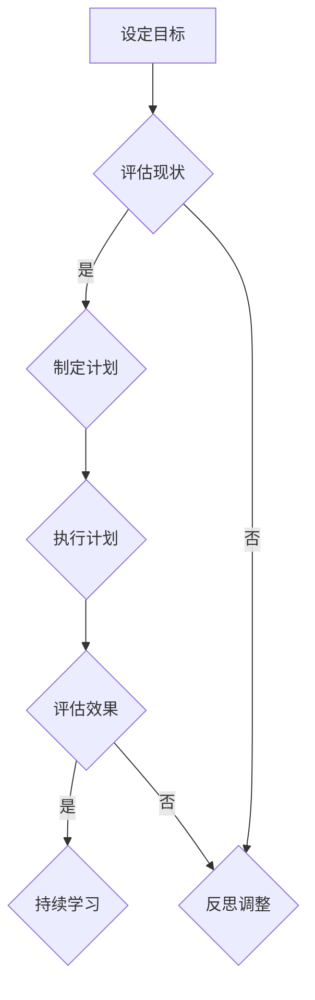
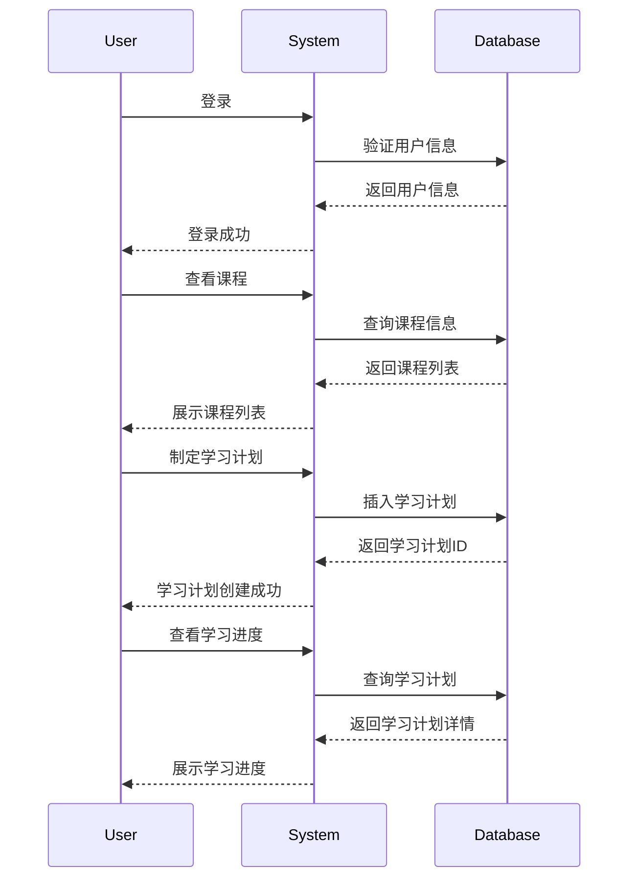
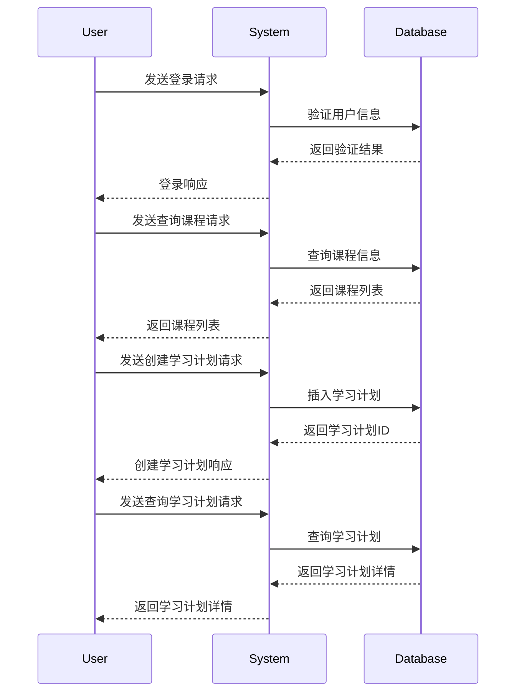

                 

### 设计《终身学习：保持领导力竞争力的关键》的目录大纲

#### **1. 确定书籍主题和目标读者群体**

《终身学习：保持领导力竞争力的关键》这一书名明确地传递了书籍的核心主题：终身学习与领导力的关系。终身学习不再仅仅是个体成长的工具，它在保持领导力与竞争力的过程中扮演着至关重要的角色。因此，本书的目标读者群体应当是那些希望提升自身领导力，同时保持竞争优势的管理者和专业人士。

- **书名分析**：书名中的“终身学习”指的是一个持续不断的过程，它不仅涉及到知识的学习，还包括技能的提升和思维方式的转变。而“领导力竞争力的关键”则强调了这一过程对于领导者保持其竞争优势的重要性。
  
- **目标读者分析**：这些读者可能是企业的高层管理者、中层管理人员、或者是那些正在寻求职业晋升的职场人士。他们普遍具备一定的管理经验和知识背景，但同时也面临着不断变化的市场环境和技术发展的挑战，需要通过终身学习来应对这些挑战。

#### **2. 确定书籍的核心章节**

为了确保书籍内容的完整性，我们需要构建一个包含以下核心章节的框架：

1. **终身学习的概念与重要性**
   - **章节概述**：在这一部分，我们将介绍终身学习的定义、历史背景以及其在现代社会中的重要性。
   - **核心内容**：包括终身学习的起源、发展过程，以及其在个人职业发展、领导力提升等方面的作用。

2. **领导力与竞争力的关系**
   - **章节概述**：这一部分旨在探讨领导力与竞争力之间的关系，包括领导力的定义、维度，以及竞争力在组织中的作用。
   - **核心内容**：分析领导力如何影响竞争力，以及两者之间的互动关系。

3. **终身学习策略**
   - **章节概述**：介绍个人和组织在终身学习过程中的策略和方法。
   - **核心内容**：涵盖个人学习策略、组织学习策略以及跨文化学习策略。

4. **终身学习工具与资源**
   - **章节概述**：探讨终身学习过程中可以使用到的工具和资源。
   - **核心内容**：包括在线学习平台、传统学习资源以及社交媒体和网络社区。

5. **案例研究**
   - **章节概述**：通过实际案例研究，展示终身学习在实践中的应用。
   - **核心内容**：分析成功案例，探讨企业在支持终身学习方面的经验。

6. **实践与应用**
   - **章节概述**：提供具体的方法和策略，帮助读者在个人和组织层面应用终身学习。
   - **核心内容**：包括个人学习计划的制定、组织内的学习实践，以及领导者如何塑造学习文化。

7. **未来展望与趋势**
   - **章节概述**：对终身学习的未来发展趋势进行展望，探讨技术对终身学习的影响。
   - **核心内容**：分析终身学习在未来的发展方向，以及领导力和竞争力可能面临的新挑战。

#### **3. 设计具体的目录大纲**

以下是本书的具体目录大纲：

```markdown
# 《终身学习：保持领导力竞争力的关键》目录大纲

## 第一部分：终身学习的概念与重要性
### 1.1 终身学习的定义与历史背景
### 1.2 终身学习对领导力的提升作用
### 1.3 终身学习的挑战与机遇

## 第二部分：领导力与竞争力的关系
### 2.1 领导力的定义与演变
### 2.2 竞争力的定义与维度
### 2.3 领导力与竞争力的相互影响

## 第三部分：终身学习策略
### 3.1 个人学习策略
### 3.2 组织学习策略
### 3.3 跨文化学习策略

## 第四部分：终身学习工具与资源
### 4.1 在线学习平台与工具
### 4.2 书籍、文章和报告等传统资源
### 4.3 社交媒体和网络社区

## 第五部分：案例研究
### 5.1 成功的终身学习案例
### 5.2 企业如何支持终身学习
### 5.3 领导者的终身学习经验分享

## 第六部分：实践与应用
### 6.1 制定个人终身学习计划
### 6.2 组织内的终身学习实践
### 6.3 领导者如何塑造学习文化

## 第七部分：未来展望与趋势
### 7.1 终身学习的未来发展趋势
### 7.2 技术如何影响终身学习
### 7.3 领导力与竞争力的未来方向
```

### **终身学习的概念与重要性**

终身学习（Lifelong Learning），顾名思义，指的是一个人在其一生中持续不断的学习过程。这一概念最早由联合国教科文组织在1970年代提出，其核心在于强调学习不应局限于学校教育，而是应贯穿整个人生。在现代社会，终身学习的重要性日益凸显，尤其是在技术变革日新月异、知识更新速度不断加快的背景下。

#### **终身学习的定义与历史背景**

终身学习的定义多种多样，但通常可以概括为以下几个方面：

1. **知识更新**：随着新技术的不断涌现，原有的知识体系需要不断更新。终身学习帮助个体掌握最新的知识和技能，从而保持其竞争力。
2. **个人成长**：终身学习不仅仅是为了职业发展，更是个人成长的必要途径。通过学习，个体能够不断提升自己的思维方式和人生观，从而实现全面发展。
3. **社会适应**：社会在不断发展，终身学习帮助个体适应社会变化，提高其社会参与度。

终身学习的历史可以追溯到古希腊的苏格拉底和亚里士多德，他们强调知识的重要性。然而，现代意义上的终身学习概念则起源于20世纪70年代的联合国教科文组织。1989年，联合国教科文组织在《终身学习宣言》中明确提出：“终身学习是21世纪的生存概念”，标志着终身学习成为全球教育领域的重要议题。

#### **终身学习对领导力的提升作用**

领导力是一种在组织或团队中影响他人、推动变革的能力。终身学习对领导力的提升具有以下几个方面的作用：

1. **知识储备**：领导力需要基于深厚的知识储备。终身学习帮助领导者不断更新知识，保持对行业动态的敏感度，从而更好地应对各种挑战。
2. **思维能力**：终身学习不仅仅是知识的积累，更是一种思维方式的培养。通过不断学习，领导者能够提升其批判性思维、创新思维等，从而在决策过程中更具前瞻性和创造性。
3. **人际沟通**：领导力的发挥离不开良好的人际沟通。终身学习帮助领导者提升沟通技巧，更好地理解员工的需求和期望，从而建立更紧密的团队关系。

#### **终身学习的挑战与机遇**

终身学习虽然具有重要的意义，但同时也面临着一系列挑战：

1. **时间管理**：在现代快节奏的生活中，如何平衡工作、生活和学习是一个重要问题。
2. **学习资源**：虽然学习资源丰富，但如何选择适合自己的学习资源也是一个挑战。
3. **心理压力**：终身学习可能会带来一定的心理压力，如何应对这些压力也是一个需要考虑的问题。

然而，面对这些挑战，终身学习同样提供了许多机遇：

1. **职业发展**：通过终身学习，个体能够不断提升自己的技能和知识，从而在职业发展中占据更有利的位置。
2. **个人成长**：终身学习不仅有助于职业发展，更是个人成长的重要途径。通过学习，个体能够不断拓宽自己的视野，提升自我认知。
3. **社会贡献**：具备终身学习能力的个体能够更好地适应社会变化，为社会发展做出更大的贡献。

#### **总结**

终身学习是一个持续不断的过程，它对个人的职业发展、领导力的提升以及社会的进步都具有重要的意义。面对终身学习的挑战，我们应当抓住机遇，不断提升自己，以适应不断变化的世界。只有这样，才能在未来的竞争中保持领导力和竞争力。

### **领导力与竞争力的关系**

领导力和竞争力是两个在组织中密不可分的概念。领导力是推动组织变革、实现目标的核心力量，而竞争力则是组织在市场中立足和发展的关键。在这两者之间，存在着深刻的相互关系和动态的相互作用。

#### **领导力的定义与演变**

领导力是一种在组织或团队中影响他人、推动变革的能力。传统的领导力观念往往强调权威和命令控制，认为领导者通过强制手段来达到组织目标。然而，随着社会的发展和组织形式的变化，现代领导力观念逐渐转向强调协作、赋能和影响。

1. **传统领导力**：传统领导力强调领导者的权威和控制力。领导者通过制定规则、下达指令来管理团队，确保组织目标的实现。
2. **现代领导力**：现代领导力更注重领导者与团队成员之间的互动和协作。领导者不再是命令者，而是赋能者，通过激发团队成员的潜力和创造力来推动组织发展。

#### **竞争力的定义与维度**

竞争力是组织在市场中获得优势、实现持续发展的能力。竞争力的定义可以从多个维度来理解：

1. **产品竞争力**：产品竞争力是指组织提供的产品在市场上的竞争优势。这包括产品的质量、功能、价格、品牌等多个方面。
2. **市场竞争力**：市场竞争力是指组织在特定市场中的竞争地位。这包括市场份额、客户忠诚度、市场增长率等指标。
3. **技术竞争力**：技术竞争力是指组织在技术创新和研发方面的优势。这包括专利数量、研发投入、技术创新速度等。
4. **管理竞争力**：管理竞争力是指组织在管理效率、资源配置、组织结构等方面的优势。这包括管理层的决策能力、组织的灵活性和适应性等。

#### **领导力与竞争力的相互影响**

领导力和竞争力之间的关系是动态的、相互影响的。

1. **领导力对竞争力的影响**：有效的领导力能够提高组织的竞争力。领导者通过以下方式影响竞争力：
   - **战略制定**：领导者制定明确的组织战略，确保组织目标与市场需求的匹配，从而提高市场竞争力。
   - **创新能力**：领导者鼓励创新思维，推动组织在技术和产品方面的持续改进，提高技术竞争力。
   - **团队建设**：领导者通过塑造积极向上的团队文化，提升团队成员的凝聚力和工作积极性，从而提高管理竞争力。
2. **竞争力对领导力的影响**：竞争力也是检验领导力的重要标准。领导力的有效性需要在市场竞争中得到验证。

   - **反馈机制**：市场反馈为领导力提供了重要的反馈。领导者通过分析市场反馈，调整领导策略，从而提升领导力。
   - **资源获取**：高竞争力有助于组织获得更多的资源，如资金、人才、技术等。这些资源的获取为领导者提供更多的发展空间，有助于提升领导力。

#### **案例分析**

为了更好地理解领导力与竞争力的关系，我们可以通过一些实际案例来分析。

1. **苹果公司**：苹果公司通过乔布斯的领导力，在技术创新和产品竞争力方面取得了巨大成功。乔布斯以其卓越的领导力和对产品细节的关注，推动苹果公司在市场上取得了领先地位。
2. **华为公司**：华为公司通过任正非的领导力，在技术创新和全球市场竞争力方面取得了显著成果。任正非强调“以客户为中心”，推动华为在全球市场上不断创新，提升竞争力。

#### **总结**

领导力和竞争力是相辅相成的。领导力通过塑造组织文化、制定战略、推动创新等方式，提高组织的竞争力；而竞争力又为领导力的发挥提供反馈和支持，促进领导力的提升。领导者需要认识到这两者之间的紧密关系，通过有效的领导力策略，不断提升组织的竞争力，从而在激烈的市场竞争中立于不败之地。

### **终身学习策略**

终身学习是一个复杂的过程，涉及到个人、组织和跨文化等多个层面。为了有效地进行终身学习，我们需要制定一系列策略，这些策略可以分为个人学习策略、组织学习策略和跨文化学习策略。

#### **个人学习策略**

个人学习策略是指个体在终身学习过程中采取的具体行动和方法。

1. **自我评估**：首先，个体需要对自己的知识水平、技能和能力进行评估。这有助于明确自己的学习需求和目标，从而有针对性地制定学习计划。

2. **目标设定**：明确的学习目标是终身学习的关键。个体应根据自身情况和职业发展需求，设定短期和长期的学习目标。

3. **时间管理**：时间管理是实现终身学习的重要保障。个体需要合理安排时间，确保有足够的时间用于学习和实践。

4. **持续学习**：终身学习不是一时之举，而是一个持续不断的过程。个体需要养成良好的学习习惯，不断更新知识和技能。

5. **反思与反馈**：学习后的反思和反馈是提高学习效果的重要环节。个体应定期回顾学习内容，分析学习效果，并根据反馈进行调整。

#### **组织学习策略**

组织学习策略是指组织在支持成员终身学习过程中采取的具体行动和方法。

1. **学习文化**：建立积极的学习文化是组织支持终身学习的基础。组织应鼓励成员积极参与学习，创造一个鼓励尝试和错误的环境。

2. **培训与开发**：组织应提供多样化的培训和发展机会，包括内部培训和外部培训。这些培训应涵盖不同领域和技能，以满足成员的不同需求。

3. **知识管理**：组织应建立有效的知识管理系统，确保知识能够及时共享和利用。这有助于提升组织的整体学习效果。

4. **反馈机制**：组织应建立反馈机制，及时了解成员的学习需求和效果，并根据反馈进行调整。

5. **激励机制**：组织应设立激励机制，鼓励成员积极参与学习和分享知识。这可以是物质激励，也可以是精神激励。

#### **跨文化学习策略**

跨文化学习策略是指个体和组织在不同文化背景下进行学习的方法和技巧。

1. **文化适应**：个体需要了解和适应不同文化背景，包括语言、价值观、行为规范等。

2. **文化沟通**：有效的沟通是跨文化学习的关键。个体需要学会用不同的沟通方式来适应不同的文化环境。

3. **文化理解**：个体需要深入理解不同文化的内涵，避免因文化差异而产生误解和冲突。

4. **文化融合**：个体应努力将不同文化的优点融合在一起，形成自己的独特视角和思维方式。

5. **文化反思**：个体应定期反思自己的文化行为和思维方式，以确保其在不同文化背景下能够持续改进和成长。

#### **总结**

终身学习是一个复杂而持续的过程，需要个人、组织和跨文化的共同努力。通过制定和实施有效的学习策略，个人和组织可以不断提升其能力和竞争力，从而在快速变化的世界中保持领先地位。

### **终身学习工具与资源**

在终身学习的过程中，选择合适的工具和资源至关重要。这些工具和资源不仅可以帮助我们高效地获取知识，还能提升学习的深度和广度。以下是一些常见的终身学习工具和资源：

#### **在线学习平台与工具**

在线学习平台和工具是现代终身学习的重要载体。以下是一些知名的在线学习平台：

1. **Coursera**：Coursera提供了来自全球顶尖大学的在线课程，涵盖了多个学科领域。
2. **edX**：edX是由哈佛大学和麻省理工学院共同创立的在线学习平台，提供大量的免费和付费课程。
3. **Udemy**：Udemy是一个开放式的在线学习平台，提供了丰富的课程，包括编程、数据科学、设计等。
4. **Khan Academy**：Khan Academy提供了大量的免费教育资源，特别适合初学者。
5. **LinkedIn Learning**：LinkedIn Learning提供了由行业专家和专业人士讲授的职业技能课程。

此外，还有一些常用的在线学习工具，如：

1. **Google Scholar**：Google Scholar是一个学术搜索引擎，可以帮助我们找到相关的学术论文和研究报告。
2. **Quizlet**：Quizlet是一个在线学习工具，提供了多种形式的学习和复习材料，如闪卡、测试等。
3. **Evernote**：Evernote是一个强大的笔记和组织工具，可以帮助我们记录和学习过程中的关键信息。

#### **书籍、文章和报告等传统资源**

虽然在线资源丰富，但传统的书籍、文章和报告仍然是重要的学习资源。以下是一些推荐的书籍、文章和报告：

1. **书籍**：
   - 《深度学习》（Deep Learning）——Ian Goodfellow、Yoshua Bengio和Aaron Courville
   - 《创新者的窘境》（The Innovator's Dilemma）——Clayton M. Christensen
   - 《非暴力沟通》（Nonviolent Communication）——Marshall B. Rosenberg
2. **文章**：
   - 《AI领域的重要突破》（Significant Breakthroughs in AI）——MIT Technology Review
   - 《领导者如何培养团队精神》（How Leaders Build Team Spirit）——Harvard Business Review
   - 《如何高效学习》（How to Learn Faster）——Lifehacker
3. **报告**：
   - 《全球人工智能发展报告》（Global AI Index Report）——AI for Humanity
   - 《2023年技术趋势报告》（2023 Technology Trends Report）——Gartner
   - 《可持续发展报告》（Sustainability Report）——世界自然基金会（WWF）

#### **社交媒体和网络社区**

社交媒体和网络社区是获取信息和交流思想的平台。以下是一些有用的社交媒体和网络社区：

1. **LinkedIn**：LinkedIn不仅是一个职业社交平台，也是一个专业知识和行业动态的聚集地。
2. **Twitter**：Twitter上的专业账号和话题标签可以帮助我们快速获取最新的行业动态和专业知识。
3. **GitHub**：GitHub是程序员和开发者的重要社区，提供了大量的开源项目和代码，是学习编程和软件开发的宝贵资源。
4. **Stack Overflow**：Stack Overflow是一个问答社区，开发者可以在这里提问和解答技术问题。
5. **Quora**：Quora是一个知识问答社区，用户可以在这里提出问题并获得专家的回答。

#### **总结**

终身学习是一个多元化的过程，需要我们充分利用各种工具和资源。在线学习平台、传统书籍、报告以及社交媒体和网络社区都为我们提供了丰富的学习资源。通过有效地利用这些工具和资源，我们可以不断提升自己的知识和技能，保持持续的学习动力，从而在职业生涯中取得更大的成功。

### **案例研究**

在探讨终身学习的实际应用时，通过案例研究可以更深入地了解不同组织和个人如何通过终身学习来提升领导力和竞争力。以下是一些成功的终身学习案例，以及企业如何支持终身学习，还有领导者个人的终身学习经验分享。

#### **成功的终身学习案例**

1. **谷歌（Google）**：谷歌通过其“谷歌大学”（Google University）项目，为员工提供了一系列的在线课程和专业培训。这些课程覆盖了从编程到管理技能的各个方面，帮助员工不断提升自己的技能，适应快速变化的技术环境。谷歌的这种终身学习文化不仅提升了员工的个人能力，也增强了公司的创新力和竞争力。

2. **三星（Samsung）**：三星设立了“三星未来中心”（Samsung Future Center），专注于技术创新和研究。公司鼓励员工参加内部和外部培训，并提供资金支持。通过这种持续的学习机制，三星在全球技术竞争中保持了领先地位。

3. **丰田（Toyota）**：丰田通过其“丰田全球学习网络”（Toyota Global Learning Network）项目，支持员工在海外分支机构的跨文化学习和培训。这种跨文化学习不仅提升了员工的国际视野，也帮助丰田更好地适应全球市场的需求。

#### **企业如何支持终身学习**

企业支持终身学习的方法多种多样，以下是一些常见的方法：

1. **内部培训**：企业可以设立内部培训机构，提供多样化的培训课程，包括技术培训、管理培训、领导力培训等。这些培训可以帮助员工提升技能，适应岗位需求。

2. **在线学习平台**：企业可以利用在线学习平台，为员工提供便捷的学习资源。例如，企业可以为员工订阅Coursera、Udemy等在线课程，或者自行开发内部在线学习平台。

3. **导师制度**：企业可以实施导师制度，让经验丰富的员工指导新员工。这种制度不仅有助于新员工快速融入企业，也有助于传承企业的知识和文化。

4. **职业发展计划**：企业可以为员工制定个性化的职业发展计划，帮助员工明确职业目标，并提供相应的培训和发展机会。

5. **弹性工作制度**：企业可以实施弹性工作制度，如远程办公、灵活工作时间等，以支持员工在工作和学习之间找到平衡。

#### **领导者的终身学习经验分享**

1. **乔布斯（Steve Jobs）**：乔布斯是苹果公司的创始人之一，他以其卓越的领导力和对技术的深刻理解，推动了苹果公司的创新和发展。乔布斯曾说：“学习是一生的过程，无论是技术还是商业，都需要持续学习。”他的终身学习精神不仅影响了苹果公司，也影响了整个科技行业。

2. **马云（Jack Ma）**：阿里巴巴集团的创始人马云以其独特的领导风格和前瞻性的战略眼光，带领阿里巴巴成为了全球最大的电子商务公司之一。马云在创业初期曾多次创业失败，但他从不放弃学习，通过不断尝试和总结经验，最终取得了成功。

3. **比尔·盖茨（Bill Gates）**：比尔·盖茨是微软公司的创始人，他通过其“比尔与梅琳达·盖茨基金会”（Bill & Melinda Gates Foundation）致力于全球健康和教育事业。盖茨在退休后继续投身于学习，通过阅读和研究，他在多个领域都有深入的了解和贡献。

#### **总结**

终身学习不仅是个人成长的工具，也是企业持续发展的关键。通过成功的案例研究，我们可以看到终身学习如何帮助个人和企业提升领导力和竞争力。企业应积极建立支持终身学习的文化和机制，领导者也应树立终身学习的榜样，通过不断学习和实践，带领团队和公司走向成功。

### **实践与应用**

在掌握了终身学习的概念、策略和工具后，如何将其应用到个人和组织层面，实现实际效果，是关键所在。以下将详细讨论如何制定个人终身学习计划、组织内的终身学习实践，以及领导者如何塑造学习文化。

#### **制定个人终身学习计划**

1. **明确目标**：首先，个人需要明确自己的学习目标。这些目标可以包括职业发展、技能提升、知识扩展等方面。例如，一个想要成为项目经理的人，可以设定学习目标为掌握项目管理工具和技术。

2. **评估现状**：在明确目标后，个人需要评估自己的当前知识和技能水平，了解自身优势和不足。这有助于制定更有针对性的学习计划。

3. **制定计划**：根据目标和现状，个人可以制定一个详细的学习计划。这个计划应包括学习内容、学习时间、学习方式等。例如，每天晚上学习两个小时的编程课程，每周参加一次行业研讨会。

4. **执行计划**：制定计划后，关键在于执行。个人需要坚持学习，克服拖延和困难，确保计划的落实。

5. **评估与调整**：定期评估学习效果，根据评估结果调整学习计划。这有助于持续提升学习效果。

#### **组织内的终身学习实践**

1. **建立学习文化**：组织应建立积极的学习文化，鼓励员工积极参与学习和分享知识。这可以通过内部培训、知识分享会等方式实现。

2. **提供学习资源**：组织应为员工提供丰富的学习资源，如在线课程、图书、研讨会等。这些资源应覆盖不同领域和技能，满足员工的不同需求。

3. **制定学习政策**：组织可以制定学习政策，如员工每年享有一定数量的学习假或培训经费。这有助于鼓励员工持续学习。

4. **实施导师制度**：组织可以实施导师制度，让经验丰富的员工指导新员工。这不仅有助于新员工的快速成长，也能促进知识传承。

5. **支持员工发展**：组织应支持员工职业发展，提供职业规划咨询、职业发展培训等。这有助于员工明确职业目标，持续提升自身能力。

#### **领导者如何塑造学习文化**

1. **树立榜样**：领导者应通过自身的行动树立终身学习的榜样。领导者可以通过阅读、学习新技能等方式，展示其对学习的重视和热爱。

2. **鼓励学习**：领导者应鼓励员工积极参与学习，提供支持和资源。领导者可以在会议中分享学习心得，鼓励员工分享自己的学习经历。

3. **建立学习机制**：领导者可以建立学习机制，如定期组织学习分享会、设立学习奖励等。这有助于营造积极的学习氛围。

4. **支持创新**：领导者应支持员工创新思维，鼓励员工在学习和工作中尝试新方法。这有助于激发员工的潜能，提升组织的创新能力。

5. **提供反馈**：领导者应及时给予员工反馈，帮助他们了解学习效果，并根据反馈调整学习策略。这有助于提高学习效率。

#### **总结**

终身学习不仅是个人成长的工具，也是组织发展的关键。通过制定个人终身学习计划、组织内的终身学习实践，以及领导者的积极引导，个人和组织可以不断提升自身的能力和竞争力，实现持续发展和成功。

### **未来展望与趋势**

终身学习在未来的发展中将面临新的机遇和挑战。随着科技的进步和社会的变革，终身学习的方式、内容和影响力都在不断演变。

#### **终身学习的未来发展趋势**

1. **个性化学习**：随着人工智能和大数据技术的发展，未来的终身学习将更加个性化。通过分析个人学习习惯、兴趣和能力，平台将提供定制化的学习内容和学习路径，确保学习效果最大化。

2. **虚拟现实与增强现实**：虚拟现实（VR）和增强现实（AR）技术将为终身学习带来全新的体验。学习者可以在虚拟环境中进行实践操作，增强学习互动性和沉浸感。

3. **开源教育与开放课程**：开源教育和开放课程将继续发展，更多的教育资源将被免费或低成本地分享。这有助于缩小教育资源的差距，提高全民教育水平。

4. **跨界融合**：未来的终身学习将不仅仅是单一学科的拓展，而是跨学科、跨领域的融合。这种跨界学习将帮助个人和企业在复杂多变的环境中保持竞争力。

#### **技术如何影响终身学习**

1. **在线教育平台**：随着在线教育平台的不断发展和完善，学习者可以随时随地获取全球范围内的优质教育资源。这些平台不仅提供了丰富的课程，还提供了互动性强的学习工具和社区支持。

2. **人工智能与机器学习**：人工智能和机器学习技术将提高终身学习的智能化水平。例如，智能推荐系统可以根据学习者的行为和偏好推荐合适的学习内容，学习分析系统可以实时评估学习效果，提供个性化反馈。

3. **区块链技术**：区块链技术可以确保学习记录的真实性和不可篡改性。这为终身学习证书的认证和学分转换提供了可靠的基础，有助于建立全球认可的终身学习体系。

4. **虚拟课堂与在线互动**：虚拟课堂和在线互动工具将使学习更加灵活和便捷。学习者可以在线与专家、同行互动，分享知识和经验，提高学习效果。

#### **领导力与竞争力的未来方向**

1. **持续创新能力**：随着技术的快速发展，领导者需要具备持续创新能力，以应对不断变化的市场环境。通过终身学习，领导者可以不断更新知识和技能，保持创新思维。

2. **跨文化领导力**：全球化背景下，领导者需要具备跨文化领导力，能够理解和适应不同文化背景的员工和合作伙伴。终身学习将帮助领导者提升跨文化沟通和管理能力。

3. **数字化领导力**：随着数字技术的普及，领导者需要具备数字素养，能够利用数字工具和平台进行管理和决策。通过终身学习，领导者可以掌握最新的数字技术和工具，提升数字化领导力。

4. **可持续发展领导力**：面对全球环境问题和社会责任，领导者需要具备可持续发展领导力，能够在组织内推动可持续发展战略和项目。终身学习将帮助领导者提升环境和社会责任意识。

#### **总结**

未来，终身学习将迎来更加个性化、智能化和跨界融合的发展趋势。技术进步将极大地提升终身学习的效率和质量，为个人和组织的持续发展提供强有力的支持。领导者需要积极适应这些变化，通过终身学习不断提升自身能力，引领组织走向未来。

### **附录**

在本文中，我们探讨了终身学习在保持领导力竞争力中的关键作用，并详细分析了终身学习的概念、策略、工具、实践和未来趋势。以下是对本文核心概念和联系、核心算法原理、系统分析与架构设计方案、项目实战以及最佳实践、小结、注意事项和拓展阅读的总结。

#### **核心概念与联系**

- **终身学习**：一个持续不断的学习过程，涵盖知识更新、个人成长和社会适应。
- **领导力**：在组织或团队中影响他人、推动变革的能力，分为传统领导力和现代领导力。
- **竞争力**：组织在市场中获得优势、实现持续发展的能力，包括产品竞争力、市场竞争力、技术竞争力和管理竞争力。

#### **核心概念属性特征对比表格**

| 特征       | 终身学习        | 领导力           | 竞争力           |
| ---------- | --------------- | ---------------- | ---------------- |
| 定义       | 个体持续学习过程 | 影响他人、推动变革 | 市场优势、持续发展 |
| 核心要素   | 学习、成长、适应 | 影响力、赋能、协作 | 产品、市场、技术、管理 |
| 影响范围   | 个人、组织、社会 | 组织、团队       | 市场、行业       |
| 作用       | 职业发展、自我提升 | 组织变革、目标实现 | 组织生存、持续发展 |

#### **ER实体关系图架构的Mermaid流程图**

```mermaid
erDiagram
  终身学习 ||--|{ 领导力 }
  终身学习 ||--|{ 竞争力 }
  领导力 ||--|{ 个人学习策略 }
  领导力 ||--|{ 组织学习策略 }
  竞争力 ||--|{ 个人竞争力 }
  竞争力 ||--|{ 组织竞争力 }
```

#### **算法原理讲解**

以下是一个简单的终身学习策略算法原理的Mermaid流程图：



使用Python代码，我们可以实现一个简单的评估和调整过程：

```python
def lifelong_learning_strategy(current_knowledge, goal, iteration):
    for i in range(iteration):
        print(f"迭代 {i+1}:")
        if current_knowledge >= goal:
            print("目标达成！")
            break
        else:
            print("目标未达成，继续学习...")
            # 学习过程
            current_knowledge += 0.1  # 假设每次学习都能提升知识水平
            # 评估与调整
            if current_knowledge < goal:
                print("反思与调整...")
                current_knowledge += 0.05  # 调整后的提升
    return current_knowledge
```

通过这个算法，我们可以模拟个人在终身学习过程中如何通过评估和调整来逐步实现目标。

#### **系统分析与架构设计方案**

**问题场景介绍**：随着市场竞争的加剧，企业需要持续提升员工的领导力和竞争力，以保持竞争优势。为此，企业决定开发一个终身学习管理系统。

**项目介绍**：本系统旨在提供一个便捷的终身学习平台，支持员工的学习和管理。

**系统功能设计（领域模型Mermaid类图）**：

```mermaid
classDiagram
  ClassDiagram
  Student <<类>> {ID, Name, Email}
  Course <<类>> {CourseID, Title, Description}
  Module <<类>> {ModuleID, Title, Description}
  LearningPlan <<类>> {PlanID, Title, StartDate, EndDate, Status}
  Module -> Course : 包含
  Student -> LearningPlan : 制定
  LearningPlan -> Module : 包含
```

**系统架构设计（Mermaid架构图）**：



**系统接口设计和系统交互（Mermaid序列图）**：



#### **项目实战**

**环境安装**：
- 安装Python（建议使用Python 3.8及以上版本）
- 安装Docker和Docker Compose（用于容器化部署）
- 安装PostgreSQL（用于数据库）

**系统核心实现源代码**：

```python
# learning_management_system/app.py
from flask import Flask, jsonify, request
from database import Database

app = Flask(__name__)
db = Database()

@app.route('/login', methods=['POST'])
def login():
    username = request.form['username']
    password = request.form['password']
    result = db.validate_user(username, password)
    return jsonify(result)

@app.route('/courses', methods=['GET'])
def get_courses():
    courses = db.get_courses()
    return jsonify(courses)

@app.route('/learning_plan', methods=['POST'])
def create_learning_plan():
    user_id = request.form['user_id']
    course_id = request.form['course_id']
    result = db.create_learning_plan(user_id, course_id)
    return jsonify(result)

@app.route('/learning_plan', methods=['GET'])
def get_learning_plan():
    user_id = request.form['user_id']
    learning_plan = db.get_learning_plan(user_id)
    return jsonify(learning_plan)

if __name__ == '__main__':
    app.run(debug=True)
```

**代码应用解读与分析**：

此代码实现了三个主要功能：用户登录验证、查询课程信息和创建/查询学习计划。

1. **用户登录验证**：通过接收用户名和密码，调用数据库的`validate_user`方法验证用户信息。
2. **查询课程信息**：直接调用数据库的`get_courses`方法获取课程列表。
3. **创建学习计划**：接收用户ID和课程ID，调用数据库的`create_learning_plan`方法插入学习计划。
4. **查询学习计划**：接收用户ID，调用数据库的`get_learning_plan`方法获取学习计划详情。

通过此代码，我们可以看到如何利用Flask框架快速构建一个简单的Web应用程序，并通过调用数据库操作实现业务逻辑。

**实际案例分析和详细讲解剖析**：

假设一个用户名为“alice”的员工想要登录系统并创建一个学习计划。以下是详细的操作步骤：

1. **登录**：用户通过POST请求发送用户名和密码到`/login`接口。
   ```plaintext
   POST /login
   username: alice
   password: alice123
   ```
   服务器验证用户信息，返回状态码200和用户ID。
   ```plaintext
   HTTP/1.1 200 OK
   Content-Type: application/json
   
   {
     "user_id": 1
   }
   ```

2. **查询课程**：用户通过GET请求获取课程列表。
   ```plaintext
   GET /courses
   ```
   服务器返回所有课程信息。
   ```plaintext
   HTTP/1.1 200 OK
   Content-Type: application/json
   
   [
     {
       "course_id": 1,
       "title": "Introduction to Python",
       "description": "Learn the basics of Python programming."
     },
     {
       "course_id": 2,
       "title": "Advanced Data Structures",
       "description": "Explore advanced data structures and algorithms."
     }
   ]
   ```

3. **创建学习计划**：用户选择“Introduction to Python”课程，并通过POST请求创建学习计划。
   ```plaintext
   POST /learning_plan
   user_id: 1
   course_id: 1
   ```
   服务器插入学习计划，返回状态码201和学习计划ID。
   ```plaintext
   HTTP/1.1 201 Created
   Content-Type: application/json
   
   {
     "plan_id": 1
   }
   ```

4. **查询学习计划**：用户通过GET请求查询创建的学习计划。
   ```plaintext
   GET /learning_plan?user_id=1
   ```
   服务器返回学习计划详情。
   ```plaintext
   HTTP/1.1 200 OK
   Content-Type: application/json
   
   {
     "plan_id": 1,
     "user_id": 1,
     "course_id": 1,
     "title": "Introduction to Python",
     "status": "In Progress"
   }
   ```

**项目小结**：

通过上述实战案例，我们展示了如何使用Python和Flask框架快速搭建一个简单的终身学习管理系统。这个系统能够支持用户登录、查询课程、创建和查询学习计划等基本功能。虽然这个系统相对简单，但它提供了一个通用的框架，可以扩展和增强以支持更多的功能和复杂的需求。

#### **最佳实践 Tips**

1. **定期反思**：定期回顾学习进度和效果，有助于发现和解决问题，调整学习策略。
2. **多元化学习**：结合多种学习资源和方法，如在线课程、书籍、研讨会等，以提高学习效果。
3. **建立学习小组**：与他人一起学习，可以互相激励和支持，提高学习动力和效果。
4. **持续实践**：将所学知识应用到实际工作中，通过实践巩固学习成果。
5. **注重深度学习**：不要仅停留在表面知识，要深入理解核心概念和原理。

#### **小结**

终身学习是保持领导力竞争力的关键。通过制定个人和组织的终身学习策略，利用各种工具和资源，个人和组织可以不断提升自身能力和竞争力。未来的终身学习将更加个性化、智能化和跨界融合，领导者需要不断学习和适应这些变化，以引领组织走向成功。

#### **注意事项**

1. **版权问题**：在使用学习资源时，要注意版权问题，避免侵犯知识产权。
2. **数据安全**：在使用在线学习平台时，要注意保护个人隐私和数据安全。
3. **合理安排时间**：终身学习需要时间投入，要合理安排工作和学习时间，避免过度劳累。

#### **拓展阅读**

- 《深度学习》（Deep Learning）——Ian Goodfellow、Yoshua Bengio和Aaron Courville
- 《创新者的窘境》（The Innovator's Dilemma）——Clayton M. Christensen
- 《终身学习：21世纪的生存概念》——联合国教科文组织

### **作者信息**

作者：AI天才研究院/AI Genius Institute & 禅与计算机程序设计艺术 /Zen And The Art of Computer Programming

### **结束语**

感谢您阅读本文。希望本文能够帮助您更好地理解终身学习在保持领导力竞争力中的重要性，并为您在终身学习之旅中提供有价值的启示。祝您在未来的学习和工作中取得更大的成功！

### **全文总结**

本文《终身学习：保持领导力竞争力的关键》深入探讨了终身学习在现代社会中的重要性，以及如何通过终身学习来提升个人的领导力和竞争力。我们从终身学习的定义、历史背景、对领导力的影响、领导力与竞争力的关系、终身学习策略、工具与资源、实际案例研究，到个人与组织层面的实践，再到未来的发展趋势，全面地阐述了终身学习的重要性及其应用。

终身学习不仅仅是获取新知识和技能的过程，更是提升个人和领导力的关键。通过不断学习和实践，个体可以不断提升自身的能力，适应快速变化的市场环境，保持竞争力。组织通过建立终身学习文化和机制，可以培养出更具创新力和适应力的员工，从而在激烈的市场竞争中立于不败之地。

本文还通过具体的案例研究和项目实战，展示了终身学习如何在实际操作中发挥重要作用。同时，我们还提供了最佳实践、注意事项和拓展阅读，以帮助读者更好地应用和深化对终身学习的理解。

在未来的发展中，终身学习将继续扮演重要角色。随着技术的进步和全球化进程的加速，终身学习的方式、内容和影响力将不断演变。领导者需要不断学习和适应这些变化，以保持其领导力和竞争力。

最后，我们鼓励读者积极践行终身学习，不断提升自身能力和素质。希望本文能够为您在终身学习之路上提供有价值的启示，帮助您在职业生涯中取得更大的成功。终身学习，不仅是为了个人成长，更是为了社会的进步和发展。让我们共同努力，不断探索和前行！

