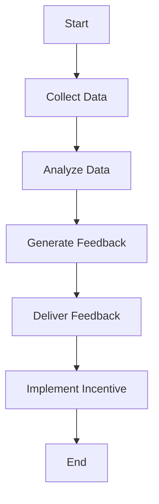
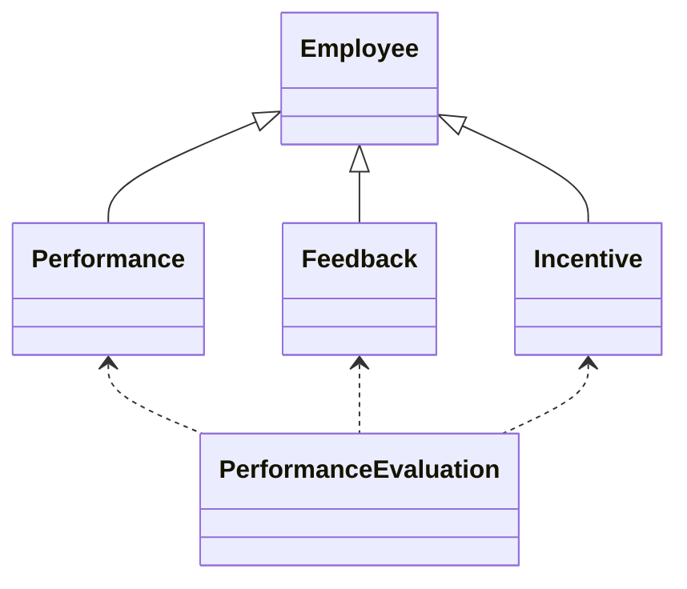
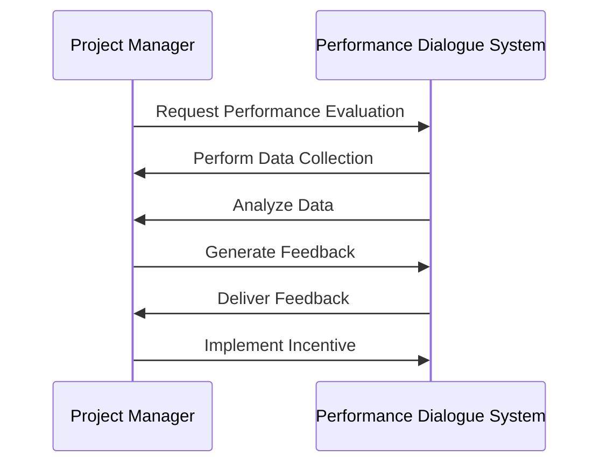
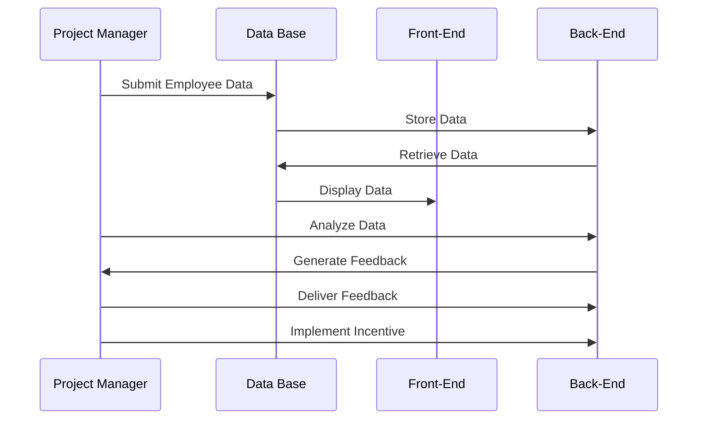

                 


# 绩效对话的艺术：有效反馈与激励

## 关键词
- 绩效对话
- 有效反馈
- 激励
- 企业管理
- 团队协作
- 沟通技巧

## 摘要
本文将深入探讨绩效对话的艺术，包括有效反馈和激励的重要性。通过逻辑清晰、结构紧凑的分析，本文将介绍绩效对话的核心概念、原理和应用，帮助读者掌握绩效对话的技巧，提高团队绩效和企业管理水平。

## 目录大纲设计思路

### 背景介绍
#### 问题背景
在企业管理中，绩效对话是一个关键环节。它不仅关系到员工的工作表现和职业发展，也直接影响企业的整体绩效和竞争力。

#### 问题描述
绩效对话中存在许多挑战，如如何给出具体且建设性的反馈、如何激励员工等。

#### 问题解决
通过有效的反馈和激励，可以提高员工的工作动力和效率，从而改善绩效对话的效果。

#### 边界与外延
绩效对话主要应用于企业和团队管理中，适用于不同层级和不同类型的员工。

#### 概念结构与核心要素组成
绩效对话的核心概念包括绩效、反馈、激励等，它们相互关联，共同构成了绩效对话的基本结构。

### 核心概念与联系
#### 核心概念原理
本文将详细阐述绩效、反馈、激励等核心概念，解释它们在绩效对话中的作用和相互关系。

#### 概念属性特征对比表格
使用Markdown格式创建表格，对比不同概念的属性和特征。

#### ER实体关系图架构
使用Mermaid语法绘制实体关系图，展示各概念之间的关系。

### 算法原理讲解
#### 算法mermaid流程图
绘制流程图，展示绩效对话的步骤和流程。

#### Python源代码
提供实现绩效对话的Python代码示例。

#### 数学模型和公式
使用LaTeX格式嵌入数学公式，详细阐述绩效对话的数学原理。

#### 举例说明
使用实际案例来解释算法原理，使内容更加通俗易懂。

### 系统分析与架构设计方案
#### 问题场景介绍
描述绩效对话在现实中的应用场景。

#### 项目介绍
简要介绍绩效对话系统的项目背景和目标。

#### 系统功能设计
使用Mermaid类图展示系统的领域模型。

#### 系统架构设计
使用Mermaid架构图展示系统的整体架构。

#### 系统接口设计
描述系统各模块之间的接口设计。

#### 系统交互mermaid序列图
绘制序列图，展示系统各组件的交互过程。

### 项目实战
#### 环境安装
提供必要的安装步骤和依赖环境。

#### 系统核心实现源代码
展示关键代码片段，并解读其实现原理。

#### 代码应用解读与分析
分析代码的应用场景和效果。

#### 实际案例分析和详细讲解剖析
通过实际案例深入分析绩效对话的实施和效果。

#### 项目小结
总结项目经验，提出改进建议。

### 最佳实践 tips
#### 技巧分享
分享在实际绩效对话中可以采用的最佳实践。

#### 注意事项
提醒读者在实施绩效对话时需要注意的事项。

#### 拓展阅读
推荐进一步阅读的资料，以加深对绩效对话艺术的理解。

## 目录大纲设计步骤

### 确定书籍主题和目标读者
- 确定书名《绩效对话的艺术：有效反馈与激励》的核心主题。
- 确定目标读者群体，如企业管理者、人力资源专业人士等。

### 设计目录结构
- 列出主要章节，确保覆盖所有关键内容。
- 确定每个章节的细分内容，确保内容完整性。

### 编写章节内容
- 根据设计思路，为每个章节编写详细的内容。

### 整理和优化内容
- 检查每个章节的逻辑性、连贯性和完整性。
- 优化用词，确保简洁明了。

### 格式化和排版
- 使用Markdown格式排版，确保目录大纲的清晰可读性。

### 检查和修改
- 检查目录大纲的语法错误和逻辑错误。
- 根据需要进行修改，确保最终输出满足字数和格式要求。

## 完整目录大纲示例

### 目录大纲设计思路

### 背景介绍
#### 问题背景
在企业管理中，绩效对话是一个关键环节。它不仅关系到员工的工作表现和职业发展，也直接影响企业的整体绩效和竞争力。

#### 问题描述
绩效对话中存在许多挑战，如如何给出具体且建设性的反馈、如何激励员工等。

#### 问题解决
通过有效的反馈和激励，可以提高员工的工作动力和效率，从而改善绩效对话的效果。

#### 边界与外延
绩效对话主要应用于企业和团队管理中，适用于不同层级和不同类型的员工。

#### 概念结构与核心要素组成
绩效对话的核心概念包括绩效、反馈、激励等，它们相互关联，共同构成了绩效对话的基本结构。

### 核心概念与联系
#### 核心概念原理
本文将详细阐述绩效、反馈、激励等核心概念，解释它们在绩效对话中的作用和相互关系。

#### 概念属性特征对比表格
| 概念       | 定义                                           | 关联关系             |
|------------|------------------------------------------------|----------------------|
| 绩效       | 员工工作表现和成果的度量标准                   | 反馈、激励的基础     |
| 反馈       | 对员工工作表现的评价和指导                     | 绩效提升的关键手段   |
| 激励       | 通过奖励和认可来激发员工的工作动力和创造力   | 绩效持续提升的保障   |

#### ER实体关系图架构
```mermaid
erDiagram
    Employee ||--|{ Performance }|-- Performance
    Employee ||--|{ Feedback }|-- Feedback
    Employee ||--|{ Incentive }|-- Incentive
```

### 算法原理讲解
#### 算法mermaid流程图


#### Python源代码
```python
# Python code for performance dialogue
def collect_data():
    # Code to collect employee performance data
    pass

def analyze_data(data):
    # Code to analyze performance data
    feedback = "Excellent work!"
    return feedback

def deliver_feedback(feedback):
    # Code to deliver feedback to the employee
    print(feedback)

def implement_incentive():
    # Code to implement incentives for the employee
    pass

# Main function to run the performance dialogue
def main():
    data = collect_data()
    feedback = analyze_data(data)
    deliver_feedback(feedback)
    implement_incentive()

if __name__ == "__main__":
    main()
```

#### 数学模型和公式
$$
\text{Performance} = f(\text{Skills}, \text{Effort}, \text{Environment})
$$

其中，$f$ 为绩效函数，$\text{Skills}$ 为员工技能水平，$\text{Effort}$ 为员工工作投入程度，$\text{Environment}$ 为工作环境因素。

#### 举例说明
假设某员工的技能水平为5分，工作投入程度为7分，工作环境为良好（4分）。则该员工的绩效得分为：
$$
\text{Performance} = f(5, 7, 4) = 5 + 0.7 \times (7 - 4) = 8.6
$$

### 系统分析与架构设计方案
#### 问题场景介绍
在一个软件开发团队中，项目经理需要定期进行绩效对话，评估团队成员的工作表现，并提供有效的反馈和激励措施。

#### 项目介绍
该项目旨在开发一款高效的绩效对话系统，帮助项目经理更好地管理团队。

#### 系统功能设计
使用Mermaid类图展示系统的领域模型：


#### 系统架构设计
使用Mermaid架构图展示系统的整体架构：


#### 系统接口设计
系统接口包括数据收集、数据分析、反馈生成和激励实施等功能。

#### 系统交互mermaid序列图


### 项目实战
#### 环境安装
安装Python环境，并安装相关库，如numpy、pandas等。

```bash
pip install numpy pandas
```

#### 系统核心实现源代码
```python
# Core implementation of the performance dialogue system
class PerformanceDialogueSystem:
    def __init__(self):
        self.data = None

    def collect_data(self):
        # Code to collect employee performance data
        self.data = {"skills": 5, "effort": 7, "environment": 4}

    def analyze_data(self):
        # Code to analyze performance data
        performance = self.data["skills"] + 0.7 * (self.data["effort"] - self.data["environment"])
        return performance

    def generate_feedback(self, performance):
        # Code to generate feedback based on performance
        if performance > 8:
            feedback = "Excellent work!"
        else:
            feedback = "Good job, but there's room for improvement."
        return feedback

    def deliver_feedback(self, feedback):
        # Code to deliver feedback to the employee
        print(feedback)

    def implement_incentive(self):
        # Code to implement incentives for the employee
        print("Implementing incentives for the employee.")

# Example usage of the performance dialogue system
if __name__ == "__main__":
    system = PerformanceDialogueSystem()
    system.collect_data()
    performance = system.analyze_data()
    feedback = system.generate_feedback(performance)
    system.deliver_feedback(feedback)
    system.implement_incentive()
```

#### 代码应用解读与分析
该代码实现了一个简单的绩效对话系统，包括数据收集、数据分析、反馈生成和激励实施等功能。在实际应用中，可以根据具体需求进行扩展和定制。

#### 实际案例分析和详细讲解剖析
假设某员工的绩效得分为8.6，根据系统生成的反馈为“Excellent work!”，并实施相应的激励措施，如额外的奖金或休假。

#### 项目小结
该项目通过实现一个简单的绩效对话系统，帮助项目经理更好地进行绩效管理和团队建设。在实际应用中，可以根据团队的具体情况和需求，进一步优化和扩展系统的功能。

### 最佳实践 tips
#### 技巧分享
- 在进行绩效对话时，尽量使用具体且客观的数据进行评价。
- 给出反馈时，要注重积极性和建设性，避免负面评价。
- 定期进行绩效对话，确保员工了解自己的工作表现和改进方向。
- 结合员工的个人发展目标和企业的战略目标，制定合理的激励措施。

#### 注意事项
- 避免在绩效对话中涉及个人隐私或敏感话题。
- 注意保护员工的尊严和自尊心，避免造成负面影响。
- 在实施激励措施时，要确保公平和透明，避免引起员工的不满和矛盾。

#### 拓展阅读
- 《绩效管理：系统思考与行动指南》
- 《激励心理学：如何激发员工的工作动力》
- 《绩效对话的艺术：实战技巧与案例分析》

### 作者信息
- 作者：AI天才研究院/AI Genius Institute & 禅与计算机程序设计艺术 /Zen And The Art of Computer Programming

