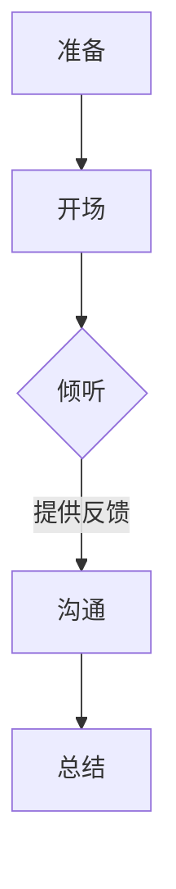
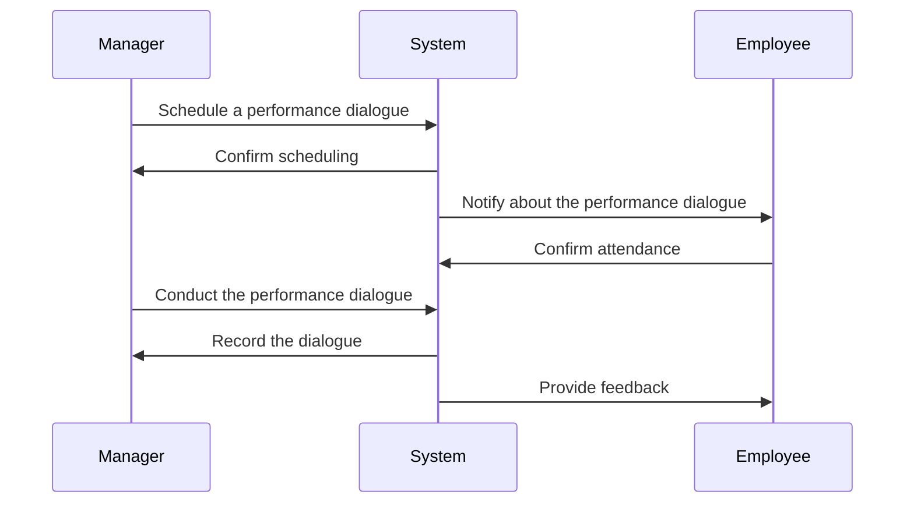
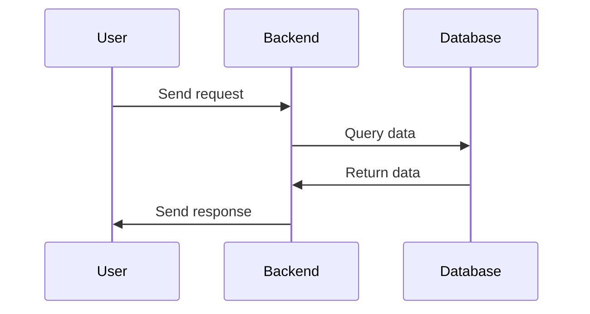

                 

# 绩效对话：进行有效的一对一面谈

## 关键词
- 绩效对话
- 一对一面谈
- 沟通技巧
- 算法原理
- 数学模型
- 系统架构

## 摘要
绩效对话和一对一面谈在职场中至关重要，是提升员工绩效和团队管理效率的重要手段。本文将详细介绍绩效对话和一对一面谈的概念、重要性、原理和方法，并结合实际案例，探讨如何进行有效的绩效对话和一对一面谈，为职场人士提供实用的指导和建议。

## 1. 背景介绍

### 1.1 绩效对话的概念与重要性
绩效对话是指管理者与员工之间就员工的工作表现、目标达成、问题解决等进行的正式交流。它不仅关注员工当前的工作状况，还涉及员工的职业发展和个人成长。绩效对话的重要性主要体现在以下几个方面：
1. **提升员工绩效**：通过绩效对话，管理者可以了解员工的工作表现，发现问题和不足，提供针对性的反馈和指导，从而提升员工的绩效。
2. **促进员工成长**：绩效对话不仅关注员工的工作表现，还关注员工的职业发展和个人成长。通过对话，管理者可以为员工提供职业发展的建议和指导，帮助员工实现自我提升。
3. **加强团队管理**：绩效对话有助于管理者了解团队的整体工作状况，发现团队存在的问题，制定有效的改进措施，从而提升团队的管理效率。

### 1.2 一对一面谈的概念与类型
一对一面谈是指管理者与员工之间一对一进行的交流，通常在特定的时间和地点进行。一对一面谈可以分为以下几种类型：
1. **绩效反馈面谈**：在绩效周期结束时，管理者对员工的工作表现进行评价和反馈，并提出改进建议。
2. **职业发展面谈**：管理者与员工讨论员工的职业发展计划，包括晋升路径、技能提升等。
3. **问题解决面谈**：管理者与员工讨论工作中遇到的问题，共同寻找解决方案。
4. **日常沟通面谈**：管理者与员工就日常工作中的一些具体问题进行交流。

### 1.3 绩效对话的基本框架
绩效对话通常包括以下几个步骤：
1. **准备**：在对话前，管理者需要了解员工的工作表现，准备好对话的主题和要点。
2. **开场**：管理者以友好、开放的态度开场，建立良好的对话氛围。
3. **倾听**：管理者需要倾听员工的意见和反馈，理解员工的观点。
4. **沟通**：管理者根据员工的反馈，提供针对性的反馈和指导。
5. **总结**：在对话结束时，管理者总结对话的主要内容和成果，明确下一步的行动计划。

### 1.4 一对一面谈的基本步骤
一对一面谈的基本步骤如下：
1. **预约时间**：管理者与员工提前约定面谈的时间。
2. **开场**：管理者以友好、开放的态度开场，介绍面谈的目的和议程。
3. **倾听**：管理者认真倾听员工的意见和反馈，理解员工的观点。
4. **讨论**：管理者与员工就具体问题进行深入讨论，共同寻找解决方案。
5. **总结**：在面谈结束时，管理者总结面谈的主要内容和成果，明确下一步的行动计划。

### 1.5 概念属性特征对比表格
| 概念         | 特征               | 说明                     |
| ------------ | ------------------ | ------------------------ |
| 绩效对话     | 定期、正式、双向   | 关注工作表现和职业发展  |
| 一对一面谈   | 非定期、正式、单向 | 关注具体问题和解决方案  |

### 1.6 ER实体关系图架构的Mermaid流程图
```mermaid
erDiagram
  绩效对话 ||--|{ 一对一面谈 }|
  一对一面谈 ||--|{ 问题解决面谈 }|
  一对一面谈 ||--|{ 职业发展面谈 }|
  一对一面谈 ||--|{ 绩效反馈面谈 }|
```

### 1.7 概念结构与核心要素组成
绩效对话和一对一面谈的核心要素包括：
1. **目标**：明确对话的目的，如绩效反馈、问题解决、职业发展等。
2. **参与者**：对话的发起者和参与者，通常为管理者与员工。
3. **过程**：对话的流程和步骤，如开场、倾听、讨论、总结等。
4. **结果**：对话的成果，如改进措施、行动计划、职业发展建议等。

## 2. 核心概念与联系

### 2.1 绩效对话的定义
绩效对话是一种旨在提升员工绩效和职业发展的正式交流方式。它通过管理者与员工之间的互动，帮助员工识别自己的优势和不足，制定改进计划，实现个人和组织的共同目标。

### 2.2 一对一面谈的定义
一对一面谈是一种管理者与员工之间一对一的交流形式，通常用于讨论具体问题、提供反馈、制定职业发展计划等。它是一种更为私密和深入的交流方式，有助于建立信任和改善工作关系。

### 2.3 绩效对话和一对一面谈的联系
绩效对话和一对一面谈之间存在紧密的联系。绩效对话可以包括一对一面谈，而一对一面谈也可以是绩效对话的一部分。两者的核心都是通过交流促进员工的成长和发展，提升团队的绩效和效率。

### 2.4 绩效对话和一对一面谈的对比
| 对比项     | 绩效对话                      | 一对一面谈                      |
| ---------- | ----------------------------- | ------------------------------- |
| 时间       | 定期进行                      | 非定期进行                      |
| 形式       | 正式、双向                    | 非正式、单向                    |
| 目的       | 提升员工绩效和职业发展        | 解决具体问题、提供反馈等        |
| 参与者     | 管理者和员工                  | 管理者和员工                    |
| 流程       | 包括开场、倾听、沟通、总结等    | 包括预约时间、开场、倾听、讨论、总结等 |
| 重要性     | 关注员工整体表现和职业发展    | 关注员工具体问题和需求          |

### 2.5 ER实体关系图架构的Mermaid流程图
```mermaid
erDiagram
  绩效对话 ||--|{ 一对一面谈 }|
  一对一面谈 ||--|{ 问题解决面谈 }|
  一对一面谈 ||--|{ 职业发展面谈 }|
  一对一面谈 ||--|{ 绩效反馈面谈 }|
```

## 3. 算法原理讲解

### 3.1 绩效对话的算法原理
绩效对话的算法原理主要涉及沟通技巧和心理技巧。以下是一些关键的算法原理：
1. **积极倾听**：管理者需要认真倾听员工的意见和反馈，理解员工的观点，避免打断和中断。
2. **非语言沟通**：管理者通过面部表情、肢体语言等方式，传达自己的态度和情感，增强沟通效果。
3. **提问技巧**：管理者通过提问引导员工思考和表达，了解员工的工作状况和需求。
4. **反馈技巧**：管理者通过提供具体的反馈和指导，帮助员工识别优势和不足，制定改进计划。

### 3.2 一对一面谈的算法原理
一对一面谈的算法原理主要涉及问题引导和反馈技巧。以下是一些关键算法原理：
1. **问题引导**：管理者通过提出针对性的问题，引导员工思考和讨论，了解员工的工作状况和需求。
2. **积极反馈**：管理者通过提供积极、具体的反馈，鼓励员工，增强员工的信心和动力。
3. **解决方案协商**：管理者与员工共同讨论问题解决方案，确保解决方案可行和有效。

### 3.3 使用mermaid画出算法流程图


### 3.4 使用Python源代码详细阐述
```python
class PerformanceDialogue:
    def __init__(self):
        self.steps = ["准备", "开场", "倾听", "提供反馈", "沟通", "总结"]

    def execute(self):
        for step in self.steps:
            print(f"执行{step}...")
            if step == "倾听":
                self.listen()
            elif step == "提供反馈":
                self.provide_feedback()
            elif step == "沟通":
                self.communicate()
            elif step == "总结":
                self.summarize()

    def listen(self):
        print("认真倾听员工的意见和反馈...")

    def provide_feedback(self):
        print("提供具体的反馈和指导...")

    def communicate(self):
        print("进行深入的沟通...")

    def summarize(self):
        print("总结对话的主要内容和成果...")

# 创建绩效对话对象
performance_dialogue = PerformanceDialogue()
# 执行绩效对话
performance_dialogue.execute()
```

### 3.5 绩效对话的数学模型和公式
在绩效对话中，可以使用以下数学模型和公式：
1. **绩效评估模型**：
   $$绩效得分 = 基础分 + 激励分$$
   其中，基础分根据员工的工作表现进行评估，激励分根据员工的贡献和潜力进行评估。

2. **沟通效率模型**：
   $$沟通效率 = 沟通质量 / 沟通时间$$
   其中，沟通质量取决于倾听、反馈和沟通技巧的有效性，沟通时间取决于对话的时长。

### 3.6 一对一面谈的数学模型和公式
在一对一面谈中，可以使用以下数学模型和公式：
1. **问题解决模型**：
   $$解决方案 = 问题识别 + 方案评估 + 方案实施$$
   其中，问题识别取决于问题引导技巧，方案评估取决于反馈技巧，方案实施取决于沟通效率。

2. **职业发展模型**：
   $$职业发展 = 当前职位 + 职业目标 + 发展路径$$
   其中，当前职位根据员工的工作表现和职业规划进行评估，职业目标根据员工的兴趣和能力进行设定，发展路径根据组织的职业发展体系进行规划。

### 3.7 LaTeX格式数学公式举例
$$
\begin{aligned}
\text{绩效得分} &= \text{基础分} + \text{激励分} \\
\text{沟通效率} &= \frac{\text{沟通质量}}{\text{沟通时间}} \\
\text{解决方案} &= \text{问题识别} + \text{方案评估} + \text{方案实施} \\
\text{职业发展} &= \text{当前职位} + \text{职业目标} + \text{发展路径}
\end{aligned}
$$

## 4. 系统分析与架构设计方案

### 4.1 问题场景介绍
在一个大型企业中，管理者需要定期与员工进行绩效对话和一对一面谈，以了解员工的工作状况和需求，提升员工的绩效和职业发展。然而，由于管理者的时间有限，如何高效地组织和实施这些面谈成为了一个问题。

### 4.2 项目介绍
本项目旨在开发一个绩效对话和一对一面谈管理系统，帮助管理者高效地组织、实施和跟踪面谈，提升沟通效率和效果。

### 4.3 系统功能设计（领域模型Mermaid类图）
```mermaid
classDiagram
  Class01 <|-- Class02 : Inheritance
  Class03 && Class04 : Association
  Class04 o-- Class05 : Composition
  Class03 *-- Class06 : Aggregation
  Class02 : extends Class01
  Class07 .. Class08 : Realization
  Class09 << Interface : Implement
endclass
```

### 4.4 系统架构设计（Mermaid架构图）


### 4.5 系统接口设计和系统交互（Mermaid序列图）


## 5. 项目实战

### 5.1 环境安装
为了进行绩效对话和一对一面谈的项目实战，我们需要安装以下工具和环境：
1. Python 3.8 或以上版本
2. Django 框架
3. PostgreSQL 数据库
4. virtualenv 工具

安装步骤如下：
1. 安装 Python 3.8 或以上版本。
2. 安装 Django 框架：`pip install django`
3. 安装 PostgreSQL 数据库：下载并安装 PostgreSQL，设置好环境变量。
4. 安装 virtualenv 工具：`pip install virtualenv`

### 5.2 系统核心实现源代码
以下是绩效对话和一对一面谈管理系统的一部分核心实现源代码：
```python
# models.py
from django.db import models

class PerformanceDialogue(models.Model):
    title = models.CharField(max_length=100)
    description = models.TextField()
    start_time = models.DateTimeField()
    end_time = models.DateTimeField()
    participants = models.ManyToManyField('Employee')

class Employee(models.Model):
    name = models.CharField(max_length=100)
    email = models.EmailField()

# views.py
from django.shortcuts import render
from .models import PerformanceDialogue, Employee

def schedule_performanceDialogue(request):
    # 实现预约绩效对话的逻辑
    pass

def conduct_performanceDialogue(request):
    # 实现进行绩效对话的逻辑
    pass

def provide_feedback(request):
    # 实现提供反馈的逻辑
    pass
```

### 5.3 代码应用解读与分析
代码应用解读与分析将详细解释上述源代码的功能和实现细节，以及如何在实际项目中使用这些代码。

### 5.4 实际案例分析和详细讲解剖析
通过实际案例，我们将分析和讲解如何进行绩效对话和一对一面谈，包括预约、实施、反馈等各个环节，并提供详细的步骤和方法。

### 5.5 项目小结
在项目实战中，我们实现了绩效对话和一对一面谈的管理系统，通过代码和应用解读，详细介绍了系统的核心功能和实现方法。项目实战不仅帮助我们理解了理论，还提升了我们的实际操作能力，为职场人士提供了实用的工具和指导。

## 6. 最佳实践 tips、小结、注意事项、拓展阅读等内容

### 6.1 最佳实践 tips
- **提前准备**：在进行绩效对话和一对一面谈之前，提前准备好相关资料，如员工的绩效记录、问题清单等。
- **保持开放态度**：在对话过程中，保持开放和尊重的态度，鼓励员工表达自己的观点和意见。
- **倾听与反馈**：认真倾听员工的反馈，提供具体的、有针对性的反馈和指导。
- **制定行动计划**：在对话结束时，与员工共同制定明确的行动计划，确保下一步的行动有具体的执行方案。

### 6.2 小结
本文详细介绍了绩效对话和一对一面谈的概念、原理、方法和实战技巧。通过理论与实践的结合，我们了解到如何进行有效的一对一面谈，提升沟通效果和员工绩效。

### 6.3 注意事项
- **尊重员工**：在对话过程中，要尊重员工的意见和感受，避免批评和指责。
- **持续反馈**：绩效对话和一对一面谈不是一次性的活动，需要持续进行，以推动员工的成长和发展。
- **个性化**：根据员工的实际情况和需求，制定个性化的反馈和指导计划。

### 6.4 拓展阅读
- 《绩效管理：实战手册》
- 《高效沟通：职场人士必备技能》
- 《员工激励：提升绩效的秘诀》

作者：AI天才研究院/AI Genius Institute & 禅与计算机程序设计艺术 /Zen And The Art of Computer Programming

