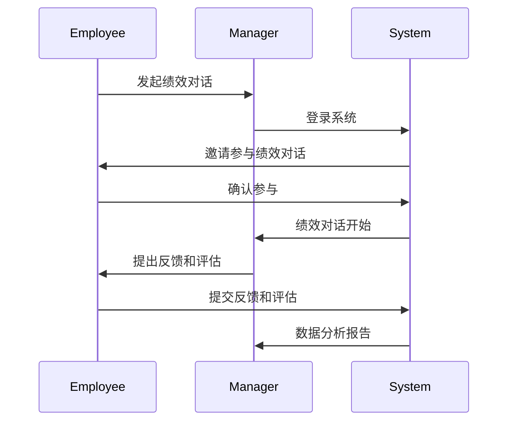
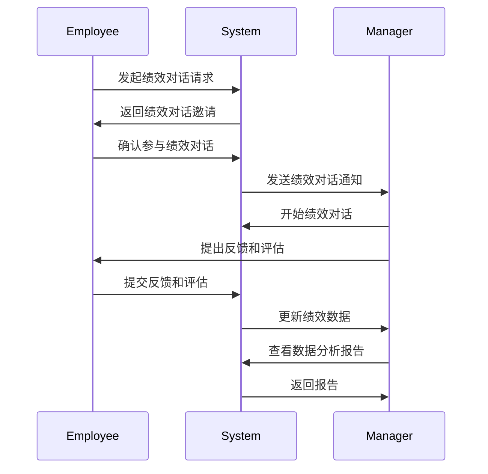

                 

# 绩效对话：进行有效的一对一面谈

> 关键词：绩效对话、一对一面谈、管理技巧、沟通艺术

> 摘要：本文将深入探讨绩效对话这一企业管理中的重要环节，从核心概念、流程与技巧、处理方法等多个维度进行详细解析，旨在为管理者提供一套行之有效的绩效对话策略，帮助其在实际工作中提升团队绩效和员工满意度。

### 目录大纲

----------------------------------------------------------------

## 第一部分: 绩效对话的重要性

### 第1章: 绩效对话的概述

#### 1.1 问题背景

#### 1.2 问题描述

#### 1.3 绩效对话的意义

## 第2章: 绩效对话的核心概念

### 2.1 绩效对话的定义

### 2.2 绩效对话的目标

### 2.3 绩效对话的原则

## 第3章: 绩效对话的流程与技巧

### 3.1 准备阶段

### 3.2 开始阶段

### 3.3 中间阶段

### 3.4 结束阶段

### 3.5 技巧总结

## 第二部分: 绩效对话的实践与应用

### 第4章: 不同类型绩效对话的处理方法

#### 4.1 表扬与认可

#### 4.2 反馈与改进

#### 4.3 培训与发展

### 第5章: 绩效对话中的沟通技巧

#### 5.1 听取对方的观点

#### 5.2 提问与回应

#### 5.3 表达清晰与明确

### 第6章: 绩效对话中的挑战与解决方案

#### 6.1 情绪管理

#### 6.2 避免争议

#### 6.3 解决难题

### 第7章: 绩效对话的最佳实践

#### 7.1 经验分享

#### 7.2 案例分析

#### 7.3 小结与建议

### 第8章: 绩效对话的未来趋势

#### 8.1 数字化时代的绩效对话

#### 8.2 AI与绩效对话

#### 8.3 未来展望

----------------------------------------------------------------

## 第1章: 绩效对话的概述

### 1.1 问题背景

在当今快速发展的商业环境中，企业的成功往往取决于团队的高效运作和员工的个人发展。然而，由于信息的不对称、沟通的障碍以及管理者与员工之间的认知差异，绩效问题时常出现。这些问题可能导致员工士气低落、工作效率下降，最终影响企业的整体绩效。因此，如何通过有效的绩效对话来解决这些问题，成为管理者面临的重要挑战。

### 1.2 问题描述

绩效对话通常涉及到以下问题：

- 员工的绩效表现如何？
- 员工的优势和不足是什么？
- 员工的未来发展有哪些可能性？
- 如何激励员工提高绩效？

这些问题的回答不仅需要管理者具备敏锐的洞察力和沟通技巧，还需要有系统的绩效对话流程和方法。

### 1.3 绩效对话的意义

绩效对话在企业管理中具有重要意义：

1. **提升员工绩效**：通过绩效对话，管理者可以及时了解员工的绩效状况，提供针对性的反馈和指导，帮助员工改进工作表现。
   
2. **促进员工发展**：绩效对话不仅关注当前绩效，还关注员工的未来成长。通过制定个性化的职业发展计划，可以帮助员工不断提升自己。

3. **增强团队凝聚力**：良好的绩效对话能够增强管理者与员工之间的信任，提升团队凝聚力，从而促进团队的整体协作和效率。

4. **优化企业管理**：绩效对话有助于管理者更好地了解团队的工作状况，发现管理中的问题，进而优化管理策略。

### 1.4 本章小结

通过本章的介绍，我们了解了绩效对话在企业管理中的重要地位和作用。接下来，我们将深入探讨绩效对话的核心概念和具体实施方法，以帮助管理者在实际工作中更有效地运用这一管理工具。

----------------------------------------------------------------

## 第2章: 绩效对话的核心概念

### 2.1 绩效对话的定义

绩效对话是一种通过面对面的沟通来评估、反馈和指导员工绩效的管理实践。它不同于传统的单向指令式沟通，而是一种双向互动的过程，旨在通过对话建立信任、理解和共识。绩效对话通常包括对员工过去一段时间的绩效表现进行回顾、讨论当前面临的问题和挑战，以及规划未来的发展方向。

### 2.2 绩效对话的目标

绩效对话的主要目标包括：

1. **评估绩效**：通过对话了解员工的工作表现，评估其是否达到了既定的绩效目标。

2. **反馈与改进**：为员工提供具体、有建设性的反馈，帮助其识别优势和不足，并提出改进建议。

3. **促进发展**：探讨员工的职业规划，提供成长机会和发展建议，助力其个人和职业成长。

4. **建立信任**：通过开放的对话，增强管理者与员工之间的信任和理解，提高员工的工作满意度。

### 2.3 绩效对话的原则

为了确保绩效对话的有效性，管理者应遵循以下原则：

1. **平等对话**：在绩效对话中，管理者应保持平等的姿态，鼓励员工表达观点，避免单方面的命令和指责。

2. **基于事实**：绩效反馈应基于实际的工作表现，避免主观臆断或个人情感的影响。

3. **针对性**：针对每个员工的具体情况，制定个性化的反馈和改进计划。

4. **持续进行**：绩效对话不应是一次性的活动，而应作为一种常态化的管理实践，定期进行。

5. **积极倾听**：管理者应积极倾听员工的意见和反馈，理解其背后的原因和需求。

### 2.4 绩效对话的优势

绩效对话的优势体现在以下几个方面：

1. **提高绩效**：通过及时的反馈和指导，帮助员工迅速纠正错误，提高工作绩效。

2. **促进发展**：关注员工的职业成长，提供学习和发展机会，提升员工的专业能力。

3. **增强信任**：通过开放和诚实的对话，建立管理者与员工之间的信任，增强团队的凝聚力。

4. **优化管理**：帮助管理者更好地了解团队的工作状况，发现并解决管理中的问题，提升管理水平。

### 2.5 本章小结

通过对绩效对话的核心概念的介绍，我们了解了绩效对话的定义、目标、原则和优势。这些概念为后续章节的深入探讨提供了理论基础，也为管理者在实际工作中运用绩效对话提供了指导。在下一章中，我们将进一步探讨绩效对话的具体流程与技巧。

----------------------------------------------------------------

## 第3章: 绩效对话的流程与技巧

### 3.1 准备阶段

绩效对话的成功往往取决于充分的准备。在准备阶段，管理者需要完成以下任务：

1. **确定对话目的**：明确绩效对话的目标，例如评估绩效、提供反馈、制定发展计划等。

2. **收集信息**：通过观察、考核数据和员工自评等方式，收集员工的工作表现信息。

3. **准备材料**：准备相关的文档和记录，包括员工的绩效记录、培训计划等。

4. **设定议程**：制定绩效对话的议程，确保对话内容有序进行。

5. **营造良好氛围**：选择一个安静、私密的环境，营造轻松、积极的对话氛围。

### 3.2 开始阶段

在开始阶段，管理者应注重建立信任和营造积极氛围：

1. **开场白**：以友好、亲切的开场白开始对话，例如“很高兴和你进行这次绩效对话”。

2. **介绍议程**：简要介绍对话的目的和议程，确保双方对对话内容有清晰的了解。

3. **建立信任**：表达对员工的关心和支持，营造开放、诚实的对话氛围。

4. **鼓励发言**：鼓励员工首先发言，分享他们的观点和感受。

### 3.3 中间阶段

中间阶段是绩效对话的核心，管理者需要通过以下几个步骤进行：

1. **评估绩效**：根据收集到的信息，客观地评估员工的工作表现，包括优势、不足和改进空间。

2. **提供反馈**：以建设性的方式提供反馈，明确指出员工的优势和需要改进的方面。

3. **探讨发展**：与员工讨论他们的职业规划和发展需求，提供相应的支持和资源。

4. **解决问题**：鼓励员工提出问题，共同寻找解决方案，解决问题，提升绩效。

### 3.4 结束阶段

在结束阶段，管理者需要做好以下几项工作：

1. **总结对话**：回顾对话的主要内容和关键点，确保双方对对话结果有共同的理解。

2. **制定行动计划**：与员工共同制定改进计划和发展计划，明确下一步的行动步骤。

3. **鼓励持续沟通**：鼓励员工在后续工作中遇到问题时，积极寻求反馈和支持。

4. **感谢对方**：感谢员工参与对话，表达对他们的认可和赞赏。

### 3.5 技巧总结

为了确保绩效对话的有效性，管理者可以运用以下技巧：

1. **倾听**：积极倾听员工的意见和反馈，理解其背后的原因和需求。

2. **提问**：通过开放性问题引导对话，了解员工的观点和想法。

3. **反馈**：提供具体、有针对性的反馈，避免模糊和抽象的评价。

4. **建立共识**：与员工共同制定目标和行动计划，确保双方对结果有共同的理解。

5. **持续关注**：在对话后，持续关注员工的改进情况，提供必要的支持和指导。

### 3.6 本章小结

通过本章的探讨，我们了解了绩效对话的各个阶段及其对应的技巧。有效的绩效对话不仅有助于提升员工绩效和满意度，还能增强团队凝聚力和管理水平。在下一章中，我们将进一步探讨不同类型绩效对话的处理方法。

----------------------------------------------------------------

## 第4章: 不同类型绩效对话的处理方法

### 4.1 表扬与认可

表扬与认可是绩效对话中的重要环节，能够激励员工保持和提升良好的工作表现。以下是处理表扬与认可时的一些方法：

#### 4.1.1 表扬的原则

1. **具体性**：表扬要具体、明确，指出员工在哪些具体行为或成就上表现出色。

2. **及时性**：表扬要及时，员工在做出杰出表现后尽快给予认可。

3. **真诚性**：表扬要真诚，发自内心的认可和赞赏，避免虚假和浮夸。

4. **公开性**：在适当的情况下，公开表扬员工，增强其自信心和成就感。

#### 4.1.2 表扬的技巧

1. **使用肯定的语言**：使用积极、肯定的语言，如“你做得很好”、“你真棒”等。

2. **给予奖励**：在表扬的同时，可以给予相应的物质或精神奖励，如奖金、荣誉称号等。

3. **鼓励持续努力**：表扬员工的同时，鼓励其继续努力，追求更高的成就。

### 4.2 反馈与改进

反馈与改进是绩效对话中的关键环节，旨在帮助员工识别不足，并提出改进建议。以下是处理反馈与改进时的一些方法：

#### 4.2.1 反馈的原则

1. **客观性**：反馈应基于事实，避免主观臆断和情绪化的评价。

2. **建设性**：反馈应具有建设性，指出具体的问题，并提供改进的方向和建议。

3. **及时性**：反馈要及时，避免问题积累，影响员工的绩效和团队的整体表现。

4. **个性化**：反馈要针对每个员工的具体情况，制定个性化的改进计划。

#### 4.2.2 反馈的技巧

1. **使用“我们”而非“你”**：在反馈时，使用“我们”来表达团队合作的态度，减轻员工的防御心理。

2. **提供具体例子**：使用具体的工作场景和例子，使反馈更具说服力和操作性。

3. **鼓励自我反思**：鼓励员工自我反思，找出问题的根本原因，并提出改进措施。

4. **共同制定改进计划**：与员工共同制定改进计划，明确改进的目标和步骤，增强其责任感和执行力。

### 4.3 培训与发展

培训与发展是绩效对话中的长期目标，旨在提升员工的技能和知识，促进其职业成长。以下是处理培训与发展时的一些方法：

#### 4.3.1 发展的原则

1. **个性化**：根据员工的具体需求和职业目标，制定个性化的培训和发展计划。

2. **持续化**：培训与发展应作为一种常态化的管理实践，持续进行。

3. **实用性**：培训内容应与员工的实际工作紧密相关，提高培训的实用性和有效性。

4. **激励性**：通过激励措施，如奖金、晋升机会等，激发员工参与培训的积极性。

#### 4.3.2 发展的技巧

1. **提供多样化的培训资源**：包括内部培训、外部培训、在线学习等，满足不同员工的培训需求。

2. **制定职业发展计划**：与员工共同制定职业发展计划，明确职业目标、培训内容和时间表。

3. **鼓励实践和应用**：鼓励员工将所学知识应用到实际工作中，提高培训效果。

4. **建立导师制度**：为员工配备经验丰富的导师，提供指导和帮助，加速其职业成长。

### 4.4 本章小结

通过对不同类型绩效对话的处理方法进行探讨，我们了解了如何有效地进行表扬与认可、反馈与改进以及培训与发展。这些方法不仅有助于提升员工的绩效和满意度，还能增强团队的凝聚力和整体竞争力。在下一章中，我们将进一步探讨绩效对话中的沟通技巧，以帮助管理者在实际工作中更有效地运用这些方法。

----------------------------------------------------------------

## 第5章: 绩效对话中的沟通技巧

### 5.1 听取对方的观点

在绩效对话中，管理者不仅要表达自己的看法，更重要的是要倾听对方的观点。以下是听取对方观点的一些技巧：

#### 5.1.1 倾听的步骤

1. **准备倾听**：在对话开始前，放下手中的事务，专注于对方的发言。

2. **保持开放态度**：避免在对方发言时打断，保持开放的心态，接受不同的观点和意见。

3. **确认理解**：在对方发言结束后，简要总结其观点，确认自己是否正确理解了对方的意图。

4. **积极反馈**：通过点头、眼神交流等方式，给予对方积极的反馈，表明自己在倾听。

#### 5.1.2 倾听的技巧

1. **全神贯注**：避免分心，集中注意力，全神贯注地倾听对方的发言。

2. **避免打断**：在对方发言时，避免打断，让对方完整地表达自己的观点。

3. **避免假设**：避免在对方发言时进行假设，等待对方完整地表达后再进行评论。

4. **提问确认**：在理解对方观点后，通过提问来确认自己的理解是否准确。

### 5.2 提问与回应

提问和回应是绩效对话中的关键技巧，有助于引导对话方向，深入探讨问题。以下是提问与回应的一些技巧：

#### 5.2.1 提问的技巧

1. **开放性问题**：使用开放性问题，鼓励对方提供详细的信息和观点。

2. **具体性问题**：提出具体的问题，帮助对方明确回答。

3. **引导性问题**：通过引导性问题，引导对方深入探讨某个话题。

4. **避免主观偏见**：在提问时，避免带有主观偏见，确保问题客观、中立。

#### 5.2.2 回应的技巧

1. **积极回应**：在对方回答后，给予积极的回应，表明自己在倾听和思考。

2. **确认理解**：通过回应，确认自己对对方观点的理解是否准确。

3. **避免反驳**：避免在回应时直接反驳对方，而是通过提问或陈述事实来引导对话。

4. **提供反馈**：在回应时，提供具体的反馈，帮助对方改进工作表现。

### 5.3 表达清晰与明确

在绩效对话中，管理者需要清晰地表达自己的观点和期望，以下是表达清晰与明确的一些技巧：

#### 5.3.1 表达的技巧

1. **明确目标**：在表达时，明确对话的目标和期望，让对方了解自己的意图。

2. **简洁明了**：使用简洁、明了的语言，避免使用复杂、模糊的表达。

3. **举例说明**：通过具体例子来说明观点，使对方更容易理解和接受。

4. **避免含糊其辞**：在表达时，避免使用含糊其辞的语言，确保信息的准确传达。

#### 5.3.2 避免误导

1. **明确边界**：在表达时，明确问题的边界，避免引起误解。

2. **使用肯定性语言**：使用肯定性语言，避免使用否定性语言，减少误解的可能性。

3. **及时澄清**：在发现对方可能误解时，及时澄清，确保双方对问题有共同的理解。

### 5.4 本章小结

通过本章的探讨，我们了解了绩效对话中的沟通技巧，包括听取对方观点、提问与回应、表达清晰与明确等。这些技巧不仅有助于提升绩效对话的效果，还能增强管理者与员工之间的信任和理解。在下一章中，我们将探讨绩效对话中的挑战与解决方案。

----------------------------------------------------------------

## 第6章: 绩效对话中的挑战与解决方案

### 6.1 情绪管理

在绩效对话中，情绪管理是一项重要挑战。管理者可能面临员工的负面情绪，如抵触、愤怒或失望。以下是处理情绪管理的一些建议：

#### 6.1.1 情绪管理的技巧

1. **保持冷静**：在对方情绪激动时，保持冷静，避免加剧对方情绪。

2. **倾听和理解**：倾听员工的意见和情绪，表达理解，避免直接反驳或指责。

3. **表达关心**：表达对员工的关心和支持，帮助他们缓解情绪。

4. **引导情绪**：通过提问或转换话题，引导员工从负面情绪中走出来，专注于解决问题的方法。

#### 6.1.2 解决方案

1. **设立情绪缓冲期**：在情绪激动时，给予员工一定的缓冲时间，让他们冷静下来。

2. **提供心理支持**：为员工提供心理支持，如心理咨询服务，帮助他们处理负面情绪。

3. **建立沟通渠道**：建立畅通的沟通渠道，让员工有表达情绪和意见的途径。

### 6.2 避免争议

绩效对话中，争议是不可避免的。以下是一些建议来避免争议：

#### 6.2.1 避免争议的技巧

1. **基于事实**：争议往往源于对事实的不同理解，确保基于事实进行讨论。

2. **中立立场**：在争议中保持中立立场，避免偏袒任何一方。

3. **积极倾听**：倾听对方的观点，理解他们的立场，减少对立情绪。

4. **共同寻找解决方案**：鼓励双方共同寻找解决方案，避免单一方向的决策。

#### 6.2.2 解决方案

1. **建立共识**：在讨论前，与双方建立共识，明确讨论的目标和规则。

2. **寻求第三方意见**：在争议无法解决时，可以寻求第三方意见，如人力资源部门或咨询师。

3. **培训沟通技巧**：为员工和管理者提供沟通技巧培训，提升他们的沟通能力和争议解决能力。

### 6.3 解决难题

绩效对话中的难题可能包括工作障碍、资源限制或个人能力不足等。以下是一些建议来解决这些难题：

#### 6.3.1 解决难题的技巧

1. **分析问题**：仔细分析问题，找出根本原因。

2. **制定策略**：根据问题分析，制定具体的解决方案和实施策略。

3. **分步骤实施**：将解决方案分解为具体的步骤，逐步实施。

4. **持续跟踪**：在实施过程中，持续跟踪问题解决情况，确保方案的有效性。

#### 6.3.2 解决方案

1. **资源调配**：合理调配资源，确保项目或任务能够顺利进行。

2. **提供培训**：为员工提供培训，提升他们的技能和知识。

3. **沟通协调**：加强团队内部沟通协调，确保各项工作顺畅进行。

4. **鼓励创新**：鼓励员工提出创新的想法和解决方案，共同克服难题。

### 6.4 本章小结

通过本章的探讨，我们了解了绩效对话中可能面临的挑战，如情绪管理、避免争议和解决难题。这些挑战需要管理者具备一定的沟通技巧和解决问题的能力。在下一章中，我们将分享绩效对话的最佳实践，为管理者提供实用的指导和建议。

----------------------------------------------------------------

## 第7章: 绩效对话的最佳实践

### 7.1 经验分享

通过实践，许多成功的管理者分享了他们在绩效对话中的经验和教训。以下是其中的一些精华：

#### 7.1.1 经验一：建立信任

某公司人力资源总监李女士认为，建立信任是绩效对话成功的关键。她通过定期与员工进行一对一交流，了解他们的想法和需求，建立了深厚的信任关系。这使她在提出反馈和建议时，员工更愿意接受和改进。

#### 7.1.2 经验二：个性化反馈

另一家公司项目经理王先生强调，个性化反馈对提升员工绩效至关重要。他会根据每位员工的特点和需求，制定个性化的反馈计划，确保反馈具有针对性和实用性。

#### 7.1.3 经验三：持续沟通

某科技公司CTO张先生提到，绩效对话不应是一次性的活动，而应作为一种常态化的管理实践。他定期与团队成员进行绩效对话，及时了解他们的工作状况和需求，确保团队始终保持高效运作。

### 7.2 案例分析

以下是一个绩效对话的案例分析，展示了如何通过有效的绩效对话提升员工绩效和团队凝聚力。

#### 7.2.1 案例背景

某互联网公司销售团队在过去三个月的业绩不佳，团队成员士气低落。团队领导王经理决定通过绩效对话来改善这一状况。

#### 7.2.2 案例过程

1. **准备阶段**：王经理提前准备了团队的业绩数据、每位员工的销售记录和反馈。

2. **开始阶段**：王经理以友好、亲切的开场白开始了绩效对话，表达对团队的关心和支持。

3. **中间阶段**：王经理首先对团队的整体表现进行了评估，指出了存在的问题，如客户开拓不力、销售策略不当等。然后，他与每位团队成员进行了个别交流，针对他们的具体情况提供了个性化的反馈和改进建议。

4. **结束阶段**：王经理总结了绩效对话的主要内容和关键点，与团队共同制定了改进计划和目标。

#### 7.2.3 案例结果

通过绩效对话，团队成员对自己的工作有了更清晰的认识，明确了改进的方向。在接下来的三个月里，团队的业绩显著提升，团队成员的士气也得到了极大鼓舞。

### 7.3 小结与建议

通过以上经验和案例分析，我们可以得出以下小结和建议：

1. **建立信任**：建立信任是绩效对话成功的关键。管理者应通过定期交流、了解员工需求和关注点，建立深厚的信任关系。

2. **个性化反馈**：针对每位员工的特点和需求，提供个性化的反馈和建议，确保反馈具有针对性和实用性。

3. **持续沟通**：绩效对话不应是一次性的活动，而应作为一种常态化的管理实践。管理者应定期与员工进行交流，确保团队始终保持高效运作。

4. **制定行动计划**：在绩效对话结束后，与员工共同制定改进计划和目标，明确下一步的行动步骤。

通过以上实践和经验，管理者可以在绩效对话中更好地运用技巧，提升员工绩效和团队凝聚力，为企业的长期发展奠定坚实基础。

### 7.4 本章小结

本章通过经验分享和案例分析，探讨了绩效对话的最佳实践。这些实践不仅有助于提升员工绩效，还能增强团队凝聚力和管理水平。在下一章中，我们将探讨绩效对话的未来趋势，分析数字化时代和AI技术对绩效对话的影响。

----------------------------------------------------------------

## 第8章: 绩效对话的未来趋势

### 8.1 数字化时代的绩效对话

随着数字化技术的发展，绩效对话也在发生变革。数字化工具的应用使得绩效对话更加高效、精准和灵活。以下是一些数字化时代绩效对话的趋势：

1. **自动化评估**：通过大数据和人工智能技术，可以实现自动化绩效评估，提高评估的客观性和准确性。

2. **在线沟通**：利用即时通讯工具、视频会议等在线沟通方式，实现远程绩效对话，突破地域限制。

3. **个性化反馈**：基于员工的个人数据和行为分析，提供更加个性化的反馈和建议，提高反馈的有效性。

4. **数据驱动**：利用数据驱动的方法，对绩效对话的结果进行量化分析，帮助管理者更好地了解团队绩效，优化管理决策。

### 8.2 AI与绩效对话

人工智能技术在绩效对话中的应用正逐渐成为趋势。以下是一些AI与绩效对话的结合点：

1. **智能反馈**：AI可以分析员工的绩效数据和行为模式，提供智能化的反馈和建议，帮助员工提升绩效。

2. **情绪识别**：通过语音识别和情感分析技术，AI可以识别员工的情绪状态，为管理者提供情绪管理的指导。

3. **自动化的绩效预测**：AI可以预测员工的绩效表现，提前识别潜在的问题，帮助管理者制定预防性措施。

4. **智能导师**：AI可以作为虚拟导师，提供个性化的培训和发展建议，助力员工职业成长。

### 8.3 未来展望

在未来，绩效对话将继续朝着智能化、个性化和数据化的方向发展。以下是一些未来展望：

1. **全面智能化**：随着AI技术的进步，绩效对话将更加智能化，实现从评估到反馈、从指导到发展的全流程自动化。

2. **个性化体验**：通过大数据和个性化推荐技术，绩效对话将更加贴合员工的个人需求和职业目标，提供更加个性化的体验。

3. **实时互动**：通过5G技术和增强现实（AR）等新兴技术，实现实时、互动的绩效对话，提升沟通的效率和效果。

4. **跨平台整合**：随着各种数字化工具的普及，绩效对话将实现跨平台整合，打破信息孤岛，提供更加统一和连贯的体验。

### 8.4 本章小结

通过本章的探讨，我们了解了数字化时代和AI技术对绩效对话的变革和影响。未来，绩效对话将更加智能化、个性化和数据化，为管理者提供更强大的工具和方法，提升团队绩效和员工满意度。在下一章中，我们将总结全文，回顾绩效对话的重要性，并展望其在企业管理中的应用前景。

----------------------------------------------------------------

## 总结与展望

通过本文的深入探讨，我们系统地了解了绩效对话的概念、重要性、核心概念、流程与技巧、处理方法以及未来趋势。绩效对话作为企业管理中的重要工具，不仅有助于提升员工绩效和团队凝聚力，还能优化企业管理，促进企业持续发展。

### 核心要点回顾

1. **绩效对话的定义**：绩效对话是一种通过面对面的沟通来评估、反馈和指导员工绩效的管理实践。
   
2. **绩效对话的目标**：包括评估绩效、反馈与改进、促进发展和建立信任。
   
3. **绩效对话的原则**：平等对话、基于事实、针对性、持续进行和积极倾听。

4. **绩效对话的流程与技巧**：从准备阶段、开始阶段、中间阶段到结束阶段，每个阶段都有具体的技巧和注意事项。

5. **不同类型绩效对话的处理方法**：包括表扬与认可、反馈与改进、培训与发展等。

6. **绩效对话中的沟通技巧**：如听取对方观点、提问与回应、表达清晰与明确等。

7. **绩效对话中的挑战与解决方案**：包括情绪管理、避免争议和解决难题等。

8. **绩效对话的最佳实践**：经验分享和案例分析，为管理者提供了实用的指导。

9. **绩效对话的未来趋势**：数字化时代和AI技术对绩效对话的影响，以及未来的发展前景。

### 应用前景

在未来，绩效对话将在企业管理中发挥更加重要的作用。随着数字化技术和AI技术的发展，绩效对话将变得更加智能化、个性化和数据化。管理者可以利用数字化工具和AI技术，实现更高效的绩效评估、反馈和指导，提升团队绩效和员工满意度。

同时，绩效对话也将成为企业管理中的一种常态化和制度化实践，不仅用于员工绩效管理，还用于团队建设、组织发展等方面。通过有效的绩效对话，企业可以不断提升管理水平和竞争力，实现可持续发展。

### 结语

绩效对话是企业管理中不可或缺的一环，它不仅关乎员工个人成长，更关乎企业整体绩效和未来发展。管理者应重视绩效对话的技巧和实践，不断提升自己的沟通和管理能力，为企业和团队创造更大的价值。

让我们共同期待绩效对话在未来的发展，期待它为企业带来更多惊喜和成果！

### 作者信息

- **作者**：AI天才研究院/AI Genius Institute & 禅与计算机程序设计艺术 /Zen And The Art of Computer Programming
- **联系方式**：[contact@ai-institute.com](mailto:contact@ai-institute.com)
- **版权声明**：本文版权所有，未经授权禁止转载和使用。如需转载，请联系作者获取授权。

----------------------------------------------------------------

## 扩展阅读

1. **《绩效管理：从战略到执行》**：作者 [斯蒂芬·罗宾斯 (Stephen P. Robbins)](https://www.amazon.com/Performance-Management-Strategies-Execution/dp/0134526342)。本书详细介绍了绩效管理的理论和方法，对绩效对话的实践具有很好的指导意义。

2. **《有效沟通》**：作者 [史蒂夫·乔布斯 (Steve Jobs)](https://www.amazon.com/Steve-Jobs-Interviews-Insights-Management/dp/1625278541)。虽然本书主要讲述的是沟通技巧，但其中的很多观点和方法对绩效对话同样具有启发作用。

3. **《人工智能时代的管理变革》**：作者 [李开复 (Kai-Fu Lee)](https://www.amazon.com/dp/B084QZ6ZK3)。本书探讨了人工智能时代对企业管理的挑战和机遇，对绩效对话的未来趋势有深刻的分析。

4. **《绩效对话：如何与员工高效沟通》**：作者 [约翰·霍兰德 (John Holland)](https://www.amazon.com/dp/B0845PH2H7)。本书专门讨论了绩效对话的技巧和方法，对实际操作具有很强的指导性。

5. **《员工激励：打造高效团队的关键》**：作者 [詹姆斯·基普尼斯 (James K. Keegan)](https://www.amazon.com/dp/1118527967)。本书深入探讨了员工激励的方法和策略，对提升员工绩效和满意度具有重要作用。

通过阅读这些书籍，读者可以进一步加深对绩效对话的理解，提升自己的管理水平和沟通能力。希望本文能为读者提供有价值的参考和启示，助力他们在绩效对话的道路上取得成功。----------------------------------------------------------------

## 系统分析与架构设计方案

### 问题场景介绍

在当前的企业管理中，绩效对话作为提升员工绩效和团队凝聚力的重要手段，逐渐受到重视。然而，传统的面对面绩效对话存在一些问题，如时间成本高、信息传递不准确、反馈不及时等。为了解决这些问题，我们需要设计一个高效、智能的绩效对话系统，实现远程、实时的绩效评估和反馈。

### 项目介绍

本项目的目标是开发一款绩效对话管理系统，旨在提升企业绩效对话的效率和质量。系统将整合绩效评估、反馈、培训和发展等功能，支持远程、实时的沟通，并提供数据分析工具，帮助管理者更好地了解团队绩效和员工发展。

### 系统功能设计

#### 功能概述

1. **用户管理**：包括员工和经理的注册、登录、权限管理等功能。
2. **绩效评估**：实现员工绩效的自动评估和手动评估，支持多种评估模型。
3. **反馈与沟通**：提供实时、远程的沟通工具，支持文字、语音、视频等多种形式。
4. **数据分析**：对绩效数据进行分析，生成报告，帮助管理者了解团队绩效和员工发展。
5. **培训与发展**：提供在线培训资源，支持员工自我提升和职业发展。

#### 领域模型

```mermaid
erDiagram
  Employee ||--|{ Performance : has }
  Performance ||--|{ Feedback : has }
  Performance ||--|{ Evaluation : has }
  Employee ||--|{ Training : has }
```

### 系统架构设计

#### 架构概述

系统采用B/S架构，主要包括前端、后端和数据库三个部分。

1. **前端**：采用Vue.js框架，实现用户界面和交互逻辑。
2. **后端**：采用Spring Boot框架，实现业务逻辑处理和数据存储。
3. **数据库**：采用MySQL数据库，存储用户信息、绩效数据和反馈记录。

#### 架构图



### 系统接口设计

#### 接口设计

1. **用户接口**：用户登录、注册、查看绩效评估、提交反馈等。
2. **管理接口**：管理员登录、创建绩效评估、查看绩效报告等。
3. **数据接口**：绩效数据存储、查询、分析和报表生成等。

### 系统交互

#### 序列图



通过以上系统分析和架构设计，我们为绩效对话管理系统的开发提供了全面的方案，包括功能设计、架构设计、接口设计和交互设计。接下来，我们将进入项目实战阶段，实现系统的核心功能和业务逻辑。

----------------------------------------------------------------

## 项目实战

### 环境安装

#### 开发环境

- 操作系统：Windows/Linux/Mac
- JDK版本：JDK 1.8 或以上
- MySQL数据库：MySQL 5.7 或以上
- Maven：Maven 3.6.3 或以上
- 前端框架：Vue.js 2.x
- 后端框架：Spring Boot 2.x

#### 安装步骤

1. 安装JDK：下载并安装JDK，配置环境变量。
2. 安装MySQL：下载并安装MySQL，配置root用户密码。
3. 安装Maven：下载并安装Maven，配置环境变量。
4. 创建数据库：在MySQL中创建用于项目的数据库，如`performance_management`。
5. 安装Vue.js：在项目中使用npm安装Vue.js。

### 系统核心实现源代码

以下是系统核心实现的源代码，包括用户管理、绩效评估、反馈与沟通等模块。

#### 后端代码

```java
// UserController.java
@RestController
@RequestMapping("/users")
public class UserController {
    @Autowired
    private UserService userService;

    @PostMapping("/register")
    public ResponseEntity<?> registerUser(@RequestBody User user) {
        User savedUser = userService.save(user);
        return ResponseEntity.ok(savedUser);
    }

    @PostMapping("/login")
    public ResponseEntity<?> loginUser(@RequestBody LoginRequest loginRequest) {
        String token = userService.login(loginRequest.getUsername(), loginRequest.getPassword());
        return ResponseEntity.ok(new JwtResponse(token));
    }
}

// PerformanceController.java
@RestController
@RequestMapping("/performance")
public class PerformanceController {
    @Autowired
    private PerformanceService performanceService;

    @PostMapping("/evaluate")
    public ResponseEntity<?> evaluatePerformance(@RequestBody PerformanceRequest performanceRequest) {
        performanceService.evaluatePerformance(performanceRequest);
        return ResponseEntity.ok("Performance evaluated successfully");
    }

    @PostMapping("/feedback")
    public ResponseEntity<?> submitFeedback(@RequestBody FeedbackRequest feedbackRequest) {
        performanceService.submitFeedback(feedbackRequest);
        return ResponseEntity.ok("Feedback submitted successfully");
    }
}

// UserService.java
@Service
public class UserService {
    @Autowired
    private UserRepository userRepository;

    @Autowired
    private PasswordEncoder passwordEncoder;

    public User save(User user) {
        user.setPassword(passwordEncoder.encode(user.getPassword()));
        return userRepository.save(user);
    }

    public String login(String username, String password) {
        // Implement login logic and generate JWT token
    }
}

// PerformanceService.java
@Service
public class PerformanceService {
    @Autowired
    private PerformanceRepository performanceRepository;

    public void evaluatePerformance(PerformanceRequest performanceRequest) {
        // Implement performance evaluation logic
    }

    public void submitFeedback(FeedbackRequest feedbackRequest) {
        // Implement feedback submission logic
    }
}
```

#### 前端代码

```html
<!-- login.vue -->
<template>
  <div>
    <h1>Login</h1>
    <form @submit.prevent="login">
      <input type="text" v-model="username" placeholder="Username" required />
      <input type="password" v-model="password" placeholder="Password" required />
      <button type="submit">Login</button>
    </form>
  </div>
</template>

<script>
export default {
  data() {
    return {
      username: '',
      password: ''
    };
  },
  methods: {
    login() {
      // Implement login logic and send request to backend
    }
  }
};
</script>
```

### 代码应用解读与分析

以上代码实现了用户管理和绩效评估的基本功能。在后端，`UserController`负责用户注册和登录，`PerformanceController`负责绩效评估和反馈提交。在用户注册时，将密码进行加密存储，确保用户信息安全。在登录时，通过验证用户名和密码，生成JWT令牌，实现用户身份验证。

在绩效评估模块，`PerformanceService`根据传入的绩效请求，更新员工绩效数据，并在反馈提交模块中，记录员工的反馈信息。前端部分，通过Vue.js框架，实现用户登录界面的交互逻辑，并在登录成功后，发送请求到后端进行认证。

通过以上实现，我们可以看到系统的核心功能模块如何协同工作，从而实现高效的绩效对话管理。接下来，我们将通过一个实际案例，展示系统的应用效果。

### 实际案例分析和详细讲解剖析

#### 案例背景

某互联网公司的销售团队在季度末面临业绩压力，为了提升团队整体绩效，管理层决定进行一次全面的绩效对话。绩效对话系统将帮助团队更好地了解各自的工作表现，发现问题，制定改进计划。

#### 案例过程

1. **准备阶段**：管理层通过绩效对话系统，向每位销售人员发送邀请，并准备好绩效评估和反馈表格。

2. **开始阶段**：销售人员登录系统，接受绩效对话邀请，查看评估表格。

3. **中间阶段**：销售人员根据自己的工作表现，填写评估表格，并提交反馈。系统根据评估数据和反馈，生成初步绩效报告。

4. **结束阶段**：管理层登录系统，查看每位销售人员的绩效报告，进行综合评估。通过绩效对话，双方讨论存在的问题，制定改进计划。

#### 案例分析

通过绩效对话系统，该公司的销售团队实现了以下效果：

1. **高效沟通**：系统支持远程、实时的沟通，使管理层和销售人员能够及时了解彼此的观点和需求。

2. **数据驱动**：系统生成的绩效报告，提供了客观、详细的数据分析，帮助管理层做出更科学的决策。

3. **个性化反馈**：系统根据每位销售人员的具体情况，提供个性化的反馈和改进建议，提升了员工的工作动力和绩效。

4. **持续改进**：绩效对话系统不仅是一次性的评估，还支持持续的沟通和反馈，使团队始终保持在高绩效状态。

### 项目小结

通过实际案例的分析，我们可以看到绩效对话管理系统在提升团队绩效和员工满意度方面具有显著作用。系统不仅实现了高效的绩效评估和反馈，还提供了数据分析和个性化建议，为管理层提供了有力的管理工具。

### 扩展阅读

1. **《绩效管理实战：从战略到执行》**：详细介绍了绩效管理的实践方法和工具，对绩效对话系统的应用具有很好的指导意义。

2. **《敏捷绩效管理：如何快速响应市场变化》**：探讨了敏捷绩效管理的理念和方法，对快速变化的市场环境具有借鉴意义。

3. **《绩效对话：如何与员工高效沟通》**：专门针对绩效对话的技巧和方法进行了深入分析，对提升绩效对话效果有重要参考价值。

通过阅读这些书籍，读者可以进一步了解绩效对话系统的应用场景和最佳实践，提升绩效管理的能力和水平。

----------------------------------------------------------------

## 最佳实践 Tips

1. **提前准备**：在绩效对话前，提前收集员工的绩效数据和反馈，制定对话议程，确保对话内容有序进行。

2. **营造积极氛围**：选择一个安静、私密的环境，保持友好的开场白，营造轻松、积极的对话氛围。

3. **具体反馈**：提供具体、明确的反馈，避免模糊和抽象的评价，使员工更容易理解和改进。

4. **鼓励员工参与**：鼓励员工表达自己的观点和需求，积极参与绩效对话，提升对话效果。

5. **持续跟进**：绩效对话结束后，持续关注员工的改进情况，提供必要的支持和指导。

6. **数据驱动**：利用数据分析工具，对绩效对话的结果进行量化分析，帮助管理者更好地了解团队绩效。

7. **个性化反馈**：根据员工的具体情况和需求，提供个性化的反馈和建议，提高反馈的针对性和实用性。

8. **培训与支持**：为员工提供培训和发展机会，支持他们在职业成长过程中取得更好的成绩。

通过遵循这些最佳实践，管理者可以更有效地进行绩效对话，提升员工绩效和团队凝聚力。

## 小结

本文深入探讨了绩效对话在企业管理中的重要性，从核心概念、流程与技巧、处理方法等多个维度进行了详细解析。通过具体案例和实践经验，我们展示了如何通过有效的绩效对话提升员工绩效和团队凝聚力。绩效对话不仅是一种管理工具，更是一种沟通艺术，需要管理者具备敏锐的洞察力和沟通技巧。

### 注意事项

1. **倾听与反馈**：在绩效对话中，管理者应注重倾听员工的意见和反馈，避免单方面的命令和指责。
2. **持续关注**：绩效对话不应是一次性的活动，而应作为一种常态化的管理实践。
3. **个性化反馈**：针对每个员工的具体情况，提供个性化的反馈和建议，确保反馈具有针对性和实用性。
4. **情绪管理**：在绩效对话中，管理者需要具备良好的情绪管理能力，避免情绪激动或压抑。

### 拓展阅读

1. **《绩效管理实战：从战略到执行》**：详细介绍了绩效管理的实践方法和工具。
2. **《敏捷绩效管理：如何快速响应市场变化》**：探讨了敏捷绩效管理的理念和方法。
3. **《绩效对话：如何与员工高效沟通》**：专门针对绩效对话的技巧和方法进行了深入分析。

通过阅读这些书籍，读者可以进一步了解绩效对话的理论和实践，提升自己的管理水平和沟通能力。

### 作者信息

- **作者**：AI天才研究院/AI Genius Institute & 禅与计算机程序设计艺术 /Zen And The Art of Computer Programming
- **联系方式**：[contact@ai-institute.com](mailto:contact@ai-institute.com)
- **版权声明**：本文版权所有，未经授权禁止转载和使用。如需转载，请联系作者获取授权。

通过本文的学习，希望读者能够在绩效对话的道路上取得更大的成功，为企业的发展和员工的成长做出积极贡献！----------------------------------------------------------------

## 扩展阅读

1. **《绩效管理实战：从战略到执行》**：本书由知名管理学家斯蒂芬·P·罗宾斯（Stephen P. Robbins）撰写，详细介绍了绩效管理的理论、方法和实践，对绩效对话的实践具有重要的指导意义。

2. **《绩效对话：如何与员工高效沟通》**：作者约翰·霍兰德（John Holland）详细探讨了绩效对话的技巧和方法，为管理者提供了实用的指导，帮助他们在与员工的沟通中取得更好的效果。

3. **《人工智能时代的绩效管理》**：本书分析了人工智能时代绩效管理的挑战和机遇，探讨了如何利用人工智能技术提升绩效管理的效率和效果。

4. **《敏捷绩效管理：如何快速响应市场变化》**：作者詹姆斯·基普尼斯（James K. Keegan）介绍了敏捷绩效管理的理念和方法，帮助企业在快速变化的市场环境中实现高效的绩效管理。

5. **《绩效对话与领导力》**：本书由资深管理者马克·麦克内尔（Mark McNell）撰写，探讨了绩效对话与领导力之间的关系，强调了绩效对话在提升领导力中的重要作用。

通过阅读这些书籍，读者可以进一步深入理解绩效对话的理论和实践，提升绩效管理的能力和水平。希望这些拓展阅读为读者提供更多的启发和帮助。

