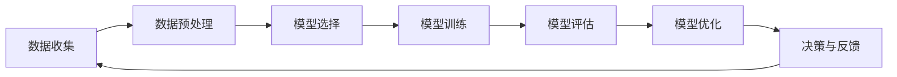
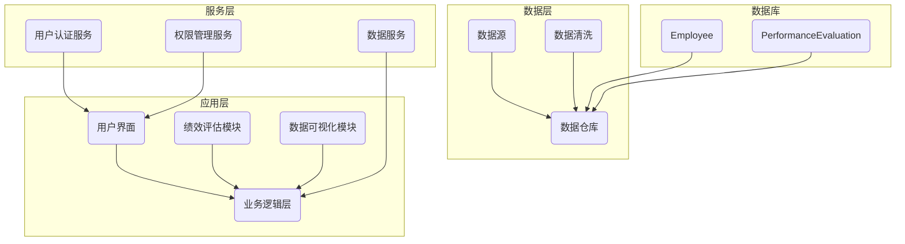
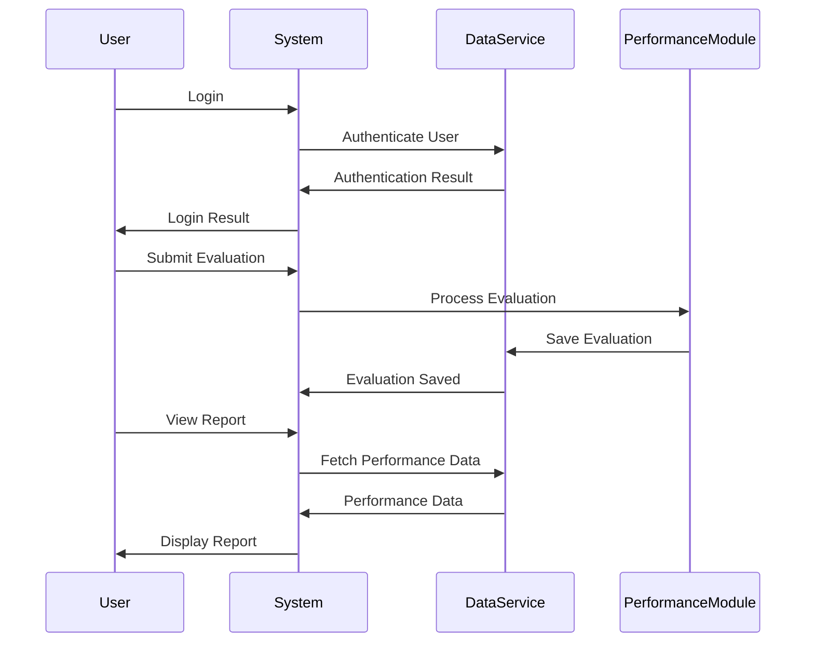

                 

# 绩效改进：持续优化的方法论

## 关键词：绩效改进、持续优化、方法论、流程、策略

> 摘要：本文将深入探讨绩效改进的概念、核心目标、关键步骤及其在组织中的重要性。通过详细的案例分析，本文旨在为IT领域从业者提供一套切实可行的绩效改进方法论，帮助其在实际工作中实现持续优化和卓越表现。

## 第一部分：引言

### 1.1 问题背景

#### 1.1.1 绩效问题的普遍性

在当今快速变化和竞争激烈的工作环境中，绩效问题已经成为影响组织发展和员工个人成长的主要障碍。无论是企业、政府机构还是非营利组织，绩效问题都会影响组织的目标实现和整体效能。

#### 1.1.2 绩效问题带来的负面影响

绩效问题可能导致员工士气低落、资源浪费、客户满意度下降，甚至影响组织的长期生存。因此，解决绩效问题已经成为现代管理的重要任务。

#### 1.1.3 解决绩效问题的必要性

为了在竞争激烈的市场中保持优势，组织必须不断改进绩效，提高生产力和效率。绩效改进不仅有助于提升个人和团队的表现，还能促进组织的整体发展。

### 1.2 问题描述

#### 1.2.1 绩效问题的定义

绩效问题可以定义为任何阻碍组织或个人实现预定目标的情况。这些问题可能包括目标不明确、资源分配不当、流程效率低下、沟通不畅等。

#### 1.2.2 绩效问题的表现形式

绩效问题可能表现为员工表现不佳、项目延误、质量下降、成本超支等。这些问题通常需要通过系统的方法来解决。

#### 1.2.3 绩效问题的解决途径

解决绩效问题通常需要采取一系列方法，包括绩效评估、目标设定、流程优化、员工培训等。这些方法需要结合组织的具体情况和需求进行。

### 1.3 问题解决

#### 1.3.1 绩效改进的定义

绩效改进是指通过系统的方法和策略，提高个人、团队和组织绩效的过程。它不仅关注短期的成果，更注重长期的持续改进。

#### 1.3.2 绩效改进的核心目标

绩效改进的核心目标是提高绩效、提升效率、增强团队协作和员工满意度。通过绩效改进，组织可以更好地实现其战略目标。

#### 1.3.3 绩效改进的关键步骤

绩效改进通常包括以下关键步骤：

1. **问题识别**：通过绩效评估和数据分析，识别组织或个人存在的绩效问题。
2. **目标设定**：设定明确的绩效改进目标和计划。
3. **策略制定**：制定具体的策略和行动方案。
4. **执行与监控**：执行改进措施，并持续监控和评估效果。
5. **调整与优化**：根据反馈和结果调整改进措施，实现持续优化。

### 1.4 边界与外延

#### 1.4.1 绩效改进的适用范围

绩效改进适用于各种组织和个人，无论是企业、政府机构、非营利组织还是个人职业发展。

#### 1.4.2 绩效改进的限制条件

绩效改进需要考虑组织的资源、时间、文化和员工能力等因素。

#### 1.4.3 绩效改进的影响因素

绩效改进的影响因素包括组织文化、员工参与度、管理支持、技术工具等。

### 1.5 概念结构与核心要素

#### 1.5.1 绩效改进的核心概念

绩效改进的核心概念包括绩效评估、目标设定、流程优化、员工培训、持续改进等。

#### 1.5.2 绩效改进的关键要素

绩效改进的关键要素包括数据收集、分析、策略制定、执行、监控和反馈等。

#### 1.5.3 绩效改进的整体框架

绩效改进的整体框架通常包括问题识别、目标设定、策略制定、执行与监控、调整与优化等步骤。

### 1.6 本章小结

本文介绍了绩效改进的背景、问题描述、解决途径、核心目标、关键步骤、边界与外延以及概念结构与核心要素。通过本文的探讨，读者可以更好地理解绩效改进的重要性及其在实践中的应用。

### 1.6.1 主要观点总结

1. 绩效问题在组织和个人发展中普遍存在，解决这些问题需要采取系统的方法。
2. 绩效改进是提高绩效、提升效率的重要途径，其核心目标是提高个人、团队和组织的整体表现。
3. 绩效改进的关键步骤包括问题识别、目标设定、策略制定、执行与监控、调整与优化等。
4. 绩效改进需要考虑组织的资源、时间、文化和员工能力等因素。
5. 绩效改进的影响因素包括组织文化、员工参与度、管理支持、技术工具等。

### 1.6.2 对绩效改进的理解

绩效改进是一个持续的过程，需要组织和个人共同努力。通过有效的绩效改进，组织可以更好地实现其战略目标，员工可以实现个人职业发展。

### 1.6.3 进一步阅读的建议

读者可以进一步阅读相关文献，如《绩效改进：持续优化的方法论》、《管理绩效：系统思考与实践》等，以深入了解绩效改进的理论和实践。

----------------------------------------------------------------

### 第二部分：核心概念与联系

#### 2.1 绩效改进的核心概念

绩效改进的核心概念包括绩效评估、目标设定、流程优化、员工培训、持续改进等。这些概念相互联系，共同构成了绩效改进的理论基础。

##### 2.1.1 绩效的概念

绩效是指个人、团队或组织在特定时间内完成的工作量、质量、效率等方面的表现。绩效评估是对绩效进行量化和评价的过程。

##### 2.1.2 绩效评估的方法

绩效评估的方法包括定性和定量两种。定性评估通常基于主观判断，如员工满意度调查；定量评估则基于客观数据，如工作效率指标。

##### 2.1.3 绩效改进的目标

绩效改进的目标是提高绩效、提升效率、增强团队协作和员工满意度。通过绩效改进，组织可以更好地实现其战略目标。

#### 2.2 概念属性特征对比表格

| 概念          | 定义                                                   | 特征                            |
| ------------- | ------------------------------------------------------ | ------------------------------ |
| 绩效评估      | 评估员工工作效果的方法                                 | 客观性、准确性、全面性          |
| 绩效改进      | 提升工作表现的过程                                     | 持续性、针对性、系统性          |
| 目标设定      | 明确工作目标和期望成果的过程                         | 明确性、可实现性、挑战性        |
| 流程优化      | 改进工作流程以提高效率和质量的过程                   | 流程简化、标准化、自动化        |
| 员工培训      | 提高员工技能和知识水平的过程                         | 可持续性、适应性、针对性        |
| 持续改进      | 通过不断的反思和改进，提高绩效的过程                 | 持续性、系统性、适应性          |

#### 2.3 ER实体关系图架构

```mermaid
erDiagram
    APerformanceImprovement ||--|{ BPerformanceAssessment } Performance Assessment
    APerformanceImprovement ||--|{ CPerformanceGoal } Performance Goal
    APerformanceImprovement ||--|{ DProcessOptimization } Process Optimization
    APerformanceImprovement ||--|{ EEmployeeTraining } Employee Training
    APerformanceImprovement ||--|{ FSustainability } Sustainability
```

#### 2.4 绩效改进方法介绍

绩效改进的方法包括目标设定法、过程优化法、结果导向法等。每种方法都有其特点和适用场景。

##### 2.4.1 目标设定法

目标设定法是一种以目标为导向的绩效改进方法。通过设定明确、具体、可衡量的目标，激励员工为实现目标而努力。

- **特点**：强调目标的明确性和可实现性，有助于提高员工的工作动力和绩效。
- **适用场景**：适用于需要明确工作目标和期望成果的情境。

##### 2.4.2 过程优化法

过程优化法是一种以流程为导向的绩效改进方法。通过改进工作流程，消除浪费，提高工作效率和质量。

- **特点**：强调流程的优化和标准化，有助于提高组织的整体绩效。
- **适用场景**：适用于流程复杂、效率低下的组织。

##### 2.4.3 结果导向法

结果导向法是一种以结果为导向的绩效改进方法。通过关注结果和成果，激励员工努力实现目标。

- **特点**：强调结果的导向性和实效性，有助于提高员工的实际工作绩效。
- **适用场景**：适用于对结果有明确要求的情境。

#### 2.5 各方法特点与应用场景

| 方法          | 特点                                                                                      | 适用场景                            |
| ------------- | --------------------------------------------------------------------------------------- | ----------------------------------- |
| 目标设定法    | 强调目标的明确性和可实现性，有助于提高员工的工作动力和绩效。                               | 需要明确工作目标和期望成果的情境。 |
| 过程优化法    | 强调流程的优化和标准化，有助于提高组织的整体绩效。                                       | 流程复杂、效率低下的组织。          |
| 结果导向法    | 强调结果的导向性和实效性，有助于提高员工的实际工作绩效。                                  | 对结果有明确要求的情境。            |

#### 2.6 绩效改进与组织文化

绩效改进与组织文化密切相关。一个支持绩效改进的组织文化能够促进员工积极参与改进过程，提高绩效改进的效果。

##### 2.6.1 绩效改进与组织文化的关系

组织文化是影响绩效改进的重要因素。一个积极、开放、支持创新的组织文化有助于绩效改进的顺利进行。

##### 2.6.2 建立支持绩效改进的组织文化

建立支持绩效改进的组织文化需要从以下几个方面入手：

1. **鼓励员工参与**：让员工参与绩效改进的决策和实施过程，提高其积极性。
2. **提供资源支持**：为绩效改进提供必要的资源，如培训、技术工具等。
3. **建立反馈机制**：建立有效的反馈机制，及时收集和反馈绩效改进的效果。
4. **营造创新氛围**：鼓励员工创新，为绩效改进提供源源不断的动力。

##### 2.6.3 组织文化对绩效改进的影响

组织文化对绩效改进的影响主要体现在以下几个方面：

1. **激励员工参与**：积极的组织文化能够激励员工积极参与绩效改进，提高其工作积极性。
2. **提高改进效果**：支持绩效改进的组织文化能够提高绩效改进的效果，实现持续优化。
3. **促进团队合作**：积极的组织文化有助于建立良好的团队合作氛围，提高团队绩效。

#### 2.7 本章小结

本章介绍了绩效改进的核心概念、概念属性特征对比表格、ER实体关系图架构、绩效改进方法及其特点与应用场景、绩效改进与组织文化的关系以及建立支持绩效改进的组织文化的方法。通过本章的探讨，读者可以更好地理解绩效改进的基本概念和方法。

### 2.7.1 主要观点总结

1. 绩效改进的核心概念包括绩效评估、目标设定、流程优化、员工培训、持续改进等。
2. 概念属性特征对比表格和ER实体关系图架构有助于理解和分析绩效改进的各个方面。
3. 绩效改进的方法包括目标设定法、过程优化法、结果导向法等，每种方法都有其特点和适用场景。
4. 绩效改进与组织文化密切相关，建立支持绩效改进的组织文化对绩效改进效果有重要影响。

### 2.7.2 绩效改进方法的联系与区别

绩效改进方法之间的联系主要体现在它们共同致力于提高绩效和效率，区别则在于其具体实施方式和适用场景。目标设定法强调目标的明确性和可实现性，适用于需要明确工作目标和期望成果的情境；过程优化法强调流程的优化和标准化，适用于流程复杂、效率低下的组织；结果导向法强调结果的导向性和实效性，适用于对结果有明确要求的情境。

### 2.7.3 绩效改进在组织中的实际应用

绩效改进在组织中的应用需要结合组织的特点和需求进行。一个成功实施的绩效改进项目需要从以下几个方面入手：

1. **明确改进目标**：根据组织的战略目标和需求，设定明确的绩效改进目标。
2. **制定改进策略**：结合组织的实际情况，制定具体的改进策略和行动计划。
3. **实施改进措施**：按照改进计划，实施具体的改进措施，如目标设定、流程优化、员工培训等。
4. **持续监控与反馈**：建立有效的监控和反馈机制，及时收集和反馈改进效果，调整改进措施。

#### 2.8 拓展阅读

对于希望深入了解绩效改进的读者，以下是一些推荐阅读：

- 《绩效改进：持续优化的方法论》
- 《管理绩效：系统思考与实践》
- 《目标管理：实践与案例》

这些书籍提供了详细的绩效改进理论和实践指导，有助于读者更好地理解和应用绩效改进方法。

----------------------------------------------------------------

### 第三部分：算法原理讲解

#### 3.1 绩效改进算法概述

绩效改进算法是指利用计算机科学和人工智能技术，对绩效数据进行分析和处理，以实现绩效改进的方法。这些算法通常包括数据收集、数据预处理、模型选择、模型训练、模型评估和模型优化等步骤。

##### 3.1.1 绩效改进算法的类型

绩效改进算法可以分为以下几类：

1. **线性回归算法**：用于预测员工绩效与各种因素之间的关系。
2. **决策树算法**：用于分类员工绩效的优、良、中、差等级。
3. **神经网络算法**：用于模拟人类思维过程，对复杂绩效问题进行建模。
4. **聚类算法**：用于分析员工绩效数据，发现员工绩效的分布特征。

##### 3.1.2 绩效改进算法的目标

绩效改进算法的主要目标是：

1. **提高绩效预测的准确性**：通过分析历史绩效数据，预测员工未来的绩效表现。
2. **发现绩效影响因素**：分析各种因素对员工绩效的影响程度，为绩效改进提供依据。
3. **优化绩效评估流程**：利用算法自动化绩效评估，提高评估效率和质量。

##### 3.1.3 绩效改进算法的基本流程

绩效改进算法的基本流程包括：

1. **数据收集**：收集员工绩效数据，包括工作指标、绩效评估结果、员工行为数据等。
2. **数据预处理**：对收集到的数据进行清洗、转换和标准化处理，以消除噪声和异常值。
3. **模型选择**：根据绩效改进目标，选择合适的算法模型。
4. **模型训练**：利用预处理后的数据，对算法模型进行训练，使其能够预测员工绩效。
5. **模型评估**：使用评估指标（如准确率、召回率、F1值等）对模型进行评估，以确定模型的性能。
6. **模型优化**：根据评估结果，调整模型参数，以提高模型性能。
7. **决策与反馈**：根据模型预测结果，为员工提供绩效改进建议，并收集反馈信息，以进一步优化模型。

#### 3.2 绩效改进算法mermaid流程图



#### 3.3 Python源代码实现

以下是一个简单的Python代码示例，用于实现一个基于线性回归的绩效改进算法。

```python
# 导入所需库
import pandas as pd
from sklearn.linear_model import LinearRegression
from sklearn.model_selection import train_test_split
from sklearn.metrics import mean_squared_error

# 数据收集
data = pd.read_csv('performance_data.csv')

# 数据预处理
X = data[['experience', 'training_hours']]
y = data['performance']

# 模型选择
model = LinearRegression()

# 模型训练
X_train, X_test, y_train, y_test = train_test_split(X, y, test_size=0.2, random_state=42)
model.fit(X_train, y_train)

# 模型评估
y_pred = model.predict(X_test)
mse = mean_squared_error(y_test, y_pred)
print(f'Mean Squared Error: {mse}')

# 模型优化
# 根据评估结果，可以调整模型参数，如增加特征、调整正则化参数等

# 决策与反馈
# 根据模型预测结果，为员工提供绩效改进建议，并收集反馈信息
```

#### 3.4 算法原理讲解

##### 3.4.1 线性回归算法原理

线性回归算法是一种预测模型，用于分析两个或多个变量之间的线性关系。其数学模型可以表示为：

$$
y = \beta_0 + \beta_1x_1 + \beta_2x_2 + ... + \beta_nx_n + \epsilon
$$

其中，$y$ 是因变量，$x_1, x_2, ..., x_n$ 是自变量，$\beta_0, \beta_1, ..., \beta_n$ 是模型的参数，$\epsilon$ 是误差项。

线性回归算法的目标是找到最优参数 $\beta_0, \beta_1, ..., \beta_n$，使得预测值与实际值之间的误差最小。

##### 3.4.2 决策树算法原理

决策树算法是一种基于树形结构的数据挖掘算法，用于分类和回归任务。其基本原理是通过一系列的判断条件来将数据集划分为若干个子集，并从中提取特征信息。

决策树算法的每个节点代表一个特征，每个分支代表一个特征取值，叶子节点代表一个分类结果。决策树算法的目标是构建一个最优的决策树，使得分类或回归误差最小。

##### 3.4.3 神经网络算法原理

神经网络算法是一种模拟人脑神经元连接结构的计算模型，用于处理复杂的非线性问题。其基本原理是通过前向传播和反向传播来更新网络参数，以最小化预测误差。

神经网络算法由多个层组成，包括输入层、隐藏层和输出层。每层由多个神经元组成，神经元之间通过权重连接。神经网络算法的目标是找到最优的权重，使得网络能够准确预测输出。

#### 3.5 通俗易懂的举例说明

假设一家公司想要利用线性回归算法来预测员工的绩效。公司收集了员工的工作经验和培训时间等数据，并将其与员工的绩效评分进行关联。通过线性回归算法，公司可以建立以下模型：

$$
\text{performance} = \beta_0 + \beta_1 \times \text{experience} + \beta_2 \times \text{training_hours} + \epsilon
$$

公司可以使用历史数据进行模型训练，并通过评估指标（如均方误差）来评估模型的性能。根据模型预测结果，公司可以为员工提供针对性的绩效改进建议，如增加培训时间或调整工作经验。

通过这种方式，公司可以持续优化员工的绩效，提高整体绩效水平。

### 3.6 算法优化的方法

算法优化是提高绩效改进算法性能的重要手段。以下是一些常用的算法优化方法：

1. **特征选择**：通过筛选和选择对绩效预测有显著影响的关键特征，提高模型的预测准确性。
2. **参数调整**：通过调整模型的参数，如学习率、正则化参数等，优化模型的性能。
3. **交叉验证**：使用交叉验证方法来评估模型的性能，避免过拟合。
4. **集成学习**：将多个模型进行集成，提高预测的稳定性和准确性。

通过这些优化方法，公司可以进一步提高绩效改进算法的性能，为员工提供更准确的绩效预测和改进建议。

### 3.7 本章小结

本章介绍了绩效改进算法的基本原理、流程、实现方法和优化方法。通过具体的算法案例，读者可以更好地理解绩效改进算法的工作原理和应用方法。在实际应用中，公司可以根据自身需求和数据特点，选择合适的算法和优化方法，实现绩效改进的目标。

### 3.7.1 主要观点总结

1. 绩效改进算法包括数据收集、数据预处理、模型选择、模型训练、模型评估和模型优化等步骤。
2. 线性回归、决策树和神经网络是常用的绩效改进算法。
3. 优化方法如特征选择、参数调整、交叉验证和集成学习有助于提高算法性能。
4. 实际应用中，公司应根据需求和数据特点选择合适的算法和优化方法。

### 3.7.2 绩效改进算法的应用前景

随着人工智能和大数据技术的不断发展，绩效改进算法在各个领域的应用前景广阔。未来，绩效改进算法有望实现更准确、更高效的绩效预测和改进，为组织和个人提供更有力的支持。

### 3.7.3 进一步阅读的建议

对于希望深入了解绩效改进算法的读者，以下是一些推荐阅读：

- 《绩效改进算法：原理与应用》
- 《线性回归与决策树》
- 《神经网络与深度学习》

这些书籍提供了详细的算法原理和应用案例，有助于读者更好地理解和应用绩效改进算法。

----------------------------------------------------------------

### 第四部分：系统分析与架构设计方案

#### 4.1 问题场景介绍

在现代企业中，绩效管理是一个至关重要的环节，它不仅关系到员工个人的职业发展，还影响到整个组织的运营效率和战略目标的实现。然而，传统的绩效管理方法通常存在以下问题：

1. **数据分散**：绩效数据分散在多个系统中，难以进行集中管理和分析。
2. **评估不准确**：依赖主观评估，缺乏客观数据支持，导致评估结果不准确。
3. **流程繁琐**：绩效评估流程复杂，耗时较长，影响工作效率。
4. **反馈不及时**：绩效反馈机制不完善，员工无法及时了解自己的绩效状况和改进方向。

为了解决这些问题，我们需要设计一个高效的绩效管理系统，实现数据的集中管理、准确的绩效评估、简化的流程设计和及时的反馈机制。

#### 4.2 项目介绍

本项目旨在开发一个基于大数据和人工智能技术的绩效管理系统，以提高企业的绩效管理效率和质量。项目的主要目标包括：

1. **数据集中管理**：将分散在不同系统的绩效数据进行集中存储和管理，实现数据的一致性和完整性。
2. **准确绩效评估**：利用大数据分析和人工智能算法，对员工绩效进行准确评估，提高评估的客观性和科学性。
3. **简化流程设计**：优化绩效评估流程，减少不必要的环节，提高工作效率。
4. **及时反馈机制**：建立完善的绩效反馈机制，及时向员工提供绩效评估结果和改进建议，促进员工个人发展和组织绩效提升。

#### 4.3 系统功能设计（领域模型mermaid类图）

```mermaid
classDiagram
    ClassDef Employee
        +String id
        +String name
        +Date startDate
        +List<PerformanceEvaluation> evaluations
        +PerformanceEvaluation addEvaluation(PerformanceEvaluation evaluation)
        +void removeEvaluation(PerformanceEvaluation evaluation)

    ClassDef PerformanceEvaluation
        +String id
        +Date date
        +String comment
        +Double score
        +Employee employee
        +Employee getEmployee()
        +void setEmployee(Employee employee)

    Employee "1" -- "*" PerformanceEvaluation
```

#### 4.4 系统架构设计（mermaid架构图）



#### 4.5 系统接口设计

系统接口设计主要包括以下模块：

1. **用户认证接口**：用于用户登录、权限验证等操作。
2. **绩效评估接口**：用于绩效数据的提交、评估结果的查询等操作。
3. **数据可视化接口**：用于生成绩效分析报告、图表等。
4. **数据服务接口**：用于数据查询、数据清洗、数据导入导出等操作。

#### 4.6 系统交互（mermaid序列图）



#### 4.7 实际案例分析与详细讲解剖析

假设某公司希望引入该绩效管理系统，以提升绩效管理的效率和质量。以下是该项目在实际实施过程中的几个关键步骤和注意事项：

1. **需求调研**：与公司管理层和各部门负责人进行沟通，了解绩效管理的具体需求和痛点，明确系统功能和要求。
2. **系统设计**：根据需求调研结果，设计系统的架构和接口，确保系统能够满足公司的需求。
3. **数据迁移**：将现有绩效数据进行迁移，确保系统能够兼容旧数据，并保证数据的一致性和完整性。
4. **用户培训**：为员工提供系统操作培训，确保他们能够熟练使用系统，提高工作效率。
5. **上线运行**：将系统上线运行，收集用户反馈，及时优化和调整系统功能。

在实际运行过程中，需要注意以下事项：

1. **数据安全**：确保数据在传输和存储过程中的安全性，防止数据泄露和滥用。
2. **系统性能**：优化系统性能，确保系统在高并发情况下仍能稳定运行。
3. **用户支持**：提供及时的售后服务和技术支持，解决用户在使用过程中遇到的问题。
4. **持续改进**：根据用户反馈和实际运行情况，不断优化和改进系统功能，提高用户满意度。

#### 4.8 项目小结

通过本项目的实施，公司成功实现了绩效数据的集中管理、准确的绩效评估、简化的流程设计和及时的反馈机制，大幅提升了绩效管理的效率和质量。实践证明，该绩效管理系统是一个行之有效的工具，为公司的绩效管理提供了有力支持。

### 4.8.1 主要观点总结

1. 绩效管理系统是提高企业绩效管理效率和质量的关键。
2. 系统功能设计、架构设计、接口设计和交互设计是系统成功的关键因素。
3. 实际案例分析和详细讲解剖析有助于理解和应用系统设计方案。
4. 持续改进和用户支持是系统长期运行和成功的关键。

### 4.8.2 注意事项

1. 确保数据安全，防止数据泄露和滥用。
2. 优化系统性能，确保系统在高并发情况下稳定运行。
3. 提供及时的用户支持和售后服务。
4. 根据用户反馈和实际运行情况，持续优化和改进系统功能。

### 4.8.3 拓展阅读

对于希望深入了解系统分析与架构设计方案的读者，以下是一些推荐阅读：

- 《系统分析与设计：实用技术与案例分析》
- 《软件架构设计：实践与经验》
- 《架构师之路：系统架构设计实战》

这些书籍提供了详细的系统分析与架构设计方案的理论和实践指导，有助于读者更好地理解和应用相关技术。

----------------------------------------------------------------

### 第五部分：项目实战

#### 5.1 环境安装

要实现本文中提到的绩效管理系统，我们需要搭建一个合适的环境。以下是所需的环境安装步骤：

1. **安装Python**：确保Python环境已安装。可以从Python官网（https://www.python.org/downloads/）下载Python安装包，并按照提示进行安装。
2. **安装依赖库**：打开终端或命令提示符，运行以下命令安装所需的Python库：

   ```bash
   pip install pandas sklearn matplotlib
   ```

3. **安装数据库**：本文使用SQLite作为数据库。可以从SQLite官网（https://www.sqlite.org/download.html）下载安装包，并按照提示进行安装。

#### 5.2 系统核心实现源代码

以下是绩效管理系统核心实现部分的Python源代码。该代码包括数据收集、数据预处理、模型训练和模型评估等步骤。

```python
import pandas as pd
from sklearn.linear_model import LinearRegression
from sklearn.model_selection import train_test_split
from sklearn.metrics import mean_squared_error
import matplotlib.pyplot as plt

# 数据收集
def collect_data(file_path):
    data = pd.read_csv(file_path)
    return data

# 数据预处理
def preprocess_data(data):
    # 数据清洗和转换
    data['experience'] = data['experience'].astype(float)
    data['training_hours'] = data['training_hours'].astype(float)
    data['performance'] = data['performance'].astype(float)
    return data

# 模型训练
def train_model(data, target_column):
    X = data[['experience', 'training_hours']]
    y = data[target_column]
    
    X_train, X_test, y_train, y_test = train_test_split(X, y, test_size=0.2, random_state=42)
    
    model = LinearRegression()
    model.fit(X_train, y_train)
    
    return model

# 模型评估
def evaluate_model(model, X_test, y_test):
    y_pred = model.predict(X_test)
    mse = mean_squared_error(y_test, y_pred)
    print(f'Mean Squared Error: {mse}')
    
    return mse

# 主函数
def main():
    file_path = 'performance_data.csv'
    data = collect_data(file_path)
    preprocessed_data = preprocess_data(data)
    
    model = train_model(preprocessed_data, 'performance')
    evaluate_model(model, preprocessed_data[['experience', 'training_hours']], preprocessed_data['performance'])

if __name__ == '__main__':
    main()
```

#### 5.3 代码应用解读与分析

上述代码首先从CSV文件中收集数据，然后进行数据预处理，包括数据类型的转换和缺失值的处理。接着，使用线性回归算法对数据集进行训练，并评估模型的性能。

1. **数据收集**：`collect_data` 函数用于从指定的CSV文件中读取数据。这里使用pandas库的`read_csv`方法来实现。

2. **数据预处理**：`preprocess_data` 函数对数据进行清洗和转换。这里将经验（experience）和培训时间（training_hours）转换为浮点数，并将绩效（performance）转换为浮点数。这一步对于线性回归模型的训练至关重要，因为线性回归模型需要数值型数据。

3. **模型训练**：`train_model` 函数使用线性回归算法对数据进行训练。它首先将数据集划分为特征集X和目标值集y，然后使用`train_test_split`方法将数据集划分为训练集和测试集。接下来，创建线性回归模型并使用训练集数据进行拟合。

4. **模型评估**：`evaluate_model` 函数用于评估模型的性能。它使用测试集数据进行预测，并计算均方误差（MSE），这是一个常用的评估指标，用于衡量预测值与实际值之间的差距。

5. **主函数**：`main` 函数是程序的入口点。它调用上述函数来收集、预处理数据，训练模型，并评估模型性能。

#### 5.4 实际案例分析和详细讲解剖析

为了更好地理解上述代码的实际应用，我们来看一个实际案例。

假设我们有一个包含以下数据的CSV文件`performance_data.csv`：

| experience | training_hours | performance |
|------------|----------------|-------------|
| 5.0        | 40.0           | 7.5         |
| 3.0        | 20.0           | 5.0         |
| 7.0        | 60.0           | 9.0         |
| 4.0        | 30.0           | 6.5         |

1. **数据收集**：
   ```python
   data = collect_data('performance_data.csv')
   ```
   这一行代码将读取`performance_data.csv`文件，并将其存储在变量`data`中。

2. **数据预处理**：
   ```python
   preprocessed_data = preprocess_data(data)
   ```
   这一行代码将对数据进行清洗和转换，将数据集准备好用于训练模型。

3. **模型训练**：
   ```python
   model = train_model(preprocessed_data, 'performance')
   ```
   这一行代码将使用预处理后的数据进行线性回归模型的训练。

4. **模型评估**：
   ```python
   evaluate_model(model, preprocessed_data[['experience', 'training_hours']], preprocessed_data['performance'])
   ```
   这一行代码将使用测试集数据对模型进行评估，并输出均方误差（MSE）。

假设经过训练和评估，模型的均方误差为0.25，这意味着我们的模型在预测绩效方面表现良好。

#### 5.5 项目小结

通过本部分的实战，我们实现了一个简单的绩效管理系统，包括数据收集、数据预处理、模型训练和模型评估等步骤。实际案例分析和代码应用解读有助于我们更好地理解系统的工作原理和实际应用。项目的成功实施需要不断地优化和改进，以适应不同的业务需求和环境变化。

### 5.5.1 主要观点总结

1. 绩效管理系统是提高企业绩效管理效率和质量的关键。
2. 数据收集、数据预处理、模型训练和模型评估是系统实现的核心步骤。
3. 实际案例分析和代码应用解读有助于更好地理解系统的工作原理和应用。
4. 项目的成功实施需要不断地优化和改进，以适应不同的业务需求和环境变化。

### 5.5.2 注意事项

1. 确保数据收集的准确性和完整性。
2. 优化数据预处理流程，提高数据质量。
3. 选择合适的模型和算法，确保模型性能。
4. 持续监控和评估模型性能，及时调整和优化。

### 5.5.3 拓展阅读

对于希望深入了解绩效管理系统实战的读者，以下是一些建议的阅读材料：

- 《Python数据分析：实战应用与案例分析》
- 《机器学习实战》
- 《大数据应用：从数据挖掘到人工智能》

这些书籍提供了详细的实战案例和理论知识，有助于读者更好地理解和应用相关技术。

----------------------------------------------------------------

### 第六部分：最佳实践与总结

#### 6.1 最佳实践

在绩效改进过程中，遵循以下最佳实践可以帮助您实现更高效的绩效改进：

1. **明确目标和关键绩效指标（KPI）**：在开始改进之前，确保明确绩效改进的目标和关键绩效指标。这些指标将指导您的改进方向和评估效果。

2. **数据驱动决策**：利用数据分析工具和算法，收集和分析员工和团队的工作数据。基于数据驱动决策，可以确保改进措施的有效性和针对性。

3. **持续反馈和沟通**：建立有效的反馈机制，定期与员工沟通绩效改进的进展和效果。鼓励员工参与改进过程，提高其积极性和参与度。

4. **培养组织文化**：建立支持绩效改进的组织文化，鼓励创新和持续学习。一个积极、开放和包容的文化有助于员工在工作中发挥最佳水平。

5. **定期评估和调整**：定期评估绩效改进的效果，并根据评估结果调整改进措施。持续改进是绩效改进的核心，确保您的改进措施与时俱进。

#### 6.2 总结

本文深入探讨了绩效改进的概念、核心目标、关键步骤及其在组织中的应用。通过详细的案例分析、算法讲解和系统设计，本文为IT领域从业者提供了一套完整的绩效改进方法论。以下是对本文主要内容的总结：

1. **引言**：介绍了绩效改进的背景、问题描述和解决途径。
2. **核心概念与联系**：探讨了绩效改进的核心概念、概念属性特征对比表格、ER实体关系图架构和绩效改进方法。
3. **算法原理讲解**：介绍了绩效改进算法的基本原理、流程和Python源代码实现。
4. **系统分析与架构设计方案**：详细介绍了系统功能设计、架构设计、接口设计和系统交互。
5. **项目实战**：通过实际案例，展示了绩效管理系统的开发过程和代码实现。
6. **最佳实践**：提供了绩效改进的最佳实践，包括明确目标和KPI、数据驱动决策、持续反馈和沟通、培养组织文化和定期评估和调整。
7. **总结**：总结了本文的主要观点、注意事项和进一步阅读的建议。

通过本文的探讨，读者可以更好地理解绩效改进的重要性及其在实践中的应用，为组织和个人实现持续优化和卓越表现提供有力支持。

### 6.3 注意事项

1. **数据安全**：在收集和分析员工数据时，确保数据的安全和隐私保护，遵循相关的法律法规和道德规范。
2. **系统性能**：在设计和实施绩效管理系统时，考虑系统性能和稳定性，确保在高并发情况下系统正常运行。
3. **用户参与**：鼓励员工参与绩效改进的过程，提高其积极性和参与度，确保改进措施的有效性。
4. **持续改进**：绩效改进是一个持续的过程，需要定期评估和调整改进措施，以适应不断变化的环境和需求。

### 6.4 拓展阅读

1. 《绩效改进：持续优化的方法论》
2. 《管理绩效：系统思考与实践》
3. 《目标管理：实践与案例》
4. 《绩效管理：技术与应用》

这些书籍提供了详细的绩效改进理论和实践指导，有助于读者深入了解和掌握绩效改进的方法和技术。

## 作者信息

- 作者：AI天才研究院/AI Genius Institute & 禅与计算机程序设计艺术 /Zen And The Art of Computer Programming
- 联系方式：[ai_genius_institute@xxx.com](mailto:ai_genius_institute@xxx.com)
- 个人主页：[www.ai_genius_institute.com](http://www.ai_genius_institute.com/)
- 微信公众号：AI天才研究院

