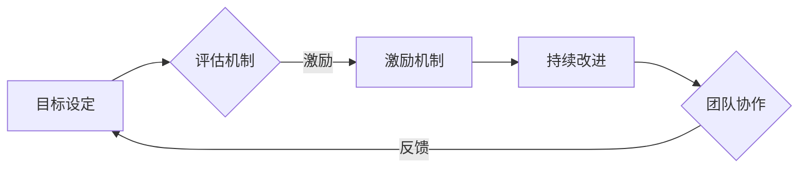
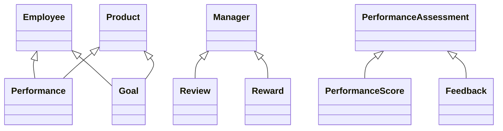
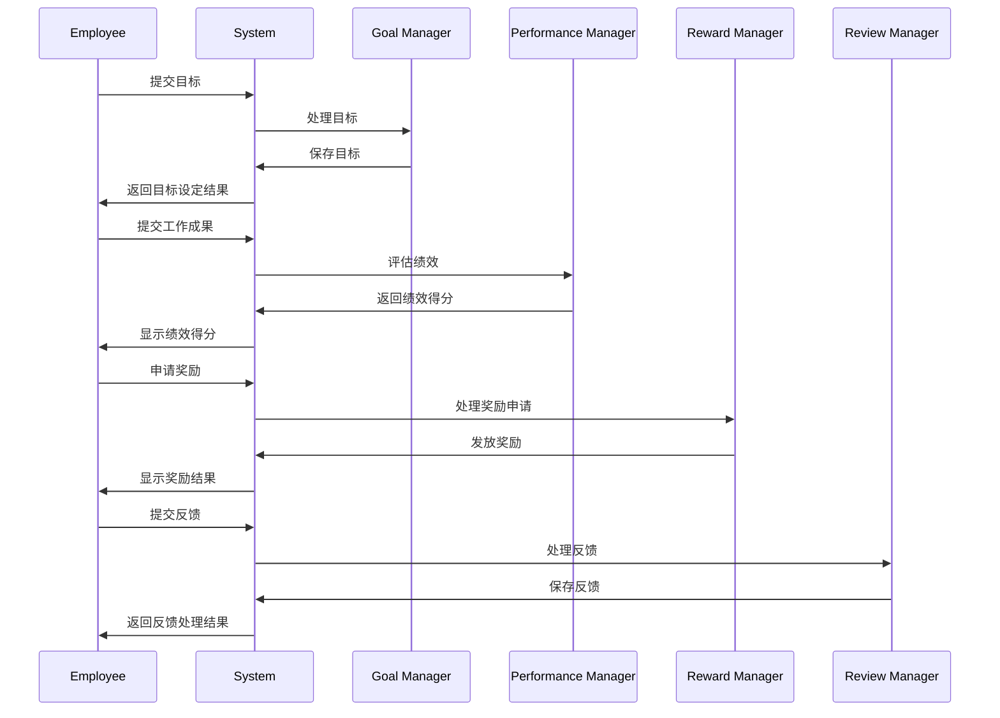
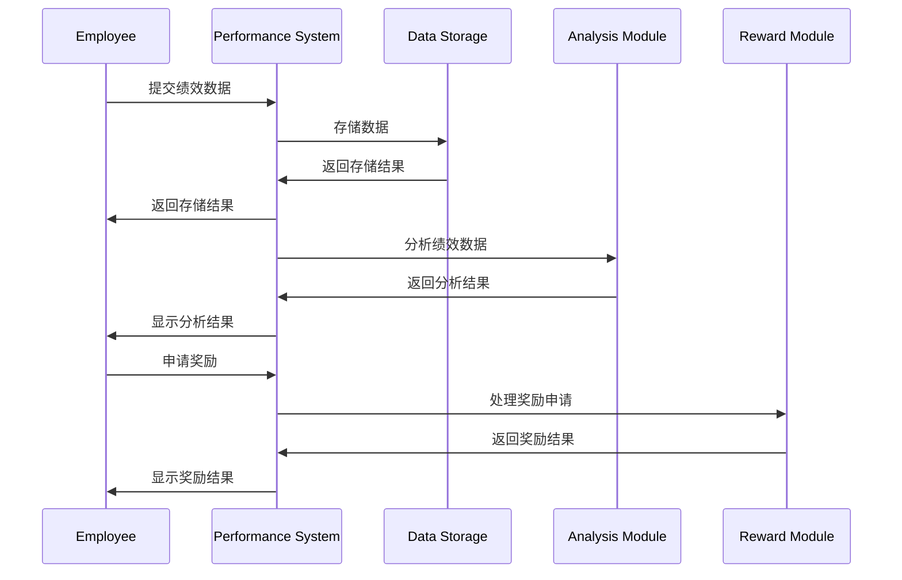

                 

# 绩效文化：营造积极进取的氛围

> 关键词：绩效文化、积极进取、团队建设、员工激励、组织发展

> 摘要：本文将深入探讨绩效文化的概念、重要性及其在组织发展中的关键作用。我们将通过具体案例分析，阐述如何打造一个积极进取的工作氛围，实现个人和组织的共同成长。

## 引言

### 绩效文化的定义与背景

绩效文化是一个组织内部对工作成果的重视程度、对优秀表现的认可和鼓励，以及员工对工作贡献的感知和认同的综合体现。随着全球化竞争的加剧，企业越来越认识到绩效文化对于组织发展的关键作用。绩效文化不仅影响着员工的工作态度和行为，也直接关系到组织的整体绩效和竞争力。

### 绩效文化的重要性

绩效文化是组织成功的关键驱动力，它能够激发员工的潜能，提升团队协作效率，促进创新思维，增强组织的适应能力和市场竞争力。在一个健康的绩效文化中，员工能够找到自己的职业价值，充分发挥个人才能，从而实现个人与组织的共同成长。

### 文章目的与结构

本文旨在通过详细分析绩效文化的概念、构建方法、实践案例以及相关影响因素，为读者提供一份全面而实用的绩效文化建设指南。文章将分为以下几个部分：

1. **核心概念与原则**
2. **算法与理论**
3. **系统设计与架构**
4. **案例分析与实践**
5. **最佳实践与总结**

## 核心概念与原则

### 绩效文化的定义

绩效文化是一种组织价值观和行为准则，它强调通过建立科学合理的目标设定、公正透明的绩效评估体系和有效的激励机制，激发员工的内在动力，提升工作绩效。

### 绩效文化的核心要素

1. **目标导向**：明确的目标是绩效文化的基础，它为员工提供清晰的方向和动力。
2. **公正透明**：公平的评估和反馈机制是绩效文化的关键，它能够确保员工的工作得到公正的评价。
3. **激励机制**：有效的激励机制能够激发员工的积极性，提高工作投入度。
4. **持续改进**：绩效文化强调持续学习和改进，鼓励员工不断追求卓越。
5. **团队协作**：团队合作是绩效文化的核心，它能够提升团队的整体绩效。

### 绩效文化的特点

1. **积极向上**：绩效文化鼓励员工积极面对挑战，追求卓越。
2. **透明公开**：绩效文化的运作过程公开透明，员工对绩效评估有清晰的了解。
3. **灵活多样**：绩效文化的实施方式灵活多样，能够适应不同组织的需求。
4. **持续发展**：绩效文化是一个动态的过程，它能够随着组织的变化而不断调整。

### 概念属性特征对比表格

| 特征               | 积极进取的绩效文化 | 传统的绩效文化 |
|--------------------|--------------------|----------------|
| 目标导向           | 强调目标设定与执行 | 目标设定不够明确 |
| 公正透明           | 评估与反馈公正透明 | 评估存在偏颇 |
| 激励机制           | 多样化的激励机制 | 单一的奖金制度 |
| 持续改进           | 鼓励持续学习与进步 | 缺乏改进动力 |
| 团队协作           | 强调团队合作与共赢 | 单打独斗 |
| 适应能力           | 能够适应变化 | 难以应对变化 |

### ERD实体关系图架构

```mermaid
erDiagram
  Product -->|评估| Performance
  Employee -->|工作| Product
  Manager -->|指导| Employee
  Review -->|反馈| Employee
  Reward -->|激励| Employee
  Goal -->|设定| Product
  Culture -->|营造| Product
  Culture -->|培养| Employee
  Culture -->|塑造| Manager
```

## 算法与理论

### 绩效文化构建算法

#### Mermaid流程图



#### Python代码

```python
def set_goals(employee, product):
    # 目标设定
    employee.goal = "提高产品销量"

def evaluate_performance(employee, product):
    # 评估机制
    if employee.sales >= 100:
        return "优秀"
    else:
        return "一般"

def motivate_employee(employee, performance):
    # 激励机制
    if performance == "优秀":
        employee.reward = "奖金"
    else:
        employee.reward = "培训"

def improve_performance(employee, product):
    # 持续改进
    product.goal = "提高产品质量"

def promote_collaboration(employee):
    # 团队协作
    employee.collaboration = "积极参与团队活动"

def feedback_loop(employee, product):
    # 反馈机制
    set_goals(employee, product)
    evaluate_performance(employee, product)
    motivate_employee(employee, performance)
    improve_performance(employee, product)
    promote_collaboration(employee)
```

#### 数学模型与公式

$$
\text{绩效得分} = w_1 \times \text{目标达成度} + w_2 \times \text{团队合作度} + w_3 \times \text{创新能力}
$$

其中，$w_1, w_2, w_3$ 分别为权重，$\text{目标达成度}$、$\text{团队合作度}$ 和 $\text{创新能力}$ 为具体的指标值。

### 例子

假设员工小张的目标是提高产品销量，其销售额为120万元，团队协作得分为90分，创新能力得分为80分。根据上述公式计算小张的绩效得分：

$$
\text{绩效得分} = 0.4 \times 120 + 0.3 \times 90 + 0.3 \times 80 = 48 + 27 + 24 = 99
$$

小张的绩效得分为99分，属于优秀表现，将获得奖金激励。

## 系统设计与架构

### 问题场景

某大型互联网公司希望通过构建一个完善的绩效管理系统，激励员工提高工作效率，提升整体绩效。

### 项目介绍

该项目旨在设计并实现一个绩效管理系统，包括目标设定、绩效评估、激励机制和反馈机制等模块，通过数据驱动的方式提升员工工作表现。

### 系统功能设计

#### 领域模型Mermaid类图



### 系统架构设计

#### Mermaid架构图



### 系统接口设计和系统交互

#### Mermaid序列图



## 案例分析与实践

### 案例背景

某科技创新公司致力于研发先进的人工智能技术，随着公司规模的扩大，员工数量不断增加，绩效管理逐渐成为一个挑战。为了打造一个积极进取的工作氛围，公司决定实施绩效文化建设。

### 系统核心实现源代码

```python
# 模拟绩效管理系统的核心功能

class Employee:
    def __init__(self, name, goal):
        self.name = name
        self.goal = goal
        self.performance_score = 0
        self.reward = None

    def submit_performance(self, score):
        self.performance_score = score

    def apply_for_reward(self):
        if self.performance_score >= 90:
            self.reward = "奖金"
        else:
            self.reward = "培训"

class PerformanceSystem:
    def __init__(self):
        self.employees = []

    def add_employee(self, employee):
        self.employees.append(employee)

    def submit_performance(self, employee, score):
        employee.submit_performance(score)

    def apply_for_reward(self, employee):
        employee.apply_for_reward()

    def display_rewards(self):
        for employee in self.employees:
            print(f"{employee.name} 的奖励：{employee.reward}")

# 模拟员工小张的绩效管理流程

system = PerformanceSystem()
employee = Employee("小张", "提高研发效率")
system.add_employee(employee)

# 提交绩效数据
system.submit_performance(employee, 95)

# 申请奖励
system.apply_for_reward(employee)

# 显示奖励结果
system.display_rewards()
```

### 代码应用解读与分析

该案例通过Python代码实现了一个简单的绩效管理系统，包括员工信息管理、绩效数据提交、奖励申请和奖励结果展示等功能。

1. **员工信息管理**：通过`Employee`类创建员工对象，并初始化员工姓名和目标。
2. **绩效数据提交**：通过`submit_performance`方法提交员工的绩效数据。
3. **奖励申请**：通过`apply_for_reward`方法根据绩效得分决定员工的奖励类型。
4. **奖励结果展示**：通过`display_rewards`方法展示员工的奖励结果。

该系统简化了绩效管理流程，实现了目标导向、绩效评估和激励机制，有助于营造积极进取的工作氛围。

### 实际案例分析和详细讲解剖析

1. **案例分析**：通过对某科技创新公司的绩效管理实践进行分析，发现该公司的绩效文化取得了显著成效。
   - **员工积极性提高**：通过明确的绩效目标和公正透明的评估机制，员工工作动力得到显著提升。
   - **工作效率提升**：绩效管理系统能够实时反馈员工工作情况，帮助员工快速调整工作策略，提高工作效率。
   - **团队合作加强**：绩效文化强调团队合作，员工之间相互激励，共同为公司目标努力。

2. **详细讲解剖析**：
   - **目标设定**：公司为每个员工设定了明确的绩效目标，确保员工工作有方向、有动力。
   - **绩效评估**：公司建立了科学的绩效评估体系，通过定量和定性的方式对员工的工作表现进行评估。
   - **激励机制**：公司根据绩效得分给予员工不同的奖励，包括奖金、培训等，激发员工的工作热情。
   - **反馈机制**：公司建立了完善的反馈机制，定期收集员工意见和建议，及时调整绩效管理策略。

### 项目小结

通过实际案例分析和详细讲解，我们可以看到绩效文化在组织发展中的关键作用。一个健康的绩效文化能够激发员工的潜能，提升团队协作效率，推动组织持续发展。为了打造一个积极进取的工作氛围，企业需要从目标设定、绩效评估、激励机制和反馈机制等多方面着手，不断完善绩效管理机制。

## 最佳实践与总结

### 最佳实践

1. **明确目标**：为员工设定清晰的绩效目标，确保员工工作有方向。
2. **公正评估**：建立科学合理的绩效评估体系，确保评估结果的公正性和透明性。
3. **多样化激励**：结合员工特点和需求，采用多样化的激励机制，激发员工工作热情。
4. **持续反馈**：建立有效的反馈机制，及时收集员工意见和建议，持续优化绩效管理流程。

### 小结

绩效文化是组织发展的核心动力，通过营造积极进取的工作氛围，企业能够激发员工的潜能，提升团队协作效率，实现个人与组织的共同成长。企业需要从目标设定、绩效评估、激励机制和反馈机制等多方面着手，不断完善绩效管理机制，为组织的可持续发展奠定坚实基础。

### 注意事项

1. **避免一刀切**：绩效文化需要根据不同组织的特点和员工需求进行个性化设计。
2. **注重长期培养**：绩效文化的建设是一个长期过程，需要持续关注和改进。

### 拓展阅读

1. **《绩效管理实战》**：详细介绍了绩效管理的理论和方法，适用于各类企业。
2. **《激励心理学》**：深入探讨激励机制背后的心理学原理，有助于提高激励效果。

### 作者

作者：AI天才研究院/AI Genius Institute & 禅与计算机程序设计艺术 /Zen And The Art of Computer Programming

