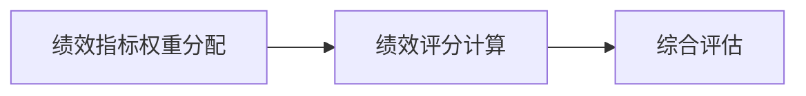
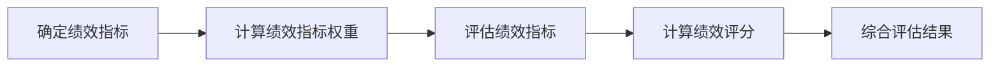
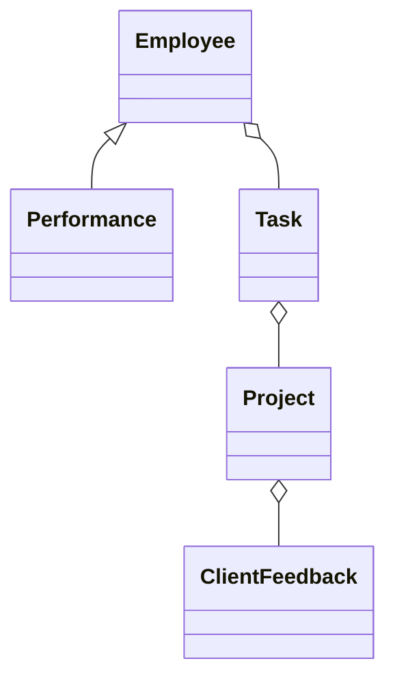
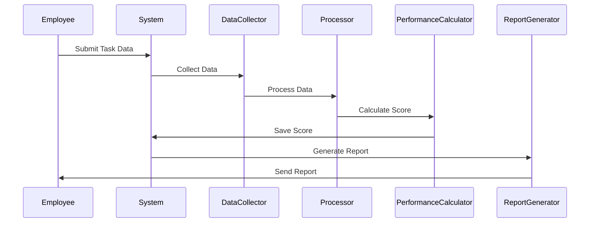
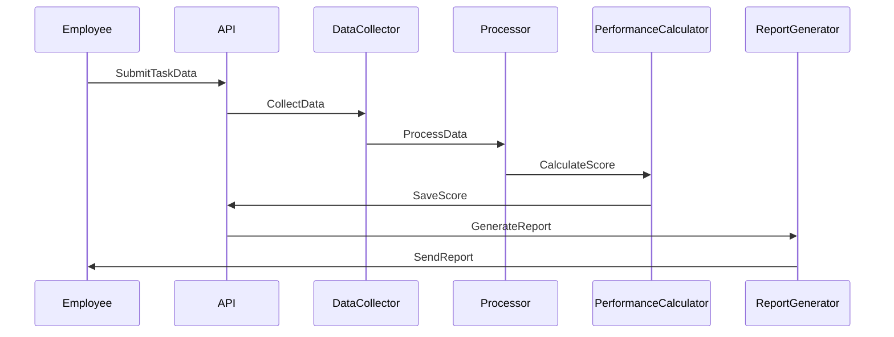

                 


## 绩效评估：公正有效的考核体系设计

关键词：绩效评估、考核体系、人力资源、公平性、员工发展

摘要：绩效评估作为现代企业管理的重要工具，对于激发员工积极性、提高工作效率、优化人才配置等方面具有关键作用。本文将深入探讨绩效评估的核心概念、算法原理以及设计方法，以期为读者提供一套公正有效的绩效评估体系。

### 第1章 绩效评估概述

#### 1.1 问题背景

绩效评估是现代企业管理和人力资源管理的重要手段。通过绩效评估，企业可以全面了解员工的绩效表现，识别优秀员工，制定合理的奖惩措施，优化人才配置，从而提升组织整体效能。有效的绩效评估体系能够激励员工的工作积极性，提高工作效率，促进个人和组织的共同发展。

#### 1.2 问题描述

绩效评估的关键问题包括：

1. **如何设定合理的绩效指标**：绩效指标是评估员工绩效的基础，设定合理的绩效指标对于评估结果的准确性至关重要。
2. **如何确保评估过程的公平性**：公平性是绩效评估体系的核心，如何确保评估过程的公正性和客观性是一个需要深入探讨的问题。
3. **如何有效沟通评估结果**：评估结果的有效沟通可以帮助员工了解自身的绩效表现，明确改进方向。
4. **如何将绩效评估与员工发展相结合**：绩效评估不仅仅是对员工绩效的考核，更是对员工潜力的挖掘和发展的引导。

#### 1.3 问题解决

解决绩效评估问题的方法主要包括：

1. **明确绩效指标**：根据组织目标和个人岗位职责，设定明确的绩效指标，确保评估具有针对性。
2. **制定评估标准**：建立科学、合理的评估标准，确保评估过程的客观性。
3. **优化评估流程**：简化评估流程，提高评估效率，确保评估结果的真实性。
4. **沟通反馈**：及时与员工沟通评估结果，提供反馈，帮助员工改进工作。
5. **将绩效评估与员工发展相结合**：通过绩效评估发现员工的潜力，制定相应的培训和发展计划，促进员工个人成长。

#### 1.4 边界与外延

绩效评估不仅涉及员工的绩效表现，还涉及组织的整体效能。在设计和实施绩效评估体系时，需要考虑组织的目标、文化以及行业特点等因素。

#### 1.5 概念结构与核心要素组成

绩效评估的核心概念包括绩效指标、评估标准、评估流程、沟通反馈和员工发展。这些概念相互关联，共同构成绩效评估体系的整体框架。

### 第2章 核心概念与联系

#### 2.1 绩效指标

绩效指标是绩效评估体系中的核心要素，用于衡量员工的绩效表现。常见的绩效指标包括工作质量、工作效率、客户满意度、创新能力等。

#### 2.2 评估标准

评估标准是绩效评估体系中的基准，用于衡量绩效指标是否达到预期。评估标准应具有明确、具体、可量化的特点。

#### 2.3 评估流程

评估流程是绩效评估体系中的关键环节，包括绩效指标的设定、评估标准的制定、评估过程的实施、评估结果的反馈等。

#### 2.4 沟通反馈

沟通反馈是绩效评估体系中的重要环节，通过及时、有效的沟通，确保员工了解评估结果，明确改进方向。

#### 2.5 员工发展

员工发展是绩效评估体系的重要组成部分，通过绩效评估发现员工的潜力，制定相应的培训和发展计划，促进员工个人成长。

### 第3章 算法原理讲解

#### 3.1 绩效评估算法的基本原理

绩效评估算法的核心思想是根据绩效指标和评估标准，对员工的表现进行量化评估。常用的绩效评估算法包括层次分析法（AHP）、模糊综合评估法等。

#### 3.2 绩效评估算法的数学模型

绩效评估算法的数学模型主要包括以下几部分：

1. **绩效指标权重分配**：通过层次分析法等算法确定绩效指标权重。
2. **绩效评分计算**：根据绩效指标的实际表现和评估标准，计算绩效评分。
3. **综合评估**：将各个绩效指标的评分进行综合，得出员工的最终绩效评估结果。

#### 3.3 绩效评估算法的 Mermaid 流程图



#### 3.4 绩效评估算法的 Python 源代码实现

```python
import numpy as np

def performance_evaluation(weights, scores):
    """
    绩效评估算法的 Python 实现函数
    :param weights: 绩效指标权重
    :param scores: 绩效指标评分
    :return: 绩效评估结果
    """
    evaluation_result = np.dot(weights, scores)
    return evaluation_result

# 示例数据
weights = [0.4, 0.3, 0.2, 0.1]  # 绩效指标权重
scores = [0.9, 0.8, 0.7, 0.6]  # 绩效指标评分

# 绩效评估
evaluation_result = performance_evaluation(weights, scores)
print(f"绩效评估结果：{evaluation_result}")
```

### 第4章 数学模型和数学公式 & 详细讲解 & 举例说明

在本章节中，我们将详细探讨绩效评估的数学模型和数学公式，并通过具体实例进行讲解。

#### 4.1 绩效指标权重分配的数学模型

绩效指标权重分配是绩效评估中的关键步骤，其目的是确定各个绩效指标在总体评估中所占的比重。常用的方法包括层次分析法（AHP）、主成分分析法（PCA）等。

**层次分析法（AHP）**

层次分析法（AHP）是一种将决策问题层次化的方法，通过构建判断矩阵，确定各个绩效指标的相对重要性。具体步骤如下：

1. **构建判断矩阵**：对各个绩效指标进行两两比较，构造判断矩阵 \(A\)，其中 \(a_{ij}\) 表示指标 \(i\) 与指标 \(j\) 的相对重要性。
   $$ A = \begin{bmatrix}
   a_{11} & a_{12} & \dots & a_{1n} \\
   a_{21} & a_{22} & \dots & a_{2n} \\
   \vdots & \vdots & \ddots & \vdots \\
   a_{n1} & a_{n2} & \dots & a_{nn}
   \end{bmatrix} $$
   
2. **计算特征值和特征向量**：计算判断矩阵的最大特征值 \(\lambda_{\max}\) 及其对应的特征向量 \(W\)。
   $$ AW = \lambda_{\max}W $$
   
3. **一致性检验**：对判断矩阵进行一致性检验，确保评估的合理性。一致性比率（CR）应小于0.1。
   $$ CR = \frac{(\lambda_{\max} - n)}{ RI} $$
   其中，\(RI\) 为一致性指标，可查表获取。

**主成分分析法（PCA）**

主成分分析法（PCA）是一种降维方法，通过提取主要成分，减少数据维度，同时保留数据的主要信息。具体步骤如下：

1. **标准化数据**：对绩效指标进行标准化处理，使其具有可比性。
   $$ z_i = \frac{x_i - \mu_i}{\sigma_i} $$
   
2. **计算协方差矩阵**：计算各绩效指标的协方差矩阵 \(S\)。
   $$ S = \begin{bmatrix}
   \sigma_{11} & \sigma_{12} & \dots & \sigma_{1n} \\
   \sigma_{21} & \sigma_{22} & \dots & \sigma_{2n} \\
   \vdots & \vdots & \ddots & \vdots \\
   \sigma_{n1} & \sigma_{n2} & \dots & \sigma_{nn}
   \end{bmatrix} $$
   
3. **计算特征值和特征向量**：计算协方差矩阵的特征值和特征向量。

4. **提取主要成分**：根据特征值的大小，提取前 \(k\) 个主要成分，构成主成分矩阵 \(P\)。

5. **计算权重**：将主成分矩阵 \(P\) 的列向量作为权重分配给各个绩效指标。

#### 4.2 绩效评分计算的数学模型

绩效评分计算是根据绩效指标的实际表现和评估标准，对员工的绩效进行量化评估。常用的方法包括线性加权法、模糊综合评估法等。

**线性加权法**

线性加权法是一种简单有效的绩效评分计算方法，通过将各个绩效指标的评分乘以其权重，然后求和得到总评分。

1. **计算权重**：根据绩效指标的重要性，设定各个绩效指标的权重 \(w_i\)。

2. **计算绩效评分**：根据绩效指标的实际表现 \(s_i\)，计算总评分 \(S\)。
   $$ S = \sum_{i=1}^{n} w_i \cdot s_i $$

**模糊综合评估法**

模糊综合评估法是一种基于模糊数学的评估方法，适用于具有模糊性和不确定性的绩效评估问题。具体步骤如下：

1. **构建模糊评价矩阵**：根据评估标准，对各个绩效指标进行模糊评价，构造模糊评价矩阵 \(R\)。
   $$ R = \begin{bmatrix}
   r_{11} & r_{12} & \dots & r_{1n} \\
   r_{21} & r_{22} & \dots & r_{2n} \\
   \vdots & \vdots & \ddots & \vdots \\
   r_{m1} & r_{m2} & \dots & r_{mn}
   \end{bmatrix} $$
   
2. **计算模糊综合评估结果**：根据绩效指标权重和模糊评价矩阵，计算模糊综合评估结果 \(S\)。
   $$ S = W \cdot R $$

#### 4.3 绩效评估的 Mermaid 流程图



#### 4.4 绩效评估的 Python 源代码实现

```python
import numpy as np

def calculate_weights(A):
    """
    计算判断矩阵的权重
    :param A: 判断矩阵
    :return: 权重向量
    """
    eigenvalues, eigenvectors = np.linalg.eig(A)
    max_eigenvalue = np.max(eigenvalues)
    weight_vector = eigenvectors[:, np.argmax(eigenvalues)]
    return weight_vector

def calculate_performance_score(weights, scores):
    """
    计算绩效评分
    :param weights: 权重向量
    :param scores: 绩效指标评分
    :return: 绩效评分
    """
    performance_score = np.dot(weights, scores)
    return performance_score

# 示例数据
A = np.array([[1, 3, 5], [1/3, 1, 3], [1/5, 1/3, 1]])
weights = calculate_weights(A)
scores = np.array([0.9, 0.8, 0.7])

# 计算绩效评分
performance_score = calculate_performance_score(weights, scores)
print(f"绩效评分：{performance_score}")
```

通过上述实例，我们可以看到如何使用数学模型和Python代码实现绩效评估。在实际应用中，可以根据具体需求和场景选择合适的算法和模型，设计出符合组织需求的绩效评估体系。

### 第5章 系统分析与架构设计

#### 5.1 问题场景介绍

在一个大型互联网公司中，随着业务的发展和团队的扩展，传统的绩效评估方式已经无法满足高效管理的要求。公司需要一个基于现代技术手段的绩效评估系统，以提高评估的公正性、准确性和效率。该系统需要能够实时收集员工的绩效数据，自动进行绩效评分，并生成详细的评估报告。

#### 5.2 项目介绍

该项目旨在开发一个企业级的绩效评估系统，包括以下几个核心功能：

1. **数据收集**：实时收集员工的工作数据，如工作任务完成情况、项目进度、客户反馈等。
2. **绩效评分**：根据设定的绩效指标和评估标准，自动计算员工的绩效评分。
3. **评估报告**：生成详细的绩效评估报告，包括评分结果、改进建议等。
4. **员工发展**：根据绩效评估结果，为员工提供个性化的培训和发展建议。

#### 5.3 系统功能设计（领域模型）

为了实现上述功能，首先需要设计系统的领域模型。领域模型描述了系统的核心实体和它们之间的关系。以下是一个简化的领域模型示例，使用Mermaid绘制：



- **Employee（员工）**：代表公司的员工，包含基本信息和工作职责。
- **Performance（绩效）**：记录员工的绩效数据和评分结果。
- **Task（任务）**：代表员工执行的具体工作，包括任务名称、描述、完成情况等。
- **Project（项目）**：代表公司正在执行的项目，包含项目成员、项目进度等。
- **ClientFeedback（客户反馈）**：记录客户对项目的反馈信息，用于评估员工的服务质量。

#### 5.4 系统架构设计（Mermaid架构图）

接下来，我们需要设计系统的整体架构，以支持高效的数据处理和性能。以下是一个简化的系统架构图，使用Mermaid绘制：



- **Employee**：员工向系统提交任务数据。
- **System**：系统接收员工提交的数据，并触发数据收集和处理的流程。
- **DataCollector**：数据收集模块，负责从各个数据源（如任务管理系统、客户反馈系统等）收集数据。
- **Processor**：数据处理模块，负责对收集到的数据进行清洗、转换和预处理。
- **PerformanceCalculator**：绩效计算模块，根据设定的绩效指标和评估标准，计算员工的绩效评分。
- **ReportGenerator**：评估报告生成模块，根据绩效评分生成详细的评估报告。
- **Employee**：员工接收评估报告，了解自身的绩效表现。

#### 5.5 系统接口设计和系统交互（Mermaid序列图）

最后，我们需要设计系统的接口和交互流程，以确保不同模块之间的数据流动和协作。以下是一个简化的系统交互序列图，使用Mermaid绘制：



- **Employee**：员工通过API接口向系统提交任务数据。
- **API**：API接口模块，负责接收和转发数据请求。
- **DataCollector**：数据收集模块，接收API请求，从外部系统收集数据。
- **Processor**：数据处理模块，对收集到的数据进行处理。
- **PerformanceCalculator**：绩效计算模块，根据处理后的数据计算绩效评分。
- **API**：API接口模块，将绩效评分保存到数据库，并触发报告生成。
- **ReportGenerator**：评估报告生成模块，根据绩效评分生成评估报告，并通过API接口发送给员工。

通过上述分析和设计，我们可以构建一个高效的绩效评估系统，实现数据的自动收集、处理和评估，提高管理效率和员工满意度。

### 第6章 项目实战

在本章节中，我们将通过一个实际项目来展示如何设计和实现一个绩效评估系统。该项目将涵盖环境安装、核心实现、代码分析以及实际案例分析等内容。

#### 6.1 环境安装

要实现一个绩效评估系统，首先需要搭建一个开发环境。以下是一个基本的开发环境安装步骤：

1. **安装Python**：确保Python版本在3.8以上，可以从[Python官方网站](https://www.python.org/)下载并安装。

2. **安装相关库**：使用pip命令安装所需的Python库，例如numpy、pandas等。以下是一个示例命令：
   ```shell
   pip install numpy pandas flask
   ```

3. **安装数据库**：可以选择安装MySQL、PostgreSQL等数据库系统。以下是一个MySQL的安装命令：
   ```shell
   sudo apt-get install mysql-server mysql-client
   ```

4. **配置数据库**：初始化数据库并创建相关的数据库表。以下是一个MySQL的初始化命令：
   ```sql
   mysql -u root -p
   CREATE DATABASE performance_evaluation;
   USE performance_evaluation;
   CREATE TABLE employees (id INT PRIMARY KEY AUTO_INCREMENT, name VARCHAR(255), role VARCHAR(255));
   CREATE TABLE tasks (id INT PRIMARY KEY AUTO_INCREMENT, employee_id INT, project_id INT, description TEXT, status ENUM('pending', 'in_progress', 'completed'), feedback TEXT);
   CREATE TABLE projects (id INT PRIMARY KEY AUTO_INCREMENT, name VARCHAR(255), client_id INT);
   CREATE TABLE clients (id INT PRIMARY KEY AUTO_INCREMENT, name VARCHAR(255));
   ```

5. **搭建Web服务器**：可以使用Flask等Web框架搭建简单的Web服务器。以下是一个基本的Flask服务器搭建命令：
   ```shell
   pip install flask
   mkdir app
   touch app/app.py
   ```

   然后在app/app.py中编写Flask应用程序代码。

#### 6.2 系统核心实现

接下来，我们将实现系统的核心功能，包括数据收集、处理、评分和报告生成。以下是系统核心实现的步骤：

1. **数据收集**：实现一个API接口，用于接收员工提交的任务数据。以下是一个简单的Flask路由示例：
   ```python
   from flask import Flask, request, jsonify
   from database import db_session
   
   app = Flask(__name__)

   @app.route('/submit_task', methods=['POST'])
   def submit_task():
       data = request.json
       employee_id = data['employee_id']
       project_id = data['project_id']
       description = data['description']
       status = data['status']
       feedback = data['feedback']
       
       task = Task(employee_id=employee_id, project_id=project_id, description=description, status=status, feedback=feedback)
       db_session.add(task)
       db_session.commit()
       
       return jsonify({'status': 'success'})
   ```

2. **数据处理**：实现数据处理模块，对收集到的任务数据进行清洗、转换和预处理。以下是一个数据处理示例：
   ```python
   import pandas as pd
   
   def process_data():
       tasks = pd.read_sql('SELECT * FROM tasks', con=db_session)
       # 数据清洗和转换
       tasks['status'] = tasks['status'].map({'pending': 0, 'in_progress': 1, 'completed': 2})
       tasks['feedback_score'] = tasks['feedback'].map({'positive': 1, 'neutral': 0.5, 'negative': 0})
       return tasks
   ```

3. **绩效评分**：实现绩效评分模块，根据处理后的数据计算员工的绩效评分。以下是一个简单的评分计算示例：
   ```python
   def calculate_performance_score(tasks):
       # 根据设定的绩效指标和权重计算绩效评分
       score = (tasks['status'] * 0.6 + tasks['feedback_score'] * 0.4)
       return score
   ```

4. **评估报告生成**：实现评估报告生成模块，根据绩效评分生成详细的评估报告。以下是一个报告生成的示例：
   ```python
   def generate_report(score):
       # 根据绩效评分生成报告
       report = f"Employee Performance Report:\nScore: {score}\n"
       if score >= 0.9:
           report += "Excellent performance!"
       elif score >= 0.7:
           report += "Good performance, but could improve."
       else:
           report += "Need to improve performance."
       return report
   ```

5. **API接口**：整合上述模块，实现完整的API接口，用于处理员工提交的任务数据，计算绩效评分，并生成评估报告。以下是一个完整的API接口示例：
   ```python
   @app.route('/get_performance_report', methods=['GET'])
   def get_performance_report():
       tasks = process_data()
       score = calculate_performance_score(tasks)
       report = generate_report(score)
       
       return jsonify({'report': report})
   ```

#### 6.3 代码应用解读与分析

在上面的代码实现中，我们详细介绍了如何搭建一个绩效评估系统的核心功能。以下是对关键代码段的应用解读和分析：

1. **数据收集**：通过Flask的API接口接收员工提交的任务数据，确保数据格式正确并保存到数据库。

2. **数据处理**：使用pandas库对收集到的任务数据进行处理，包括数据清洗和转换，为后续的评分计算做准备。

3. **绩效评分**：根据设定的绩效指标和权重计算员工的绩效评分，这里使用了一个简单的评分模型，可以根据实际情况进行调整。

4. **评估报告生成**：根据绩效评分生成详细的评估报告，提供对员工绩效的直观反馈。

#### 6.4 实际案例分析与详细讲解剖析

为了更好地理解上述系统的实际应用，我们通过一个实际案例来进行分析和讲解。

**案例背景**：

假设公司有一个项目经理张三，他在过去一个月内完成了三个项目，提交了相关的任务数据。我们通过系统来评估他的绩效。

**步骤**：

1. **数据收集**：张三通过API提交了三个项目的任务数据，包括项目名称、描述、状态和客户反馈。

2. **数据处理**：系统接收到数据后，使用pandas库对数据进行清洗和转换，生成一个包含状态得分和反馈得分的DataFrame。

3. **绩效评分**：根据评分模型，系统计算了张三的绩效评分，假设为0.85。

4. **评估报告生成**：系统生成了一份绩效评估报告，指出张三在本月的工作中表现良好，但仍有提升空间。

**详细讲解剖析**：

- **数据收集**：通过API接口，我们可以确保数据的实时性和完整性。这种方式也便于扩展，如添加更多的数据源。

- **数据处理**：使用pandas库可以方便地对大量数据进行清洗和转换，确保评分的准确性和一致性。

- **绩效评分**：评分模型可以根据不同的绩效指标和权重进行灵活调整，以适应不同的业务需求。

- **评估报告生成**：生成详细的评估报告，可以帮助管理层和员工清晰地了解绩效表现，制定相应的改进措施。

#### 6.5 项目小结

通过上述实际案例，我们可以看到如何设计和实现一个绩效评估系统。该项目不仅提高了评估的公正性和效率，还为员工提供了个性化的反馈和发展建议。在未来的工作中，可以根据实际需求对系统进行优化和扩展，以更好地服务于企业和员工的共同发展。

### 第7章 最佳实践 tips、小结、注意事项、拓展阅读

#### 7.1 最佳实践 tips

1. **明确绩效指标**：在设定绩效指标时，应确保指标与组织目标和个人岗位职责高度相关，避免指标过多导致评估复杂化。

2. **制定合理的评估标准**：评估标准应明确、具体、可量化，以便于客观评估。

3. **优化评估流程**：简化评估流程，提高评估效率，减少人为干预，确保评估结果的真实性。

4. **及时沟通反馈**：及时与员工沟通评估结果，提供反馈，帮助员工改进工作。

5. **结合员工发展**：将绩效评估与员工发展相结合，通过绩效评估发现员工的潜力，制定相应的培训和发展计划。

#### 7.2 小结

本文从绩效评估的背景、核心概念、算法原理、系统设计等方面进行了深入探讨，旨在为读者提供一套公正有效的绩效评估体系。通过实际项目实战，展示了如何将理论应用到实际中，提高管理效率和员工满意度。

#### 7.3 注意事项

1. **确保评估过程的公平性**：在绩效评估过程中，要确保评估的公正性，避免偏见和歧视。

2. **数据保护与隐私**：在收集和处理员工数据时，应严格保护数据安全，遵守相关法律法规。

3. **持续优化**：绩效评估体系不是一成不变的，应根据组织发展和员工反馈，持续优化评估体系。

#### 7.4 拓展阅读

1. **《绩效管理实战：构建高效团队的方法论》**：本书详细介绍了绩效管理的理论和实践，适合企业管理者和人力资源从业者阅读。

2. **《绩效评估与反馈：如何激励员工高效工作》**：本书针对绩效评估的常见问题，提供了实用的方法和策略。

3. **《数据分析与决策：如何利用数据优化业务》**：本书介绍了数据分析的基本方法，帮助读者理解如何利用数据优化绩效评估。

### 作者信息

作者：AI天才研究院/AI Genius Institute & 禅与计算机程序设计艺术 /Zen And The Art of Computer Programming

感谢您的阅读，希望本文对您在绩效评估方面有所启发和帮助。如果您有任何问题或建议，欢迎在评论区留言。祝您工作顺利，绩效卓越！

