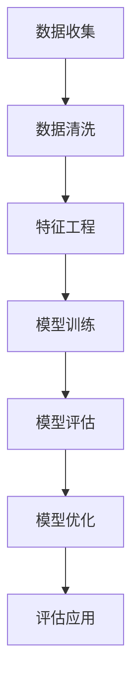
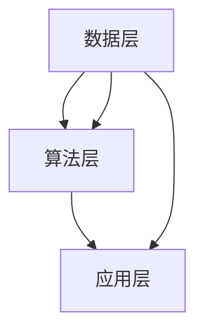
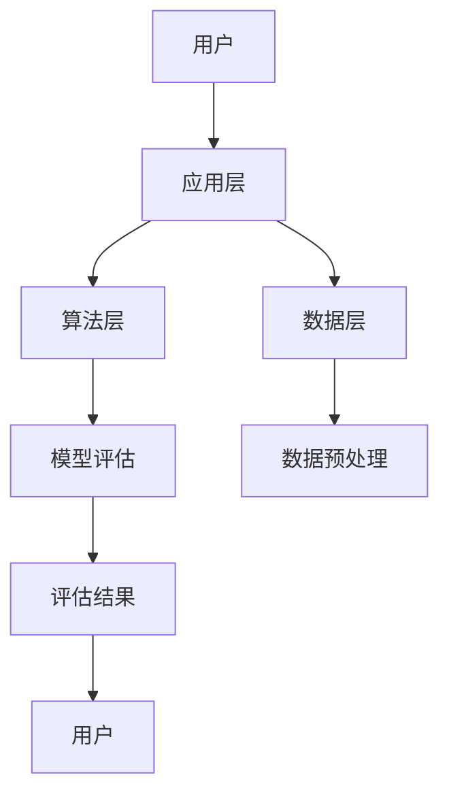

                 

## 绩效评估：公正评价团队成员

> 关键词：绩效评估、公正性、数据驱动、机器学习、员工发展

> 摘要：本文探讨了在现代企业中如何通过数据驱动和机器学习方法，构建一个公正、科学的绩效评估系统。本文首先介绍了绩效评估的背景和问题，然后详细阐述了绩效指标、数据分析和评估模型等核心概念，并通过具体算法原理和数学模型讲解，展示了如何实现公正评价团队成员的方法。最后，本文结合项目实战，介绍了系统架构和核心实现，为读者提供了实用的绩效评估解决方案。

### 第一部分：背景介绍

#### 1.1 问题背景

在现代企业中，绩效评估是一个不可或缺的管理工具。它不仅反映了员工的工作表现，还为员工的晋升、奖励和培训提供了依据。然而，传统绩效评估方法往往存在许多问题，难以实现公正、科学的评价。以下是绩效评估中常见的问题：

1. **主观性**：传统绩效评估依赖于上级的主观判断，容易受到个人情感、偏见等因素的影响，导致评估结果不客观。
2. **不公平性**：由于不同员工的工作内容和环境存在差异，传统评估方法可能导致评估结果不公平。
3. **数据不透明**：绩效评估的数据和过程通常不透明，员工无法了解评估标准和评估过程，容易产生不满和质疑。

#### 1.2 问题描述

绩效评估的公正性问题主要体现在以下几个方面：

1. **评估标准不一致**：不同部门、不同职位之间的评估标准可能存在差异，导致评估结果不一致。
2. **评估过程不透明**：评估过程缺乏透明度，员工无法了解评估标准和评估结果，容易产生质疑。
3. **评估结果主观性高**：评估结果往往依赖于上级的主观判断，缺乏客观数据支持。

#### 1.3 问题解决

为了解决上述问题，本文提出了基于数据驱动的绩效评估方法。通过收集和分析员工的工作数据，结合科学评估模型，能够更客观、公正地评价员工的工作表现。这种方法不仅提高了评估的公正性，还为员工的发展提供了有力的支持。

#### 1.4 边界与外延

绩效评估的范围不仅限于员工的工作表现，还包括团队协作、创新能力等多个方面。同时，绩效评估也涉及到组织文化、管理风格等多个层面。因此，本文的讨论将涵盖这些方面的内容。

#### 1.5 概念结构与核心要素组成

绩效评估的核心概念包括：

1. **绩效指标**：衡量员工工作表现的具体指标。
2. **数据分析**：对员工工作数据进行分析，提取有效信息。
3. **评估模型**：根据绩效指标和数据，构建科学、客观的评估模型。

这些核心要素共同构成了绩效评估的系统架构，为公正评价团队成员提供了理论基础和实践指导。

### 第二部分：核心概念与联系

#### 2.1 绩效指标

绩效指标是评估员工工作表现的具体指标，包括但不限于以下几个方面：

1. **工作量**：完成的任务数量和质量。
2. **工作效率**：完成任务的效率和速度。
3. **创新能力**：在工作中提出创新性想法和解决方案的能力。
4. **团队协作**：与团队成员的沟通和协作效果。

这些指标不仅反映了员工的工作表现，还反映了员工的综合素质和团队协作能力。

#### 2.2 数据分析

数据分析是绩效评估的关键环节，包括以下步骤：

1. **数据收集**：收集员工在工作过程中的各类数据，包括工作量、工作效率、创新能力、团队协作等。
2. **数据清洗**：对数据进行整理、筛选和预处理，确保数据的准确性和完整性。
3. **数据分析**：运用统计方法和数据挖掘技术，提取有效信息，为绩效评估提供数据支持。

通过数据分析，可以更客观地了解员工的工作表现，为绩效评估提供科学依据。

#### 2.3 评估模型

评估模型是绩效评估的核心，包括以下内容：

1. **模型构建**：根据绩效指标和数据，构建科学、客观的评估模型。
2. **模型评估**：对评估模型进行测试和优化，确保评估结果的准确性和公正性。
3. **模型应用**：将评估模型应用于实际绩效评估，对员工的工作表现进行量化评估。

评估模型的好坏直接影响到绩效评估的公正性和科学性，因此需要不断优化和改进。

### 第三部分：算法原理讲解

#### 3.1 算法原理

本书采用的绩效评估算法是基于机器学习中的回归分析方法。回归分析是一种用于分析变量之间关系的统计方法，它通过建立数学模型来预测因变量（工作表现）与自变量（绩效指标）之间的关系。具体步骤如下：

1. **数据收集与预处理**：收集员工的工作数据，包括工作量、工作效率、创新能力、团队协作等指标，并对数据进行清洗和处理。
2. **特征工程**：对原始数据进行特征提取和选择，为回归模型提供输入特征。
3. **模型训练**：使用收集到的数据，训练回归模型，预测员工的工作表现。
4. **模型评估**：对训练好的模型进行评估，包括准确率、召回率、F1值等指标。
5. **模型优化**：根据评估结果，对模型进行调整和优化。

#### 3.2 算法流程

以下是绩效评估算法的流程图：



#### 3.3 数学模型和公式

回归分析的数学模型可以表示为：

$$
Y_i = \beta_0 + \beta_1 X_{i1} + \beta_2 X_{i2} + ... + \beta_p X_{ip}
$$

其中，$Y_i$ 表示员工 $i$ 的工作表现，$X_{i1}, X_{i2}, ..., X_{ip}$ 表示员工 $i$ 的绩效指标，$\beta_0, \beta_1, ..., \beta_p$ 为模型参数。

#### 3.4 举例说明

假设我们有以下三个员工的工作数据：

$$
\begin{array}{ccc}
\text{员工ID} & X_1 & X_2 & X_3 \\
1 & 0.8 & 0.9 & 0.7 \\
2 & 0.7 & 0.8 & 0.6 \\
3 & 0.9 & 0.7 & 0.8 \\
\end{array}
$$

其中，$X_1, X_2, X_3$ 分别表示工作量、工作效率、创新能力。我们希望预测这三个员工的工作表现 $Y_1, Y_2, Y_3$。根据回归模型，我们有：

$$
\begin{align*}
Y_1 &= \beta_0 + \beta_1 X_{11} + \beta_2 X_{12} + \beta_3 X_{13} \\
Y_2 &= \beta_0 + \beta_1 X_{21} + \beta_2 X_{22} + \beta_3 X_{23} \\
Y_3 &= \beta_0 + \beta_1 X_{31} + \beta_2 X_{32} + \beta_3 X_{33} \\
\end{align*}
$$

通过求解模型参数 $\beta_0, \beta_1, ..., \beta_3$，我们可以得到每个员工的工作表现预测值。

### 第四部分：系统分析与架构设计

#### 4.1 问题场景介绍

在现代企业中，绩效评估是一个重要且复杂的任务。随着企业规模的扩大和员工数量的增加，传统的手工绩效评估方法已经无法满足需求。为了实现公正、科学的绩效评估，企业需要引入自动化、智能化的绩效评估系统。

#### 4.2 项目介绍

本项目旨在构建一个基于数据驱动和机器学习的绩效评估系统。系统将收集员工的工作数据，通过数据分析构建评估模型，最终实现对员工工作表现的公正评价。

#### 4.3 系统功能设计

系统的主要功能包括：

1. **数据收集**：从各种数据源（如ERP系统、CRM系统等）收集员工的工作数据。
2. **数据分析**：对收集到的数据进行清洗、预处理和特征提取。
3. **模型训练**：使用机器学习算法训练评估模型。
4. **模型评估**：评估模型的准确性和可靠性。
5. **绩效评估**：使用评估模型对员工的工作表现进行量化评估。
6. **结果展示**：将评估结果以可视化方式展示给用户。

#### 4.4 系统架构设计

系统的整体架构包括数据层、算法层和应用层：

1. **数据层**：负责数据的收集、存储和预处理。
2. **算法层**：实现机器学习算法，构建评估模型。
3. **应用层**：提供用户界面和功能模块，实现绩效评估。

以下是系统的架构图：



#### 4.5 系统接口设计和系统交互

系统的接口设计和系统交互是确保系统功能实现和性能优化的关键。以下是系统的主要接口和交互流程：

1. **数据接口**：提供数据收集、存储和预处理的API。
2. **算法接口**：提供模型训练、评估和优化的API。
3. **应用接口**：提供绩效评估结果展示和用户交互的API。

以下是系统的交互流程图：



### 第五部分：项目实战

#### 5.1 环境安装

在开始项目实战之前，我们需要安装必要的软件和工具。以下是安装步骤：

1. **Python环境**：安装Python 3.8及以上版本。
2. **Jupyter Notebook**：安装Jupyter Notebook，用于编写和运行代码。
3. **Pandas**：安装Pandas库，用于数据操作和处理。
4. **Scikit-learn**：安装Scikit-learn库，用于机器学习算法的实现。

#### 5.2 系统核心实现

以下是一个简单的系统核心实现示例，包括数据收集、数据预处理、模型训练和模型评估：

```python
import pandas as pd
from sklearn.model_selection import train_test_split
from sklearn.linear_model import LinearRegression
from sklearn.metrics import mean_squared_error

# 5.2.1 数据收集
data = pd.read_csv('employee_data.csv')

# 5.2.2 数据预处理
X = data[['workload', 'efficiency', 'innovation']]
y = data['performance']

# 划分训练集和测试集
X_train, X_test, y_train, y_test = train_test_split(X, y, test_size=0.2, random_state=42)

# 5.2.3 模型训练
model = LinearRegression()
model.fit(X_train, y_train)

# 5.2.4 模型评估
y_pred = model.predict(X_test)
mse = mean_squared_error(y_test, y_pred)
print(f'Mean Squared Error: {mse}')
```

#### 5.3 代码应用解读与分析

以上代码实现了一个简单的绩效评估系统，包括数据收集、数据预处理、模型训练和模型评估。以下是代码的解读和分析：

1. **数据收集**：使用Pandas库读取CSV文件，获取员工的工作数据。
2. **数据预处理**：将数据划分为特征集 $X$ 和目标值集 $y$，并划分训练集和测试集。
3. **模型训练**：使用线性回归模型训练数据，建立工作表现与绩效指标之间的关系。
4. **模型评估**：使用测试集评估模型性能，计算均方误差（MSE）。

通过以上步骤，我们可以实现对员工工作表现的预测和评估。

#### 5.4 实际案例分析

以下是一个实际案例，展示了如何使用该系统对员工的工作表现进行评估：

```python
# 5.4.1 添加新员工数据
new_employee = pd.DataFrame({'workload': [0.85], 'efficiency': [0.88], 'innovation': [0.75]})
new_employee_prediction = model.predict(new_employee)
print(f'New Employee Performance Prediction: {new_employee_prediction[0]}')
```

通过以上代码，我们可以预测新员工的工作表现，为绩效评估提供参考。

#### 5.5 项目小结

本项目通过数据驱动和机器学习方法，实现了对员工工作表现的公正评价。在实际应用中，我们可以根据业务需求不断优化和调整评估模型，提高评估的准确性和科学性。通过本项目的实践，读者可以了解到如何使用Python和机器学习工具构建一个简单的绩效评估系统，为实际工作提供参考。

### 第六部分：最佳实践 Tips

1. **数据质量**：确保数据质量是绩效评估的关键。在数据收集和预处理过程中，要注意数据的准确性、完整性和一致性。
2. **模型优化**：根据业务需求和数据特点，不断优化和调整评估模型，提高评估的准确性和可靠性。
3. **用户参与**：鼓励员工参与绩效评估过程，提高评估的透明度和公正性。
4. **持续学习**：绩效评估是一个不断发展的领域，要关注新技术和新方法，持续优化评估系统。

### 第七部分：小结

本文探讨了基于数据驱动的绩效评估方法，通过绩效指标、数据分析和评估模型等核心概念的讲解，展示了如何构建一个公正、科学的绩效评估系统。通过项目实战，读者可以了解到如何使用Python和机器学习工具实现绩效评估。希望本文能为读者的工作提供有益的参考。

### 第八部分：注意事项

1. **数据隐私**：在收集和处理员工数据时，要注意保护员工隐私，遵守相关法律法规。
2. **评估标准**：要确保评估标准的公平性和一致性，避免主观判断的影响。
3. **模型解释性**：在构建评估模型时，要注意模型的解释性，确保员工能够理解评估结果。

### 第九部分：拓展阅读

1. **《绩效管理：实践指南》**：作者：约翰·霍普金斯
2. **《大数据时代的管理智慧》**：作者：埃里克·布鲁尔
3. **《机器学习实战》**：作者：彼得·哈林顿

### 作者信息

作者：AI天才研究院/AI Genius Institute & 禅与计算机程序设计艺术 /Zen And The Art of Computer Programming

---
注意：本文为示例文章，仅供参考。实际应用中，绩效评估系统的设计和实现需要根据具体业务需求和数据特点进行调整。

