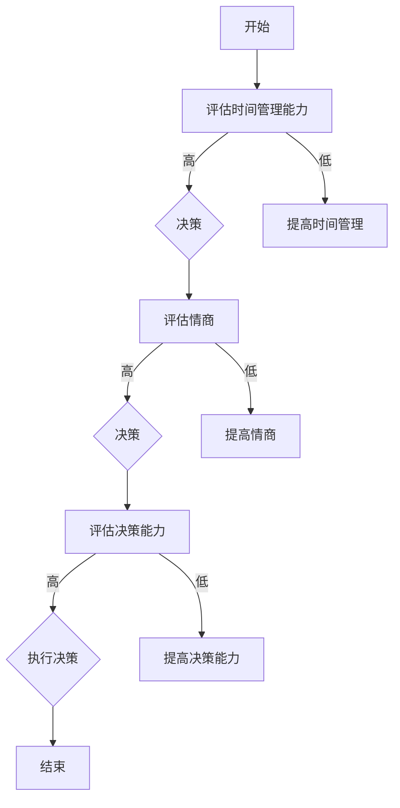

                 

### 第一部分：引言

## 第1章：问题背景与目标

### 1.1.1 自我管理的重要性

在现代社会中，自我管理是一项至关重要的能力，不仅对个人发展有着深远的影响，也是优秀领导者必备的素质之一。自我管理不仅仅涉及时间管理和情绪控制，更涵盖了对自身认知、目标和决策的管理。从时间管理角度看，自我管理意味着能够合理安排时间，最大化效率，避免拖延和资源的浪费。从情绪管理看，自我管理则要求个体能够保持情绪稳定，应对压力和挑战，避免情绪波动对工作和决策的影响。

对于领导者来说，自我管理更是一种基础素质。优秀的领导者不仅需要具备卓越的战略眼光和决策能力，还需要能够以身作则，引导团队成员共同进步。自我管理作为领导者的一种内在素质，能够帮助他们更好地理解自身，明确目标，做出合理决策，并在面对困难和挑战时保持冷静和坚韧。

### 1.1.2 领导者成长路径

成为一名优秀的领导者并非一蹴而就，而是需要经历一系列的成长路径。通常，领导者的成长路径可以分为以下几个阶段：

1. **自我认知阶段**：这一阶段主要涉及对自身的了解和认知，包括个人价值观、兴趣、优势和弱点等。领导者需要通过自我反思和反馈来不断提升自我认知，明确自己的发展方向。

2. **能力提升阶段**：在了解自身的基础上，领导者需要不断学习和提升各项能力，如沟通、决策、团队管理等。这一阶段要求领导者积极参与各种培训和实践活动，积累经验。

3. **实践应用阶段**：这一阶段是将所学知识和技能应用到实际工作中的过程。领导者需要在实际工作中不断调整和优化自己的管理方法，提升领导效果。

4. **自我管理阶段**：这一阶段是领导者成长的最高阶段，也是本文的重点。自我管理的核心在于能够有效地管理自己，包括时间、情绪和决策等方面。这一阶段要求领导者具备高度的自律性和自我调整能力，能够持续地提升自身的领导素质。

### 1.1.3 自我管理在领导力中的核心地位

自我管理是领导者素质的核心组成部分，它不仅直接影响领导者的个人表现，还通过对团队氛围和成员行为的影响，间接影响整个团队的效能。以下是自我管理在领导力中几个关键方面的作用：

1. **决策质量**：自我管理能力能够帮助领导者保持清晰的思维，减少冲动和情绪化决策，从而提高决策质量。

2. **团队氛围**：领导者的自我管理行为会对团队成员产生示范效应，良好的自我管理能够营造积极向上的团队氛围，提升团队凝聚力。

3. **应对挑战**：自我管理能力使得领导者能够在面对困难和压力时保持冷静和坚韧，有效地应对各种挑战。

4. **长远规划**：自我管理能力有助于领导者进行长期规划和目标设定，从而推动团队的持续发展和成长。

综上所述，自我管理不仅是领导者成长的重要一环，也是优秀领导力的核心要素之一。在接下来的章节中，我们将深入探讨自我管理的核心概念、关联要素以及具体的实践方法，帮助读者更好地理解和掌握这一重要能力。

## 第2章：核心概念与联系

### 2.1.1 自我管理的定义

自我管理，从广义上讲，是指个体在时间、情绪、决策等方面进行自我控制、自我调节和自我提升的过程。具体来说，它包括以下几个方面：

1. **时间管理**：合理安排和高效利用时间，以最大化产出和减少浪费。
2. **情绪管理**：保持情绪稳定，合理应对压力和挑战，避免情绪波动对工作和决策的负面影响。
3. **决策管理**：做出理性、明智的决策，考虑各种因素，避免冲动和盲从。

### 2.1.2 自我管理的核心要素

自我管理的核心要素可以概括为以下几点：

1. **自我认知**：了解自己的兴趣、价值观、优势和弱点，是自我管理的基础。
2. **目标设定**：明确个人和团队的目标，制定具体的计划和行动步骤。
3. **时间管理**：合理安排时间，提高工作效率，避免拖延和浪费。
4. **情绪管理**：保持情绪稳定，积极应对压力，提升情商。
5. **决策管理**：理性分析问题，制定有效决策，考虑长远影响。

### 2.1.3 自我管理与其他领导力概念的关联

自我管理与其他领导力概念有着密切的关联，是领导力的基础和核心组成部分。以下是一些关键关联：

1. **领导力**：自我管理是领导力的重要组成部分，领导者的自我管理能力直接影响到其领导效果和团队表现。
2. **情商**：自我管理中的情绪管理部分与情商密切相关，高情商的领导者能够更好地理解和管理自身和团队的情绪。
3. **决策力**：自我管理中的决策管理部分涉及到决策力，优秀领导者需要有强大的决策力来应对各种复杂情况。
4. **时间管理**：良好的时间管理是高效领导的重要保障，能够帮助领导者更好地安排工作，提升团队效能。

### 2.1.4 自我管理的属性特征对比

为了更清晰地理解自我管理的特性，我们可以将其与其他管理方法进行比较，如表1所示。

| 特性       | 自我管理                         | 其他管理                         |
|------------|--------------------------------|---------------------------------|
| 独立性     | 高                             | 较低                           |
| 自主性     | 强                             | 弱                             |
| 自我反思   | 持续                           | 偶尔                           |

### 2.1.5 自我管理与领导力ER图

在自我管理与领导力的关系中，可以借助实体关系图（Entity-Relationship Diagram, ER图）来直观地展示两者之间的关联。以下是一个简单的ER图，用于说明自我管理与领导力之间的关系：

```mermaid
erDiagram
  Person ||--|{ Leader } Leader : manages
  Leader ||--|{ Manager } Manager : supervises
  Manager ||--|{ SelfManager } SelfManager : practices self-management
```

在这个ER图中，"Person"（人）是基本实体，表示所有个体。"Leader"（领导者）和"Manager"（管理者）都是"Person"的子类，表示不同的角色。"SelfManager"（自我管理者）是"Manager"的一个特殊类型，代表那些能够进行自我管理的管理者。

通过上述核心概念的介绍和属性特征的对比，我们可以更深入地理解自我管理的内涵和其在领导力中的重要性。在接下来的章节中，我们将进一步探讨自我管理的数学模型和算法原理，帮助读者从更科学的角度理解和应用这一关键能力。

### 第3章：数学模型与算法原理

#### 3.1.1 自我管理的数学模型

自我管理的评价可以从多个维度进行，一个综合性的数学模型能够帮助我们更准确地评估个体的自我管理能力。以下是一个简单的自我管理评价模型：

$$
\text{Self-Management Score} = \alpha \cdot \text{Time Management} + \beta \cdot \text{Emotional Intelligence} + \gamma \cdot \text{Decision Making}
$$

其中，$\text{Self-Management Score}$ 表示自我管理得分，$\alpha$、$\beta$、$\gamma$ 是权重系数，分别表示时间管理、情绪智能和决策能力的相对重要性。$\text{Time Management}$、$\text{Emotional Intelligence}$ 和 $\text{Decision Making}$ 分别表示个体在这三个方面的得分。

#### 3.1.2 算法原理讲解与Mermaid流程图

为了更直观地理解自我管理的评估过程，我们可以使用Mermaid绘制一个流程图，展示如何通过具体步骤进行自我管理评估。



这个流程图展示了评估自我管理的步骤，包括评估时间管理能力、情商和决策能力，并根据评估结果决定是否需要提高相关能力。

#### 3.1.3 数学公式与详细讲解

为了更深入地理解自我管理的数学模型，我们可以进一步细化各个方面的得分计算方法。

1. **时间管理（Time Management）**：

时间管理能力可以通过以下几个因素来衡量：

- **任务计划性**：完成任务的计划性和执行力。
- **时间利用率**：单位时间内完成的任务量。
- **时间分配均衡性**：工作与休息的平衡。

每个因素可以用分数表示，例如：

$$
\text{Time Management} = 0.5 \cdot \text{Task Planning} + 0.3 \cdot \text{Time Utilization} + 0.2 \cdot \text{Time Balance}
$$

2. **情绪智能（Emotional Intelligence）**：

情绪智能可以通过自我调节、社交技能和同理心三个维度来衡量：

- **自我调节**：控制情绪和应对压力的能力。
- **社交技能**：与他人沟通和合作的能力。
- **同理心**：理解他人情感和需求的能力。

每个维度可以用分数表示，例如：

$$
\text{Emotional Intelligence} = 0.4 \cdot \text{Self-Regulation} + 0.3 \cdot \text{Social Skills} + 0.3 \cdot \text{Empathy}
$$

3. **决策能力（Decision Making）**：

决策能力可以通过理性分析、创造力和风险承受能力来衡量：

- **理性分析**：分析问题、评估选项的能力。
- **创造力**：提出创新解决方案的能力。
- **风险承受能力**：承担决策带来的风险的能力。

每个因素可以用分数表示，例如：

$$
\text{Decision Making} = 0.4 \cdot \text{Rationality} + 0.3 \cdot \text{Creativity} + 0.3 \cdot \text{Risk Tolerance}
$$

#### 举例说明

假设有一个人的时间管理得分为80分，情绪智能得分为70分，决策能力得分为85分。我们可以使用上述公式计算他的自我管理得分：

$$
\text{Self-Management Score} = 0.6 \cdot 80 + 0.3 \cdot 70 + 0.1 \cdot 85 = 54 + 21 + 8.5 = 83.5
$$

通过这个例子，我们可以看到，不同维度的得分对自我管理总得分的影响是不同的。这有助于我们了解自己在不同方面需要提升的能力。

综上所述，自我管理的数学模型提供了一个科学的方法来评估个体的自我管理能力。通过具体的公式和例子，我们可以更好地理解和应用这一模型，从而提升自我管理的水平。

### 3.1.4 自我管理的评估流程

为了更好地理解和实践自我管理，我们需要建立一个详细的评估流程。以下是一个基于前述数学模型的自我管理评估流程：

1. **初始评估**：首先，个体需要对自己在时间管理、情绪管理和决策能力三个方面的表现进行初始评估。可以通过自我反思、询问同事或导师等方式，收集相关数据。

2. **数据收集**：对于每个方面，可以进一步细化评估指标，例如，时间管理可以包括任务计划性、时间利用率和时间分配均衡性等。每个指标可以用分数或等级进行量化。

3. **分数计算**：根据评估指标，使用前述数学模型计算时间管理、情绪管理和决策能力的得分。例如，如果时间管理得分是80分，情绪智能得分是70分，决策能力得分是85分，则：

   $$
   \text{Self-Management Score} = 0.6 \cdot 80 + 0.3 \cdot 70 + 0.1 \cdot 85 = 54 + 21 + 8.5 = 83.5
   $$

4. **结果分析**：分析自我管理得分，了解自己在哪个方面表现较好，哪些方面需要提升。同时，比较不同维度的得分，找出影响自我管理总得分的瓶颈。

5. **制定计划**：根据分析结果，制定具体的提升计划。例如，如果时间管理得分较低，可以制定一个详细的日程表，提高任务计划性和执行力。如果情绪智能得分较低，可以学习情绪调节技巧，提高自我调节能力。

6. **实施计划**：按照制定的计划，逐步实施，持续跟踪和评估进展。可以定期回顾和调整计划，确保目标的实现。

7. **反馈与调整**：定期收集反馈，了解自我管理提升的效果。如果发现某些方法效果不佳，需要及时调整策略。

通过这个详细的评估流程，个体可以系统地提升自我管理能力，从而在工作和生活中表现得更加高效和自信。

### 第4章：自我管理的方法论

#### 4.1.1 设定目标与规划

自我管理的一个重要步骤是设定明确的目标并进行合理的规划。以下是几个关键步骤：

1. **目标明确**：明确个人的长期和短期目标，这些目标应当是具体、可衡量的。例如，"提高时间管理能力"这个目标太过宽泛，而"每天准时完成工作任务"则更加具体。

2. **目标分类**：将目标分为职业目标、个人发展目标和健康目标等，这样可以确保各个方面都能得到关注。

3. **制定行动计划**：为每个目标制定具体的行动计划，包括具体要完成的任务、时间安排和资源需求等。例如，为了提高时间管理能力，可以每天早上制定当天的任务清单，并确保按照计划执行。

4. **定期回顾**：定期回顾目标完成情况，根据实际情况调整计划。这有助于保持目标的灵活性，同时确保持续进步。

#### 4.1.2 时间管理与效率提升

时间管理是自我管理的重要组成部分，以下是一些有效的时间管理策略：

1. **优先级排序**：将任务按优先级排序，先完成最重要和最紧急的任务。可以使用“四象限法”来帮助排序，将任务分为“重要且紧急”、“重要但不紧急”、“不重要但紧急”和“不重要且不紧急”四类。

2. **制定日程表**：每天或每周制定日程表，将时间分配给不同的任务和活动。这有助于避免时间的浪费和任务的遗漏。

3. **避免拖延**：设定明确的截止时间和提醒，避免拖延。可以使用番茄工作法等工具来提高专注力和工作效率。

4. **时间分配均衡**：确保工作与休息之间的平衡，避免过度劳累。例如，可以采用“工作25分钟，休息5分钟”的模式。

#### 4.1.3 情绪管理与情商提升

情绪管理是自我管理中的另一个关键要素，以下是一些提升情绪管理能力的策略：

1. **自我认知**：了解自己的情绪变化，识别情绪触发因素。这可以通过日记或情绪追踪应用来实现。

2. **情绪调节**：学习情绪调节技巧，如深呼吸、冥想、运动等，帮助缓解压力和焦虑。

3. **社交技能**：提升社交技能，包括有效沟通、倾听和冲突解决能力，以更好地与他人互动。

4. **同理心**：培养同理心，尝试理解他人的情感和需求，这有助于改善人际关系。

#### 4.1.4 决策制定与优化

有效的决策制定是自我管理的重要方面，以下是一些决策制定的策略：

1. **信息收集**：在做出决策之前，收集所有相关的信息和数据。这有助于做出更全面、更准确的决策。

2. **理性分析**：使用逻辑和理性分析问题，考虑各种可能的结果和后果。

3. **创意思考**：鼓励创意思考，尝试不同的解决方案，避免固步自封。

4. **风险评估**：评估每个决策的风险和潜在后果，选择风险最低、收益最高的方案。

5. **持续改进**：根据决策的结果，不断反思和调整决策过程，以提升未来的决策质量。

通过上述方法，个体可以系统地提升自我管理能力，从而在工作和生活中表现得更加高效和自信。自我管理不仅有助于个人的成长，也是实现长期目标和提升领导力的基础。

### 第5章：自我管理的案例分析

#### 5.1.1 案例一：成功领导者的自我管理实践

在本节中，我们将通过一个实际案例来探讨成功领导者如何通过自我管理实践提升领导效果。这个案例涉及到一位技术公司的创始人兼CEO，张先生，他在自我管理方面做出了显著的成绩，为公司的发展和团队成员的满意度做出了重要贡献。

**案例背景**

张先生创立了一家专注于软件开发和云计算技术公司，公司成立初期，员工数量不超过50人。然而，随着业务的快速增长，公司面临着管理复杂度增加、市场竞争加剧、员工士气波动等挑战。张先生意识到，要想继续成功，他必须提升自己的自我管理能力，以应对这些挑战。

**自我管理实践**

1. **时间管理**：
   - **日程安排**：张先生每天早上都会花30分钟时间制定当天的日程表，确保工作有序进行。他还会定期回顾和调整日程，确保时间利用效率。
   - **优先级排序**：张先生使用“四象限法”来安排任务，将重要的紧急任务放在首位，确保关键任务按时完成。
   - **避免拖延**：他采用番茄工作法，每次专注工作25分钟，然后休息5分钟，以保持高效率。

2. **情绪管理**：
   - **情绪认知**：张先生通过写日记的方式记录自己的情绪变化，识别情绪触发因素。他还定期与心理教练交流，提升情绪认知能力。
   - **情绪调节**：张先生通过冥想和运动来缓解压力，保持情绪稳定。在情绪低落时，他会寻求同事的支持和鼓励。

3. **决策管理**：
   - **信息收集**：在做出重大决策前，张先生会广泛收集各方意见，进行充分的市场调研，以获取全面的信息。
   - **理性分析**：张先生习惯于使用逻辑和理性来分析问题，避免冲动决策。他会列出所有可能的选项，评估每个选项的优缺点。
   - **创意思考**：张先生鼓励团队成员提出新的想法和建议，他通过头脑风暴和创意思考会，激发团队的创造力。

**案例成果**

通过自我管理的实践，张先生在领导公司方面取得了显著成果：

- **团队士气提升**：张先生的情绪稳定和时间管理能力，使团队成员感受到了领导的关怀和支持，团队士气显著提升。
- **决策质量提高**：张先生的理性分析和信息收集能力，使决策过程更加科学和有效，公司的战略方向更加明确。
- **业务增长**：公司业务持续增长，市场份额不断扩大，成功吸引了一批优质的客户和合作伙伴。

**启示**

张先生的案例为其他领导者提供了宝贵的启示：

- **自我管理是领导力的基础**：通过自我管理，领导者可以更好地控制自己的情绪和时间，做出更明智的决策，从而提升整个团队的效能。
- **持续学习和自我提升**：自我管理能力不是一成不变的，需要通过持续学习和实践来不断提升。领导者应当定期反思自己的管理方法，寻找改进的机会。
- **关注团队发展**：领导者不仅需要关注业务成果，还需要关注团队成员的成长和发展。通过自我管理实践，领导者可以为团队提供更好的支持和指导。

通过这个案例，我们可以看到，自我管理在领导力中的关键作用。只有通过有效的自我管理，领导者才能在复杂多变的环境中保持稳定和高效，带领团队走向成功。

### 5.1.2 案例二：一位IT项目经理的自我管理实践

在这个案例中，我们来看一位IT项目经理李女士如何通过自我管理实践，成功领导了一个复杂的软件项目，并达到了预期目标。

**案例背景**

李女士是一位在IT行业工作了多年的项目经理，她负责管理一个新开发的客户关系管理系统（CRM）项目。该项目涉及多个部门，时间跨度长，技术难度高，风险大。项目开始时，团队士气低落，项目进度滞后，客户对交付时间感到不满。李女士意识到，要解决这些问题，她需要提升自我管理能力。

**自我管理实践**

1. **目标设定与规划**：
   - **明确目标**：李女士首先与客户和团队成员进行了深入的沟通，明确了项目的目标和预期成果。她将项目目标分解为多个具体的里程碑，并为每个里程碑设定了明确的截止日期。
   - **详细规划**：李女士制定了详细的项目计划，包括任务分配、资源需求和风险预案。她确保每个团队成员都清楚自己的职责和任务，提高了团队的工作效率。

2. **时间管理**：
   - **任务分解**：李女士将大任务分解为小任务，并为每个小任务分配了具体的执行时间和负责人。这种分解方法使得任务更加具体、可执行，减少了模糊性和不确定性。
   - **进度跟踪**：李女士使用项目管理工具（如Jira）来跟踪项目进度，定期更新任务状态，确保项目按计划进行。

3. **情绪管理**：
   - **自我调节**：在压力较大的阶段，李女士通过冥想和深呼吸练习来缓解压力。她学会了在面对挫折时保持冷静，并积极寻找解决方案。
   - **团队支持**：李女士鼓励团队成员分享自己的情绪和问题，建立了开放的沟通氛围。她定期组织团队建设活动，提高了团队的凝聚力和士气。

4. **决策管理**：
   - **信息收集**：李女士在做出重大决策前，会收集所有相关的信息和数据。她通过团队会议、客户反馈和市场调研来获取多方面的意见。
   - **理性分析**：在分析问题时，李女士使用逻辑和数据分析，避免冲动决策。她习惯于列出所有可能的选择，评估每个选择的利弊。
   - **灵活调整**：李女士能够根据项目进展和实际情况，灵活调整计划和策略，确保项目的最终成功。

**案例成果**

通过自我管理的实践，李女士成功地领导了项目，并取得了以下成果：

- **项目成功交付**：在李女士的领导下，项目按计划完成了所有里程碑，最终顺利交付给客户。客户对交付成果表示满意，并给予了积极的评价。
- **团队成长**：团队成员在项目过程中得到了锻炼和提升，李女士的领导风格和自我管理实践为团队成员树立了榜样。
- **个人发展**：李女士通过项目的成功，证明了自己的能力和价值，得到了公司的认可和晋升。

**启示**

李女士的案例为其他项目经理提供了以下启示：

- **自我管理是项目成功的关键**：通过有效的自我管理，项目经理可以更好地规划项目、管理时间和决策，从而提高项目成功率。
- **持续学习与反思**：项目经理需要不断学习和提升自己的管理技能，通过反思和实践来不断改进自己的管理方法。
- **团队支持与沟通**：建立良好的团队关系和沟通渠道，有助于提高团队的凝聚力和工作效率。

通过这个案例，我们可以看到，自我管理在项目管理中的重要作用。有效的自我管理不仅可以帮助项目经理更好地应对项目挑战，还能促进团队的成长和项目成功。

### 总结与结论

通过前文的深入分析和案例分析，我们可以清晰地看到自我管理在领导者个人发展和团队效能提升中的关键作用。无论是从时间管理、情绪管理还是决策管理三个方面，自我管理都为领导者提供了有效的方法和策略，帮助他们更好地控制自己的行为和情绪，做出明智的决策。

**时间管理**是自我管理的基础，通过合理安排时间，提高工作效率，避免拖延和浪费，领导者可以确保工作任务的顺利完成。**情绪管理**则帮助领导者保持情绪稳定，积极应对压力和挑战，避免情绪波动对工作和决策的负面影响。**决策管理**则通过理性分析和信息收集，提升决策的科学性和有效性，确保团队在复杂多变的环境中保持稳定和高效。

在案例分析中，我们看到了两位成功领导者——张先生和李女士——如何通过自我管理实践，成功应对了各自的挑战，实现了个人和团队的成长。张先生通过情绪稳定和时间管理，提升了团队士气，推动了公司业务的发展；李女士则通过详细的规划、有效的情绪管理和灵活的决策，成功完成了复杂的项目，得到了客户的认可和团队的信任。

总之，自我管理不仅是优秀领导者的必备素质，也是个人成长和团队效能提升的关键。通过有效的自我管理，领导者可以更好地应对各种挑战，实现长远目标，同时为团队成员树立榜样，推动整个团队不断进步。

**建议与未来方向**

为了进一步深化自我管理实践，以下是一些建议和未来研究方向：

1. **持续学习与反思**：领导者应不断学习新的管理理论和实践经验，通过反思和总结，不断提升自我管理能力。

2. **定制化自我管理计划**：每个领导者的背景和需求不同，应制定个性化的自我管理计划，根据实际情况进行调整。

3. **技术与工具的应用**：利用现代科技和工具（如时间管理应用、情绪监控设备等），提高自我管理的效率和效果。

4. **跨领域研究**：结合心理学、管理学、计算机科学等领域的知识，开发更加科学和系统的自我管理模型和方法。

5. **团队自我管理培训**：组织团队自我管理培训，提升团队的整体自我管理能力，促进团队协作和效能提升。

通过这些建议和未来研究方向，我们可以期待在自我管理领域取得更多的突破，为领导者的个人发展和团队效能提升提供更加有力的支持。

