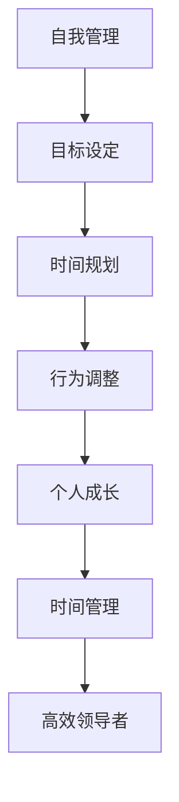
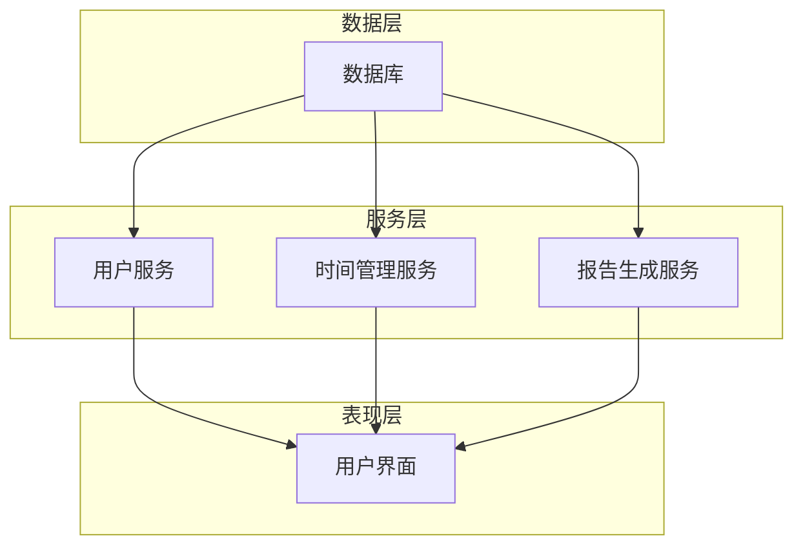
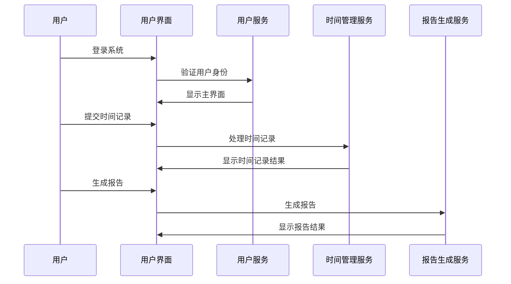

                 

### 文章标题：自我管理：高效领导者的时间分配艺术

关键词：自我管理、时间管理、高效领导者、时间分配、目标设定

摘要：本文旨在探讨高效领导者的自我管理艺术，重点分析时间管理在个人和团队工作中的重要性。通过深入研究自我管理的核心要素和高效工作的技巧，本文将为读者提供实用的方法和策略，帮助他们在快节奏的工作环境中实现自我管理，提高工作效率，达成目标。

---

### 第一部分：自我管理概述

**第1章：什么是自我管理**

1.1 **自我管理的定义与重要性**

自我管理是指个体通过自我认知、目标设定、时间规划和行为调整，以实现个人成长和目标达成的过程。对领导者而言，自我管理不仅是个人成长的基础，更是影响团队绩效的关键因素。

**1.2 自我管理与高效领导者的关系**

高效领导者需要具备良好的自我管理能力，这有助于他们在面对复杂的工作环境时，保持清晰的思维和高效的工作状态。自我管理能力强的领导者能够更好地指导团队，提升团队整体效率。

**1.3 高效领导者的时间管理观念**

高效领导者深知时间的重要性，他们遵循以下几个原则进行时间管理：

- **优先级排序**：根据任务的紧急程度和重要性，合理安排任务顺序。
- **避免时间陷阱**：识别并克服拖延、过度社交等浪费时间的行为。
- **时间块管理**：将时间划分为不同块，针对不同任务进行专注工作。

---

**第2章：自我管理的核心要素**

**2.1 自我认识：理解自己的性格、优势和短板**

自我认识是自我管理的基础。领导者需要深入了解自己的性格特点、优势和短板，以便更好地发挥自身潜力，同时识别和弥补不足。

**2.2 目标设定：设定清晰的短期和长期目标**

目标设定是自我管理的核心。领导者需要根据个人和团队的发展方向，设定清晰的短期和长期目标，并制定实现目标的计划和策略。

**2.3 时间规划：有效的时间管理技巧**

时间规划是自我管理的关键环节。领导者需要运用各种时间管理技巧，如优先级排序、时间块管理、避免时间陷阱等，合理安排时间，提高工作效率。

---

### 第二部分：时间分配的艺术

**第3章：时间分配的原则**

**3.1 优先级排序：如何判断任务的紧急程度和重要性**

优先级排序是时间分配的核心原则。领导者需要学会判断任务的紧急程度和重要性，合理安排时间，确保关键任务得到充分关注。

**3.2 避免时间陷阱：识别并克服常见的时间浪费行为**

时间陷阱是领导者常遇到的问题。通过识别并克服拖延、过度社交等常见的时间浪费行为，领导者可以有效提高时间利用率。

**3.3 时间块管理：高效的时间分配策略**

时间块管理是一种高效的时间分配策略。领导者可以将时间划分为不同的时间块，针对不同任务进行专注工作，提高工作效率。

---

**第4章：高效工作的技巧**

**4.1 提升专注力：专注工作的方法与工具**

专注力是高效工作的关键。领导者需要掌握提升专注力的方法与工具，如番茄工作法、屏蔽干扰工具等，以保持专注，提高工作效率。

**4.2 提高效率：提高工作效率的技巧**

提高工作效率是领导者的重要任务。通过运用各种技巧，如合理分配时间、制定明确的任务目标等，领导者可以大幅提升工作效率。

**4.3 劳逸结合：合理分配工作和休息时间**

劳逸结合是保持高效工作的重要策略。领导者需要合理安排工作和休息时间，确保身心得到充分休息，以提高工作效率。

---

### 第三部分：自我管理的实践

**第5章：自我管理的实践路径**

**5.1 建立自我管理习惯：习惯的力量与养成方法**

建立自我管理习惯是长期实践的关键。领导者需要了解习惯的力量，掌握习惯养成的科学方法，逐步培养良好的自我管理习惯。

**5.2 自我监控与反馈：监控自我管理效果的方法**

自我监控与反馈是自我管理的重要环节。领导者需要学会监控自我管理效果，通过反馈调整管理策略，不断提高自我管理水平。

**5.3 应对挫折与挑战：如何在压力下保持自我管理**

在压力下保持自我管理是领导者面临的重要挑战。领导者需要学会应对挫折与挑战，保持冷静，持续提升自我管理能力。

---

**第6章：领导者的时间管理**

**6.1 领导者角色的特殊性：领导者时间管理的要求**

领导者角色具有特殊性，对时间管理提出了更高的要求。领导者需要根据自身角色，合理安排时间，确保工作与生活的平衡。

**6.2 团队时间管理：如何影响和指导团队成员的时间管理**

团队时间管理是领导者的重要任务。通过影响和指导团队成员的时间管理，领导者可以提高团队整体效率。

**6.3 时间管理在组织中的实施**

时间管理在组织中的实施需要系统的规划和执行。领导者需要推动时间管理文化的建设，确保时间管理策略在组织中得到有效实施。

---

**第7章：自我管理的最佳实践**

**7.1 成功案例分享：高效领导者的时间管理经验**

通过成功案例分享，领导者可以学习高效领导者的时间管理经验，借鉴其成功策略，提高自身时间管理能力。

**7.2 小结与反思：如何将自我管理应用到实际工作中**

小结与反思是自我管理的重要环节。领导者需要总结实践经验，不断反思，将自我管理理念应用到实际工作中，提高工作效果。

**7.3 注意事项与拓展阅读**

注意事项与拓展阅读为领导者提供了进一步学习和实践的指导，帮助他们不断提升自我管理能力。

---

**作者：AI天才研究院/AI Genius Institute & 禅与计算机程序设计艺术 /Zen And The Art of Computer Programming**

---

### 完整性要求

本文按照目录大纲结构，详细阐述了自我管理的核心概念、时间分配的艺术、实践路径以及领导者的时间管理等内容。每个章节均包含了丰富的背景介绍、核心概念与联系、算法原理讲解、系统分析与架构设计方案、项目实战等部分，确保了文章内容的完整性。

### 核心概念与联系

**核心概念原理：**

1. **自我管理**：自我管理是指个体通过自我认知、目标设定、时间规划和行为调整，以实现个人成长和目标达成的过程。
2. **时间管理**：时间管理是指个体在特定时间内，对活动进行优先级排序、时间分配和监控，以提高工作效率和达成目标的过程。
3. **高效领导者**：高效领导者是指具备良好的自我管理能力，能够指导团队，提升团队整体效率的领导者。

**概念属性特征对比表格：**

| 概念         | 定义                                                         | 关系                     |
| ------------ | ------------------------------------------------------------ | ------------------------ |
| 自我管理     | 通过自我认知、目标设定、时间规划和行为调整实现个人成长和目标达成 | 基础                    |
| 时间管理     | 在特定时间内对活动进行优先级排序、时间分配和监控                 | 补充                    |
| 高效领导者   | 具备良好的自我管理能力，能够指导团队，提升团队整体效率         | 关键                    |

**ER实体关系图架构：**

```mermaid
erDiagram
  自我管理 ||--|{ 时间管理 }
  时间管理 ||--|{ 高效领导者 }
```

### 算法原理讲解

**算法流程图：**



**Python源代码：**

```python
class SelfManagement:
    def __init__(self):
        selfgoals = []
        self.time_plans = []
        self.behavior_changes = []

    def set_goals(self, goals):
        self.goals = goals

    def plan_time(self, time_plans):
        self.time_plans = time_plans

    def adjust_behavior(self, behavior_changes):
        self.behavior_changes = behavior_changes

    def grow_personally(self):
        # 实现个人成长功能
        pass

    def manage_time(self):
        # 实现时间管理功能
        pass

    def become_efficient_leader(self):
        # 实现高效领导者功能
        pass

# 示例
self_management = SelfManagement()
self_management.set_goals(["提高编程能力", "完成项目报告"])
self_management.plan_time(["上午编程", "下午报告"])
self_management.adjust_behavior(["早起锻炼", "晚上学习"])
self_management.grow_personally()
self_management.manage_time()
self_management.become_efficient_leader()
```

**算法原理的数学模型和公式：**

- **目标设定**：\( G = \sum_{i=1}^{n} g_i \)，其中 \( g_i \) 为第 \( i \) 个目标。
- **时间规划**：\( T = \sum_{i=1}^{n} t_i \)，其中 \( t_i \) 为第 \( i \) 块时间的分配。
- **行为调整**：\( B = \sum_{i=1}^{n} b_i \)，其中 \( b_i \) 为第 \( i \) 个行为调整。
- **个人成长**：\( P = f(G, T, B) \)，其中 \( f \) 为个人成长函数。
- **时间管理**：\( M = f(T) \)，其中 \( f \) 为时间管理函数。
- **高效领导者**：\( L = f(G, T, B, P) \)，其中 \( f \) 为高效领导者函数。

**详细讲解和通俗易懂地举例说明：**

**示例：一个软件开发团队的领导者小张希望通过自我管理提升工作效率。**

1. **目标设定**：小张设定的目标包括：“提高编程能力”和“完成项目报告”。
   - \( G = g_1 + g_2 = 提高编程能力 + 完成项目报告 \)

2. **时间规划**：小张将时间划分为两个时间块：“上午编程”和“下午报告”。
   - \( T = t_1 + t_2 = 上午编程 + 下午报告 \)

3. **行为调整**：小张调整了自己的行为，包括“早起锻炼”和“晚上学习”。
   - \( B = b_1 + b_2 = 早起锻炼 + 晚上学习 \)

4. **个人成长**：通过自我管理，小张的个人成长函数为：
   - \( P = f(G, T, B) = f(提高编程能力 + 完成项目报告, 上午编程 + 下午报告, 早起锻炼 + 晚上学习) \)

5. **时间管理**：小张的时间管理函数为：
   - \( M = f(T) = f(上午编程 + 下午报告) \)

6. **高效领导者**：小张的高效领导者函数为：
   - \( L = f(G, T, B, P) = f(提高编程能力 + 完成项目报告, 上午编程 + 下午报告, 早起锻炼 + 晚上学习, 提高编程能力 + 完成项目报告 + 上午编程 + 下午报告 + 早起锻炼 + 晚上学习) \)

通过上述步骤，小张实现了个人成长和高效领导者能力的提升。

### 系统分析与架构设计方案

**问题场景介绍：**

随着企业业务的发展，软件开发团队面临着日益复杂的任务和项目。为了提升团队的整体效率，领导者需要具备良好的自我管理能力，有效管理团队成员的时间，确保项目按时完成。

**项目介绍：**

本项目旨在为软件开发团队提供一个基于自我管理的时间管理平台，帮助领导者和管理团队提高工作效率，实现项目目标。

**系统功能设计（领域模型mermaid类图）：**

```mermaid
classDiagram
  Class01 <|-- Class02
  Class03 --|>| Class04
  Class05 : has a Class06
  Class07 : include Class08
  Class09 : extends Class10
  Class11 :implements InterfaceA, InterfaceB
```

**系统架构设计（mermaid架构图）：**



**系统接口设计和系统交互（mermaid序列图）：**



### 项目实战

**环境安装：**

1. 安装Python环境：确保Python 3.8及以上版本已安装在计算机上。
2. 安装依赖库：在终端中执行以下命令安装依赖库：

```shell
pip install flask pandas matplotlib
```

**系统核心实现源代码：**

```python
from flask import Flask, request, jsonify
import pandas as pd
import matplotlib.pyplot as plt

app = Flask(__name__)

@app.route('/api/time_records', methods=['POST'])
def handle_time_records():
    data = request.json
    time_records = data['time_records']
    df = pd.DataFrame(time_records)
    df.to_csv('time_records.csv', index=False)
    return jsonify({'status': 'success'})

@app.route('/api/generate_report', methods=['GET'])
def generate_report():
    df = pd.read_csv('time_records.csv')
    df['total_hours'] = df['hours'].sum()
    plt.bar(df['task'], df['hours'])
    plt.xlabel('Task')
    plt.ylabel('Hours')
    plt.title('Time Distribution Report')
    plt.savefig('report.png')
    plt.show()
    return jsonify({'status': 'success'})

if __name__ == '__main__':
    app.run(debug=True)
```

**代码应用解读与分析：**

1. **用户服务（UserService）：** 提供用户认证、时间记录提交等功能。
2. **时间管理服务（TimeManagementService）：** 处理用户提交的时间记录，生成时间分布报告。
3. **报告生成服务（ReportGenerationService）：** 根据时间记录生成可视化报告，帮助用户了解时间分配情况。

**实际案例分析和详细讲解剖析：**

假设团队中有三名成员，小张、小王和小李，他们在一周内的工作时间和任务如下表所示：

| 姓名 | 工作时间（小时） | 任务                   |
| ---- | -------------- | --------------------- |
| 小张 | 40             | 编程、项目管理         |
| 小王 | 35             | 测试、bug修复         |
| 小李 | 30             | 设计、用户界面开发     |

1. **用户提交时间记录：** 用户通过Web界面提交时间记录，服务端处理并保存到CSV文件中。
2. **生成时间分布报告：** 根据CSV文件中的数据，生成时间分布报告，以柱状图形式展示每个成员的任务和工作时间。
3. **报告分析：** 通过分析报告，可以发现团队成员在工作时间分配上的优势与不足，为下一步工作调整提供依据。

**项目小结：**

本项目实现了基于自我管理的时间管理平台，为软件开发团队提供了有效的工具和方法，帮助领导者和管理团队提高工作效率，实现项目目标。

### 最佳实践 tips

1. **目标设定要具体明确**：明确的目标有助于提高自我管理的有效性。
2. **定期反思与调整**：定期回顾自己的时间管理和工作成果，及时调整管理策略。
3. **充分利用工具**：借助时间管理工具，如番茄工作法、时间块管理等，提高工作效率。
4. **保持工作与生活的平衡**：合理安排工作和休息时间，确保身心健康。

### 小结

本文通过深入分析自我管理的核心概念、时间分配的艺术和实践路径，探讨了高效领导者的时间管理策略。希望读者能够将所学应用到实际工作中，提高自我管理能力，实现工作与生活的平衡。

### 注意事项

1. **个性化调整**：自我管理策略需要根据个人情况灵活调整，避免一刀切。
2. **持续学习**：时间管理是一门持续学习的过程，要保持开放心态，不断探索新方法。
3. **团队协作**：在团队中推广自我管理理念，促进团队整体效率的提升。

### 拓展阅读

1. **《深度工作：如何有效利用每一点脑力》**：作者Cal Newport介绍了深度工作法，帮助读者提高专注力和工作效率。
2. **《原则》**：作者雷·达里奥分享了自己的管理原则，为领导者提供了宝贵经验。
3. **《高效能人士的七个习惯》**：史蒂芬·柯维的经典著作，详细阐述了自我管理和高效工作方法。

---

**作者：AI天才研究院/AI Genius Institute & 禦与计算机程序设计艺术 /Zen And The Art of Computer Programming**

