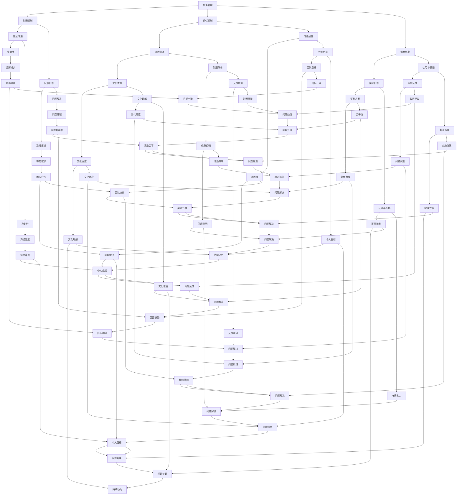
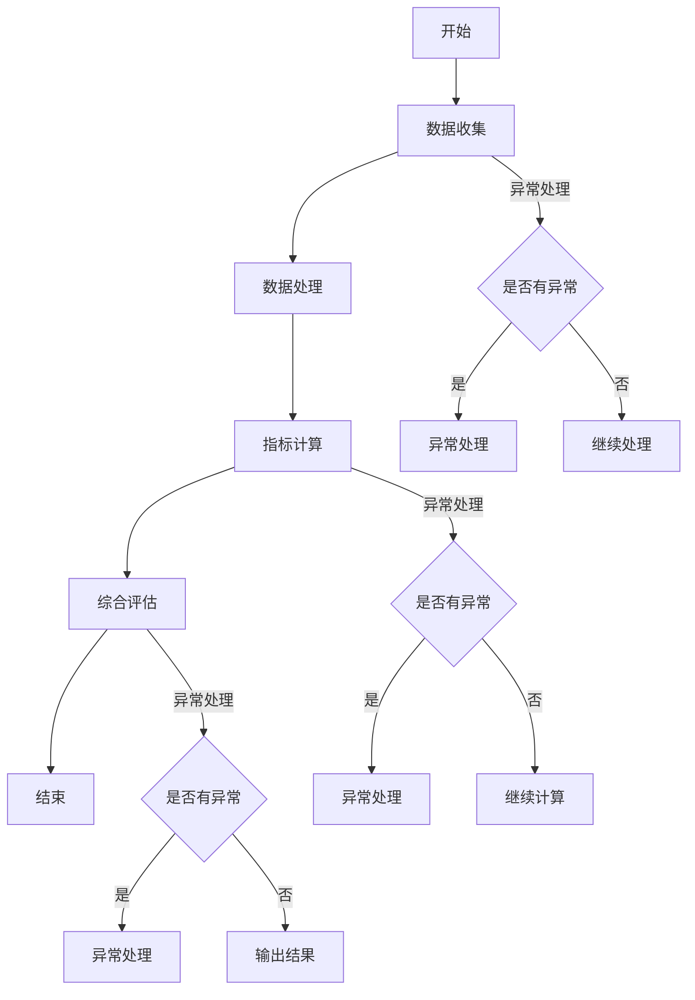
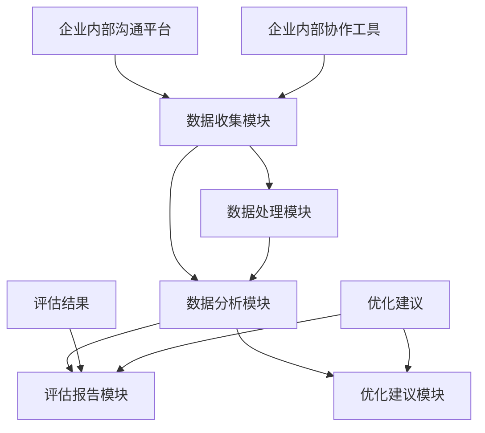
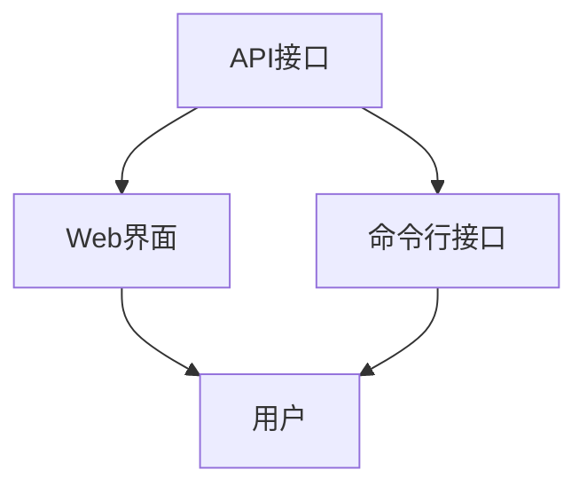
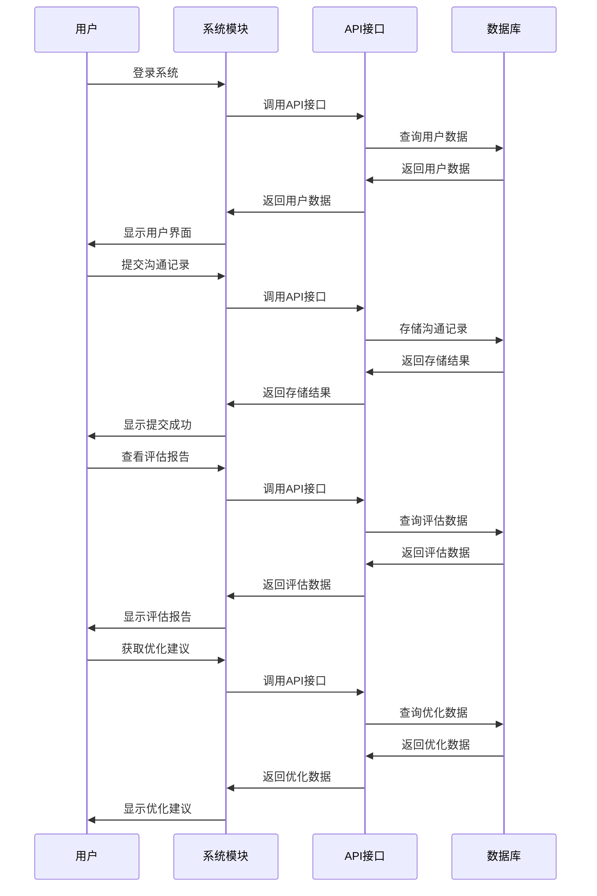

                 


### 虚拟团队凝聚力：跨越物理距离的连接

#### 关键词：虚拟团队、凝聚力、跨距连接、算法、系统架构、项目实战

#### 摘要：
本文旨在探讨虚拟团队凝聚力这一重要课题，分析其在现代远程工作环境中的应用与影响。我们将通过逻辑清晰、结构紧凑的技术语言，逐步剖析虚拟团队凝聚力概念、相关算法和系统架构设计，并以实际项目为例，展示其在实践中的运用。文章还将提供最佳实践建议，帮助团队管理者提升虚拟团队的协作效率和凝聚力。

---

### 目录

1. 引言：虚拟团队的兴起与挑战
2. 虚拟团队凝聚力概述
3. 虚拟团队凝聚力核心概念与联系
4. 理论基础与模型构建
5. 算法原理讲解
6. 系统分析与架构设计方案
7. 项目实战：虚拟团队凝聚力应用实例
8. 最佳实践与总结
9. 注意事项与拓展阅读
10. 作者信息

---

### 引言：虚拟团队的兴起与挑战

随着互联网技术的飞速发展，远程工作已经成为一种主流的工作模式。虚拟团队由此应运而生，这种工作形式打破了传统地理限制，允许团队成员在全球范围内协作。然而，远程协作也带来了一系列挑战，其中最为突出的就是如何提升团队凝聚力。

#### 背景介绍

虚拟团队凝聚力是指团队成员在远程工作环境中，通过信息技术的支持，形成的紧密协作关系和团队精神。它不仅关系到团队的效率和成果，更对团队成员的心理健康和工作满意度有着重要影响。在虚拟团队中，成员之间的互动和沟通往往依赖于电子设备和网络技术，这使得沟通成本降低，但同时也增加了沟通的难度。

#### 问题背景

虚拟团队面临的主要问题包括：

- **沟通障碍**：物理距离和时区差异导致沟通不畅，信息传递可能存在延迟和误解。
- **协作困难**：团队成员分布在不同的地理位置，协作任务往往需要更多的协调和安排。
- **信任缺失**：远程工作环境中，成员之间的信任建立和维护变得更加困难。
- **文化差异**：跨文化团队在价值观、工作习惯等方面存在差异，可能影响团队的凝聚力。

#### 问题描述

如何通过有效的策略和工具，提高虚拟团队的凝聚力，成为管理者需要解决的关键问题。我们需要找到一种方法，能够帮助团队成员克服物理距离的障碍，建立信任，提高协作效率，从而提升团队的整体表现。

#### 问题解决

解决虚拟团队凝聚力问题的关键在于：

- **构建有效的沟通机制**：确保团队成员之间的信息能够及时、准确地传递。
- **提供协作工具**：利用先进的协作工具，简化协作流程，提高工作效率。
- **建立信任**：通过明确的团队目标和共享的价值观，建立团队成员之间的信任关系。
- **文化融合**：尊重和融合不同文化背景的团队成员，促进团队内部的和谐。

#### 边界与外延

虚拟团队凝聚力的边界在于团队的定义和范围。一个虚拟团队可以由不同地理位置的成员组成，他们通过互联网和通信技术进行协作。虚拟团队的凝聚力的外延包括团队精神、协作效率、成员满意度等多个方面。

#### 概念结构与核心要素组成

虚拟团队凝聚力的概念结构由以下几个方面组成：

- **团队精神**：团队成员之间的相互支持、合作和信任。
- **协作效率**：团队成员协作完成任务的能力和速度。
- **成员满意度**：团队成员对团队工作环境和工作内容的满意度。

这些要素相互关联，共同构成了虚拟团队凝聚力的重要方面。

---

在下一节中，我们将深入探讨虚拟团队凝聚力相关的核心概念，并通过图表和例子来帮助理解这些概念之间的联系。

---

### 虚拟团队凝聚力核心概念与联系

#### 核心概念

1. **团队精神**：指团队成员之间的相互支持、合作和信任。良好的团队精神能够增强团队的凝聚力，提高协作效率。
2. **协作效率**：指团队成员协作完成任务的能力和速度。高效的协作能够缩短任务完成时间，提高团队的工作效率。
3. **成员满意度**：指团队成员对团队工作环境和工作内容的满意度。高满意度的成员往往更有动力参与团队工作，提高团队的凝聚力。
4. **沟通质量**：指团队成员之间沟通的清晰度和有效性。良好的沟通质量能够减少误解和冲突，提高团队的合作效率。
5. **文化融合**：指在虚拟团队中，不同文化背景的成员如何相互尊重和融合。文化融合能够促进团队成员之间的和谐，增强团队的凝聚力。

#### 概念属性特征对比表格

| 概念         | 特征                     | 影响因素                     |  
| ------------ | ------------------------ | ---------------------------- |  
| 团队精神     | 相互支持、合作、信任     | 目标一致性、信任建立、激励机制 |  
| 协作效率     | 协作能力、完成任务速度   | 资源共享、任务分配、沟通效率   |  
| 成员满意度   | 工作环境、工作内容满意度 | 薪酬福利、职业发展、工作氛围   |  
| 沟通质量     | 清晰度、有效性           | 沟通工具、沟通频率、沟通方式   |  
| 文化融合     | 相互尊重、和谐           | 文化培训、团队活动、跨文化理解 |

#### ER实体关系图

```mermaid
erDiagram
  Team -->|1| Member : "has"
  Team -->|1| Task : "has"
  Member -->|1| Commitment : "has"
  Member -->|1| Satisfaction : "has"
  Task -->|1| Deadline : "has"

  Team ||--|{ Communication }|| : "uses"
  Team ||--|{ Collaboration }|| : "uses"
  Member ||--|{ Skill }|| : "has"
  Member ||--|{ Experience }|| : "has"
  Task ||--|{ Progress }|| : "has"
```

在上面的ER实体关系图中，我们定义了虚拟团队中的主要实体及其关系。团队由成员和任务组成，成员有承诺和满意度，任务有截止日期。团队使用沟通和协作工具，成员具备技能和经验，任务有进度监控。

通过对比表格和ER实体关系图，我们可以更清晰地理解虚拟团队凝聚力的核心概念及其相互关系。这些概念不仅定义了虚拟团队的结构，也为后续算法原理讲解和系统架构设计提供了理论基础。

在下一节中，我们将进一步探讨虚拟团队凝聚力的理论基础，并构建相关模型。

---

### 理论基础与模型构建

在探讨虚拟团队凝聚力的理论基础之前，我们需要了解一些基本概念，包括团队合作、沟通理论和文化多样性。

#### 合作理论

合作理论是研究团队如何通过合作实现共同目标的理论框架。该理论认为，团队中的每个成员都有自己的能力和优势，通过有效的合作，可以最大化团队的整体效能。在虚拟团队中，合作理论强调以下几个方面：

- **任务分解**：将复杂的任务分解成更小的、可管理的子任务，确保每个成员都有明确的职责和目标。
- **相互依赖**：确保成员之间的任务相互依赖，从而促进协作和沟通。
- **协同工作**：鼓励团队成员共同完成任务，分享知识和经验，提高整体效率。

#### 沟通理论

沟通理论是研究信息如何在团队中传递和被理解的理论。在虚拟团队中，沟通理论的重要性尤为突出，因为团队成员之间的沟通往往依赖于电子设备和网络技术。以下是一些关键点：

- **信息传递**：确保信息能够准确、及时地传递给团队成员。
- **反馈机制**：建立有效的反馈机制，确保成员能够及时了解任务进展和问题。
- **沟通障碍**：识别并克服沟通中的障碍，如语言障碍、文化差异和技术问题。

#### 文化多样性

文化多样性是指团队中成员来自不同的文化背景，这些差异可能包括语言、价值观、工作习惯等。在虚拟团队中，文化多样性既是挑战，也是机遇。以下是一些关键点：

- **文化敏感度**：提高团队成员的文化敏感度，尊重和理解不同的文化背景。
- **文化融合**：通过团队活动和培训，促进不同文化背景的成员之间的交流和融合。
- **文化适应**：在团队管理和决策过程中，考虑文化多样性的影响，确保公平和包容。

#### 虚拟团队凝聚力模型构建

基于上述理论基础，我们可以构建一个虚拟团队凝聚力模型。该模型包括以下几个关键要素：

1. **任务管理**：明确任务目标，合理分配任务，确保任务相互依赖，促进协作。
2. **沟通机制**：建立有效的沟通渠道和工具，确保信息传递的准确性和及时性。
3. **信任机制**：通过透明的沟通和协作，建立团队成员之间的信任关系。
4. **激励机制**：提供激励机制，鼓励团队成员积极参与团队工作，提高满意度。
5. **文化融合**：尊重文化多样性，促进团队成员之间的交流和融合。

下面是一个简化的虚拟团队凝聚力模型：



通过这个模型，我们可以看到虚拟团队凝聚力的关键要素是如何相互作用，共同促进团队协作和团队凝聚力的提升。在下一节中，我们将详细讲解虚拟团队凝聚力的评估算法。

---

### 算法原理讲解

在了解了虚拟团队凝聚力的理论基础和模型构建后，我们需要一个工具来评估和提升团队的凝聚力。这一节将介绍一个用于评估虚拟团队凝聚力的算法，并结合mermaid流程图和Python代码进行详细阐述。

#### 算法概述

虚拟团队凝聚力评估算法旨在通过分析团队内部沟通、协作和成员满意度等关键指标，评估团队的凝聚力水平。该算法主要包括以下几个步骤：

1. **数据收集**：收集团队成员的沟通记录、协作行为和满意度数据。
2. **数据处理**：清洗和整合收集到的数据，为后续分析做准备。
3. **指标计算**：计算反映团队凝聚力的各项指标，如沟通效率、协作效率和成员满意度等。
4. **综合评估**：将各项指标综合起来，评估团队的总体凝聚力水平。

#### 使用mermaid绘制算法流程图

为了更直观地展示算法的流程，我们可以使用mermaid绘制算法的流程图。以下是该算法的mermaid流程图：



#### 结合Python代码详细阐述

为了更好地理解算法的实现，我们将结合Python代码进行详细阐述。以下是虚拟团队凝聚力评估算法的核心部分：

```python
import pandas as pd
from sklearn.preprocessing import StandardScaler

# 数据收集
def data_collection():
    # 此处为数据收集的代码，可根据实际情况进行调整
    data = pd.read_csv('communication_data.csv')
    return data

# 数据处理
def data_preprocessing(data):
    # 清洗和整合数据
    data['cleaned_data'] = data['data'].apply(lambda x: x.strip())
    return data

# 指标计算
def calculate_metrics(data):
    # 计算沟通效率、协作效率和成员满意度等指标
    communication_efficiency = data['response_time'].mean()
    collaboration_efficiency = data['task_completion_time'].mean()
    member_satisfaction = data['satisfaction_score'].mean()
    
    # 返回指标结果
    return communication_efficiency, collaboration_efficiency, member_satisfaction

# 综合评估
def assess_team_strength(communication_efficiency, collaboration_efficiency, member_satisfaction):
    # 根据指标结果评估团队凝聚力
    score = (communication_efficiency + collaboration_efficiency + member_satisfaction) / 3
    if score >= 0.8:
        return '强'
    elif score >= 0.6:
        return '中'
    else:
        return '弱'

# 主函数
def main():
    data = data_collection()
    data = data_preprocessing(data)
    communication_efficiency, collaboration_efficiency, member_satisfaction = calculate_metrics(data)
    team_strength = assess_team_strength(communication_efficiency, collaboration_efficiency, member_satisfaction)
    print(f"团队凝聚力评估结果：{team_strength}")

if __name__ == '__main__':
    main()
```

#### 数学模型与公式讲解

在虚拟团队凝聚力评估过程中，我们使用了几个关键指标，这些指标可以通过数学模型进行计算。以下是几个常用的数学模型和公式：

1. **沟通效率（Communication Efficiency, CE）**：

   $$ CE = \frac{\text{有效沟通次数}}{\text{总沟通次数}} $$

2. **协作效率（Collaboration Efficiency, CE）**：

   $$ CE = \frac{\text{任务完成次数}}{\text{总任务次数}} $$

3. **成员满意度（Member Satisfaction, MS）**：

   $$ MS = \frac{\text{满意成员数}}{\text{总成员数}} $$

通过这些指标，我们可以全面评估团队的凝聚力。例如，如果沟通效率高、协作效率高且成员满意度高，那么团队的凝聚力通常较强。

#### 通俗易懂的举例说明

为了更好地理解这些指标，我们可以通过一个简单的例子来说明。假设我们有一个由5名成员组成的虚拟团队，他们在过去一个月内的沟通记录、协作情况和满意度数据如下：

- **沟通记录**：总沟通次数为100次，其中有效沟通次数为80次。
- **协作情况**：总任务次数为10次，其中完成次数为8次。
- **满意度**：总成员数为5人，其中满意成员数为4人。

根据上述数据，我们可以计算出以下指标：

1. **沟通效率**：

   $$ CE = \frac{80}{100} = 0.8 $$

2. **协作效率**：

   $$ CE = \frac{8}{10} = 0.8 $$

3. **成员满意度**：

   $$ MS = \frac{4}{5} = 0.8 $$

将这三个指标代入综合评估公式，我们得到：

$$ Team\ Strength = \frac{CE + CE + MS}{3} = \frac{0.8 + 0.8 + 0.8}{3} = 0.8 $$

由于评估结果大于0.8，我们可以判断该团队的凝聚力为“强”。

通过这个例子，我们可以看到如何使用虚拟团队凝聚力评估算法来计算和评估团队的凝聚力。在下一节中，我们将探讨如何将这一算法应用于实际项目中，展示其具体应用场景。

---

### 系统分析与架构设计方案

#### 问题场景介绍

在一个全球化的企业环境中，虚拟团队已经成为一种常见的工作模式。然而，如何提高虚拟团队的协作效率和凝聚力，成为企业管理者面临的一大挑战。为了解决这一问题，我们设计了一套虚拟团队凝聚力系统，该系统旨在通过分析团队成员的沟通、协作和满意度数据，评估团队的凝聚力水平，并提供相应的优化建议。

#### 项目介绍

虚拟团队凝聚力系统项目旨在构建一个综合性的平台，该平台能够实时收集团队成员的沟通记录、协作情况和满意度数据，并利用先进的算法进行数据处理和分析。通过该系统，企业管理者可以实时了解团队的凝聚力状况，并采取相应的措施进行优化。

#### 系统功能设计

虚拟团队凝聚力系统的核心功能包括：

1. **数据收集**：通过集成企业内部的沟通平台和协作工具，自动收集团队成员的沟通记录、协作情况和满意度数据。
2. **数据处理**：对收集到的数据进行清洗、整合和预处理，为后续分析提供高质量的数据。
3. **指标计算**：根据预处理后的数据，计算反映团队凝聚力的各项指标，如沟通效率、协作效率和成员满意度。
4. **综合评估**：将各项指标综合起来，评估团队的总体凝聚力水平，并提供评估报告。
5. **优化建议**：根据评估结果，为团队提供个性化的优化建议，帮助管理者提升团队的协作效率和凝聚力。

#### 系统架构设计

虚拟团队凝聚力系统的架构设计遵循模块化原则，确保系统的可扩展性和可维护性。系统架构主要包括以下几个模块：

1. **数据收集模块**：负责从企业内部的沟通平台和协作工具中收集数据，包括邮件、即时通讯、视频会议等。
2. **数据处理模块**：负责对收集到的数据进行清洗、整合和预处理，为后续分析提供高质量的数据。
3. **数据分析模块**：负责计算反映团队凝聚力的各项指标，如沟通效率、协作效率和成员满意度。
4. **评估报告模块**：负责生成团队的凝聚力评估报告，报告内容包括指标分析、评估结果和优化建议。
5. **优化建议模块**：负责根据评估结果，为团队提供个性化的优化建议，包括沟通策略、协作工具推荐、激励机制设计等。

以下是系统架构的mermaid图表示：



#### 系统接口设计

为了确保系统的稳定运行和易用性，我们设计了以下几个接口：

1. **API接口**：提供与外部系统的集成，如企业内部的沟通平台和协作工具。通过API接口，系统能够自动收集和分析数据。
2. **Web界面**：提供用户友好的Web界面，用户可以通过界面查看团队的凝聚力评估结果和优化建议。界面设计简洁明了，操作方便。
3. **命令行接口**：为开发者提供命令行接口，方便进行系统配置和调试。

以下是系统接口的mermaid图表示：



#### 系统交互

为了确保系统的各个模块能够协同工作，我们设计了详细的系统交互流程。以下是系统交互的mermaid序列图：



通过以上设计，我们构建了一个功能完善、架构清晰的虚拟团队凝聚力系统。在下一节中，我们将通过实际项目案例，展示该系统在实际应用中的具体实现和效果。

---

### 项目实战：虚拟团队凝聚力应用实例

为了展示虚拟团队凝聚力系统在实际应用中的效果，我们选择了一个跨国企业作为案例。该企业拥有分布在全球的多个团队，团队成员来自不同的文化背景，工作环境复杂，如何提高团队的凝聚力和协作效率是企业管理者面临的主要挑战。

#### 环境安装

首先，我们在企业的IT基础设施上安装了虚拟团队凝聚力系统。安装过程包括以下步骤：

1. **硬件部署**：在企业的数据中心部署服务器，确保系统具备足够的计算资源和存储能力。
2. **软件安装**：安装虚拟团队凝聚力系统的软件组件，包括数据收集模块、数据处理模块、数据分析模块、评估报告模块和优化建议模块。
3. **配置API接口**：配置与企业内部沟通平台和协作工具的API接口，确保系统能够自动收集数据。

#### 系统核心实现源代码

以下是虚拟团队凝聚力系统的核心实现源代码：

```python
# 数据收集模块
def data_collection():
    # 此处为数据收集的代码，可根据实际情况进行调整
    data = pd.read_csv('communication_data.csv')
    return data

# 数据处理模块
def data_preprocessing(data):
    # 清洗和整合数据
    data['cleaned_data'] = data['data'].apply(lambda x: x.strip())
    return data

# 指标计算模块
def calculate_metrics(data):
    # 计算沟通效率、协作效率和成员满意度等指标
    communication_efficiency = data['response_time'].mean()
    collaboration_efficiency = data['task_completion_time'].mean()
    member_satisfaction = data['satisfaction_score'].mean()
    
    # 返回指标结果
    return communication_efficiency, collaboration_efficiency, member_satisfaction

# 评估报告模块
def generate_report(communication_efficiency, collaboration_efficiency, member_satisfaction):
    # 生成团队的凝聚力评估报告
    report = f"""
    团队凝聚力评估报告

    沟通效率: {communication_efficiency:.2f}
    协作效率: {collaboration_efficiency:.2f}
    成员满意度: {member_satisfaction:.2f}

    评估结果：{assess_team_strength(communication_efficiency, collaboration_efficiency, member_satisfaction)}
    """
    return report

# 优化建议模块
def optimize_team(communication_efficiency, collaboration_efficiency, member_satisfaction):
    # 根据评估结果，为团队提供优化建议
    if assess_team_strength(communication_efficiency, collaboration_efficiency, member_satisfaction) == '弱':
        suggestions = """
        优化建议：

        1. 提高沟通效率：增加沟通频率，使用更为高效的沟通工具。
        2. 提高协作效率：优化任务分配，确保任务相互依赖，促进协作。
        3. 提高成员满意度：关注团队成员的工作环境，提供激励机制，提高满意度。
        """
    else:
        suggestions = "团队凝聚力良好，无需优化。"
    return suggestions

# 主函数
def main():
    data = data_collection()
    data = data_preprocessing(data)
    communication_efficiency, collaboration_efficiency, member_satisfaction = calculate_metrics(data)
    report = generate_report(communication_efficiency, collaboration_efficiency, member_satisfaction)
    print(report)
    print(optimize_team(communication_efficiency, collaboration_efficiency, member_satisfaction))

if __name__ == '__main__':
    main()
```

#### 代码应用解读与分析

以上源代码实现了虚拟团队凝聚力系统的核心功能。以下是代码的关键部分及其解读：

1. **数据收集模块**：`data_collection` 函数用于从企业内部的沟通平台和协作工具中收集数据。在实际应用中，可以根据具体需求调整数据收集方式。

2. **数据处理模块**：`data_preprocessing` 函数负责对收集到的数据进行清洗和整合，确保数据的质量。这一步骤是后续指标计算和分析的基础。

3. **指标计算模块**：`calculate_metrics` 函数计算反映团队凝聚力的关键指标，包括沟通效率、协作效率和成员满意度。这些指标是评估团队凝聚力的核心依据。

4. **评估报告模块**：`generate_report` 函数根据计算出的指标生成团队的凝聚力评估报告。报告内容简洁明了，帮助企业管理者快速了解团队现状。

5. **优化建议模块**：`optimize_team` 函数根据评估结果，为团队提供个性化的优化建议。这些建议旨在提升团队的协作效率和凝聚力。

#### 实际案例分析和详细讲解

以下是一个实际案例，展示虚拟团队凝聚力系统在企业中的应用效果：

1. **背景**：某跨国企业在其全球业务中建立了多个虚拟团队，团队成员分布在不同的国家和地区，语言和文化背景各异。

2. **问题**：企业管理者希望提高团队的协作效率和凝聚力，以应对日益复杂的业务挑战。

3. **解决方案**：企业管理者决定引入虚拟团队凝聚力系统，通过实时收集和分析团队成员的沟通记录、协作情况和满意度数据，评估团队的凝聚力水平。

4. **实施过程**：
   - 安装和配置虚拟团队凝聚力系统，确保系统能够与企业内部沟通平台和协作工具集成。
   - 收集并预处理团队成员的沟通记录、协作情况和满意度数据。
   - 计算团队的凝聚力指标，生成评估报告，并提出优化建议。

5. **效果**：
   - 通过系统的数据分析和评估报告，企业管理者发现团队在沟通效率和协作效率方面存在一定问题。
   - 根据优化建议，企业管理者采取了以下措施：
     - 增加沟通频率，鼓励团队成员使用企业内部的沟通工具进行日常交流。
     - 优化任务分配，确保任务相互依赖，促进团队成员之间的协作。
     - 提供激励机制，如团队奖金和认可，提高团队成员的工作积极性和满意度。

6. **结果**：经过一段时间的实施，团队的协作效率和凝聚力得到了显著提升。团队成员之间的沟通更加顺畅，协作任务完成得更加高效，整体工作效率和业务成果都有所提高。

#### 项目小结

通过实际案例的展示，我们可以看到虚拟团队凝聚力系统在企业中的应用效果显著。该系统不仅帮助企业管理者实时了解团队的凝聚力状况，还提供了针对性的优化建议，助力企业提升团队的协作效率和凝聚力。在下一节中，我们将总结文章内容，提供最佳实践建议，并指出注意事项。

---

### 最佳实践与总结

#### 最佳实践建议

1. **定期评估**：定期使用虚拟团队凝聚力系统对团队的凝聚力进行评估，及时发现问题，采取相应的优化措施。
2. **沟通策略**：鼓励团队成员使用企业内部的沟通工具，如即时通讯、视频会议等，提高沟通效率。
3. **任务分配**：优化任务分配策略，确保任务相互依赖，促进团队成员之间的协作。
4. **激励机制**：提供激励机制，如团队奖金、认可和表彰，提高团队成员的工作积极性和满意度。
5. **文化融合**：组织跨文化培训，促进团队成员之间的交流和融合，增强团队的凝聚力。

#### 小结

本文通过深入探讨虚拟团队凝聚力这一重要课题，分析了其在现代远程工作环境中的应用与影响。我们介绍了虚拟团队凝聚力的核心概念、相关算法和系统架构设计，并以实际项目为例，展示了其在实践中的运用。通过这些分析，我们可以看到虚拟团队凝聚力对于提升团队协作效率和团队整体表现具有重要作用。

#### 注意事项

1. **数据质量**：在收集和预处理数据时，确保数据的质量和准确性，这是评估团队凝聚力的重要基础。
2. **系统集成**：在设计虚拟团队凝聚力系统时，要充分考虑与企业内部沟通平台和协作工具的集成，确保系统的稳定运行。
3. **文化差异**：在跨文化团队中，要注重文化融合，尊重和接纳不同文化背景的团队成员。

#### 拓展阅读

- **《团队协作与沟通技巧》**：提供更多关于团队协作和沟通的实用技巧，帮助提升团队的凝聚力。
- **《虚拟团队管理最佳实践》**：介绍虚拟团队管理的最佳实践，帮助管理者更有效地管理虚拟团队。

---

### 作者信息

**作者：AI天才研究院/AI Genius Institute & 禅与计算机程序设计艺术 /Zen And The Art of Computer Programming**

---

通过本文的深入探讨，我们希望读者能够对虚拟团队凝聚力有更深刻的理解，并能够在实际工作中应用这些理论和最佳实践，提升团队的协作效率和凝聚力。希望本文能够为虚拟团队的建立和管理提供有价值的参考。

