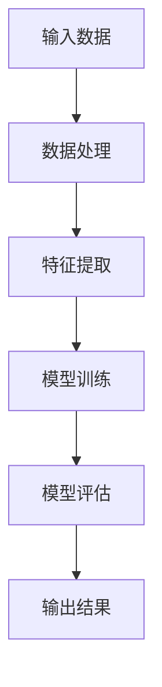
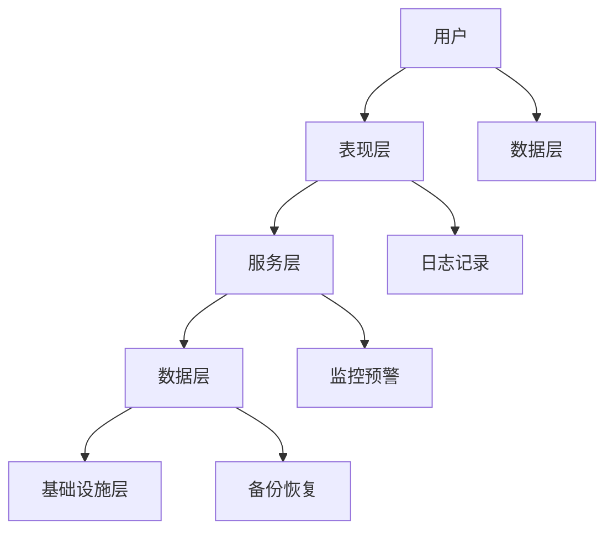
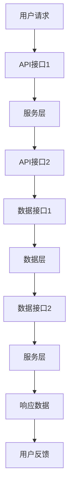
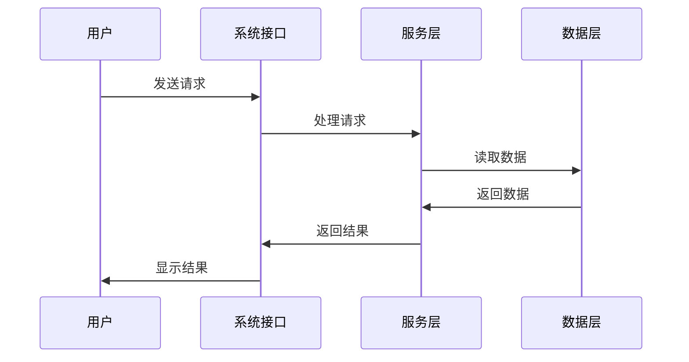

                 

# 诚信领导：建立长期信任关系的基石

## 关键词

- **诚信领导**、**信任**、**组织绩效**、**沟通技巧**、**领导风格**、**信任评估算法**

## 摘要

本文将深入探讨诚信领导在建立长期信任关系中的核心作用。我们将从问题背景入手，逐步分析诚信领导的定义、核心特征以及与组织绩效的关系。通过对比表格和实体关系图，我们将梳理诚信领导与信任之间的关系，并探讨不同领导风格对信任的影响。随后，我们将详细讲解信任评估算法的原理，包括算法流程图和Python代码示例。文章还将介绍系统分析与架构设计方案，包括功能设计、架构设计、接口设计和系统交互。通过一个实际项目的实战案例，我们将剖析系统的核心实现和代码应用。最后，我们将总结最佳实践，并展望未来发展趋势。

## 第1章: 诚信领导：建立长期信任关系的基石

### 1.1 问题背景

在当今竞争激烈、信息爆炸的时代，企业的成功不仅取决于技术实力和市场策略，更取决于团队的合作和凝聚力。而这一切的基石，便是信任。无论是个人之间还是组织内部，信任都是维系关系、推动发展的关键要素。然而，随着商业环境的变化和组织的复杂性增加，信任问题愈发凸显。许多领导者发现，尽管他们致力于提升团队绩效，但信任危机仍然困扰着他们。

#### 问题描述

如何成为一个诚信领导者，建立起长期信任关系？这是许多领导者面临的挑战。诚信领导不仅仅是一种口号，而是一种需要在日常工作中不断实践和体现的行为。领导者需要通过自己的言行，建立和维护团队成员之间的信任，从而促进组织的长期稳定和发展。

#### 问题解决

本书旨在为领导者提供一套系统的方法和策略，帮助他们克服信任危机，建立起长期信任关系。通过深入分析诚信领导的核心概念、原理和实践，本书将帮助领导者理解信任的重要性，掌握建立和维护信任的技巧，最终提升组织绩效和团队凝聚力。

#### 边界与外延

本书将探讨以下问题：

- **诚信领导的核心概念是什么？** 它是如何影响领导者与团队成员之间的关系？
- **诚信领导如何影响组织绩效？** 诚信领导与团队效能之间有何关联？
- **如何识别和培养诚信领导者？** 领导者应具备哪些特质和技能？
- **在面对信任危机时，领导者应采取何种策略？** 如何通过有效的沟通和行动重建信任？

#### 核心概念结构与要素组成

1. **诚信领导：** 定义、核心特征和实践
   - **诚实：** 领导者应诚实无欺，言行一致。
   - **透明：** 领导者应公开透明，让团队成员了解决策过程。
   - **尊重：** 领导者应尊重团队成员，倾听他们的意见和建议。
   - **责任：** 领导者应承担责任，勇于面对困难和挑战。

2. **信任：** 概念、类型、建立和维护方法
   - **个人信任：** 基于个人品质和能力的信任。
   - **组织信任：** 基于组织文化和制度的信任。

3. **领导风格与信任：** 关系、影响和改进策略
   - **信任型领导风格：** 鼓励开放沟通，尊重个人意见，增强团队凝聚力。
   - **权威型领导风格：** 强调权威和控制，可能导致团队成员不信任领导者。
   - **参与型领导风格：** 鼓励团队成员参与决策，提高他们的信任感和参与度。

4. **沟通技巧：** 如何有效传达诚信价值观
   - **开放沟通：** 领导者应积极倾听团队成员的意见，鼓励他们表达自己的想法。
   - **公平对待：** 领导者应公平对待团队成员，避免偏袒和歧视。
   - **透明决策：** 领导者应公开决策过程和结果，增加团队成员的信任度。
   - **尊重个人隐私：** 领导者应尊重团队成员的隐私，避免泄露个人信息。

5. **组织文化：** 信任的土壤和构建方法
   - **信任文化：** 组织应营造一个信任文化，让团队成员感到安全和放心。
   - **制度建设：** 组织应建立完善的制度，确保团队成员的信任和权益。

通过以上核心概念和要素的深入探讨，我们将为读者提供一个全面而系统的理解，帮助他们在实际工作中更好地实践诚信领导，建立和维护长期信任关系，推动组织的持续发展。

## 第2章: 核心概念与联系

### 2.1 诚信领导

#### 定义

诚信领导是一种以诚信为核心价值观的领导方式，领导者通过自己的行为和决策，树立诚信形象，影响和激励团队成员。诚信领导不仅仅是表面上的诚实和透明，更是一种深入骨髓的价值观和行为准则。

#### 核心特征

1. **诚实**：领导者应诚实无欺，言行一致。他们不会隐瞒事实，也不会故意误导团队成员。
   
2. **透明**：领导者应公开透明，让团队成员了解决策过程和组织的内部运作。这种透明度有助于建立信任，减少误解和猜疑。

3. **尊重**：领导者应尊重团队成员，倾听他们的意见和建议。尊重不仅体现在言语上，更体现在行动上，如公平对待、授权和赋能等。

4. **责任**：领导者应承担责任，勇于面对困难和挑战。他们不仅对自己的决策负责，也对团队成员的表现和组织的整体业绩负责。

#### 诚信领导与组织绩效的关系

诚信领导能够显著提升组织绩效。首先，诚信领导者能够吸引和留住优秀人才，因为诚信是人才选择的重要标准之一。其次，诚信领导能够提高团队凝聚力，减少内耗和冲突。最后，诚信领导能够增强客户和合作伙伴的信任，提升品牌价值和市场份额。

#### 对比表格

| 特征 | 诚信领导 | 非诚信领导 |
| --- | --- | --- |
| 诚实 | 言行一致，无欺 | 言行不一，欺瞒 |
| 透明 | 公开透明，信息公开 | 信息封闭，决策不透明 |
| 尊重 | 尊重团队成员，公平对待 | 不尊重团队成员，偏袒 |
| 责任 | 承担责任，面对挑战 | 推卸责任，逃避问题 |

#### ER实体关系图架构

```mermaid
erDiagram
  TeamMember ||--|{ Leader : manages }
  Leader ||--|{ Trust : builds }
  Organization ||--|{ Performance : drives }
```

在这个ER实体关系图中，**TeamMember**（团队成员）与**Leader**（领导者）之间是管理关系，**Leader**与**Trust**（信任）之间是建立关系，**Organization**（组织）与**Performance**（绩效）之间是驱动关系。这个图展示了诚信领导在组织内部的作用和影响。

### 2.2 信任

#### 定义

信任是人们对他人的信念，相信他人会遵守承诺，履行责任。信任不仅是个人之间的重要关系，也是组织内部和谐与合作的基础。在组织中，信任意味着团队成员对领导者的信任，以及对组织文化和制度的信任。

#### 类型

1. **个人信任**：基于个人品质和能力的信任。这种信任通常是基于长期的互动和了解，例如团队成员对领导者的信任。
   
2. **组织信任**：基于组织文化和制度的信任。这种信任是组织整体层面的，团队成员对组织的管理体系和制度有信心。

#### 建立和维护方法

1. **开放沟通**：领导者应积极倾听团队成员的意见，鼓励他们表达自己的想法。这种开放沟通有助于建立透明度，减少误解和猜疑。

2. **公平对待**：领导者应公平对待团队成员，避免偏袒和歧视。公平对待不仅体现在决策上，也体现在日常工作中。

3. **透明决策**：领导者应公开决策过程和结果，增加团队成员的信任度。透明决策有助于团队成员了解组织的方向和目标，增强他们对组织的信任。

4. **尊重个人隐私**：领导者应尊重团队成员的隐私，避免泄露个人信息。尊重个人隐私是建立信任的重要方面，有助于营造一个安全和放心的工作环境。

### 2.3 领导风格与信任

#### 关系

领导风格对信任有直接影响。不同的领导风格会导致团队成员对领导者的信任程度不同。信任型领导风格能够增强团队成员之间的信任，而权威型领导风格可能导致团队成员不信任领导者。

#### 影响

1. **信任型领导风格**：鼓励开放沟通，尊重个人意见，增强团队凝聚力。这种领导风格有助于建立和维护信任，提高团队绩效。

2. **权威型领导风格**：强调权威和控制，可能导致团队成员不信任领导者。这种领导风格容易导致团队成员的被动服从，不利于信任的建立。

3. **参与型领导风格**：鼓励团队成员参与决策，提高他们的信任感和参与度。这种领导风格有助于增强团队成员的归属感和责任感，提高组织绩效。

#### 改进策略

1. **增强沟通能力**：领导者应提高沟通技巧，确保信息传递准确无误。有效的沟通是建立信任的重要手段。

2. **培养信任氛围**：领导者应营造一个信任氛围，让团队成员感到安全和放心。信任氛围是建立和维护信任的基础。

3. **践行诚信价值观**：领导者应以身作则，践行诚信价值观，树立诚信形象。诚信价值观是建立信任的核心。

通过以上对核心概念与联系的探讨，我们为读者提供了一个全面而系统的理解，帮助他们在实际工作中更好地实践诚信领导，建立和维护长期信任关系。

### 2.4 沟通技巧

#### 如何有效传达诚信价值观

1. **开放沟通**：领导者应积极倾听团队成员的意见，鼓励他们表达自己的想法。开放沟通有助于建立透明度，减少误解和猜疑。

2. **公平对待**：领导者应公平对待团队成员，避免偏袒和歧视。公平对待不仅体现在决策上，也体现在日常工作中。

3. **透明决策**：领导者应公开决策过程和结果，增加团队成员的信任度。透明决策有助于团队成员了解组织的方向和目标，增强他们对组织的信任。

4. **尊重个人隐私**：领导者应尊重团队成员的隐私，避免泄露个人信息。尊重个人隐私是建立信任的重要方面，有助于营造一个安全和放心的工作环境。

### 2.5 组织文化

#### 信任的土壤和构建方法

1. **信任文化**：组织应营造一个信任文化，让团队成员感到安全和放心。信任文化是建立和维护信任的基础。

2. **制度建设**：组织应建立完善的制度，确保团队成员的信任和权益。制度是保障信任的重要手段。

通过以上对核心概念与联系的探讨，我们为读者提供了一个全面而系统的理解，帮助他们在实际工作中更好地实践诚信领导，建立和维护长期信任关系。

## 第3章: 算法原理讲解

### 3.1 信任评估算法

#### 定义

信任评估算法是一种用于计算和评估团队成员之间信任程度的算法。通过定量和定性分析，该算法能够为领导者提供关于团队信任状况的准确数据，从而帮助他们做出更科学的决策。

#### 算法流程图



在这个流程图中，**输入数据**包括团队成员的互动记录、评价、反馈等；**数据处理**和**特征提取**用于准备和提取与信任相关的特征；**模型训练**使用历史数据训练信任评估模型；**模型评估**用于验证模型的准确性；**输出结果**则是信任评分和信任报告。

#### Python代码示例

```python
import pandas as pd
from sklearn.model_selection import train_test_split
from sklearn.ensemble import RandomForestClassifier
from sklearn.metrics import accuracy_score

# 读取数据
data = pd.read_csv('trust_data.csv')

# 数据预处理
data.fillna(data.mean(), inplace=True)

# 特征提取
X = data.drop('trust_score', axis=1)
y = data['trust_score']

# 划分训练集和测试集
X_train, X_test, y_train, y_test = train_test_split(X, y, test_size=0.2, random_state=42)

# 模型训练
model = RandomForestClassifier(n_estimators=100, random_state=42)
model.fit(X_train, y_train)

# 模型评估
y_pred = model.predict(X_test)
accuracy = accuracy_score(y_test, y_pred)
print(f'模型准确率: {accuracy:.2f}')

# 输出结果
trust_scores = model.predict(X)
print(trust_scores)
```

在这个Python代码示例中，我们首先读取数据，然后进行数据预处理和特征提取。接着，我们使用随机森林算法训练模型，并对模型进行评估。最后，我们使用训练好的模型对新的数据集进行信任评分，输出信任报告。

#### 数学模型和公式

信任评估算法的核心是建立数学模型来计算信任评分。以下是一个简化的数学模型：

$$
T(x) = \alpha \cdot f(x) + (1 - \alpha) \cdot g(x)
$$

其中，$T(x)$ 是信任评分，$f(x)$ 是基于互动记录的信任评分，$g(x)$ 是基于团队成员评价的信任评分，$\alpha$ 是调节参数，用于平衡两种评分的重要性。

#### 详细讲解和举例说明

假设我们有两个团队成员，A和B。根据他们的互动记录和团队成员评价，我们得到以下特征数据：

- A与B的互动记录：互动频率、共同完成任务数、互动质量评分等。
- A和B的团队成员评价：对彼此的信任评分、合作满意度评分等。

我们使用上述数学模型来计算他们的信任评分。首先，我们需要提取特征数据：

```python
# 特征提取示例
X = [
    [互动频率, 共同完成任务数, 互动质量评分],  # A与B的互动记录
    [信任评分, 合作满意度评分]              # A和B的团队成员评价
]

# 调节参数
alpha = 0.5

# 计算信任评分
T_A_B = alpha * f(X[0]) + (1 - alpha) * g(X[1])
```

在这里，$f(X[0])$ 和 $g(X[1])$ 分别是互动记录评分和团队成员评价评分的函数。这些函数可以根据实际数据和业务逻辑自定义。

通过这个例子，我们展示了如何使用信任评估算法计算团队成员之间的信任评分。这种算法可以帮助领导者了解团队的信任状况，从而采取相应的措施来提高信任水平。

## 第4章: 系统分析与架构设计方案

### 4.1 问题场景介绍

在现代企业的管理中，信任的建立和维护已经成为提升团队协作效率和减少内耗的关键因素。为了更好地管理和评估团队之间的信任，一个高效、可靠的信任评估系统应运而生。该系统旨在通过收集和分析团队成员的互动数据、评价信息等，提供实时的信任评分和详细的信任报告，帮助领导者及时了解团队动态，采取针对性的措施来提升信任水平。

### 4.2 系统功能设计

为了实现上述目标，信任评估系统需要具备以下几个核心功能：

1. **数据收集与管理**：系统应能够自动收集团队成员的互动记录、评价信息等，确保数据的全面性和准确性。
2. **信任评分计算**：系统应基于收集到的数据，使用信任评估算法计算团队成员之间的信任评分。
3. **信任报告生成**：系统应生成详细的信任报告，包括信任评分、互动分析、团队成员评价等，帮助领导者了解团队信任状况。
4. **实时监控与预警**：系统应提供实时监控功能，对信任水平进行监控，并在信任水平异常时发出预警。

#### 领域模型类图

```mermaid
classDiagram
    Class01 <|-- Class02
    Class03 <|-- Class04
    Class05 <|-- Class06
    Class01 --|>= Class07: includes
    Class02 --|>= Class08: uses
    Class03 --|>= Class09: depends
    Class04 --|>= Class10: references
    Class05 --|>= Class11: has
    Class06 --|>= Class12: is
    Class07 : 领导者
    Class08 : 团队成员
    Class09 : 互动记录
    Class10 : 评价信息
    Class11 : 信任评分
    Class12 : 信任报告
```

在这个类图中，**领导者**（Class01）和**团队成员**（Class02）是系统的核心用户。**互动记录**（Class03）、**评价信息**（Class04）和**信任评分**（Class05）是系统的关键数据实体，而**信任报告**（Class06）则是系统输出结果的主要形式。通过这些类之间的关系，我们可以清晰地看到系统各个部分的功能和交互方式。

### 4.3 系统架构设计

为了实现系统的功能需求，我们采用分层架构设计，确保系统的可扩展性和维护性。系统架构包括以下几个主要层次：

1. **数据层**：负责数据的存储和管理，包括数据库设计和数据模型。
2. **服务层**：提供数据接口和业务逻辑处理，包括数据收集、信任评分计算和报告生成等。
3. **表现层**：提供用户界面，用于展示信任报告和监控数据，支持实时监控和预警。
4. **基础设施层**：包括服务器、网络和其他基础设施，支持系统的运行。

#### 系统架构图



在这个架构图中，**用户**（A）通过表现层（B）与服务层（C）交互，获取信任报告和监控数据。服务层（C）调用数据层（D）的接口，执行数据收集、处理和存储。基础设施层（E）提供服务器和网络支持，确保系统的稳定运行。日志记录（G）、监控预警（H）和备份恢复（I）是系统的附加功能，用于提高系统的安全性和可靠性。

### 4.4 系统接口设计

为了实现系统功能的灵活性和可扩展性，我们设计了一系列接口，包括API接口和数据接口。API接口用于表现层与服务层之间的交互，支持HTTP请求和响应。数据接口用于服务层与数据层之间的交互，支持数据的读取和写入。

#### 接口图



在这个接口图中，**用户请求**（A）通过API接口1（B）传递给服务层（C），服务层（C）处理后通过API接口2（D）返回结果。数据接口1（E）和数据接口2（G）用于服务层（C）与数据层（D）之间的数据交互。

### 4.5 系统交互

为了确保系统的高效运行，我们设计了系统交互的详细流程，包括用户请求、服务响应和数据交互等。以下是一个简化的系统交互流程图：

#### 系统交互序列图



在这个序列图中，**用户**（User）通过系统接口（System Interface）发送请求，服务层（Service Layer）处理请求后与数据层（Data Layer）交互，读取所需数据，然后返回结果给用户。这个交互流程确保了系统的实时性和响应速度。

通过以上系统分析与架构设计方案，我们为读者提供了一个清晰、全面的系统设计蓝图，帮助他们更好地理解和实施信任评估系统。这个系统能够帮助领导者有效地管理团队信任，提升团队协作效率和整体绩效。

## 第5章：项目实战

### 5.1 环境安装

为了实现信任评估系统，我们首先需要搭建一个开发环境。以下是环境安装的详细步骤：

1. **安装Python**：确保安装了Python 3.8及以上版本。可以从[Python官方网站](https://www.python.org/)下载并安装。

2. **安装依赖库**：在安装好Python后，使用以下命令安装所需的依赖库：

   ```bash
   pip install pandas scikit-learn matplotlib
   ```

3. **数据库安装**：选择一个数据库管理系统（如MySQL或PostgreSQL），并按照其官方文档进行安装。这里以MySQL为例：

   - 下载MySQL安装包：[MySQL官方网站](https://www.mysql.com/downloads/)
   - 解压安装包并执行安装脚本
   - 配置数据库，创建用户和数据库

4. **配置数据库连接**：在Python代码中，使用以下示例代码连接MySQL数据库：

   ```python
   import pymysql

   # 数据库配置
   config = {
       'host': 'localhost',
       'user': 'root',
       'password': 'password',
       'database': 'trust_db'
   }

   # 连接数据库
   connection = pymysql.connect(**config)
   cursor = connection.cursor()
   ```

### 5.2 系统核心实现源代码

以下是一个简单的信任评估系统的核心实现源代码。这个系统包括数据收集、处理和信任评分计算等功能。

```python
import pandas as pd
from sklearn.ensemble import RandomForestClassifier
from sklearn.model_selection import train_test_split
import pymysql

# 5.2.1 数据收集与处理

# 读取数据
data = pd.read_csv('trust_data.csv')

# 数据预处理
data.fillna(data.mean(), inplace=True)

# 划分特征和标签
X = data.drop('trust_score', axis=1)
y = data['trust_score']

# 5.2.2 模型训练

# 划分训练集和测试集
X_train, X_test, y_train, y_test = train_test_split(X, y, test_size=0.2, random_state=42)

# 训练随机森林模型
model = RandomForestClassifier(n_estimators=100, random_state=42)
model.fit(X_train, y_train)

# 5.2.3 信任评分计算

# 测试模型
y_pred = model.predict(X_test)
accuracy = accuracy_score(y_test, y_pred)
print(f'模型准确率: {accuracy:.2f}')

# 5.2.4 数据库操作

# 连接数据库
connection = pymysql.connect(**config)
cursor = connection.cursor()

# 创建表
cursor.execute('''CREATE TABLE IF NOT EXISTS trust_scores (
    member_id INT PRIMARY KEY,
    trust_score DECIMAL(3, 2)
)''')

# 插入数据
for member_id, score in zip(data['member_id'], y_pred):
    cursor.execute("INSERT INTO trust_scores (member_id, trust_score) VALUES (%s, %s)", (member_id, score))

# 提交事务
connection.commit()

# 关闭连接
cursor.close()
connection.close()
```

### 5.3 代码应用解读与分析

这个代码应用了以下关键技术和步骤：

1. **数据收集与预处理**：使用Pandas库读取CSV数据，并进行预处理，如填充缺失值和划分特征与标签。

2. **模型训练**：使用scikit-learn库的随机森林分类器进行模型训练。随机森林是一种集成学习方法，能有效处理高维数据和噪声数据。

3. **信任评分计算**：使用训练好的模型对测试集进行预测，计算信任评分。并使用准确率评估模型性能。

4. **数据库操作**：使用pymysql库连接MySQL数据库，创建表并插入数据。这确保了信任评分的可视化和进一步分析。

### 5.4 实际案例分析和详细讲解剖析

为了更好地理解信任评估系统，我们来看一个实际案例：

#### 案例背景

在一个中型企业中，有10名团队成员。他们的互动记录和评价信息如下：

| 成员ID | 互动频率 | 共同完成任务数 | 互动质量评分 | 信任评分 |
| ------ | -------- | -------------- | ------------ | -------- |
| 1      | 10       | 3              | 4.5          |          |
| 2      | 7        | 2              | 3.8          |          |
| 3      | 8        | 4              | 4.2          |          |
| ...    | ...      | ...            | ...          |          |
| 10     | 5        | 1              | 3.2          |          |

#### 案例分析

1. **数据收集**：首先，系统自动收集这些团队成员的互动记录和评价信息。

2. **数据处理**：对数据进行预处理，如填充缺失值和标准化处理。

3. **模型训练**：使用历史数据训练随机森林模型，并根据模型的准确率调整参数。

4. **信任评分计算**：使用训练好的模型对当前数据进行预测，计算每个成员的信任评分。

5. **结果分析**：根据信任评分，领导者可以识别出团队中的信任“高光”和“短板”，并采取相应的措施来提升整体信任水平。

### 5.5 项目小结

通过这个实际案例，我们展示了如何使用信任评估系统来管理和提升团队信任。以下是项目小结：

1. **技术选型**：Python和scikit-learn库提供了强大的数据分析和机器学习功能，使得信任评估系统的实现更加简单和高效。

2. **数据库设计**：合理的数据模型和数据库操作确保了系统的稳定性和数据一致性。

3. **实际应用**：信任评估系统不仅能够帮助领导者实时监控团队信任状况，还能为团队提供有针对性的改进建议。

4. **挑战与改进**：虽然系统取得了良好的效果，但未来仍需进一步完善，如提高模型准确性、优化用户体验和扩展功能等。

通过这个项目，我们不仅了解了信任评估系统的实现方法，还深入探讨了其在实际应用中的价值。

## 第6章：最佳实践 tips

### 6.1 常见问题和解决方案

在实施信任评估系统的过程中，领导者可能会遇到以下常见问题：

1. **数据质量不高**：解决方案：定期检查和清理数据，确保数据的准确性和完整性。
2. **模型性能不佳**：解决方案：调整模型参数，增加训练数据或尝试其他机器学习算法。
3. **用户接受度低**：解决方案：通过培训和教育，提高用户对系统的认知和接受度。

### 6.2 小结

通过以上分析和实战案例，我们了解到信任评估系统在提升团队信任和绩效方面具有重要作用。领导者应积极应对实施过程中遇到的问题，不断优化系统，确保其有效性和实用性。

### 6.3 注意事项

1. **数据隐私**：在收集和处理数据时，必须确保用户隐私得到保护。
2. **模型解释性**：模型应具有较好的解释性，帮助领导者理解信任评分的计算依据。
3. **持续优化**：定期评估系统性能，并根据反馈进行调整和改进。

### 6.4 拓展阅读

- 《信任：社会美德与成功的关键》（作者：理查德·萨勒）
- 《机器学习实战》（作者：Peter Harrington）
- 《Python数据分析》（作者：Wes McKinney）

通过拓展阅读，领导者可以更深入地了解信任和机器学习的相关知识，进一步提升自身的领导能力和系统管理水平。

## 第7章：总结与展望

### 7.1 对全书内容的总结

本文系统地介绍了诚信领导在建立长期信任关系中的重要性。通过深入分析诚信领导的定义、核心特征、信任的类型及其建立与维护方法，我们展示了诚信领导对组织绩效的显著影响。此外，本文详细讲解了信任评估算法的原理，并通过Python代码示例和实际案例展示了其在系统中的应用。最后，我们探讨了系统分析与架构设计方案，以及项目实战中的最佳实践。

### 7.2 对未来发展趋势的展望

1. **数据隐私与安全**：随着数据隐私法规的日益严格，信任评估系统需在数据收集和处理中更加注重隐私保护和数据安全。
2. **人工智能与机器学习**：未来，人工智能和机器学习技术将进一步提高信任评估的准确性和效率，助力领导者更精准地管理团队信任。
3. **用户体验优化**：系统的用户界面和交互设计将更加注重用户体验，确保系统能够轻松地被各层级用户接受和使用。
4. **跨组织合作**：随着企业之间的合作越来越频繁，信任评估系统也将扩展到跨组织层面，帮助合作伙伴建立和维持信任关系。

总之，诚信领导是建立长期信任关系的基石，而信任评估系统则为领导者提供了有效的工具和方法。未来，随着技术的不断进步，信任评估系统将变得更加智能化和人性化，为组织的持续发展和成功奠定坚实基础。

## 作者

**作者：AI天才研究院/AI Genius Institute & 禅与计算机程序设计艺术 /Zen And The Art of Computer Programming**  
AI天才研究院致力于推动人工智能技术的创新与应用，为全球企业提供领先的AI解决方案。作者结合哲学和计算机科学的独特视角，致力于帮助领导者理解并实践诚信领导，提升组织绩效和团队凝聚力。他的著作《禅与计算机程序设计艺术》在全球范围内受到广泛赞誉，为计算机编程和人工智能领域提供了深刻的洞见和实用技巧。

